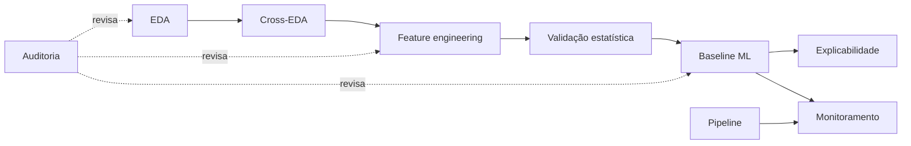

# Manifesto funcional das skills

> **DOCUMENTAÇÃO CUSTOMIZADA (`x_docs`) — não auto-descoberta pela Genie Code.**

Fonte executável: `.assistant/skills/<nome>/SKILL.md`. Este manifesto serve para
revisão humana; se divergir, corrija ambos e valide o `SKILL.md`.

| Skill | Categoria | Entrada principal | Saída principal |
|---|---|---|---|
| `rodrigo-eda-profissional` | Analytics | tabela + objetivo + grão | notebook/relatório EDA auditável |
| `rodrigo-cross-eda-ml` | Analytics/ML | outputs de EDAs relacionados | síntese cross-table + ML readiness |
| `rodrigo-feature-engineering` | ML | contrato analítico + alvo/tempo | feature specs + implementação/validação |
| `rodrigo-validacao-estatistica` | Estatística | hipótese/dataset/modo | diagnóstico, efeito, incerteza e decisão |
| `rodrigo-baseline-ml` | ML | dataset/split/target/métrica | baseline reproduzível + MLflow |
| `rodrigo-explainability` | ML responsável | modelo + amostra + objetivo | explicação global/local + limitações |
| `rodrigo-monitoramento-modelo` | MLOps | baseline + produção + política | drift/performance/ops + recomendação |
| `rodrigo-pipeline-builder` | Data/MLOps | fontes, SLA, ambientes | design/código/bundle/testes |
| `rodrigo-analise-safra` | Risco/Analytics | snapshots/cohorts/MOB | curvas/heatmap/comparação equivalente |
| `rodrigo-comentar-notebook` | Documentação | notebook + público | Markdown PRÉ/PÓS + cobertura/revisão |
| `rodrigo-tutor-databricks` | Ensino | arquivo/código/pergunta | explicação progressiva + exercícios |
| `rodrigo-auditoria-skills` | QA | output + skill produtora | relatório de conformidade priorizado |

## Regras de integração

- Skills não “disparam” outras skills automaticamente. Quando uma sequência for
  pertinente, a resposta deve declarar a ordem e o artefato transferido.
- `@nome-da-skill` é a seleção explícita suportada; aliases `/...` são convenções.
- Helpers `x_snippets` e `x_scripts` são manuais. As skills funcionam sem eles, mas
  alguns templates visuais oferecem integração opcional e devem usar fallback caso
  a biblioteca não esteja instalada.
- Skills externas da organização não fazem parte deste manifesto.

## Gate de publicação

- 12/12 `SKILL.md` com frontmatter válido.
- Nenhuma skill ultrapassa os limites internos sem progressive disclosure.
- Referências e scripts internos resolvem a partir da raiz da skill.
- Nenhuma afirmação regulatória sem fonte e revisão apropriada.
- Nenhum path, e-mail, tabela ou credencial pessoal codificado.
- Validação estática, testes de scripts e forward tests documentados.
