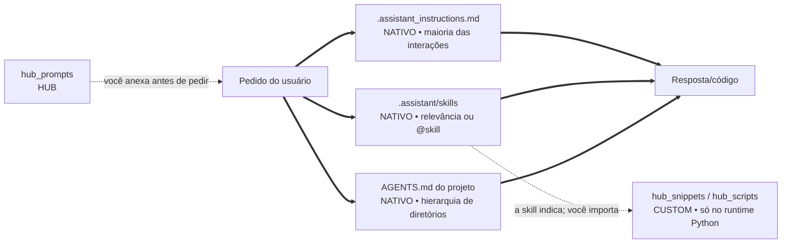
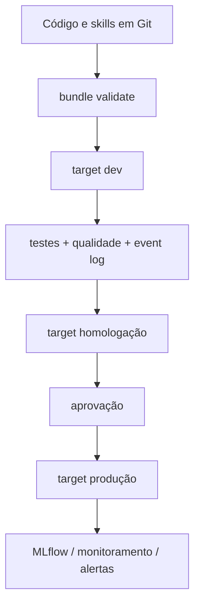

# Ecossistema `.assistant` para Databricks Genie Code

> **Este README e todos os diretórios `hub_` são documentação/extensões do Hub.**
> O Genie Code não os lê automaticamente. A estrutura nativa está identificada com
> `NATIVO` ao longo deste guia.
>
> Termo desconhecido? O [glossário](GLOSSARIO.md) separa o que é oficial da
> Databricks, o que é vocabulário de modelagem e o que é convenção deste projeto.

Um pacote de skills personalizadas, instruções pessoais, prompts guiados, contexto de
projeto e helpers de notebook para análises em Azure Databricks. A arquitetura foi
separada de propósito para que o usuário saiba exatamente o que o Genie Code carrega
e o que precisa ser adicionado ou executado manualmente.

## Visão em 30 segundos

Seta cheia é automático: acontece sem você pedir. Seta tracejada exige ação
sua — anexar, importar ou executar.



A seta tracejada entre skills e helpers é o ponto que mais gera engano: a skill
**recomenda** o módulo no texto que ela injeta, e nada mais. Quem importa é você,
no notebook. Nenhum conteúdo de `hub_snippets` entra na conversa por conta da
skill.

| Item | O Genie Code usa automaticamente? | Como usar |
|---|---:|---|
| `.assistant/skills/<skill>/SKILL.md` | **Sim** | mecanismo nativo; conteúdo `rodrigo-*` é personalizado |
| `.assistant_instructions.md` | **Sim*** | colocar em `/Users/<username>/` |
| `.assistant_workspace_instructions.md` | **Sim** | administradores do workspace; não incluído aqui |
| `AGENTS.md` / `CLAUDE.md` | **Sim** | colocar no projeto; descoberta no diretório ancestral |
| `hub_prompts/` | Não | adicionar o arquivo com `@` ou **Add context** |
| `hub_snippets/` | Não | importar explicitamente no Python |
| `hub_scripts/` | Não | importar/executar explicitamente |
| `hub_padroes/`, este README | Não | consulta humana; comece por [hub_padroes/README.md](hub_padroes/README.md) |

\* Instruções pessoais e de workspace não se aplicam a **Quick Fix** e
**Autocomplete**, conforme a documentação oficial atual.

## Estrutura

```text
/Users/<username>/
├── .assistant_instructions.md          # NATIVO: instruções pessoais
└── .assistant/
    ├── README.md                       # ← você está aqui: guia do ecossistema
    ├── GLOSSARIO.md                    # HUB: vocabulário, por procedência
    ├── CATALOGO_HELPERS.md             # HUB: mapa demanda → módulo
    ├── skills/                         # NATIVO: descoberta; hub-ml-* é do Hub
    │   └── <skill>/SKILL.md
    ├── hub_padroes/                    # HUB: os moldes de todo objeto
    ├── hub_prompts/                    # HUB: formulários de pedido
    ├── hub_snippets/                   # HUB: biblioteca Python
    └── hub_scripts/                    # HUB: utilitários de diagnóstico
```

O prefixo `hub_` significa: **parte do Hub, não interface nativa do Genie Code**.
Ele também é um identificador Python válido, o que permite importar
`hub_snippets` diretamente. As skills usam hífen (`hub-ml-<tema>`) porque quem as
nomeia é a plataforma, não o Python.

## Instalação recomendada

### Opção A — skills pessoais

1. Versione este pacote em Git.
2. Copie as pastas de skill para o diretório de usuário documentado pelo Genie Code:
   `/Users/<username>/.assistant/skills/`.
3. Copie `.assistant_instructions.md` para:
   `/Users/<username>/.assistant_instructions.md`.
4. Se quiser os helpers, copie também os diretórios `hub_` para a `.assistant`
   do usuário. Eles continuarão manuais.
5. Abra **um novo chat** no Genie Code depois da alteração. Se houver cache,
   recarregue a página.

### Opção B — skills compartilhadas no workspace

Coloque as skills em `Workspace/.assistant/skills/` para descoberta no workspace.
Use permissões e revisão por Git. Instruções de workspace ficam em
`Workspace/.assistant_workspace_instructions.md` e são administradas separadamente.

> Não publique segredos, tokens, e-mails pessoais ou caminhos de produção dentro de
> uma skill. Use placeholders e configuração do projeto.

## Como invocar as skills

| Skill | Quando usar |
|---|---|
| `@rodrigo-eda-profissional` | perfil, qualidade, univariada/bivariada e síntese executiva |
| `@rodrigo-cross-eda-ml` | consolidar múltiplas EDAs e avaliar readiness para ML |
| `@rodrigo-feature-engineering` | especificar, implementar e validar features sem leakage |
| `@rodrigo-validacao-estatistica` | pressupostos, testes, efeito, incerteza e diagnóstico pré-ML |
| `@rodrigo-baseline-ml` | baseline tabular/temporal/ranking/survival com MLflow |
| `@rodrigo-explainability` | SHAP, explicação global/local e comunicação responsável |
| `@rodrigo-monitoramento-modelo` | drift, performance, qualidade operacional e decisão de retreino |
| `@rodrigo-pipeline-builder` | Lakeflow, Jobs, bundles, qualidade e promoção entre ambientes |
| `@rodrigo-analise-safra` | cohorts/vintage, maturação e comparações em MOB equivalente |
| `@rodrigo-comentar-notebook` | documentação PRÉ/PÓS e revisão de notebook |
| `@rodrigo-tutor-databricks` | explicação didática de código, Spark, SQL e plataforma |
| `@rodrigo-auditoria-skills` | auditar output contra o contrato da skill produtora |

A descoberta automática depende do campo `description` de cada `SKILL.md`. Use a
menção `@` quando quiser seleção determinística. Textos como `/eda` ou `/baseline`
são convenções pessoais, não comandos slash registrados.

### O que digitar para acionar cada uma

Os pedidos abaixo foram exercitados contra o roteamento real e cada um acionou a
skill indicada sem precisar de `@`. Servem como referência de vocabulário: repare
que o que decide a escolha é o termo técnico do domínio, não o nome da skill.

| Skill acionada | Pedido que a aciona sozinha |
|---|---|
| eda-profissional | "Faça uma EDA completa da tabela `catalogo.crm.clientes_pf`: granularidade, chaves, qualidade de dados, distribuições e um relatório executivo ao final." |
| cross-eda-ml | "Cruze os resultados dos EDAs de clientes e cartões, avalie a viabilidade do join por CPF, o alinhamento temporal e a prontidão para ML." |
| feature-engineering | "Monte o plano de features para prever churn, com joins point-in-time, prevenção de leakage e materialização em feature table." |
| validacao-estatistica | "Antes da regressão, verifique normalidade dos resíduos, homocedasticidade e VIF, com amostragem reprodutível e effect size." |
| baseline-ml | "Treine baselines de classificação comparando LightGBM e XGBoost com split temporal anti-leakage, MLflow e scorecard final." |
| explainability | "Gere a análise SHAP global e local do modelo de propensão e um model card com limitações para público executivo." |
| monitoramento-modelo | "Implemente monitoramento do modelo: qualidade de dados, drift com PSI, performance mensal, calibração e regra de retreino." |
| pipeline-builder | "Desenhe um pipeline bronze/silver/gold com Lakeflow, expectations de qualidade e um bundle com targets dev e prod." |
| analise-safra | "Monte a análise de safras de originação com MOB, curvas de maturação, triângulo safra-calendário e alertas de deterioração." |
| comentar-notebook | "Adicione células `%md` antes e depois deste bloco, explicando objetivo, entradas, resultado e próximo passo." |
| tutor-databricks | "Me dê uma aula sobre este stack trace: o que causou o erro, como corrigir e uma analogia para eu não esquecer." |
| auditoria-skills | "Audite este relatório de EDA contra o contrato da skill produtora: completude, reprodutibilidade e score com prioridades." |

Duas observações que economizam tempo. As skills que trabalham sobre um artefato
— `comentar-notebook` e `tutor-databricks` — precisam que o artefato esteja no
chat: pedir para "explicar este notebook" sem o notebook anexado tende a não
acionar skill nenhuma. E vocabulário genérico costuma ir para o lugar errado:
"quais variáveis pesam mais no score", dito sem termo técnico, aciona
monitoramento em vez de explicabilidade; citar SHAP resolve.

## Prompts que ensinam a pedir

Os 16 arquivos de `hub_prompts/` são briefings prontos. Cada um explica o que
substituir, qual contexto adicionar, quais ações estão autorizadas, o contrato da
saída e como validar.

1. Abra um prompt em `hub_prompts/`.
2. Substitua os campos `{{...}}`.
3. Adicione tabelas/notebooks com `@` ou **Add context**.
4. Cole a seção **Prompt pronto para colar** no chat.
5. Mencione a skill sugerida com `@` se quiser forçar a rota.

Para procurar tabelas quando o nome ainda não é conhecido, use `/findTables`, que é
um recurso nativo documentado. Ele não deve ser confundido com os aliases pessoais.

## Contexto automático por projeto

O Genie Code descobre `AGENTS.md` e `CLAUDE.md` ao abrir um arquivo ou notebook e
percorrer a hierarquia de diretórios acima dele. É mecanismo **nativo**, e é o
único jeito de dar contexto de projeto sem anexar nada a cada conversa.

O que isso implica na prática:

1. O arquivo precisa estar **na árvore do projeto real** — guardá-lo aqui no
   `.assistant` não cria memória automática nenhuma.
2. A localização define o escopo: `AGENTS.md` na raiz do projeto vale para tudo
   abaixo; um em subpasta acrescenta regras só naquele escopo.
3. Crie o mais específico apenas quando aquele escopo tiver regras realmente
   diferentes — os arquivos encontrados somam contexto, não se substituem.

Conteúdo que vale a pena: objetivo e unidade de análise, recursos autorizados,
invariantes de negócio, convenções de código do projeto, comandos de validação e
limites de escrita. Evite backlog, diário de sessão e resultado transitório —
esses envelhecem e passam a atrapalhar.

## Helpers opcionais

Depois de colocar `.assistant` no caminho Python:

```python
from pathlib import Path
import sys

# Caminhos usados por código podem aparecer com o prefixo /Workspace na UI/API.
# Confirme o path do seu workspace; não confunda com o path de descoberta acima.
assistant_root = Path("/Workspace/Users/<username>/.assistant")
sys.path.insert(0, str(assistant_root))

from hub_snippets.spark.safe_display import safe_display
from hub_snippets.constants.format_br import fmt_brl
from hub_scripts.quick_profile import quick_profile
```

O import em si não imprime nada — silêncio aqui significa sucesso. Para confirmar
que a biblioteca está mesmo acessível, chame algo sem custo de Spark:

```python
from hub_snippets.constants.format_br import fmt_int, fmt_pct, fmt_brl

print(fmt_int(3375674))
print(fmt_pct(0.928))
print(fmt_brl(12345.67))
```

```text
3.375.674
92,8%
R$ 12.345,67
```

Se aparecer `ModuleNotFoundError: No module named 'hub_snippets'`, o caminho
adicionado ao `sys.path` foi o da pasta `hub_snippets` em vez do da pasta
`.assistant` que a contém — é o engano mais comum.

Para descobrir qual módulo atende a uma demanda, use o
[catálogo de helpers](CATALOGO_HELPERS.md), que organiza a biblioteca
por tarefa e marca dependências opcionais e restrições de runtime. Cada
`SKILL.md` já declara os helpers do próprio fluxo (ver ADR-0004 no repositório).

Consulte também [hub_snippets/README.md](hub_snippets/README.md) e
[hub_scripts/README.md](hub_scripts/README.md). As dependências em
`hub_snippets/requirements-optional.txt` são um inventário: instale só o subconjunto
necessário e fixe versões no projeto consumidor.

## Fluxo de engenharia recomendado para os SEUS pipelines

> **Isto não descreve como este pacote é publicado.** A publicação do
> ecossistema é uma cópia de arquivos, sem bundle. O diagrama abaixo é a
> recomendação que as skills aplicam aos pipelines de dados que **você**
> construir — mantida aqui como referência do padrão que elas seguem.



- Use Declarative Automation Bundles para definir Jobs, pipelines, modelos e
  permissões implantáveis.
- Separe targets de desenvolvimento, homologação e produção.
- Em Lakeflow Spark Declarative Pipelines, use expectations e monitore o event log.
- Para ML, registre datasets/splits, parâmetros, métricas, artefatos, assinatura e
  limitações no MLflow; use Models in Unity Catalog para governança do ciclo de vida.
- Trate thresholds como configuração versionada e calibrada, não constante universal.

## MCP e integrações

Fora do escopo deste ecossistema: **não há conexão MCP**, nem no laboratório nem
no workspace do trabalho. Se você procurava configuração de integração externa,
não há nada aqui para ajustar.

Dois avisos que evitam confusão:

- **MCP configura-se em Genie Code → Settings**, nunca por arquivo no workspace.
- Abrir aquele painel faz a **plataforma escrever**
  `/Users/<username>/.assistant/.mcp_servers.json` com a lista de conectores
  internos. Esse arquivo é saída da configuração, não entrada: criá-lo à mão não
  configura nada, e **não deve ser apagado** — a conferência do projeto o
  reconhece e o separa dos arquivos obsoletos.

Nunca armazene tokens no Git.

## Validação antes de publicar

A maior parte desta lista é executada por um comando só. O que sobra é o que
exige uma pessoa — e é justamente aí que a checagem costuma ser pulada.

**Automático** — `python tools/validate_assistant.py` cobre, e reprova, todos
estes de uma vez:

```text
[x] 12/12 pastas de skill têm SKILL.md válido
[x] frontmatter contém name e description
[x] name é idêntico ao nome da pasta
[x] nenhum caminho/e-mail pessoal ou identificador corporativo permanece
[x] referências Markdown relativas existem
[x] Python compila (AST)
[x] instruções pessoais têm menos de 20.000 caracteres
[x] arquivos decodificam como UTF-8, sem mojibake
```

**Manual** — nenhum comando substitui estes três:

```text
[ ] testes Spark rodam em uma sessão Databricks compatível
    (tools/spark_smoke_test.py; ver docs/testes/spark/)
[ ] um novo chat confirma seleção automática e @menção de cada skill
    (ver docs/testes/forward/)
[ ] prompts e projetos x_ continuam marcados como manuais na documentação
```

Sobre o frontmatter: o padrão Agent Skills admite campos além de `name` e
`description`, e este pacote não os usa. A razão é que só a `description` entra
no roteamento — campo extra vira texto que ninguém lê e que envelhece sem que
nada acuse.

## Solução de problemas

| Sintoma | Causa provável e o que fazer |
|---|---|
| skill não aparece na lista | path exato, frontmatter válido, chat novo e recarga da página |
| skill continua com o texto antigo depois de editada | metadata em cache: chat novo e, se persistir, recarregar a página |
| skill errada é escolhida | vocabulário genérico demais no pedido; use termo técnico do domínio ou `@nome-da-skill` |
| nenhuma skill é carregada | o pedido cita um artefato ("este notebook") que não está no chat; anexe-o com `@`/Add context |
| prompt de `hub_prompts` não influencia a resposta | não é automático: precisa ser adicionado com `@`/Add context |
| contexto do projeto não entra | renomeie a cópia para `AGENTS.md` e deixe-a no diretório ancestral do arquivo aberto |
| `ModuleNotFoundError: hub_snippets` | foi adicionada ao `sys.path` a pasta `hub_snippets`; o correto é a `.assistant` que a contém |
| import de módulo de ML falha | dependência opcional ausente; confira a marcação no catálogo de helpers e instale com versão fixada |
| `NOT_SUPPORTED_WITH_SERVERLESS` ao usar `cache()` | serverless não persiste; remova o cache ou rode em compute clássico |
| `.py` abre como notebook e o import quebra | foi importado no formato errado; deve ser arquivo, não notebook |
| arquivo apagado da fonte continua no workspace | a publicação sobrescreve mas não apaga; remova à mão e confira |

## Fontes oficiais

- [Agent Skills no Genie Code](https://learn.microsoft.com/en-us/azure/databricks/genie-code/skills)
- [Instruções customizadas](https://learn.microsoft.com/en-us/azure/databricks/genie-code/instructions)
- [Dicas para Genie Code](https://learn.microsoft.com/en-us/azure/databricks/genie-code/tips)
- [MCP no Genie Code](https://learn.microsoft.com/en-us/azure/databricks/genie-code/mcp)
- [Lakeflow Spark Declarative Pipelines — melhores práticas](https://learn.microsoft.com/en-us/azure/databricks/ldp/best-practices)
- [Declarative Automation Bundles](https://learn.microsoft.com/en-us/azure/databricks/dev-tools/bundles/)
- [MLflow Tracking](https://learn.microsoft.com/en-us/azure/databricks/mlflow/tracking)
- [Models in Unity Catalog](https://learn.microsoft.com/en-us/azure/databricks/machine-learning/manage-model-lifecycle/)

Revise esses links antes de uma mudança de plataforma: nomes, limites e recursos
evoluem. Este pacote separa as escolhas locais das interfaces oficiais para tornar
essa revisão mais simples.
