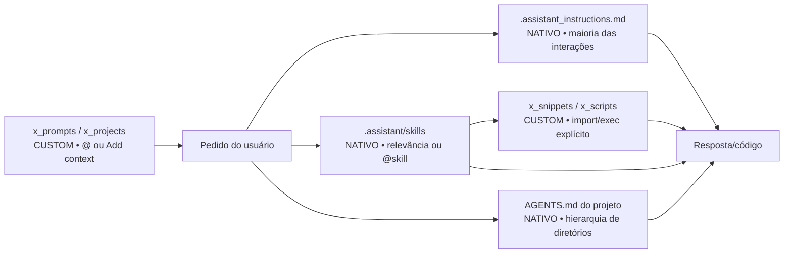
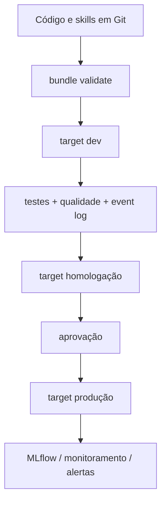

# Ecossistema `.assistant` para Databricks Genie Code

> **Este README e todos os diretórios `x_` são documentação/extensões customizadas.**
> A Genie Code não os lê automaticamente. A estrutura nativa está identificada com
> `NATIVO` ao longo deste guia.
>
> Termo desconhecido? O [glossário](x_docs/glossario.md) separa o que é oficial da
> Databricks, o que é vocabulário de modelagem e o que é convenção deste projeto.

Um pacote de 12 skills personalizadas, instruções pessoais, prompts guiados, contexto de
projeto e helpers de notebook para análises em Azure Databricks. A arquitetura foi
separada de propósito para que o usuário saiba exatamente o que a Genie Code carrega
e o que precisa ser adicionado ou executado manualmente.

## Visão em 30 segundos



| Item | A Genie Code usa automaticamente? | Como usar |
|---|---:|---|
| `.assistant/skills/<skill>/SKILL.md` | **Sim** | mecanismo nativo; conteúdo `rodrigo-*` é personalizado |
| `.assistant_instructions.md` | **Sim*** | colocar em `/Users/<username>/` |
| `.assistant_workspace_instructions.md` | **Sim** | administradores do workspace; não incluído aqui |
| `AGENTS.md` / `CLAUDE.md` | **Sim** | colocar no projeto; descoberta no diretório ancestral |
| `x_prompts/` | Não | adicionar o arquivo com `@` ou **Add context** |
| `x_projects/` | Não | copiar `AGENTS_TEMPLATE.md` como `AGENTS.md` no projeto real |
| `x_snippets/` | Não | importar explicitamente no Python |
| `x_scripts/` | Não | importar/executar explicitamente |
| `x_docs/`, `x_config/`, este README | Não | consulta humana/manual |

\* Instruções pessoais e de workspace não se aplicam a **Quick Fix** e
**Autocomplete**, conforme a documentação oficial atual.

## Estrutura

```text
<pacote>/
├── .assistant_instructions.md          # NATIVO: instruções pessoais
├── README.md                           # entrada do pacote
└── .assistant/
    ├── skills/                         # NATIVO: descoberta; rodrigo-* é custom
    │   └── <skill>/SKILL.md
    ├── x_prompts/                      # CUSTOM: 16 prompts guiados
    ├── x_projects/                     # CUSTOM: contexto + AGENTS_TEMPLATE
    ├── x_snippets/                     # CUSTOM: biblioteca Python
    ├── x_scripts/                      # CUSTOM: utilitários
    ├── x_docs/                         # CUSTOM: governança/histórico
    └── x_config/                       # CUSTOM: configuração legada/manual
```

O prefixo `x_` significa: **extensão do usuário, não interface institucional da
Genie Code**. Ele também é um identificador Python válido (`x_snippets`).

## Instalação recomendada

### Opção A — skills pessoais

1. Versione este pacote em Git.
2. Copie as 12 pastas para o diretório de usuário documentado pela Genie Code:
   `/Users/<username>/.assistant/skills/`.
3. Copie `.assistant_instructions.md` para:
   `/Users/<username>/.assistant_instructions.md`.
4. Se quiser os helpers, copie também os diretórios `x_` para a `.assistant` do
   usuário. Eles continuarão manuais.
5. Abra **um novo chat** na Genie Code depois da alteração. Se houver cache,
   recarregue a página.

### Opção B — skills compartilhadas no workspace

Coloque as skills em `Workspace/.assistant/skills/` para descoberta no workspace.
Use permissões e revisão por Git. Instruções de workspace ficam em
`Workspace/.assistant_workspace_instructions.md` e são administradas separadamente.

> Não publique segredos, tokens, e-mails pessoais ou caminhos de produção dentro de
> uma skill. Use placeholders e configuração do projeto.

## Como invocar as 12 skills

| Skill | Quando usar |
|---|---|
| `@rodrigo-eda-profissional` | perfil, qualidade, univariada/bivariada e síntese executiva |
| `@rodrigo-cross-eda-ml` | consolidar múltiplas EDAs e avaliar readiness para ML |
| `@rodrigo-feature-engineering` | especificar, implementar e validar features sem leakage |
| `@rodrigo-validacao-estatistica` | pressupostos, testes, efeito, incerteza e diagnóstico pré-ML |
| `@rodrigo-baseline-ml` | baseline tabular/temporal/ranking/survival com MLflow |
| `@rodrigo-explainability` | SHAP, explicação global/local e comunicação responsável |
| `@rodrigo-monitoramento-modelo` | drift, performance, qualidade operacional e decisão de retreino |
| `@rodrigo-pipeline-builder` | Lakeflow, Jobs, bundles, qualidade e promoção entre ambientes |
| `@rodrigo-analise-safra` | cohorts/vintage, maturação e comparações em MOB equivalente |
| `@rodrigo-comentar-notebook` | documentação PRÉ/PÓS e revisão de notebook |
| `@rodrigo-tutor-databricks` | explicação didática de código, Spark, SQL e plataforma |
| `@rodrigo-auditoria-skills` | auditar output contra o contrato da skill produtora |

A descoberta automática depende do campo `description` de cada `SKILL.md`. Use a
menção `@` quando quiser seleção determinística. Textos como `/eda` ou `/baseline`
são convenções pessoais, não comandos slash registrados.

## Prompts que ensinam a pedir

Os 16 arquivos de `x_prompts/` são briefings prontos. Cada um explica o que
substituir, qual contexto adicionar, quais ações estão autorizadas, o contrato da
saída e como validar.

1. Abra um prompt em `x_prompts/`.
2. Substitua os campos `{{...}}`.
3. Adicione tabelas/notebooks com `@` ou **Add context**.
4. Cole a seção **Prompt pronto para colar** no chat.
5. Mencione a skill sugerida com `@` se quiser forçar a rota.

Para procurar tabelas quando o nome ainda não é conhecido, use `/findTables`, que é
um recurso nativo documentado. Ele não deve ser confundido com os aliases pessoais.

## Contexto automático por projeto

Use [x_projects/AGENTS_TEMPLATE.md](x_projects/AGENTS_TEMPLATE.md):

1. Copie-o como `AGENTS.md` para a raiz do projeto real.
2. Preencha objetivos, fontes, grão, schemas, permissões, ambiente, testes e decisões.
3. Mantenha o arquivo junto do código no Git.
4. Crie `AGENTS.md` mais específico em uma subpasta somente quando esse escopo
   realmente precisar de regras diferentes.

A Genie Code descobre `AGENTS.md`/`CLAUDE.md` ao abrir um arquivo ou notebook e
percorrer a hierarquia ancestral. Um arquivo deixado apenas em `x_projects/` não é
memória automática.

## Helpers opcionais

Depois de colocar `.assistant` no caminho Python:

```python
from pathlib import Path
import sys

# Caminhos usados por código podem aparecer com o prefixo /Workspace na UI/API.
# Confirme o path do seu workspace; não confunda com o path de descoberta acima.
assistant_root = Path("/Workspace/Users/<username>/.assistant")
sys.path.insert(0, str(assistant_root))

from x_snippets.spark.safe_display import safe_display
from x_snippets.constants.format_br import fmt_brl
from x_scripts.quick_profile import quick_profile
```

Para descobrir qual módulo atende a uma demanda, use o
[catálogo de helpers](x_docs/catalogo_helpers.md): 54 módulos organizados por
tarefa, com dependências opcionais e restrições de runtime marcadas. Cada
`SKILL.md` já declara os helpers do próprio fluxo (ver ADR-0004 no repositório).

Consulte também [x_snippets/README.md](x_snippets/README.md) e
[x_scripts/README.md](x_scripts/README.md). As dependências em
`x_snippets/requirements-optional.txt` são um inventário: instale só o subconjunto
necessário e fixe versões no projeto consumidor.

## Fluxo de engenharia recomendado



- Use Declarative Automation Bundles para definir Jobs, pipelines, modelos e
  permissões implantáveis.
- Separe targets de desenvolvimento, homologação e produção.
- Em Lakeflow Spark Declarative Pipelines, use expectations e monitore o event log.
- Para ML, registre datasets/splits, parâmetros, métricas, artefatos, assinatura e
  limitações no MLflow; use Models in Unity Catalog para governança do ciclo de vida.
- Trate thresholds como configuração versionada e calibrada, não constante universal.

## MCP e integrações

`x_config/mcp_servers.legacy.json` é apenas um artefato legado preservado. Ele **não
configura MCP na Genie Code**. Faça integrações suportadas na página **Settings** da
Genie Code e aplique o princípio do menor privilégio. Nunca armazene tokens no Git.

## Validação antes de publicar

```text
[ ] 12/12 pastas de skill têm SKILL.md válido
[ ] frontmatter contém name e description; este pacote omite extras por convenção conservadora
[ ] cada skill passa o validador local adotado pelo projeto
[ ] nenhum caminho/e-mail pessoal permanece
[ ] referências Markdown relativas existem
[ ] Python compila e testes driver-side passam
[ ] testes Spark rodam em uma sessão Databricks compatível
[ ] instruções pessoais têm menos de 20.000 caracteres
[ ] prompts e projetos x_ continuam marcados como manuais
[ ] um novo chat confirma seleção automática e @menção de cada skill
```

## Solução de problemas

| Sintoma | Verificação |
|---|---|
| skill não aparece | path exato, frontmatter, novo chat e hard refresh |
| skill errada é escolhida | melhore `description` ou use `@nome-da-skill` |
| prompt não influencia a resposta | adicione o arquivo com `@`/Add context; `x_prompts` não é automático |
| contexto do projeto não entra | renomeie a cópia para `AGENTS.md` e deixe-a no ancestral do arquivo aberto |
| `x_snippets` não importa | adicione a pasta `.assistant`, não `x_snippets`, ao `sys.path` |
| pacote falha em serverless | instale dependências no escopo suportado e confirme compatibilidade do runtime |
| MCP não conecta | configure em Settings; ignore o JSON legado |

## Fontes oficiais

- [Agent Skills na Genie Code](https://learn.microsoft.com/en-us/azure/databricks/genie-code/skills)
- [Instruções customizadas](https://learn.microsoft.com/en-us/azure/databricks/genie-code/instructions)
- [Dicas para Genie Code](https://learn.microsoft.com/en-us/azure/databricks/genie-code/tips)
- [MCP na Genie Code](https://learn.microsoft.com/en-us/azure/databricks/genie-code/mcp)
- [Lakeflow Spark Declarative Pipelines — melhores práticas](https://learn.microsoft.com/en-us/azure/databricks/ldp/best-practices)
- [Declarative Automation Bundles](https://learn.microsoft.com/en-us/azure/databricks/dev-tools/bundles/)
- [MLflow Tracking](https://learn.microsoft.com/en-us/azure/databricks/mlflow/tracking)
- [Models in Unity Catalog](https://learn.microsoft.com/en-us/azure/databricks/machine-learning/manage-model-lifecycle/)

Revise esses links antes de uma mudança de plataforma: nomes, limites e recursos
evoluem. Este pacote separa as escolhas locais das interfaces oficiais para tornar
essa revisão mais simples.
