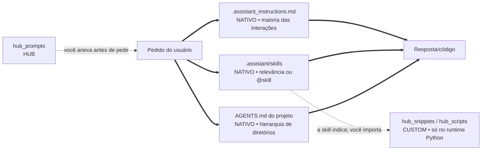
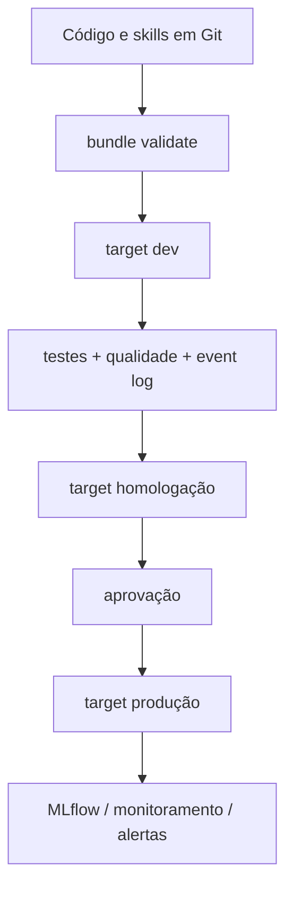

# Ecossistema `.assistant` para Databricks Genie Code

> **Este README e todos os diretórios `hub_` são documentação/extensões do Hub.**
> O Genie Code não os lê automaticamente. A estrutura nativa está identificada com
> `NATIVO` ao longo deste guia.
>
> Termo desconhecido? O [glossário](#glossário) — última seção deste arquivo —
> separa o que é oficial da Databricks, o que é vocabulário de modelagem e o que
> é convenção deste projeto.

Um pacote de skills personalizadas, instruções pessoais, prompts guiados, contexto de
projeto e helpers de notebook para análises em Azure Databricks. A arquitetura foi
separada de propósito para que o usuário saiba exatamente o que o Genie Code carrega
e o que precisa ser adicionado ou executado manualmente.

## O que você veio fazer

| Sua pergunta | Vá para |
|---|---|
| "o que é isto, em trinta segundos?" | [Visão em 30 segundos](#visão-em-30-segundos) |
| "onde fica cada coisa?" | [Estrutura](#estrutura) |
| "como instalo no meu workspace?" | [Instalação recomendada](#instalação-recomendada) |
| "como faço a skill certa aparecer?" | [Como invocar as skills](#como-invocar-as-skills) |
| "não sei nem o que pedir" | [Prompts que ensinam a pedir](#prompts-que-ensinam-a-pedir) |
| "existe função pronta para isto?" | o [catálogo](CATALOGO_HELPERS.md) e [Helpers opcionais](#helpers-opcionais) |
| "como uso este helper, na prática?" | [o notebook de cada um](#cada-helper-vem-com-um-notebook-que-o-ensina) |
| "como isto entra num pipeline de verdade?" | [Fluxo de engenharia](#fluxo-de-engenharia-recomendado-para-os-seus-pipelines) |
| "vou publicar; o que confiro antes?" | [Validação antes de publicar](#validação-antes-de-publicar) |
| "deu erro" | [Solução de problemas](#solução-de-problemas) |
| "o que significa este termo?" | [Glossário](#glossário) |

## Visão em 30 segundos

Seta cheia é automático: acontece sem você pedir. Seta tracejada exige ação
sua — anexar, importar ou executar.



A seta tracejada entre skills e helpers é o ponto que mais gera engano: a skill
**recomenda** o módulo no texto que ela injeta, e nada mais. Quem importa é você,
no notebook. Nenhum conteúdo de `hub_snippets` entra na conversa por conta da
skill.

| Item | O Genie Code usa automaticamente? | Como usar |
|---|---:|---|
| `.assistant/skills/<skill>/SKILL.md` | **Sim** | mecanismo nativo; conteúdo `hub-ml-*` é personalizado |
| `.assistant_instructions.md` | **Sim*** | colocar em `/Users/<username>/` |
| `.assistant_workspace_instructions.md` | **Sim** | administradores do workspace; não incluído aqui |
| `AGENTS.md` / `CLAUDE.md` | **Sim** | colocar no projeto; descoberta no diretório ancestral |
| `hub_prompts/` | Não | adicionar o arquivo com `@` ou **Add context** |
| `hub_snippets/` | Não | importar explicitamente no Python |
| `hub_scripts/` | Não | importar/executar explicitamente |
| `hub_padroes/`, este README | Não | consulta humana; comece por [hub_padroes/README.md](hub_padroes/README.md) |

\* Instruções pessoais e de workspace não se aplicam a **Quick Fix** e
**Autocomplete**, conforme a documentação oficial atual.

## Estrutura

```text
/Users/<username>/
├── .assistant_instructions.md          # NATIVO: instruções pessoais
└── .assistant/
    ├── README.md                       # ← você está aqui: guia + glossário
    ├── CATALOGO_HELPERS.md             # HUB: mapa demanda → módulo
    ├── skills/                         # NATIVO: descoberta; hub-ml-* é do Hub
    │   └── <skill>/SKILL.md
    ├── hub_padroes/                    # HUB: os moldes de todo objeto
    ├── hub_prompts/                    # HUB: formulários de pedido
    ├── hub_snippets/                   # HUB: biblioteca Python, 51 objetos
    │   └── <secao>/<objeto>/           #      cada objeto é uma pasta:
    │       ├── __init__.py             #      a API pública, gerada
    │       ├── <objeto>.py             #      a implementação
    │       └── exemplo_<objeto>.py     #      o notebook que o ensina
    └── hub_scripts/                    # HUB: diagnóstico, 7 objetos, mesma forma
```

O prefixo `hub_` significa: **parte do Hub, não interface nativa do Genie Code**.
Ele também é um identificador Python válido, o que permite importar
`hub_snippets` diretamente. As skills usam hífen (`hub-ml-<tema>`) porque quem as
nomeia é a plataforma, não o Python.

## Instalação recomendada

### Opção A — skills pessoais

1. Versione este pacote em Git.
2. Copie as pastas de skill para o diretório de usuário documentado pelo Genie Code:
   `/Users/<username>/.assistant/skills/`.
3. Copie `.assistant_instructions.md` para:
   `/Users/<username>/.assistant_instructions.md`.
4. Se quiser os helpers, copie também os diretórios `hub_` para a `.assistant`
   do usuário. Eles continuarão manuais.
5. Abra **um novo chat** no Genie Code depois da alteração. Se houver cache,
   recarregue a página.

### Opção B — skills compartilhadas no workspace

Coloque as skills em `Workspace/.assistant/skills/` para descoberta no workspace.
Use permissões e revisão por Git. Instruções de workspace ficam em
`Workspace/.assistant_workspace_instructions.md` e são administradas separadamente.

> Não publique segredos, tokens, e-mails pessoais ou caminhos de produção dentro de
> uma skill. Use placeholders e configuração do projeto.

## Como invocar as skills

| Skill | Quando usar |
|---|---|
| `@hub-ml-eda-profissional` | perfil, qualidade, univariada/bivariada e síntese executiva |
| `@hub-ml-cross-eda-ml` | consolidar múltiplas EDAs e avaliar readiness para ML |
| `@hub-ml-feature-engineering` | especificar, implementar e validar features sem leakage |
| `@hub-ml-validacao-estatistica` | pressupostos, testes, efeito, incerteza e diagnóstico pré-ML |
| `@hub-ml-baseline-ml` | baseline tabular/temporal/ranking/survival com MLflow |
| `@hub-ml-explainability` | SHAP, explicação global/local e comunicação responsável |
| `@hub-ml-monitoramento-modelo` | drift, performance, qualidade operacional e decisão de retreino |
| `@hub-ml-pipeline-builder` | Lakeflow, Jobs, bundles, qualidade e promoção entre ambientes |
| `@hub-ml-analise-safra` | cohorts/vintage, maturação e comparações em MOB equivalente |
| `@hub-ml-comentar-notebook` | documentação PRÉ/PÓS e revisão de notebook |
| `@hub-ml-tutor-databricks` | explicação didática de código, Spark, SQL e plataforma |
| `@hub-ml-auditoria-skills` | auditar output contra o contrato da skill produtora |

A descoberta automática depende do campo `description` de cada `SKILL.md`. Use a
menção `@` quando quiser seleção determinística. Textos como `/eda` ou `/baseline`
são convenções pessoais, não comandos slash registrados.

### O que digitar para acionar cada uma

Os pedidos abaixo foram exercitados contra o roteamento real e cada um acionou a
skill indicada sem precisar de `@`. Servem como referência de vocabulário: repare
que o que decide a escolha é o termo técnico do domínio, não o nome da skill.

| Skill acionada | Pedido que a aciona sozinha |
|---|---|
| eda-profissional | "Faça uma EDA completa da tabela `catalogo.crm.clientes_pf`: granularidade, chaves, qualidade de dados, distribuições e um relatório executivo ao final." |
| cross-eda-ml | "Cruze os resultados dos EDAs de clientes e cartões, avalie a viabilidade do join por CPF, o alinhamento temporal e a prontidão para ML." |
| feature-engineering | "Monte o plano de features para prever churn, com joins point-in-time, prevenção de leakage e materialização em feature table." |
| validacao-estatistica | "Antes da regressão, verifique normalidade dos resíduos, homocedasticidade e VIF, com amostragem reprodutível e effect size." |
| baseline-ml | "Treine baselines de classificação comparando LightGBM e XGBoost com split temporal anti-leakage, MLflow e scorecard final." |
| explainability | "Gere a análise SHAP global e local do modelo de propensão e um model card com limitações para público executivo." |
| monitoramento-modelo | "Implemente monitoramento do modelo: qualidade de dados, drift com PSI, performance mensal, calibração e regra de retreino." |
| pipeline-builder | "Desenhe um pipeline bronze/silver/gold com Lakeflow, expectations de qualidade e um bundle com targets dev e prod." |
| analise-safra | "Monte a análise de safras de originação com MOB, curvas de maturação, triângulo safra-calendário e alertas de deterioração." |
| comentar-notebook | "Adicione células `%md` antes e depois deste bloco, explicando objetivo, entradas, resultado e próximo passo." |
| tutor-databricks | "Me dê uma aula sobre este stack trace: o que causou o erro, como corrigir e uma analogia para eu não esquecer." |
| auditoria-skills | "Audite este relatório de EDA contra o contrato da skill produtora: completude, reprodutibilidade e score com prioridades." |

Duas observações que economizam tempo. As skills que trabalham sobre um artefato
— `comentar-notebook` e `tutor-databricks` — precisam que o artefato esteja no
chat: pedir para "explicar este notebook" sem o notebook anexado tende a não
acionar skill nenhuma. E vocabulário genérico costuma ir para o lugar errado:
"quais variáveis pesam mais no score", dito sem termo técnico, aciona
monitoramento em vez de explicabilidade; citar SHAP resolve.

## Prompts que ensinam a pedir

Os 16 arquivos de `hub_prompts/` são briefings prontos. Cada um explica o que
substituir, qual contexto adicionar, quais ações estão autorizadas, o contrato da
saída e como validar.

1. Abra um prompt em `hub_prompts/`.
2. Substitua os campos `{{...}}`.
3. Adicione tabelas/notebooks com `@` ou **Add context**.
4. Cole a seção **Prompt pronto para colar** no chat.
5. Mencione a skill sugerida com `@` se quiser forçar a rota.

Para procurar tabelas quando o nome ainda não é conhecido, use `/findTables`, que é
um recurso nativo documentado. Ele não deve ser confundido com os aliases pessoais.

## Contexto automático por projeto

O Genie Code descobre `AGENTS.md` e `CLAUDE.md` ao abrir um arquivo ou notebook e
percorrer a hierarquia de diretórios acima dele. É mecanismo **nativo**, e é o
único jeito de dar contexto de projeto sem anexar nada a cada conversa.

O que isso implica na prática:

1. O arquivo precisa estar **na árvore do projeto real** — guardá-lo aqui no
   `.assistant` não cria memória automática nenhuma.
2. A localização define o escopo: `AGENTS.md` na raiz do projeto vale para tudo
   abaixo; um em subpasta acrescenta regras só naquele escopo.
3. Crie o mais específico apenas quando aquele escopo tiver regras realmente
   diferentes — os arquivos encontrados somam contexto, não se substituem.

Conteúdo que vale a pena: objetivo e unidade de análise, recursos autorizados,
invariantes de negócio, convenções de código do projeto, comandos de validação e
limites de escrita. Evite backlog, diário de sessão e resultado transitório —
esses envelhecem e passam a atrapalhar.

## Cada helper vem com um notebook que o ensina

Esta é a parte do Hub que mais economiza tempo, e a menos óbvia: **os 58 objetos
da biblioteca têm, cada um, um notebook próprio na mesma pasta.**

```text
hub_snippets/spark/safe_display/
├── __init__.py                 # a API pública
├── safe_display.py             # a implementação
└── exemplo_safe_display.py     # ← abra este primeiro
```

No workspace, o `exemplo_*` aparece **como notebook**, sem a extensão `.py`. O
módulo ao lado, com a mesma aparência, é arquivo comum — essa diferença é o que
mantém o `import` funcionando, e é por isso que a publicação confere o tipo de
cada um.

**O que você encontra dentro**, na mesma ordem:

| Parte | O que responde |
|---|---|
| Cabeçalho | qual problema real este helper resolve, e o que dá errado sem ele |
| Tabela de ambiente | compute, bibliotecas, se escreve algo, e se há diferença entre Free e trabalho |
| Demonstração | o erro acontecendo **antes** da correção, quando o objeto tem um erro típico associado |
| Leitura | a saída real da execução colada, com os números que a prosa comenta |
| "Quando **não** usar" | os casos em que o helper é a escolha errada |

A última seção costuma ser a mais útil. Um helper que só documenta quando usar
transfere para você a decisão mais difícil — e ela existe nos **58**, sem
exceção.

**A seção de Leitura ainda falta em onze.** São notebooks escritos antes de a
regra existir, e o validador os lista como aviso a cada execução; a lista está em
`PLANO_HUB.md` §12.1. Nesses onze o notebook roda e ensina, mas você precisa
executar para ver o número — a prosa não o traz.

**Os que precisam de biblioteca opcional instalam sozinhos.** Quinze objetos —
quatorze de `ml/` e o `display/dataframe_styled` — abrem com `%pip install` na
primeira célula, seguido de `%restart_python`, e rodam de ponta a ponta sem
preparação. O custo é de cerca de um minuto, ou cinco
nos três que dependem de `torch`.

**Dois notebooks trazem um bloco de "não executado".** É deliberado e vale
confiar nele: significa que aquele trecho não roda no ambiente onde foi escrito,
com o motivo verificado e o erro real citado.

| Notebook | Por que não roda no Free |
|---|---|
| `ml/mlflow_run` | nenhum run do MLflow abre no serverless — o `MlflowClient` lê uma config que o Spark Connect recusa |
| `ml/explainability_report` | `DataFrame.to_markdown()` exige `tabulate`, que o runtime não traz |

**Um terceiro caso existe e é tratado de outra forma**, que vale conhecer:
`display/correlation_matrix` **executa** e captura o erro real num `try/except`,
colando o `Py4JError` como saída. A API clássica de `pyspark.ml` não é exposta
pelo Spark Connect, e mostrar o erro acontecendo é evidência mais forte que
descrevê-lo. Os três estão na matriz de diferenças entre Free e trabalho.

## Helpers opcionais

Depois de colocar `.assistant` no caminho Python:

```python
from pathlib import Path
import sys

# Caminhos usados por código podem aparecer com o prefixo /Workspace na UI/API.
# Confirme o path do seu workspace; não confunda com o path de descoberta acima.
assistant_root = Path("/Workspace/Users/<username>/.assistant")
sys.path.insert(0, str(assistant_root))

from hub_snippets.spark.safe_display import safe_display
from hub_snippets.constants.format_br import fmt_brl
from hub_scripts.quick_profile import quick_profile
```

O import em si não imprime nada — silêncio aqui significa sucesso. Para confirmar
que a biblioteca está mesmo acessível, chame algo sem custo de Spark:

```python
from hub_snippets.constants.format_br import fmt_int, fmt_pct, fmt_brl

print(fmt_int(3375674))
print(fmt_pct(0.928))
print(fmt_brl(12345.67))
```

```text
3.375.674
92,8%
R$ 12.345,67
```

Se aparecer `ModuleNotFoundError: No module named 'hub_snippets'`, o caminho
adicionado ao `sys.path` foi o da pasta `hub_snippets` em vez do da pasta
`.assistant` que a contém — é o engano mais comum.

Para descobrir qual módulo atende a uma demanda, use o
[catálogo de helpers](CATALOGO_HELPERS.md), que organiza a biblioteca
por tarefa e marca dependências opcionais e restrições de runtime. Cada
`SKILL.md` já declara os helpers do próprio fluxo (ver ADR-0004 no repositório).

Consulte também [hub_snippets/README.md](hub_snippets/README.md) e
[hub_scripts/README.md](hub_scripts/README.md). As dependências em
`hub_snippets/requirements-optional.txt` são um inventário: instale só o subconjunto
necessário e fixe versões no projeto consumidor.

## Fluxo de engenharia recomendado para os SEUS pipelines

> **Isto não descreve como este pacote é publicado.** A publicação do
> ecossistema é uma cópia de arquivos, sem bundle. O diagrama abaixo é a
> recomendação que as skills aplicam aos pipelines de dados que **você**
> construir — mantida aqui como referência do padrão que elas seguem.



- Use Declarative Automation Bundles para definir Jobs, pipelines, modelos e
  permissões implantáveis.
- Separe targets de desenvolvimento, homologação e produção.
- Em Lakeflow Spark Declarative Pipelines, use expectations e monitore o event log.
- Para ML, registre datasets/splits, parâmetros, métricas, artefatos, assinatura e
  limitações no MLflow; use Models in Unity Catalog para governança do ciclo de vida.
- Trate thresholds como configuração versionada e calibrada, não constante universal.

## MCP e integrações

Fora do escopo deste ecossistema: **não há conexão MCP**, nem no laboratório nem
no workspace do trabalho. Se você procurava configuração de integração externa,
não há nada aqui para ajustar.

Dois avisos que evitam confusão:

- **MCP configura-se em Genie Code → Settings**, nunca por arquivo no workspace.
- Abrir aquele painel faz a **plataforma escrever**
  `/Users/<username>/.assistant/.mcp_servers.json` com a lista de conectores
  internos. Esse arquivo é saída da configuração, não entrada: criá-lo à mão não
  configura nada, e **não deve ser apagado** — a conferência do projeto o
  reconhece e o separa dos arquivos obsoletos.

Nunca armazene tokens no Git.

## Validação antes de publicar

A maior parte desta lista é executada por um comando só. O que sobra é o que
exige uma pessoa — e é justamente aí que a checagem costuma ser pulada.

**Automático** — `python tools/validate_assistant.py` cobre, e reprova, todos
estes de uma vez:

```text
[x] 12/12 pastas de skill têm SKILL.md válido
[x] frontmatter contém name e description
[x] name é idêntico ao nome da pasta
[x] nenhum caminho/e-mail pessoal ou identificador corporativo permanece
[x] referências Markdown relativas existem
[x] Python compila (AST)
[x] instruções pessoais têm menos de 20.000 caracteres
[x] arquivos decodificam como UTF-8, sem mojibake
```

**Manual** — nenhum comando substitui estes três:

```text
[ ] testes Spark rodam em uma sessão Databricks compatível
    (tools/spark_smoke_test.py; ver docs/testes/spark/)
[ ] um novo chat confirma seleção automática e @menção de cada skill
    (ver docs/testes/forward/)
[ ] prompts e projetos x_ continuam marcados como manuais na documentação
```

Sobre o frontmatter: o padrão Agent Skills admite campos além de `name` e
`description`, e este pacote não os usa. A razão é que só a `description` entra
no roteamento — campo extra vira texto que ninguém lê e que envelhece sem que
nada acuse.

## Solução de problemas

| Sintoma | Causa provável e o que fazer |
|---|---|
| skill não aparece na lista | path exato, frontmatter válido, chat novo e recarga da página |
| skill continua com o texto antigo depois de editada | metadata em cache: chat novo e, se persistir, recarregar a página |
| skill errada é escolhida | vocabulário genérico demais no pedido; use termo técnico do domínio ou `@nome-da-skill` |
| nenhuma skill é carregada | o pedido cita um artefato ("este notebook") que não está no chat; anexe-o com `@`/Add context |
| prompt de `hub_prompts` não influencia a resposta | não é automático: precisa ser adicionado com `@`/Add context |
| contexto do projeto não entra | renomeie a cópia para `AGENTS.md` e deixe-a no diretório ancestral do arquivo aberto |
| `ModuleNotFoundError: hub_snippets` | foi adicionada ao `sys.path` a pasta `hub_snippets`; o correto é a `.assistant` que a contém |
| import de módulo de ML falha | dependência opcional ausente; confira a marcação no catálogo de helpers e instale com versão fixada |
| `NOT_SUPPORTED_WITH_SERVERLESS` ao usar `cache()` | serverless não persiste; remova o cache ou rode em compute clássico |
| `.py` abre como notebook e o import quebra | foi importado no formato errado; deve ser arquivo, não notebook |
| arquivo apagado da fonte continua no workspace | a publicação sobrescreve mas não apaga; remova à mão e confira |

## Glossário

Os termos deste projeto vêm de três procedências diferentes, e confundi-las é a
principal fonte de mal-entendido. Um termo de **plataforma** é oficial da
Databricks e você encontra na documentação deles. Um termo de **modelagem** é
vocabulário de estatística e machine learning, independente de ferramenta. Um
termo de **convenção** foi criado aqui e não existe fora deste repositório —
procurar por ele na documentação oficial não devolve nada.

### Plataforma — vocabulário oficial da Databricks

| Termo | O que é | Onde aparece aqui |
|---|---|---|
| **Genie Code** | Assistente de código do Databricks, integrado ao workspace. É ele quem lê as skills e as instruções. | É o destinatário de tudo neste ecossistema |
| **Agent Skills** | Padrão aberto (agentskills.io) para dar a um assistente instruções especializadas em pastas. A Databricks adotou o padrão. | As 12 pastas `hub-ml-*` em `skills/` |
| **`SKILL.md`** | Arquivo obrigatório de cada skill. Contém o cabeçalho de identificação e as instruções do fluxo. | Um por pasta de skill |
| **Frontmatter** | Bloco de metadados no topo do arquivo, delimitado por `---`. Aqui carrega `name` e `description`. Texto antes dele invalida o arquivo. | Primeiras linhas de todo `SKILL.md` |
| **Auto-descoberta** | Capacidade do Genie Code de encontrar e carregar um arquivo sozinho, sem você pedir. Vale para skills, instruções e `AGENTS.md` — e para mais nada. | Motivo do prefixo `hub_` (ver convenção) |
| **`description`** | Campo do frontmatter que descreve quando a skill deve ser usada. É o **único** texto que o Genie Code lê para decidir qual skill carregar. | Determina o roteamento; alterá-la exige reteste |
| **`@menção`** | Digitar `@nome-da-skill` no chat força o carregamento daquela skill, sem depender da escolha automática. | Forma determinística de invocar uma skill |
| **Add context** | Botão do painel que anexa um arquivo, tabela ou notebook ao chat. É como conteúdo não auto-descoberto entra no contexto. | Junto com `@`, é o que traz `hub_prompts` e `hub_padroes` — nunca automático |
| **`/findTables`** | Comando nativo do Genie Code para localizar tabelas cujo nome você não sabe. | Não confundir com `/eda` e similares, que não existem |
| **Instruções pessoais** | Arquivo `.assistant_instructions.md` na sua pasta de usuário, com preferências aplicadas à maioria das interações. Limite de 20.000 caracteres. | Raiz de `ambiente_fonte/` |
| **`AGENTS.md`** | Arquivo de contexto de projeto, descoberto automaticamente ao abrir um arquivo e subir a hierarquia de diretórios. `CLAUDE.md` cumpre o mesmo papel. | Modelo em `docs/historico/`, no repositório |
| **Serverless** | Compute gerenciado pela Databricks, sem cluster para configurar. É o único disponível na Free Edition e tem restrições — não aceita `cache()`, por exemplo. | Onde os helpers foram testados |
| **Unity Catalog** | Camada de governança de dados: catálogos, schemas, tabelas, permissões e linhagem. Origem do padrão `catalog.schema.table`. | Exemplos de acesso a dados |
| **MLflow** | Ferramenta de registro de experimentos: parâmetros, métricas, artefatos e versões de modelo. | Skills de baseline e monitoramento |
| **Lakeflow Spark Declarative Pipelines** | Framework declarativo de pipelines, com expectativas de qualidade e log de eventos. Nome anterior: Delta Live Tables. | Skill de pipeline |
| **Declarative Automation Bundles** | Empacotamento versionável de jobs, pipelines e permissões, com ambientes separados. Nome anterior: Databricks Asset Bundles. | Skill de pipeline |
| **Git folder** | Repositório Git clonado dentro do workspace. Não é onde as skills são descobertas — é só uma cópia do código. | Rota recomendada de replicação |
| **Quick Fix / Autocomplete** | Sugestões pontuais do editor. Exceção oficial: instruções pessoais **não** se aplicam a elas. | Limite documentado das instruções |
| **Driver-side** | Calculado na máquina que coordena o job, não distribuído pelo cluster. Rápido em dado pequeno, e a forma clássica de derrubar um notebook quando o dado é grande. Helpers marcados assim esperam amostra, não a tabela inteira. | `hub_snippets.ml.drift_detection` |
| **Bronze / silver / gold** | Convenção de camadas: bronze recebe o dado bruto, silver limpa e padroniza, gold entrega pronto para consumo. É organização, não exigência da plataforma. | Skill de pipeline |
| **Expectations** | Regras de qualidade declaradas dentro do pipeline Lakeflow, que registram ou barram linhas fora do esperado. Diferente de checagem avulsa em notebook. | Skill de pipeline |
| **Readiness (para ML)** | Avaliação de se os dados sustentam modelagem: cobertura, alinhamento temporal, sinal e qualidade. Responde "dá para modelar?" antes de tentar. | Skill de cross-EDA |
| **Event log** | Tabela que um pipeline Lakeflow escreve sozinho, com um registro por evento de execução: expectations violadas, linhas processadas, falhas. É onde se investiga o que aconteceu numa rodada, sem instrumentar nada. | Fluxo de engenharia; limites de `hub_scripts` |
| **Target (de bundle)** | Ambiente de destino declarado num Declarative Automation Bundle — tipicamente `dev`, `homologação` e `prod`. Cada um aponta para catálogo, schema e permissões próprios, e é o que impede um deploy de desenvolvimento tocar produção. | Diagrama do fluxo de engenharia |
| **Autologging** | Registro automático de parâmetros, métricas e modelo pelo MLflow, ligado por padrão no Databricks. Ele intercepta o `fit` mesmo quando o código não pede nada — e é por isso que aparece como causa de falha com bibliotecas incompatíveis. | `docs/testes/spark/` |
| **PII** | *Personally identifiable information*: dado que identifica uma pessoa (CPF, nome, e-mail, telefone, endereço). Nunca entra neste repositório nem no laboratório Free, em nenhuma hipótese — placeholders sempre. | Regras de edição e checklists |

### Modelagem — vocabulário de estatística e ML

| Termo | O que é | Onde aparece aqui |
|---|---|---|
| **Leakage** | Vazamento de informação do futuro para o treino do modelo. Produz resultado excelente no teste e fracasso em produção. É o erro mais caro da área. | Proibição central das instruções e skills |
| **Split temporal** | Separação de treino e teste por período de calendário, não por sorteio de linhas. É o que impede leakage quando há tempo envolvido. | `hub_snippets.ml.split_temporal` |
| **Walk-forward** | Validação que avança no tempo, retreinando a cada janela, imitando o uso real do modelo. | `hub_snippets.ml.walk_forward` |
| **PSI / CSI** | Índices que medem o quanto uma distribuição mudou entre dois períodos. Não têm faixa universal de corte: o limite é calibrado por modelo e feature. | Monitoramento e comparação de safras |
| **KS** | Teste que mede a maior distância entre duas distribuições acumuladas. Usado tanto em diagnóstico quanto como métrica de separação. | Validação estatística e métricas |
| **Drift** | Mudança no comportamento dos dados ou do modelo ao longo do tempo. Drift de dados não implica queda de performance — são coisas distintas. | Skill de monitoramento |
| **WOE / IV** | Transformação de variável por peso de evidência e medida do seu poder de separação. Herança de crédito, comum em scorecards. | `hub_snippets.ml.woe_iv_calculator` |
| **Safra (vintage)** | Grupo de contratos ou clientes originados no mesmo período. Comparar safras exige alinhá-las pelo tempo de vida, não pelo calendário. | Skill de análise de safra |
| **MOB** | *Months on book*: meses decorridos desde a originação. É o eixo que torna safras comparáveis entre si. | Curvas de maturação |
| **Baseline** | Modelo simples de referência. Serve para saber se o modelo complexo compensa o custo que traz. | Skill de baseline |
| **Scorecard** | Modelo convertido em pontos legíveis por humanos, tradicional em crédito por ser auditável. | `hub_snippets.ml.scorecard_builder` |
| **Banda de score** | Faixas em que o score é agrupado para decisão. Exige declarar qual extremo representa maior risco. | `hub_snippets.ml.score_bands` |
| **SHAP** | Método que atribui a cada variável sua contribuição para uma previsão. Explica o modelo, não a causa do fenômeno. | Skill de explicabilidade |
| **Point-in-time** | Junção que usa apenas informação disponível no instante da decisão. É a forma correta de montar histórico sem leakage. | `hub_snippets.spark.pit_join` |
| **As-of join** | Nome técnico da junção point-in-time: para cada linha, traz a última versão do dado válida naquele momento. | `hub_snippets.spark.pit_join` |
| **Atraso de publicação** | Tempo entre o instante a que um dado se refere e o momento em que ele fica disponível. Um score de bureau com referência 10/01 e atraso de 2 dias só pode entrar em decisões a partir de 12/01; ignorá-lo cria vazamento mesmo com data de referência no passado. | `pit_join(atraso_publicacao_dias=...)` |
| **Fator de expansão** | Quantas vezes um join multiplica as linhas da esquerda. Acima de 1,0 há duplicação, e é como uma base de treino passa a superrepresentar entidades sem ninguém perceber. | `hub_snippets.spark.join_diagnostics` |
| **LambdaRank / NDCG** | Ranking, não classificação: o modelo aprende a **ordenar** os itens de um grupo (LambdaRank) e o NDCG mede se os mais relevantes ficaram no topo. Serve para "quem oferecer primeiro", não para "quem vai contratar". | `hub_snippets.ml.lgbm_ranker` |

### Convenção — criado neste projeto

Nenhum destes termos existe na documentação da Databricks.

| Termo | O que é | Onde aparece aqui |
|---|---|---|
| **Prefixo `hub_` / `hub-`** | Marca de conteúdo do Hub, **não** auto-descoberto. Exige ação manual: `@`, Add context, import ou execução. Underscore onde o Python importa; hífen onde a plataforma nomeia. | `hub_snippets`, `hub_scripts`, `hub_prompts`, `hub_padroes`, `hub-ml-<tema>` |
| **`ambiente_fonte/`** | A única cópia editável do produto. Tudo o mais é derivado ou publicado a partir dela. | Raiz do repositório |
| **Simulado** | Espelho da árvore do workspace, gerado por script a partir do fonte. Nunca editado à mão: o próximo render apaga qualquer alteração manual. | `Novo_Ambiente_Simulado/` |
| **Render** | Ato de gerar o simulado a partir do fonte. Cópia fiel, sem transformação de conteúdo. | `tools/render_simulado.py` |
| **Camada canônica / derivada / operacional** | Canônica é o repositório, única fonte editável; derivada é o simulado; operacional são os workspaces, que são cópias e nunca a verdade. | Divisão que sustenta todo o projeto |
| **Gate** | Verificação que precisa passar antes de avançar de fase. Não é sugestão: enquanto não passa, não se replica. | Testes de runtime e de roteamento |
| **Forward test** | Teste que mede **qual skill o Genie Code carrega** diante de um pedido. Não avalia a qualidade da resposta, só o roteamento. | 36 testes, `docs/testes/forward/` |
| **Smoke test** | Execução dos helpers no runtime real para descobrir o que só quebra fora da máquina local. | Resultados em `docs/testes/spark/` |
| **Caso positivo / negativo** | No forward test, positivo confirma que a skill certa é carregada; negativo confirma que ela **não** é carregada por um pedido parecido de outro domínio. | Método dos forward tests |
| **ADR** | Registro de decisão arquitetural. Imutável depois de aceito: mudar de ideia gera um novo ADR que supersede o anterior, preservando o histórico do raciocínio. | `docs/decisions/` |
| **Handoff** | Documento de passagem de contexto entre sessões ou entre IAs diferentes, escrito para quem chega sem saber de nada. | `docs/handoffs/` |
| **Helper** | Função pronta e auditada da biblioteca (`hub_snippets` ou `hub_scripts`). Existe para que a lógica não seja reescrita a cada conversa. | Catálogo em [CATALOGO_HELPERS.md](CATALOGO_HELPERS.md) |
| **API pública** | As funções que um módulo oferece para uso externo. As internas começam com `_` e podem mudar sem aviso. | Coluna "API" do catálogo |
| **Runbook** | Procedimento escrito passo a passo, para ser seguido sob pressão sem improviso. Aqui, o da replicação no trabalho. | `docs/playbooks/` |
| **AST** | Representação estruturada do código que permite conferir sintaxe sem executá-lo. A validação usa para garantir que todo `.py` compila. | Saída do validador |
| **Auditoria do Codex** | Revisão independente do ambiente `.assistant` original, feita pelo Codex em 2026-08-13, antes deste repositório existir. Encontrou seis skills sem frontmatter, cálculo de PSI incorreto e identificadores corporativos expostos, e entregou o pacote corrigido que virou o `ambiente_fonte/`. A entrega está congelada em `Ajustes_Codex/`, e os "gates do Codex" são as verificações que ela deixou pendentes. | Origem do produto; `docs/testes/` |
| **`run_governado`** | Gerenciador de contexto que abre um run isolado do MLflow e **recusa fechá-lo** sem parâmetros, métricas, assinatura e limitações declaradas. Existe porque dois wrappers de treino na mesma sessão colidem na chave `algorithm`, que o MLflow trata como imutável. | `hub_snippets.ml.mlflow_run` |

### Termos que descrevem o que **não** existe

Vale registrar, porque aparecem em material antigo e induzem a erro.

| Termo | Situação |
|---|---|
| **Slash commands próprios** (`/eda`, `/baseline`) | Nunca foram funcionalidade. São convenção de escrita entre humanos. O equivalente real é `@nome-da-skill` |
| **Hooks** | Não existem no Genie Code. Nenhuma automação dispara após uma resposta |
| **Memória automática** | Além de instruções, skills e `AGENTS.md`, não há mecanismo de memória |
| **MCP por arquivo JSON** | Configuração de MCP acontece em Genie Code → Settings, não por arquivo no workspace |

## Fontes oficiais

- [Agent Skills no Genie Code](https://learn.microsoft.com/en-us/azure/databricks/genie-code/skills)
- [Instruções customizadas](https://learn.microsoft.com/en-us/azure/databricks/genie-code/instructions)
- [Dicas para Genie Code](https://learn.microsoft.com/en-us/azure/databricks/genie-code/tips)
- [MCP no Genie Code](https://learn.microsoft.com/en-us/azure/databricks/genie-code/mcp)
- [Lakeflow Spark Declarative Pipelines — melhores práticas](https://learn.microsoft.com/en-us/azure/databricks/ldp/best-practices)
- [Declarative Automation Bundles](https://learn.microsoft.com/en-us/azure/databricks/dev-tools/bundles/)
- [MLflow Tracking](https://learn.microsoft.com/en-us/azure/databricks/mlflow/tracking)
- [Models in Unity Catalog](https://learn.microsoft.com/en-us/azure/databricks/machine-learning/manage-model-lifecycle/)

Revise esses links antes de uma mudança de plataforma: nomes, limites e recursos
evoluem. Este pacote separa as escolhas locais das interfaces oficiais para tornar
essa revisão mais simples.
