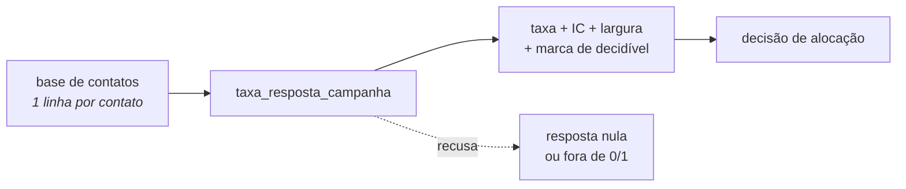

# `campanha` — helpers de análise de campanha de relacionamento

> **Este é o exemplo preenchido do template de README**, na escala padrão. A
> seção `hub_snippets/campanha/` não existe: o conteúdo é fictício e serve para
> mostrar a forma. Compare com [`template.md`](template.md) para ver qual regra
> cada trecho está cumprindo.

Mede o resultado de uma campanha por segmento e por canal, com a precisão da
estimativa junto do número.

## Para que serve

Depois que uma campanha termina, alguém precisa decidir para onde vai o
orçamento da próxima. A tabela de taxas por segmento parece bastar — ordena,
olha o topo, prioriza — e é aí que a decisão erra: taxas com a mesma cara podem
estar apoiadas em 28 e em 30.000 contatos.

Use esta seção quando a pergunta for **"onde investir a próxima campanha"**. Se a
pergunta for "por que este cliente respondeu", o assunto é explicabilidade, não
aqui.

## Visão estrutural



## Como usar

```python
from hub_snippets.campanha.taxa_resposta_campanha import taxa_resposta_campanha

resultado = taxa_resposta_campanha(
    spark.table("catalogo.crm.contatos_campanha"),
    coluna_segmento="segmento",
    coluna_resposta="respondeu",
)
display(resultado.filter("decidivel"))
```

Saída, capturada em 16 ago 2026 no Databricks Free, Spark 4.1 serverless, sobre a
base sintética de exemplo — as seis linhas, sem corte:

```text
     segmento  contatados  respostas  taxa_pct  ic_inferior_pct  ic_superior_pct  largura_ic_pp  decidivel
      Private          28         12     42.86            26.51            60.93          34.42      False
   Aposentado        2600        209      8.04             7.05             9.15           2.09       True
Universitario        4100        307      7.49             6.72             8.33           1.61       True
   Massa alta        8200        431      5.26             4.79             5.76           0.97       True
   PJ pequeno         940         43      4.57             3.41             6.11           2.69       True
        Massa       30000       1154      3.85             3.63             4.07           0.44       True
```

A largura do intervalo é a coluna que decide: 0,44 ponto percentual no maior
segmento contra 34,42 no menor. É a diferença entre saber a taxa e achar que se
sabe.

## O que existe aqui

| Objeto | Em uma linha | Quando usar |
|---|---|---|
| `taxa_resposta_campanha` | taxa por segmento com intervalo de Wilson | comparar segmentos antes de alocar orçamento |
| `cobertura_por_safra` | percentual de preenchimento da base por mês | antes de comparar períodos |

O script `checar_base_campanha`, que valida a base antes da medição, **não fica
aqui**: script mora em `hub_scripts/`. A tabela lista só o que está sob esta
pasta — é o que o checklist exige.

## Limites e armadilhas

- **Significância não é relevância.** O segmento de 28 contatos tem intervalo que
  não se sobrepõe a nenhum outro: a diferença é real. E é irrelevante — são 28
  pessoas, e o teto absoluto são 17 respostas.
- **O intervalo pressupõe contatos independentes.** Mesma pessoa duas vezes, ou
  contato em ondas que se influenciam, produz precisão otimista.
- **Não projete a próxima campanha sobre as mesmas pessoas.** Resposta a um
  segundo contato em poucas semanas não é o mesmo processo. É a armadilha que
  mais passa despercebida, inclusive por assistentes de código.
- **Seis intervalos lado a lado não são teste de hipótese.** Escolher o maior é
  comparação múltipla disfarçada.

## Perguntas frequentes

**Por que Wilson e não o intervalo normal?**
Com taxa baixa e base pequena, o normal produz limite inferior negativo, que é
impossível para uma proporção. Taxa de campanha de 4% é exatamente esse caso.

**O que faço com as linhas onde `decidivel` é falso?**
Reporte a taxa, não aloque orçamento por ela. E, se o segmento importa,
o problema é de desenho da campanha: aumente a base antes de medir de novo.

**Posso mudar o limite de 100 contatos?**
Sim, é política e não lei — está na constante `MINIMO_PARA_DECISAO` justamente
para ser visível e calibrável. Mude com um motivo escrito.

## Onde continuar

- O notebook [`exemplo_taxa_resposta_campanha`](../snippet/taxa_resposta_campanha/exemplo_taxa_resposta_campanha.py)
  mostra o erro acontecendo antes de mostrar a correção.
- O vocabulário do projeto está no README do `.assistant`.
- Para criar um objeto novo nesta seção, copie o template de
  [`hub_padroes/snippet/`](../snippet/template.md).
