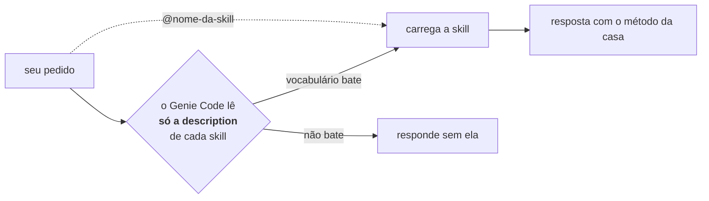

# `skills` — a única estrutura **nativa** com conteúdo do Hub

> **ATENÇÃO: esta pasta é nativa da plataforma.** O Genie Code a descobre
> sozinho e carrega o que está aqui sem ninguém pedir. Tudo o mais no Hub exige
> `@`, Add context, import ou execução — só isto acontece automaticamente.

Doze skills que injetam contexto especializado na conversa quando o assunto
bate com o que cada uma cobre.

## Para que serve

Uma skill não executa nada. Ela **injeta texto** na conversa — o fluxo do
trabalho, as armadilhas do domínio e os helpers a usar — de modo que o
assistente responda como alguém que já fez aquilo antes.

Use quando quiser que o Genie Code trate um pedido com o método da casa em vez
do método genérico. Se o que você quer é código pronto para importar, o lugar é
[`hub_snippets`](../hub_snippets/README.md); se é um formulário para colar, é
[`hub_prompts`](../hub_prompts/README.md).

## Como a escolha acontece



Duas coisas seguem daí, e as duas surpreendem:

- **O corpo do `SKILL.md` não influencia a escolha.** Só a `description` é lida
  no roteamento. Um fluxo excelente numa skill mal descrita nunca é usado.
- **Alterar uma `description` invalida a certificação de roteamento.** Os testes
  precisam ser refeitos para a skill alterada e para as que competem com ela no
  mesmo vocabulário.

## Como usar

Descreva a intenção com o **termo técnico do domínio** — é o que decide a
escolha, não o nome da skill:

```text
Faça uma EDA completa da tabela catalogo.crm.clientes_pf: granularidade,
chaves, qualidade de dados, distribuições e um relatório executivo ao final.
```

Para seleção determinística, use a menção:

```text
@hub-ml-baseline-ml treine um baseline de classificação com split temporal
```

## O que existe aqui

| Skill | Quando ela se aplica |
|---|---|
| `hub-ml-eda-profissional` | perfil, qualidade, univariada/bivariada e síntese executiva |
| `hub-ml-cross-eda-ml` | consolidar múltiplas EDAs e avaliar prontidão para ML |
| `hub-ml-feature-engineering` | especificar e validar features sem vazamento temporal |
| `hub-ml-validacao-estatistica` | pressupostos, testes, efeito e incerteza antes de modelar |
| `hub-ml-baseline-ml` | baseline tabular, temporal, ranking ou survival com MLflow |
| `hub-ml-explainability` | SHAP, explicação global e local, comunicação responsável |
| `hub-ml-monitoramento-modelo` | drift, performance, calibração e decisão de retreino |
| `hub-ml-pipeline-builder` | Lakeflow, Jobs, bundles e promoção entre ambientes |
| `hub-ml-analise-safra` | safras, maturação e comparação em MOB equivalente |
| `hub-ml-comentar-notebook` | documentação PRÉ/PÓS e revisão de notebook |
| `hub-ml-tutor-databricks` | explicação didática de código, Spark, SQL e plataforma |
| `hub-ml-auditoria-skills` | auditar uma saída contra o contrato da skill que a produziu |

Algumas trazem uma subpasta `templates/` com modelos de saída que a skill
referencia. Esses arquivos não são descobertos sozinhos: a skill os cita, e o
assistente os usa como formato.

## Limites e armadilhas

- **Skill não recarrega em chat aberto.** Depois de editar, abra um chat novo;
  se persistir, recarregue a página, porque o metadata fica em cache.
- **A skill recomenda helper, não o importa.** Ela cita
  `hub_snippets.spark.pit_join` no texto que injeta; quem executa o import é
  você, no notebook. Nenhum código entra na conversa por conta da skill.
- **Existem skills nativas da Databricks** que convivem com estas e às vezes
  são escolhidas no lugar — observado com `data-sampling` num pedido de análise
  direta. Não é falha: é o roteamento avaliando qual cobre melhor o pedido. Para
  garantir a sua, use `@`.
- **Descrição vaga produz skill que nunca é escolhida**, ou que rouba a vez de
  outra. É o defeito mais silencioso desta pasta.

## Perguntas frequentes

**Por que o nome usa hífen se as pastas do Hub usam underscore?**
Porque quem nomeia a skill é a plataforma, não o Python. A regra do projeto é
"underscore onde o Python importa, hífen onde a plataforma nomeia" — e o nome da
pasta precisa ser idêntico ao campo `name` do frontmatter.

**Posso ter skills compartilhadas com o time?**
Sim, em `Workspace/.assistant/skills/`, administradas por quem tem permissão de
workspace. É a fase seguinte do Hub; hoje estas são pessoais.

**Como sei qual skill foi carregada?**
A interface do chat mostra. Vale conferir quando a resposta não tiver a cara do
método da casa.

## Onde continuar

- Para criar uma skill: [`hub_padroes/skill/template.md`](../hub_padroes/skill/template.md).
- Para o vocabulário: [glossário](../README.md#glossário).
- Para o mapa demanda → helper: [catálogo](../CATALOGO_HELPERS.md).
