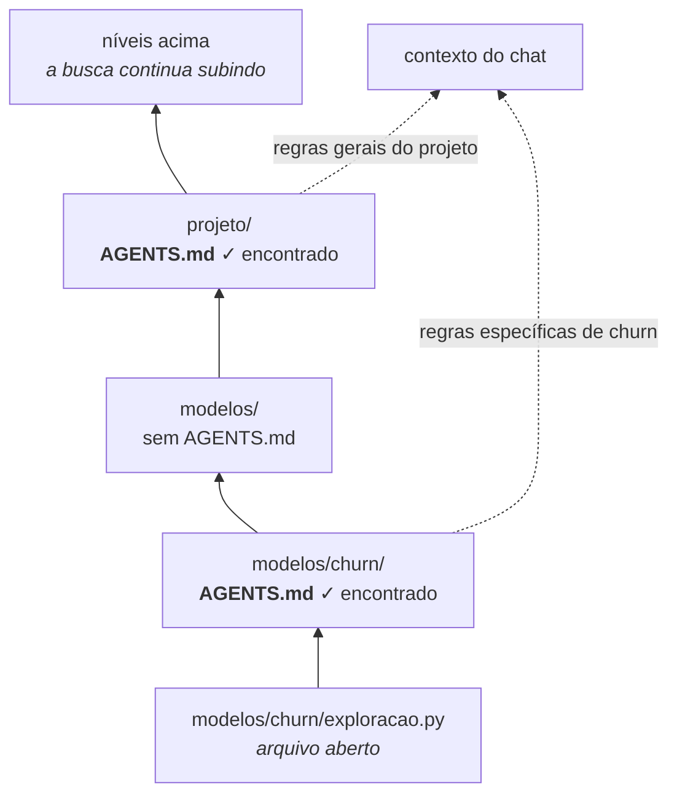
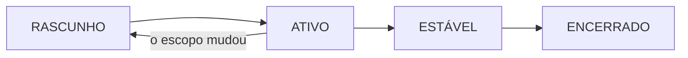

# `x_projects` — contexto personalizado de projetos

> **EXTENSÃO PERSONALIZADA (`x_`) — NÃO AUTO-DESCOBERTA.** O Genie Code não lê
> automaticamente esta pasta, não seleciona um projeto pelo nome e não reconhece
> `/projeto` como comando nativo. Use estes arquivos como modelos e arquivo de apoio.

## Resultado recomendado

Use `x_projects` para guardar modelos. Para o contexto ativo, copie
`AGENTS_TEMPLATE.md` para o diretório real do projeto e renomeie a cópia para
`AGENTS.md`:

```text
/Workspace/Users/<usuario>/meu-projeto/
├── AGENTS.md                 ← descoberta automática pelo Genie Code
├── README.md
├── databricks.yml            ← se o projeto usar um bundle
├── src/
├── resources/
└── tests/

/Users/<usuario>/.assistant/x_projects/
├── README.md                 ← este arquivo
├── AGENTS_TEMPLATE.md        ← modelo personalizado, não automático
├── _template_projeto.md      ← ficha detalhada, não automática
└── exemplo_churn_previdencia.md
```

## Como a descoberta funciona

Ao abrir um notebook ou arquivo, o Genie Code procura `AGENTS.md` e `CLAUDE.md` no
diretório atual e sobe pela árvore de diretórios. Por isso, a localização do
`AGENTS.md` define seu escopo. Não é necessário configurar essa descoberta.

O diagrama mostra o que acontece ao abrir um notebook em `modelos/churn/`:



Três consequências práticas. A busca é **de baixo para cima**, então o arquivo
mais próximo do notebook é o mais específico. Diretórios sem `AGENTS.md` são
apenas atravessados — não interrompem a subida. E como os arquivos encontrados
somam contexto em vez de se substituírem, vale colocar no nível do projeto o que
é geral e criar um `AGENTS.md` em subpasta somente quando aquele escopo tiver
regras realmente diferentes.

Um arquivo que fique apenas aqui em `x_projects/` nunca é descoberto: esta pasta
guarda modelos. A descoberta só acontece depois que a cópia é renomeada para
`AGENTS.md` e colocada na árvore do projeto real.

> Até onde a busca sobe não está documentado com precisão. Não conte com um
> limite específico: coloque o `AGENTS.md` onde ele deve valer, em vez de supor
> que um arquivo muito acima será alcançado.

Sobre o prefixo `/Workspace` que aparece na árvore acima: ele é usado em
caminhos que o **código** enxerga. O mecanismo de descoberta de `AGENTS.md`
trabalha com o caminho sem esse prefixo. Os dois se referem ao mesmo lugar.

## Qual arquivo usar

| Necessidade | Artefato | Como entra no contexto |
|---|---|---|
| Regras e fatos essenciais do projeto ativo | `AGENTS.md` na raiz real | Automático por ancestralidade |
| Project charter e log de decisões detalhado | cópia de `_template_projeto.md` | Anexar com **Add context** ou `@` |
| Exemplo de preenchimento | `exemplo_churn_previdencia.md` | Leitura manual |
| Criar briefing com Genie Code | `../x_prompts/novo_projeto.md` | Copiar/colar manualmente |

## Quick start

1. Copie `AGENTS_TEMPLATE.md` para a raiz do projeto como `AGENTS.md`.
2. Substitua todos os `{{PLACEHOLDERS}}`; remova seções não aplicáveis.
3. Mantenha somente fatos e instruções relevantes a todos os arquivos descendentes.
4. Abra um arquivo dentro do projeto e inicie um novo chat do Genie Code.
5. Para contexto adicional, anexe a ficha do projeto, tabelas, notebooks e pipelines
   com **Add context** ou `@`.
6. Revise o arquivo em Git; nunca registre segredos, tokens ou PII.

## Camadas de contexto e escopo

```text
Contexto aplicado globalmente: instruções de workspace + instruções de usuário
Contexto aplicado por localização: AGENTS.md/CLAUDE.md encontrados nos ancestrais
```

A Databricks informa que instruções de workspace geralmente têm prioridade sobre as
de usuário. A página oficial citada aqui não estabelece precedência entre múltiplos
`AGENTS.md` ancestrais; ela informa que seus conteúdos são injetados. Evite depender
de ordem implícita: remova contradições e mantenha cada instrução no menor escopo
correto.

## O que colocar no `AGENTS.md`

- objetivo e unidade de análise;
- recursos autorizados e ambientes;
- invariantes de negócio e disponibilidade temporal;
- convenções de código/teste específicas do projeto;
- comandos de validação e Definition of Done;
- limites de segurança, custo, escrita e deploy;
- links/caminhos estáveis para documentação essencial.

Evite backlog extenso, diário de sessões, resultados transitórios e preferências
pessoais globais. Esses itens pertencem à ficha de projeto ou ao sistema de gestão.
O Genie Code não busca proativamente referências mencionadas nas instruções; inclua
no `AGENTS.md` os detalhes essenciais e anexe os recursos adicionais no chat.

## Ciclo de vida



- **Rascunho:** placeholders preenchidos e revisão de segurança.
- **Ativo:** fatos e comandos testados; mudanças revisadas no Git.
- **Estável:** instruções curtas, sem duplicação ou contradição.
- **Encerrado:** mantenha histórico no charter; remova o `AGENTS.md` se ele puder
  influenciar trabalho futuro indevidamente.

## Verificação antes do commit

- [ ] O arquivo ativo se chama exatamente `AGENTS.md`.
- [ ] Está no ancestral correto, sem afetar projetos vizinhos.
- [ ] Não há `{{PLACEHOLDERS}}`, credenciais, e-mails pessoais ou PII.
- [ ] Paths usam placeholders ou caminhos do projeto, não um usuário específico.
- [ ] Instruções são testáveis, atuais e não duplicam preferências globais.
- [ ] Toda ação mutável exige escopo/ambiente explícitos.

## Fontes oficiais

- [Customize Genie Code with custom instructions](https://learn.microsoft.com/en-us/azure/databricks/genie-code/instructions)
- [Tips to improve Genie Code responses](https://learn.microsoft.com/en-us/azure/databricks/genie-code/tips)

---

Última revisão: 2026-08-13.
