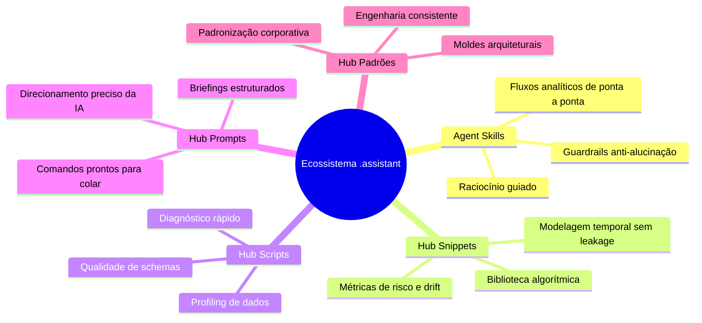
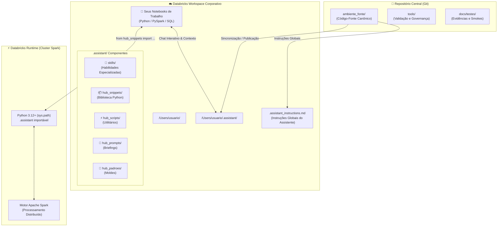
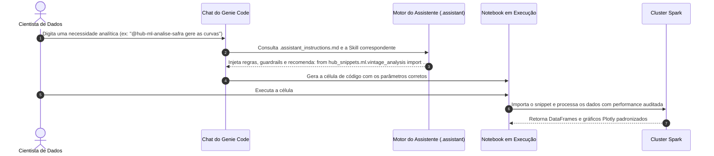

# Ecossistema/Hub .assistant para Databricks Genie Code voltado para Machine Learning

> Um ambiente integrado de governança, biblioteca algorítmica e inteligência contextual que capacita o Databricks Assistant (Genie Code) a atuar como um especialista sênior em Machine Learning na sua rotina diária de desenvolvimento.

---

## 🌟 O que é este Ecossistema e como ele ajuda no Databricks?

Desenvolver projetos de Machine Learning em ambientes de Big Data frequentemente envolve desafios repetitivos: escrever códigos extensos de engenharia de recursos (*feature engineering*), recalcular métricas de risco e drift, padronizar análises exploratórias e mitigar o risco de vazamento temporal (*data leakage*).

Quando utilizamos assistentes de IA genéricos, eles frequentemente "reinventam a roda": geram códigos do zero, usam bibliotecas despadronizadas ou aplicam fórmulas matemáticas simplistas que não escalam no cluster Spark.

**O Ecossistema `.assistant` resolve isso transformando o Databricks Assistant em um parceiro contextualizado.**

Em vez de sugerir códigos genéricos da internet, o Genie Code passa a ter acesso a uma **biblioteca matemática curada, moldes de governança e habilidades especializadas** instaladas diretamente no workspace corporativo.

```text
┌─────────────────────────────────────────────────────────────────────────────┐
│                           ROTINA DO CIENTISTA DE DADOS                       │
│                                                                             │
│   ❌ Sem o Hub: Códigos dispersos, reescrita de fórmulas, risco de leakage │
│   ✅ Com o Hub: Algoritmos auditados, padrões corporativos e IA especialista│
└─────────────────────────────────────────────────────────────────────────────┘
```

---

## 🧰 O que tem neste ambiente e como ele ajuda na rotina de trabalho?

O ecossistema é dividido em 5 componentes modulares que cobrem todo o ciclo de vida analítico:



### 🧠 1. Agent Skills (`skills/`)
* **O que são:** Habilidades modulares que orientam o raciocínio da IA em tarefas analíticas completas.
* **Como ajudam:** Quando você pede uma análise exploratória (EDA), modelagem preditiva ou cálculo de safras, a skill injeta no assistente o passo a passo metodológico, o que nunca fazer (*guardrails*) e exatamente quais funções da biblioteca ele deve recomendar.

### 📦 2. Hub Snippets (`hub_snippets/`)
* **O que são:** Uma biblioteca Python pura, auditada e de alta performance pronta para importação direta em qualquer notebook.
* **Como ajudam:** Disponibiliza mais de 50 funções prontas para produção:
  * **Modelagem Temporal:** Divisão de bases e criação de *lags* protegidos contra vazamento de informação futura.
  * **Risco de Crédito e Finanças:** Análise de Safras (*Vintage*), WOE/IV (*Weight of Evidence*), cálculo e calibração de scorecards.
  * **Monitoramento:** Estabilidade Populacional (PSI/CSI) e monitor contínuo de drift de dados.
  * **Spark Nativo:** Joins *point-in-time* seguros e sumarização de nulos em escala massiva.

### ⚡ 3. Hub Scripts (`hub_scripts/`)
* **O que são:** Utilitários e scripts de linha de comando ou execução direta.
* **Como ajudam:** Permitem rodar diagnósticos imediatos em tabelas Delta (perfilamento rápido, validação de schema para YAML e testes de conformidade) antes de iniciar a modelagem.

### 📝 4. Hub Prompts (`hub_prompts/`)
* **O que são:** Catálogo de briefings e comandos pré-estruturados.
* **Como ajudam:** Em vez de pensar em como formular uma pergunta complexa para o assistente, basta copiar o template de prompt específico (ex: auditoria estatística, baseline de ML, documentação de notebook) e colar no chat para receber uma resposta cirúrgica.

### 📐 5. Hub Padrões (`hub_padroes/`)
* **O que são:** Moldes arquiteturais (*blueprints*) do ecossistema.
* **Como ajudam:** Favorecem que qualquer novo código, skill ou documentação criado pela equipe siga as diretrizes de arquitetura, testes e qualidade estabelecidas para o projeto.

---

## 🏛️ Arquitetura Completa do Ecossistema

O diagrama abaixo ilustra como os componentes interagem entre o repositório central, o workspace do Databricks e o cluster Spark durante a execução:



---

## 🔄 Como o Contexto chega ao Genie Code?

Muitos usuários se perguntam: *“Como a IA do Databricks sabe que esses códigos existem sem que eu precise ensinar tudo para ela?”*

A plataforma Databricks Assistant lê automaticamente a estrutura de instruções e pastas do seu workspace corporativo. O fluxo ocorre em 5 etapas bem definidas:



### Explicação Passo a Passo:

1. **Gatilho e Intenção:** Você abre o chat do assistente no Databricks e faz uma pergunta em linguagem natural ou referencia uma habilidade usando `@` (ex: `@hub-ml-feature-engineering`).
2. **Carregamento de Diretrizes Globais:** O assistente lê `.assistant_instructions.md`, que estabelece a persona sênior, o idioma em português e a proibição de reinventar funções disponíveis.
3. **Ativação da Skill e Injeção de Contexto:** A skill específica injeta no modelo as boas práticas da tarefa e fornece o caminho exato do módulo a ser importado (ex: `hub_snippets.spark.pit_join`).
4. **Geração Segura de Código:** Em vez de gerar 80 linhas de cálculos manuais propensos a erros, o Genie Code gera um bloco limpo que importa o módulo correspondente da biblioteca.
5. **Execução no Cluster:** O seu notebook importa a função diretamente da pasta `.assistant`, executando código homologado, rápido e com cobertura de testes completa no cluster Spark.

---

## ❓ Perguntas Frequentes (FAQ)

### 1. O que acontece quando eu abro o chat do Databricks Assistant com este ecossistema configurado?
O assistente passa a reconhecer automaticamente os padrões do seu time. Ele ganha a capacidade de autocomplete inteligente para as bibliotecas internas, entende as menções de skills (com `@`) e, ao invés de sugerir códigos genéricos ou tentar instalar pacotes externos não homologados, ele prioriza as funções já testadas do `hub_snippets`.

### 2. Preciso instalar alguma biblioteca via `pip` ou reiniciar meu cluster para usar os snippets?
**Não.** O ecossistema foi projetado para ter zero atrito. Como os módulos residem dentro da sua pasta `.assistant` no workspace, eles ficam automaticamente visíveis para o interpretador Python (`sys.path`). Previne falhas de execução decorrentes de bibliotecas externas não gerenciadas. Basta abrir qualquer notebook e rodar:
```python
from hub_snippets.ml.split_temporal import temporal_split
```
A biblioteca funciona nativamente tanto em computação Serverless quanto em clusters clássicos.

### 3. Qual é a diferença prática entre usar uma Skill, um Prompt ou importar um Snippet diretamente?
* **Snippet:** É o **código puro** (uma função Python/Spark). Use quando você mesmo estiver escrevendo seu notebook e só precisa da função matemática pronta.
* **Skill:** É o **cérebro metodológico da IA**. Use quando quiser que a IA estruture uma análise inteira para você no chat (ela usará os snippets por trás dos panos).
* **Prompt:** É o **briefing pronto**. Use quando você não quiser pensar em como redigir a instrução: basta copiar o texto do prompt e colar no assistente.

### 4. Como o ecossistema contribui para mitigar vazamento temporal (*data leakage*) e erros analíticos?
Os algoritmos de Machine Learning do Hub passam por etapas de validação e testes antes de serem disponibilizados:
* Módulos temporais convertem e validam tipagens de data antes de qualquer ordenação, mitigando o risco de vazamento de informação do futuro.
* Funções estatísticas como PSI, WOE/IV e Safras são testadas contra cenários desafiadores (valores nulos, categorias raras, ausência de variância) e possuem invariantes matemáticas validadas.

### 5. A equipe pode criar novos snippets, prompts ou skills? Como funciona a evolução do ecossistema?
**Sim, o ambiente é extensível por design.** Para manter a consistência, novas adições utilizam a pasta `hub_padroes/` e a skill `hub-ml-criar-objeto`. Todo novo helper segue a regra de "pasta de objeto" (contendo o código, a exportação no `__init__.py` e um notebook com exemplos didáticos e dados sintéticos), propiciando que novas adições sejam facilmente compreendidas e adotadas tanto pela equipe quanto pela IA.
