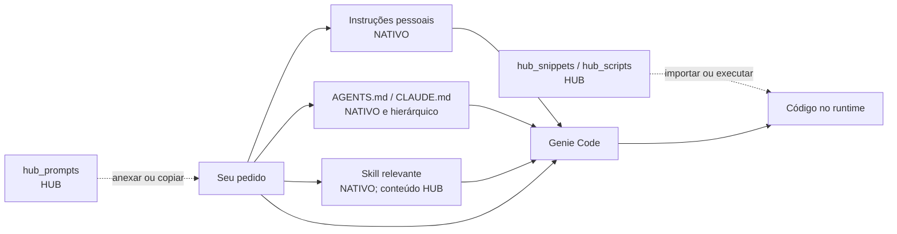

# Ecossistema `.assistant` para Databricks Genie Code

Este é o guia de uso do ambiente publicado. Ele reúne instruções, Agent Skills,
prompts guiados e bibliotecas Python para trabalho de dados e machine learning
no Databricks.

> **Leia primeiro a legenda:** `NATIVO` é um mecanismo reconhecido pelo Genie
> Code; `HUB` é conteúdo criado neste projeto. As skills `hub-ml-*` são conteúdo
> do Hub dentro do mecanismo nativo de Agent Skills.

## Escolha sua rota

| Quero… | Comece aqui |
|---|---|
| fazer uma análise com o método do Hub | [Escolher uma skill](#1-escolher-uma-skill) |
| formular melhor um pedido | [Usar um prompt guiado](#2-usar-um-prompt-guiado) |
| importar uma função pronta | [Usar um helper](#3-usar-um-helper) |
| dar contexto permanente a um projeto | [Contexto por projeto](#4-contexto-por-projeto) |
| instalar para uma pessoa ou equipe | [Instalação](#instalação) |
| resolver erro de descoberta ou import | [Diagnóstico rápido](#diagnóstico-rápido) |
| entender um termo | [Glossário](GLOSSARIO.md) |

## Como o contexto chega ao Genie Code

Seta contínua indica descoberta nativa. Seta tracejada exige uma ação sua.



| Componente | Origem | Automático? | Como entra |
|---|---|---:|---|
| `.assistant_instructions.md` | nativo | sim* | instruções pessoais |
| `Workspace/.assistant_workspace_instructions.md` | nativo | sim* | instruções administradas para o workspace |
| `AGENTS.md` e `CLAUDE.md` | nativo | sim | descoberta na árvore do arquivo aberto |
| `.assistant/skills/<nome>/SKILL.md` | nativo | quando relevante | pedido + `description`, ou `@nome` |
| `hub_prompts/` | Hub | não | anexo/`@` ou texto copiado |
| `hub_snippets/` e `hub_scripts/` | Hub | não | import Python explícito |
| `hub_padroes/` | Hub | não | consulta ou anexo explícito |

\* As instruções não se aplicam a Quick Fix e Autocomplete, conforme a
documentação oficial atual.

O prefixo `hub_`/`hub-` indica autoria local, não menor qualidade. Ele existe
para que ninguém confunda uma convenção deste pacote com uma interface
institucional da Databricks.

## Instalação

### Uso pessoal

Copie para os caminhos documentados:

```text
/Users/<username>/
├── .assistant_instructions.md
└── .assistant/
    ├── skills/
    ├── hub_prompts/
    ├── hub_snippets/
    ├── hub_scripts/
    └── hub_padroes/
```

As skills pessoais ficam disponíveis apenas para esse usuário. Prompts, helpers e
padrões continuam manuais mesmo dentro de `.assistant/`.

### Uso compartilhado

Skills de workspace ficam em:

```text
Workspace/.assistant/skills/<nome>/SKILL.md
```

Instruções administradas para todo o workspace ficam em:

```text
Workspace/.assistant_workspace_instructions.md
```

Use permissões, revisão por Git e teste representativo antes de promover uma
skill pessoal. Não copie automaticamente bibliotecas ou preferências pessoais
para toda a equipe.

## Fluxo diário

### 1. Escolher uma skill

O Genie Code pode carregar uma skill quando o pedido é relevante para a
`description` dela. Para seleção explícita, mencione a skill com `@`.

| Intenção | Skill |
|---|---|
| explorar uma base e sintetizar achados | `@hub-ml-eda-profissional` |
| consolidar EDAs e decidir prontidão para ML | `@hub-ml-cross-eda-ml` |
| criar features com controle temporal | `@hub-ml-feature-engineering` |
| validar pressupostos, efeito e incerteza | `@hub-ml-validacao-estatistica` |
| treinar um baseline governado | `@hub-ml-baseline-ml` |
| explicar previsões com SHAP | `@hub-ml-explainability` |
| acompanhar drift, performance e retreino | `@hub-ml-monitoramento-modelo` |
| desenhar pipeline, Job ou bundle | `@hub-ml-pipeline-builder` |
| analisar safra e maturação | `@hub-ml-analise-safra` |
| documentar um notebook | `@hub-ml-comentar-notebook` |
| aprender código, Spark, SQL ou plataforma | `@hub-ml-tutor-databricks` |
| auditar uma saída contra seu contrato | `@hub-ml-auditoria-skills` |
| criar um objeto no padrão do Hub | `@hub-ml-criar-objeto` |

Exemplo copiável:

```text
@hub-ml-baseline-ml

Objetivo: criar um baseline de classificação para prever {{EVENTO}}.
Dados: @{{TABELA_OU_NOTEBOOK}}.
Grão: uma linha por {{ENTIDADE}} na data {{INSTANTE_DE_DECISAO}}.
Validação: split temporal; declare classe positiva e métrica principal.
Restrições: não execute nem escreva até eu aprovar o plano.
Saída: plano, pressupostos, código proposto, checks e limitações.
```

Uma Agent Skill pode referenciar documentação, exemplos e scripts executáveis
relativos à própria pasta. Neste pacote, porém, `hub_snippets` e `hub_scripts`
ficam fora das skills: a skill pode recomendar o helper, mas o helper só entra
no runtime quando o código o importa explicitamente.

Depois de alterar uma skill, use chat novo para evitar contexto antigo. Mudança
em `name`, `description` ou fronteira de escopo exige repetir os testes de
roteamento com casos positivo, negativo e `@menção`.

### 2. Usar um prompt guiado

Os prompts são formulários customizados, não comandos do Genie Code. Eles deixam
explícitos contexto, autorização, formato da saída e validação.

1. Abra o [catálogo de prompts](hub_prompts/README.md).
2. Escolha a família e substitua cada `{{CAMPO}}`.
3. Use `NÃO INFORMADO` para uma lacuna real e `NÃO APLICÁVEL` quando o campo foi
   avaliado e não pertence ao caso.
4. Anexe tabela, notebook, query ou pipeline com `@`.
5. Cole apenas o bloco “Prompt pronto para colar”.
6. Revise o plano antes de autorizar execução, escrita ou deploy.

Exemplo mínimo:

```text
CONTEXTO
- Recurso: @catalogo.schema.tabela
- Objetivo: medir {{DECISAO_DE_NEGOCIO}}
- Grão/chave/tempo: {{GRAO}} / {{CHAVE}} / {{COLUNA_TEMPORAL}}

MODO
- Primeiro produza um plano.
- Não execute nem escreva até aprovação explícita.

SAÍDA
- evidência, interpretação, limitações e próximo passo;
- liste campos não informados sem inventar valores.
```

Atalhos como `/eda` e `/baseline` são convenções de texto deste pacote, não
comandos registrados. Prefira `@nome-da-skill` e contexto explícito.

### 3. Usar um helper

Use o [catálogo demanda → helper](CATALOGO_HELPERS.md) para escolher o módulo.
Adicione a pasta `.assistant` — não `hub_snippets` — ao `sys.path`:

```python
from pathlib import Path
import sys

assistant_root = Path("/Workspace/Users/<username>/.assistant")
if not assistant_root.is_dir():
    raise FileNotFoundError(f"Pasta não encontrada: {assistant_root}")

sys.path.insert(0, str(assistant_root))

from hub_snippets.spark.safe_display import safe_display
from hub_scripts.data_quality_check import data_quality_check
```

Cada objeto tem um `exemplo_<nome>` ao lado da implementação. No workspace, esse
arquivo aparece como notebook e demonstra entradas, saída real, erro típico e
quando não usar. Comece por ele antes de copiar um import.

| Preciso de… | Coleção |
|---|---|
| função para compor um notebook ou pipeline | [`hub_snippets`](hub_snippets/README.md) |
| diagnóstico sobre tabela ou notebook publicado | [`hub_scripts`](hub_scripts/README.md) |
| dependência opcional de ML | [inventário de dependências](hub_snippets/requirements-optional.txt) |

Instale somente a dependência necessária e fixe a versão no projeto consumidor.
Teste no runtime de destino: import local não prova compatibilidade com Spark
Connect, serverless ou políticas do workspace.

### 4. Contexto por projeto

Ao abrir um arquivo, o Genie Code procura `AGENTS.md` e `CLAUDE.md` no diretório
e em seus ancestrais. Use esse mecanismo para fatos estáveis do projeto:

- objetivo e unidade de análise;
- tabelas autorizadas e significado do grão;
- invariantes de negócio;
- convenções de código e comandos de validação;
- limites de escrita, custo e dados sensíveis.

Não use instruções como backlog, diário de sessão ou depósito de resultados.
Conteúdo transitório envelhece e passa a competir com o pedido atual.

## Execução, escrita e aprovação

O Genie Code opera em modo agente e pode propor ou realizar tarefas em várias
etapas conforme permissões e configuração de aprovação. Por isso, declare o modo
no pedido:

| Modo | Formulação recomendada |
|---|---|
| explicação | “Explique; não execute nem altere arquivos.” |
| plano | “Produza o plano e aguarde aprovação.” |
| código | “Gere o código, mas não execute.” |
| execução | “Execute somente a leitura descrita e mostre o resultado.” |
| mutação/deploy | “Mostre impacto e plano de reversão; aguarde aprovação.” |

Permissão do Unity Catalog continua limitando o que o Genie Code pode acessar.
Mesmo assim, um prompt deve declarar PII, custo, escopo e ações proibidas; acesso
técnico não equivale a autorização de negócio.

## Diagnóstico rápido

| Sintoma | Verifique |
|---|---|
| skill não aparece | path exato, `SKILL.md`, frontmatter e novo chat |
| skill inadequada foi carregada | intenção específica ou `@nome-da-skill` |
| “este notebook” não foi entendido | anexe o artefato com `@` |
| prompt do Hub não influenciou | ele não é automático; anexe ou copie o bloco final |
| contexto de projeto não entrou | `AGENTS.md`/`CLAUDE.md` precisa estar na árvore do arquivo aberto |
| `ModuleNotFoundError: hub_snippets` | adicione a pasta `.assistant` ao `sys.path` |
| dependência de ML ausente | consulte `requirements-optional.txt` e fixe versão |
| `NOT_SUPPORTED_WITH_SERVERLESS` | confira a evidência do exemplo e use alternativa compatível |
| `.py` publicado como notebook | o módulo deve ser arquivo; apenas `exemplo_*` é notebook |
| conteúdo antigo permanece no chat | abra chat novo e recarregue a interface se necessário |

## Mapa desta pasta

| Entrada | Papel |
|---|---|
| [`skills/`](skills/README.md) | catálogo e contrato das Agent Skills |
| [`hub_prompts/`](hub_prompts/README.md) | formulários reprodutíveis de pedido |
| [`hub_snippets/`](hub_snippets/README.md) | helpers Python por pacote |
| [`hub_scripts/`](hub_scripts/README.md) | diagnósticos orientados a tabela/notebook |
| [`hub_padroes/`](hub_padroes/README.md) | templates para novos objetos |
| [`CATALOGO_HELPERS.md`](CATALOGO_HELPERS.md) | demanda, API, dependência e runtime |
| [`GLOSSARIO.md`](GLOSSARIO.md) | vocabulário separado por procedência |

## Fontes oficiais

- [Agent Skills no Genie Code](https://learn.microsoft.com/en-us/azure/databricks/genie-code/skills)
- [Instruções customizadas](https://learn.microsoft.com/en-us/azure/databricks/genie-code/instructions)
- [Dicas para respostas melhores](https://learn.microsoft.com/en-us/azure/databricks/genie-code/tips)
- [Uso e modo agente](https://learn.microsoft.com/en-us/azure/databricks/genie-code/use-genie-code)
- [MCP no Genie Code](https://learn.microsoft.com/en-us/azure/databricks/genie-code/mcp)
- [Especificação aberta de Agent Skills](https://agentskills.io/specification)

Documentação de plataforma muda. Quando um comportamento deste guia divergir da
interface ou da fonte oficial, trate a fonte oficial como autoridade e registre
a revisão no repositório canônico.
