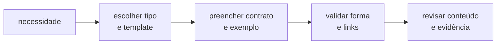

# `hub_padroes/` — templates do Hub

> **HUB · CONSULTA MANUAL.** Esta coleção não é auto-descoberta pelo Genie Code.
> Anexe o template com `@` ou use `@hub-ml-criar-objeto` para aplicar o fluxo.

Templates evitam que cada novo objeto invente estrutura, evidência e contrato.
Eles garantem forma; revisão humana continua responsável pela correção do
conteúdo.

## Escolha o objeto

| Quero criar… | Template | Exemplo preenchido |
|---|---|---|
| README | [`readme/template.md`](readme/template.md) | [`readme/exemplo.md`](readme/exemplo.md) |
| snippet | [`snippet/template.md`](snippet/template.md) | [`taxa_resposta_campanha`](snippet/taxa_resposta_campanha/) |
| script | [`script/template.md`](script/template.md) | [`checar_base_campanha`](script/checar_base_campanha/) |
| prompt | [`prompt/template.md`](prompt/template.md) | [`analisar_campanha`](prompt/analisar_campanha/) |
| skill | [`skill/template.md`](skill/template.md) | [`skill/exemplo`](skill/exemplo/) |
| notebook | [`notebook/template.py`](notebook/template.py) | notebooks dos exemplos acima |

Esses são os seis tipos de objeto do Hub. `auditoria/` e `output/` são padrões
transversais de processo, não novos tipos.

## Fluxo recomendado



Com o Genie Code:

```text
@hub-ml-criar-objeto

Crie um {{TIPO}} para {{OBJETIVO}} usando @hub_padroes/{{TIPO}}/template.
Primeiro confirme nome, público, entradas, saída, limites e exemplo de uso.
Não escreva arquivos até eu aprovar o plano.
```

Sem Genie Code, copie o template e siga seu checklist.

## Como diferenciar os tipos

| Se o artefato… | Tipo |
|---|---|
| explica uma coleção ou fluxo | README |
| oferece função importável dentro de outro código | snippet |
| executa diagnóstico orientado a um recurso | script |
| estrutura um pedido para o chat | prompt |
| ensina ao agente um workflow especializado | skill |
| demonstra execução e interpretação | notebook |

Um mesmo tema pode atravessar tipos sem duplicá-los. Os exemplos usam análise de
campanha de CRM para tornar a comparação direta entre snippet, script, prompt e
skill.

## Contrato mínimo

Todo objeto precisa deixar explícitos:

1. objetivo e público;
2. entrada e pré-condições;
3. saída e critério de aceitação;
4. exemplo reproduzível;
5. limites, segurança e “quando não usar”;
6. relação com o catálogo ou skill que o referencia.

## Limites

- A skill de exemplo fica fora de `.assistant/skills/` e não participa do
  roteamento. Não a copie para a pasta nativa.
- Exemplos de campanha são didáticos, não biblioteca de produção.
- Template não prova correção estatística, compatibilidade de runtime ou
  autorização de dados.
- Evite criar um sétimo tipo para resolver diferença de conteúdo; primeiro
  verifique se é apenas um recurso de um tipo existente.

## Onde continuar

- [Guia do ecossistema](../README.md)
- [Manual Técnico — índice de termos](../MANUAL_TECNICO.md#indice-termos)
- [Manual Técnico — inventário de helpers](../MANUAL_TECNICO.md#catalogo-helpers)
