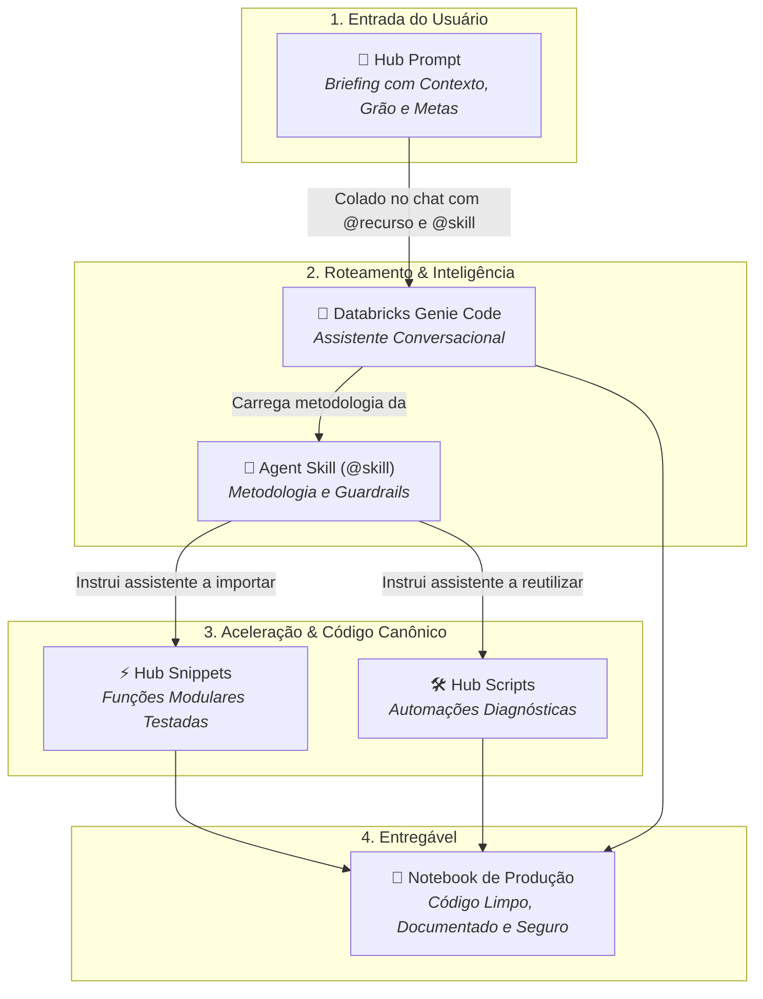
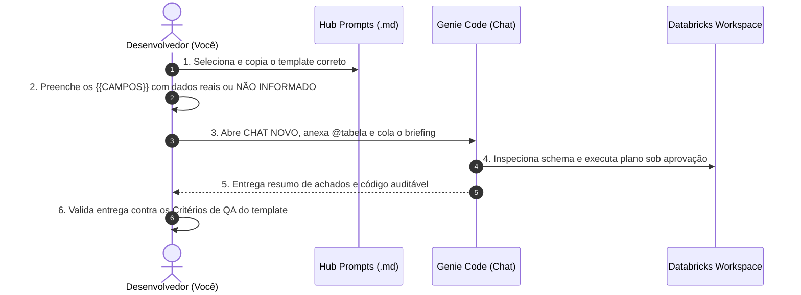

# Hub Prompts — Briefings Técnicos Estruturados para Genie Code

O **Hub Prompts** é a camada de **interface e especificação técnica** do nosso ecossistema de dados. Ele reúne um conjunto de formulários e briefings padronizados projetados para orientar a interação humana com o **Databricks Genie Code**, orientando para que as demandas analíticas sejam traduzidas em instruções bem delimitadas, rastreáveis e reproduzíveis.

Em vez de depender de comandos improvisados em linguagem natural, o Hub Prompts estabelece um contrato claro entre quem precisa da análise e o assistente de IA.

---

## 🎯 O que é um Prompt Estruturado?

No ecossistema corporativo, um prompt estruturado funciona como uma **Ordem de Serviço (OS) ou Especificação Técnica de Requisitos (Spec de Engenharia)**.

Imagine solicitar a construção de um pipeline para a equipe de engenharia de dados:
* Se você disser apenas *"faça um pipeline com os dados de vendas"*, o engenheiro não saberá a frequência, o grão das tabelas, as regras de particionamento, o volume esperado nem os critérios de aceite.
* Se você entregar uma **especificação técnica** detalhando a chave primária, a janela temporal de corte, os filtros de exclusão e o SLA exigido, a comunicação se torna muito mais precisa, diminuindo sensivelmente desvios de interpretação e retrabalho.

O **Hub Prompts** aplica exatamente essa mesma disciplina ao desenvolvimento assistido por IA:

| Característica | Chat Informal / Ad-hoc | Briefing Estruturado (Hub Prompts) |
| :--- | :--- | :--- |
| **Entrada** | Pergunta solta (*"analisa essa tabela de churn"*). | Contexto delimitado com grão, chaves, período e filtros. |
| **Premissas da IA** | A IA adivinha colunas, regras e relações. | A IA é orientada a perguntar ou inspecionar o schema real. |
| **Controle de Custo** | Risco de varreduras completas e `toPandas()` no driver. | Teto de execução explícito e leitura agregada em PySpark. |
| **Segurança & Dados** | Pode expor PII ou tentar mutações sem autorização. | Guardrails declarados (somente leitura, agregação, mascaramento). |
| **Entregável** | Resposta textual variável e código desestruturado. | Contrato de saída padronizado (tabelas de achados + código limpo). |

> [!NOTE]
> **Uso Assistido:** Os prompts não são executados de forma silenciosa ou automática por jobs. Eles são ferramentas de trabalho colaborativo: você preenche os parâmetros de negócio, anexa os recursos no Databricks Genie Code e valida criticamente a resposta entregue.

---

## 🏗️ A Anatomia de uma Pasta de Prompt

Seguindo o padrão de **Pasta de Objeto (ADR-0007)** do repositório, cada demanda do Hub Prompts é organizada em uma pasta autossuficiente contendo dois arquivos essenciais:

```text
hub_prompts/
└── eda_rapida/
    ├── eda_rapida.md             <- O Briefing Técnico (formulário com parâmetros)
    └── exemplo_eda_rapida.py     <- Notebook de demonstração e homologação
```

### 1. O Arquivo Markdown (`<nome>.md`)
É o template mestre do briefing. Ele é estruturado em seções fundamentais:
* **Quando usar e quando não usar:** Delimita o propósito da análise.
* **Guia de preenchimento:** Explica o significado de cada parâmetro e por que ele é crucial para o assistente.
* **Prompt pronto para colar:** O bloco de texto contendo os placeholders (ex: `{{TABELA_OU_DF}}`, `{{CHAVE_PRIMARIA}}`), as instruções de modo de trabalho e o contrato de saída.
* **O que conferir na resposta (Critérios de QA):** Checklist prático para você validar se a IA cumpriu todos os requisitos antes de aceitar o código.

### 2. O Notebook de Acompanhamento (`exemplo_<nome>.py`)
O notebook documenta o ciclo de vida real do briefing dentro do Databricks e é dividido em três partes bem demarcadas:

1. **Parte 1 — Preparo do Ambiente:** Cria bases de dados sintéticas controladas (ou ancora tabelas de teste) para viabilizar a análise.
2. **Parte 2 — O Prompt Preenchido:** Apresenta o briefing com exemplos reais de preenchimento, demonstrando como os parâmetros devem ser articulados na prática.
3. **Parte 3 — Registro da Resposta Real (Homologação):** Espaço reservado para documentar a resposta que o Genie Code gerou no chat, qual skill foi acionada e quais pontos positivos ou lacunas foram observados pela equipe.

---

## 🧩 A Disciplina dos Parâmetros: Evitando Alucinações

Um dos maiores riscos no uso de IA generativa em dados é a inferência indevida: quando um campo é omitido, o modelo tende a inventar uma chave primária, supor uma regra contábil ou assumir uma granularidade inexistente.

Para evitar esse problema, os templates utilizam convenções estritas de preenchimento:

* **Valor Concreto:** Quando você conhece o dado com certeza (ex: `id_cliente`, `dt_referencia`).
* **`NÃO INFORMADO`:** Quando a informação é desconhecida pela equipe no momento. **Isso é uma instrução ativa para a IA**: ao ver `NÃO INFORMADO`, o Genie Code é proibido de inventar o campo e passa a ter a obrigação de inspecionar o schema ou propor uma hipótese prévia para aprovação humana.
* **`NÃO APLICÁVEL`:** Quando o parâmetro foi avaliado tecnicamente e não se aplica ao caso (por exemplo, uma tabela de cadastro estático que não possui coluna temporal).

> [!IMPORTANT]
> **Nunca deixe um placeholder vazio (`{{...}}`):** Um campo não preenchido gera ambiguidade no modelo. Declare o valor ou explicite `NÃO INFORMADO`.

---

## 🔄 A Sinergia Triangular: Prompts, Skills e Helpers

O Hub Prompts não opera de forma isolada. Ele é a ponta de entrada que ativa todo o ecossistema de inteligência e reutilização de código do Databricks:



* **O Briefing (Prompt):** Fornece o escopo, o contexto do negócio e os parâmetros da tabela.
* **O Maestro (Skill):** Carrega a metodologia correta de trabalho (ex: impedir vazamento temporal em safras, exigir análise univariada antes de modelar).
* **Os Instrumentos (Snippets & Scripts):** Fornecem blocos de código prontos e testados (ex: join de ponto no tempo, cálculo de KS/PSI, matrizes de correlação), evitando que a IA reescreva lógica do zero a cada interação.

---

## 📂 Famílias Funcionais de Prompts

Os briefings estão agrupados em quatro grandes áreas do ciclo de vida de dados:

```
hub_prompts/
├── 🔍 Exploração & Perfilamento
├── 📈 Modelagem, Safras & Estatística
├── 🛡️ Qualidade, Reconciliação & Auditoria
└── 📚 Documentação, Tutoria & Onboarding
```

### 1. Exploração & Perfilamento
Focados em diagnosticar bases de dados desconhecidas, entender volume, integridade, distribuições e viabilidade analítica preliminar antes de qualquer esforço de desenvolvimento.

### 2. Modelagem, Safras & Estatística
Orientados a guiar o ciclo analítico de ponta a ponta: estruturação de safras históricas (vintages), validação estatística de hipóteses, engenharia de atributos, baseline de machine learning, explicabilidade de modelos e monitoramento de drift em produção.

### 3. Qualidade, Reconciliação & Auditoria
Dedicados à confiabilidade dos dados e do próprio código: varreduras de anomalias, reconciliação precisa entre bases distintas e auditoria de segurança/qualidade sobre códigos gerados por inteligência artificial.

### 4. Documentação, Tutoria & Onboarding
Projetados para transformar códigos brutos em ativos institucionais elegantes, capacitar engenheiros e cientistas nas melhores práticas de Databricks e estruturar o pontapé inicial de novos projetos.

---

## 📖 Catálogo Detalhado de Prompts

Abaixo está o catálogo completo dos briefings disponíveis no Hub, organizados por suas respectivas famílias:

---

### 🔍 Exploração & Perfilamento

#### `eda_rapida` — Perfil Preliminar de Dados
* **O que faz:** Realiza um diagnóstico expresso e de baixo custo computacional sobre uma tabela ou DataFrame recém-descoberto, levantando grão, volume, completude e integridade básica.
* **Skill Recomendada:** `@hub-ml-eda-profissional`
* **Parâmetros Principais:** `{{TABELA_OU_DF}}`, `{{OBJETIVO}}`, `{{FOCO}}`, `{{PK_OU_NAO_INFORMADO}}`, `{{COL_DATA_OU_NAO_INFORMADO}}`, `{{TEMPO_CUSTO_OU_NAO_INFORMADO}}`.
* **Cenário de Uso:**
  > *"Acabei de receber acesso a uma tabela nova do CRM. Antes de propor qualquer análise, preciso de um raio-X rápido para saber se ela possui dados consistentes ou se está repleta de nulos e duplicações."*

#### `eda_completa` — Análise Exploratória Profunda
* **O que faz:** Estrutura uma exploração aprofundada univariada e bivariada, investigando distribuições, cardinalidade, dispersão, assimetria, correlações e correlação direta com uma variável alvo.
* **Skill Recomendada:** `@hub-ml-eda-profissional`
* **Parâmetros Principais:** `{{TABELA_OU_DF}}`, `{{VARIAVEL_ALVO}}`, `{{SEGMENTOS_CHAVE}}`, `{{JANELA_TEMPORAL}}`, `{{REGRAS_NEGOCIO}}`.
* **Cenário de Uso:**
  > *"A equipe definiu que vamos criar um modelo de propensão à contratação de crédito. Preciso de uma análise minuciosa de todas as features candidatas em relação ao target antes de começar o pré-processamento."*

#### `cross_eda` — Exploração Cruzada Multi-Tabelas
* **O que faz:** Analisa a viabilidade de relacionamentos, chaves e integridade referencial entre duas ou mais tabelas antes da construção de joins complexos.
* **Skill Recomendada:** `@hub-ml-cross-eda-ml`
* **Parâmetros Principais:** `{{TABELAS_ENVOLVIDAS}}`, `{{CHAVES_LIGACAO}}`, `{{PERIODO_ANALISE}}`, `{{GRAO_ESPERADO}}`.
* **Cenário de Uso:**
  > *"Preciso consolidar a tabela de cadastros com a tabela transacional de cartões. Quero mapear perda de registros no join, taxa de correspondência e integridade das chaves antes de gerar a tabela final."*

---

### 📈 Modelagem, Safras & Estatística

#### `safra` — Análise de Coortes e Maturação Temporal
* **O que faz:** Estrutura curvas de acompanhamento histórico (vintages/safras) ao longo de janelas de maturação (ex: MOB — *Month on Book*), estruturado para mitigar o risco de vazamento temporal (*data leakage*).
* **Skill Recomendada:** `@hub-ml-analise-safra`
* **Parâmetros Principais:** `{{TABELA}}`, `{{COLUNA_SAFRA}}`, `{{COLUNA_EVENTO}}`, `{{JANELA_MATURACAO}}`, `{{CRITERIO_PERFORMANCE}}`.
* **Cenário de Uso:**
  > *"Preciso avaliar a qualidade do crédito concedido nos últimos 24 meses, acompanhando a evolução da inadimplência a cada 30 dias após a contratação."*

#### `stat_check` — Validação Estatística de Hipóteses
* **O que faz:** Executa checagens formais de premissas estatísticas: testes de normalidade, homocedasticidade, significância estatística de diferenças entre grupos e correlações lineares e não-lineares.
* **Skill Recomendada:** `@hub-ml-validacao-estatistica`
* **Parâmetros Principais:** `{{TABELA}}`, `{{VARIAVEIS_TESTE}}`, `{{VARIAVEL_AGRUPAMENTO}}`, `{{NIVEL_SIGNIFICANCIA}}`.
* **Cenário de Uso:**
  > *"Realizamos um teste A/B em uma campanha de marketing. Preciso comprovar formalmente se a diferença de conversão entre o grupo de controle e o grupo de tratamento é estatisticamente significativa."*

#### `feature_engineering` — Engenharia de Atributos Temporais
* **O que faz:** Orienta a criação de variáveis derivadas com visão temporal pontual (*Point-in-Time*), janelas deslizantes (`rolling windows`), agregações comportamentais e tratamento robusto de nulos.
* **Skill Recomendada:** `@hub-ml-feature-engineering`
* **Parâmetros Principais:** `{{TABELA_ORIGEM}}`, `{{DATA_CORTE_AS_OF}}`, `{{JANELAS_TEMPORAIS}}`, `{{ENTIDADES}}`.
* **Cenário de Uso:**
  > *"Quero construir features de comportamento financeiro (soma de gastos nos últimos 30, 60 e 90 dias) de modo que nenhuma transação posterior à data de referência seja considerada no cálculo."*

#### `baseline_orchestration` — Modelo Baseline Ponta a Ponta
* **O que faz:** Constrói um modelo de referência simples, rápido e transparente (ex: regressão logística ou árvore rasa) para servir de benchmark mínimo contra soluções mais complexas.
* **Skill Recomendada:** `@hub-ml-baseline-ml`
* **Parâmetros Principais:** `{{TABELA_TREINO}}`, `{{TARGET}}`, `{{METRICA_PRIMARIA}}`, `{{ESTRATEGIA_SPLIT}}`.
* **Cenário de Uso:**
  > *"Antes de treinar um modelo complexo de Gradient Boosting, precisamos de um baseline estruturado para validar a esteira de treino, medir as métricas mínimas e ter uma linha de base comparável."*

#### `pipeline` — Construção de Pipelines Modulares
* **O que faz:** Estrutura o encadeamento de transformações de dados em funções puras, modulares e preparadas para execução distribuída em PySpark.
* **Skill Recomendada:** `@hub-ml-pipeline-builder`
* **Parâmetros Principais:** `{{ETAPAS_TRANSFORMACAO}}`, `{{TABELAS_ENTRADA}}`, `{{TABELA_DESTINO}}`, `{{MODO_GRAVACAO}}`.
* **Cenário de Uso:**
  > *"Preciso organizar um notebook monolítico de 1.000 linhas em um pipeline modular com etapas claras de ingestão, limpeza, enriquecimento e carga na camada Gold."*

#### `explainability` — Explicabilidade de Modelos de ML
* **O que faz:** Extrai insights transparentes de modelos já treinados utilizando técnicas de interpretabilidade global e local (como valores de SHAP e importâncias relativas).
* **Skill Recomendada:** `@hub-ml-explainability`
* **Parâmetros Principais:** `{{MODELO_OBJETO}}`, `{{BASE_TESTE}}`, `{{METODO_EXPLICACAO}}`, `{{TOP_N_FEATURES}}`.
* **Cenário de Uso:**
  > *"O modelo de detecção de fraudes foi aprovado tecnicamente, mas a área de Compliance exige entender exatamente quais variáveis pesaram na recusa de uma transação específica."*

#### `monitoramento_modelo` — Acompanhamento de Performance e Drift
* **O que faz:** Calcula índices de estabilidade populacional (PSI), testes de aderência (KS) e verifica a degradação de performance das previsões ao longo do tempo.
* **Skill Recomendada:** `@hub-ml-monitoramento-modelo`
* **Parâmetros Principais:** `{{BASE_BASELINE}}`, `{{BASE_PRODUCAO}}`, `{{SCORE_COLUNA}}`, `{{TARGET_REAL}}`.
* **Cenário de Uso:**
  > *"Nosso modelo de propensão está em produção há 6 meses. Preciso monitorar se a distribuição das variáveis preditoras mudou em relação à base de desenvolvimento."*

---

### 🛡️ Qualidade, Reconciliação & Auditoria

#### `data_quality` — Varredura e Regras de Integridade
* **O que faz:** Diagnostica violações de integridade, anomalias de schema, desvios de formato e padrões de nulidade, gerando um relatório acionável de sanidade dos dados.
* **Skill Recomendada:** `@hub-ml-eda-profissional`
* **Parâmetros Principais:** `{{TABELA}}`, `{{REGRAS_ESPECIFICAS}}`, `{{COLUNAS_CRITICAS}}`, `{{TOLERANCIA_FALHAS}}`.
* **Cenário de Uso:**
  > *"Antes de disponibilizar a tabela analítica para a diretoria, quero rodar um check abrangente para verificar se há valores negativos em colunas monetárias ou registros órfãos."*

#### `comparar_tabelas` — Reconciliação entre Bases de Dados
* **O que faz:** Realiza a comparação exata entre duas tabelas ou versões de um mesmo dataset, mapeando discrepâncias de contagem de linhas, schemas, divergência de valores e chaves ausentes.
* **Skill Recomendada:** Direto com Genie Code ou via `@hub-ml-eda-profissional`
* **Parâmetros Principais:** `{{TABELA_A}}`, `{{TABELA_B}}`, `{{CHAVE_CONCILIACAO}}`, `{{COLUNAS_COMPARACAO}}`.
* **Cenário de Uso:**
  > *"Estamos migrando um pipeline legado para Delta Lake. Preciso reconciliar a saída da tabela antiga com a nova para verificar o grau de aderência e identificar eventuais divergências nos dados."*

#### `auditoria_skills` — Auditoria de Código Gerado por IA
* **O que faz:** Inspeciona criticamente um notebook ou script gerado por IA para identificar potenciais más práticas: vazamento de dados temporais, chamadas ineficientes de `toPandas()`, falta de tratamento de exceções e não reutilização de helpers corporativos.
* **Skill Recomendada:** `@hub-ml-auditoria-skills`
* **Parâmetros Principais:** `{{NOTEBOOK_ALVO}}`, `{{CONTEXTO_DESENVOLVIMENTO}}`, `{{PONTOS_ATENCAO}}`.
* **Cenário de Uso:**
  > *"A IA gerou um notebook de modelagem para o time. Antes de colocá-lo na esteira de produção, quero que este briefing revise o código linha a linha em busca de brechas de engenharia e governança."*

---

### 📚 Documentação, Tutoria & Onboarding

#### `comentar_notebook` — Refatoração e Documentação Didática
* **O que faz:** Analisa o código de um notebook existente e insere documentação técnica de alta clareza: docstrings em funções, tipagem estática (type hints), cabeçalhos em Markdown e resumos conceituais de cada célula.
* **Skill Recomendada:** `@hub-ml-comentar-notebook`
* **Parâmetros Principais:** `{{NOTEBOOK_OU_CODIGO}}`, `{{NIVEL_DETALHE}}`, `{{PUBLICO_ALVO}}`.
* **Cenário de Uso:**
  > *"Desenvolvi um algoritmo complexo de otimização de rotas e agora preciso transferi-lo para a equipe de sustentação. Quero que o notebook seja comentado didaticamente para facilitar o entendimento de qualquer colega."*

#### `tutor_explicar` — Mentoria Técnica e Explicabilidade de Código
* **O que faz:** Atua como um mentor técnico, explicando de forma didática e profunda como um trecho complexo de código PySpark/SQL funciona por trás dos panos no Databricks.
* **Skill Recomendada:** `@hub-ml-tutor-databricks`
* **Parâmetros Principais:** `{{TRECHO_CODIGO}}`, `{{DUVIDA_ESPECIFICA}}`, `{{NIVEL_EXPERIENCIA}}`.
* **Cenário de Uso:**
  > *"Um analista júnior da equipe está com dificuldades para entender como o Catalyst Optimizer gerencia o plano de execução e o particionamento em um join específico."*

#### `novo_projeto` — Kick-off Estruturado de Projetos de Dados
* **O que faz:** Estrutura o planejamento inicial de um novo projeto, levantando perguntas-chave de negócio, desenhando o escopo da solução, definindo arquitetura de dados e gerando o scaffolding de pastas.
* **Skill Recomendada:** Direto com Genie Code
* **Parâmetros Principais:** `{{PROBLEMA_NEGOCIO}}`, `{{FONTES_DADOS}}`, `{{USUARIOS_FINAIS}}`, `{{RESTRICOES_ARQUITETURA}}`.
* **Cenário de Uso:**
  > *"Vamos iniciar um projeto de precificação dinâmica. Quero um briefing para alinhar com a IA o desenho do projeto, os entregáveis de cada sprint e os requisitos arquiteturais."*

---

## 🛠️ Passo a Passo Operacional: Do Briefing ao Resultado

Seguir o fluxo correto propicia respostas mais consistentes, código auditável e menor retrabalho:



### 1. Selecione o Briefing Adequado
Identifique na tabela do catálogo qual prompt atende à sua necessidade imediata (ex: se o objetivo for uma primeira checagem, use `eda_rapida`; se for modelagem temporal, use `safra`).

### 2. Preencha os Metadados com Rigor
Abra o arquivo `.md` correspondente e substitua os placeholders. Seja transparente: se não souber a coluna de data, escreva explicitamente `NÃO INFORMADO`.

### 3. Abra um Chat Novo e Anexe os Recursos
No Databricks Genie Code:
* Prefira sempre abrir uma **conversa limpa** para evitar que o contexto de discussões anteriores polua a análise atual.
* Anexe o catálogo/tabela usando `@catalogo.schema.tabela`.
* Adicione a skill correspondente (ex: `@hub-ml-eda-profissional`) para forçar o carregamento imediato da metodologia oficial.
* Cole o texto completo do briefing preenchido.

### 4. Valide a Entrega contra o Contrato de Saída
Assim que o assistente responder, não copie o código cegamente:
* Verifique se ele apresentou o plano de execução antes de gerar código.
* Confirme se a tabela e os filtros utilizados correspondem ao que você especificou.
* Certifique-se de que não foram realizadas operações pesadas de coleta no driver (`.toPandas()` em bases inteiras) nem mutações na base de dados original.

---

## ❓ Perguntas Frequentes (FAQ)

### 1. Por que devo preencher um briefing estruturado em vez de apenas fazer uma pergunta livre no chat?
**Para propiciar maior reprodutibilidade, segurança e controle computacional.** Quando você faz uma pergunta aberta (ex: *"analise os dados"*), o assistente precisa deduzir o grão da tabela, pode realizar varreduras completas desnecessárias no cluster e supor regras de negócio. O briefing amarra as variáveis fundamentais (chaves, janelas temporais, limites de custo), maximizando as chances de obter uma resposta aderente logo nas primeiras iterações.

### 2. O que devo preencher quando eu não souber a chave primária ou a granularidade dos dados?
**Escreva explicitamente `NÃO INFORMADO`.** Jamais deixe o campo vazio ou invente um nome. Ao ler `NÃO INFORMADO`, o assistente é formalmente instruído pelo contrato do briefing a não assumir nenhuma chave e a dedicar as primeiras etapas da análise para investigar a unicidade das colunas e sugerir uma candidata para sua validação.

### 3. Por que o notebook de exemplo (`exemplo_*.py`) não executa o prompt automaticamente via código Python?
**Porque prompts são interfaces conversacionais humanas.** Um prompt gera uma interação deliberativa e adaptativa com o assistente dentro do chat do Databricks Genie Code, exigindo julgamento crítico e aprovação humana. O notebook existe para preparar o ambiente (dados sintéticos), documentar o briefing preenchido e arquivar a resposta real obtida para fins de histórico e governança da equipe.

### 4. Quando devo abrir uma conversa nova no Genie Code em vez de continuar na mesma thread?
**Sempre que o foco ou a fase do trabalho mudar materialmente.** Se você acabou de concluir uma `eda_rapida` e agora vai iniciar um `baseline_orchestration`, abra um chat novo. Conversas longas acumulam histórico e schemas anteriores que podem confundir o assistente, induzindo-o a referenciar colunas ou suposições de etapas que já foram superadas.

### 5. Minha equipe pode criar novos modelos de briefing para demandas internas específicas?
**Sim, e incentivamos isso.** Para criar um novo prompt padronizado (por exemplo, um briefing para cálculo de LTV ou análise de churn específico do seu negócio), basta criar uma nova pasta seguindo o padrão de objeto (`<nome>/<nome>.md` e `<nome>/exemplo_<nome>.py`) e registrar os placeholders e o contrato de saída. Você também pode utilizar a skill `@hub-ml-criar-objeto` para gerar essa estrutura automaticamente!
