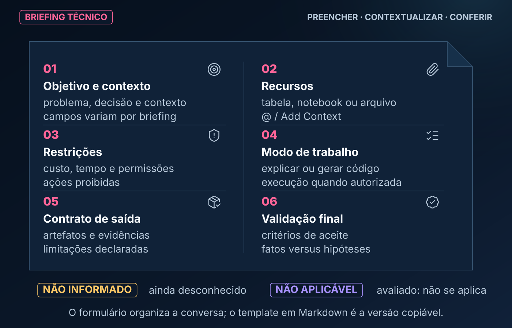
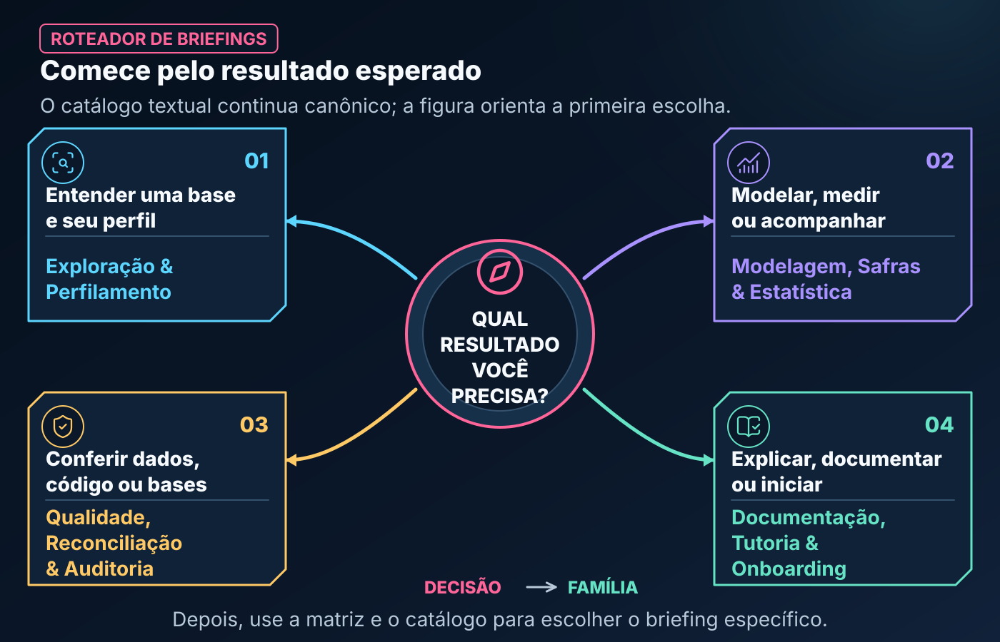
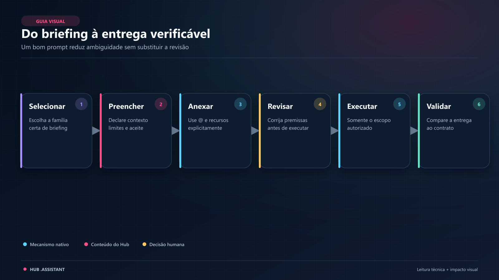

# Hub Prompts — Briefings Técnicos Estruturados para Genie Code

O **Hub Prompts** é a camada de interface e especificação técnica do ecossistema. Ele reúne formulários e briefings padronizados para orientar a interação humana com a **Databricks Genie Code**, ajudando a traduzir demandas analíticas em instruções delimitadas, rastreáveis e reproduzíveis.

> **CONTEÚDO CUSTOMIZADO PELO HUB · USO MANUAL.** `hub_prompts` não é uma pasta nativa descoberta ou executada automaticamente pela Genie Code. Você escolhe o template, preenche os campos e fornece o conteúdo no chat junto aos recursos necessários.

Em vez de depender apenas de comandos improvisados, o Hub Prompts estabelece um contrato claro entre quem solicita a análise e o assistente de IA.

---

## 🧭 Neste Guia

| Para entender... | Vá para... |
|---|---|
| por que usar um briefing estruturado | [O que é um Prompt Estruturado](#-o-que-é-um-prompt-estruturado) |
| como um objeto de prompt é organizado | [Anatomia da Pasta](#️-a-anatomia-de-uma-pasta-de-prompt) |
| como preencher sem inventar informações | [Disciplina dos Parâmetros](#-a-disciplina-dos-parâmetros-evitando-alucinações) |
| qual prompt escolher | [Catálogo Detalhado](#-catálogo-detalhado-de-prompts) |
| como conduzir a interação | [Passo a Passo Operacional](#️-passo-a-passo-operacional-do-briefing-ao-resultado) |
| dúvidas e limites | [Perguntas Frequentes](#-perguntas-frequentes-faq) |

---

<a id="-o-que-é-um-prompt-estruturado"></a>

## 🎯 O que é um Prompt Estruturado?

No ecossistema, um prompt estruturado funciona como uma **Ordem de Serviço (OS) ou Especificação Técnica de Requisitos**.

Imagine solicitar a construção de um pipeline para uma equipe de engenharia de dados:

- Se você disser apenas *“faça um pipeline com os dados de vendas”*, ficarão abertos frequência, grão, chaves, volume, destino e critérios de aceite.
- Se você entregar uma **especificação técnica** com fontes, janela temporal, filtros, restrições, entregáveis e validações, a comunicação fica mais precisa e o resultado mais fácil de revisar.

O Hub Prompts aplica essa disciplina ao desenvolvimento assistido por IA:

| Característica | Chat Informal / Ad hoc | Briefing Estruturado (Hub Prompts) |
| :--- | :--- | :--- |
| **Entrada** | Pedido amplo: “analise esta tabela”. | Objetivo, dados, grão, chaves, período e filtros. |
| **Premissas da IA** | Muitas lacunas precisam ser resolvidas durante a conversa. | Desconhecidos e hipóteses são declarados para inspeção ou aprovação. |
| **Controle de Custo** | Escopo de leitura e execução pode ficar implícito. | Limites e modo de trabalho podem ser definidos antes da execução. |
| **Segurança & Dados** | Operações permitidas podem não estar claras. | Guardrails, aprovações e tratamento de dados são explicitados. |
| **Entregável** | Formato varia conforme a interpretação. | Contrato de saída e critérios de aceite ficam no próprio briefing. |

> **Uso assistido:** o briefing melhora a especificação, mas não garante que a resposta ou o código estejam corretos. Você continua responsável por revisar plano, dados utilizados, código, resultados e operações propostas.

---

<a id="️-a-anatomia-de-uma-pasta-de-prompt"></a>
<a id="estrutura-do-hub-prompts"></a>

## 🏗️ A Anatomia de uma Pasta de Prompt

Seguindo o padrão de organização **Pasta de Objeto**, cada demanda do Hub Prompts possui uma pasta autossuficiente com três componentes:

```text
hub_prompts/
└── eda_rapida/
    ├── README.md                 <- guia local para escolher e interpretar
    ├── eda_rapida.md             <- briefing técnico preenchível
    └── exemplo_eda_rapida.py     <- notebook didático de acompanhamento
```



*Leitura da figura: o template permanece o contrato copiável; a figura mostra como seus blocos reduzem ambiguidade e tornam o aceite verificável.*

A figura funciona como um mapa de preenchimento. O template continua sendo o contrato copiável e deve carregar os detalhes concretos que não cabem no resumo visual.

A pasta de prompt tem três camadas complementares: **README local para decidir se o recurso é adequado**, **briefing para preencher** e **notebook para preparar o cenário e registrar evidência**. O README não substitui o briefing, e o notebook não transforma uma resposta esperada em execução real.

### 1. O Arquivo Markdown (`<nome>.md`)

É a fonte do briefing. Em geral, contém:

- **Quando usar e quando não usar:** delimita o propósito e as fronteiras.
- **Guia de preenchimento:** explica o significado, o motivo e um exemplo de cada campo.
- **Prompt pronto para preencher:** reúne contexto, modo de trabalho e contrato de saída.
- **O que conferir na resposta:** checklist para revisar se a entrega cumpriu o pedido.

### 2. O Notebook de Acompanhamento (`exemplo_<nome>.py`)

O notebook documenta o ciclo de uso do briefing em três partes:

1. **Parte 1 — Preparo do Ambiente:** cria dados sintéticos controlados ou aponta recursos de teste.
2. **Parte 2 — Prompt Preenchido:** mostra uma instância completa do briefing, sem placeholders pendentes.
3. **Parte 3 — Registro da Resposta Real:** espaço para registrar a resposta obtida, a skill utilizada, evidências, pontos fortes e lacunas.

> **Atenção:** o notebook é uma demonstração e um recipiente de evidência. Enquanto a Parte 3 não contiver uma resposta realmente produzida e revisada, ele não comprova homologação conversacional do prompt.

### 3. Exemplo de briefing completamente preenchido

```text
Quero realizar uma EDA rápida da tabela anexada `catalogo.analytics.customer_events`.

Objetivo:
- decidir se a base está apta para uma análise mensal de retenção;
- identificar bloqueios de qualidade antes de desenhar as métricas.

Contexto dos dados:
- grão esperado: um evento de cliente por linha;
- chave candidata: event_id;
- entidade: customer_id;
- coluna temporal: event_timestamp;
- período: 2026-01-01 a 2026-06-30;
- filtro: event_status = 'valid';
- regras adicionais: NÃO INFORMADO — pergunte antes de assumir.

Modo de trabalho:
- trabalhe somente em leitura;
- apresente primeiro o plano e as consultas pretendidas;
- não colete a tabela inteira no driver;
- limite amostras e explicite o motivo;
- peça aprovação antes de qualquer operação persistente ou de leitura ampla.

Entregue:
1. schema, volume e intervalo temporal observado;
2. avaliação da unicidade da chave e completude das colunas;
3. distribuição das variáveis relevantes;
4. anomalias e limitações, separando fatos de hipóteses;
5. código PySpark reproduzível e próximos passos priorizados.

Critérios de aceite:
- todos os números devem ter origem identificável;
- nenhuma regra de negócio pode ser inventada;
- divergências entre o grão esperado e o observado devem ser destacadas.
```

Esse exemplo é intencionalmente detalhado: ele mostra ao usuário **o que substituir, por que a informação importa e como conferir a resposta**.

---

<a id="-a-disciplina-dos-parâmetros-evitando-alucinações"></a>

## 🧩 A Disciplina dos Parâmetros: Evitando Alucinações

Um risco recorrente no uso de IA generativa em dados é preencher lacunas com hipóteses não confirmadas: assumir uma chave, inferir uma regra contábil ou escolher granularidade sem validação.

Os templates usam três convenções de preenchimento:

- **Valor concreto:** informação conhecida e confirmada, como `id_cliente` ou `dt_referencia`.
- **`NÃO INFORMADO`:** a informação é desconhecida neste momento. O prompt deve instruir a Genie Code a inspecionar o schema, fazer perguntas ou propor uma hipótese para aprovação antes de usá-la.
- **`NÃO APLICÁVEL`:** o campo foi avaliado e não se aplica ao caso, como uma tabela estática sem eixo temporal.

> **Não envie placeholders vazios (`{{...}}`).** Preencha o valor, use `NÃO INFORMADO` ou declare `NÃO APLICÁVEL`. Essas expressões são convenções do briefing, não travas técnicas da plataforma; a instrução e a revisão humana é que controlam o comportamento esperado.

### O contexto mínimo que evita retrabalho

| Informação | Pergunta respondida |
|---|---|
| **Objetivo** | Qual decisão ou resultado o trabalho deve apoiar? |
| **Recursos** | Quais tabelas, notebooks, células, arquivos ou modelos podem ser usados? |
| **Grão e chaves** | O que representa uma linha e como identificar registros? |
| **Tempo** | Qual período, coluna de data e instante de decisão valem? |
| **Regras e filtros** | O que incluir, excluir ou tratar de modo especial? |
| **Restrições** | Há limite de custo, tempo, memória, coleta ou mutação? |
| **Entrega** | Quais códigos, tabelas, gráficos e explicações são esperados? |
| **Aceite** | O que precisa ser verdadeiro para a resposta ser aprovada? |

---

## Do briefing à execução verificável

O percurso é **briefing → skill selecionada → policy/contrato → rota vigente → helpers**.
O briefing informa o problema; a skill define método e artefatos exigidos; os helpers
são componentes reutilizáveis. Importar um módulo não prova que foi chamado ou concluído.

Consulte a [policy](../hub_padroes/skill_enforcement/policy.json): `current_level`
é o nível vigente; `target_level` é direção futura, sem autorização de promoção.
Cada skill tem seu próprio escopo. A [EDA protegida](../skills/hub-ml-eda-profissional/SKILL.md)
exige `run_enforced`, Receipt, handoff e `finalize_or_raise`, com Postflight `PASS`
e `completion.authorized=true` para concluir. SQL/PySpark manual que produz números
semelhantes não substitui essa rota. Essa exigência não se generaliza a toda
comparação independente, Cross-EDA ou skill em outro nível.

---

<a id="familias-do-ciclo-de-dados"></a>

## 📂 Famílias Funcionais de Prompts

Os briefings podem ser entendidos em quatro famílias do ciclo de dados:

```text
hub_prompts/
├── 🔍 Exploração & Perfilamento
├── 📈 Modelagem, Safras & Estatística
├── 🛡️ Qualidade, Reconciliação & Auditoria
└── 📚 Documentação, Tutoria & Onboarding
```

> **Nota de leitura:** essa árvore é uma organização **conceitual deste README**. Fisicamente, os 18 briefings ficam diretamente em `hub_prompts/<nome>/`.



*Leitura da figura: o catálogo textual continua canônico; a figura ensina como escolher a família.*

**Equivalente textual:** comece pelo resultado esperado: entender e perfilar uma base; modelar, medir ou acompanhar; conferir dados, código ou bases; ou explicar, documentar e iniciar um trabalho. Essa primeira decisão leva a uma das quatro famílias abaixo; a matriz e o catálogo refinam a escolha até o briefing específico.

### Matriz rápida de seleção

| Se a sua pergunta começa com... | Comece por... | Família |
|---|---|---|
| “O que existe e posso confiar nesta base?” | `eda_rapida`, `eda_completa` ou `data_quality` | exploração e qualidade |
| “Como estas tabelas se relacionam?” | `cross_eda` ou `comparar_tabelas` | cruzamento e reconciliação |
| “Como medir no tempo sem leakage?” | `safra` ou `feature_engineering` | temporalidade e risco |
| “Como modelar, explicar ou acompanhar?” | `baseline_orchestration`, `explainability` ou `monitoramento_modelo` | ciclo de ML |
| “Como transformar em processo?” | `pipeline` ou `novo_projeto` | implementação e onboarding |
| “Como revisar, ensinar ou documentar?” | `auditoria_skills`, `tutor_explicar` ou `comentar_notebook` | governança e comunicação |
| “A evidência sustenta a hipótese?” | `stat_check` | validação estatística |
| “Que características valeria investigar?” | [descobrir_micromodelos](descobrir_micromodelos/README.md) | descoberta metadata |
| “Já sei a decisão; como especificar a característica?” | [micromodelo_novo](micromodelo_novo/README.md) | especificação de domínio |

### Legenda dos campos de cada briefing

| Campo | Função na conversa |
|---|---|
| **O que faz** | delimita o problema que o template organiza |
| **Skill recomendada** | sugere método; não significa ativação automática |
| **O usuário precisa informar** | explicita dados que não devem ser inventados |
| **Cenário de uso** | mostra quando o briefing costuma ser útil |
| **Arquivos** | indica os caminhos do template e do exemplo no pacote |

### 1. Exploração & Perfilamento

Diagnostica bases desconhecidas, volume, integridade, distribuições e viabilidade preliminar antes de esforços de desenvolvimento mais caros.

### 2. Modelagem, Safras & Estatística

Orienta coortes históricas, validação de hipóteses, engenharia de atributos, modelos baseline, explicabilidade e acompanhamento de drift.

### 3. Qualidade, Reconciliação & Auditoria

Trata confiabilidade de dados e código: anomalias, reconciliação entre bases e revisão crítica de entregas assistidas por IA.

### 4. Documentação, Tutoria & Onboarding

Transforma código em material compreensível, explica conceitos e estrutura o início de novos projetos.

---

<a id="-catálogo-detalhado-de-prompts"></a>

## 📖 Catálogo Detalhado de Prompts

O catálogo abaixo preserva as famílias e acrescenta links diretos para o briefing e para o notebook didático.

Para micromodelos, use [micromodelo_novo](micromodelo_novo/README.md) quando o objetivo já é conhecido e [descobrir_micromodelos](descobrir_micromodelos/README.md) para uma shortlist baseada em metadata. Ambos são briefings da skill `hub-ml-micromodelos`, sem ativação ou autorização própria.

---

### 🔍 Exploração & Perfilamento

#### `eda_rapida` — Perfil Preliminar de Dados

- **O que faz:** organiza um diagnóstico inicial de grão, volume, completude e integridade básica.
- **Skill recomendada:** `@hub-ml-eda-profissional`.
- **O usuário precisa informar:** recurso, objetivo, foco, chave candidata, coluna temporal, filtros e limite de custo/tempo.
- **Cenário de Uso:**
  > *“Recebi acesso a uma tabela nova. Antes de propor uma análise, preciso entender estrutura, qualidade e bloqueios.”*
- **Arquivos:** [briefing](eda_rapida/eda_rapida.md) · [exemplo](eda_rapida/exemplo_eda_rapida.py) · [README local](eda_rapida/README.md)

#### `eda_completa` — Análise Exploratória Profunda

- **O que faz:** estrutura exploração univariada e bivariada, distribuições, cardinalidade, dispersão e relações com o target quando houver.
- **Skill recomendada:** `@hub-ml-eda-profissional`.
- **O usuário precisa informar:** recurso, target, segmentos, janela, regras e restrições.
- **Cenário de Uso:**
  > *“Vamos construir um modelo de propensão e preciso avaliar as features candidatas antes do pré-processamento.”*
- **Arquivos:** [briefing](eda_completa/eda_completa.md) · [exemplo](eda_completa/exemplo_eda_completa.py) · [README local](eda_completa/README.md)

#### `cross_eda` — Exploração Cruzada Multi-Tabelas

- **O que faz:** analisa chaves, cardinalidade, integridade referencial, disponibilidade temporal e risco do join.
- **Skill recomendada:** `@hub-ml-cross-eda-ml`.
- **O usuário precisa informar:** tabelas, chaves, período, grão e resultado esperado do relacionamento.
- **Cenário de Uso:**
  > *“Quero cruzar cadastro e transações e medir correspondência, perda e multiplicação antes da tabela final.”*
- **Arquivos:** [briefing](cross_eda/cross_eda.md) · [exemplo](cross_eda/exemplo_cross_eda.py) · [README local](cross_eda/README.md)

---

### 📈 Modelagem, Safras & Estatística

#### `safra` — Análise de Coortes e Maturação Temporal

- **O que faz:** estrutura coortes, MOB, denominadores, eventos, censura e janelas comparáveis.
- **Skill recomendada:** `@hub-ml-analise-safra`.
- **Cenário de Uso:**
  > *“Quero comparar a inadimplência de contratos originados em meses diferentes após maturidade equivalente.”*
- **Arquivos:** [briefing](safra/safra.md) · [exemplo](safra/exemplo_safra.py) · [README local](safra/README.md)

#### `stat_check` — Validação Estatística de Hipóteses

- **O que faz:** orienta escolha de teste, pressupostos, tamanho de efeito, incerteza e interpretação.
- **Skill recomendada:** `@hub-ml-validacao-estatistica`.
- **Cenário de Uso:**
  > *“Quero avaliar se a diferença observada em um teste A/B é estatisticamente e materialmente relevante.”*
- **Arquivos:** [briefing](stat_check/stat_check.md) · [exemplo](stat_check/exemplo_stat_check.py) · [README local](stat_check/README.md)

#### `feature_engineering` — Engenharia de Atributos Temporais

- **O que faz:** especifica features, entidades, datas de corte, janelas, fontes e prevenção de leakage.
- **Skill recomendada:** `@hub-ml-feature-engineering`.
- **Cenário de Uso:**
  > *“Quero calcular comportamento em 30, 60 e 90 dias usando apenas dados disponíveis até a decisão.”*
- **Arquivos:** [briefing](feature_engineering/feature_engineering.md) · [exemplo](feature_engineering/exemplo_feature_engineering.py) · [README local](feature_engineering/README.md)

#### `baseline_orchestration` — Modelo Baseline Ponta a Ponta

- **O que faz:** define problema, população, split, métricas, baseline e tracking antes de comparar soluções mais complexas.
- **Skill recomendada:** `@hub-ml-baseline-ml`.
- **Cenário de Uso:**
  > *“Preciso validar a esteira e estabelecer uma linha de base reproduzível antes de otimizar modelos.”*
- **Arquivos:** [briefing](baseline_orchestration/baseline_orchestration.md) · [exemplo](baseline_orchestration/exemplo_baseline_orchestration.py) · [README local](baseline_orchestration/README.md)

#### `pipeline` — Construção de Pipelines Modulares

- **O que faz:** especifica fontes, contratos, etapas, incrementalidade, qualidade, observabilidade e destino.
- **Skill recomendada:** `@hub-ml-pipeline-builder`.
- **Cenário de Uso:**
  > *“Quero decompor um notebook monolítico em etapas testáveis e preparar sua automação.”*
- **Arquivos:** [briefing](pipeline/pipeline.md) · [exemplo](pipeline/exemplo_pipeline.py) · [README local](pipeline/README.md)

#### `explainability` — Explicabilidade de Modelos de ML

- **O que faz:** define modelo, população, método, público e limites de uma explicação global ou local.
- **Skill recomendada:** `@hub-ml-explainability`.
- **Cenário de Uso:**
  > *“Preciso entender quais variáveis influenciaram o comportamento do modelo e comunicar as limitações da análise.”*
- **Arquivos:** [briefing](explainability/explainability.md) · [exemplo](explainability/exemplo_explainability.py) · [README local](explainability/README.md)

#### `monitoramento_modelo` — Acompanhamento de Performance e Drift

- **O que faz:** delimita referência, período atual, métricas, drift, thresholds e processo decisório.
- **Skill recomendada:** `@hub-ml-monitoramento-modelo`.
- **Cenário de Uso:**
  > *“Quero investigar se a população ou a performance mudou e produzir evidência para decidir o próximo passo.”*
- **Arquivos:** [briefing](monitoramento_modelo/monitoramento_modelo.md) · [exemplo](monitoramento_modelo/exemplo_monitoramento_modelo.py) · [README local](monitoramento_modelo/README.md)

---

### 🛡️ Qualidade, Reconciliação & Auditoria

#### `data_quality` — Varredura e Regras de Integridade

- **O que faz:** estrutura verificações de schema, nulidade, unicidade, formato e regras específicas.
- **Skill recomendada:** `@hub-ml-eda-profissional`.
- **Cenário de Uso:**
  > *“Antes de disponibilizar uma tabela, quero verificar chaves, nulos, intervalos e regras de domínio.”*
- **Arquivos:** [briefing](data_quality/data_quality.md) · [exemplo](data_quality/exemplo_data_quality.py) · [README local](data_quality/README.md)

#### `comparar_tabelas` — Reconciliação entre Bases de Dados

- **O que faz:** compara schema, contagens, chaves e valores entre duas versões ou implementações.
- **Skill recomendada:** Genie Code ou `@hub-ml-cross-eda-ml`, conforme o foco.
- **Cenário de Uso:**
  > *“Quero reconciliar uma saída legada com a nova implementação e localizar divergências.”*
- **Arquivos:** [briefing](comparar_tabelas/comparar_tabelas.md) · [exemplo](comparar_tabelas/exemplo_comparar_tabelas.py) · [README local](comparar_tabelas/README.md)

#### `auditoria_skills` — Auditoria de Código Gerado por IA

- **O que faz:** confronta pedido, skill, código, execução, evidências, helpers e guardrails.
- **Skill recomendada:** `@hub-ml-auditoria-skills`.
- **Cenário de Uso:**
  > *“Antes de aceitar um notebook gerado com IA, quero revisar segurança, temporalidade, custo e aderência ao contrato.”*
- **Arquivos:** [briefing](auditoria_skills/auditoria_skills.md) · [exemplo](auditoria_skills/exemplo_auditoria_skills.py) · [README local](auditoria_skills/README.md)

---

### 📚 Documentação, Tutoria & Onboarding

#### `comentar_notebook` — Revisão e documentação de notebooks

- **O que faz:** orienta cabeçalhos, contexto antes do código, comentários e interpretação depois da execução.
- **Skill recomendada:** `@hub-ml-comentar-notebook`.
- **Cenário de Uso:**
  > *“Quero tornar um notebook denso compreensível para a equipe sem alterar silenciosamente sua lógica.”*
- **Arquivos:** [briefing](comentar_notebook/comentar_notebook.md) · [exemplo](comentar_notebook/exemplo_comentar_notebook.py) · [README local](comentar_notebook/README.md)

#### `tutor_explicar` — Mentoria Técnica e Explicabilidade de Código

- **O que faz:** estrutura uma explicação adequada ao nível do leitor, com conceito, leitura do código, riscos e exercício.
- **Skill recomendada:** `@hub-ml-tutor-databricks`.
- **Cenário de Uso:**
  > *“Quero entender como o plano Spark, o particionamento e o join se relacionam com a lentidão observada.”*
- **Arquivos:** [briefing](tutor_explicar/tutor_explicar.md) · [exemplo](tutor_explicar/exemplo_tutor_explicar.py) · [README local](tutor_explicar/README.md)

#### `novo_projeto` — Kick-off Estruturado de Projetos de Dados

- **O que faz:** conduz descoberta de negócio, fontes, restrições, arquitetura, riscos, entregáveis e critérios de aceite.
- **Skill recomendada:** Genie Code; selecione uma skill especializada depois que a natureza da entrega estiver clara.
- **Cenário de Uso:**
  > *“Vamos iniciar um projeto de precificação e quero organizar perguntas, escopo, dependências e plano antes de criar artefatos.”*
- **Arquivos:** [briefing](novo_projeto/novo_projeto.md) · [exemplo](novo_projeto/exemplo_novo_projeto.py) · [README local](novo_projeto/README.md)

---

<a id="️-passo-a-passo-operacional-do-briefing-ao-resultado"></a>
<a id="passo-a-passo-operacional-do-briefing-ao-resultado"></a>

## 🛠️ Passo a Passo Operacional: Do Briefing ao Resultado

Seguir o fluxo abaixo favorece respostas mais consistentes, código auditável e menor retrabalho:



*Leitura da figura: a execução ocorre dentro do escopo e da política definidos no estágio de revisão.*

**Equivalente textual:** os cinco macroestágios são selecionar o briefing, preencher os metadados, anexar recursos e definir o modo de trabalho, revisar o plano antes de executar e validar a entrega contra o contrato de saída. A execução pertence ao quarto estágio; não constitui um sexto macroestágio.

### 1. Selecione o Briefing Adequado

Escolha o prompt pelo resultado principal. Se a demanda mistura EDA, features e baseline, trate cada fase com seu próprio contrato e só transporte premissas já validadas.

### 2. Preencha os Metadados com Rigor

Substitua todos os placeholders. Use identificadores precisos, declare desconhecidos e não envie segredos, tokens, credenciais ou dados desnecessários.

### 3. Anexe os Recursos e Defina o Modo de Trabalho

Na Genie Code:

- use `@` ou **Add Context** para fornecer tabelas, notebooks, arquivos e outros recursos oferecidos pela interface;
- use o identificador completo `catalog.schema.table` quando trabalhar com Unity Catalog;
- quando aplicável, utilize contexto de célula, como `@cell`;
- `/findTables` pode ajudar a localizar tabelas; aliases como `/eda` não são comandos registrados pelo Hub;
- diga se deseja explicação, plano, geração de código ou execução;
- selecione uma skill com `@` quando quiser explicitar a metodologia.

Uma conversa nova é útil quando objetivo, conjunto de dados ou fase mudam materialmente. Para refinamentos do mesmo problema, o histórico validado pode ajudar.

### 4. Revise o Plano antes de Executar

Confirme recursos, filtros, período, operações, coleta no driver, custo e ações persistentes. Um prompt não amplia permissões e não substitui a política de aprovação configurada.

### 5. Valide a Entrega contra o Contrato de Saída

- diferencie código sugerido, código executado e resultado validado;
- confira se fatos e hipóteses estão separados;
- confirme a origem dos números e as limitações;
- revise qualquer `CREATE`, `ALTER`, `DROP`, `DELETE`, `MERGE`, instalação ou mudança de configuração;
- registre a resposta real no notebook de exemplo apenas quando ela tiver sido obtida e revisada.

---

<a id="-perguntas-frequentes-faq"></a>

## ❓ Perguntas Frequentes (FAQ)

### 1. Por que preencher um briefing estruturado em vez de apenas fazer uma pergunta livre?

Porque o briefing torna objetivo, dados, temporalidade, limites e entrega explícitos. Isso reduz ambiguidades e facilita a revisão, mas não impede sozinho erros do modelo ou do usuário.

### 2. O que preencher quando eu não souber a chave primária ou a granularidade?

Use `NÃO INFORMADO` e instrua o assistente a inspecionar ou perguntar antes de assumir. Não invente um nome e não deixe o placeholder vazio.

### 3. Por que o notebook `exemplo_*.py` não executa o prompt automaticamente?

Porque o prompt é uma interface conversacional. O notebook prepara dados, demonstra o preenchimento e registra a resposta real; não existe, neste Hub, uma automação silenciosa que envie o texto ao chat.

### 4. Quando abrir uma conversa nova?

Quando mudar materialmente o objetivo, os dados, a fase ou a skill recém-editada. Para aprofundar a mesma tarefa com premissas já verificadas, continuar a conversa pode preservar contexto útil.

### 5. Minha equipe pode criar novos modelos de briefing?

Sim. Inclua `<nome>/README.md`, `<nome>/<nome>.md` e `<nome>/exemplo_<nome>.py`, explique cada campo e inclua limites, saída e checklist. A skill `@hub-ml-criar-objeto` pode orientar a estrutura, mas criar arquivos continua sendo uma ação explícita.

### 6. O prompt carrega a skill e os helpers automaticamente?

Não. O briefing fornece contexto. Após seleção, a rota da skill governa como os recursos são localizados, importados, chamados e verificados. Um import isolado não comprova execução ou conclusão.

---

## 🔗 Continue Explorando

- [Agent Skills](../skills/README.md)
- [Hub Snippets](../hub_snippets/README.md)
- [Hub Scripts](../hub_scripts/README.md)
- [Boas práticas de prompting na Genie Code](https://learn.microsoft.com/en-us/azure/databricks/genie-code/tips)
- [Funcionalidades da Genie Code](https://learn.microsoft.com/en-us/azure/databricks/genie-code/features-capabilities)

## Guias locais e estado dos exemplos

Cada pasta contém guia, briefing e exemplo. Comece pelo guia, confira as entradas
e leia os efeitos do preparo antes de executar. Há **18 briefings**: os 16 exemplos
conversacionais tradicionais permanecem **NÃO EXECUTADO**; os dois de Micromodelos
registram conversas E1 delimitadas, com ressalvas próprias. Uma evidência não
completa nem homologa os demais casos.

- [Descobrir Micromodelos](descobrir_micromodelos/README.md): [briefing](descobrir_micromodelos/descobrir_micromodelos.md) e [exemplo](descobrir_micromodelos/exemplo_descobrir_micromodelos.py), para shortlist metadata-only.
- [Micromodelo Novo](micromodelo_novo/README.md): [briefing](micromodelo_novo/micromodelo_novo.md) e [exemplo](micromodelo_novo/exemplo_micromodelo_novo.py), para objetivo conhecido e lacunas da especificação.

**Preparo pode escrever mesmo em pedido “somente plano”.** EDA, Baseline,
Explainability, Novo Projeto, Pipeline e Stat Check compartilham o destino
`workspace.default.hub_exemplo_clientes`; Cross-EDA e Feature Engineering compartilham
`workspace.default.hub_exemplo_fatos` e `workspace.default.hub_exemplo_features`.
Os notebooks usam overwrite: confira colisões e autorização antes da Parte 1 ou Run all.
Outros destinos estão declarados nos respectivos exemplos. Ler/preencher o briefing
não exige executar essas células.
