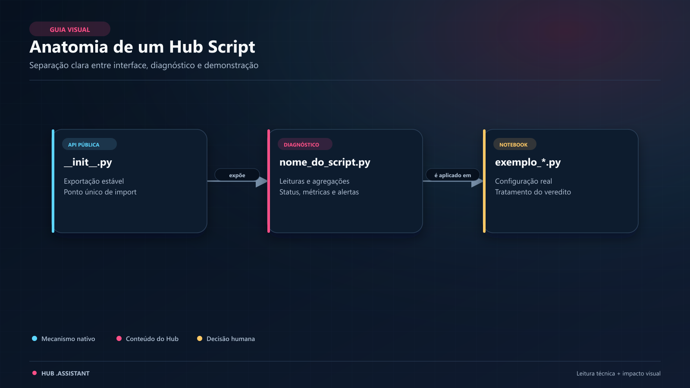
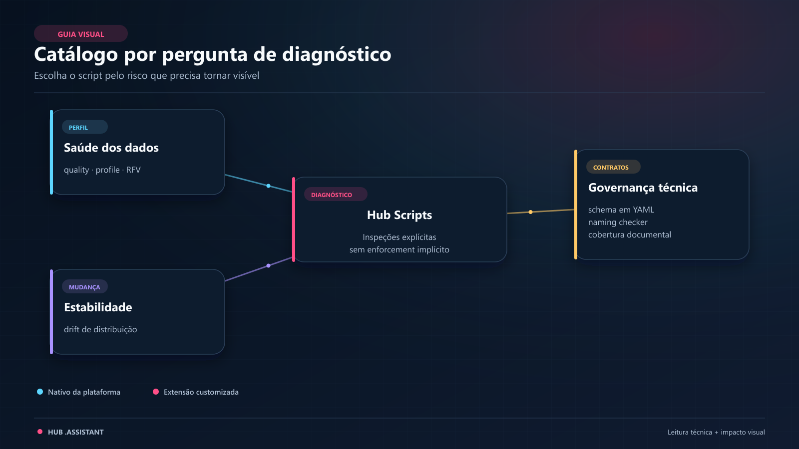
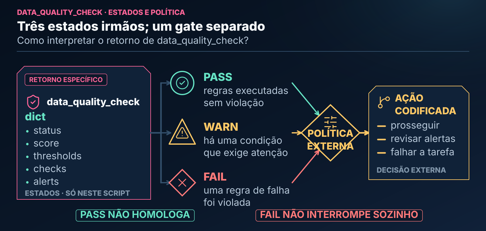

# Hub Scripts

> Utilitários de inspeção, transformação analítica e governança técnica para trabalhar com tabelas, schemas e notebooks de forma explícita no Databricks.

> **CONTEÚDO CUSTOMIZADO PELO HUB.** `hub_scripts` não é executado automaticamente pela Genie Code. Cada utilitário precisa ser importado e chamado por um notebook, tarefa ou pessoa. O código consumidor também interpreta o contrato específico da saída e codifica qualquer reação operacional.

---

## 🧭 Neste Guia

| Para entender... | Vá para... |
|---|---|
| o papel de um Hub Script | [O que é um Script](#o-que-e-um-script-neste-ecossistema) |
| os sete utilitários disponíveis | [Catálogo Detalhado](#catalogo-detalhado) |
| como escolher, executar e interpretar um utilitário | [Passo a Passo Operacional](#passo-a-passo-operacional-como-usar-um-script) |
| custo e efeitos de cada utilitário | [O que Acontece Durante a Execução](#o-que-acontece-durante-a-execucao) |
| a diferença entre diagnóstico e regra operacional | [Diagnóstico não é Enforcement](#diagnostico-nao-e-enforcement) |
| dúvidas e limitações | [Perguntas Frequentes](#perguntas-frequentes-faq) |

---

<a id="-o-que-é-um-script-neste-ecossistema"></a>
<a id="o-que-e-um-script-neste-ecossistema"></a>

## 🔍 O que é um Script neste Ecossistema?

Em pipelines de dados modernos, uma análise confiável depende tanto da qualidade dos dados quanto da clareza dos contratos, das transformações e da documentação que sustentam o trabalho.

Uma tabela com chaves duplicadas, variáveis defasadas ou distribuições alteradas pode fragilizar um modelo. Da mesma forma, features sem corte temporal explícito, schemas pouco revisáveis e notebooks sem documentação próxima tornam a solução difícil de conferir e manter.

**No ecossistema `.assistant`, um Hub Script executa uma responsabilidade técnica delimitada.** Ele pode inspecionar uma base, comparar distribuições, construir features RFV, serializar um schema ou conferir nomenclatura e cobertura documental.

Pense em uma bancada de ferramentas: você escolhe o instrumento pela pergunta que precisa responder e lê a saída conforme o contrato daquela ferramenta.

- Antes de usar uma base para treinar um modelo de crédito, churn ou séries temporais, você pode executar um diagnóstico compatível com o risco.
- Para preparar features ou contratos técnicos, você pode usar uma transformação ou serialização com retorno próprio.
- O script não agenda a si mesmo nem torna sua saída automaticamente normativa; o notebook, job, pipeline ou pessoa consumidora decide como usá-la.

```text
┌─────────────────────────────────────────────────────────────────────────────┐
│                            O PAPEL DE UM SCRIPT                             │
│                                                                             │
│   🎯 Responsabilidade Delimitada: cada utilitário resolve uma tarefa clara  │
│   📦 Contrato Específico: retorna DataFrame, texto, lista ou dicionário      │
│   🛡️ Ação Explícita: importar e chamar não acontece automaticamente         │
│   🔎 Resultado Conferível: o consumidor interpreta limites e evidências     │
└─────────────────────────────────────────────────────────────────────────────┘
```

---

<a id="arquitetura-e-o-padrao-pasta-de-objeto"></a>

## 🏛️ Arquitetura e o Padrão "Pasta de Objeto"

Os scripts seguem o padrão de organização **Pasta de Objeto**. Cada utilitário mora em sua própria pasta:



*Leitura da figura: interface, implementação e demonstração permanecem separadas; a implementação define o contrato específico da ferramenta.*

**Equivalente textual da figura:** o núcleo executável contém `__init__.py`, implementação e `exemplo_<nome>.py`; cada objeto operacional possui também `README.md`, que explica adequação, requisitos, efeitos, limites e interpretação antes da execução. A saída não é universal: conforme o utilitário, pode ser dicionário, DataFrame Spark, texto YAML/JSON ou lista de violações.

O notebook `exemplo_<nome>.py` mostra uma chamada com dados controlados e a saída observada. Alguns exemplos simulam falhas; outros demonstram apenas o caminho principal. Por isso, o exemplo ensina o contrato exercitado, mas não substitui testes de volume, permissões ou runtime.

---

<a id="-catálogo-detalhado"></a>
<a id="catalogo-detalhado"></a>

## 📚 Catálogo Detalhado

Os sete utilitários se distribuem por quatro frentes funcionais: qualidade e perfil, estabilidade, transformação analítica e governança técnica. Todos são executados sob demanda e cada um preserva seu próprio contrato de retorno.



*Leitura da figura: qualidade e perfil, estabilidade, transformação analítica e governança técnica respondem a necessidades diferentes.*

**Equivalente textual da figura:** `data_quality_check` e `quick_profile` inspecionam qualidade e perfil; `drift_detector` compara distribuições; `rfv_calculator` constrói features RFV; `schema_to_yaml`, `naming_checker` e `doc_coverage` apoiam governança técnica. Os tipos de retorno estão explícitos no catálogo abaixo.

---

### 🩺 1. Qualidade e Perfilamento de Dados (Data Health)

Este grupo reúne a inspeção inicial e seu preparo analítico próximo. Há uma distinção importante: `data_quality_check` e `quick_profile` inspecionam a base; `rfv_calculator` constrói features e não emite um diagnóstico de aprovação.

#### `data_quality_check` — Inspeção Sanitária Pré-Modelagem

- **Guia local:** [data_quality_check: guia local](data_quality_check/README.md)

- **O que faz:** avalia uma tabela por nome, calcula nulos em todas as colunas, verifica nulidade e unicidade das `pk_columns` e, quando `date_column` é informada, avalia atualidade.
- **O que retorna:** dicionário com `status: "pass"`, `"warn"` ou `"fail"`, métricas e uma lista de alertas estruturados como dicionários.
- **Quando usar:** ao receber uma tabela nova ou como diagnóstico anterior a uma etapa de treino. Os thresholds são política fornecida à chamada, não defaults oficiais da Databricks.

#### `quick_profile` — Raio-X de Schema e Distribuição

- **Guia local:** [quick_profile: guia local](quick_profile/README.md)

- **O que faz:** lê a tabela, calcula volume e nulos no conjunto completo e usa uma amostra configurada para cardinalidade e resumos adicionais.
- **O que retorna:** dicionário com metadados, métricas e informações de perfilamento.
- **Quando usar:** na primeira etapa de exploração, entendendo que contagem e nulos ainda podem exigir leitura completa da tabela.

#### `rfv_calculator` — Recência, Frequência e Valor

- **Guia local:** [rfv_calculator: guia local](rfv_calculator/README.md)

- **O que faz:** calcula atributos brutos de recência, frequência e valor por entidade e por períodos anteriores a uma data de corte.
- **O que retorna:** DataFrame Spark com as colunas RFV produzidas.
- **Quando usar:** antes de segmentações ou features comportamentais. O script não cria automaticamente quintis, personas nem política de negócio.

---

### 📉 2. Estabilidade e Monitoramento de Distribuição

#### `drift_detector` — Detecção de Desvios de Distribuição

- **Guia local:** [drift_detector: guia local](drift_detector/README.md)

- **O que faz:** recebe uma tabela, uma coluna de coorte, valores de referência e comparação e colunas numéricas; calcula PSI por variável com bins derivados da referência.
- **O que retorna:** dicionário com o PSI e os detalhes por variável. Sem os dois limiares opcionais, a classificação é `not_classified`; com `warning_threshold` e `critical_threshold` válidos, ela pode ser `stable`, `attention` ou `critical`.
- **Quando usar:** ao comparar duas coortes dentro da mesma tabela. PSI indica mudança de distribuição; não demonstra sozinho perda de performance ou causalidade.

---

### 📐 3. Governança, Contratos e Boas Práticas de Código

#### `schema_to_yaml` — Contratos de Dados em YAML

- **Guia local:** [schema_to_yaml: guia local](schema_to_yaml/README.md)

- **O que faz:** inspeciona uma tabela Spark e serializa nomes, tipos e nulabilidade. Estatísticas podem ser incluídas quando solicitadas.
- **O que retorna:** string YAML; na ausência de PyYAML, o fallback é JSON, que também é válido em YAML 1.2. O script não grava arquivo automaticamente.
- **Quando usar:** para preparar uma representação revisável do schema antes de versioná-la pelo mecanismo escolhido.

#### `naming_checker` — Guardião de Nomenclatura

- **Guia local:** [naming_checker: guia local](naming_checker/README.md)

- **O que faz:** recebe o nome de uma tabela, lê suas colunas e compara os nomes com a política configurada, incluindo regras como `snake_case` e prefixos.
- **O que retorna:** lista de violações encontradas.
- **Quando usar:** antes de promover ou compartilhar uma tabela. As convenções são regras do Hub ou da equipe, não exigências universais do Unity Catalog.

#### `doc_coverage` — Auditoria Estrutural de Documentação

- **Guia local:** [doc_coverage: guia local](doc_coverage/README.md)

- **O que faz:** lê um notebook Jupyter ou uma fonte Databricks exportada como arquivo e mede a proximidade entre blocos Markdown e código.
- **O que retorna:** dicionário heurístico com cobertura e blocos sem documentação adjacente.
- **Quando usar:** em revisão de código. O script não abre um notebook diretamente por URL do workspace, não mede docstrings e não avalia a qualidade semântica do texto.

---

<a id="️-passo-a-passo-operacional-como-usar-um-script"></a>
<a id="passo-a-passo-operacional-como-usar-um-script"></a>

## 🛠️ Passo a Passo Operacional: Como Usar um Script

Integrar um Hub Script à rotina do Databricks segue um fluxo simples, mas deliberado: escolha a ferramenta, forneça o recurso e os parâmetros exigidos, leia o contrato específico da saída e só então codifique a reação necessária.


*Leitura da figura: a ferramenta escolhida define o retorno; não existe um dicionário de status compartilhado por todos os Hub Scripts.*

**Equivalente textual da figura:** `rfv_calculator` devolve DataFrame Spark; `schema_to_yaml`, texto YAML ou JSON; `naming_checker`, lista de violações; e os demais, dicionários com estruturas próprias. Entre esses dicionários, `data_quality_check` expõe `status`, `score`, `thresholds`, `checks` e `alerts`; `quick_profile` devolve o perfil; `drift_detector`, PSI e classificação condicional; e `doc_coverage`, métricas heurísticas de cobertura.

### Exemplo Prático de Código

O exemplo abaixo usa especificamente `data_quality_check`. Os campos e o tratamento mostrados aqui não devem ser copiados como se fossem o contrato universal dos outros seis utilitários.

Se a raiz `.assistant` ainda não estiver no caminho do Python, configure-a antes do import:

```python
from pathlib import Path
import sys

assistant_root = Path("/Workspace/Users/<username>/.assistant")
if str(assistant_root) not in sys.path:
    sys.path.insert(0, str(assistant_root))
```

Em seguida, execute a checagem com a assinatura real:

```python
# 1. Importação explícita do diagnóstico
from hub_scripts.data_quality_check import data_quality_check

# 2. Execução apontando para uma tabela governada
resultado = data_quality_check(
    table_name="catalogo.credito.clientes_abril",
    pk_columns=["id_cliente"],
    date_column="dt_referencia",
    thresholds={
        "null_warn": 5.0,
        "null_fail": 20.0,
        "freshness_days": 2.0,
    },
)

# 3. Tratamento do veredito pelo notebook consumidor
print(f"Status do diagnóstico: {resultado['status'].upper()}")

for alerta in resultado["alerts"]:
    print(
        f"{alerta['severity'].upper()} · "
        f"{alerta['check']} · {alerta['message']}"
    )

if resultado["status"] == "fail":
    raise ValueError("A tabela violou as regras configuradas de qualidade.")
elif resultado["status"] == "warn":
    print("Há alertas que exigem análise antes de prosseguir.")
else:
    print("Nenhuma violação foi encontrada pelas regras executadas.")
```

O helper usa `pk_columns`; não existem os parâmetros `primary_keys` ou `critical_columns`. Um status `pass` significa apenas que as verificações configuradas não encontraram violações — não que a tabela inteira esteja homologada para qualquer finalidade.

### Como interpretar o retorno

| Estado | Significado | Decisão típica do consumidor |
|---|---|---|
| `pass` | nenhuma regra configurada encontrou violação | avaliar os demais gates e prosseguir somente se a política permitir |
| `warn` | existe condição que requer atenção | revisar alertas e decidir conscientemente |
| `fail` | ao menos uma regra de falha foi violada | interromper somente se essa política estiver codificada |

Os estados nunca substituem o contexto de negócio. A severidade informa a
classificação do diagnóstico; o notebook, job ou pipeline implementa a ação.

Exemplo abreviado da estrutura retornada:

```python
{
    "status": "warn",
    "score": 95,
    "thresholds": {
        "null_warn": 5.0,
        "null_fail": 20.0,
        "freshness_days": 2.0,
    },
    "checks": {
        "row_count": 125000,
        "pk_uniqueness": {
            "duplicate_rows": 0,
            "null_key_rows": 0,
            "status": "pass",
        },
        "nulls": {"coluna_exemplo": {"count": 6250, "pct": 5.0, "status": "warn"}},
    },
    "alerts": [
        {
            "check": "null_rate",
            "column": "coluna_exemplo",
            "severity": "warn",
            "message": "Null rate 5.00% (6250/125000).",
        }
    ],
}
```

---

<a id="️-o-que-acontece-durante-a-execução"></a>
<a id="leitura-visual-do-veredito"></a>

### Leitura visual do veredito



*Leitura da figura: PASS, WARN e FAIL são estados irmãos exclusivos de `data_quality_check`; nenhum deles executa uma reação por conta própria.*

**Equivalente textual da figura:** `pass` indica ausência de violações nas verificações configuradas, não homologação; `warn` indica uma condição que exige atenção; e `fail` indica que uma regra de falha foi violada. Depois do diagnóstico, uma política externa e codificada decide se o consumidor prossegue, registra e revisa alertas ou falha a tarefa.

<a id="o-que-acontece-durante-a-execucao"></a>

## ⚙️ O que Acontece Durante a Execução?

| Script | Operação principal | Cuidado de custo ou efeito |
|---|---|---|
| `data_quality_check` | agregado completo + distinct da chave | scan e possível shuffle |
| `quick_profile` | volume/nulos completos + ações sobre amostra | tabela larga aumenta o custo |
| `drift_detector` | filtros, quantis, bins e agregações por coluna | custo cresce com variáveis e bins |
| `rfv_calculator` | filtros temporais, agregações e joins | custo cresce com períodos e entidades |
| `schema_to_yaml` | schema; agregados se houver estatísticas | persistência do texto é externa |
| `naming_checker` | leitura de schema | não inspeciona conteúdo das linhas |
| `doc_coverage` | leitura e parse de arquivo | não executa Spark |

Os scripts priorizam processamento distribuído quando trabalham com Spark, mas isso não significa custo desprezível. Contagens, distinct, quantis e `groupBy` podem exigir leitura ampla e shuffle.

---

<a id="-diagnóstico-não-é-enforcement"></a>
<a id="diagnostico-nao-e-enforcement"></a>

## 🧭 Diagnóstico não é Enforcement

Quando um Hub Script é usado como diagnóstico, ele descreve o que observou; a camada operacional decide o que fazer.


*Leitura da figura: Hub Script, regra consumidora e serviços de orquestração são camadas diferentes.*

**Equivalente textual da figura:** na camada de medição, o script de diagnóstico lê e calcula, devolvendo evidência; na camada de política, o código consumidor interpreta essa saída; e, somente quando configurados e disponíveis no workspace, serviços operacionais aplicam regras, histórico, tarefas ou notificações. O Hub Script não agenda, notifica nem interrompe outro processo sozinho.

- Para regras executadas dentro de um pipeline declarativo, avalie **Lakeflow expectations**.
- Para histórico operacional, use o **event log** do pipeline.
- Para falhas de tarefa e notificações, configure **Lakeflow Jobs**.
- O script não envia alerta nem interrompe outro processo sozinho; o código consumidor precisa implementar essa decisão.

---

<a id="-perguntas-frequentes-faq"></a>
<a id="perguntas-frequentes-faq"></a>

## ❓ Perguntas Frequentes (FAQ)

### 1. Se o script retornar `status="fail"`, meus dados serão apagados ou modificados?

**Não pelo script.** Esses utilitários não executam `DELETE`, `DROP` ou sobrescrita. Alguns apenas leem e descrevem; `rfv_calculator` constrói um novo DataFrame; `schema_to_yaml` serializa texto em memória. Persistência ou falha de tarefa é uma ação separada e explícita do consumidor.

### 2. Os scripts funcionam com tabelas do Unity Catalog?

Os scripts que recebem tabelas usam a sessão Spark ativa. Prefira o formato de três níveis (`catalog.schema.table`) para eliminar ambiguidade. Formatos mais curtos dependem do catálogo e do schema ativos, e nenhum script contorna permissões.

### 3. Preciso rodar esses scripts pelo terminal ou dentro de um notebook?

Eles foram estruturados como módulos Python importáveis. Podem ser chamados em notebooks ou tarefas compatíveis, desde que o pacote esteja no `sys.path`, as dependências existam e uma `SparkSession` esteja disponível quando exigida.

### 4. Os scripts causam lentidão em tabelas volumosas?

**Podem causar.** Ações agregadas continuam lendo dados e operações como distinct, quantis, joins e `groupBy` podem gerar shuffle. Avalie plano, colunas, filtros, partições e frequência antes de automatizar.

### 5. Posso usar os scripts em pipelines automatizados?

**Sim, desde que a política seja explícita.** Uma tarefa pode chamar `data_quality_check` e decidir falhar em `fail`, revisar `warn` ou persistir métricas. O alerta, a interrupção e a recorrência devem ser configurados em Lakeflow Jobs ou no mecanismo de orquestração adotado.

### 6. A Genie Code executa estes scripts automaticamente?

**Não.** Skills podem sugerir um caminho de helper, mas importar e executar o módulo é uma ação explícita. `hub_scripts` é uma extensão do projeto, não uma capacidade nativa de descoberta da Genie Code.

---

## 🔗 Continue Explorando

- [Hub Snippets](../hub_snippets/README.md)
- [Agent Skills](../skills/README.md)
- [Hub Prompts](../hub_prompts/README.md)
- Catálogo de Helpers: `.assistant/MANUAL_TECNICO.md#catalogo-helpers`
- [Lakeflow expectations](https://learn.microsoft.com/en-us/azure/databricks/ldp/expectations)
- [Event log de pipelines](https://learn.microsoft.com/en-us/azure/databricks/ldp/monitor-event-logs)
- [Notificações de Lakeflow Jobs](https://learn.microsoft.com/en-us/azure/databricks/jobs/notifications)

## Guias locais por objeto

Cada objeto novo inclui um `README.md` para explicar conceito, contexto e
limites antes do exemplo. A migração dos legados é gradual. O
[contrato editorial](../hub_padroes/readme/template_objeto.md) padroniza essa
leitura; o Manual continua sendo o catálogo integrado. Leia o aviso de efeitos
do exemplo: ele pode escrever mesmo quando o helper apenas lê.

No piloto R02, o [guia de quick_profile](quick_profile/README.md) explica
o que vem da tabela inteira e o que vem da amostra, além dos limites de
cardinalidade e da possível exposição de categorias sensíveis.
