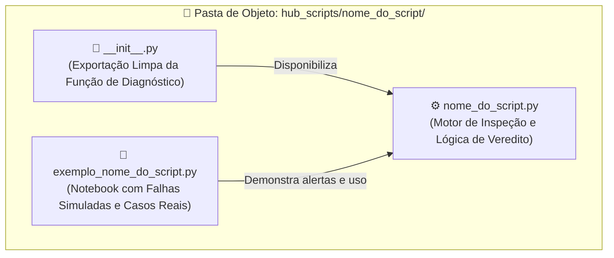
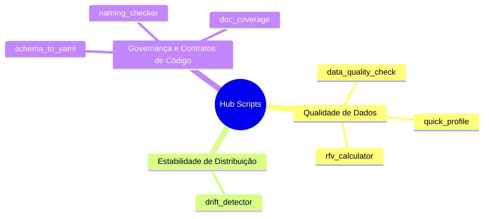
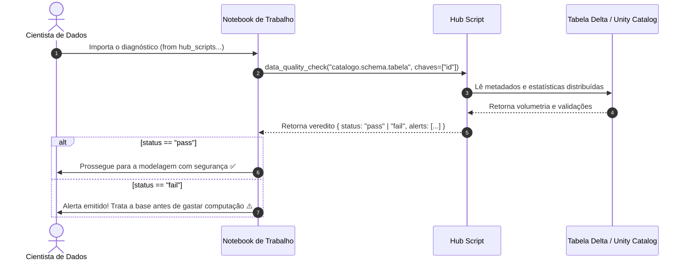

# Hub Scripts

> Utilitários e diagnósticos de integridade para auditar tabelas Delta, schemas e notebooks antes de confiar na modelagem preditiva ou publicar artefatos no Databricks.

---

## 🔍 O que é um Script neste Ecossistema?

Em pipelines de dados modernos, o maior risco para um modelo de Machine Learning raramente é o algoritmo em si, mas sim a **qualidade e a confiabilidade do dado bruto que o alimenta**. 

Treinar um modelo sobre uma tabela com chaves duplicadas, variáveis defasadas ou distribuições corrompidas gera modelos falhos e desperdício de processamento no cluster.

**No ecossistema `.assistant`, um Hub Script atua como um Pórtico de Controle de Qualidade e Inspeção Sanitária de Dados.**

Pense em um gateway de qualidade na ingestão analítica:
* Antes de carregar uma base de dados para treinar um modelo preditivo de crédito, churn ou séries temporais, você submete a tabela a um **laudo técnico automatizado**.
* O script realiza uma checagem direcionada: audita a unicidade das chaves primárias, verifica a completude das colunas essenciais, checa a recência temporal dos dados e avalia a conformidade dos schemas com as diretrizes do time.

```text
┌─────────────────────────────────────────────────────────────────────────────┐
│                            O PAPEL DE UM SCRIPT                             │
│                                                                             │
│   🛑 Diagnóstico Autocontido: Responde "Posso confiar neste dado/código?"  │
│   📋 Veredito Explícito: Retorna status (pass/fail) com alertas acionáveis │
│   🛡️ Zero Intervenção Destrutiva: Nunca altera ou deleta seus dados brutos │
│   ⚡ Validação Prévia: Alerta sobre inconsistências antes de treinar modelos│
└─────────────────────────────────────────────────────────────────────────────┘
```

---

## 🏛️ Arquitetura e o Padrão "Pasta de Objeto"

Os scripts seguem o padrão arquitetural de **Pasta de Objeto (ADR-0007)**. Cada diagnóstico mora em sua própria pasta isolada:



O notebook `exemplo_<nome>.py` é essencial: ele simula **cenários reais de inconformidade** (tabelas com chaves duplicadas, nomes fora de convenção ou defasagem temporal) para você ver exatamente como o script reage e emite alertas antes de você aplicá-lo em suas tabelas de produção.

---

## 📚 Catálogo Detalhado

Os utilitários do Hub são organizados em três dimensões de qualidade essenciais para o ciclo analítico:



---

### 🩺 1. Qualidade e Perfilamento de Dados (Data Health)

#### `data_quality_check` — Inspeção Sanitária Pré-Modelagem
* **O que faz:** Realiza um checkup em tabelas Delta: avalia a unicidade da chave primária, verifica a proporção de nulos em colunas críticas e confere se a base de dados está atualizada no tempo (*recency check*).
* **O que retorna:** Dicionário estruturado com `status: "pass"` ou `"fail"`, métricas detalhadas e uma lista de alertas textuais explicando eventuais inconsistências encontradas.
* **Quando usar:** Sempre que for consumir uma tabela nova pela primeira vez ou como portão de entrada antes do pipeline oficial de treino.

#### `quick_profile` — Raio-X Rápido de Esquema e Distribuição
* **O que faz:** Gera um perfilamento estatístico sumarizado da tabela sem custo de computação desnecessário. Mapeia tipos de dados, valores distintos, cardinalidade e cardinalidade relativa de cada coluna.
* **O que retorna:** Resumo tabular com a volumetria e origem de cada métrica calculada.
* **Quando usar:** Na primeira etapa de exploração de um dataset, antes de abrir notebooks pesados de visualização gráfica.

#### `rfv_calculator` — Diagnóstico de Recência, Frequência e Valor
* **O que faz:** Calcula e valida os componentes clássicos de RFV (*Recency, Frequency, Monetary Value*) para cada entidade/cliente referenciados a uma data de corte exata.
* **O que retorna:** Métricas de RFV calculadas com precisão temporal e sem distorções de linhas históricas futuras.
* **Quando usar:** Antes de construir segmentações de clientes ou features comportamentais para modelos de churn, ativação ou risco.

---

### 📉 2. Estabilidade e Monitoramento de Distribuição

#### `drift_detector` — Detecção de Desvios de Distribuição
* **O que faz:** Compara diretamente duas populações (ex: base histórica de treino versus base recente de produção) e calcula desvios estatísticos de média, variância e distribuição para cada coluna.
* **O que retorna:** Relatório de estabilidade indicando quais variáveis sofreram deslocamento significativo de distribuição (*drift*).
* **Quando usar:** Antes de assumir que uma tabela de produção continua estável ou para auditar bases de escoragem mensal antes da inferência.

---

### 📐 3. Governança, Contratos e Boas Práticas de Código

#### `schema_to_yaml` — Contratos de Dados Vivos em YAML
* **O que faz:** Inspeciona uma tabela Spark/Delta e serializa sua estrutura (nomes de colunas, tipos de dados e nulabilidade) em um arquivo de texto limpo em formato YAML.
* **O que retorna:** O schema exportado e pronto para versionamento em repositórios Git.
* **Quando usar:** Para documentar o contrato de dados de uma tabela analítica (*ABT*) ou registrar a versão do schema em auditorias técnicas.

#### `naming_checker` — Guardião de Nomenclatura Corporativa
* **O que faz:** Analisa tabelas ou listas de variáveis e identifica violações em relação às convenções de nomenclatura corporativas (ex: uso de *snake_case*, prefixos padronizados como `dt_`, `vl_`, `cd_`, ausência de acentos e caracteres especiais).
* **O que retorna:** Lista dos campos em desacordo com as regras de padronização da equipe.
* **Quando usar:** Antes de promover uma tabela de desenvolvimento para os ambientes compartilhados da área de dados.

#### `doc_coverage` — Auditoria de Documentação de Notebooks
* **O que faz:** Varre as células de um notebook Databricks e mede a proporção de código coberta por explicações didáticas em Markdown ou docstrings.
* **O que retorna:** Percentual de cobertura de documentação e lista das células que realizam transformações complexas sem nenhuma explicação textual.
* **Quando usar:** Em revisões de código (*Code Review*), antes de transferir um notebook analítico para a esteira de produção.

---

## 🛠️ Passo a Passo Operacional: Como Usar um Script

Integrar um diagnóstico de dados na sua rotina do Databricks segue um fluxo intuitivo em 3 passos:



### Exemplo Prático de Código:

```python
# 1. Importação direta do diagnóstico
from hub_scripts.data_quality_check import data_quality_check

# 2. Execução da checagem apontando para sua tabela
resultado = data_quality_check(
    table_name="catalogo.credito.clientes_abril",
    primary_keys=["id_cliente"],
    date_column="dt_referencia",
    critical_columns=["renda_estimada", "score_inicial"]
)

# 3. Tratamento didático do veredito
print(f"Status do Diagnóstico: {resultado['status'].upper()}")

if resultado["status"] == "fail":
    print("\n⚠️ ALERTAS IDENTIFICADOS:")
    for alerta in resultado["alerts"]:
        print(f"  • {alerta}")
    raise ValueError("A tabela não passou nos critérios mínimos de qualidade.")
else:
    print("✅ Tabela homologada com sucesso! Pronto para modelagem.")
```

---

## ❓ Perguntas Frequentes (FAQ)

### 1. Se o script retornar `status="fail"`, meus dados serão apagados ou modificados?
**Nunca.** Os Hub Scripts operam exclusivamente em modo de leitura (*read-only*). Eles não alteram, deletam nem filtram dados. Um status de falha (`fail`) significa apenas que o laudo técnico detectou anomalias (como chaves duplicadas ou nulos excessivos) e cabe a você decidir como tratar os dados antes de prosseguir.

### 2. Os scripts funcionam com tabelas do Unity Catalog?
**Sim.** Todos os scripts aceitam tanto o formato de 3 níveis do Unity Catalog (`catalogo.schema.tabela`) quanto o formato clássico de 2 níveis (`schema.tabela`). Eles utilizam a sessão ativa do Spark no Databricks.

### 3. Preciso rodar esses scripts pelo terminal ou dentro de um Notebook?
Embora possam ser chamados por ferramentas externas, eles foram projetados especificamente para serem importados e executados **diretamente dentro dos seus notebooks Python no Databricks**, como uma célula preliminar de validação.

### 4. Os scripts causam lentidão em tabelas muito volumosas?
**Não.** Os scripts utilizam os metadados de estatísticas do Delta Lake e operações agregadas otimizadas pelo Spark SQL. Eles priorizam operações agregadas e evitam coletas pesadas para o driver, favorecendo avaliações ágeis mesmo em bases volumosas.

### 5. Posso usar os scripts em pipelines automatizados (Jobs / Workflows)?
**Sim, essa é uma das melhores formas de uso.** Você pode colocar uma etapa com `data_quality_check` logo após a ingestão de dados em um Databricks Workflow. Se o status for `"fail"`, a tarefa pode enviar um alerta para o time e interromper a esteira antes de disparar o treino dispendioso de um modelo.
