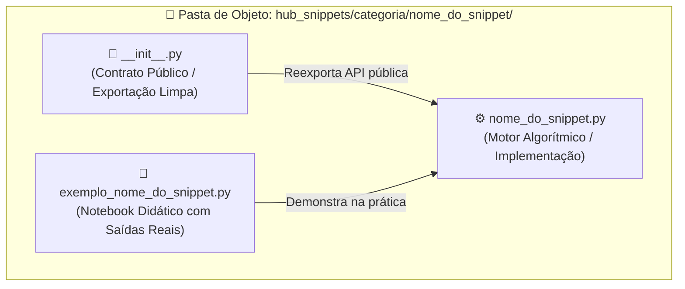
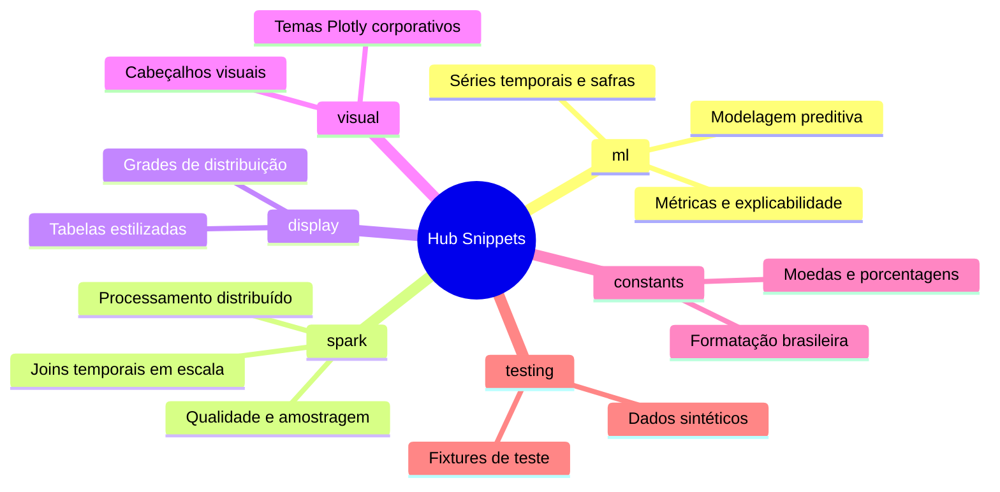
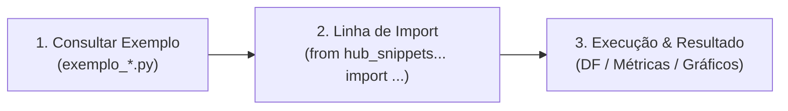

# Hub Snippets

> A biblioteca matemática e algorítmica central do ecossistema `.assistant`: funções e classes testadas, auditadas e otimizadas para Machine Learning e Big Data no Databricks.

---

## 🧩 O que é um Snippet neste Ecossistema?

No desenvolvimento de software tradicional, a palavra *"snippet"* costuma significar um pedaço solto de código copiado de fóruns da internet. 

**Neste ecossistema, um Snippet é algo muito diferente: é uma peça de engenharia de precisão pré-fabricada.**

Pense nos snippets como funções de uma biblioteca analítica especializada:
* Você não precisa reprogramar rotinas numéricas ou reimplementar fórmulas matemáticas do zero toda vez que vai construir um modelo; você utiliza blocos de código **testados, revisados e prontos para uso**.
* Da mesma forma, em Machine Learning, você economiza tempo e esforço evitando reimplementar fórmulas de *Population Stability Index* (PSI), junções temporais ou cálculo de safras (*Vintage Analysis*).

```text
┌─────────────────────────────────────────────────────────────────────────────┐
│                            O QUE DEFINE UM SNIPPET                          │
│                                                                             │
│   🛡️ Zero Efeito Colateral: Funções puras que não alteram seus dados brutos │
│   📐 Matemática Auditada: Fórmulas estruturadas para mitigar data leakage   │
│   ⚡ Alta Performance: Otimizado para Pandas (vetorizado) e Apache Spark    │
│   🧪 Testado: Cobertura completa com dados sintéticos e testes unitários    │
└─────────────────────────────────────────────────────────────────────────────┘
```

Cada snippet resolve uma **dor analítica específica**, entregando o resultado com uma única linha de `import`.

---

## 🏛️ Arquitetura e o Padrão "Pasta de Objeto"

Para favorecer que o código seja limpo, fácil de encontrar e intuitivo tanto para pessoas quanto para a IA, os snippets seguem o padrão arquitetural chamado **Pasta de Objeto (ADR-0007)**.

Um snippet **nunca é um arquivo `.py` jogado solto numa pasta**. Todo snippet é um diretório autossuficiente contendo exatamente 3 componentes:



### O que cada arquivo faz:
1. **`__init__.py` (A Fachada):** Reexporta publicamente as funções e classes do snippet. É graças a ele que você pode fazer imports diretos e limpos, sem precisar digitar caminhos internos longos.
2. **`nome_do_snippet.py` (O Motor):** Onde reside o código puro. Contém tipagem estática (*type hints*), validação de parâmetros, documentação em português e o algoritmo.
3. **`exemplo_nome_do_snippet.py` (O Guia Didático):** Um notebook executável que ensina passo a passo como usar o snippet. Ele cria dados sintéticos, executa a função e traz saídas visuais reais para que você veja exatamente o que esperar antes de usar nos seus dados reais.

---

## 🗺️ Mapa de Categorias do Hub Snippets

A biblioteca é dividida em 6 categorias funcionais que cobrem todas as fases de um pipeline analítico:



---

## 📚 Catálogo Detalhado por Categoria

Abaixo você encontra a descrição completa de cada snippet existente, o que ele faz e o momento exato de utilizá-lo no seu dia a dia:

---

### 1. Categoria: `ml` (Machine Learning e Estatística Aplicada)
*É o coração algorítmico do Hub, focado em modelagem preditiva, risco de crédito, séries temporais e governança de modelos.*

#### 🕒 Engenharia Temporal e Séries Temporais
* **`lgbm_temporal`**: Treina modelos LightGBM com geração automática de *lags* e janelas móveis (*rolling statistics*). 
  * *Quando usar:* Em problemas de séries temporais, previsão de demanda ou churn onde dados passados explicam o futuro, estruturado para mitigar o risco de vazamento temporal.
* **`split_temporal`**: Divide DataFrames em conjuntos de Treino, Validação e Teste respeitando a ordem cronológica e as datas de corte.
  * *Quando usar:* Em problemas de Machine Learning que possuam dimensão temporal, evitando o erro clássico de misturar dados do futuro no treino.
* **`walk_forward`**: Implementa validação cruzada deslizante (*Walk-Forward Cross-Validation*).
  * *Quando usar:* Para avaliar a real estabilidade de modelos preditivos ao longo de múltiplos períodos históricos sucessivos.
* **`vintage_analysis`**: Curvas de safra e acompanhamento de inadimplência por mês de originação (*Months on Book - MOB*).
  * *Quando usar:* Análise de risco de crédito, evolução de sinistros ou retenção de safras de clientes ao longo do tempo.

#### 📊 Risco de Crédito e Scorecards
* **`woe_iv_calculator`**: Calcula o *Weight of Evidence* (WOE) e *Information Value* (IV) para variáveis contínuas e categóricas.
  * *Quando usar:* Na seleção de variáveis para modelos de crédito e na transformação de variáveis não-lineares para regressão logística.
* **`scorecard_builder`**: Constrói cartões de crédito (*Scorecards*) clássicos, convertendo probabilidades logísticas em pontuações inteiras calibradas por PDO (*Points to Double the Odds*).
  * *Quando usar:* Em esteiras de crédito reguladas onde cada variável precisa gerar pontos transparentes para o cliente final.
* **`score_bands`**: Cria faixas de pontuação com calibração empírica de taxas de evento e volumetria acumulada.
  * *Quando usar:* Para transformar um score contínuo em faixas operacionais de corte de crédito (ex: Faixa A a F).

#### 📈 Avaliação, Métricas e Visualização
* **`metrics_report`**: Gera um consolidado tabular com as principais métricas de classificação (KS, AUC-ROC, Gini, F1, LogLoss, Brier Score).
  * *Quando usar:* Para comparar modelos concorrentes de forma padronizada em relatórios técnicos.
* **`curves_plotly`**: Plota curvas interativas em Plotly para ROC, Precision-Recall, Ganho Acumulado e Curva KS.
  * *Quando usar:* Para apresentações visuais e exploração interativa de thresholds de corte.
* **`explainability_report`**: Relatório consolidado de importância de variáveis e impactos locais/globais de modelos caixa-preta.
  * *Quando usar:* Para auditoria e defesa técnica de modelos preditivos perante áreas de governança ou negócio.

#### 🛡️ Monitoramento e MLOps
* **`performance_monitor`**: Monitor contínuo de métricas em produção, comparando bases de referência contra bases atuais com limiares de alerta (*Healthy*, *Warning*, *Critical*).
  * *Quando usar:* Em rotinas automatizadas para verificar se o modelo em produção começou a perder acurácia.
* **`drift_detection`**: Avalia drift bivariado e multivariado de variáveis preditivas.
  * *Quando usar:* Para detectar se o comportamento dos dados dos clientes mudou em relação ao período de treino.
* **`mlflow_run`**: Encapsulador (*wrapper*) padronizado para abertura de experimentos e runs no MLflow, registrando métricas, parâmetros e artefatos de forma governada.
  * *Quando usar:* Em treinamentos de modelos para viabilizar a rastreabilidade estruturada no Databricks.

#### 🔍 Não-Supervisionado e Anomalias
* **`clustering_suite`**: Pipeline completo para seleção ótima do número de clusters (K-Means/GMM) com métricas de Silhouette e Davies-Bouldin.
  * *Quando usar:* Para segmentação não-supervisionada de clientes ou produtos.
* **`cluster_profiling`**: Analisa e descreve os principais diferenciadores estatísticos de cada cluster gerado.
  * *Quando usar:* Para traduzir clusters matemáticos em personas claras para a área de negócios.
* **`isolation_forest`**: Treinamento de florestas de isolamento com perfilamento dos desvios das anomalias encontradas.
  * *Quando usar:* Na detecção de fraudes, transações suspeitas ou outliers em bases de dados.

---

### 2. Categoria: `spark` (Operações Distribuídas em Escala)
*Voltada para manipular tabelas gigantescas (bilhões de linhas) diretamente no cluster Apache Spark com performance nativa.*

* **`pit_join` (Point-in-Time Join)**: Realiza a junção temporal precisa entre uma base de eventos e uma base histórica de features, buscando o registro mais recente disponível até a data do evento (sem espiar o futuro).
  * *Quando usar:* Na criação de bases analíticas de modelagem (*ABTs*) onde cada linha de cliente possui uma data de referência distinta.
* **`psi_calculator`**: Calcula o índice de estabilidade populacional (PSI/CSI) distribuído diretamente em Spark SQL, sem coletar dados para o driver.
  * *Quando usar:* Para monitorar a estabilidade de variáveis e scores em bases massivas de Big Data.
* **`null_summary`**: Gera um raio-x completo de valores nulos, strings vazias e sentinelas em DataFrames Spark.
  * *Quando usar:* Na fase inicial de exploração de dados para identificar colunas corrompidas ou mal preenchidas.
* **`smart_sample`**: Extração de amostras inteligentes estratificadas de tabelas gigantescas sem esgotar a memória do cluster.
  * *Quando usar:* Para extrair uma amostra balanceada e representativa de tabelas volumosas para prototipar localmente.
* **`date_features`**: Extrai features de calendário (dia da semana, trimestre, final de mês, feriados) em PySpark nativo de forma vetorizada.
  * *Quando usar:* No enriquecimento rápido de colunas de timestamp antes do treinamento.
* **`join_diagnostics`**: Analisa perdas de registros, chaves duplicadas e riscos de produto cartesiano antes e depois de um `join`.
  * *Quando usar:* Para investigar por que o volume de linhas explodiu ou diminuiu após cruzar tabelas Delta.
* **`safe_display`**: Exibição segura de tabelas Spark nos notebooks, limitando a volumetria renderizada no navegador para evitar congelamento da interface.
  * *Quando usar:* Ao inspecionar tabelas muito volumosas diretamente na tela do notebook.

---

### 3. Categoria: `display` (Exibição e Tabelas Formatadas)
*Focada na apresentação estética e executiva de dados tabulares dentro dos notebooks.*

* **`dataframe_styled`**: Aplica gradientes de cores, barras horizontais de proporção e formatação automática em DataFrames Pandas.
  * *Quando usar:* Para criar tabelas ricas em relatórios executivos para gerentes e tomadores de decisão.
* **`distribution_grid`**: Renderiza grades compactas de distribuição para inspecionar múltiplas variáveis simultaneamente.
  * *Quando usar:* Na análise exploratória inicial para identificar visualmente assimetria e caudas longas.

---

### 4. Categoria: `visual` (Identidade Visual e Design em Plotly)
*Favorece que os gráficos produzidos pela equipe sigam um padrão estético uniforme e profissional.*

* **`theme_plotly`**: Aplica uma folha de estilos profissional aos gráficos Plotly (paleta de cores corporativa, fundo limpo, tipografia otimizada).
  * *Quando usar:* No topo de qualquer notebook para que todos os gráficos Plotly adotem o padrão visual do ecossistema.
* **`section_header`**: Renderiza divisores de seção elegantes em HTML com títulos, subtítulos e badges.
  * *Quando usar:* Para organizar visualmente notebooks longos em capítulos claros.

---

### 5. Categoria: `constants` (Padrões Brasileiros)
*Funções de formatação cultural e regional.*

* **`format_br`**: Converte números puros em strings formatadas no padrão brasileiro:
  * Moeda: `1250000.5` ➔ `R$ 1.250.000,50`
  * Porcentagem: `0.154` ➔ `15,4%`
  * Inteiros: `15000` ➔ `15.000 un`
  * *Quando usar:* Ao exibir resumos, métricas finais ou cartões de KPI em notebooks.

---

### 6. Categoria: `testing` (Dados Sintéticos e Fixtures)
*Acelera o desenvolvimento ao reduzir a dependência de bases de dados externas.*

* **`fixtures`**: Geradores de dados sintéticos que simulam clientes, contratos, transações bancárias e séries temporais com anomalias controladas.
  * *Quando usar:* Para testar um algoritmo novo, criar um protótipo rápido ou construir testes unitários sem precisar esperar liberação de acesso a tabelas reais.

---

## 🛠️ Passo a Passo Operacional: Como Usar um Snippet

Usar qualquer snippet em seu notebook Databricks é um processo simples de 3 etapas:



### Passo 1: Inspecione o notebook modelo
Antes de aplicar aos seus dados reais, abra o arquivo `exemplo_<snippet>.py` correspondente. Ele mostra a função sendo chamada com dados sintéticos e exibe o formato exato dos argumentos esperados e dos retornos.

### Passo 2: Importe diretamente no seu notebook
Como a pasta `.assistant` está no caminho do Python, você não precisa de `pip install` nem de caminhos relativos complexos. Basta importar diretamente:

```python
# Exemplo 1: Engenharia temporal
from hub_snippets.ml.split_temporal import temporal_split

df_treino, df_val, df_teste = temporal_split(
    df=meu_dataframe,
    date_col="data_safra",
    train_end="2025-12-31",
    val_end="2026-03-31"
)

# Exemplo 2: Monitoramento em Spark
from hub_snippets.spark.psi_calculator import calcular_psi

resultado_psi = calcular_psi(
    df_ref=dados_treino_spark,
    df_cur=dados_producao_spark,
    coluna="score_credito"
)
```

### Passo 3: Interprete e Apresente
Os snippets retornam tipos padrão da indústria (DataFrames Pandas, DataFrames PySpark, dicionários estruturados ou figuras Plotly), permitindo encadear o resultado diretamente nas etapas seguintes do seu pipeline.

---

## ❓ Perguntas Frequentes (FAQ)

### 1. Os snippets alteram o meu DataFrame original (*in-place*)?
**Não.** Todos os snippets seguem o princípio de imutabilidade funcional. Eles criam cópias ou geram novos DataFrames com as transformações solicitadas, assegurando que suas tabelas de entrada permaneçam inalteradas.

### 2. Posso usar os snippets em clusters Databricks Serverless?
**Sim.** A biblioteca foi desenhada e testada para rodar nativamente em ambientes Serverless do Databricks, sem depender de scripts de inicialização de cluster (*init scripts*) ou instalações manuais.

### 3. O que acontece se eu tentar usar um snippet e faltar uma biblioteca opcional (como LightGBM ou Tabulate)?
Os snippets possuem tratamento de dependências explícito. Se o seu ambiente não tiver o pacote necessário, o snippet dispara uma mensagem de erro clara informando exatamente qual biblioteca está faltando e como instalá-la, em vez de quebrar silenciosamente com mensagens enigmáticas.

### 4. Como os snippets de Spark lidam com tabelas de bilhões de linhas?
Os snippets da pasta `spark/` utilizam exclusivamente operações distribuídas do Catalyst Optimizer do Spark. Eles nunca executam comandos perigosos como `.collect()` ou `.toPandas()` em volumes massivos, minimizando a sobrecarga de memória no driver do cluster e o risco de *OOM (Out of Memory)*.

### 5. Posso propor um novo snippet para a biblioteca?
**Com certeza!** Para manter o nível de qualidade do ecossistema, basta utilizar o molde arquitetural em `hub_padroes/` e a skill `hub-ml-criar-objeto`. Todo novo snippet deve vir acompanhado de seu `__init__.py` e de seu notebook com dados sintéticos demonstrando a funcionalidade.
