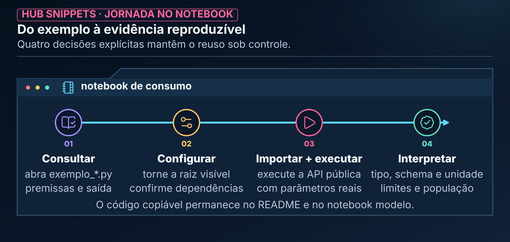

# Hub Snippets

> A biblioteca matemática e algorítmica central do ecossistema `.assistant`: funções e classes reutilizáveis para Machine Learning e Big Data, com contratos e evidências de validação delimitados por objeto.

> **CONTEÚDO CUSTOMIZADO PELO HUB.** `hub_snippets` não é uma biblioteca institucional da Databricks nem é carregada automaticamente pela Genie Code. O notebook precisa tornar o pacote visível ao Python e importar explicitamente a função desejada.

---

## 🧭 Neste Guia

| Para entender... | Vá para... |
|---|---|
| o conceito e a estrutura de um snippet | [O que é um Snippet](#-o-que-é-um-snippet-neste-ecossistema) |
| as categorias da biblioteca | [Mapa de Categorias](#mapa-de-categorias-do-hub-snippets) |
| quais objetos estão disponíveis | [Catálogo Detalhado](#-catálogo-detalhado-por-categoria) |
| como importar e executar | [Passo a Passo Operacional](#passo-a-passo-operacional-como-usar-um-snippet) |
| runtime, dependências e custo | [Onde o Código Executa](#️-onde-o-código-executa-e-quanto-pode-custar) |
| dúvidas e limitações | [Perguntas Frequentes](#-perguntas-frequentes-faq) |

---

<a id="-o-que-é-um-snippet-neste-ecossistema"></a>

## 🧩 O que é um Snippet neste Ecossistema?

No desenvolvimento de software tradicional, a palavra *snippet* costuma significar um pedaço solto de código copiado de fóruns da internet.

**Neste ecossistema, um Snippet é algo diferente: é uma peça reutilizável de engenharia analítica.**

Pense nos snippets como funções de uma biblioteca especializada:

- Você não precisa reprogramar rotinas numéricas ou reimplementar fórmulas do zero toda vez que construir um modelo; pode reutilizar blocos com contrato, exemplo e testes conhecidos.
- Em Machine Learning, isso reduz retrabalho em cálculos como *Population Stability Index* (PSI), junções temporais, métricas e análise de safras (*Vintage Analysis*).
- A reutilização não elimina a validação: assinatura, dependências, volume, instante de decisão e significado de negócio continuam precisando ser conferidos.

```text
┌─────────────────────────────────────────────────────────────────────────────┐
│                            O QUE DEFINE UM SNIPPET                          │
│                                                                             │
│   🛡️ Efeito Declarado: transformação, coleta ou estado precisam ser claros │
│   📐 Lógica Revisável: fórmula, premissas e limites ficam no código         │
│   ⚡ Execução Adequada: Pandas ou Spark conforme o tipo e o volume          │
│   🧪 Evidência Delimitada: testes e exemplos cobrem cenários conhecidos     │
└─────────────────────────────────────────────────────────────────────────────┘
```

Cada snippet resolve uma **dor analítica específica**, expondo uma API pública curta. A linha de `import` simplifica o uso, mas não substitui a leitura do contrato.

---

<a id="arquitetura-e-o-padrao-pasta-de-objeto"></a>

## 🏛️ Arquitetura e o Padrão "Pasta de Objeto"

Para favorecer que o código seja limpo, fácil de encontrar e intuitivo tanto para pessoas quanto para a IA, os snippets seguem o padrão de organização chamado **Pasta de Objeto**.

Cada objeto reúne README para escolha, fachada pública, implementação e exemplo. Os três componentes executáveis abaixo complementam o guia:


*Leitura da figura: o notebook consome a API pública; a implementação permanece atrás da fachada.*

### O que cada arquivo faz

**Equivalente textual da figura:** a pasta contém uma fachada pública em `__init__.py`, um módulo com a implementação e um notebook modelo que exercita o contrato com dados sintéticos.

1. **`__init__.py` (A Fachada):** reexporta as funções e classes públicas. É ele que permite imports curtos sem expor a organização interna do módulo.
2. **`nome_do_snippet.py` (O Motor):** contém implementação, validações, tipagem e docstring. O código é a fonte técnica para a assinatura real.
3. **`exemplo_nome_do_snippet.py` (O Guia Didático):** demonstra o uso com dados sintéticos e registra uma saída observada. Ele ensina o contrato exercitado; não promete compatibilidade com qualquer runtime ou volume.

O [Catálogo de Helpers](../MANUAL_TECNICO.md#catalogo-helpers) relaciona demanda, caminho público e dependências. Ele é o índice canônico; este README preserva uma leitura narrativa por categoria.

---

<a id="-mapa-de-categorias-do-hub-snippets"></a>

<a id="mapa-de-categorias-do-hub-snippets"></a>

## 🗺️ Mapa de Categorias do Hub Snippets

A biblioteca é dividida em seis categorias funcionais, agrupadas pela natureza do problema que cada helper resolve:


*Leitura da figura: as categorias agrupam helpers por natureza de problema e não constituem uma sequência obrigatória.*

| Categoria | Natureza do problema |
|---|---|
| [`ml`](ml/README.md) | Machine Learning e estatística aplicada |
| [`spark`](spark/README.md) | operações distribuídas em escala |
| [`display`](display/README.md) | exibição e tabelas formatadas |
| [`visual`](visual/README.md) | identidade visual e design em Plotly |
| [`constants`](constants/README.md) | padrões brasileiros, cores e estilos compartilhados |
| [`testing`](testing/README.md) | dados sintéticos e fixtures |

Cada categoria possui um índice local que lista todos os objetos diretamente nela e aponta para o README de cada recurso. A suíte interna fica em `tools/tests/runtime/` no repositório de manutenção, fora do pacote de instalação e deste mapa de uso.

---

<a id="-catálogo-detalhado-por-categoria"></a>

## 📚 Catálogo Detalhado por Categoria

Abaixo você encontra o papel de cada objeto e o momento em que ele pode ser útil. Consulte o módulo e o notebook correspondente antes de adotar a função em um pipeline.

---

Escolha pelo objetivo e siga o índice da categoria para contratos e retornos exatos:

| Tarefa | API/objeto e entrada típicos | Saída/execução | Onde começar |
|---|---|---|---|
| Treino tabular | `train_lightgbm_baseline`, `train_xgboost_baseline`, `train_catboost_baseline`; features e alvo | modelo/relatório no driver; tracking depende da rota | [ML](ml/README.md) |
| Tempo | `temporal_split`, `walk_forward_cv`; pandas com datas/grão | partições/folds por contrato; driver; callback pode ter efeitos | [ML](ml/README.md) |
| Avaliar e explicar | `calculate_binary_metrics`, `calculate_regression_metrics`, curvas e SHAP; modelo/predições/features alinhadas | métricas, atribuições, relatório/figura; driver e dependências opcionais | [ML](ml/README.md) |
| Score e maturidade | WOE/IV, scorecard, bandas, safra e sobrevivência | agregados/modelos/curvas; WOE usa Spark, demais contratos variam | [ML](ml/README.md) |
| Clusters/anomalias/projeções | features numéricas preparadas | rótulos, perfil, scores ou projeção; driver | [ML](ml/README.md) |
| Drift e tracking | populações, labels maduras ou run autorizado | diagnóstico não retreina; MLflow cria recursos externos | [ML](ml/README.md) |
| Datas, joins, nulos e amostra | DataFrames Spark e parâmetros explícitos | transformação ou diagnóstico; ações/coletas conforme objeto | [Spark](spark/README.md) |
| Tabela, matriz e distribuição | pandas local ou Spark conforme helper | HTML/figura; matriz ou recorte no driver | [Display](display/README.md) |
| Apresentação e tema | textos, figura ou ResolvedTheme | string, figura modificada ou efeito de sessão explícito | [Visual](visual/README.md) |
| Formatar e consultar convenções | escalar, chave de mapa ou tema | strings, listas/dicionários; sem cálculo de negócio | [Constants](constants/README.md) |
| Conferir com dados fictícios | dimensões pequenas e seed | geração em memória Python → DataFrame Spark | [Testing](testing/README.md) |

Modelos, métricas, rankings, embeddings e SHAP não estabelecem causalidade nem aprovam crédito, implantação ou retreino. Confirme grão, população, tempo, denominador, unidade, dependências e critérios do caso no guia específico.

Para temas, [`visual.tema`](visual/tema/README.md) valida configurações isoladas; `theme_plotly` e variantes `_resolvido` aplicam explicitamente. [`theme_lab`](visual/theme_lab/README.md) permite experimentar, comparar e opcionalmente salvar sessões em pasta autorizada. Carregar um tema não modifica o caminho legado. SHAP/Matplotlib e Kaplan–Meier mantêm limites próprios descritos nos respectivos guias.

### 📋 Inventário Completo da Biblioteca

São 53 objetos com README: constants 4, display 3, ML 30, Spark 7, testing 1 e visual 8. O inventário inclui o laboratório de autoria; sua presença não significa aprovação visual ou instalação no destino. Os seis índices são a rota navegável para cada objeto.

```text
hub_snippets/
├── constants
│   ├── colors             ├── emojis
│   ├── format_br          └── styles
├── display
│   ├── correlation_matrix ├── dataframe_styled
│   └── distribution_grid
├── ml
│   ├── arima_wrapper      ├── autoencoder_anomaly
│   ├── cluster_profiling  ├── clustering_suite
│   ├── curves_plotly      ├── drift_detection
│   ├── explainability_report
│   ├── isolation_forest   ├── kaplan_meier
│   ├── lgbm_ranker        ├── lgbm_temporal
│   ├── metrics_report     ├── mlflow_run
│   ├── mlp_embeddings     ├── optuna_lgbm
│   ├── performance_monitor
│   ├── prophet_wrapper    ├── score_bands
│   ├── scorecard_builder  ├── shap_explainer
│   ├── split_temporal     ├── survival_cox
│   ├── tabnet_wrapper     ├── train_catboost
│   ├── train_lgbm         ├── train_xgboost
│   ├── umap_viz           ├── vintage_analysis
│   ├── walk_forward       └── woe_iv_calculator
├── spark
│   ├── date_features      ├── join_diagnostics
│   ├── null_summary       ├── pit_join
│   ├── psi_calculator     ├── safe_display
│   └── smart_sample
├── testing
│   └── fixtures
└── visual
    ├── badge              ├── divider
    ├── index_generator    ├── kpi_card
    ├── section_header     ├── tema
    ├── theme_lab          └── theme_plotly
```

> **Como usar este inventário:** escolha o objeto pelo problema, abra seu `exemplo_<nome>.py` e confirme API, dependências e tipo de retorno no [Catálogo de Helpers](../MANUAL_TECNICO.md#catalogo-helpers).

---

<a id="️-passo-a-passo-operacional-como-usar-um-snippet"></a>

<a id="o-contrato-de-reuso"></a>

## 🔐 O Contrato de Reuso

Um snippet economiza implementação sem eliminar responsabilidade técnica. A interface documentada prepara o reuso; a execução explícita aplica o caso concreto; e a evidência validada sustenta a confiança no resultado.


*Leitura da figura: dependências, efeitos, parâmetros, limites e resultados precisam permanecer observáveis.*

| Momento | Apoio do contrato | O que precisa permanecer observável |
|---|---|---|
| antes da chamada | interface previsível | API pública, parâmetros, retorno e erros documentados |
| durante a chamada | execução consciente | dependências, efeitos ou mutações, custo e compute |
| depois da chamada | evidência reproduzível | resultado interpretado, limites declarados e teste reproduzível |

<a id="passo-a-passo-operacional-como-usar-um-snippet"></a>

## 🛠️ Passo a Passo Operacional: Como Usar um Snippet

Usar um snippet envolve quatro decisões: consultar o exemplo, configurar o ambiente, importar e executar a API real e interpretar o resultado.



*Leitura da figura: o snippet acelera a implementação, mas o notebook ainda configura dependências, executa a API e valida o retorno.*

**Equivalente textual da figura:** (1) abra `exemplo_<snippet>.py`; (2) torne `hub_snippets/` importável e confirme dependências; (3) importe e execute a API com parâmetros reais; (4) confira tipo, unidade, schema, limites e população antes de encadear a saída.

### Passo 1: Inspecione o notebook modelo

Abra o arquivo `exemplo_<snippet>.py`. Ele mostra a função chamada, os dados sintéticos usados e a forma da saída observada. Confirme se o seu cenário respeita as mesmas premissas.

### Passo 2: Torne a biblioteca visível ao Python

A pasta `.assistant` não entra automaticamente no `sys.path` só por existir no workspace. Informe a raiz que contém `hub_snippets/`:

```python
from pathlib import Path
import sys

assistant_root = Path("/Workspace/Users/<username>/.assistant")
if str(assistant_root) not in sys.path:
    sys.path.insert(0, str(assistant_root))
```

Troque `<username>` pelo diretório autorizado ou use a raiz equivalente do seu Git folder. Em compute serverless, outra opção é declarar dependências pelo **Environment** ou pelo ambiente do Git folder, conforme o fluxo adotado.

Confirme dependências no README escolhido e no [inventário opcional](requirements-optional.txt); ele não é lockfile nem deve ser instalado integralmente. Para temas, veja [requirements-temas.txt](requirements-temas.txt). Um teste mínimo sem Spark ou escrita é:

```python
from hub_snippets.constants.format_br import fmt_pct
assert fmt_pct(0.5) == "50,0%"
```

Isso verifica apenas esse import e saída textual. Não executa nem homologa os outros objetos.

### Passo 3: Importe e execute com a assinatura real

```python
# Exemplo 1: engenharia temporal em pandas
from hub_snippets.ml.split_temporal import temporal_split

df_treino, df_val, df_teste = temporal_split(
    df=meu_dataframe,
    date_col="data_safra",
    train_pct=0.70,
    val_pct=0.15,
    gap_periods=1,
    period_unit="M",
)

# Exemplo 2: monitoramento numérico em Spark
from hub_snippets.spark.psi_calculator import calcular_psi

resultado_psi = calcular_psi(
    df_base=dados_referencia_spark,
    df_atual=dados_atuais_spark,
    col="score_credito",
    n_bins=20,
)
```

Os parâmetros acima correspondem às APIs atuais: `temporal_split` não recebe `train_end`/`val_end`, e `calcular_psi` usa `df_base`, `df_atual`, `col` e `n_bins`.

### Passo 4: Interprete e apresente

Os snippets retornam DataFrames pandas, DataFrames PySpark, dicionários, escalares, modelos ou figuras, conforme o objeto. Antes de encadear a saída:

- confira tipo, unidade e schema retornados;
- diferencie resultado executado de exemplo ilustrativo;
- interprete thresholds como política analítica, não padrão universal;
- registre versão, parâmetros e população quando houver decisão de modelo.

---

<a id="️-onde-o-código-executa-e-quanto-pode-custar"></a>

## ⚙️ Onde o Código Executa e Quanto Pode Custar

| Família | Execução predominante | Atenção principal |
|---|---|---|
| pandas / NumPy / scikit-learn | driver | memória local e conversões de Spark |
| PySpark | cluster, com resultados agregados no driver quando necessário | scans, shuffles, `collect()` agregado e cardinalidade |
| Plotly / HTML | driver e navegador | tamanho da figura e estado visual da sessão |
| MLflow | serviço + armazenamento configurado | criação de runs e artefatos persistentes |
| bibliotecas opcionais | depende do compute | versão, compatibilidade e política de instalação |

Não existe um helper universalmente “rápido”. Volume, largura, particionamento, cardinalidade e plano físico precisam ser considerados no contexto da chamada.

---

<a id="-perguntas-frequentes-faq"></a>

## ❓ Perguntas Frequentes (FAQ)

### 1. Os snippets alteram o meu DataFrame original (*in-place*)?

**A maior parte retorna um novo objeto, mas “zero efeito colateral” não é uma regra universal.** Helpers visuais podem modificar tema de sessão, wrappers do MLflow criam runs e treinadores retornam objetos com estado. Leia a docstring e o exemplo do objeto antes de usá-lo.

### 2. Posso usar os snippets em compute Databricks Serverless?

**Depende do snippet, das bibliotecas disponíveis e do runtime.** Os módulos Python puros tendem a ser portáveis; PySpark, MLflow, LightGBM, SHAP, Plotly e outras dependências devem ser confirmados no destino. Serverless não torna `.assistant` automaticamente importável.

### 3. O que acontece se faltar uma biblioteca opcional, como LightGBM ou Tabulate?

O comportamento depende do módulo: alguns produzem `ImportError` orientado e outros falham no import da dependência. Consulte o catálogo, confirme o pacote exigido e instale-o somente pelo mecanismo permitido no ambiente.

### 4. Como os snippets Spark lidam com tabelas muito grandes?

Eles priorizam operações distribuídas, mas algumas rotinas executam ações e coletam **resultados agregados**, categorias limitadas ou amostras no driver. Isso é diferente de coletar a tabela inteira, mas ainda exige controle de cardinalidade e inspeção do plano.

### 5. A Genie Code encontra e executa os snippets automaticamente?

**Não.** Uma skill pode recomendar explicitamente um helper, mas o notebook ainda precisa configurar a importação e executar o código. `hub_snippets` é uma extensão customizada, não um mecanismo nativo de descoberta da Genie Code.

### 6. Posso propor um novo snippet para a biblioteca?

**Sim.** Use o [molde de snippet](../hub_padroes/snippet/template.md) e a skill `@hub-ml-criar-objeto`. Todo novo objeto deve declarar contrato, dependências, efeitos, limites, API pública, exemplo sintético e testes proporcionais ao risco.

---

## 🔗 Continue Explorando

- [Catálogo completo de helpers](../MANUAL_TECNICO.md#catalogo-helpers)
- [Hub Scripts](../hub_scripts/README.md)
- [Agent Skills](../skills/README.md)
- [Hub Prompts](../hub_prompts/README.md)
- [Dependências em compute serverless](https://learn.microsoft.com/en-us/azure/databricks/compute/serverless/dependencies)
- [Arquivos no workspace](https://learn.microsoft.com/en-us/azure/databricks/files/workspace)

## Guias locais por objeto

Para descobrir recursos, use os seis índices de categoria: [constants](constants/README.md), [display](display/README.md), [ml](ml/README.md), [spark](spark/README.md), [testing](testing/README.md) e [visual](visual/README.md). Cada índice enumera os filhos reais da categoria e aponta para o guia do objeto.

O [contrato editorial](../hub_padroes/readme/template_objeto.md) continua obrigatório para novos snippets. Leia o README local antes do notebook de exemplo; o exemplo pode ter efeitos próprios mesmo quando o helper apenas lê. O Manual permanece o inventário integrado e a presença do guia não significa homologação de runtime.
