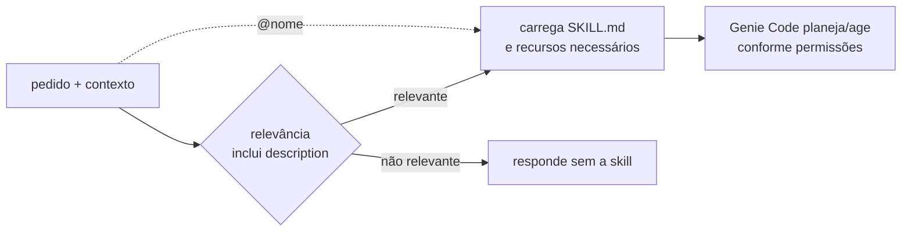

# `skills/` — Agent Skills do Hub

> **MECANISMO NATIVO · CONTEÚDO CUSTOMIZADO.** O Genie Code reconhece
> `.assistant/skills/<nome>/SKILL.md`. Os nomes e métodos `hub-ml-*` foram
> criados neste projeto.

Use esta pasta quando quiser acrescentar ao Genie Code um método especializado,
com instruções, exemplos, recursos e limites próprios.

## Como a skill entra numa tarefa



A `description` precisa dizer **o que a skill faz e quando usar**. O corpo do
`SKILL.md` define o método depois que a skill é carregada. Recursos relativos,
como templates, documentação e scripts, podem complementar a skill.

Neste pacote, a biblioteca `hub_snippets`/`hub_scripts` não fica dentro das
skills. Uma skill pode indicar qual helper usar, mas o código ainda precisa
importá-lo explicitamente no runtime.

## Escolha por intenção

| Intenção principal | Skill |
|---|---|
| EDA com qualidade, distribuição e síntese | `hub-ml-eda-profissional` |
| consolidar EDAs e avaliar prontidão para ML | `hub-ml-cross-eda-ml` |
| features e joins point-in-time | `hub-ml-feature-engineering` |
| testes, efeito e incerteza | `hub-ml-validacao-estatistica` |
| baseline, validação e tracking | `hub-ml-baseline-ml` |
| SHAP e comunicação de explicabilidade | `hub-ml-explainability` |
| drift, performance e decisão de retreino | `hub-ml-monitoramento-modelo` |
| Lakeflow, Jobs e bundles | `hub-ml-pipeline-builder` |
| safras e maturação por MOB | `hub-ml-analise-safra` |
| documentação PRÉ/PÓS de notebook | `hub-ml-comentar-notebook` |
| explicação didática de código e plataforma | `hub-ml-tutor-databricks` |
| auditoria de uma saída produzida por skill | `hub-ml-auditoria-skills` |
| criação de objeto no padrão do Hub | `hub-ml-criar-objeto` |

Exemplo explícito:

```text
@hub-ml-feature-engineering

Desenhe as features para prever churn em 30 dias usando @catalogo.schema.base.
Declare grão, instante de decisão, disponibilidade de cada fonte e testes
anti-leakage. Primeiro entregue o plano; não execute nem escreva.
```

## Contrato de uma skill desta biblioteca

Cada `SKILL.md` precisa ter:

1. frontmatter YAML com `name` igual ao nome da pasta e `description` específica;
2. seções de objetivo, quando usar, fluxo, guardrails e saída;
3. caminhos relativos válidos para todo recurso citado;
4. separação explícita entre planejar, gerar código, executar e mutar;
5. exemplos representativos e fronteiras contra skills vizinhas.

Crie pelo [template de skill](../hub_padroes/skill/template.md) ou invoque
`@hub-ml-criar-objeto`.

## Testar uma alteração

Mudanças no corpo exigem revisão do contrato e dos recursos. Mudanças em `name`,
`description` ou fronteira temática exigem também forward tests:

| Caso | Deve acontecer |
|---|---|
| positivo | a skill alvo é carregada para uma demanda típica |
| negativo | a skill alvo não rouba uma demanda vizinha |
| `@menção` | a seleção explícita carrega a skill |

Execute em chat novo e registre o que foi observado. Forward test mede
roteamento; não prova qualidade da resposta nem execução do código.

## Limites

- Skill não concede permissão de dados nem substitui Unity Catalog.
- Skill pode orientar execução, mas autorização de escrita/deploy continua
  separada e deve estar explícita no pedido.
- Texto genérico em `description` pode fazer a skill competir com muitas outras.
- Um artefato citado como “este notebook” precisa estar anexado ao chat.
- Skills nativas da Databricks coexistem com as skills do Hub; use `@` quando a
  seleção precisar ser determinística.

## Onde continuar

- [Guia completo do ecossistema](../README.md)
- [Prompts guiados](../hub_prompts/README.md)
- [Catálogo de helpers](../CATALOGO_HELPERS.md)
- [Glossário](../GLOSSARIO.md)
- [Documentação oficial de Agent Skills](https://learn.microsoft.com/en-us/azure/databricks/genie-code/skills)
