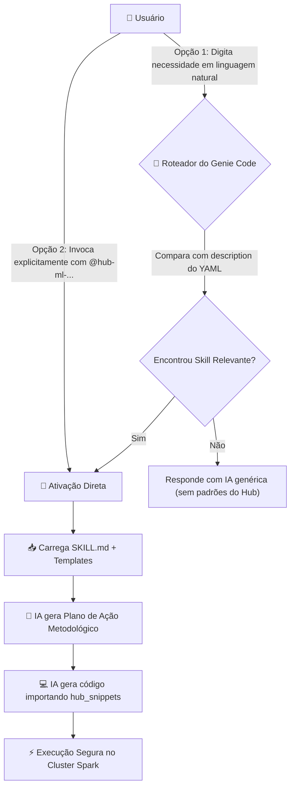
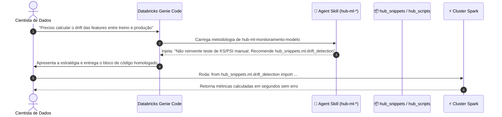

# Agent Skills

> O cérebro metodológico do Databricks Genie Code: diretrizes de engenharia, guardrails anti-alucinação e fluxos analíticos passo a passo para transformar a IA em um especialista sênior em Machine Learning.

---

## 🧠 O que são Agent Skills?

Para entender o que é uma **Agent Skill**, imagine a seguinte situação:

> Você contrata um cientista de dados recém-formado brilhante. Ele conhece toda a teoria matemática e leu todos os manuais técnicos do mundo, mas **não conhece as regras de negócio da sua empresa, não sabe quais bibliotecas internas já existem e tende a reinventar a roda** ou cometer erros comuns de engenharia (como vazar dados do futuro em modelos preditivos).
> 
> Para que ele trabalhe com excelência, você entrega a ele um **Procedimento Operacional Padrão (POP) detalhado**, escrito pelo Engenheiro de Machine Learning mais sênior da equipe, dizendo: *"Aqui nós analisamos dados seguindo este método, com estes guardrails, e usamos estas funções homologadas da nossa biblioteca interna."*

**Uma Agent Skill é exatamente esse POP estruturado para o Databricks Assistant (Genie Code).**

Uma skill **não é código Python para você importar**. Ela é um arquivo de instrução contextual (`SKILL.md`) que ensina a IA a:
1. **Pensar antes de agir:** Estruturar o problema em etapas lógicas antes de escrever código.
2. **Respeitar Guardrails Rigorosos:** Proibições explícitas do que *nunca* fazer (ex: nunca rodar `collect()` em tabelas gigantes, nunca ordenar datas como texto, nunca calcular métricas sem intervalo de confiança).
3. **Recomendar a Biblioteca do Hub:** Apontar diretamente para os algoritmos homologados de `hub_snippets` e `hub_scripts`, impedindo que o assistente tente programar fórmulas complexas do zero de forma ingênua.

```text
┌─────────────────────────────────────────────────────────────────────────────┐
│                           ANATOMIA DE UMA AGENT SKILL                       │
│                                                                             │
│   🎯 Objetivo & Escopo: Quando esta habilidade deve ou não ser acionada     │
│   🗺️ Metodologia: O passo a passo analítico de ponta a ponta               │
│   🚫 Guardrails Anti-Erro: Proibições expressas contra armadilhas comuns    │
│   📦 Catálogo de Helpers: As funções prontas que o modelo deve sugerir      │
│   📋 Templates de Saída: O formato exato de entrega de gráficos e tabelas   │
└─────────────────────────────────────────────────────────────────────────────┘
```

---

## 🤖 Como o Genie Code e o Usuário utilizam as Skills

O ciclo de vida de uma skill estabelece uma interação colaborativa e estruturada entre o usuário e o motor do assistente no Databricks:



### 1. Pelo lado do Genie Code (Descoberta Automática)
Cada skill possui no seu cabeçalho um bloco YAML (*frontmatter*) com dois atributos essenciais: `name` e `description`.
* O Genie Code lê constantemente essas descrições no workspace.
* Quando o usuário faz uma pergunta em linguagem natural (ex: *"Quero analisar o comportamento das safras de contratos por mês de concessão"*), o roteador semântico da IA compara o pedido com as descrições e decide autonomamente: *"Esta tarefa requer a skill de análise de safras"*.
* Ao carregar a skill, o assistente adota imediatamente a persona, as restrições e a metodologia descritas naquele documento.

### 2. Pelo lado do Usuário (Ativação Explícita com `@`)
Embora o assistente consiga deduzir a skill pelo contexto, **a melhor prática em ambientes corporativos é a menção direta via arroba (`@`)**:
* Ao digitar `@hub-ml-feature-engineering` no chat, você força o assistente a carregar aquela rota específica de forma determinística, sem qualquer margem para ambiguidade.
* **Exemplo de comando ideal no chat:**
  ```text
  @hub-ml-feature-engineering
  
  Desenhe as features para prever o cancelamento de clientes nos próximos 30 dias 
  utilizando a tabela @catalogo_crm.vendas.historico.
  - Data de referência: dt_venda
  - Entidade: id_cliente
  - Apresente primeiro o plano metodológico antes de gerar o código final.
  ```

---

## 🔗 Relação entre Skills, Hub Snippets e Hub Scripts

Para que o ecossistema funcione com máxima eficiência, existe uma divisão de papéis clara e sem sobreposição:

> **A Skill é o Maestro (o cérebro metodológico).**
> **Os Snippets e Scripts são os Músicos e Instrumentos (as ferramentas de execução).**



### Caso de Uso Genérico:
1. **O que acontece sem o ecossistema:** O usuário pede à IA para calcular estabilidade populacional. A IA tenta gerar um algoritmo do zero de 60 linhas de Python puro, usando laços `for` lentos, calculando decis com aproximações incorretas e coletando bilhões de linhas para a memória do driver, derrubando o cluster.
2. **O que acontece com a Skill do ecossistema:** A skill intercepta a intenção e instrui o assistente: *"Não gere cálculos manuais. Indique a importação de `hub_snippets.spark.psi_calculator`. Use os limiares 0.1 e 0.25."* O resultado é um código de 3 linhas, homologado, ultra veloz e distribuído em Spark.

---

## 📋 O que são os Templates das Skills?

Dentro das pastas de algumas skills existe uma subpasta chamada **`templates/`**. 

**Templates são gabaritos de formatação, estilo e entrega que propiciam que a saída gerada pela IA mantenha um padrão uniforme e profissional.**

Pense nos templates como folhas timbradas ou formulários de apresentação corporativa:
* **Gabaritos de Estilo Visual (ex: `estilo_visual_eda.md`):** Ensina à IA exatamente como formatar gráficos do Plotly (quais cores hexadecimais usar, como formatar tooltips e eixos).
* **Checklists de Validação (ex: `checklist-objeto-novo.md`):** Checklists estruturados que a IA preenche para provar que uma entrega técnica cumpre todos os requisitos antes de ser considerada concluída.
* **Formatos de Laudos Técnicos (ex: `notebook_output_stat.md`):** Estrutura padronizada de como relatar p-valores, tamanhos de efeito e intervalos de confiança para áreas de negócio.

---

## 🏛️ Arquitetura de Skills no Hub

Cada skill habita em seu próprio diretório em `.assistant/skills/<nome-da-skill>/` e é composta por um arquivo canônico **`SKILL.md`**, estruturado rigidamente em seções auditadas por ferramentas automatizadas:

```text
.assistant/skills/hub-ml-feature-engineering/
├── SKILL.md                  # O cérebro metodológico da skill
└── templates/                # Gabaritos de saída e formatação (opcional)
    └── contrato_features.md
```

### As Seções Estruturais Obrigatórias de um `SKILL.md`:
1. **Frontmatter YAML:** Metadados de identificação (`name` e `description` rica em palavras-chave).
2. **Quando esta skill se aplica:** Critérios claros de inclusão e exclusão (fronteiras com outras skills).
3. **Fluxo de Execução:** O passo a passo sequencial que a IA deve guiar (do entendimento do problema à entrega).
4. **Helpers Obrigatórios:** Lista explícita de funções de `hub_snippets` e `hub_scripts` que devem ser recomendadas para a tarefa.
5. **O que NUNCA fazer (Guardrails):** Proibições severas contra más práticas de modelagem e riscos de engenharia.
6. **Formato de Saída:** Critérios de aceite de como o código e o relatório devem ser entregues no notebook.

---

## 🗺️ Catálogo de Agent Skills

As skills cobrem as diversas etapas de um ciclo analítico profissional:

| Ciclo Analítico | Skill | Objetivo Principal |
| :--- | :--- | :--- |
| **Exploração & Diagnóstico** | `hub-ml-eda-profissional` | Análise exploratória univariada e bivariada com qualidade e síntese executiva. |
| | `hub-ml-cross-eda-ml` | Cruzamento entre múltiplas bases e avaliação de prontidão para modelagem (*ML readiness*). |
| | `hub-ml-validacao-estatistica` | Testes de hipóteses rigorosos, tamanho de efeito e inferência sob incerteza. |
| **Engenharia de Dados & Risco** | `hub-ml-feature-engineering` | Criação de features e joins temporais (*point-in-time*) protegidos contra vazamento. |
| | `hub-ml-analise-safra` | Curvas de safra e evolução de maturação por MOB (*Months on Book*) em crédito. |
| **Modelagem & Explicabilidade** | `hub-ml-baseline-ml` | Criação de modelos benchmark, validação temporal robusta e tracking no MLflow. |
| | `hub-ml-explainability` | Interpretação de caixas-pretas com SHAP e geração de relatórios de explicabilidade. |
| **MLOps & Produção** | `hub-ml-monitoramento-modelo` | Acompanhamento contínuo de performance e drift com tomada de decisão de retreino. |
| | `hub-ml-pipeline-builder` | Empacotamento de esteiras em Databricks Workflows, Jobs e Lakeflow. |
| **Governança & Engenharia** | `hub-ml-comentar-notebook` | Documentação técnica e executiva de notebooks (contexto PRÉ e interpretação PÓS). |
| | `hub-ml-tutor-databricks` | Explicação didática de arquitetura Spark, Catalyst Optimizer e conceitos de ML. |
| | `hub-ml-auditoria-skills` | Auditoria de códigos gerados por IA para apoiar a conformidade técnica. |
| | `hub-ml-criar-objeto` | Automação da criação de novos snippets, scripts e skills no padrão do Hub. |

---

## 📖 Detalhamento das Skills

Abaixo você encontra a análise aprofundada de cada skill: seu propósito, o que faz, quando usar, quais helpers ela aciona e quais templates a acompanham.

---

### `hub-ml-eda-profissional` — Exploração Completa e Visual
* **O que faz:** Estrutura uma Análise Exploratória de Dados (EDA) rigorosa. Avalia volumetria, completude de dados, cardinalidade, distribuições univariadas, relações bivariadas com o alvo e geração de insights de negócio.
* **Templates:** `templates/estilo_visual_eda.md` (orienta para que os gráficos usem paletas profissionais limpas e padronizadas).
* **Helpers Acionados:** `hub_snippets.visual.theme_plotly`, `hub_snippets.display.dataframe_styled`, `hub_snippets.display.distribution_grid`, `hub_scripts.quick_profile`.
* **Caso de Uso Real:**
  > *"Acabei de receber uma tabela nova de sinistros de seguros com 120 colunas. Preciso de uma análise exploratória completa para entender quais variáveis mais impactam o valor pago e identificar anomalias nas colunas numéricas."*

---

### `hub-ml-cross-eda-ml` — Cruzamento de Bases e Prontidão para ML
* **O que faz:** Focada no estágio em que os dados já foram explorados isoladamente e precisam ser consolidados. Avalia compatibilidade de chaves entre tabelas, perda de linhas em cruzamentos e julga formalmente a **prontidão da base para Machine Learning** (*ML Readiness*).
* **Templates:** `templates/tabela_cruzamento.md`, `templates/checklist_prontidao.md`.
* **Helpers Acionados:** `hub_scripts.join_diagnostics`, `hub_scripts.data_quality_check`.
* **Caso de Uso Real:**
  > *"Tenho uma tabela de transações bancárias e outra de dados cadastrais. Quero cruzar as duas e saber se há perda de clientes no relacionamento ou desbalanceamento severo antes de começar a modelagem preditiva."*

---

### `hub-ml-validacao-estatistica` — Rigor Matemático e Testes de Hipóteses
* **O que faz:** Impede que o cientista de dados tire conclusões precipitadas baseadas em médias simples. Aplica testes de normalidade (Shapiro-Wilk), testes paramétricos/não-paramétricos (T-Student, Mann-Whitney, ANOVA, Kruskal-Wallis), mede o tamanho do efeito (Cohen's d) e estima intervalos de confiança por Bootstrap.
* **Templates:** `templates/notebook_output_stat.md` (formato padronizado de laudo de testes estatísticos).
* **Helpers Acionados:** Funções de inferência estatística de `hub_snippets.ml`.
* **Caso de Uso Real:**
  > *"Realizamos um teste A/B em uma campanha de marketing. A taxa de conversão do grupo B foi 2% maior que a do grupo A. Quero validar com 95% de confiança estatística se essa diferença é real ou mero ruído amostral."*

---

### `hub-ml-feature-engineering` — Engenharia de Atributos sem Leakage
* **O que faz:** Desenha e codifica variáveis preditivas para problemas temporais e tabulares. É estruturada para que as agregações históricas respeitem o instante da decisão (tempo zero), mitigando o risco de vazamento temporal.
* **Templates:** `templates/contrato_features.md`.
* **Helpers Acionados:** `hub_snippets.spark.pit_join`, `hub_snippets.ml.lgbm_temporal`, `hub_snippets.spark.date_features`.
* **Caso de Uso Real:**
  > *"Preciso criar variáveis agregadas de consumo dos últimos 30, 60 e 90 dias para cada cliente, de modo que o cálculo de cada dia utilize apenas as transações registradas até a meia-noite anterior."*

---

### `hub-ml-analise-safra` — Maturação e Curvas de Crédito (Vintage)
* **O que faz:** Constrói análises de safras (*Vintage Analysis*). Estrutura matrizes de evolução temporal por mês de concessão/originação ao longo dos meses de vida do contrato (*Months on Book - MOB*), calculando taxas acumuladas de evento (inadimplência, churn ou sinistralidade).
* **Templates:** `templates/estilo_safra.md`.
* **Helpers Acionados:** `hub_snippets.ml.vintage_analysis`, `hub_snippets.constants.format_br`.
* **Caso de Uso Real:**
  > *"A diretoria de crédito precisa saber se os contratos originados no último trimestre estão performando pior ou melhor do que as safras do ano passado após 6 meses de carteira."*

---

### `hub-ml-baseline-ml` — Benchmark Inicial e Rastreabilidade
* **O que faz:** Cria o primeiro modelo preditivo estruturado (benchmark). Define uma estratégia de divisão temporal rígida, treina modelos simples e interpretáveis, registra métricas completas no MLflow e estabelece o patamar mínimo de acurácia que modelos futuros mais complexos deverão superar.
* **Templates:** `templates/resumo_baseline.md`.
* **Helpers Acionados:** `hub_snippets.ml.split_temporal`, `hub_snippets.ml.mlflow_run`, `hub_snippets.ml.metrics_report`.
* **Caso de Uso Real:**
  > *"Preciso de um modelo baseline rápido para previsão de propensão de contratação de seguro para servir de balizador antes de iniciarmos experimentos complexos com redes neurais."*

---

### `hub-ml-explainability` — Explicabilidade de Modelos e SHAP
* **O que faz:** Abre caixas-pretas de Machine Learning. Calcula e visualiza valores SHAP (*SHapley Additive exPlanations*), dependência parcial e importância de variáveis, traduzindo o raciocínio matemático do modelo em explicações intuitivas para áreas de negócio e auditoria.
* **Templates:** `templates/laudo_explicabilidade.md`.
* **Helpers Acionados:** `hub_snippets.ml.explainability_report`, `hub_snippets.ml.curves_plotly`.
* **Caso de Uso Real:**
  > *"O modelo de crédito negou o limite de um cliente e a área de conformidade regulatória exige uma explicação transparente de quais variáveis individuais mais contribuíram para essa decisão negativa."*

---

### `hub-ml-monitoramento-modelo` — MLOps e Detecção de Degradação
* **O que faz:** Audita modelos em produção. Compara bases de escoragem mensal contra a base de desenvolvimento, calculando PSI (*Population Stability Index*), CSI por variável, decaimento de KS/AUC e alertando sobre a necessidade ou não de retreinamento.
* **Templates:** `templates/alerta_monitoramento.md`.
* **Helpers Acionados:** `hub_snippets.ml.performance_monitor`, `hub_snippets.spark.psi_calculator`, `hub_scripts.drift_detector`.
* **Caso de Uso Real:**
  > *"Nosso modelo de propensão está rodando há 6 meses em produção. Quero rodar uma rotina mensal que aponte se o perfil da população mudou significativamente e se a curva ROC ainda se sustenta nos níveis originais."*

---

### `hub-ml-pipeline-builder` — Industrialização e Databricks Workflows
* **O que faz:** Pega o código experimental validado no notebook e o transforma em uma esteira de produção industrial: estrutura pipelines modulares, parametriza tarefas para o Databricks Jobs/Workflows, define tratamento de erros e prepara bundles de implantação.
* **Templates:** `templates/workflow_spec.md`.
* **Helpers Acionados:** `hub_scripts.data_quality_check`, `hub_snippets.ml.mlflow_run`.
* **Caso de Uso Real:**
  > *"Terminei meu modelo no notebook interativo. Agora preciso criar uma esteira automatizada no Databricks Jobs que rode todo dia primeiro do mês, ingira os dados, escore a base e salve o resultado no Unity Catalog."*

---

### `hub-ml-comentar-notebook` — Documentação Executiva e Técnica
* **O que faz:** Analisa notebooks existentes e os transforma em relatórios legíveis para humanos. Insere células de Markdown explicativo **antes** dos códigos (explicando o racional técnico) e blocos de síntese executiva **depois** das saídas (traduzindo números brutos em interpretações claras de negócio).
* **Templates:** `templates/padrao_comentario_notebook.md`.
* **Helpers Acionados:** `hub_snippets.visual.section_header`.
* **Caso de Uso Real:**
  > *"Construí um notebook técnico denso com mais de 40 células. Preciso apresentá-lo para a gerência amanhã e quero documentá-lo para que qualquer pessoa entenda a narrativa de negócio sem precisar ler código."*

---

### `hub-ml-tutor-databricks` — Mentoria Técnica e Didática
* **O que faz:** Atua como um professor particular de Databricks e PySpark. Explica como funcionam planos de execução do Catalyst Optimizer, gerenciamento de partições, shuffle, otimização de joins e conceitos teóricos de algoritmos estatísticos.
* **Templates:** `templates/explicacao_didatica.md`.
* **Helpers Acionados:** Não aciona helpers de execução (sua função é conceitual e pedagógica).
* **Caso de Uso Real:**
  > *"Minha consulta Spark com join está demorando 40 minutos para executar. Quero que a IA analise o plano de execução e me explique didaticamente o que é Broadcast Join e como resolver o problema de skew nos dados."*

---

### `hub-ml-auditoria-skills` — Guardiã da Qualidade das Entregas
* **O que faz:** Revisa criticamente a resposta ou código que foi gerado por outra skill. Confere se a IA não tentou reimplementar funções existentes do Hub, se tratou nulos adequadamente, se não criou bugs temporais e se seguiu os guardrails institucionais.
* **Templates:** `templates/relatorio_auditoria.md`.
* **Helpers Acionados:** Varre `CATALOGO_HELPERS.md`.
* **Caso de Uso Real:**
  > *"A IA gerou um notebook de modelagem para mim. Antes de rodar em produção, quero que a skill de auditoria avalie se o código respeitou todas as regras contra vazamento de dados e boas práticas do ecossistema."*

---

### `hub-ml-criar-objeto` — Fábrica de Expansão do Hub
* **O que faz:** Automatiza a expansão do próprio ecossistema. Quando a equipe precisa criar um novo snippet, script ou skill, este assistente gera a estrutura completa da **Pasta de Objeto (ADR-0007)**: cria o código-fonte, o contrato público no `__init__.py` e o notebook didático de exemplo com dados sintéticos.
* **Templates:** `templates/checklist-objeto-novo.md`.
* **Helpers Acionados:** Aciona os templates de `hub_padroes/`.
* **Caso de Uso Real:**
  > *"Desenvolvi uma função inovadora de cálculo de LTV (Lifetime Value) que será útil para todo o time. Quero empacotá-la como um novo snippet oficial do Hub seguindo as boas práticas e padrões de qualidade do ecossistema."*

---

## ❓ Perguntas Frequentes (FAQ)

### 1. Como a skill sabe quais colunas da minha tabela utilizar (chave primária, target, data de referência)?
**Elas foram desenhadas para trabalhar em colaboração com você.** Ao acionar a skill no chat, você pode declarar explicitamente os campos principais (ex: `@catalogo.schema.tabela com chave id_cliente e target churn`). Caso você não declare, a metodologia da skill instrui o assistente a inspecionar o schema da tabela ou fazer perguntas objetivas de alinhamento antes de começar a escrever o código, buscando alinhar o grão e as variáveis com você antes da escrita do código.

### 2. O que acontece se eu não colocar o `@` antes do nome da skill?
O Databricks Genie Code tentará deduzir a skill comparando a sua pergunta com o texto de descrição de cada uma. Se a sua pergunta for clara, ele acertará. No entanto, usar o `@` (ex: `@hub-ml-analise-safra`) direciona deterministicamente a IA para carregar a metodologia recomendada.

### 3. Posso combinar duas ou mais skills na mesma conversa?
**Sim, mas em etapas sequenciais.** Uma boa prática é avançar passo a passo: primeiro use `@hub-ml-eda-profissional` para entender os dados; em seguida, no mesmo chat ou notebook, invoque `@hub-ml-feature-engineering` para desenhar os atributos com base nas descobertas da exploração.

### 4. O que fazer se a saída gerada pela skill precisar de adaptações ou regras específicas do meu projeto?
**Você mantém controle total sobre o código.** As skills fornecem a melhor prática metodológica e os blocos canônicos, mas o código gerado no notebook é Python/PySpark aberto e totalmente editável. Além disso, no próprio chat você pode solicitar refinamentos (ex: *"altere a janela móvel para 15 dias em vez de 30"* ou *"adicione um filtro para excluir contratos cancelados"*), e o assistente adaptará a solução preservando todos os guardrails da skill.

### 5. A equipe pode editar as instruções de uma skill existente?
**Sim.** Se a sua área técnica decidir que um novo guardrail corporativo deve ser adotado por todos (por exemplo: *"sempre excluir a coluna X em modelos de crédito por conformidade regulatória"*), basta atualizar o arquivo `SKILL.md` correspondente. A partir desse momento, todas as respostas futuras da IA seguirão a nova diretriz.
