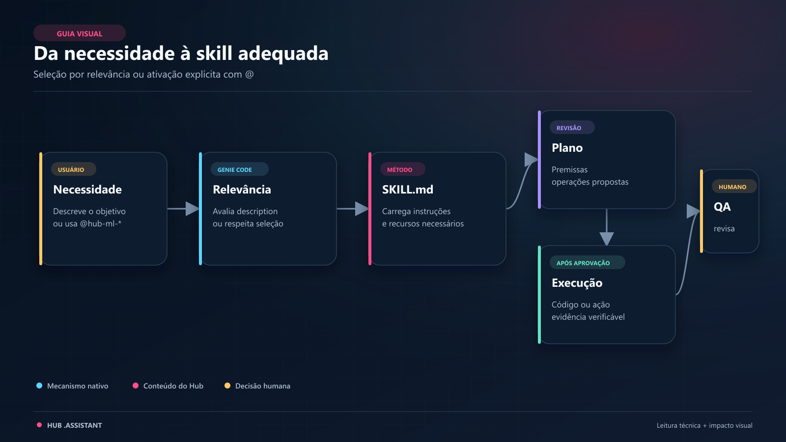
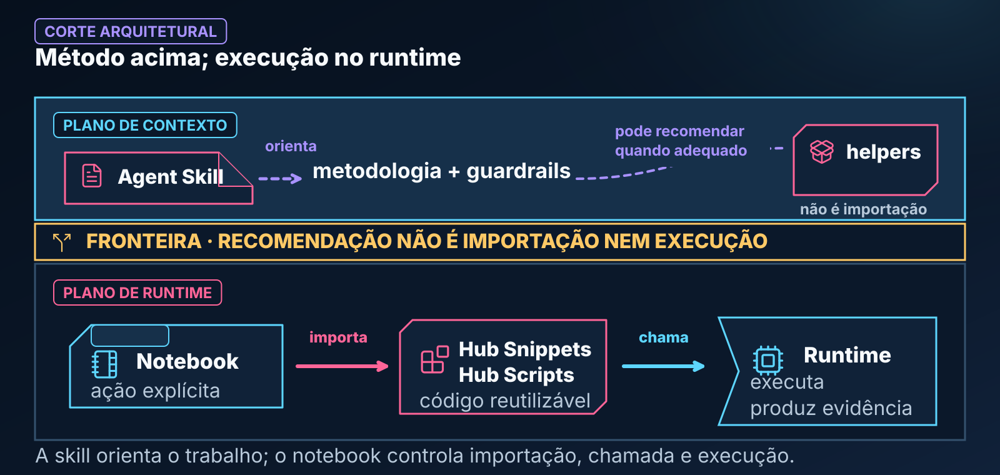

# Agent Skills

> O cérebro metodológico do ecossistema no Databricks Genie Code: diretrizes de engenharia, guardrails e fluxos analíticos passo a passo para orientar trabalhos de Machine Learning.

> **MECANISMO NATIVO, CONTEÚDO CUSTOMIZADO.** Agent Skills são um recurso oficial da Genie Code e seguem o padrão aberto Agent Skills. Os nomes `hub-ml-*`, as metodologias, os templates e os helpers descritos aqui foram criados neste projeto.

---

## 🧭 Neste Guia

| Para entender... | Vá para... |
|---|---|
| o que uma Agent Skill faz | [O que são Agent Skills](#-o-que-são-agent-skills) |
| como ocorre a seleção por relevância ou `@` | [Como as Skills são utilizadas](#-como-o-genie-code-e-o-usuário-utilizam-as-skills) |
| a relação entre metodologia e código | [Skills, Snippets e Scripts](#-relação-entre-skills-hub-snippets-e-hub-scripts) |
| as skills disponíveis | [Catálogo](#️-catálogo-de-agent-skills) |
| o propósito de cada skill | [Detalhamento](#-detalhamento-das-skills) |
| permissões e aprovação | [Aprovações e Revisão](#-aprovações-permissões-e-revisão) |

---

<a id="-o-que-são-agent-skills"></a>

## 🧠 O que são Agent Skills?

Para entender o que é uma **Agent Skill**, imagine a seguinte situação:

> Você recebe um cientista de dados tecnicamente preparado. Ele conhece teoria e ferramentas, mas ainda não conhece as regras da sua equipe, as bibliotecas internas disponíveis nem as armadilhas recorrentes do seu domínio.
>
> Para orientar o trabalho, você entrega um **Procedimento Operacional Padrão (POP)**: “nesta tarefa, comece por estas perguntas, siga estas etapas, observe estes riscos, utilize estes recursos e entregue o resultado neste formato”.

**Uma Agent Skill funciona como esse POP estruturado para a Genie Code.**

Uma skill **não é código Python para importar**. Ela é um pacote de instruções cujo arquivo principal, `SKILL.md`, ensina o assistente a:

1. **Pensar antes de agir:** decompor o problema e declarar premissas antes de escrever ou executar código.
2. **Respeitar guardrails:** evitar práticas como vazamento temporal, coleta indiscriminada no driver ou conclusão estatística sem contexto.
3. **Recomendar a biblioteca do Hub:** apontar helpers existentes de `hub_snippets` e `hub_scripts` quando eles forem adequados, sem presumir que foram importados.
4. **Entregar de forma consistente:** usar checklists e templates para tornar código, evidências e limitações mais fáceis de revisar.

```text
┌─────────────────────────────────────────────────────────────────────────────┐
│                           ANATOMIA DE UMA AGENT SKILL                       │
│                                                                             │
│   🎯 Objetivo & Escopo: quando a habilidade se aplica e onde termina        │
│   🗺️ Metodologia: etapas, decisões e perguntas que orientam o trabalho      │
│   🚫 Guardrails: riscos que precisam ser prevenidos ou aprovados            │
│   📦 Catálogo de Helpers: caminhos reutilizáveis recomendados               │
│   📋 Templates de Saída: estruturas de entrega e critérios de revisão       │
└─────────────────────────────────────────────────────────────────────────────┘
```

Guardrails textuais reduzem risco, mas não são barreiras técnicas absolutas. Permissões, política de aprovação, revisão humana e testes continuam valendo.

---

<a id="-como-o-genie-code-e-o-usuário-utilizam-as-skills"></a>
<a id="como-o-genie-code-e-o-usuario-utilizam-as-skills"></a>

## 🤖 Como o Genie Code e o Usuário utilizam as Skills

O ciclo de vida de uma skill estabelece uma interação colaborativa entre o usuário, o assistente e os recursos do Databricks:



*Leitura da figura: a `description` ajuda o roteamento; a menção com `@` torna a escolha explícita.*

**Equivalente textual:** na rota por relevância, a Genie Code compara o pedido com a `description` da skill. Na rota explícita, a pessoa seleciona a skill com `@nome-da-skill`. As duas rotas convergem no carregamento do mesmo pacote de instruções, sem eliminar a necessidade de revisar a entrega.

### 1. Pelo lado do Genie Code (Seleção por Relevância)

Cada skill possui no cabeçalho de `SKILL.md` um frontmatter YAML com `name` e `description`:

- A Genie Code usa a descrição para decidir se a skill é relevante à solicitação.
- Quando o pedido corresponde ao escopo, o assistente pode carregar a skill e seguir suas instruções.
- Recursos adicionais da pasta são utilizados conforme forem referenciados e necessários; não presuma que toda a subpasta `templates/` é carregada integralmente em toda conversa.
- A seleção por relevância depende da qualidade da descrição e do pedido. Ela deve ser testada, não tratada como certeza universal.

### 2. Pelo lado do Usuário (Ativação Explícita com `@`)

Quando você quer indicar uma metodologia específica, mencione a skill com `@`:

```text
@hub-ml-feature-engineering

Desenhe as features para prever o cancelamento de clientes nos próximos 30 dias
utilizando a tabela anexada `catalogo_crm.vendas.historico`.

- Data de referência: dt_venda
- Entidade: id_cliente
- Disponibilidade das fontes: NÃO INFORMADO — pergunte antes de assumir
- Apresente primeiro o plano metodológico e os riscos de leakage.
- Não execute nem persista alterações antes da minha aprovação.
```

A `@menção` é a forma explícita suportada de selecionar uma skill. Ela reduz ambiguidade, mas não transforma o resultado em determinístico nem substitui a revisão do que foi carregado e produzido.

> **Dica:** depois de editar uma skill publicada, teste-a em um chat novo. Se a versão anterior ainda aparecer, faça uma atualização completa da página antes de concluir que a mudança não foi reconhecida.

---

<a id="-relação-entre-skills-hub-snippets-e-hub-scripts"></a>
<a id="relacao-entre-skills-hub-snippets-e-hub-scripts"></a>

## 🔗 Relação entre Skills, Hub Snippets e Hub Scripts

Para que o ecossistema funcione de forma coerente, existe uma divisão de papéis:

> **A Skill é o Maestro: organiza a metodologia.**
> **Os Snippets e Scripts são os Instrumentos: fornecem implementações e diagnósticos reutilizáveis.**



*Leitura da figura: orientação metodológica e código executável são responsabilidades diferentes.*

**Equivalente textual:** no plano de contexto, a skill orienta metodologia e guardrails e pode recomendar um helper quando adequado. No plano de runtime, o notebook precisa importar e chamar esse helper explicitamente; a recomendação não instala, importa nem executa código.

### Caso de Uso Genérico

1. **Sem uma metodologia específica:** ao pedir apenas “calcule estabilidade”, o assistente precisa inferir população de referência, período atual, variáveis, bins, escala e critérios de interpretação.
2. **Com a skill do ecossistema:** a skill orienta essas decisões e recomenda, quando adequado, `hub_snippets.spark.psi_calculator` ou `hub_scripts.drift_detector`.
3. **No runtime:** o notebook ainda precisa tornar `.assistant` visível ao Python, importar o helper e satisfazer suas dependências. A skill não instala, importa ou executa a biblioteca sozinha.

O objetivo é reduzir reinvenção e tornar a solução conferível — não prometer código infalível, execução instantânea ou um threshold universal de PSI.

---

## 📋 O que são os Templates das Skills?

Dentro das pastas de algumas skills existe uma subpasta chamada **`templates/`**.

**Templates são gabaritos de especificação, análise e entrega que ajudam a manter uma saída uniforme e revisável.**

Pense neles como formulários técnicos especializados:

- **Gabaritos de Estilo Visual**, como `estilo_visual_eda.md`: orientam composição, hierarquia e leitura; paletas e tokens configuráveis pertencem ao `ResolvedTheme` e ao padrão `hub_padroes/identidade_visual`, não ao template da skill.
- **Checklists de Validação**, como `checklist-objeto-novo.md`: organizam requisitos que devem ser conferidos antes de concluir uma entrega.
- **Formatos de Laudo**, como `notebook_output_stat.md`: estruturam hipótese, teste, efeito, incerteza, limitações e decisão.

Um template não é executável e não é um helper. Ele só influencia a resposta quando a skill o referencia e o assistente o utiliza como contexto.

---

## 🎨 Skills e Sistema de Temas

Skills podem **recomendar** consumidores visuais, mas não são fonte de paleta, token ou aprovação. Quando uma tarefa pedir identidade visual, tema ou consistência entre gráficos:

1. trate `hub_padroes/identidade_visual` e `ResolvedTheme` como fontes canônicas;
2. use a rota `_resolvido` do consumidor quando ela existir;
3. mantenha dados, métricas, thresholds e decisões analíticas independentes da aparência;
4. não presuma publicação ou homologação no Databricks;
5. preserve limites declarados — por exemplo, SHAP/Matplotlib e Kaplan–Meier não possuem theming V07 homologado.

`estilo_visual_eda.md` continua útil para decisões **editoriais da EDA** (estrutura, escolha de gráfico, anotações e leitura), mas não pode redeclarar a paleta do Hub.

<a id="estrutura-de-uma-skill-profissional"></a>

## 🏛️ Arquitetura de Skills no Hub

Cada skill habita em seu próprio diretório em `.assistant/skills/<nome-da-skill>/` e possui um arquivo canônico `SKILL.md`:

```text
.assistant/skills/hub-ml-feature-engineering/
├── SKILL.md                  # metodologia e roteamento da skill
└── templates/                # recursos de apoio, quando necessários
    ├── feature_spec_core.md
    └── checklist_validacao_features.md
```


*Leitura da figura: o mecanismo Agent Skills reconhece o pacote; o conteúdo metodológico e seus recursos são mantidos pelo Hub.*

A separação em camadas evita transformar o arquivo principal em um depósito de referências. Metadados ajudam o roteamento; instruções organizam o trabalho; recursos são carregados quando a tarefa realmente os exige.

### Requisitos oficiais e seções estruturais do Hub

No padrão oficial, `SKILL.md` precisa ter frontmatter válido com `name` e `description`. Neste projeto, o contrato editorial acrescenta seções auditadas:

1. **Frontmatter YAML:** identificação e descrição usada no roteamento.
2. **Quando esta skill se aplica:** inclusão, exclusão e fronteiras com outras skills.
3. **Fluxo de execução:** sequência de entendimento, planejamento, código e entrega.
4. **Helpers da biblioteca:** caminhos de `hub_snippets` e `hub_scripts` recomendados, quando existirem.
5. **O que NUNCA fazer (Guardrails):** riscos e operações que exigem prevenção ou aprovação.
6. **Formato de saída:** artefatos e critérios de revisão.

Os itens 2 a 6 são uma convenção de qualidade do Hub, não campos obrigatórios da especificação oficial de Agent Skills.

### Onde as skills podem ficar

- **Skill de usuário:** `/Users/<username>/.assistant/skills/`
- **Skill de workspace:** `Workspace/.assistant/skills/`

O local define o escopo e as permissões. A disponibilidade de uma skill compartilhada depende de como o workspace foi administrado.

---

<a id="️-catálogo-de-agent-skills"></a>

## 🗺️ Catálogo de Agent Skills

As skills cobrem etapas complementares de um ciclo analítico. O catálogo foi
dividido por etapa para permanecer legível em painéis estreitos do workspace.

### 🧭 Descoberta e composição

| Skill | Objetivo principal |
|---|---|
| [hub-ml-concierge](hub-ml-concierge/README.md) | Localizar e combinar recursos existentes sem exigir que o usuário conheça o catálogo. |

Integrada ao produto; publicação e testes conversacionais no destino pendentes.
É uma entrada opcional, não substitui o especialista explicitamente selecionado.

### 🔍 Exploração & Diagnóstico

| Skill | Objetivo principal |
|---|---|
| `hub-ml-eda-profissional` | EDA univariada e bivariada com qualidade e síntese executiva. |
| `hub-ml-cross-eda-ml` | Cruzamento de fontes e avaliação de prontidão para modelagem. |
| `hub-ml-validacao-estatistica` | Hipóteses, pressupostos, efeito e inferência sob incerteza. |

### 🧱 Engenharia de Dados & Risco

| Skill | Objetivo principal |
|---|---|
| `hub-ml-feature-engineering` | Features e joins temporais com instante de decisão explícito. |
| `hub-ml-analise-safra` | Curvas de safra, denominadores e maturação comparável. |

### 📈 Modelagem & Explicabilidade

| Skill | Objetivo principal |
|---|---|
| `hub-ml-baseline-ml` | Baselines por tipo de problema, validação e tracking. |
| `hub-ml-explainability` | Interpretação global/local e comunicação de limitações. |

### ⚙️ MLOps & Produção

| Skill | Objetivo principal |
|---|---|
| `hub-ml-monitoramento-modelo` | Performance, drift, fairness, custo e decisão de retreino. |
| `hub-ml-pipeline-builder` | Pipelines modulares, qualidade, observabilidade e automação. |

### 🛡️ Governança & Engenharia

| Skill | Objetivo principal |
|---|---|
| `hub-ml-comentar-notebook` | Documentação técnica e executiva de notebooks. |
| `hub-ml-tutor-databricks` | Explicação didática de código, Spark, Databricks e ML. |
| `hub-ml-auditoria-skills` | Auditoria da implementação de skills e das entregas produzidas. |
| `hub-ml-criar-objeto` | Criação orientada de objetos no padrão do Hub. |

> **Como ler o catálogo:** a etapa organiza o ponto de entrada, mas não limita a
> composição. Uma análise pode combinar skills desde que objetivo, ordem e
> responsabilidades permaneçam explícitos.

---

<a id="-detalhamento-das-skills"></a>

## 📖 Detalhamento das Skills

Abaixo você encontra o propósito, o momento de uso, os principais recursos e um exemplo de demanda para cada skill.

### `hub-ml-concierge` — Orientação de uso do Hub

Use ao perguntar o que já existe, por onde começar ou quais peças combinar.
Consulta o inventário do Manual e verifica contratos dos candidatos antes de
recomendar método, briefing, API pública ou composição. A resposta informa
cobertura, evidências, lacunas e próxima ação; não importa helpers nem executa análises.

Exemplo: “O que o Hub tem para conferir nulos e duplicidades antes de modelar?”
Templates de recomendação, handoff e registro de busca ficam no
[pacote da skill](hub-ml-concierge/README.md).

---

### `hub-ml-eda-profissional` — Exploração Completa e Visual

- **O que faz:** estrutura EDA com volumetria, qualidade, cardinalidade, distribuições, relações e síntese executiva.
- **Templates:** `roteiro_eda.md`, `matriz_graficos_eda.md`, `relatorio_executivo_eda.md` e `estilo_visual_eda.md`.
- **Helpers recomendados:** `hub_scripts.quick_profile`, `hub_scripts.data_quality_check`, `hub_snippets.spark.null_summary`, `hub_snippets.spark.smart_sample`, `hub_snippets.spark.safe_display`, `hub_snippets.display.correlation_matrix`, `hub_snippets.display.distribution_grid`, `hub_snippets.visual.theme_plotly`, `hub_snippets.visual.index_generator` e `hub_snippets.constants.format_br`.
- **Caso de Uso Real:**
  > *“Recebi uma tabela de sinistros com muitas colunas. Preciso entender grão, qualidade, distribuições e relações com o valor pago antes de formular hipóteses.”*

---

### `hub-ml-cross-eda-ml` — Cruzamento de Bases e Prontidão para ML

- **O que faz:** inventaria fontes, avalia cobertura de chaves, cardinalidade, viabilidade temporal do join e prontidão para modelagem.
- **Templates:** `inventario_edas.md`, `coverage_matrix.md`, `join_feasibility.md`, `readiness_scorecard.md`, `notebook_output_cross_eda.md` e `relatorio_executivo_cross_eda.md`.
- **Helpers recomendados:** `hub_snippets.spark.join_diagnostics`, `hub_snippets.spark.pit_join`, `hub_snippets.spark.null_summary`, `hub_snippets.spark.smart_sample`, `hub_snippets.spark.safe_display`, `hub_snippets.spark.psi_calculator`, `hub_scripts.quick_profile` e `hub_scripts.schema_to_yaml`.
- **Caso de Uso Real:**
  > *“Tenho tabelas transacional e cadastral. Quero medir correspondência, multiplicação de linhas, perda de entidades e disponibilidade temporal antes de construir a ABT.”*

> **Nota técnica:** `join_diagnostics` pertence a `hub_snippets.spark`, não a `hub_scripts`.

---

### `hub-ml-validacao-estatistica` — Rigor Matemático e Testes de Hipóteses

- **O que faz:** parte da decisão e do desenho do dado para escolher testes, conferir pressupostos, estimar efeito e comunicar incerteza.
- **Templates:** `test_plan.md`, `decisao_pressupostos.md`, `test_result_card.md`, `notebook_output_stat.md`, `relatorio_diagnostico.md` e `severity_rubric.md`.
- **Helpers recomendados:** `hub_snippets.spark.smart_sample`, `hub_snippets.spark.null_summary`, `hub_snippets.spark.psi_calculator`, `hub_snippets.ml.drift_detection` e `hub_snippets.constants.format_br`.
- **Caso de Uso Real:**
  > *“A taxa de conversão do grupo B foi maior. Quero decidir se a diferença é material, com teste adequado, tamanho de efeito, incerteza e limitações do desenho.”*

---

### `hub-ml-feature-engineering` — Engenharia de Atributos sem Leakage

- **O que faz:** desenha features com entidade, instante de decisão, disponibilidade das fontes, janelas e validações consistentes entre treino e inferência.
- **Templates:** `feature_spec_core.md`, `feature_spec_risco_validacao.md`, `feature_backlog_tiers.md`, `feature_taxonomy_cross_source.md`, `checklist_validacao_features.md`, `mapa_notebooks_alvo.md` e `notebook_output_structure.md`.
- **Helpers recomendados:** `hub_snippets.spark.pit_join`, `hub_snippets.spark.date_features`, `hub_snippets.ml.lgbm_temporal`, `hub_snippets.ml.split_temporal`, `hub_snippets.ml.woe_iv_calculator` e `hub_scripts.rfv_calculator`.
- **Caso de Uso Real:**
  > *“Preciso criar atributos de consumo em 30, 60 e 90 dias usando apenas informações disponíveis antes da data de decisão de cada cliente.”*

---

### `hub-ml-analise-safra` — Maturação e Curvas de Crédito (Vintage)

- **O que faz:** define evento, denominador, coorte, MOB, janela comparável e censura antes de construir curvas de safra.
- **Templates:** `relatorio_safra.md`.
- **Helpers recomendados:** `hub_snippets.ml.vintage_analysis`, `hub_snippets.spark.date_features`, `hub_snippets.constants.format_br` e `hub_snippets.visual.theme_plotly`.
- **Caso de Uso Real:**
  > *“Quero comparar contratos originados em diferentes trimestres após a mesma maturidade, distinguindo safras ainda incompletas.”*

---

### `hub-ml-baseline-ml` — Benchmark Inicial e Rastreabilidade

- **O que faz:** seleciona uma suíte compatível com classificação, regressão, séries, ranking, survival, clustering ou anomalias; define split, métricas, tracking e critério de comparação.
- **Templates:** incluem `suite_selection_guide.md`, `split_strategy.md`, famílias de métricas, `mlflow_checklist.md`, `notebook_output_baseline.md` e `relatorio_executivo_baseline.md`.
- **Helpers recomendados:** `hub_snippets.ml.split_temporal`, `hub_snippets.ml.walk_forward`, `hub_snippets.ml.metrics_report`, `hub_snippets.ml.curves_plotly`, `hub_snippets.ml.mlflow_run` e treinadores adequados ao tipo de problema.
- **Caso de Uso Real:**
  > *“Preciso de um baseline reproduzível para comparar abordagens mais complexas, mantendo população, split, métrica e custo sob o mesmo contrato.”*

---

### `hub-ml-explainability` — Explicabilidade de Modelos e SHAP

- **O que faz:** escolhe abordagem de explicação conforme modelo, público e decisão, separando leitura técnica e comunicação executiva.
- **Templates:** `shap_analysis_technical.md` e `relatorio_executivo_explainability.md`.
- **Helpers recomendados:** `hub_snippets.ml.explainability_report`, `hub_snippets.ml.shap_explainer` e `hub_snippets.ml.curves_plotly`.
- **Caso de Uso Real:**
  > *“Preciso explicar globalmente o comportamento do modelo e revisar uma previsão individual, deixando claro que contribuição não significa causalidade.”*

---

### `hub-ml-monitoramento-modelo` — MLOps e Detecção de Degradação

- **O que faz:** organiza performance, calibração, drift, fairness, latência, custo e critérios de decisão de retreino.
- **Templates:** `drift_report.md` e `retreino_decision.md`.
- **Helpers recomendados:** `hub_snippets.ml.performance_monitor`, `hub_snippets.ml.drift_detection`, `hub_snippets.spark.psi_calculator`, `hub_snippets.ml.metrics_report`, `hub_snippets.ml.curves_plotly` e `hub_scripts.drift_detector`.
- **Caso de Uso Real:**
  > *“Quero comparar população e performance ao longo do tempo e produzir evidências para uma decisão humana de manter, investigar ou retreinar.”*

A skill não agenda o monitoramento, não envia notificações e não retreina automaticamente.

---

### `hub-ml-pipeline-builder` — Industrialização e Lakeflow

- **O que faz:** transforma lógica experimental em contratos por camada, processamento incremental, qualidade, observabilidade e automação.
- **Templates:** `pipeline_spec.md`.
- **Helpers recomendados:** `hub_scripts.data_quality_check`, `hub_scripts.naming_checker`, `hub_scripts.schema_to_yaml` e `hub_snippets.spark.safe_display`.
- **Caso de Uso Real:**
  > *“Quero decompor um notebook em pipeline incremental, definir expectativas, observabilidade e tarefas de Lakeflow Jobs antes de implantar.”*

Use a nomenclatura vigente: **Lakeflow Spark Declarative Pipelines**, **Lakeflow Jobs** e **Declarative Automation Bundles**.

---

### `hub-ml-comentar-notebook` — Documentação Executiva e Técnica

- **O que faz:** cria narrativa antes do código e interpretação depois da execução, sem alterar silenciosamente o comportamento do notebook.
- **Templates:** `cabecalho_notebook.md`, blocos pré e pós-código nas versões completa e compacta.
- **Helpers recomendados:** `hub_scripts.doc_coverage`, componentes de `hub_snippets.visual` e `hub_snippets.constants.format_br`.
- **Caso de Uso Real:**
  > *“Tenho um notebook técnico extenso. Quero documentar objetivo, lógica e resultados para públicos técnico e executivo, preservando o código.”*

---

### `hub-ml-tutor-databricks` — Mentoria Técnica e Didática

- **O que faz:** explica código, notebooks, erros, Spark, Databricks e conceitos de ML no nível adequado ao leitor.
- **Templates:** `explicacao_bloco_codigo.md`, `explicacao_notebook.md` e `analogias_banking_crm.md`.
- **Helpers recomendados:** `hub_snippets.spark.safe_display`, `hub_snippets.spark.smart_sample` e `hub_snippets.constants.format_br`, apenas quando a demonstração prática exigir.
- **Caso de Uso Real:**
  > *“Minha consulta com join está lenta. Quero entender o plano, broadcast, shuffle e skew antes de escolher uma alteração.”*

Analogias facilitam a compreensão, mas não substituem o comportamento técnico real.

---

### `hub-ml-auditoria-skills` — Guardiã da Qualidade das Entregas

- **O que faz:** opera em dois modos: audita a implementação de uma skill ou audita o output que ela produziu.
- **Templates:** `rubrica_universal.md`, `checkpoints_por_skill.md` e `relatorio_auditoria.md`.
- **Helpers recomendados:** `hub_scripts.doc_coverage` e `hub_scripts.naming_checker`; `MANUAL_TECNICO.md#catalogo-helpers` é referência documental, não helper executável.
- **Caso de Uso Real:**
  > *“A Genie Code gerou um notebook. Quero confrontar pedido, metodologia, código, resultados e limitações antes de aceitar a entrega.”*

---

### `hub-ml-criar-objeto` — Fábrica de Expansão do Hub

- **O que faz:** orienta a criação ou alteração de snippet, script, prompt, README, notebook ou skill usando os padrões do Hub.
- **Templates:** `checklist-objeto-novo.md` e os moldes em `hub_padroes/`.
- **Documentação:** snippet, script ou prompt novo deve incluir README local no contrato 1.0.0.
- **Helpers recomendados:** variam conforme o tipo criado; a própria skill lista recursos de estrutura, teste, visual e documentação.
- **Caso de Uso Real:**
  > *“Desenvolvi uma função de LTV útil para a equipe. Quero estruturá-la com API pública, exemplo sintético, testes, documentação e revisão.”*

Gerar ou editar arquivos é uma ação explícita e sujeita à aprovação; a skill não cria artefatos silenciosamente.

---

## ❓ Perguntas Frequentes (FAQ)

### 1. Como a skill sabe quais colunas utilizar?

As skills trabalham em colaboração com você. Declare tabela, grão, chave, target, instante de decisão, período e filtros. Quando um dado estiver ausente, a metodologia pode orientar a inspeção do schema ou perguntas objetivas; isso não autoriza inventar regra de negócio.

### 2. O que acontece se eu não colocar `@` antes do nome da skill?

A Genie Code pode selecionar uma skill pela relevância entre o pedido e sua `description`. Se você quer uma metodologia específica, use `@nome-da-skill`. A `@menção` explicita a escolha, mas a entrega continua sujeita a revisão.

### 3. Posso combinar duas ou mais skills na mesma conversa?

Sim, preferencialmente em etapas: EDA, feature engineering, baseline, explicabilidade ou monitoramento. Reutilize apenas premissas já validadas e abra um chat novo quando objetivo, dados ou fase mudarem materialmente.

### 4. O que fazer se a saída precisar de adaptações do meu projeto?

Declare as regras e peça a alteração. Depois confira se o refinamento preservou grão, temporalidade, segurança e critérios de aceite. Guardrails não tornam toda adaptação automaticamente correta.

### 5. A equipe pode editar as instruções de uma skill existente?

Sim. Atualize `SKILL.md` e os recursos relacionados, valide o frontmatter e execute testes de roteamento positivo, negativo e por `@menção`. Mudanças recém-publicadas devem ser verificadas em uma conversa nova.

### 6. A skill executa os helpers citados automaticamente?

Não. Ela orienta a Genie Code e pode recomendar caminhos. O notebook precisa configurar `sys.path`, importar o módulo e executar a chamada, respeitando dependências, permissões e aprovações.

---

<a id="-aprovações-permissões-e-revisão"></a>

## 🔐 Aprovações, Permissões e Revisão

- Uma skill não amplia permissões no workspace ou no Unity Catalog.
- Planejar, gerar código, editar notebook, executar e persistir são ações diferentes.
- A política de aprovação configurada continua valendo para as ferramentas disponíveis.
- Autoaprovação reduz confirmações; não é uma fronteira de segurança.
- Revise qualquer `CREATE`, `ALTER`, `DROP`, `DELETE`, `MERGE`, instalação, execução ampla ou mudança de configuração.
- Não inclua tokens, senhas, chaves ou dados sensíveis em skills, templates ou prompts.

---

## 🔗 Continue Explorando

- [Documentação oficial de Agent Skills](https://learn.microsoft.com/en-us/azure/databricks/genie-code/skills)
- [Instruções customizadas na Genie Code](https://learn.microsoft.com/en-us/azure/databricks/genie-code/instructions)
- [Hub Prompts](../hub_prompts/README.md)
- [Hub Snippets](../hub_snippets/README.md)
- [Hub Scripts](../hub_scripts/README.md)
- Catálogo de Helpers: `.assistant/MANUAL_TECNICO.md#catalogo-helpers`
