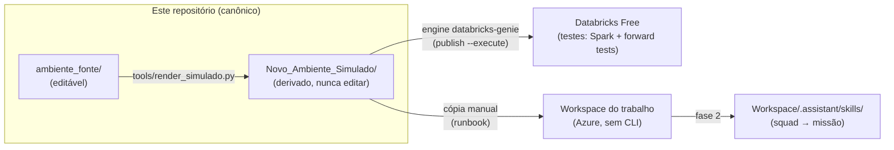
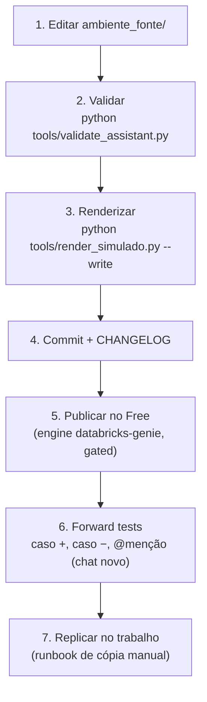

# Ambiente_Databricks

> Laboratório de engenharia do ecossistema `.assistant` (Agent Skills, instruções e
> extensões) do **Databricks Genie Code**, com governança multi-IA, validação
> automatizada e trilha de publicação do ambiente pessoal até a squad/missão.

## Por que este projeto existe

O ambiente de trabalho (Azure Databricks, CRM bancário, missão de modelos de ML) usa
um ecossistema de 12 Agent Skills pessoais + instruções + biblioteca Python. Este
repositório é a **fonte única de verdade** desse ecossistema: aqui ele é editado,
validado, testado no Databricks Free Edition e só então replicado para o trabalho.



## Mapa do repositório

| Pasta | Papel | Editável? |
|---|---|---|
| `CLAUDE.md` · `AGENTS.md` · `GEMINI.md` | Entrada canônica + adaptadores multi-IA | sim |
| `.claude/` | Centro de IA: regras, contexto, skills operacionais, templates | sim |
| `ambiente_fonte/` | **O produto**: `.assistant_instructions.md` + `.assistant/` implantável | sim |
| `Novo_Ambiente_Simulado/` | Espelho da árvore do workspace, gerado por script | **não** (derivado) |
| `tools/` | Validação e render (chamados pelas skills da `.claude/`) | sim |
| `docs/decisions/` | ADRs — decisões arquiteturais numeradas | append-only |
| `docs/auditoria/` | Auditorias multi-LLM (`<data>_<tema>/`) | append-only |
| `docs/handoffs/` | Contexto de passagem entre IAs/sessões | append-only |
| `docs/playbooks/` | Procedimentos repetíveis (ciclo de vida, replicação) | sim |
| `Ajustes_Codex/` | Entrega congelada da auditoria do Codex (2026-08-13) | **não** (referência) |
| `Ambiente_Antigo/` | Export original do trabalho — **local-only, git-ignored** (ADR-0003) | **não** (referência) |
| `CHANGELOG.md` | Registro de toda mudança relevante, com IA autora | append-only |

## O que a Genie Code lê (nativo) vs. o que é extensão (`x_`)

O Genie Code auto-descobre apenas as estruturas nativas. Tudo que não é nativo usa o
prefixo `x_` e precisa de ação manual (`@`/Add context, import ou execução):

| Item | Auto-descoberto? | Como usar |
|---|---:|---|
| `.assistant/skills/<skill>/SKILL.md` | **Sim** | relevância automática ou `@nome-da-skill` |
| `/Users/<username>/.assistant_instructions.md` | **Sim** | instruções pessoais (≤ 20.000 chars) |
| `Workspace/.assistant_workspace_instructions.md` | **Sim** | admins; fase squad |
| `AGENTS.md` / `CLAUDE.md` no workspace | **Sim** | descoberta hierárquica ao abrir arquivo |
| `x_prompts/`, `x_projects/`, `x_docs/`, `x_config/` | Não | adicionar com `@`/Add context |
| `x_snippets/`, `x_scripts/` | Não | importar/executar explicitamente |

> Exceção oficial: instruções não se aplicam a **Quick Fix** e **Autocomplete**.

## Ciclo de vida de uma mudança



Comandos locais:

```powershell
python tools/validate_assistant.py            # bateria de validação do ambiente_fonte/
python tools/render_simulado.py               # dry-run do render
python tools/render_simulado.py --write       # gera Novo_Ambiente_Simulado/
```

## Governança multi-IA

- `CLAUDE.md` é canônico; `AGENTS.md` (Codex) e `GEMINI.md` são adaptadores finos.
- Toda IA registra o que fez no `CHANGELOG.md` com atribuição (`(Claude)`, `(Codex)`, …).
- Mudanças estruturais geram handoff em `docs/handoffs/`.
- Auditorias formais seguem o padrão multi-LLM do Verg_Alchemy_Hub
  (`docs/playbooks/auditoria-multillm.md` do Hub): níveis `A0`–`A3`, papéis por IA e
  pasta `docs/auditoria/<data>_<tema>/` com rodadas individuais + consenso.

## Status e roadmap

| Fase | Entrega | Status |
|---|---|---|
| 0 | Bootstrap: git + canônicos + `.claude/` | ✅ concluída |
| 1 | `ambiente_fonte/` + bateria de validação local | ✅ concluída |
| 2 | Render do `Novo_Ambiente_Simulado/` | ✅ concluída |
| 3 | Publicação no Free + gates do Codex: Spark serverless (64/64) e forward tests (36/36) | ✅ concluída¹ |
| 4 | Matriz Free vs. trabalho + runbook de replicação | ⏳ |
| 5 | Camada squad (`Workspace/.assistant/skills/`) + revisão dos prompts | ⏳ |

Gates herdados da auditoria do Codex, todos verificados no Databricks Free:

| Gate | Resultado |
|---|---|
| Testes Spark no runtime real | ✅ **64 PASS / 0 FAIL** — [detalhes](docs/testes/spark/README.md) (revelou e corrigiu 3 defeitos de runtime) |
| Forward tests das 12 skills (positivo, negativo, `@menção`) | ✅ **36/36 PASS** — [detalhes](docs/testes/forward/README.md) (sem alterar nenhuma `description`) |
| Dependências opcionais fixadas e testadas | ⏳ por projeto consumidor (7 módulos ML) |

¹ Fase 3 concluída no essencial. Itens abertos: fixação das dependências
opcionais por workflow e a troca do `import-dir` manual pelo fluxo governado do
engine `databricks-genie` do Hub (skill `publicar-free`, ADR-0002).

## Fontes oficiais

- [Agent Skills na Genie Code](https://learn.microsoft.com/en-us/azure/databricks/genie-code/skills)
- [Instruções customizadas](https://learn.microsoft.com/en-us/azure/databricks/genie-code/instructions)
- [Dicas para Genie Code](https://learn.microsoft.com/en-us/azure/databricks/genie-code/tips)
- [MCP na Genie Code](https://learn.microsoft.com/en-us/azure/databricks/genie-code/mcp)
- [Declarative Automation Bundles](https://learn.microsoft.com/en-us/azure/databricks/dev-tools/bundles/)
- [Agent Skills specification](https://agentskills.io/specification)

Nomes e limites da plataforma evoluem; a regra `.claude/rules/genie-code-oficial.md`
define como manter este repositório na vanguarda sem afirmar recurso inexistente.
