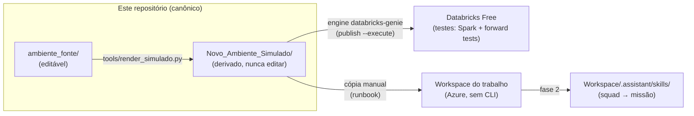
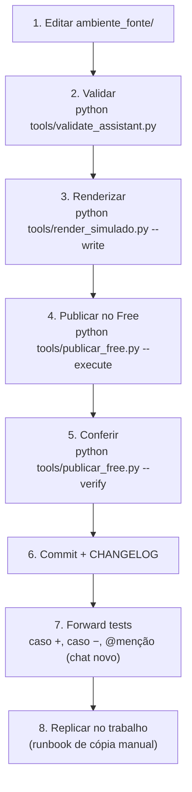

# Ambiente_Databricks

> Laboratório de engenharia do ecossistema `.assistant` (Agent Skills, instruções e
> extensões) do **Databricks Genie Code**, com governança multi-IA, validação
> automatizada e trilha de publicação do ambiente pessoal até a squad/missão.
>
> Primeira vez aqui? O [glossário](ambiente_fonte/.assistant/x_docs/glossario.md)
> explica os termos deste README, separando o que é oficial da Databricks, o que
> é vocabulário de modelagem e o que é convenção criada neste projeto.

## Por que este projeto existe

O ambiente de trabalho (Azure Databricks, CRM bancário, missão de modelos de ML) usa
um ecossistema de 12 Agent Skills pessoais + instruções + biblioteca Python. Este
repositório é a **fonte única de verdade** desse ecossistema: aqui ele é editado,
validado, testado no Databricks Free Edition e só então replicado para o trabalho.



## Mapa do repositório

| Pasta | Papel | Editável? |
|---|---|---|
| `CLAUDE.md` · `AGENTS.md` · `GEMINI.md` | Entrada canônica + adaptadores multi-IA | sim |
| `.claude/` | Centro de IA: regras, contexto, skills operacionais, templates | sim |
| `ambiente_fonte/` | **O produto**: `.assistant_instructions.md` + `.assistant/` implantável | sim |
| `Novo_Ambiente_Simulado/` | Espelho da árvore do workspace, gerado por script | **não** (derivado) |
| `tools/` | Validação e render (chamados pelas skills da `.claude/`) | sim |
| `docs/decisions/` | ADRs — decisões arquiteturais numeradas | append-only |
| `docs/auditoria/` | Auditorias multi-LLM (`<data>_<tema>/`) | append-only |
| `docs/handoffs/` | Contexto de passagem entre IAs/sessões | append-only |
| `docs/playbooks/` | Procedimentos repetíveis (ciclo de vida, replicação) | sim |
| `Ajustes_Codex/` | Entrega congelada da auditoria do Codex (2026-08-13) | **não** (referência) |
| `Ambiente_Antigo/` | Export original do trabalho — **local-only, git-ignored** (ADR-0003) | **não** (referência) |
| `CHANGELOG.md` | Registro de toda mudança relevante, com IA autora | append-only |

## O que a Genie Code lê (nativo) vs. o que é extensão (`x_`)

O Genie Code auto-descobre apenas as estruturas nativas. Tudo que não é nativo usa o
prefixo `x_` e precisa de ação manual (`@`/Add context, import ou execução):

| Item | Auto-descoberto? | Como usar |
|---|---:|---|
| `.assistant/skills/<skill>/SKILL.md` | **Sim** | relevância automática ou `@nome-da-skill` |
| `/Users/<username>/.assistant_instructions.md` | **Sim** | instruções pessoais (≤ 20.000 chars) |
| `Workspace/.assistant_workspace_instructions.md` | **Sim** | admins; fase squad |
| `AGENTS.md` / `CLAUDE.md` no workspace | **Sim** | descoberta hierárquica ao abrir arquivo |
| `x_prompts/`, `x_projects/`, `x_docs/`, `x_config/` | Não | adicionar com `@`/Add context |
| `x_snippets/`, `x_scripts/` | Não | importar/executar explicitamente |

> Exceção oficial: instruções não se aplicam a **Quick Fix** e **Autocomplete**.

## Primeira hora no projeto

Quem chega agora não precisa entender o repositório inteiro para ser útil. Este
percurso leva do zero até uma alteração publicada e conferida.

**1. Entenda a ideia central (5 min).** Existe uma pasta editável — `ambiente_fonte/` —
e todo o resto é derivado dela por script ou é cópia publicada. Você nunca edita
o workspace do Databricks diretamente; edita aqui e publica. Isso evita a
situação clássica de duas versões divergentes sem saber qual vale.

**2. Veja o produto (10 min).** Abra [ambiente_fonte/.assistant/README.md](ambiente_fonte/.assistant/README.md).
É o guia do ecossistema que vai para o Databricks: 12 skills, instruções pessoais
e as extensões. Se algum termo travar a leitura, o [glossário](ambiente_fonte/.assistant/x_docs/glossario.md)
resolve.

**3. Rode a validação (2 min).** Sem alterar nada, execute
`python tools/validate_assistant.py`. A saída está reproduzida abaixo. Este
comando é a rede de segurança: ele reprova link quebrado, frontmatter inválido e
identificador corporativo antes que virem commit.

**4. Faça uma alteração pequena (15 min).** Corrija uma frase em qualquer README
dentro de `ambiente_fonte/`. Depois rode, em ordem: validar → renderizar →
publicar → conferir. Os quatro comandos estão logo abaixo com o retorno esperado.

**5. Veja o resultado no Databricks (5 min).** Abra o workspace Free, navegue até
`/Users/<seu-usuario>/.assistant/` e encontre a frase alterada. Esse é o ciclo
completo: o que está aqui é o que está lá.

Ao final você sabe editar, validar, publicar e conferir — que é tudo o que a
operação do dia a dia exige. Replicar no workspace do trabalho é assunto do
[runbook](docs/playbooks/replicacao-trabalho.md) e só acontece depois dos gates.

## Ciclo de vida de uma mudança



## Comandos e o que esperar de cada um

As saídas abaixo foram capturadas de execuções reais, não redigidas à mão. Se o
seu retorno divergir, a diferença é o diagnóstico.

**Validar a fonte** — roda em segundos, não toca em nada:

```powershell
python tools/validate_assistant.py
```

```text
raiz analisada     : <repo>\ambiente_fonte
skills             : 12
markdown / links   : 102 arquivos / 79 links relativos
python (AST)       : 61 arquivos
instrucoes         : 7371/20000 caracteres

APROVADO: 0 falha(s), 0 aviso(s)
```

Qualquer linha `FAIL` bloqueia o resto do ciclo. `WARN` de tamanho de skill é
aviso de dívida, não impedimento.

**Renderizar o simulado** — sem `--write` mostra apenas o plano:

```powershell
python tools/render_simulado.py
```

```text
fonte  : <repo>\ambiente_fonte
destino: <repo>\Novo_Ambiente_Simulado\Users\<seu-usuario>
  copy file .assistant_instructions.md -> ...\.assistant_instructions.md
  copy dir  .assistant -> ...\.assistant

DRY-RUN: nada foi escrito. Use --write para executar.
```

**Publicar e conferir** — a publicação relata o que enviou; a conferência
verifica o que existe. São coisas diferentes, e por isso a segunda não é opcional:

```powershell
python tools/publicar_free.py --execute
python tools/publicar_free.py --verify
```

```text
== VERIFY (read-only) ==
esperados : 165 arquivos
remotos   : 165 arquivos sob .assistant + instruções
ausentes  : 0 | obsoletos: 0
skills    : 12/12
extensões : 6/6 diretórios x_

APROVADO: 0 problema(s)
```

A linha `obsoletos` é a que costuma surpreender: a publicação sobrescreve
arquivos, mas nunca apaga os que saíram da fonte. Um arquivo removido daqui
continua ativo no workspace até alguém notar — e é essa conferência que nota.

## Governança multi-IA

- `CLAUDE.md` é canônico; `AGENTS.md` (Codex) e `GEMINI.md` são adaptadores finos.
- Toda IA registra o que fez no `CHANGELOG.md` com atribuição (`(Claude)`, `(Codex)`, …).
- Mudanças estruturais geram handoff em `docs/handoffs/`.
- Auditorias formais seguem o padrão multi-LLM do Verg_Alchemy_Hub
  (`docs/playbooks/auditoria-multillm.md` do Hub): níveis `A0`–`A3`, papéis por IA e
  pasta `docs/auditoria/<data>_<tema>/` com rodadas individuais + consenso.

## Status e roadmap

| Fase | Entrega | Status |
|---|---|---|
| 0 | Bootstrap: git + canônicos + `.claude/` | ✅ concluída |
| 1 | `ambiente_fonte/` + bateria de validação local | ✅ concluída |
| 2 | Render do `Novo_Ambiente_Simulado/` | ✅ concluída |
| 3 | Publicação no Free + gates do Codex: Spark serverless (64/64) e forward tests (36/36) | ✅ concluída¹ |
| 4 | Matriz Free vs. trabalho + [runbook de replicação](docs/playbooks/replicacao-trabalho.md) | ✅ pronta para execução |
| 5 | Camada squad (`Workspace/.assistant/skills/`) + revisão dos prompts | ⏳ |

Gates herdados da auditoria do Codex, todos verificados no Databricks Free:

| Gate | Resultado |
|---|---|
| Testes Spark no runtime real | ✅ **64 PASS / 0 FAIL** — [detalhes](docs/testes/spark/README.md) (revelou e corrigiu 3 defeitos de runtime) |
| Forward tests das 12 skills (positivo, negativo, `@menção`) | ✅ **36/36 PASS** — [detalhes](docs/testes/forward/README.md) (sem alterar nenhuma `description`) |
| Dependências opcionais fixadas e testadas | ⏳ por projeto consumidor (7 módulos ML) |

¹ Fase 3 concluída no essencial. Itens abertos: fixação das dependências
opcionais por workflow e a troca do `import-dir` manual pelo fluxo governado do
engine `databricks-genie` do Hub (skill `publicar-free`, ADR-0002).

## Perguntas frequentes

**Preciso saber Databricks para contribuir?**
Para editar documentação e skills, não — o conteúdo é Markdown e o ciclo são
quatro comandos. Para mexer na biblioteca Python (`x_snippets`, `x_scripts`) sim,
porque o código roda em Spark e as armadilhas são de lá.

**Por que existem duas pastas com o mesmo conteúdo?**
`ambiente_fonte/` é o que você edita; `Novo_Ambiente_Simulado/` é o espelho
gerado por script, com a árvore exata que o workspace espera. A separação existe
para que a cópia para o trabalho seja mecânica: você copia a subárvore pronta,
sem decidir nada na hora. Editar o simulado à mão não adianta — o próximo render
apaga.

**O que acontece se eu editar direto no workspace do Databricks?**
A alteração vive até a próxima publicação e depois desaparece, sem aviso. O
workspace é cópia operacional, nunca a fonte. Se algo precisar mudar, muda aqui.

**Alterei uma skill e o Genie Code continua com o comportamento antigo.**
Skills não recarregam em chat já aberto. Abra um chat novo; se persistir,
recarregue a página, porque o metadata fica em cache.

**Como sei qual skill vai ser acionada?**
O Genie Code escolhe lendo apenas o campo `description` de cada skill. Para forçar
uma específica, use `@nome-da-skill`. As 36 combinações testadas estão em
[docs/testes/forward/](docs/testes/forward/README.md).

**Posso usar dados reais do trabalho no ambiente Free?**
Não, em nenhuma hipótese. O Free é laboratório e recebe apenas dados sintéticos.
Identificador corporativo também não entra no repositório — há verificação
automática que reprova, inclusive em nome de pasta.

**O que são as pastas com prefixo `x_`?**
Extensões criadas aqui, que o Genie Code **não** carrega sozinho. Precisam de
`@`/Add context, import ou execução explícita. O prefixo existe justamente para
que ninguém as confunda com estrutura nativa da plataforma.

**Encontrei um erro no código de um helper. Onde corrijo?**
Em `ambiente_fonte/.assistant/x_snippets/` ou `x_scripts/`, nunca no workspace.
Depois rode o ciclo e, se o helper tiver lógica de Spark, verifique no runtime —
o teste em `docs/testes/spark/` mostra como.

## Fontes oficiais

- [Agent Skills na Genie Code](https://learn.microsoft.com/en-us/azure/databricks/genie-code/skills)
- [Instruções customizadas](https://learn.microsoft.com/en-us/azure/databricks/genie-code/instructions)
- [Dicas para Genie Code](https://learn.microsoft.com/en-us/azure/databricks/genie-code/tips)
- [MCP na Genie Code](https://learn.microsoft.com/en-us/azure/databricks/genie-code/mcp)
- [Declarative Automation Bundles](https://learn.microsoft.com/en-us/azure/databricks/dev-tools/bundles/)
- [Agent Skills specification](https://agentskills.io/specification)

Nomes e limites da plataforma evoluem; a regra `.claude/rules/genie-code-oficial.md`
define como manter este repositório na vanguarda sem afirmar recurso inexistente.
