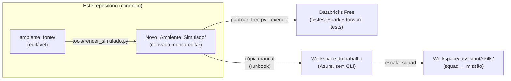
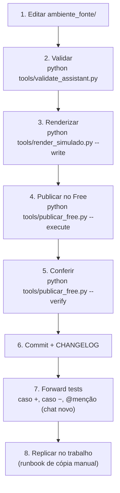
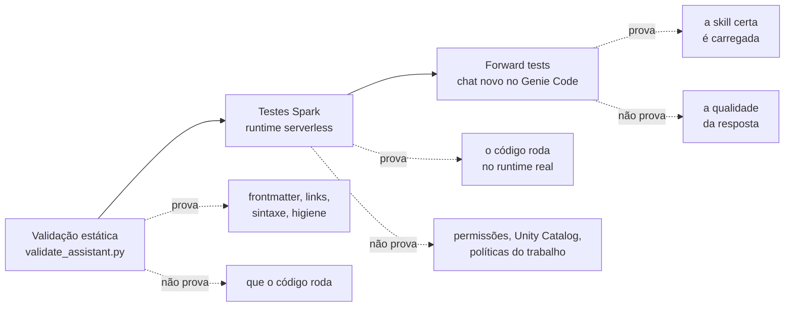

# Ambiente_Databricks

> Laboratório de engenharia do ecossistema `.assistant` (Agent Skills, instruções e
> extensões) do **Databricks Genie Code**, com governança multi-IA, validação
> automatizada e trilha de publicação do ambiente pessoal até a squad/missão.
>
> Primeira vez aqui? O [glossário](ambiente_fonte/.assistant/x_docs/glossario.md)
> explica os termos deste README, separando o que é oficial da Databricks, o que
> é vocabulário de modelagem e o que é convenção criada neste projeto.

## Por que este projeto existe

O ambiente de trabalho (Azure Databricks, CRM bancário, missão de modelos de ML) usa
um ecossistema de Agent Skills pessoais, instruções e biblioteca Python. Este
repositório é a **fonte única de verdade** desse ecossistema: aqui ele é editado,
validado, testado no Databricks Free Edition e só então replicado para o trabalho.



## Mapa do repositório

| Pasta | Papel | Editável? |
|---|---|---|
| `CLAUDE.md` · `AGENTS.md` · `GEMINI.md` | Entrada canônica + adaptadores multi-IA | sim |
| `.claude/` | Centro de IA: regras, contexto, skills operacionais, templates | sim |
| `ambiente_fonte/` | **O produto**: `.assistant_instructions.md` + `.assistant/` implantável | sim |
| `Novo_Ambiente_Simulado/` | Espelho da árvore do workspace, gerado por script | **não** (derivado) |
| `tools/` | Validação e render (chamados pelas skills da `.claude/`) | sim |
| `docs/decisions/` | ADRs — decisões arquiteturais numeradas | append-only |
| `docs/auditoria/` | Auditorias multi-LLM (`<data>_<tema>/`) | append-only |
| `docs/handoffs/` | Contexto de passagem entre IAs/sessões | append-only |
| `docs/playbooks/` | Procedimentos repetíveis (ciclo de vida, replicação) | sim |
| `docs/testes/` | Evidência dos gates: Spark serverless e forward tests | append-only |
| `Ajustes_Codex/` | Entrega congelada da auditoria do Codex (2026-08-13) | **não** (referência) |
| `Ambiente_Antigo/` | Export original do trabalho — **local-only, git-ignored** (ADR-0003) | **não** (referência) |
| `CHANGELOG.md` | Registro de toda mudança relevante, com IA autora | append-only |

## O que o Genie Code lê (nativo) vs. o que é extensão (`x_`)

O Genie Code auto-descobre apenas as estruturas nativas. Tudo que não é nativo usa o
prefixo `x_` e precisa de ação manual (`@`/Add context, import ou execução):

| Item | Auto-descoberto? | Como usar |
|---|---:|---|
| `.assistant/skills/<skill>/SKILL.md` | **Sim** | relevância automática ou `@nome-da-skill` |
| `/Users/<username>/.assistant_instructions.md` | **Sim** | instruções pessoais (≤ 20.000 chars) |
| `Workspace/.assistant_workspace_instructions.md` | **Sim** | admins; fase squad |
| `AGENTS.md` / `CLAUDE.md` no workspace | **Sim** | descoberta hierárquica ao abrir arquivo |
| `x_prompts/`, `x_docs/` | Não | adicionar com `@`/Add context |
| `x_projects/` | Não | **copiar** `AGENTS_TEMPLATE.md` como `AGENTS.md` na raiz do projeto real — arquivo que fique nesta pasta nunca é descoberto |
| `x_snippets/`, `x_scripts/` | Não | importar/executar explicitamente |
| `x_config/` | Não | resíduo legado, não se anexa a nada ([por quê](ambiente_fonte/.assistant/x_config/README.md)) |

> Exceção oficial: instruções não se aplicam a **Quick Fix** e **Autocomplete**.

## Por onde começar, conforme o que você veio fazer

Nem todo mundo que abre este repositório precisa dele. Escolha a linha que
descreve você:

| Você quer | Comece por | Precisa instalar algo? |
|---|---|---|
| **Usar** o ambiente para analisar dados no Databricks | [Como invocar as skills](ambiente_fonte/.assistant/README.md#como-invocar-as-skills) — as skills já estão publicadas no workspace | não |
| **Contribuir**: alterar uma skill, um helper ou a documentação | as duas seções abaixo | sim, Python e a CLI |
| **Assumir** o projeto ou entender por que ele é assim | [ADRs](docs/decisions/README.md) e [evidência dos gates](docs/testes/) | não |

O restante desta página é escrito para quem contribui.

## Antes de começar

Os passos 1 a 3 do percurso abaixo funcionam **sem instalar nada além de
Python** — são leitura e validação local. Os passos 4 e 5 publicam no Databricks
e exigem preparo:

| Precisa | Para quê | Como confirmar |
|---|---|---|
| Python 3.12 ou superior | rodar as ferramentas locais | `python --version` |
| Repositório clonado | ter os arquivos | `git clone <url do repo>` |
| Conta no Databricks Free | ter onde publicar | criar em databricks.com/learn/free-edition |
| CLI do Databricks **v0.200+** | publicar e conferir | `databricks --version` |
| CLI autenticada | publicar e conferir | `databricks current-user me` deve devolver seu e-mail |

Instalar e autenticar a CLI:

```powershell
winget install Databricks.DatabricksCLI
databricks auth login --host <url do seu workspace Free>
```

> **Não instale pelo `pip`.** O pacote `databricks-cli` do PyPI é a CLI legada,
> parada na 0.18, e a própria Databricks recomenda não usá-la. Ela não tem
> `auth login` nem `current-user`, e em Windows deixa um `databricks.exe` no PATH
> que pode sombrear o binário correto. Em Linux/macOS, use o instalador oficial:
> `curl -fsSL https://raw.githubusercontent.com/databricks/setup-cli/main/install.sh | sh`.

Confirme os dois na ordem: `databricks --version` deve mostrar `v0.200` ou
superior, e só então `databricks current-user me` deve devolver seu e-mail. Se o
primeiro falhar, a CLI está errada; se só o segundo falhar, é autenticação. Sem
isso, os passos 4 e 5 falham com mensagem que não aponta a causa.

> No workspace do **trabalho** não há CLI, e isso é esperado: lá a instalação é
> manual, pelo [runbook de replicação](docs/playbooks/replicacao-trabalho.md).
> O pré-requisito acima vale para o laboratório.

## Primeira hora no projeto

Quem chega agora não precisa entender o repositório inteiro para ser útil. Este
percurso leva do zero até uma alteração publicada e conferida.

**1. Entenda a ideia central (5 min).** Existe uma pasta editável — `ambiente_fonte/` —
e todo o resto é derivado dela por script ou é cópia publicada. Você nunca edita
o workspace do Databricks diretamente; edita aqui e publica. Isso evita a
situação clássica de duas versões divergentes sem saber qual vale.

**2. Veja o produto (10 min).** Abra [ambiente_fonte/.assistant/README.md](ambiente_fonte/.assistant/README.md).
É o guia do ecossistema que vai para o Databricks: as skills, as instruções
pessoais e as extensões. Se algum termo travar a leitura, o [glossário](ambiente_fonte/.assistant/x_docs/glossario.md)
resolve.

**3. Rode a validação (2 min).** Sem alterar nada, execute
`python tools/validate_assistant.py`. A saída está reproduzida abaixo. Este
comando é a rede de segurança: reprova link relativo quebrado, frontmatter
inválido e identificador corporativo. Rode-o **antes de cada commit** — não há
hook de git nem CI neste repositório, então a rede só existe quando alguém a
aciona.

**4. Faça uma alteração pequena (15 min).** Corrija uma frase em qualquer README
dentro de `ambiente_fonte/`. Depois rode, em ordem, os quatro comandos abaixo:

```powershell
python tools/validate_assistant.py
python tools/render_simulado.py --write
python tools/publicar_free.py --execute
python tools/publicar_free.py --verify
```

O `--write` do segundo comando não é opcional aqui. Sem ele o render apenas
mostra o plano, a publicação envia o espelho antigo, e a conferência devolve
`APROVADO` — porque ela compara o workspace com o espelho, não com a sua
alteração. A seção seguinte mostra o retorno esperado de cada um.

**5. Veja o resultado no Databricks (5 min).** Abra o workspace Free, navegue até
`/Users/<seu-usuario>/.assistant/` e encontre a frase alterada. Esse é o ciclo
completo: o que está aqui é o que está lá.

Ao final você sabe editar, validar, publicar e conferir — que é tudo o que a
operação do dia a dia exige. Replicar no workspace do trabalho é assunto do
[runbook](docs/playbooks/replicacao-trabalho.md) e só acontece depois dos gates.

## Ciclo de vida de uma mudança



## Comandos e o que esperar de cada um

As saídas abaixo vêm de execução real, com o nome de usuário substituído por
placeholder. **As linhas de contagem mudam conforme o repositório cresce** — não
tente casá-las com o seu retorno. O que importa em cada bloco é a última linha,
`APROVADO` ou `OK`.

**Validar a fonte** — roda em segundos, não toca em nada:

```powershell
python tools/validate_assistant.py
```

```text
raiz analisada     : <repo>\ambiente_fonte
skills             : 12
markdown / links   : 103 arquivos / 109 links relativos
python (AST)       : 70 arquivos
instrucoes         : 7088/20000 caracteres
repo (corporativo) : 409 arquivos varridos no repositório inteiro
repo (links)       : 156 links fora da raiz analisada

APROVADO: 0 falha(s), 0 aviso(s)
```

Qualquer linha `FAIL` bloqueia o resto do ciclo. `WARN` de tamanho de skill é
aviso de dívida, não impedimento.

As duas últimas linhas são as únicas que valem conferir de olho: elas contam o
que os checks de repositório inteiro alcançaram. Se qualquer uma vier **zero**,
a proteção correspondente não rodou — e desde a correção de 15/08/2026 isso
reprova a execução em vez de passar em silêncio.

**Renderizar o simulado** — `--write` é o que efetivamente escreve; sem ele o
comando só imprime o plano:

```powershell
python tools/render_simulado.py --write
```

```text
fonte  : <repo>\ambiente_fonte
destino: <repo>\Novo_Ambiente_Simulado\Users\<seu-usuario>
  copy file .assistant_instructions.md -> ...\.assistant_instructions.md
  copy dir  .assistant -> ...\.assistant

OK: 176 arquivos renderizados em Novo_Ambiente_Simulado/
```

O total inclui o marcador `README_GERADO.md` na raiz do simulado, que não vai
para o workspace — por isso a conferência adiante espera um arquivo a menos.

**Publicar e conferir** — a publicação relata o que enviou; a conferência
verifica o que existe. São coisas diferentes, e por isso a segunda não é opcional:

```powershell
python tools/publicar_free.py --execute
python tools/publicar_free.py --verify
```

```text
usuário: <seu-usuario>

== VERIFY (read-only) ==
esperados : 175 arquivos
remotos   : 176 arquivos sob .assistant + instruções
ausentes  : 0 | obsoletos: 0
plataforma: 1 arquivo(s) gerenciado(s) — .assistant/.mcp_servers.json
skills    : 12/12
extensões : 6/6 diretórios x_

APROVADO: 0 problema(s)
```

A linha `obsoletos` é a que costuma surpreender: a publicação sobrescreve
arquivos e diretórios, mas nunca apaga os que saíram da fonte. Um arquivo
removido daqui continua ativo no workspace até alguém notar — e é essa
conferência que nota.

A linha `plataforma` existe porque o Databricks também escreve dentro de
`.assistant/`: abrir o painel de MCP em **Genie Code → Settings** cria
`.assistant/.mcp_servers.json` com os conectores internos. Esse arquivo não vem
da fonte e **não deve ser apagado** — a conferência o separa dos obsoletos em
vez de mandar removê-lo.

## Perguntas frequentes

**Preciso saber Databricks para contribuir?**
Para editar documentação e skills, não — o conteúdo é Markdown e o ciclo são
quatro comandos. Para mexer na biblioteca Python (`x_snippets`, `x_scripts`) sim,
porque o código roda em Spark e as armadilhas são de lá.

**Por que existem duas pastas com o mesmo conteúdo?**
`ambiente_fonte/` é o que você edita; `Novo_Ambiente_Simulado/` é o espelho
gerado por script, com a árvore exata que o workspace espera. A explicação
completa, com diagrama, está em [ambiente_fonte/README.md](ambiente_fonte/README.md),
que é o dono desse assunto.

**O que acontece se eu editar direto no workspace do Databricks?**
A alteração vive até a próxima publicação e depois desaparece, sem aviso. O
workspace é cópia operacional, nunca a fonte. Se algo precisar mudar, muda aqui.

**Alterei uma skill e o Genie Code continua com o comportamento antigo.**
Skills não recarregam em chat já aberto. Abra um chat novo; se persistir,
recarregue a página, porque o metadata fica em cache.

**Como sei qual skill vai ser acionada?**
O Genie Code escolhe lendo apenas o campo `description` de cada skill. Para forçar
uma específica, use `@nome-da-skill`. As 36 combinações testadas estão em
[docs/testes/forward/](docs/testes/forward/README.md).

**Posso usar dados reais do trabalho no ambiente Free?**
Não, em nenhuma hipótese. O Free é laboratório e recebe apenas dados sintéticos.

Identificador corporativo também não entra no repositório, e a validação reprova
se entrar — o `validate_assistant.py` varre todo o repositório em conteúdo **e**
em nome de pasta, porque é assim que o vazamento aconteceria: renderizando o
simulado com o username do trabalho. Note que o username pessoal do laboratório
aparece no caminho de `Novo_Ambiente_Simulado/`; isso é estado aceito, e só o
padrão corporativo é bloqueado (ADR-0003).

O que exatamente é bloqueado importa, porque a lista não é genérica: hoje ela
cobre matrícula no formato letra seguida de seis a oito dígitos, domínios e
e-mails corporativos conhecidos e o domínio governamental brasileiro. A lista
literal vive na constante `CORPORATE_RE` de
[tools/validate_assistant.py](tools/validate_assistant.py) — e só lá, para não
envelhecer em dois lugares. **Antes de confiar no check em outra organização,
acrescente ali o formato de matrícula e o domínio de lá.** Padrão que não está
na constante passa sem alarme.

**O que são as pastas com prefixo `x_`?**
Extensões criadas aqui, que o Genie Code **não** carrega sozinho. Precisam de
`@`/Add context, import ou execução explícita. O prefixo existe justamente para
que ninguém as confunda com estrutura nativa da plataforma.

**Encontrei um erro no código de um helper. Onde corrijo?**
Em `ambiente_fonte/.assistant/x_snippets/` ou `x_scripts/`, nunca no workspace.
Depois rode o ciclo e, se o helper tiver lógica de Spark, verifique no runtime —
o teste em `docs/testes/spark/` mostra como.

## Governança multi-IA

- `CLAUDE.md` é canônico; `AGENTS.md` (Codex) e `GEMINI.md` são adaptadores finos.
- Toda IA registra o que fez no `CHANGELOG.md` com atribuição (`(Claude)`, `(Codex)`, …).
- Mudanças estruturais geram handoff em `docs/handoffs/`.
- Auditorias formais seguem o padrão multi-LLM do Verg_Alchemy_Hub
  (`../Verg_Alchemy_Hub/docs/playbooks/auditoria-multillm.md`, em outro
  repositório): níveis `A0`–`A3`, papéis por IA e pasta
  `docs/auditoria/<data>_<tema>/` com rodadas individuais e consenso.

## Status e roadmap

| Fase | Entrega | Status |
|---|---|---|
| 0 | Bootstrap: git + canônicos + `.claude/` | ✅ concluída |
| 1 | `ambiente_fonte/` + bateria de validação local | ✅ concluída |
| 2 | Render do `Novo_Ambiente_Simulado/` | ✅ concluída |
| 3 | Publicação no Free + gates do Codex: Spark serverless e forward tests | ✅ concluída¹ |
| 4 | Matriz Free vs. trabalho + [runbook de replicação](docs/playbooks/replicacao-trabalho.md) | ✅ pronta para execução |
| 5 | Camada squad (`Workspace/.assistant/skills/`) + revisão dos prompts | ⏳ |

Gates herdados da auditoria do Codex, todos verificados no Databricks Free:

| Gate | Resultado |
|---|---|
| Testes Spark no runtime real | ✅ **64 aprovações, 0 falhas** de 71 verificações — as 7 restantes são módulos com dependência opcional ausente, não falhas. [Detalhes](docs/testes/spark/README.md) |
| Forward tests das 12 skills (positivo, negativo, `@menção`) | ✅ **36/36 PASS** — [detalhes](docs/testes/forward/README.md) (sem alterar nenhuma `description`) |
| Dependências opcionais fixadas e testadas | ✅ **13 de 14 módulos** executados com as versões de [`requirements-optional.txt`](ambiente_fonte/.assistant/x_snippets/requirements-optional.txt); só `prophet_wrapper` segue sem combinação funcional |

Os três gates medem coisas diferentes, e nenhum substitui o outro:



O que nenhum dos três alcança é o ambiente do trabalho: compute conforme
política, dados reais e ACLs. Essa fronteira está na matriz de
[`.claude/rules/free-vs-trabalho.md`](.claude/rules/free-vs-trabalho.md) e é o
que o [runbook de replicação](docs/playbooks/replicacao-trabalho.md) cobre.

¹ Fase 3 concluída. A publicação usa `tools/publicar_free.py`, decisão registrada
no [ADR-0005](docs/decisions/ADR-0005-publicacao-propria-no-free.md) — o engine
do Hub foi descartado porque publica `.py` como notebook, o que quebraria os
imports da biblioteca.

## Fontes oficiais

- [Agent Skills no Genie Code](https://learn.microsoft.com/en-us/azure/databricks/genie-code/skills)
- [Instruções customizadas](https://learn.microsoft.com/en-us/azure/databricks/genie-code/instructions)
- [Dicas para Genie Code](https://learn.microsoft.com/en-us/azure/databricks/genie-code/tips)
- [MCP no Genie Code](https://learn.microsoft.com/en-us/azure/databricks/genie-code/mcp)
- [Declarative Automation Bundles](https://learn.microsoft.com/en-us/azure/databricks/dev-tools/bundles/)
- [Agent Skills specification](https://agentskills.io/specification)

Nomes e limites da plataforma evoluem; a regra `.claude/rules/genie-code-oficial.md`
define como manter este repositório na vanguarda sem afirmar recurso inexistente.
