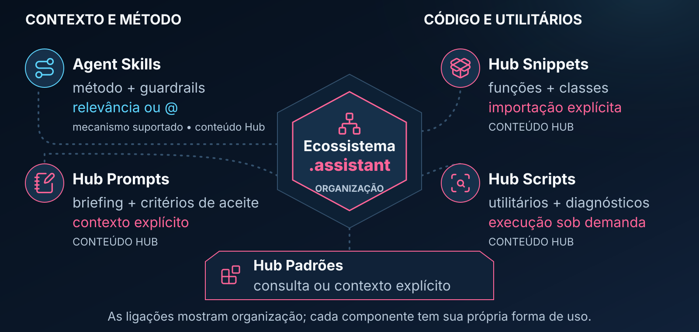
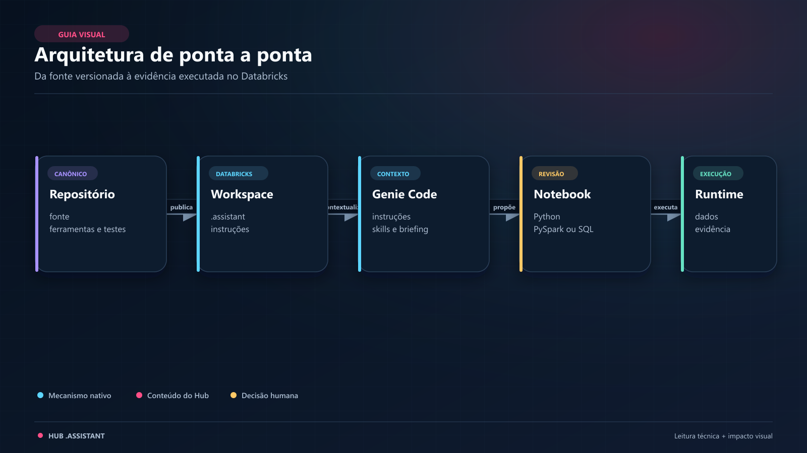
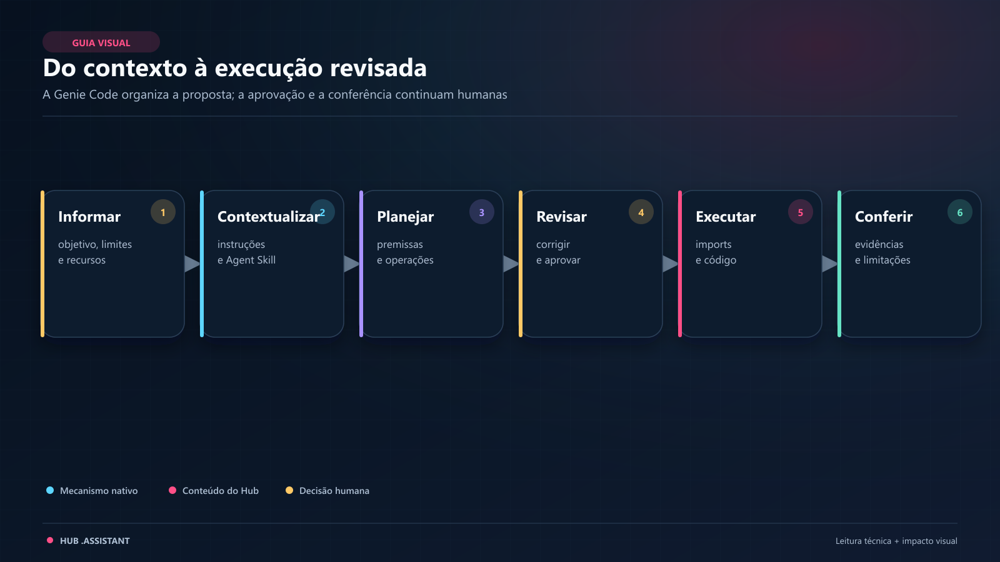
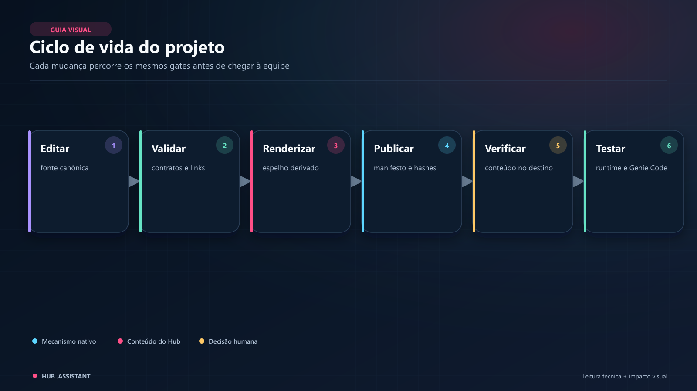

# Ecossistema/Hub `.assistant` para Databricks Genie Code voltado para Machine Learning

O Ambiente Databricks reúne métodos, bibliotecas Python, briefings e contratos para o trabalho analítico com Machine Learning e CRM. Ajuda cientistas de dados a escolher recursos, explicitar decisões sobre dados e tempo, reutilizar implementações e revisar entregas com a Genie Code.

Este repositório mantém o produto e as ferramentas que o validam e distribuem. O guia de quem usa o Hub no Databricks fica em [`ambiente_fonte/.assistant/README.md`](ambiente_fonte/.assistant/README.md); esta página apresenta a arquitetura, as rotas de entrada e o trabalho de manutenção.

> **Procedência.** Agent Skills e instruções usam mecanismos da Genie Code. As pastas `hub_*` e o conteúdo das skills `hub-ml-*` são implementações deste projeto. Sua presença no workspace não concede acesso, executa código ou homologa uma análise.

## 🧭 Por onde começar

| Quero… | Próxima ação |
|---|---|
| usar o Hub já disponível no Databricks | abrir o [guia de primeiro uso](ambiente_fonte/.assistant/README.md) e o README do recurso escolhido |
| descobrir qual recurso resolve minha tarefa | consultar o [Concierge](ambiente_fonte/.assistant/skills/hub-ml-concierge/README.md), entrada opcional de descoberta e composição |
| importar uma função no notebook | seguir o [bootstrap do Manual Técnico](MANUAL_TECNICO.md#bootstrap), conferir dependências e usar o exemplo do objeto |
| orientar uma análise com a Genie Code | escolher uma [skill do produto](ambiente_fonte/.assistant/skills/README.md) e preencher um [briefing](ambiente_fonte/.assistant/hub_prompts/README.md) |
| criar ou alterar um recurso | ler os [padrões do Hub](ambiente_fonte/.assistant/hub_padroes/README.md) e o [contrato de manutenção](AGENTS.md) |
| trabalhar no repositório com uma IA | começar pelas [rotas de manutenção](docs/ai/README.md), que indicam regras, procedimentos e ferramentas |
| preparar instalação ou atualização | seguir o [runbook de replicação](docs/playbooks/replicacao-trabalho.md); destino, acesso e efeitos precisam de autorização própria |
| avaliar qualidade ou investigar regressão | consultar [testes e evidências](docs/testes/README.md) e [classes de defeito protegidas](docs/auditoria/README.md#classes-de-defeito-que-viraram-guardas) |

Para uma primeira conversa, depois de confirmar que a skill está disponível, descreva a necessidade e o limite da tarefa. Por exemplo:

```text
@hub-ml-concierge
Quero comparar a maturação de safras com dados sintéticos.
Localize os recursos do Hub que ajudam nessa tarefa e explique os requisitos.
Antes de propor código, confirme evento, denominador, datas e janela comparável.
Nesta etapa, quero somente orientação, sem executar a análise.
```

O [Manual Técnico](MANUAL_TECNICO.md) é a referência de fundamentos, APIs, Python/Spark, catálogo integrado de helpers e glossário. No uso cotidiano, o README junto ao recurso explica adequação, entradas, saídas, custo, efeitos e limites antes da implementação ou do notebook de exemplo.

<a id="o-que-tem-neste-ambiente-e-como-ele-ajuda-na-rotina-de-trabalho"></a>

## 🌟 O que é este ecossistema



Projetos de Machine Learning em Big Data repetem decisões sobre grão, instante de decisão, janelas temporais, leakage, amostragem, métricas, visualização e monitoramento. O Hub organiza métodos e recursos para tratar essas decisões de forma consistente, mantendo revisão humana e critérios independentes de aceite.

| Família | Papel e forma de uso |
|---|---|
| [Agent Skills](ambiente_fonte/.assistant/skills/README.md) | orientam método, perguntas, riscos, recursos e formato da entrega; seleção conforme a superfície da Genie Code |
| [Hub Snippets](ambiente_fonte/.assistant/hub_snippets/README.md) | funções e classes Python reutilizáveis; importação e chamada explícitas no notebook |
| [Hub Scripts](ambiente_fonte/.assistant/hub_scripts/README.md) | utilitários de diagnóstico, transformação e governança técnica; execução explícita conforme o contrato local |
| [Hub Prompts](ambiente_fonte/.assistant/hub_prompts/README.md) | briefings que a pessoa preenche e fornece como contexto da tarefa |
| [Hub Padrões](ambiente_fonte/.assistant/hub_padroes/README.md) | moldes para criar e manter objetos, documentação, contratos e exemplos |

O [Hub Micromodelos](ambiente_fonte/.assistant/hub_micromodelos/README.md) combina essas famílias numa área de domínio: especificação por contrato, execução reutilizável e exemplos sintéticos. O [exemplo de recência de contato](ambiente_fonte/.assistant/hub_micromodelos/exemplos/recencia_contato/README.md) apresenta uma rota concreta. A skill permanece `L1/audit`; executar um exemplo não promove policy nem publica um modelo.

`hub_readmes_visual_assets/` contém diagramas, cabeçalhos e suas licenças. É infraestrutura editorial; não constitui outra família analítica nem fornece contexto automaticamente.

## 🎨 Sistema de Temas

O Hub oferece configuração validada de aparência, aplicação em consumidores compatíveis, Visual Lab, autoria de propostas no App e projeção controlada para AI/BI. `ResolvedTheme` é a fonte de verdade; temas são opt-in e não alteram cálculo, amostragem ou critérios de decisão. SHAP/Matplotlib e Kaplan–Meier mantêm limites próprios.

Comece pelo [guia operacional de temas](ambiente_fonte/.assistant/hub_padroes/identidade_visual/GUIA_OPERACIONAL.md). Os [estados e evidências de Temas](docs/sprints/sistema_temas/README.md) distinguem o que foi integrado dos testes de ambiente, pendências de acessibilidade e operações bloqueadas. Salvar uma proposta, importar um tema, aprovar e publicar são ações separadas.

<a id="arquitetura-completa-do-ecossistema"></a>

## 🏛️ Arquitetura e responsabilidade



Há dois caminhos de uso: instruções, skills e recursos fornecidos orientam a conversa; bibliotecas importadas explicitamente entram no runtime. O notebook pode usar helpers sem passar pela Genie Code. A existência de `.assistant/` no workspace não inclui essa pasta automaticamente no `sys.path` nem instala suas dependências.

O produto editável está em `ambiente_fonte/`: a instrução `.assistant_instructions.md` e a pasta `.assistant/`, com código, skills, guias e recursos. A documentação de manutenção e as ferramentas do Git têm uma responsabilidade separada e não acompanham o pacote de uso.

## 🔄 Como o contexto chega à Genie Code



1. Descreva objetivo, dados, restrições e entrega; forneça os recursos necessários e selecione uma skill quando apropriado.
2. As instruções aplicáveis e a skill orientam o trabalho conforme a superfície e as permissões disponíveis. Briefings e padrões entram como contexto explícito.
3. Helpers continuam exigindo importação e execução explícitas no notebook, com dependências e compute compatíveis.
4. Revise código, plano de acesso aos dados, custo, resultados e operações persistentes antes de aceitar a entrega.

Não há leitura automática única de toda a pasta `.assistant`. A [policy vigente](ambiente_fonte/.assistant/hub_padroes/skill_enforcement/policy.json) define os níveis e as superfícies protegidas do projeto; ela não concede ACL, ferramenta, credencial ou permissão de execução. A disponibilidade dos mecanismos de contexto deve ser conferida na [referência da plataforma](docs/ai/references/databricks-genie-code.md) e no ambiente usado.

## 🧭 Como evitar duas fontes de verdade

| Camada | Responsabilidade | Onde trabalhar |
|---|---|---|
| `ambiente_fonte/` | fonte canônica do produto | editar somente aqui o conteúdo distribuído |
| `.artifacts/simulado/` | espelho local da árvore de workspace | gerar por ferramenta; não versionar nem editar à mão |
| `tools/` e `.github/workflows/` | validação, regressões, geração, pacotes e CI | seguir o [guia de ferramentas](tools/README.md) |
| `AGENTS.md`, `docs/ai/` e `.agents/skills/` | contrato e procedimentos do mantenedor | escolher a [rota da tarefa](docs/ai/README.md) |
| `docs/` | decisões, operação, evidências e história | consultar o [índice de governança](docs/README.md) e o documento responsável |
| workspaces Free e trabalho | cópias operacionais do produto | publicar ou replicar sob autorização; verificar o destino separadamente |

`MANUAL_TECNICO.md` na raiz é uma cópia de leitura do [Manual canônico do produto](ambiente_fonte/.assistant/MANUAL_TECNICO.md); as cópias devem permanecer idênticas. `Novo_Ambiente_Simulado/` aparece em registros históricos, mas a saída vigente é `.artifacts/simulado/`. A quarentena local `Ambiente_Antigo/` permanece read-only e fora de versionamento e distribuição.

Na manutenção assistida por IA, [AGENTS.md](AGENTS.md) reúne invariantes e encaminha a leitura por tarefa. As [skills do mantenedor](.agents/skills/README.md) orientam validação, render, publicação, testes de roteamento e replicação; são distintas das skills `hub-ml-*` do produto. Adaptadores e links não criam carregamento universal: a [matriz de compatibilidade](docs/ai/compatibility.md) separa documentação de comportamento observado. Para tarefas delimitadas, use o [recorte explícito de contexto](docs/ai/task-context.md), preservando a rota de expansão e os limites de compartilhamento.

## 🛠️ Começar a manutenção local

Use um checkout Git com **histórico completo**, necessário para os controles de rastreabilidade e preservação. Escolha um ambiente Python isolado e prepare Node/pnpm conforme o [perfil de CI](.github/workflows/ci.yml) e o [package.json visual](tools/readme_visuals/package.json). As versões e dependências pertencem a esses arquivos e ao lockfile; os perfis com Spark, widgets ou App têm requisitos próprios.

No ambiente de manutenção escolhido, a preparação de dependências é explícita e altera esse ambiente:

```sh
python -m pip install -r tools/requirements-dev.txt -r tools/requirements-temas-dev.txt
pnpm --dir tools/readme_visuals install --frozen-lockfile
```

Com as dependências disponíveis, execute da raiz do checkout:

```sh
# Inspeção e validação locais; nenhum destes comandos publica no Databricks
git status --short
git rev-parse HEAD
python tools/validate_assistant.py --conferir-readme
python tools/render_simulado.py
python tools/ci_local.py --help
```

O renderer sem flag mostra o plano, sem escrever. Para preparar um checkout novo para os testes, **inventarie o destino, preserve extras e confirme que toda a árvore gerida pode ser substituída**. Prefira clone isolado. Só então:

```sh
python tools/render_simulado.py --write
python tools/render_simulado.py --check
python tools/ci_local.py --verbose
```

`--write` remove e recria `.artifacts/simulado/`; `--check` confere paths, bytes e tipos da saída ignorada pelo Git. O agregado roda sem credenciais Databricks e não instala dependências por conta própria. Dependência ausente é bloqueio, não aprovação. A lista corrente de etapas vem de `ci_local.py --help`; um teste isolado não aprova o conjunto. Procedimentos e escopo: [ferramentas](tools/README.md) e [saída gerada/CI por ambiente](docs/manutencao/saida-gerada.md).

<a id="ciclo-de-vida-do-projeto"></a>

## Ciclo de contribuição



A figura preserva a visão histórica dos gates. A ordem operacional e as condições atuais estão no [playbook de ciclo de vida](docs/playbooks/ciclo-de-vida.md):

1. Confirme escopo, branch/SHA, estado da worktree e mudanças alheias.
2. Edite o arquivo canônico e execute as verificações proporcionais à mudança.
3. Gere e confira o derivado em destino autorizado; revise o diff e a evidência após a integração.
4. Registre comando, ambiente, SHA, resultado e limites na evidência da tarefa. O [changelog](CHANGELOG.md) recebe marcos relevantes, conforme o [critério editorial](docs/ai/templates/changelog-entry.md).
5. Trate publicação, testes no destino e promoção como operações separadas, com autorização e evidência próprias.

Mudanças de arquitetura seguem o [processo de decisões](docs/decisions/README.md). Novos snippets, scripts e prompts precisam de README, contrato e exemplo junto ao recurso; a [regra de documentação](docs/ai/rules/documentacao.md) explica a hierarquia sem duplicar o Manual.

## 📦 Distribuição, dados e acesso

O [pacote de implantação](tools/README.md#pacotes-de-auditoria-e-implantação) leva o produto sanitizado e um manifesto de arquivos/hashes. Este README raiz, as instruções de manutenção, ferramentas e evidências do Git não são instalados como contexto de uso. Gerar um ZIP não publica, ativa skills ou altera permissões.

- **Free:** laboratório apenas com dados sintéticos, sem PII, segredos ou identificadores corporativos. A [publicação](.agents/skills/publicar-free/SKILL.md) confere host, perfil e identidade; plano remoto exige CLI autenticada. Verificar inventário/tipos e verificar conteúdo são provas distintas.
- **Trabalho:** dados reais ficam no ambiente corporativo autorizado, sob Unity Catalog, políticas de PII, ACLs e governança local. A [replicação manual](docs/playbooks/replicacao-trabalho.md) exige manifesto, backup, staging, preservação de conteúdo alheio e aceite no destino.
- **Segurança:** instruções e contratos nunca substituem autorização. Não versionar credenciais, dados reais nem backups corporativos. Preserve arquivos não geridos e as licenças/proveniência dos recursos distribuídos.

## 🔎 Qualidade e estado verificável

As verificações locais cobrem estrutura, contratos, links, higiene, integridade de fonte/derivado e regressões de implementação. A manutenção de IA acrescenta [guardas de entradas, rastreabilidade e geração](docs/ai/README.md#guardas-locais-de-manutenção); o CI confere as receitas e ambientes declarados. Nenhuma dessas provas, sozinha, certifica clareza editorial, resultado analítico, seleção de skill, ACLs ou runtime Databricks.

Consulte o documento responsável pela pergunta, preservando o SHA e o alcance de cada resultado:

| Pergunta | Estado e evidência |
|---|---|
| O que foi testado no código, no runtime e na interface? | [Testes por canal](docs/testes/README.md) |
| Quais níveis de execução estão vigentes? | [Policy](ambiente_fonte/.assistant/hub_padroes/skill_enforcement/policy.json) e [enforcement/rollout](docs/sprints/skill_enforcement_rollout/README.md) |
| Quais limites permanecem em Temas e Micromodelos? | [Temas](docs/sprints/sistema_temas/README.md) e [Micromodelos](docs/sprints/micromodelos/README.md) |
| Qual perfil de CI cobre esta alteração? | [CI por ambiente e evidência por SHA](docs/manutencao/saida-gerada.md#ci-por-ambiente) |
| Um certificador antigo serve para a árvore atual? | [Certificadores congelados e rotas atuais](docs/manutencao/certificadores-congelados.md) |

MM01 v1 e SER pré-promoção preservam contratos históricos; sua existência não aprova o HEAD atual. O diagnóstico MM01 informa compatibilidade dos inputs e mantém a certificação como não executada. Não recalcular pins, apagar testes ou reclassificar uma falha para produzir aprovação.

### Estado verificável do gate local

O snapshot abaixo pertence somente ao validador local. `python tools/validate_assistant.py --conferir-readme` reexecuta o comando e compara suas contagens com este bloco. O caminho está parametrizado; a cobertura de estrutura não é aceite editorial nem homologação de destino.

<details>
<summary>Ver saída de referência conferida pelo gate</summary>

```text
raiz analisada     : <checkout>/ambiente_fonte
skills             : 15 · 15/15 com as 5 seções estruturais
skill enforcement  : 14/14 contratos válidos · 0 issue(s) de policy
prompts            : 18 · 174 campos com guia e contrato humano
helpers citados    : 101 caminhos verificados
markdown / links   : 293 arquivos / 14059 links relativos
notebooks / links  : 84 notebooks / 108 links relativos
readmes de objeto  : 79/79 operacionais; 3/3 exemplares; 0 pendentes (estrutura, não aceite editorial)
pastas de objeto   : 63 conferidas (nome, arquivos, __init__)
forma da pasta     : 61 conferidas (o módulo tem o nome da pasta)
contrato de dados  : 63 pares (saída: o que o notebook consome)
contrato de entrada: 61 pares (entrada: o que o notebook passa)
saída colada       : 83 notebooks com bloco real, 0 sem
idioma da docstring: 63 módulos, 0 com docstring em inglês
normas do molde    : 78 arquivos, 0 violação(ões)
notebook exercita  : 61 objetos, 0 notebook(s) que só importam
python (AST)       : 289 arquivos
instrucoes         : 12624/20000 caracteres
repo (identidade)  : 1762 arquivos varridos no repositório editável/derivado
repo (links)       : 1897 links fora da raiz analisada
worktree (extras)  : 0 arquivos locais examinados, fora da contagem versionada

APROVADO: 0 falha(s), 0 aviso(s)
```

</details>

## ❓ Perguntas frequentes

**Preciso usar a Genie Code para chamar um helper?** Não. Siga o README do objeto, confira a raiz de importação e as dependências e chame a API explicitamente no notebook.

**Clonar o repositório já instala o Hub no Databricks?** Não. O clone prepara a fonte de manutenção. Instalação, publicação, verificação remota e aceite seguem seus próprios procedimentos.

**Os testes locais substituem os testes de destino?** Não. Spark local, testes conversacionais, permissões reais, acessibilidade e aceite humano têm ambientes e critérios próprios. Um resultado do Free não certifica o trabalho.

**O Hub elimina leakage ou erros analíticos?** Não. Ele explicita contratos e verificações; ainda é preciso revisar entidade, instante de decisão, disponibilidade dos dados, janelas e interpretação do resultado.

**Onde proponho um novo recurso?** Comece pelos [padrões do Hub](ambiente_fonte/.assistant/hub_padroes/README.md) e pela skill `@hub-ml-criar-objeto`, respeitando o escopo aprovado e os contratos da superfície.

## 🔗 Continuidade e histórico

Use o [índice de documentação](docs/README.md) para navegar por decisões, auditorias, testes, playbooks e handoffs. Os [marcos do projeto](CHANGELOG.md), o [histórico integral preservado](docs/historico/changelog/README.md) e o [índice de sprints](docs/sprints/README.md) mantêm a evolução rastreável. Relatos datados conservam o resultado daquela execução; o estado atual pertence aos documentos responsáveis indicados acima.

<details>
<summary>Marco preservado de continuidade do Sistema de Temas</summary>

Em setembro de 2026, o plano V14 foi integrado pela PR #70; S0 pela PR #71, no commit `e89ef4f79d9f9b7c901f1bbf490259ee5ce3d493`; e S1 pela PR #72 (`79f53ba1`). Essas integrações não preenchem os slots `BLOCKED`, não encerram `A11-01 = FAIL` nem decidem go-live. O estado e as evidências atuais permanecem no documento de Temas indicado nesta página.

</details>
