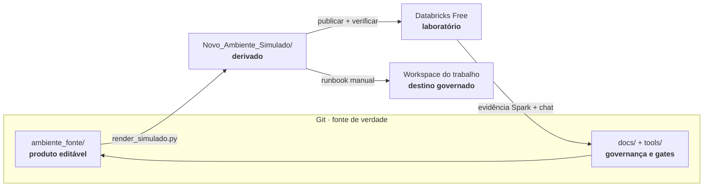
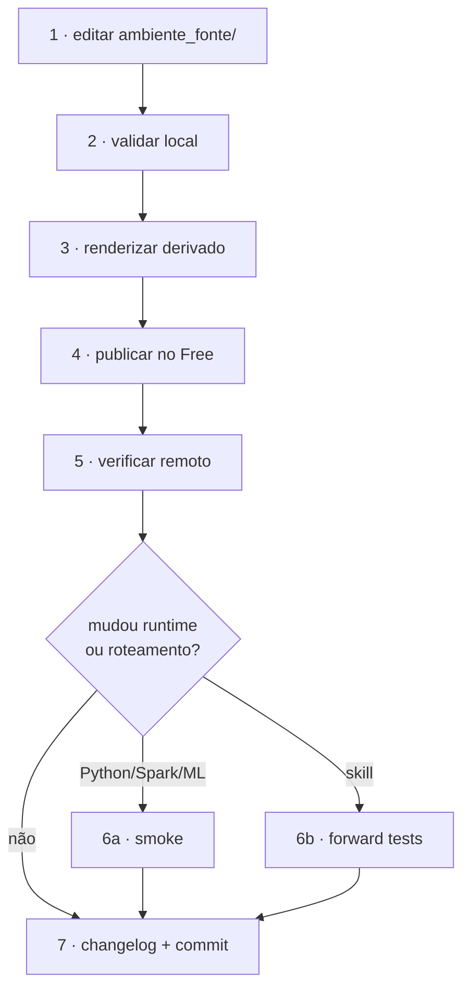
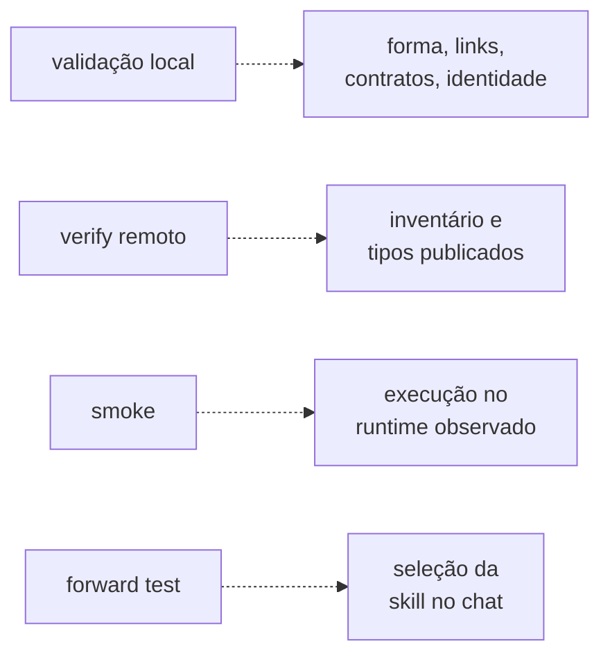

# Ambiente Databricks — engenharia do ecossistema Genie Code

Fonte versionada de um ambiente `.assistant` para Databricks Genie Code:
instruções, Agent Skills, prompts guiados, helpers Python, validação, publicação
e evidência de runtime.

> **Para usar o ambiente no Databricks:** vá ao
> [guia do produto](ambiente_fonte/.assistant/README.md).
>
> **Para manter, auditar ou replicar:** continue neste README.

## Escolha sua rota

| Quero… | Comece por |
|---|---|
| usar uma skill, prompt ou helper | [Guia do `.assistant`](ambiente_fonte/.assistant/README.md) |
| alterar o produto | [Ciclo de contribuição](#ciclo-de-contribuição) |
| entender uma decisão ou evidência | [Índice de documentação](docs/README.md) |
| publicar no Free | [Playbook de ciclo de vida](docs/playbooks/ciclo-de-vida.md) |
| replicar para o trabalho | [Runbook de replicação](docs/playbooks/replicacao-trabalho.md) |
| revisar o estado dos gates | [Estado comprovado](#estado-comprovado) |

## Arquitetura em um minuto



| Camada | Regra |
|---|---|
| `ambiente_fonte/` | única cópia editável do produto |
| `Novo_Ambiente_Simulado/` | derivado; nunca editar à mão |
| Free | laboratório com dados sintéticos; não é fonte |
| trabalho | recebe somente pacote aprovado; precisa de novos checks locais |
| `docs/` | decisões, testes e histórico; não é publicado |
| `tools/` | automação do repositório; não é publicada |

Essa separação impede duas fontes concorrentes e mantém usuário, host, dado real
e identidade corporativa fora do conteúdo ativo.

## Nativo da Databricks × customizado pelo Hub

O prefixo `hub_`/`hub-` sinaliza autoria local. Ele não significa que tudo seja
manual: as skills `hub-ml-*` usam a estrutura nativa de Agent Skills.

| Componente | Mecanismo | Uso |
|---|---|---|
| `.assistant_instructions.md` | nativo | instruções pessoais |
| `Workspace/.assistant_workspace_instructions.md` | nativo | instruções do workspace |
| `AGENTS.md` / `CLAUDE.md` | nativo | contexto hierárquico do projeto |
| `.assistant/skills/<nome>/SKILL.md` | nativo | relevância pelo pedido/`description` ou `@nome` |
| conteúdo `hub-ml-*` | customizado | métodos de dados e ML dentro de Agent Skills |
| `hub_prompts/` | customizado e manual | anexar ou copiar briefing |
| `hub_snippets/` / `hub_scripts/` | customizado e manual | importar/executar Python |
| `hub_padroes/` | customizado e manual | templates e exemplos |

As instruções não se aplicam a Quick Fix e Autocomplete. Skills podem conter ou
referenciar recursos e scripts; neste pacote, os helpers Python externos à skill
continuam exigindo import explícito.

## Estado comprovado

Última consolidação operacional: **29/08/2026**.

| Gate | Estado | Evidência |
|---|---|---|
| validação local | ✅ aprovado | fonte, links, contratos, Python e higiene |
| render | ✅ aprovado | espelho regenerado a partir da fonte |
| publicação Free | ✅ aprovado após este redesenho | [316 esperados, 0 ausentes e 0 obsoletos](docs/testes/2026-08-29_etapa-6-redesenho-documental.md) |
| smoke Spark 4.2.0 | ✅ 145 verificações: 136 PASS, 0 FAIL, 8 opcionais ausentes e 1 bloqueio esperado | [JSON](docs/testes/spark/resultados/2026-08-29_smoke_a2.json) |
| roteamento das 12 skills originais | ✅ 36/36 | [forward tests](docs/testes/forward/README.md) |
| `hub-ml-criar-objeto` | ⏳ 0/3 | cota do Genie Code impediu a rodada |
| respostas das 16 famílias de prompts | ⏳ pendente | contrato estático aprovado; teste conversacional bloqueado por cota |
| replicação no trabalho | ⛔ não executada | depende dos gates conversacionais e do runbook no destino |

A síntese das etapas 1 a 5, incluindo run e task do smoke, está em
[`2026-08-29_execucao-etapas-1-a-5.md`](docs/testes/2026-08-29_execucao-etapas-1-a-5.md).
A publicação do redesenho e o pacote de 316 arquivos estão na
[evidência da etapa 6](docs/testes/2026-08-29_etapa-6-redesenho-documental.md).

`OPTIONAL_MISSING` não é falha do helper: indica biblioteca opcional ausente.
`BLOQUEADO_ESPERADO` é um limite de plataforma previamente documentado e
reprova se mudar silenciosamente.

## Ciclo de contribuição

### Pré-requisitos

- Python 3.12+ para as ferramentas locais;
- Databricks CLI 0.205+ instalada por canal oficial;
- perfil autenticado para o workspace Free;
- dados exclusivamente sintéticos no laboratório.

No Windows:

```powershell
winget install Databricks.DatabricksCLI
databricks --version
databricks auth login --host <url-do-workspace-free>
databricks current-user me
```

Não instale o pacote legado `databricks-cli` do PyPI.

### Uma mudança, do começo ao fim



Comandos essenciais:

```powershell
python tools/validate_assistant.py
python tools/render_simulado.py --write
python tools/publicar_free.py --execute --profile <free> --expected-host <url-free>
python tools/publicar_free.py --verify  --profile <free> --expected-host <url-free>
```

O `--write` é obrigatório para atualizar o derivado. O `--verify` é obrigatório
porque a publicação sobrescreve, mas não remove arquivo obsoleto.

Antes de commitar uma mudança que altere contagens ou o README raiz:

```powershell
python tools/validate_assistant.py --conferir-readme
```

Esse modo reexecuta a validação e a conferência remota e compara as linhas
rotuladas com a saída de referência ao final deste documento.

## Mapa do repositório

| Entrada | Papel | Política |
|---|---|---|
| [`CLAUDE.md`](CLAUDE.md) | instrução canônica para agentes | editável |
| `AGENTS.md` / `GEMINI.md` | adaptadores para outros agentes | manter finos |
| [`ambiente_fonte/`](ambiente_fonte/README.md) | produto implantável | editável |
| `Novo_Ambiente_Simulado/` | espelho gerado | não editar |
| [`tools/`](tools/README.md) | gates e automação | editável |
| [`docs/`](docs/README.md) | governança e evidência | respeitar natureza de cada coleção |
| [`.claude/`](.claude/CLAUDE.md) | regras, skills operacionais e templates | editável |
| `Ajustes_Codex/` | entrega congelada de referência | não editar |
| `Ambiente_Antigo/` | quarentena local e ignorada | não versionar/expor |
| [`PLANO_HUB.md`](PLANO_HUB.md) | plano e registro das sprints | histórico de execução |
| [`CHANGELOG.md`](CHANGELOG.md) | mudanças relevantes e autoria | append-only por data |

## O que cada gate prova



| Gate | Fronteira |
|---|---|
| validação local | não prova execução Spark |
| verify remoto | não prova correção funcional |
| smoke no Free | não prova runtime, ACLs ou políticas do trabalho |
| forward test | não prova qualidade da resposta |
| auditoria por leitura | não substitui execução |

Por isso “passou aqui” sempre precisa declarar **onde**, **quando** e **qual
propriedade** foi medida.

## Segurança e replicação

- Nunca use dado real do trabalho no Free.
- Nunca versione token, e-mail, host, matrícula ou caminho corporativo.
- Use o ZIP sanitizado de implantação; o histórico Git anterior contém caminhos
  antigos e não deve ser clonado para o ambiente corporativo sem reescrita
  coordenada.
- Preserve arquivos gerenciados pela plataforma, como o
  `.assistant/.mcp_servers.json` observado no workspace.
- Na replicação, substitua apenas o conteúdo pertencente ao Hub; não apague a
  pasta de skills inteira.
- Refaça smoke e checks de permissão no destino.

Detalhes: [runbook](docs/playbooks/replicacao-trabalho.md) e
[ADR-0009](docs/decisions/ADR-0009-identidade-e-pacote-de-implantacao.md).

## Governança multi-IA

- `CLAUDE.md` é canônico; adaptadores apenas traduzem a entrada.
- Preserve mudanças de outras pessoas/agentes; conflito exige reconciliação.
- Toda alteração relevante entra no `CHANGELOG.md` com autoria.
- Decisão estrutural pede ADR; evidência nova pede nova rodada datada.
- Auditoria multi-LLM usa rodadas independentes e contraditório; maioria não
  supera documentação oficial da plataforma.

Veja [auditorias](docs/auditoria/README.md),
[ADRs](docs/decisions/README.md) e [handoffs](docs/handoffs/README.md).

## Saídas de referência conferíveis

Estas linhas têm um único objetivo: permitir que
`validate_assistant.py --conferir-readme` detecte documentação local envelhecida.

As contagens de repositório usam o inventário Git, com higiene de extras locais
separada. A linha volátil `worktree (extras)` não é congelada neste README: ela
descreve arquivos locais e ignorados desta máquina, não o produto versionado.
Qualquer problema nesses extras continua reprovando; a contagem aparece na saída
ao vivo do validador. Para conferir o bloco remoto abaixo, use
`--conferir-readme-remoto` com acesso autenticado ao Free. Esse bloco preserva
a referência remota anterior até uma nova execução; não é certificação do novo código.
Os valores abaixo foram recapturados após o render e a republicação deste
redesenho.

```text
raiz analisada     : <repo>\ambiente_fonte
skills    : 13/13
prompts            : 16 · 161 campos com guia e contrato humano
helpers citados    : 81 caminhos verificados
markdown / links   : 107 arquivos / 190 links relativos
notebooks / links  : 78 notebooks / 17 links relativos
pastas de objeto   : 60 conferidas (nome, arquivos, __init__)
forma da pasta     : 58 conferidas (o módulo tem o nome da pasta)
contrato de dados  : 60 pares (saída: o que o notebook consome)
contrato de entrada: 57 pares (entrada: o que o notebook passa)
saída colada       : 77 notebooks com bloco real, 0 sem
idioma da docstring: 60 módulos, 0 com docstring em inglês
normas do molde    : 70 arquivos, 0 violação(ões)
notebook exercita  : 57 objetos, 0 notebook(s) que só importam
python (AST)       : 209 arquivos
instrucoes         : 8116/20000 caracteres
repo (identidade)  : 746 arquivos varridos no repositório editável/derivado
repo (links)       : 360 links fora da raiz analisada

APROVADO: 0 falha(s), 0 aviso(s)
```

```text
usuário: <seu-usuario>
profile: <profile-free>
host   : https://<workspace-free>

== VERIFY (read-only) ==
esperados : 316 arquivos
remotos   : 317 arquivos sob .assistant + instruções
ausentes  : 0 | obsoletos: 0
plataforma: 1 arquivo(s) gerenciado(s) — .assistant/.mcp_servers.json
skills             : 13 · 13/13 com as 5 seções estruturais
extensões : 4/4 diretórios hub_

APROVADO: 0 problema(s)
```

## Fontes oficiais

- [Genie Code](https://learn.microsoft.com/en-us/azure/databricks/genie-code/)
- [Agent Skills](https://learn.microsoft.com/en-us/azure/databricks/genie-code/skills)
- [Instruções customizadas](https://learn.microsoft.com/en-us/azure/databricks/genie-code/instructions)
- [Dicas de contexto e prompting](https://learn.microsoft.com/en-us/azure/databricks/genie-code/tips)
- [Uso e modo agente](https://learn.microsoft.com/en-us/azure/databricks/genie-code/use-genie-code)
- [Databricks CLI](https://learn.microsoft.com/en-us/azure/databricks/dev-tools/cli/install)
- [Declarative Automation Bundles](https://learn.microsoft.com/en-us/azure/databricks/dev-tools/bundles/)
- [Especificação Agent Skills](https://agentskills.io/specification)

Nomes, limites e superfícies do Genie Code evoluem. Claims de plataforma devem
ser revistos contra documentação oficial antes de mudança estrutural ou
replicação.
