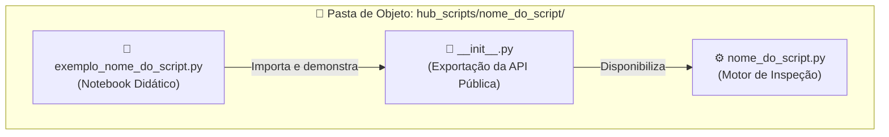
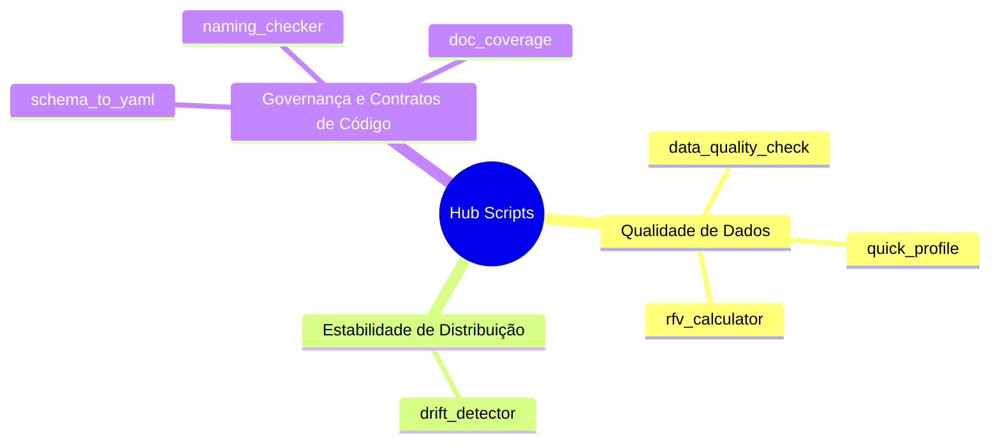
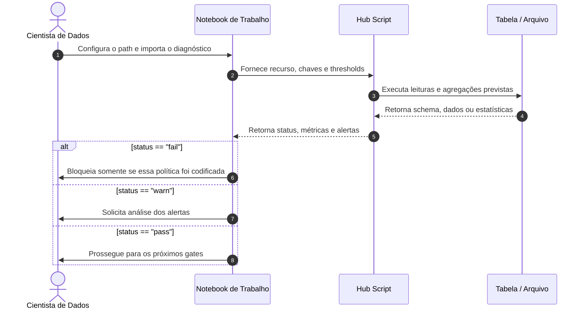
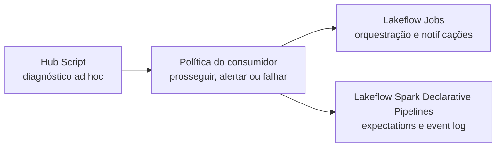

# Hub Scripts

> Utilitários e diagnósticos de integridade para inspecionar tabelas, schemas e notebooks antes de confiar na modelagem preditiva ou promover artefatos no Databricks.

> [!NOTE]
> **CONTEÚDO CUSTOMIZADO PELO HUB.** `hub_scripts` não é executado automaticamente pela Genie Code. Cada diagnóstico precisa ser importado e chamado por um notebook, tarefa ou pessoa, que também decide como tratar o resultado.

---

## 🔍 O que é um Script neste Ecossistema?

Em pipelines de dados modernos, o maior risco para um modelo de Machine Learning muitas vezes não é o algoritmo em si, mas a **qualidade e a confiabilidade do dado que o alimenta**.

Treinar um modelo sobre uma tabela com chaves duplicadas, variáveis defasadas ou distribuições corrompidas pode produzir conclusões frágeis e desperdício de processamento no cluster.

**No ecossistema `.assistant`, um Hub Script atua como um pórtico de controle de qualidade e inspeção técnica.**

Pense em um gateway antes de uma etapa analítica importante:

- Antes de usar uma base para treinar um modelo de crédito, churn ou séries temporais, você executa um diagnóstico compatível com o risco.
- O script responde a uma pergunta delimitada: unicidade da chave candidata, completude, atualidade, estabilidade, nomenclatura ou cobertura documental.
- O resultado é evidência para uma decisão; não é uma homologação automática da tabela ou do notebook.

```text
┌─────────────────────────────────────────────────────────────────────────────┐
│                            O PAPEL DE UM SCRIPT                             │
│                                                                             │
│   🛑 Diagnóstico Delimitado: responde uma pergunta técnica configurada      │
│   📋 Saída Estruturada: retorna métricas, status ou violações conferíveis   │
│   🛡️ Leitura por Padrão: não persiste alterações nos ativos inspecionados   │
│   ⚡ Validação Prévia: revela riscos antes de etapas de maior impacto        │
└─────────────────────────────────────────────────────────────────────────────┘
```

---

## 🏛️ Arquitetura e o Padrão "Pasta de Objeto"

Os scripts seguem o padrão de organização **Pasta de Objeto**. Cada diagnóstico mora em sua própria pasta:



O notebook `exemplo_<nome>.py` mostra uma chamada com dados controlados e a saída observada. Alguns exemplos simulam falhas; outros demonstram apenas o caminho principal. Por isso, o exemplo ensina o contrato exercitado, mas não substitui testes de volume, permissões ou runtime.

---

## 📚 Catálogo Detalhado

Os utilitários do Hub são organizados em três dimensões de qualidade do ciclo analítico:



---

### 🩺 1. Qualidade e Perfilamento de Dados (Data Health)

#### `data_quality_check` — Inspeção Sanitária Pré-Modelagem

- **O que faz:** avalia uma tabela por nome, calcula nulos em todas as colunas, verifica nulidade e unicidade das `pk_columns` e, quando `date_column` é informada, avalia atualidade.
- **O que retorna:** dicionário com `status: "pass"`, `"warn"` ou `"fail"`, métricas e uma lista de alertas estruturados como dicionários.
- **Quando usar:** ao receber uma tabela nova ou como diagnóstico anterior a uma etapa de treino. Os thresholds são política fornecida à chamada, não defaults oficiais da Databricks.

#### `quick_profile` — Raio-X de Schema e Distribuição

- **O que faz:** lê a tabela, calcula volume e nulos no conjunto completo e usa uma amostra configurada para cardinalidade e resumos adicionais.
- **O que retorna:** dicionário com metadados, métricas e informações de perfilamento.
- **Quando usar:** na primeira etapa de exploração, entendendo que contagem e nulos ainda podem exigir leitura completa da tabela.

#### `rfv_calculator` — Recência, Frequência e Valor

- **O que faz:** calcula atributos brutos de recência, frequência e valor por entidade e por períodos anteriores a uma data de corte.
- **O que retorna:** DataFrame Spark com as colunas RFV produzidas.
- **Quando usar:** antes de segmentações ou features comportamentais. O script não cria automaticamente quintis, personas nem política de negócio.

---

### 📉 2. Estabilidade e Monitoramento de Distribuição

#### `drift_detector` — Detecção de Desvios de Distribuição

- **O que faz:** recebe uma tabela, uma coluna de coorte, valores de referência e comparação e colunas numéricas; calcula PSI por variável com bins derivados da referência.
- **O que retorna:** dicionário com o PSI e a classificação configurada para cada variável.
- **Quando usar:** ao comparar duas coortes dentro da mesma tabela. PSI indica mudança de distribuição; não demonstra sozinho perda de performance ou causalidade.

---

### 📐 3. Governança, Contratos e Boas Práticas de Código

#### `schema_to_yaml` — Contratos de Dados em YAML

- **O que faz:** inspeciona uma tabela Spark e serializa nomes, tipos e nulabilidade. Estatísticas podem ser incluídas quando solicitadas.
- **O que retorna:** string YAML; na ausência de PyYAML, o fallback é JSON, que também é válido em YAML 1.2. O script não grava arquivo automaticamente.
- **Quando usar:** para preparar uma representação revisável do schema antes de versioná-la pelo mecanismo escolhido.

#### `naming_checker` — Guardião de Nomenclatura

- **O que faz:** recebe o nome de uma tabela, lê suas colunas e compara os nomes com a política configurada, incluindo regras como `snake_case` e prefixos.
- **O que retorna:** lista de violações encontradas.
- **Quando usar:** antes de promover ou compartilhar uma tabela. As convenções são regras do Hub ou da equipe, não exigências universais do Unity Catalog.

#### `doc_coverage` — Auditoria Estrutural de Documentação

- **O que faz:** lê um notebook Jupyter ou uma fonte Databricks exportada como arquivo e mede a proximidade entre blocos Markdown e código.
- **O que retorna:** dicionário heurístico com cobertura e blocos sem documentação adjacente.
- **Quando usar:** em revisão de código. O script não abre um notebook diretamente por URL do workspace, não mede docstrings e não avalia a qualidade semântica do texto.

---

## 🛠️ Passo a Passo Operacional: Como Usar um Script

Integrar um diagnóstico à rotina do Databricks segue um fluxo simples, mas deliberado:



### Exemplo Prático de Código

Se a raiz `.assistant` ainda não estiver no caminho do Python, configure-a antes do import:

```python
from pathlib import Path
import sys

assistant_root = Path("/Workspace/Users/<username>/.assistant")
if str(assistant_root) not in sys.path:
    sys.path.insert(0, str(assistant_root))
```

Em seguida, execute a checagem com a assinatura real:

```python
# 1. Importação explícita do diagnóstico
from hub_scripts.data_quality_check import data_quality_check

# 2. Execução apontando para uma tabela governada
resultado = data_quality_check(
    table_name="catalogo.credito.clientes_abril",
    pk_columns=["id_cliente"],
    date_column="dt_referencia",
    thresholds={
        "null_warn": 5.0,
        "null_fail": 20.0,
        "freshness_days": 2.0,
    },
)

# 3. Tratamento do veredito pelo notebook consumidor
print(f"Status do diagnóstico: {resultado['status'].upper()}")

for alerta in resultado["alerts"]:
    print(
        f"{alerta['severity'].upper()} · "
        f"{alerta['check']} · {alerta['message']}"
    )

if resultado["status"] == "fail":
    raise ValueError("A tabela violou as regras configuradas de qualidade.")
elif resultado["status"] == "warn":
    print("Há alertas que exigem análise antes de prosseguir.")
else:
    print("Nenhuma violação foi encontrada pelas regras executadas.")
```

O helper usa `pk_columns`; não existem os parâmetros `primary_keys` ou `critical_columns`. Um status `pass` significa apenas que as verificações configuradas não encontraram violações — não que a tabela inteira esteja homologada para qualquer finalidade.

---

## ⚙️ O que Acontece Durante a Execução?

| Script | Operação principal | Cuidado de custo ou efeito |
|---|---|---|
| `data_quality_check` | agregado completo + distinct da chave | scan e possível shuffle |
| `quick_profile` | volume/nulos completos + ações sobre amostra | tabela larga aumenta o custo |
| `drift_detector` | filtros, quantis, bins e agregações por coluna | custo cresce com variáveis e bins |
| `rfv_calculator` | filtros temporais, agregações e joins | custo cresce com períodos e entidades |
| `schema_to_yaml` | schema; agregados se houver estatísticas | persistência do texto é externa |
| `naming_checker` | leitura de schema | não inspeciona conteúdo das linhas |
| `doc_coverage` | leitura e parse de arquivo | não executa Spark |

Os scripts priorizam processamento distribuído quando trabalham com Spark, mas isso não significa custo desprezível. Contagens, distinct, quantis e `groupBy` podem exigir leitura ampla e shuffle.

---

## 🧭 Diagnóstico não é Enforcement

Um Hub Script descreve o que observou; a camada operacional decide o que fazer.



- Para regras executadas dentro de um pipeline declarativo, avalie **Lakeflow expectations**.
- Para histórico operacional, use o **event log** do pipeline.
- Para falhas de tarefa e notificações, configure **Lakeflow Jobs**.
- O script não envia alerta nem interrompe outro processo sozinho; o código consumidor precisa implementar essa decisão.

---

## ❓ Perguntas Frequentes (FAQ)

### 1. Se o script retornar `status="fail"`, meus dados serão apagados ou modificados?

**Não pelo script.** Os diagnósticos leem dados e retornam resultados; não executam `DELETE`, `DROP` ou sobrescrita. O notebook consumidor pode optar por falhar uma tarefa, mas isso é uma ação separada e explícita.

### 2. Os scripts funcionam com tabelas do Unity Catalog?

Os scripts que recebem tabelas usam a sessão Spark ativa. Prefira o formato de três níveis (`catalog.schema.table`) para eliminar ambiguidade. Formatos mais curtos dependem do catálogo e do schema ativos, e nenhum script contorna permissões.

### 3. Preciso rodar esses scripts pelo terminal ou dentro de um notebook?

Eles foram estruturados como módulos Python importáveis. Podem ser chamados em notebooks ou tarefas compatíveis, desde que o pacote esteja no `sys.path`, as dependências existam e uma `SparkSession` esteja disponível quando exigida.

### 4. Os scripts causam lentidão em tabelas volumosas?

**Podem causar.** Ações agregadas continuam lendo dados e operações como distinct, quantis, joins e `groupBy` podem gerar shuffle. Avalie plano, colunas, filtros, partições e frequência antes de automatizar.

### 5. Posso usar os scripts em pipelines automatizados?

**Sim, desde que a política seja explícita.** Uma tarefa pode chamar `data_quality_check` e decidir falhar em `fail`, revisar `warn` ou persistir métricas. O alerta, a interrupção e a recorrência devem ser configurados em Lakeflow Jobs ou no mecanismo de orquestração adotado.

### 6. A Genie Code executa estes scripts automaticamente?

**Não.** Skills podem sugerir um caminho de helper, mas importar e executar o módulo é uma ação explícita. `hub_scripts` é uma extensão do projeto, não uma capacidade nativa de descoberta da Genie Code.

---

## 🔗 Continue Explorando

- [Hub Snippets](README_snippets.md)
- [Agent Skills](README_skills.md)
- [Hub Prompts](README_prompts.md)
- [Catálogo de Helpers](../ambiente_fonte/.assistant/CATALOGO_HELPERS.md)
- [Lakeflow expectations](https://learn.microsoft.com/en-us/azure/databricks/ldp/expectations)
- [Event log de pipelines](https://learn.microsoft.com/en-us/azure/databricks/ldp/monitor-event-logs)
- [Notificações de Lakeflow Jobs](https://learn.microsoft.com/en-us/azure/databricks/jobs/notifications)
