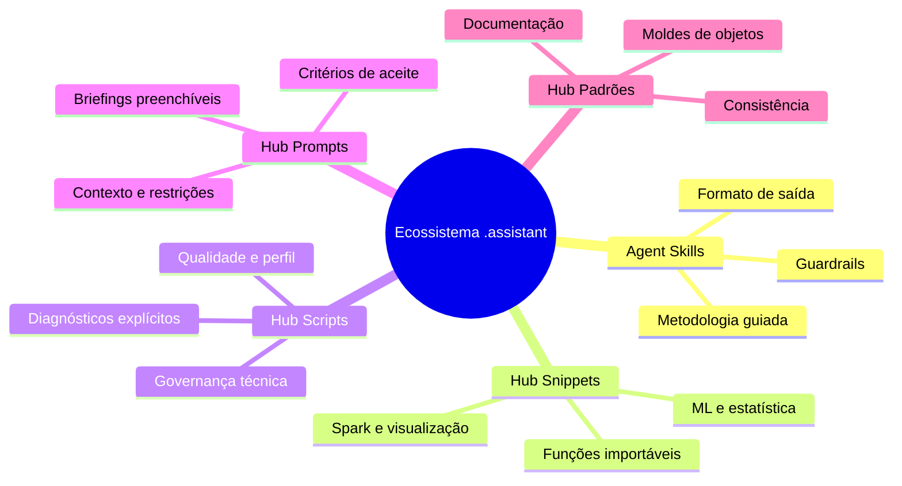
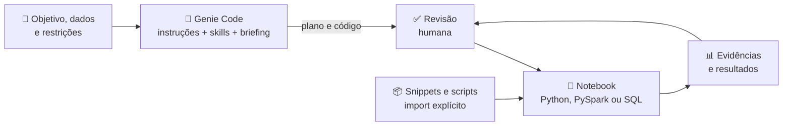
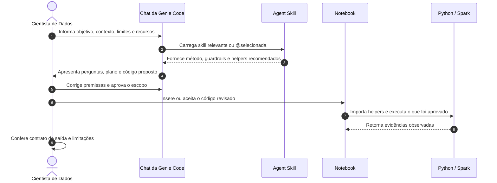
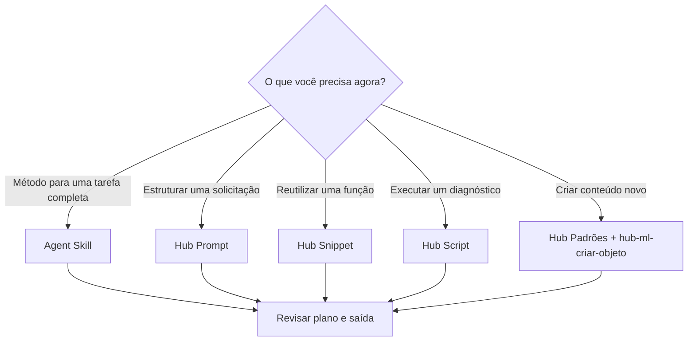

# Ecossistema/Hub `.assistant` para Databricks Genie Code voltado para Machine Learning

> Um ambiente integrado de instruções, habilidades, bibliotecas e briefings que ajuda a transformar a Genie Code em uma parceira contextualizada para a rotina analítica.

> **LEGENDA DE PROCEDÊNCIA.** Agent Skills e instruções são mecanismos nativos suportados pela Genie Code. Os componentes `hub_prompts`, `hub_snippets`, `hub_scripts`, `hub_padroes` e o conteúdo das skills `hub-ml-*` foram criados neste projeto e possuem ativação própria.

---

## 🧭 Mapa de Uso

> **Este documento acompanha a utilização do ecossistema:** escolha do componente, contexto fornecido à Genie Code, importação no notebook e revisão do resultado.

| Se você quer... | Continue em... |
|---|---|
| conhecer o propósito do Hub | [Visão Geral](#-o-que-é-este-ecossistema-e-como-ele-ajuda-no-databricks) |
| escolher entre skill, prompt, snippet e script | [Componentes](#-o-que-tem-neste-ambiente-e-como-ele-ajuda-na-rotina-de-trabalho) |
| entender o que é automático ou manual | [Arquitetura](#️-arquitetura-completa-do-ecossistema) |
| fornecer contexto corretamente | [Fluxo de Contexto](#-como-o-contexto-chega-ao-genie-code) |
| iniciar uma tarefa concreta | [Ponto de Partida](#-como-escolher-o-ponto-de-partida) |
| conferir runtime, dependências e segurança | [Compute e Segurança](#️-dependências-compute-e-segurança) |

---

<a id="-o-que-é-este-ecossistema-e-como-ele-ajuda-no-databricks"></a>

## 🌟 O que é este Ecossistema e como ele ajuda no Databricks?

Projetos de Machine Learning em Big Data combinam duas dificuldades: tomar decisões metodológicas corretas e implementar essas decisões de forma eficiente no runtime.

Na prática, isso envolve tarefas repetidas — investigar bases novas, criar atributos temporais, comparar safras, calcular métricas, documentar notebooks e monitorar modelos — enquanto se evita vazamento temporal, coleta indevida no driver e regras de negócio inventadas.

**O ecossistema `.assistant` reúne contexto e componentes reutilizáveis para organizar esse trabalho.**

- A Genie Code recebe instruções e metodologias por mecanismos nativos.
- O usuário pode partir de briefings detalhados em vez de uma pergunta ambígua.
- O notebook pode reutilizar funções e diagnósticos existentes em vez de reescrever lógica conhecida.
- A entrega termina com revisão humana, critérios de aceite e evidências.

```text
┌─────────────────────────────────────────────────────────────────────────────┐
│                           ROTINA DO CIENTISTA DE DADOS                      │
│                                                                             │
│   💬 Você descreve objetivo, dados, restrições e entrega                    │
│   🧠 A Skill organiza método, perguntas e guardrails                        │
│   📦 O Notebook importa helpers quando eles forem adequados                 │
│   🔎 Você revisa código, execução, resultados e limitações                  │
└─────────────────────────────────────────────────────────────────────────────┘
```

O Hub reduz improvisação e retrabalho, mas não torna a IA infalível. Permissões, aprovação, validação de negócio e testes continuam fazendo parte da análise.

---

<a id="-o-que-tem-neste-ambiente-e-como-ele-ajuda-na-rotina-de-trabalho"></a>

## 🧰 O que tem neste ambiente e como ele ajuda na rotina de trabalho?

O ecossistema é dividido em cinco componentes, cada um com uma responsabilidade e uma forma de uso:



### 🧠 1. Agent Skills (`skills/`)

- **O que são:** pacotes de instrução no padrão Agent Skills, com `SKILL.md` e recursos opcionais.
- **Como ajudam:** ensinam à Genie Code quando aplicar uma metodologia, quais perguntas fazer, quais riscos evitar e como organizar a entrega.
- **Como são ativadas:** por relevância da `description` ou por seleção explícita com `@nome-da-skill`.

Exemplo:

```text
@hub-ml-analise-safra

Quero comparar a maturação das safras da tabela anexada.
Antes de gerar código, confirme evento, denominador, coluna de originação,
data de observação, MOB máximo comparável e tratamento das safras incompletas.
```

[Conheça as 13 Agent Skills e seus templates](README_skills.md).

### 📦 2. Hub Snippets (`hub_snippets/`)

- **O que são:** funções e classes Python reutilizáveis organizadas por categoria e pasta de objeto.
- **Como ajudam:** oferecem implementações para operações temporais, métricas, Spark, apresentação, visualização e dados sintéticos.
- **Como são ativados:** não são carregados pela conversa. O notebook precisa tornar a biblioteca importável e executar a função.

```python
from pathlib import Path
import sys

assistant_root = Path("/Workspace/Users/<username>/.assistant")
if str(assistant_root) not in sys.path:
    sys.path.insert(0, str(assistant_root))

from hub_snippets.constants.format_br import fmt_brl, fmt_pct

print(fmt_brl(1250000.50))  # R$ 1.250.000,50
print(fmt_pct(0.154))       # 15,4%
```

A pasta `.assistant` não entra automaticamente no `sys.path` apenas por existir no workspace. Use a raiz real que contém `hub_snippets/`.

[Explore o catálogo narrativo de snippets](README_snippets.md).

### ⚡ 3. Hub Scripts (`hub_scripts/`)

- **O que são:** diagnósticos importáveis que respondem a uma pergunta operacional delimitada.
- **Como ajudam:** avaliam qualidade, perfil, drift, RFV, schema, nomenclatura ou cobertura documental.
- **Como são ativados:** importação e chamada explícitas; alertas e interrupção do fluxo são decisões do código consumidor.

```python
from hub_scripts.data_quality_check import data_quality_check

resultado = data_quality_check(
    table_name="catalogo.analytics.eventos",
    pk_columns=["event_id"],
    date_column="event_timestamp",
    thresholds={
        "null_warn": 5.0,
        "null_fail": 20.0,
        "freshness_days": 2.0,
    },
)

print(resultado["status"])  # pass, warn ou fail
```

[Entenda o comportamento e o custo dos scripts](README_scripts.md).

### 📝 4. Hub Prompts (`hub_prompts/`)

- **O que são:** formulários e briefings prontos para preencher.
- **Como ajudam:** estruturam objetivo, recursos, grão, tempo, regras, limites, entrega e critérios de aceite.
- **Como são ativados:** você abre o `.md`, substitui os campos e fornece o conteúdo no chat. A pasta não é descoberta automaticamente.

Quando uma informação for desconhecida, use `NÃO INFORMADO` e peça inspeção ou perguntas antes de qualquer suposição. Quando o item tiver sido avaliado e não se aplicar, use `NÃO APLICÁVEL`.

[Escolha e preencha um briefing](README_prompts.md).

### 📐 5. Hub Padrões (`hub_padroes/`)

- **O que são:** moldes arquiteturais e editoriais usados para criar objetos do Hub.
- **Como ajudam:** mantêm estrutura, API, exemplo, teste e documentação coerentes.
- **Como são ativados:** consulta manual ou contexto explícito. A skill `@hub-ml-criar-objeto` pode orientar sua aplicação.

Consulte o Hub Padrões em `.assistant/hub_padroes/README.md`.

---

<a id="️-arquitetura-completa-do-ecossistema"></a>

## 🏛️ Arquitetura Completa do Ecossistema

O diagrama mostra as duas rotas complementares do ecossistema: **contexto para a Genie Code** e **execução no runtime Python/Spark**.



> **Duas rotas, uma entrega:** instruções, skills e briefing orientam a conversa;
> snippets e scripts entram somente na execução do notebook. A revisão humana
> conecta as duas rotas.

### O que acontece automaticamente e o que depende de você

| Componente | Pode chegar automaticamente ao contexto? | Exige ação explícita? |
|---|---:|---:|
| instruções pessoais e de workspace | nas superfícies suportadas | configuração e manutenção |
| `AGENTS.md` / `CLAUDE.md` | por hierarquia do arquivo aberto | posicionamento correto no projeto |
| Agent Skill | por relevância | `@` quando quiser seleção explícita |
| Hub Prompt | não | preencher e fornecer |
| Hub Snippet | não | configurar path, importar e executar |
| Hub Script | não | configurar path, importar e executar |
| Hub Padrão | não | consultar ou anexar |

Instruções pessoais e de workspace não devem ser tratadas como aplicáveis a Quick Fix e Autocomplete. Recursos de interface e permissões podem variar conforme o workspace.

---

<a id="-como-o-contexto-chega-ao-genie-code"></a>

## 🔄 Como o Contexto chega ao Genie Code?

Muitos usuários se perguntam: *“Como a IA sabe quais regras e componentes utilizar?”*

O fluxo combina contexto automático suportado e contexto explícito fornecido pelo usuário:



### Explicação Passo a Passo

1. **Gatilho e intenção:** descreva o problema, a decisão esperada e o modo de trabalho — explicar, planejar, gerar código ou executar.
2. **Contexto explícito:** use `@` ou **Add Context** para anexar tabelas, arquivos, notebooks e outros recursos oferecidos pela interface. Quando aplicável, use contexto de célula, como `@cell`.
3. **Diretrizes e skill:** a Genie Code considera instruções aplicáveis e pode carregar uma skill pela relevância da descrição; `@hub-ml-*` explicita a escolha.
4. **Plano:** antes de executar, confira dados, grão, período, filtros, custo e operações persistentes.
5. **Código e helpers:** a skill pode recomendar módulos, mas o notebook precisa importá-los. Confirme a assinatura no código e no notebook de exemplo.
6. **Execução:** permissões e política de aprovação continuam valendo. Um prompt não amplia ACLs nem autorização de negócio.
7. **Validação:** diferencie código sugerido, código executado e resultado validado.

Uma conversa nova é útil quando objetivo, dados ou fase mudarem materialmente. Para refinar a mesma tarefa, o histórico validado pode ajudar. Skills recém-editadas devem ser testadas em uma nova conversa; se necessário, atualize a página.

---

<a id="-como-escolher-o-ponto-de-partida"></a>

## 🧭 Como Escolher o Ponto de Partida



### Exemplo: conhecer uma tabela nova

1. Anexe a tabela com identificador completo.
2. Preencha o briefing `eda_rapida`.
3. Selecione `@hub-ml-eda-profissional` se quiser explicitar a metodologia.
4. Peça primeiro um plano somente leitura.
5. Revise grão, chave, período, filtros e custo.
6. Só então aprove as consultas necessárias.

### Exemplo: validar um cruzamento

1. Declare o grão esperado de cada tabela.
2. Use o prompt `cross_eda` e a skill `@hub-ml-cross-eda-ml`.
3. Peça cobertura de chaves, cardinalidade, perda e fator de expansão.
4. Quando adequado, reutilize `hub_snippets.spark.join_diagnostics.diagnosticar_join`.
5. Confirme temporalidade antes de produzir a tabela final.

### Exemplo: acompanhar drift

1. Declare referência, período atual, colunas e política de interpretação.
2. Use `@hub-ml-monitoramento-modelo`.
3. Para PSI numérico em Spark, consulte `hub_snippets.spark.psi_calculator.calcular_psi`.
4. Para coortes de uma tabela, avalie `hub_scripts.drift_detector.drift_detector`.
5. Não converta um threshold heurístico isolado em decisão automática de retreino.

---

<a id="️-dependências-compute-e-segurança"></a>

## ⚙️ Dependências, Compute e Segurança

O Hub não elimina dependências de runtime. Alguns módulos usam PySpark; outros podem depender de pandas, NumPy, scikit-learn, Plotly, MLflow, SHAP, LightGBM ou pacotes específicos.

Antes de executar:

- confirme que o compute suporta as APIs usadas;
- verifique dependências opcionais e versões;
- em serverless, configure bibliotecas pelo **Environment** ou pelo ambiente do Git folder, conforme o fluxo adotado;
- avalie APIs que dependem de Spark Connect;
- nunca coloque tokens, senhas ou chaves em prompt, skill, notebook ou arquivo versionado;
- revise `CREATE`, `ALTER`, `DROP`, `DELETE`, `MERGE`, instalações e alterações de configuração;
- limite coleta no driver e inspeção visual conforme o volume.

Gerar código, editar o notebook, executar e aceitar o resultado são etapas diferentes. Mantenha a aprovação proporcional ao impacto.

---

## ❓ Perguntas Frequentes (FAQ)

### 1. O que acontece quando eu abro o chat da Genie Code com este ecossistema configurado?

As instruções aplicáveis podem orientar as superfícies suportadas, e uma Agent Skill pode ser selecionada por relevância ou `@`. Prompts, snippets, scripts e padrões não são carregados automaticamente apenas por estarem dentro de `.assistant`.

### 2. Preciso instalar biblioteca ou reiniciar o compute para usar snippets?

Depende do módulo e do ambiente. Primeiro torne a raiz que contém `hub_snippets/` visível ao Python. Depois confira as dependências opcionais. Uma instalação ou alteração de Environment pode exigir reinicialização da sessão, conforme o mecanismo adotado.

### 3. Qual é a diferença prática entre Skill, Prompt e Snippet?

- **Skill:** metodologia contextual para a Genie Code.
- **Prompt:** briefing preenchível fornecido manualmente.
- **Snippet:** código Python importável no notebook.
- **Script:** diagnóstico explícito com saída estruturada.

### 4. Como o ecossistema contribui para mitigar leakage e erros analíticos?

Ele explicita entidade, tempo, disponibilidade, validações e helpers conhecidos. Isso reduz riscos, mas não prova que uma implementação está livre de leakage. Revise o instante de decisão e teste com dados controlados.

### 5. A equipe pode criar novos snippets, prompts ou skills?

Sim. Use `hub_padroes/` e `@hub-ml-criar-objeto`, mantendo código, exportação pública, notebook didático, documentação e testes coerentes. A criação de arquivos exige ação e revisão humanas.

### 6. O que fazer quando a skill ou o helper não funciona como esperado?

- skill ausente: confira o caminho, o frontmatter e teste em conversa nova;
- conteúdo antigo: faça atualização completa da página;
- `ModuleNotFoundError`: confira a raiz inserida no `sys.path`;
- dependência ausente: consulte o objeto e use o mecanismo de instalação permitido;
- parâmetro divergente: a assinatura do código é a fonte técnica; reporte a documentação desatualizada;
- resposta sem evidência: peça saídas e diferencie hipótese de execução real.

---

## 🔗 Continue Explorando

- [Agent Skills](README_skills.md)
- [Hub Prompts](README_prompts.md)
- [Hub Snippets](README_snippets.md)
- [Hub Scripts](README_scripts.md)
- Glossário: `.assistant/GLOSSARIO.md`
- Catálogo de Helpers: `.assistant/CATALOGO_HELPERS.md`
- [Funcionalidades da Genie Code](https://learn.microsoft.com/en-us/azure/databricks/genie-code/features-capabilities)
- [Agent Skills](https://learn.microsoft.com/en-us/azure/databricks/genie-code/skills)
- [Instruções customizadas](https://learn.microsoft.com/en-us/azure/databricks/genie-code/instructions)
- [Dependências em serverless](https://learn.microsoft.com/en-us/azure/databricks/compute/serverless/dependencies)
