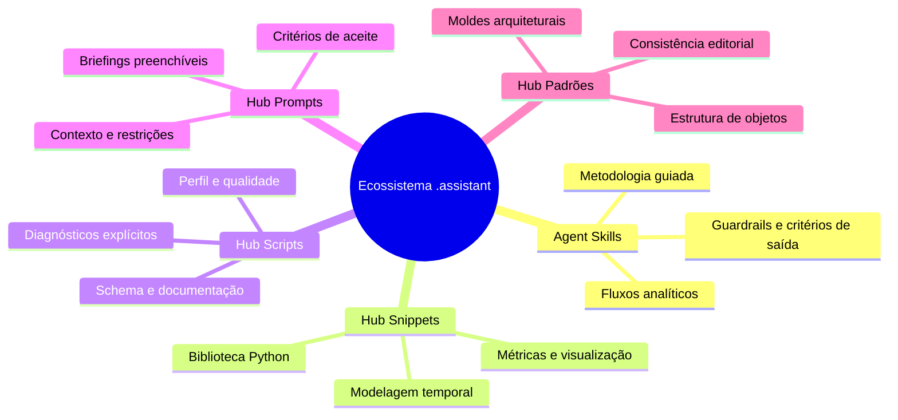
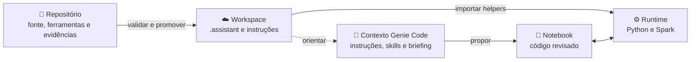
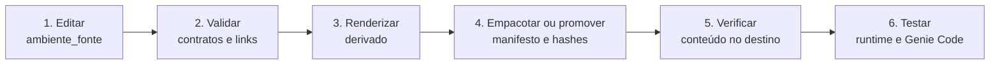
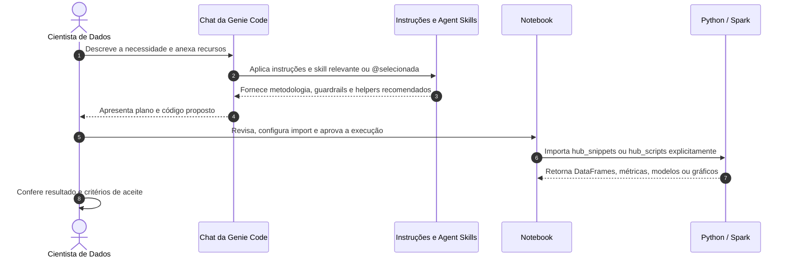

# Ecossistema/Hub `.assistant` para Databricks Genie Code voltado para Machine Learning

> Um ambiente integrado de governança, biblioteca algorítmica e inteligência contextual que ajuda a Genie Code e a equipe a trabalhar com métodos, componentes e critérios de revisão consistentes.

> **LEGENDA DE PROCEDÊNCIA.** Agent Skills e instruções são mecanismos reconhecidos pela Genie Code. Pastas com prefixo `hub_` e skills com prefixo `hub-` contêm implementações e convenções deste projeto; não são produtos institucionais da Databricks.

---

## 🧭 Mapa de Leitura

> **Este documento apresenta a visão do ecossistema:** finalidade, componentes, arquitetura, circulação de contexto e manutenção do projeto.

| Se você quer entender... | Continue em... |
|---|---|
| por que o ecossistema existe | [Visão Geral](#-o-que-é-este-ecossistema-e-como-ele-ajuda-no-databricks) |
| quais componentes ele reúne | [Componentes](#-o-que-tem-neste-ambiente-e-como-ele-ajuda-na-rotina-de-trabalho) |
| como repositório, workspace e runtime se relacionam | [Arquitetura](#️-arquitetura-completa-do-ecossistema) |
| como a Genie Code recebe contexto | [Fluxo de Contexto](#-como-o-contexto-chega-ao-genie-code) |
| como o projeto evita cópias concorrentes | [Manutenção](#-como-o-projeto-é-mantido-sem-criar-duas-verdades) |

---

<a id="-o-que-é-este-ecossistema-e-como-ele-ajuda-no-databricks"></a>

## 🌟 O que é este Ecossistema e como ele ajuda no Databricks?

Desenvolver projetos de Machine Learning em ambientes de Big Data envolve desafios recorrentes: escrever engenharia de atributos, recalcular métricas de risco e drift, padronizar análises exploratórias e mitigar vazamento temporal (*data leakage*).

Quando usamos um assistente sem o contexto do projeto, ele pode propor fórmulas novas, escolher bibliotecas diferentes das adotadas pela equipe ou deixar premissas de dados implícitas.

**O ecossistema `.assistant` ajuda a transformar esse cenário em um fluxo contextualizado e revisável.**

Ele reúne Agent Skills, instruções, bibliotecas Python, diagnósticos e briefings. Assim, a Genie Code pode receber metodologia e contexto, enquanto o notebook reutiliza implementações do Hub de forma explícita.

```text
┌─────────────────────────────────────────────────────────────────────────────┐
│                           ROTINA DO CIENTISTA DE DADOS                      │
│                                                                             │
│   ❌ Sem contexto: premissas implícitas, lógica repetida e revisão difícil  │
│   ✅ Com o Hub: método explícito, helpers reutilizáveis e saída conferível   │
└─────────────────────────────────────────────────────────────────────────────┘
```

O Hub não substitui julgamento técnico, permissões ou testes. Ele organiza o trabalho para que as decisões sejam mais claras e as entregas mais fáceis de auditar.

---

<a id="-o-que-tem-neste-ambiente-e-como-ele-ajuda-na-rotina-de-trabalho"></a>

## 🧰 O que tem neste ambiente e como ele ajuda na rotina de trabalho?

O ecossistema é dividido em cinco componentes modulares que cobrem diferentes responsabilidades do ciclo analítico:



### 🧠 1. Agent Skills (`skills/`)

- **O que são:** habilidades modulares no padrão de Agent Skills que orientam a Genie Code em tarefas analíticas completas.
- **Como ajudam:** fornecem escopo, fluxo metodológico, guardrails, helpers recomendados e formatos de saída.
- **Como usar:** a Genie Code pode carregá-las por relevância da `description`, ou você pode selecioná-las explicitamente com `@hub-ml-*`.

### 📦 2. Hub Snippets (`hub_snippets/`)

- **O que são:** uma biblioteca Python customizada com funções e classes organizadas por pasta de objeto.
- **Como ajudam:** evitam reimplementar operações como split temporal, PSI, safras, métricas, formatação e diagnósticos Spark.
- **Como usar:** configurar a raiz que contém `hub_snippets/` no `sys.path` ou no ambiente Python adotado e importar o módulo explicitamente.

### ⚡ 3. Hub Scripts (`hub_scripts/`)

- **O que são:** utilitários de diagnóstico importáveis.
- **Como ajudam:** respondem a perguntas operacionais sobre qualidade, perfil, drift, RFV, schema, nomenclatura e documentação.
- **Como usar:** configurar o caminho Python, importar a função e executar explicitamente. O script retorna evidência; o notebook ou a tarefa decide alertar, interromper ou prosseguir.

### 📝 4. Hub Prompts (`hub_prompts/`)

- **O que são:** briefings estruturados para preencher.
- **Como ajudam:** orientam o usuário a declarar contexto, grão, período, regras, limites, entrega e critérios de aceite.
- **Como usar:** abrir o template, substituir todos os campos, anexar os recursos e fornecer o texto à Genie Code. Eles não são slash commands nem são descobertos automaticamente.

### 📐 5. Hub Padrões (`hub_padroes/`)

- **O que são:** moldes arquiteturais e editoriais do ecossistema.
- **Como ajudam:** mantêm novos objetos coerentes em estrutura, documentação, testes e exemplo.
- **Como usar:** consultar manualmente ou fornecer como contexto ao criar conteúdo. A skill `@hub-ml-criar-objeto` pode orientar a aplicação desses moldes.

---

<a id="️-arquitetura-completa-do-ecossistema"></a>

## 🏛️ Arquitetura Completa do Ecossistema

O diagrama abaixo mostra como o repositório, o workspace e o runtime se relacionam sem confundir contexto da IA com importação de código:



> **Leitura do fluxo:** o repositório controla a origem; o workspace disponibiliza
> o conteúdo; a Genie Code usa apenas as camadas de contexto aplicáveis; o
> notebook importa e executa código no runtime.

### O que este diagrama deixa explícito

- Agent Skills e instruções usam mecanismos de contexto reconhecidos pela Genie Code.
- `hub_prompts` e `hub_padroes` são fornecidos manualmente quando necessários.
- `hub_snippets` e `hub_scripts` pertencem ao runtime Python; estar dentro de `.assistant` não os coloca automaticamente no `sys.path`.
- Evidência local, conteúdo promovido e execução no runtime são gates diferentes.

### Ciclo de vida do projeto



`ambiente_fonte/` é a fonte editável. `Novo_Ambiente_Simulado/` é derivado por ferramenta e não deve ser alterado manualmente. Auditorias, testes e orientações operacionais ficam na documentação interna do projeto.

---

<a id="-como-o-contexto-chega-ao-genie-code"></a>

## 🔄 Como o Contexto chega ao Genie Code?

Uma pergunta importante é: *“Como a Genie Code sabe que essas orientações e bibliotecas existem?”*

A resposta depende da camada. **Não existe uma única leitura automática de toda a pasta `.assistant`.**



### Explicação Passo a Passo

1. **Gatilho e intenção:** você descreve uma demanda em linguagem natural, anexa tabelas, notebooks ou células e pode selecionar uma skill com `@`.
2. **Diretrizes aplicáveis:** instruções pessoais, instruções de workspace quando configuradas e arquivos hierárquicos de projeto orientam as superfícies suportadas.
3. **Ativação da skill:** a Genie Code pode carregar uma Agent Skill por relevância da `description`, ou você pode selecioná-la explicitamente.
4. **Plano e geração:** a skill orienta método, riscos, recursos e formato. Ela pode recomendar um helper, mas não o importa automaticamente.
5. **Execução no runtime:** o notebook configura o caminho que contém os pacotes, importa a função e executa conforme dependências e permissões.
6. **Revisão:** a pessoa verifica código, dados, custo, resultado e qualquer ação persistente antes de aceitar a entrega.

> **Dica:** após editar uma skill, teste em uma nova conversa. Se a versão anterior continuar aparecendo, faça uma atualização completa da página.

---

<a id="-como-o-projeto-é-mantido-sem-criar-duas-verdades"></a>

## 🧭 Como o Projeto é Mantido sem Criar Duas Verdades

| Camada | Papel | Regra principal |
|---|---|---|
| `ambiente_fonte/` | fonte do produto | editar aqui |
| `Novo_Ambiente_Simulado/` | representação derivada | gerar com `tools/render_simulado.py` |
| `tools/` | gates e automação | executar antes de promover |
| `docs/` | decisões e evidências | registrar data, escopo e limitações |
| workspace | cópia operacional | verificar inventário, conteúdo e runtime |

O gate local verifica estrutura e contratos; a comparação de conteúdo verifica equivalência; o smoke verifica execução; os forward tests verificam roteamento de skills. Nenhum deles substitui os demais.

---

## ❓ Perguntas Frequentes (FAQ)

### 1. O que acontece quando eu abro o chat da Genie Code com este ecossistema configurado?

As instruções aplicáveis podem orientar a conversa, e uma Agent Skill pode ser carregada quando sua `description` for relevante ou quando você a selecionar com `@`. As extensões `hub_prompts`, `hub_snippets`, `hub_scripts` e `hub_padroes` não entram automaticamente apenas por existirem na pasta.

### 2. Preciso instalar alguma biblioteca ou configurar o Python para usar os snippets?

Você precisa garantir que a raiz que contém `hub_snippets/` esteja disponível ao Python. Uma forma direta no workspace é:

```python
from pathlib import Path
import sys

assistant_root = Path("/Workspace/Users/<username>/.assistant")
if str(assistant_root) not in sys.path:
    sys.path.insert(0, str(assistant_root))

from hub_snippets.ml.split_temporal import temporal_split
```

Alguns helpers possuem dependências opcionais. Em compute serverless, elas podem ser declaradas pelo **Environment** ou pelo ambiente do Git folder, conforme o fluxo suportado. Confirme pacote, versão e compatibilidade antes de executar.

### 3. Qual é a diferença prática entre Skill, Prompt, Snippet e Script?

- **Skill:** metodologia usada pela Genie Code; mecanismo nativo com conteúdo `hub-ml-*` do projeto.
- **Prompt:** briefing que você preenche e fornece manualmente.
- **Snippet:** função ou classe importável para compor seu código.
- **Script:** diagnóstico autocontido chamado explicitamente.

### 4. Como o ecossistema ajuda a mitigar leakage e erros analíticos?

Skills e helpers tornam entidade, instante de decisão, janela temporal, disponibilidade e validações mais explícitos. Isso reduz riscos conhecidos, mas não garante ausência de leakage. A pessoa precisa confirmar o contrato temporal, revisar o código e testar o caso real.

### 5. A equipe pode criar novos snippets, prompts ou skills?

Sim. Use `hub_padroes/` e a skill `@hub-ml-criar-objeto`, mantendo API pública, documentação, exemplo e testes. Mudanças no produto nascem em `ambiente_fonte/`, passam pelos gates e são registradas no changelog.

### 6. Se o código foi gerado pela Genie Code, posso executá-lo sem revisão?

Não é recomendado. Confira recursos, filtros, plano, coletas, dependências, permissões e operações persistentes. Gerar código, executar e aprovar um resultado são decisões diferentes.

---

## 🔗 Próximos Passos

- [Guia do ecossistema para usuários](README_assistant.md)
- [Hub Snippets](README_snippets.md)
- [Hub Scripts](README_scripts.md)
- [Agent Skills](README_skills.md)
- [Hub Prompts](README_prompts.md)
- [Recursos da Genie Code](https://learn.microsoft.com/en-us/azure/databricks/genie-code/features-capabilities)
- [Agent Skills](https://learn.microsoft.com/en-us/azure/databricks/genie-code/skills)
