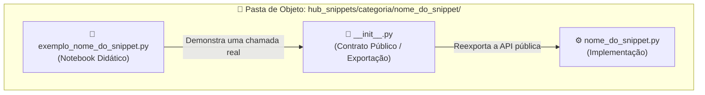
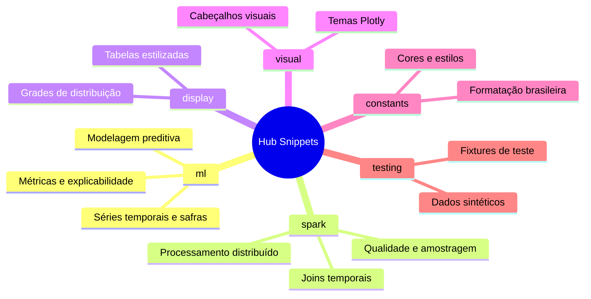
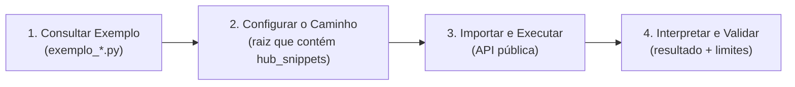

# Hub Snippets

> A biblioteca matemática e algorítmica central do ecossistema `.assistant`: funções e classes reutilizáveis, revisadas e testadas para fluxos de Machine Learning e Big Data no Databricks.

> **CONTEÚDO CUSTOMIZADO PELO HUB.** `hub_snippets` não é uma biblioteca institucional da Databricks nem é carregada automaticamente pela Genie Code. O notebook precisa tornar o pacote visível ao Python e importar explicitamente a função desejada.

---

## 🧭 Neste Guia

| Para entender... | Vá para... |
|---|---|
| o conceito e a estrutura de um snippet | [O que é um Snippet](#-o-que-é-um-snippet-neste-ecossistema) |
| as categorias da biblioteca | [Mapa de Categorias](#-mapa-de-categorias-do-hub-snippets) |
| quais objetos estão disponíveis | [Catálogo Detalhado](#-catálogo-detalhado-por-categoria) |
| como importar e executar | [Passo a Passo Operacional](#️-passo-a-passo-operacional-como-usar-um-snippet) |
| runtime, dependências e custo | [Onde o Código Executa](#️-onde-o-código-executa-e-quanto-pode-custar) |
| dúvidas e limitações | [Perguntas Frequentes](#-perguntas-frequentes-faq) |

---

<a id="-o-que-é-um-snippet-neste-ecossistema"></a>

## 🧩 O que é um Snippet neste Ecossistema?

No desenvolvimento de software tradicional, a palavra *snippet* costuma significar um pedaço solto de código copiado de fóruns da internet.

**Neste ecossistema, um Snippet é algo diferente: é uma peça reutilizável de engenharia analítica.**

Pense nos snippets como funções de uma biblioteca especializada:

- Você não precisa reprogramar rotinas numéricas ou reimplementar fórmulas do zero toda vez que construir um modelo; pode reutilizar blocos com contrato, exemplo e testes conhecidos.
- Em Machine Learning, isso reduz retrabalho em cálculos como *Population Stability Index* (PSI), junções temporais, métricas e análise de safras (*Vintage Analysis*).
- A reutilização não elimina a validação: assinatura, dependências, volume, instante de decisão e significado de negócio continuam precisando ser conferidos.

```text
┌─────────────────────────────────────────────────────────────────────────────┐
│                            O QUE DEFINE UM SNIPPET                          │
│                                                                             │
│   🛡️ Efeito Declarado: transformação, coleta ou estado precisam ser claros │
│   📐 Lógica Revisável: fórmula, premissas e limites ficam no código         │
│   ⚡ Execução Adequada: Pandas ou Spark conforme o tipo e o volume          │
│   🧪 Evidência Delimitada: testes e exemplos cobrem cenários conhecidos     │
└─────────────────────────────────────────────────────────────────────────────┘
```

Cada snippet resolve uma **dor analítica específica**, expondo uma API pública curta. A linha de `import` simplifica o uso, mas não substitui a leitura do contrato.

---

## 🏛️ Arquitetura e o Padrão "Pasta de Objeto"

Para favorecer que o código seja limpo, fácil de encontrar e intuitivo tanto para pessoas quanto para a IA, os snippets seguem o padrão de organização chamado **Pasta de Objeto**.

Na estrutura vigente, cada snippet fica em um diretório autossuficiente com três componentes centrais:



### O que cada arquivo faz

1. **`__init__.py` (A Fachada):** reexporta as funções e classes públicas. É ele que permite imports curtos sem expor a organização interna do módulo.
2. **`nome_do_snippet.py` (O Motor):** contém implementação, validações, tipagem e docstring. O código é a fonte técnica para a assinatura real.
3. **`exemplo_nome_do_snippet.py` (O Guia Didático):** demonstra o uso com dados sintéticos e registra uma saída observada. Ele ensina o contrato exercitado; não promete compatibilidade com qualquer runtime ou volume.

O Catálogo de Helpers (`.assistant/CATALOGO_HELPERS.md`) relaciona demanda, caminho público e dependências. Ele é o índice canônico; este README preserva uma leitura narrativa por categoria.

---

<a id="-mapa-de-categorias-do-hub-snippets"></a>

## 🗺️ Mapa de Categorias do Hub Snippets

A biblioteca é dividida em seis categorias funcionais que acompanham as principais etapas de um fluxo analítico:



---

<a id="-catálogo-detalhado-por-categoria"></a>

## 📚 Catálogo Detalhado por Categoria

Abaixo você encontra o papel de cada objeto e o momento em que ele pode ser útil. Consulte o módulo e o notebook correspondente antes de adotar a função em um pipeline.

---

### 1. Categoria: `ml` (Machine Learning e Estatística Aplicada)

*É o coração algorítmico do Hub, voltado a modelagem preditiva, risco de crédito, séries temporais e governança de modelos.*

#### 🕒 Engenharia Temporal e Séries Temporais

- **`lgbm_temporal`**: prepara atributos temporais e treina LightGBM com parâmetros declarados.
  - *Quando usar:* em problemas temporais nos quais a disponibilidade histórica de cada atributo foi validada. LightGBM é dependência opcional; ausência do pacote impede esse fluxo.
- **`split_temporal`**: divide um `pandas.DataFrame` em treino, validação e teste por períodos completos de calendário, com gaps opcionais.
  - *Quando usar:* quando a avaliação precisa preservar ordem temporal. O helper não recebe datas finais fixas; recebe proporções, unidade de período e quantidade de gaps.
- **`walk_forward`**: produz janelas sucessivas de validação temporal.
  - *Quando usar:* para avaliar estabilidade ao longo de múltiplos cortes históricos, depois de definir tamanho das janelas e política de reentreino.
- **`vintage_analysis`**: constrói curvas de safra e maturação por período de originação.
  - *Quando usar:* em risco, retenção ou eventos cujo denominador, janela e censura tenham sido definidos.

#### 📊 Risco de Crédito e Scorecards

- **`woe_iv_calculator`**: calcula *Weight of Evidence* (WOE) e *Information Value* (IV) para os tipos suportados.
  - *Quando usar:* como diagnóstico ou transformação em scorecards, com binning, target e tratamento de categorias explicitamente revisados.
- **`scorecard_builder`**: converte um modelo logístico compatível em uma escala de pontos configurável.
  - *Quando usar:* quando a escala, odds, PDO e coeficientes foram validados. Transparência do cálculo não equivale a aprovação regulatória.
- **`score_bands`**: organiza um score em faixas e resume evento e volumetria.
  - *Quando usar:* para estudar cortes operacionais; a política de decisão continua externa ao helper.

#### 📈 Avaliação, Métricas e Visualização

- **`metrics_report`**: consolida métricas de classificação, como AUC, Gini, KS, F1, LogLoss e Brier quando aplicáveis.
  - *Quando usar:* para comparar modelos sob a mesma população, target, unidade e estratégia de corte.
- **`curves_plotly`**: produz figuras interativas de ROC, Precision-Recall, ganho e KS.
  - *Quando usar:* na análise de thresholds e na comunicação visual, conferindo se a escala do KS é razão ou percentual.
- **`explainability_report`**: organiza importância e explicações locais ou globais para modelos suportados.
  - *Quando usar:* em revisão técnica. Explicabilidade descreve o comportamento do modelo; não demonstra causalidade.

#### 🛡️ Monitoramento e MLOps

- **`performance_monitor`**: compara métricas observadas com limiares e períodos configurados.
  - *Quando usar:* dentro de uma rotina de monitoramento. A classe calcula quando chamada; não agenda tarefas, não envia alertas e não retreina sozinha.
- **`drift_detection`**: reúne diagnósticos de mudança de distribuição.
  - *Quando usar:* para investigar alteração entre referência e período atual. Drift não prova, sozinho, degradação de performance.
- **`mlflow_run`**: wrapper para abertura e registro governado de runs no MLflow.
  - *Quando usar:* quando experimento, tags, parâmetros e artefatos foram definidos. O run é um efeito externo intencional.

#### 🔍 Não Supervisionado e Anomalias

- **`clustering_suite`**: compara configurações de clustering com as métricas implementadas.
  - *Quando usar:* para apoiar seleção de configuração; métricas internas não substituem utilidade de negócio.
- **`cluster_profiling`**: resume diferenças entre grupos encontrados.
  - *Quando usar:* para interpretar clusters, evitando converter automaticamente padrões estatísticos em personas definitivas.
- **`isolation_forest`**: aplica detecção de anomalias e organiza seu perfil.
  - *Quando usar:* como mecanismo de priorização investigativa. Uma anomalia não é sinônimo de fraude.

---

### 2. Categoria: `spark` (Operações Distribuídas em Escala)

*Voltada a operações sobre DataFrames PySpark, mantendo o processamento principal no cluster e declarando as coletas necessárias.*

- **`pit_join` (Point-in-Time Join)**: relaciona eventos a registros históricos disponíveis até o instante de decisão.
  - *Quando usar:* na construção de bases analíticas em que cada entidade possui uma data de referência. Chaves, duplicidades e atraso de publicação precisam ser definidos.
- **`psi_calculator`**: calcula PSI numérico e CSI categórico com agregações Spark.
  - *Quando usar:* para comparar distribuições. O resultado final e distribuições agregadas são coletados no driver; linhas completas não são coletadas pelo cálculo numérico.
- **`null_summary`**: resume nulos e padrões configurados em DataFrames Spark.
  - *Quando usar:* no perfil inicial, considerando que agregações sobre tabela larga podem exigir leitura ampla.
- **`smart_sample`**: cria amostra simples ou estratificada segundo os parâmetros fornecidos.
  - *Quando usar:* para prototipação controlada. Amostra não garante representatividade sem validação do desenho.
- **`date_features`**: deriva atributos de calendário em PySpark.
  - *Quando usar:* depois de confirmar timezone, calendário e instante de disponibilidade das novas colunas.
- **`join_diagnostics`**: mede cobertura, duplicidade, perda e expansão de linhas em joins.
  - *Quando usar:* antes e depois de cruzamentos relevantes. A API pública é `diagnosticar_join`.
- **`safe_display`**: limita a quantidade exibida no notebook.
  - *Quando usar:* na inspeção visual. Limitar exibição protege a interface, mas não torna qualquer transformação anterior barata.

---

### 3. Categoria: `display` (Exibição e Tabelas Formatadas)

*Focada na apresentação didática de dados tabulares dentro dos notebooks.*

- **`dataframe_styled`**: aplica formatação e recursos visuais a DataFrames pandas.
  - *Quando usar:* em relatórios e inspeções com volume compatível com o driver.
- **`distribution_grid`**: organiza múltiplas distribuições em uma grade compacta.
  - *Quando usar:* em EDA; limites e amostras devem ser definidos antes da conversão para estruturas locais.

---

### 4. Categoria: `visual` (Identidade Visual e Design em Plotly)

*Favorece consistência estética nos gráficos e capítulos de notebook.*

- **`theme_plotly`**: aplica o tema visual do Hub a figuras ou à sessão, conforme a função chamada.
  - *Quando usar:* quando o notebook deve adotar a identidade visual do projeto. Alterações de template global são efeitos de sessão, não funções puras.
- **`section_header`**: renderiza cabeçalhos, subtítulos e badges em HTML.
  - *Quando usar:* para dividir notebooks longos em capítulos claros; confirme onde HTML é aceito.

---

### 5. Categoria: `constants` (Padrões Brasileiros)

*Funções e constantes de formatação cultural e identidade visual.*

- **`format_br`**: converte números em strings no padrão brasileiro:
  - Moeda: `1250000.5` ➔ `R$ 1.250.000,50`
  - Porcentagem: `0.154` ➔ `15,4%`
  - Inteiro: `15000` ➔ `15.000`
  - *Quando usar:* ao apresentar resumos, métricas e KPIs. A função de inteiro não acrescenta unidade automaticamente.
- **`colors` e `styles`**: concentram paletas e convenções visuais do Hub.
  - *Quando usar:* para evitar cores e estilos divergentes entre notebooks.

---

### 6. Categoria: `testing` (Dados Sintéticos e Fixtures)

*Acelera desenvolvimento e testes ao reduzir a dependência de bases externas.*

- **`fixtures`**: geradores de dados sintéticos para cenários tabulares, contratos, transações e séries temporais.
  - *Quando usar:* em exemplos, regressões e protótipos reproduzíveis. Dados sintéticos exercitam propriedades escolhidas; não representam automaticamente a distribuição real.

---

### 📋 Inventário Completo da Biblioteca

O catálogo narrativo acima destaca os objetos mais recorrentes. O mapa abaixo completa a visão da biblioteca, incluindo os componentes especializados que podem ser necessários em séries temporais, survival, ranking, deep learning e apresentação visual.

```text
hub_snippets/
├── constants
│   ├── colors             ├── emojis
│   ├── format_br          └── styles
├── display
│   ├── correlation_matrix ├── dataframe_styled
│   └── distribution_grid
├── ml
│   ├── arima_wrapper      ├── autoencoder_anomaly
│   ├── cluster_profiling  ├── clustering_suite
│   ├── curves_plotly      ├── drift_detection
│   ├── explainability_report
│   ├── isolation_forest   ├── kaplan_meier
│   ├── lgbm_ranker        ├── lgbm_temporal
│   ├── metrics_report     ├── mlflow_run
│   ├── mlp_embeddings     ├── optuna_lgbm
│   ├── performance_monitor
│   ├── prophet_wrapper    ├── score_bands
│   ├── scorecard_builder  ├── shap_explainer
│   ├── split_temporal     ├── survival_cox
│   ├── tabnet_wrapper     ├── train_catboost
│   ├── train_lgbm         ├── train_xgboost
│   ├── umap_viz           ├── vintage_analysis
│   ├── walk_forward       └── woe_iv_calculator
├── spark
│   ├── date_features      ├── join_diagnostics
│   ├── null_summary       ├── pit_join
│   ├── psi_calculator     ├── safe_display
│   └── smart_sample
├── testing
│   └── fixtures
└── visual
    ├── badge              ├── divider
    ├── index_generator    ├── kpi_card
    ├── section_header     └── theme_plotly
```

> **Como usar este inventário:** escolha o objeto pelo problema, abra seu `exemplo_<nome>.py` e confirme API, dependências e tipo de retorno no Catálogo de Helpers (`.assistant/CATALOGO_HELPERS.md`).

---

<a id="️-passo-a-passo-operacional-como-usar-um-snippet"></a>

## 🛠️ Passo a Passo Operacional: Como Usar um Snippet

Usar um snippet envolve quatro decisões: localizar o exemplo, tornar o pacote importável, chamar a API real e validar o resultado.



### Passo 1: Inspecione o notebook modelo

Abra o arquivo `exemplo_<snippet>.py`. Ele mostra a função chamada, os dados sintéticos usados e a forma da saída observada. Confirme se o seu cenário respeita as mesmas premissas.

### Passo 2: Torne a biblioteca visível ao Python

A pasta `.assistant` não entra automaticamente no `sys.path` só por existir no workspace. Informe a raiz que contém `hub_snippets/`:

```python
from pathlib import Path
import sys

assistant_root = Path("/Workspace/Users/<username>/.assistant")
if str(assistant_root) not in sys.path:
    sys.path.insert(0, str(assistant_root))
```

Troque `<username>` pelo diretório autorizado ou use a raiz equivalente do seu Git folder. Em compute serverless, outra opção é declarar dependências pelo **Environment** ou pelo ambiente do Git folder, conforme o fluxo adotado.

### Passo 3: Importe e execute com a assinatura real

```python
# Exemplo 1: engenharia temporal em pandas
from hub_snippets.ml.split_temporal import temporal_split

df_treino, df_val, df_teste = temporal_split(
    df=meu_dataframe,
    date_col="data_safra",
    train_pct=0.70,
    val_pct=0.15,
    gap_periods=1,
    period_unit="M",
)

# Exemplo 2: monitoramento numérico em Spark
from hub_snippets.spark.psi_calculator import calcular_psi

resultado_psi = calcular_psi(
    df_base=dados_referencia_spark,
    df_atual=dados_atuais_spark,
    col="score_credito",
    n_bins=20,
)
```

Os parâmetros acima correspondem às APIs atuais: `temporal_split` não recebe `train_end`/`val_end`, e `calcular_psi` usa `df_base`, `df_atual`, `col` e `n_bins`.

### Passo 4: Interprete e apresente

Os snippets retornam DataFrames pandas, DataFrames PySpark, dicionários, escalares, modelos ou figuras, conforme o objeto. Antes de encadear a saída:

- confira tipo, unidade e schema retornados;
- diferencie resultado executado de exemplo ilustrativo;
- interprete thresholds como política analítica, não padrão universal;
- registre versão, parâmetros e população quando houver decisão de modelo.

---

<a id="️-onde-o-código-executa-e-quanto-pode-custar"></a>

## ⚙️ Onde o Código Executa e Quanto Pode Custar

| Família | Execução predominante | Atenção principal |
|---|---|---|
| pandas / NumPy / scikit-learn | driver | memória local e conversões de Spark |
| PySpark | cluster, com resultados agregados no driver quando necessário | scans, shuffles, `collect()` agregado e cardinalidade |
| Plotly / HTML | driver e navegador | tamanho da figura e estado visual da sessão |
| MLflow | serviço + armazenamento configurado | criação de runs e artefatos persistentes |
| bibliotecas opcionais | depende do compute | versão, compatibilidade e política de instalação |

Não existe um helper universalmente “rápido”. Volume, largura, particionamento, cardinalidade e plano físico precisam ser considerados no contexto da chamada.

---

<a id="-perguntas-frequentes-faq"></a>

## ❓ Perguntas Frequentes (FAQ)

### 1. Os snippets alteram o meu DataFrame original (*in-place*)?

**A maior parte retorna um novo objeto, mas “zero efeito colateral” não é uma regra universal.** Helpers visuais podem modificar tema de sessão, wrappers do MLflow criam runs e treinadores retornam objetos com estado. Leia a docstring e o exemplo do objeto antes de usá-lo.

### 2. Posso usar os snippets em compute Databricks Serverless?

**Depende do snippet, das bibliotecas disponíveis e do runtime.** Os módulos Python puros tendem a ser portáveis; PySpark, MLflow, LightGBM, SHAP, Plotly e outras dependências devem ser confirmados no destino. Serverless não torna `.assistant` automaticamente importável.

### 3. O que acontece se faltar uma biblioteca opcional, como LightGBM ou Tabulate?

O comportamento depende do módulo: alguns produzem `ImportError` orientado e outros falham no import da dependência. Consulte o catálogo, confirme o pacote exigido e instale-o somente pelo mecanismo permitido no ambiente.

### 4. Como os snippets Spark lidam com tabelas muito grandes?

Eles priorizam operações distribuídas, mas algumas rotinas executam ações e coletam **resultados agregados**, categorias limitadas ou amostras no driver. Isso é diferente de coletar a tabela inteira, mas ainda exige controle de cardinalidade e inspeção do plano.

### 5. A Genie Code encontra e executa os snippets automaticamente?

**Não.** Uma skill pode recomendar explicitamente um helper, mas o notebook ainda precisa configurar a importação e executar o código. `hub_snippets` é uma extensão customizada, não um mecanismo nativo de descoberta da Genie Code.

### 6. Posso propor um novo snippet para a biblioteca?

**Sim.** Use o molde em `.assistant/hub_padroes/` e a skill `@hub-ml-criar-objeto`. Todo novo objeto deve declarar contrato, dependências, efeitos, limites, API pública, exemplo sintético e testes proporcionais ao risco.

---

## 🔗 Continue Explorando

- Catálogo completo de helpers: `.assistant/CATALOGO_HELPERS.md`
- [Hub Scripts](README_scripts.md)
- [Agent Skills](README_skills.md)
- [Hub Prompts](README_prompts.md)
- [Dependências em compute serverless](https://learn.microsoft.com/en-us/azure/databricks/compute/serverless/dependencies)
- [Arquivos no workspace](https://learn.microsoft.com/en-us/azure/databricks/files/workspace)
