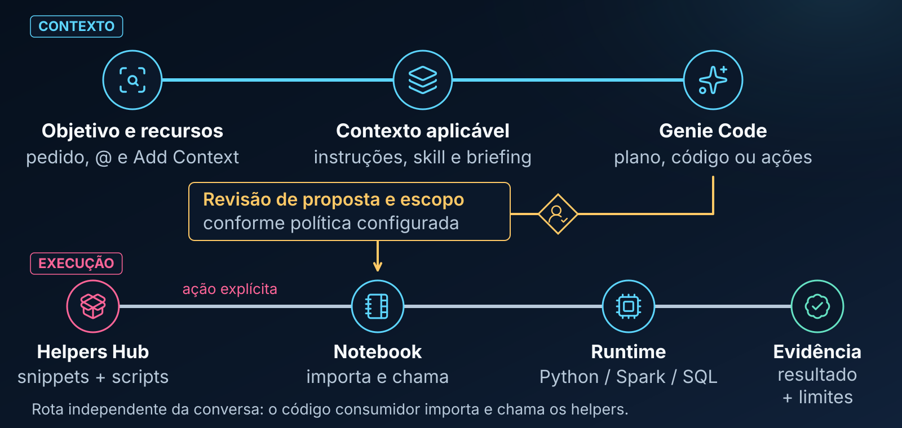

# Ecossistema/Hub `.assistant` para Databricks Genie Code voltado para Machine Learning

Você recebeu uma base e precisa escolher como conhecê-la, verificar sua qualidade e avaliar possíveis usos. Este guia acompanha uma tarefa completa: preparar dados sintéticos, formular o pedido, revisar o plano, executar uma chamada autorizada e interpretar sua saída.

> **Candidato para revisão, ainda não oficial.** Esta versão não foi publicada no Databricks. Exemplos e resultados esperados não são registros de execução no seu workspace.

> **Procedência.** Instruções e Agent Skills são mecanismos documentados da plataforma. As coleções `hub_` e os métodos `hub-ml-*` são conteúdo customizado deste projeto. Carregar contexto não equivale a executar um helper; o usuário ou a Genie Code podem executar chamadas por ferramentas autorizadas.

---

## 🧭 Mapa de Uso

Antes de começar, tenha acesso a um notebook Python, compute compatível com PySpark e à cópia do Hub no workspace. A primeira demonstração não lê tabelas corporativas nem grava tabelas persistentes. Ela cria uma view temporária na sessão do notebook.

Um **notebook** organiza células de texto e código. Uma **célula** é um bloco que você lê ou executa. Um **DataFrame** representa dados tabulares; no Spark, muitas operações constroem um plano distribuído cuja avaliação é adiada até uma ação. Um **helper** é uma função ou classe reutilizável. O **runtime** é o ambiente que efetivamente interpreta e executa o código. A conversa com a Genie é outra superfície, ainda que possa acionar ferramentas de execução.

| Objetivo | Seção |
|---|---|
| Entender o papel do Hub | [Visão geral](#visao-geral) |
| Escolher a peça necessária | [Componentes](#componentes) |
| Separar contexto de execução | [Arquitetura](#arquitetura) |
| Fornecer contexto ao agente | [Contexto](#contexto) |
| Executar a primeira checagem | [Primeira tarefa](#primeira-tarefa) |
| Resolver falhas de ambiente | [Compute e segurança](#compute) |

---

<a id="visao-geral"></a>
## 🌟 O que é este Ecossistema e como ele ajuda no Databricks?

O Hub organiza métodos de trabalho e disponibiliza implementações que podem ser reutilizadas. A conversa formula e revisa a tarefa; os arquivos guardam instruções e código; um ambiente de execução processa as chamadas. Nenhuma análise ocorre apenas porque a pasta está presente.

O exemplo compartilhado é uma campanha fictícia. Cada linha representa um evento, identificado por `event_id`; `id_cliente` pode aparecer em mais de um evento. Não use a entidade como chave única da linha sem verificar a granularidade. `dt_evento` define quando o evento ocorreu; ela não prova quando a informação ficou disponível para um modelo.

---

<a id="componentes"></a>
## 🧰 O que tem neste ambiente e como ele ajuda na rotina de trabalho?

A figura ajuda a separar método, pedido, implementação e autoria.


Na campanha, o briefing delimita a checagem, a skill ajuda a organizar a exploração e um script calcula as métricas quando chamado. Não há obrigação de usar os cinco componentes.

### 🧠 1. Agent Skills (`skills/`)

Escolha uma skill para orientar um método, como EDA ou engenharia de atributos. Forneça recurso, grão, tempo, restrições e entrega. A seleção pode ser por relevância ou por `@`; o resultado deve ser revisado. A skill não é uma biblioteca Python. Veja o [catálogo com pedidos completos](../sprint-05-skills/README.md).

### 📦 2. Hub Snippets (`hub_snippets/`)

Use quando precisar de uma função ou classe existente. Verifique entrada, saída, dependências e efeitos no módulo correspondente. O [guia de snippets](../sprint-03-snippets/README.md) ensina o caminho entre localizar o pacote, importar e chamar. Nem todo snippet recebe DataFrame: um formatador, por exemplo, recebe um número.

### ⚡ 3. Hub Scripts (`hub_scripts/`)

São utilitários com contratos específicos: qualidade, perfilamento, comparação de distribuições, RFV, schema, nomes e documentação. RFV transforma dados; schema pode ser serializado em texto; nem todos retornam status. O [guia de scripts](../sprint-04-scripts/README.md) diferencia os sete retornos.

### 📝 4. Hub Prompts (`hub_prompts/`)

São briefings preenchíveis. Abrir o arquivo não envia seu conteúdo ao chat nem instala comandos. Escolha, preencha e forneça o texto junto dos recursos corretos. O [guia de prompts](../sprint-06-prompts/README.md) explica os campos e a revisão da resposta.

### 📐 5. Hub Padrões (`hub_padroes/`)

São moldes para criar objetos novos. Use quando a tarefa for autoria, não como etapa obrigatória de toda análise. O [guia de padrões](../sprint-08-padroes/README.md) mostra como definir um contrato e um exemplo antes de integrar o objeto.

`hub_readmes_visual_assets/` reúne imagens e cabeçalhos compartilhados. É infraestrutura editorial, não um componente analítico adicional.

---

<a id="arquitetura"></a>
## 🏛️ Arquitetura Completa do Ecossistema

Observe as duas rotas: informação que orienta a conversa e código que entra no ambiente de execução.



Anexar o código permite consultá-lo. Importar carrega um módulo no processo Python. Chamar uma função executa sua lógica; no Spark, parte dessa lógica pode permanecer adiada até uma ação. O notebook mostrado na figura é a rota deste tutorial. A Genie também pode executar código com suas ferramentas, conforme disponibilidade, permissões e aprovação.

### O que acontece automaticamente e o que depende de você

| Componente ou ação | Comportamento |
|---|---|
| Instruções pessoais e de workspace | Aplicadas nas superfícies suportadas; não em Quick Fix e Autocomplete |
| `AGENTS.md` / `CLAUDE.md` | Descoberta na hierarquia do arquivo aberto, conforme a plataforma |
| Skill | Carregamento por relevância ou seleção explícita |
| Prompt do Hub | Deve ser fornecido como contexto do pedido |
| Helper | Precisa de chamada em ambiente com pacote e dependências disponíveis |
| Aprovação de ferramenta | Depende do modo e das autorizações já concedidas; não presuma novo clique a cada ação |

Uma resposta que segue o método não comprova isoladamente o carregamento da skill. Consulte os recursos e ações expostos pela interface e registre separadamente a qualidade do resultado.

---

<a id="contexto"></a>
## 🔄 Como o Contexto chega ao Genie Code?

A figura reúne fontes diferentes de informação; cada uma depende da superfície e do acesso permitido.


O nome de uma tabela escrito na conversa não comprova que ela foi selecionada. Da mesma forma, uma view temporária do notebook não é automaticamente uma tabela persistente do catálogo. Forneça a célula de preparação e seu schema quando usar a fixture abaixo.

### Explicação Passo a Passo

1. Declare objetivo e modo. Para revisar sem execução: “Explique e proponha o plano; não execute código, consultas ou alterações”.
2. Pelo mecanismo de contexto da interface, selecione a célula, notebook ou tabela realmente disponível. Use `@cell` quando oferecido para a célula pertinente.
3. Selecione a skill desejada, por exemplo `@hub-ml-eda-profissional`.
4. Confira se a proposta usa as colunas existentes, respeita o grão e separa fatos de hipóteses.
5. Revise custo, coleta no driver, instalações e persistência antes de autorizar chamadas.
6. Registre o que foi executado e compare a saída com critérios definidos previamente.

Após editar uma skill, abra conversa nova. Se os metadados continuarem antigos, atualize a página. Isso atualiza contexto; não certifica que a metodologia produziu uma resposta correta.

---

<a id="primeira-tarefa"></a>
## 🧭 Como Escolher o Ponto de Partida

A pergunta do momento indica o ponto de entrada.


Comece por diagnóstico quando quer medir integridade. Escolha uma skill quando precisa discutir o método. Só avance para criação de objetos quando a biblioteca não atende ao contrato requerido.

### Exemplo: conhecer uma tabela nova

**Preparar.** Execute as próximas células em um notebook Python autorizado com Spark. Substitua `<username>` pelo diretório da instalação pessoal; uma instalação compartilhada pode usar outro caminho, que deve ser confirmado. A checagem do diretório ajuda a distinguir pacote ausente de dependência ausente.

```python
from pathlib import Path
import sys
from datetime import date, timedelta
from pyspark.sql import SparkSession

assistant_root = Path("/Workspace/Users/<username>/.assistant")
if not (assistant_root / "hub_scripts").is_dir():
    raise FileNotFoundError("Confirme o caminho da instalacao do Hub.")
if str(assistant_root) not in sys.path:
    sys.path.insert(0, str(assistant_root))

spark = SparkSession.getActiveSession() or SparkSession.builder.getOrCreate()
linhas = [
    (
        f"e{i:02d}", f"c{i % 5:02d}",
        date(2026, 6, 1) + timedelta(days=i),
        None if i == 0 else "email", i % 2, float(i),
    )
    for i in range(20)
]
schema = "event_id string, id_cliente string, dt_evento date, canal string, respondeu int, valor_gasto double"
eventos = spark.createDataFrame(linhas, schema)
eventos.createOrReplaceTempView("vw_campanha_eventos_sintetica")
eventos.printSchema()
eventos.orderBy("event_id").show(5, truncate=False)
```

São vinte eventos e cinco clientes. A chave `event_id` é única. Um valor de `canal` é nulo, por construção. A view é temporária e vinculada à sessão Spark; não foi criada uma tabela persistente. O schema é explícito, evitando que a demonstração dependa de inferência de tipos.

**Pedir.** Selecione as células de criação e schema no contexto. O texto seguinte é um pedido preenchido, não uma transcrição de conversa executada:

```text
@hub-ml-eda-profissional
Use as celulas selecionadas deste notebook, que criam eventos sinteticos e a
view temporaria vw_campanha_eventos_sintetica nesta sessao Spark.
Grao: um evento por linha. Chave candidata: event_id. Entidade: id_cliente.
Tempo: dt_evento. Colunas adicionais: canal, respondeu e valor_gasto.
Quero verificar unicidade e nulos antes de estudar resposta da campanha.
Apenas explique e apresente o plano. Nao execute consultas, codigo ou alteracoes.
Se sua ferramenta usar outra sessao, nao presuma que a view exista nela.
Nao defina retencao nem regra de negocio nao fornecida.
```

**Revisar.** O plano deve distinguir a chave do evento da entidade cliente, verificar nulos por coluna e não propor uma tabela corporativa inexistente. Para chamar o helper a seguir, use o próprio notebook cuja sessão contém a view.

**Executar.** A ausência de `date_column` é deliberada: esta primeira lição trata de nulidade e chave, com resultado independente do dia em que você a executar.

```python
from hub_scripts.data_quality_check import data_quality_check

resultado = data_quality_check(
    table_name="vw_campanha_eventos_sintetica",
    pk_columns=["event_id"],
    date_column=None,
    thresholds={"null_warn": 5.0, "null_fail": 20.0},
)
assert resultado["checks"]["row_count"] == 20
assert resultado["checks"]["pk_uniqueness"]["duplicate_rows"] == 0
assert resultado["checks"]["nulls"]["canal"]["count"] == 1
assert resultado["checks"]["nulls"]["canal"]["pct"] == 5.0
assert resultado["status"] == "warn"
assert resultado["score"] == 95

print(resultado["status"], resultado["score"])
for alerta in resultado["alerts"]:
    print(alerta["severity"], alerta["check"], alerta.get("column"), alerta["message"])
```

**Resultado esperado pelo código e pela fixture, não captura de uma execução:** `warn 95`. O alerta de nulidade tem `check="null_rate"`, `column="canal"`, `severity="warn"` e mensagem `Null rate 5.00% (1/20).`. A identificação da coluna está no campo `column`; não procure um campo superior chamado `metrics`.

**Interpretar.** `1 / 20 × 100 = 5%`, exatamente o limiar de atenção. A regra usa comparação inclusiva para nulidade: 5% já produz `warn`, enquanto 20% atingiria `fail`. O score local começa em 100 e perde 5 por aviso e 25 por falha, com piso zero. Portanto, 95 não significa “95% de certeza de que a tabela é boa”. O veredito só resume verificações configuradas.

**Adaptar.** Troque a view por uma tabela autorizada usando seu nome real, idealmente qualificado por catálogo e schema. Confirme chaves e limiares com o responsável pelo uso. Para estudar atualidade, faça uma chamada separada com `date_column="dt_evento"` e política de dias explícita; a saída passa a depender da data corrente. Não copie 90 dias como padrão universal.

**Variação resolvida.** Remova apenas o nulo didático e confirme a diferença:

```python
eventos.fillna({"canal": "email"}).createOrReplaceTempView("vw_campanha_sem_nulos")
sem_nulos = data_quality_check("vw_campanha_sem_nulos", ["event_id"], date_column=None)
assert sem_nulos["status"] == "pass"
assert sem_nulos["score"] == 100
```

O preenchimento é uma transformação sintética do tutorial, não recomendação para imputar dados reais sem justificativa. Como exercício, introduza uma duplicata de `event_id` e examine qual campo de `checks` explica a falha. O [guia de scripts](../sprint-04-scripts/README.md) apresenta os três casos completos.

**Se não funcionou.** `ModuleNotFoundError` do Hub indica caminho ou instalação. “Tabela não encontrada” pode indicar outra sessão ou falta de execução da célula de criação. `columns not found` exige confrontar o argumento com o schema. Permissão negada não deve ser contornada por outro recurso. Contrato conferido na [implementação](../../../ambiente_fonte/.assistant/hub_scripts/data_quality_check/data_quality_check.py) e no [exemplo do objeto](../../../ambiente_fonte/.assistant/hub_scripts/data_quality_check/exemplo_data_quality_check.py).

### Exemplo: validar um cruzamento

**Preparar.** No mesmo notebook com Spark e path configurados, construa duas fontes pequenas. A esquerda tem dois eventos; o cadastro tem duas linhas para um cliente, introduzidas de propósito.

```python
from hub_snippets.spark.join_diagnostics import diagnosticar_join

esquerda = spark.createDataFrame([("e1", "c1"), ("e2", "c2")], "event_id string, id_cliente string")
direita = spark.createDataFrame([("c1", "A"), ("c1", "B"), ("c2", "A")], "id_cliente string, segmento string")
join_info = diagnosticar_join(esquerda, direita, chave="id_cliente", amostra_orfas=2)
assert join_info["linhas_apos_join_left"] == 3
assert join_info["expansao_prevista_left"] == 1.5
assert join_info["cobertura_pct_chaves_validas"] == 100.0
print(join_info)
```

**Pedir e revisar.** Antes da execução, `@hub-ml-cross-eda-ml` pode ajudar a discutir o grão e a regra de seleção do cadastro. Informe as duas células e peça plano sem execução. Não aceite deduplicação arbitrária: “primeira linha” não é regra de negócio.

**Interpretar.** Cobertura de 100% não implica junção adequada. As duas correspondências de `c1` fazem dois eventos se tornarem três linhas: `3/2 = 1,5`. O helper realiza agregações e junções auxiliares para diagnosticar; ele não entrega o DataFrame final de análise.

**Adaptar.** Na base real, confirme chave composta e disponibilidade temporal. Se a chave contiver nulos, a cobertura usa apenas linhas com chaves válidas; leia também as contagens de nulos. Estudo detalhado na [implementação e contrato](../../../ambiente_fonte/.assistant/hub_snippets/spark/join_diagnostics/join_diagnostics.py) e no [notebook de exemplo](../../../ambiente_fonte/.assistant/hub_snippets/spark/join_diagnostics/exemplo_join_diagnostics.py).

### Exemplo: acompanhar drift

**Preparar.** Drift é mudança de distribuição entre populações, não demonstração de perda de performance. O exemplo compara distribuições numéricas idênticas e depois uma distribuição diferente.

```python
from hub_snippets.spark.psi_calculator import calcular_psi

referencia = spark.createDataFrame([(0.0,), (0.0,), (1.0,), (1.0,)], "valor_gasto double")
igual = spark.createDataFrame([(0.0,), (0.0,), (1.0,), (1.0,)], "valor_gasto double")
alterada = spark.createDataFrame([(0.0,), (1.0,), (1.0,), (1.0,)], "valor_gasto double")
psi_igual = calcular_psi(referencia, igual, col="valor_gasto", n_bins=2)
psi_alterada = calcular_psi(referencia, alterada, col="valor_gasto", n_bins=2)
assert psi_igual == 0.0
assert psi_alterada > psi_igual
print(psi_igual, psi_alterada)
```

**Pedir e revisar.** Para estruturar o monitoramento, forneça referência, comparação, coluna, grão, períodos e a decisão que o alerta apoiará a `@hub-ml-monitoramento-modelo`. Peça método antes de execução. Não crie automaticamente um limiar universal ou um job de retreino.

**Interpretar.** O caso idêntico tem contribuição zero em todos os bins. No caso alterado, as proporções mudaram. Com duas faixas 50%/50% versus 25%/75%, a conta é `(0,25−0,50) ln(0,25/0,50) + (0,75−0,50) ln(0,75/0,50) ≈ 0,274653`. A chamada deriva as bordas da referência; confira os bins e a versão do Spark antes de exigir igualdade numérica em outro conjunto.

**Adaptar e recuperar.** Use populações não vazias e uma coluna numérica compatível. Mudança no grupo, janela ou tratamento de ausentes altera o significado. PSI não agenda nem autoriza retreino. Consulte o [módulo PSI/CSI](../../../ambiente_fonte/.assistant/hub_snippets/spark/psi_calculator/psi_calculator.py) e seu [exemplo](../../../ambiente_fonte/.assistant/hub_snippets/spark/psi_calculator/exemplo_psi_calculator.py).

---

<a id="compute"></a>
## ⚙️ Dependências, Compute e Segurança

Localizar o Hub, instalar uma dependência e receber autorização de leitura são problemas diferentes. O `sys.path` vale para o processo configurado; não garante importação em qualquer ferramenta, worker ou sessão separada.

| Sintoma | Verificação e próximo passo |
|---|---|
| Hub não encontrado | Confira se a raiz contém `hub_snippets` e `hub_scripts` |
| Biblioteca opcional ausente | Consulte a dependência da função e o mecanismo permitido de instalação |
| View não encontrada | Confira a sessão Spark e a célula que a criou |
| Permissão negada | Solicite o acesso adequado; não contorne a política |
| Skill com descrição antiga | Nova conversa; atualização da página se necessário |
| Resultado inesperado | Compare parâmetros, schema, versão e dados; não mude a regra para forçar aprovação |

No serverless, configure dependências pelo mecanismo de ambiente suportado. Um reinício de processo pode ser necessário em algumas instalações, mas não é exigência de todo import. Não misture versões de laboratório com recomendações universais.

Reveja persistência, leitura ampla e coletas no driver. Autoaprovação não aumenta permissões e não é fronteira de segurança. Não inclua segredos em prompts, exemplos ou skills.

---

## ❓ Perguntas Frequentes (FAQ)

### 1. O que acontece quando eu abro o chat da Genie Code com este ecossistema configurado?

Instruções aplicáveis e skills podem orientar a conversa. A pasta inteira não é automaticamente contexto. Se precisar de um método específico, selecione a skill e confira os recursos disponíveis na interface.

### 2. Preciso instalar biblioteca ou reiniciar o compute para usar snippets?

Somente quando as dependências e o mecanismo de instalação exigirem. Path, biblioteca e sessão são verificações separadas. O inventário do Hub distingue dependência exigida na importação daquela exigida na chamada.

### 3. Qual é a diferença prática entre Skill, Prompt e Snippet?

A skill orienta método, o prompt define a demanda e o snippet fornece código reutilizável. Scripts complementam com utilitários de contrato próprio. Todos podem integrar um fluxo, mas não representam a mesma ação.

### 4. Como o ecossistema contribui para mitigar leakage e erros analíticos?

Explicita grão, tempo, disponibilidade e critérios de validação. Ainda é necessário revisar o desenho. Um corte temporal correto não elimina vazamento causado por uma feature construída com informação posterior à decisão.

### 5. A equipe pode criar novos snippets, prompts ou skills?

Sim, pelo fluxo de [padrões e revisão](../sprint-08-padroes/README.md). Pedir à skill que aguarde aprovação é uma orientação; confira também as permissões e o modo de aprovação das ferramentas.

### 6. O que fazer quando a skill ou o helper não funciona como esperado?

Isole contexto, roteamento, path, dependência, permissão e contrato. Registre o erro e uma entrada mínima reproduzível. Não modifique a descrição da skill para resolver um erro que, na verdade, é de importação.

### Anexei o arquivo, por que ainda preciso importar?

O anexo é informação para a conversa; a importação é uma operação do processo Python. Quando a Genie gerar e executar código, essa execução também precisa localizar o módulo no ambiente usado.

### Como saber de qual pasta veio o módulo?

Inspecione o objeto importado, sem presumir que veio da instalação desejada:

```python
import inspect
from hub_scripts.data_quality_check import data_quality_check
print(inspect.getfile(data_quality_check))
```

---

## 🔗 Continue Explorando

Aprofunde [métodos](../sprint-05-skills/README.md), [implementações](../sprint-03-snippets/README.md), [diagnósticos e utilitários](../sprint-04-scripts/README.md) ou [briefings](../sprint-06-prompts/README.md) conforme sua próxima pergunta.

Fontes de plataforma consultadas em 11/09/2026: [skills](https://learn.microsoft.com/en-us/azure/databricks/genie-code/skills), [contexto e dicas](https://learn.microsoft.com/en-us/azure/databricks/genie-code/tips), [modo agente e aprovações](https://learn.microsoft.com/en-us/azure/databricks/genie-code/agent-mode), [dependências serverless](https://learn.microsoft.com/en-us/azure/databricks/compute/serverless/dependencies) e [escopo de views temporárias](https://spark.apache.org/docs/latest/api/python/reference/pyspark.sql/api/pyspark.sql.DataFrame.createOrReplaceTempView.html).
