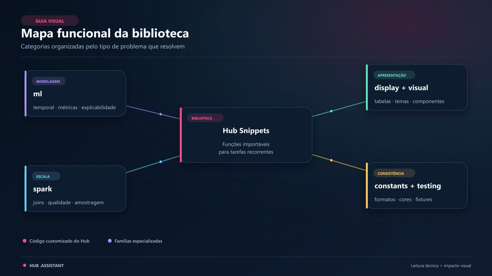
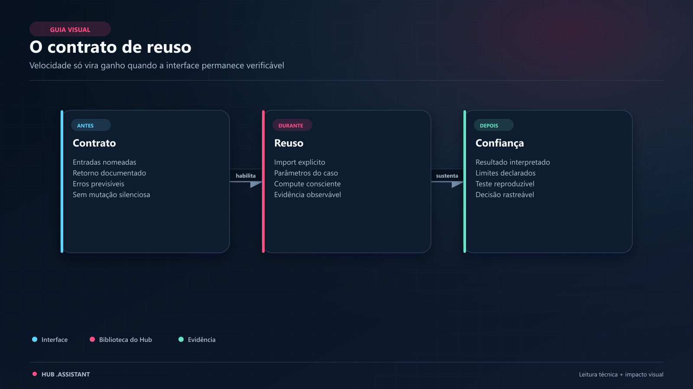

<a id="hub-snippets"></a>

# Hub Snippets

> A biblioteca matemática e algorítmica central do ecossistema `.assistant`: funções e classes reutilizáveis, revisadas e testadas para fluxos de Machine Learning e Big Data no Databricks.

> **CONTEÚDO CUSTOMIZADO PELO HUB.** `hub_snippets` não é uma biblioteca institucional da Databricks nem é carregada automaticamente pela Genie Code. O notebook precisa tornar o pacote visível ao Python e importar explicitamente a função desejada.

> **Rascunho de sprint 3 — não publicado.** Destino previsto: `ambiente_fonte/.assistant/hub_snippets/README.md`.

---

<a id="neste-guia"></a>

## 🧭 Neste Guia

**Pacote** é a árvore `hub_snippets`. **Módulo** é o arquivo `.py` da pasta do objeto. **Função/classe** é o que o `__init__.py` reexporta. Ver uma linha `from ... import ...` não ensina o contrato.

| Para entender... | Vá para... |
|---|---|
| o conceito e a estrutura de um snippet | [O que é um Snippet](#o-que-é-um-snippet-neste-ecossistema) |
| as categorias da biblioteca | [Mapa de Categorias](#mapa-de-categorias-do-hub-snippets) |
| quais objetos estão disponíveis | [Catálogo Detalhado](#catálogo-detalhado-por-categoria) |
| como importar e executar | [Passo a Passo Operacional](#passo-a-passo-operacional-como-usar-um-snippet) |
| runtime, dependências e custo | [Onde o Código Executa](#onde-o-código-executa-e-quanto-pode-custar) |
| dúvidas e limitações | [Perguntas Frequentes](#perguntas-frequentes-faq) |

**Percurso de quem nunca reutilizou módulo:** conceito → pasta de objeto → preparações P0/P1 → ficha format_br → passo a passo → família necessária. Os exemplos de outros tipos declaram seu preparo e seus efeitos.

---

<a id="o-que-é-um-snippet-neste-ecossistema"></a>

## 🧩 O que é um Snippet neste Ecossistema?

Na internet, “snippet” costuma ser trecho copiado. **Aqui, é peça de engenharia analítica com contrato:** API pública, implementação, exemplo e limites.

Copiar código espalha versões. Importar um módulo mantido concentra a correção. A responsabilidade de validar assinatura, volume e significado de negócio continua sua.

```text
┌─────────────────────────────────────────────────────────────────────────────┐
│                            O QUE DEFINE UM SNIPPET                          │
│                                                                             │
│   Efeito declarado · Lógica revisável · Execução adequada ao volume         │
│   Evidência delimitada nos testes e no notebook de exemplo                  │
└─────────────────────────────────────────────────────────────────────────────┘
```

Na campanha fictícia: em vez de implementar uma divisão sem explicitar datas, períodos e lacunas, você chama `temporal_split` com períodos de calendário.

---

<a id="arquitetura-e-o-padrão-pasta-de-objeto"></a>

## 🏛️ Arquitetura e o Padrão "Pasta de Objeto"


*Leitura da figura: `__init__.py` é o ponto estável de import; o `.py` homônimo é o motor; `exemplo_*.py` demonstra a chamada — não é o módulo importado.*

<a id="o-que-cada-arquivo-faz"></a>

### O que cada arquivo faz

1. **`__init__.py` (fachada).** Reexporta a API. Você lê para saber o nome público; não executa análise ao abrir.
2. **`nome_do_snippet.py` (motor).** Implementação, validações, docstring. Fonte da assinatura real.
3. **`exemplo_nome_do_snippet.py` (guia).** Dados sintéticos e saída observada. Ensina o contrato exercitado; não promete qualquer runtime.

Leitura guiada — `split_temporal/`:

- Comece pelo exemplo para ver `temporal_split(...)`.
- Confira parâmetros no motor (`train_pct`, `val_pct`, `gap_periods`, `period_unit`, `group_col`).
- Importe de `hub_snippets.ml.split_temporal`, não rode o exemplo como se fosse a biblioteca.

O [Catálogo de Helpers](../../../ambiente_fonte/.assistant/CATALOGO_HELPERS.md) é o índice canônico demanda → caminho.

---

<a id="mapa-de-categorias-do-hub-snippets"></a>

## 🗺️ Mapa de Categorias do Hub Snippets



*Leitura da figura: as seis categorias agrupam pelo tipo de problema, não por “importância”.*

| Categoria | Pergunta cotidiana | Não confundir com |
|---|---|---|
| `ml` | Como parto no tempo / meço / treino? | script de qualidade da tabela |
| `spark` | Como faço isso em DataFrame Spark? | pandas no driver |
| `display` | Como mostro tabela no notebook? | tema Plotly (`visual`) |
| `visual` | Como mantenho identidade gráfica? | cálculo de métrica (`ml`) |
| `constants` | Como formato número em pt-BR? | regra de negócio |
| `testing` | Como gero dado sintético? | dado real da campanha |

---

<a id="catálogo-detalhado-por-categoria"></a>

## 📚 Catálogo Detalhado por Categoria

Uma ficha apresenta problema, entrada preparada, interface real, chamada, retorno e limites. Assinaturas abaixo foram extraídas das implementações deste commit; nomes de tipos são documentação, não código para colar como definição de função. Imports públicos vêm da fachada da pasta, e exemplos específicos permitem aprofundar o comportamento.

<a id="preparação-dos-exemplos"></a>

### Preparação dos exemplos

<a id="preparo-p0"></a>
**P0 — localizar o pacote, no notebook Python.** Substitua apenas o diretório do usuário pelo caminho autorizado que contém `.assistant`. Bibliotecas externas não são instaladas por esse bloco. No repositório local, a raiz equivalente é `ambiente_fonte/.assistant`.

```python
from pathlib import Path
import sys
assistant_root = Path("/Workspace/Users/<username>/.assistant")
if not (assistant_root / "hub_snippets").is_dir():
    raise FileNotFoundError("A pasta escolhida não contém hub_snippets.")
if str(assistant_root) not in sys.path:
    sys.path.insert(0, str(assistant_root))
```

<a id="preparo-p1"></a>
**P1 — arrays e pandas pequenos, sem Spark nem escrita.** Probabilidades abaixo são valores escolhidos para uma conta conferível, não previsão de modelo treinado.

```python
import numpy as np
import pandas as pd
y_true = np.array([0, 0, 1, 1])
y_prob = np.array([0.1, 0.4, 0.6, 0.9])
```

<a id="preparo-p2"></a>
**P2 — calendário, após P1.** `mensal` contém 12 meses consecutivos, um valor por mês. `serie` amplia para 36 meses nos wrappers de forecasting. Esses exemplos temporais são adicionais à campanha de 20 eventos; não renomeiam silenciosamente seu grão.

```python
mensal = pd.DataFrame({
    "dt_evento": pd.date_range("2025-01-01", periods=12, freq="MS"),
    "valor_gasto": np.arange(1, 13, dtype=float),
})
serie = pd.DataFrame({
    "dt_evento": pd.date_range("2023-01-01", periods=36, freq="MS"),
    "valor_gasto": 10 + np.arange(36, dtype=float) + np.sin(np.arange(36)),
})
```

<a id="preparo-p3"></a>
**P3 — Spark: fixture da campanha, sem persistência.** Uma linha é um evento; event_id identifica a linha e id_cliente se repete legitimamente. Todos os scripts Spark desta seção usam a mesma SparkSession.

```python
from datetime import date, timedelta
from pyspark.sql import SparkSession, functions as F
spark = SparkSession.getActiveSession() or SparkSession.builder.getOrCreate()
linhas = [
    (f"e{i:02d}", f"c{i % 5:02d}", date(2026, 6, 1) + timedelta(days=i),
     None if i == 0 else "email", i % 2, float(i))
    for i in range(20)
]
campanha = spark.createDataFrame(linhas,
    "event_id string, id_cliente string, dt_evento date, canal string, respondeu int, valor_gasto double")
assert campanha.count() == 20
```

<a id="preparo-p4"></a>
**P4 — laboratório de modelos, após P1.** Execute só o exemplo do modelo escolhido e depois de conferir dependências/compute. Nenhum bloco instala pacotes. Tracking é desligado nas chamadas que o permitem. A divisão abaixo demonstra tipos e interface, não protocolo válido de avaliação temporal de clientes.

```python
rng = np.random.default_rng(42)
X = rng.normal(size=(200, 3))
y = (X[:, 0] + 0.2 * rng.normal(size=200) > 0).astype(int)
feature_names = ["x1", "x2", "x3"]
tabular = pd.DataFrame(X, columns=feature_names)
X_train, X_val = X[:160], X[160:]
y_train, y_val = y[:160], y[160:]
```

<a id="preparo-p5"></a>
**P5 — painéis e sobrevivência, após P1.** Cada ficha constrói explicitamente seu painel ou duração/evento antes de chamar o helper. São schemas adicionais, não colunas presumidas na campanha. Reveja censura e denominadores antes de adaptar.

Os exemplos com dependência opcional são **demonstrações de interface**. Uma execução local básica não certifica esses treinamentos nem a integração Databricks/MLflow. A evidência de revisão relaciona testes realmente executados e pendências, sem instalar tudo silenciosamente.


<a id="1-categoria-ml-machine-learning-e-estatística-aplicada"></a>

### 1. Categoria: `ml` (Machine Learning e Estatística Aplicada)

<a id="engenharia-temporal-e-séries-temporais"></a>

#### 🕒 Engenharia Temporal e Séries Temporais

<a id="lgbm_temporal"></a>

##### `lgbm_temporal`

**Problema e escolha.** Lags e médias móveis representam histórico conhecido. Apesar do nome do módulo, a função cria features: não treina LightGBM.

**Entrada e preparo.** Execute [P0](#preparo-p0) e [P2](#preparo-p2) antes desta célula. Os recursos e variáveis usados abaixo são os definidos nessa preparação; adapte nomes/tipos somente após confrontar o schema.

**Interface da implementação:**

```text
create_temporal_features(df: pd.DataFrame, target_col: str, date_col: str, lags: Optional[List[int]]=None, rolling_windows: Optional[List[int]]=None, calendar_features: bool=True, entity_cols: Optional[Sequence[str]]=None, *, date_format: Optional[str]=None, on_duplicate_dates: str='raise') -> pd.DataFrame
```

**Uso concreto:**

```python
from hub_snippets.ml.lgbm_temporal import create_temporal_features
features_tempo = create_temporal_features(
    mensal, target_col="valor_gasto", date_col="dt_evento",
    lags=[1], rolling_windows=[2], calendar_features=True,
)
print(features_tempo.head(4))
```

**Retorno e interpretação.** DataFrame pandas com histórico deslocado e calendário, em ordem cronológica. As primeiras linhas de lags/janelas podem ter nulos por falta de histórico; isso não é falha de carga.

**Efeitos, adaptação e quando não usar.** Defina entity_cols em painéis. Datas duplicadas precisam de política explícita; texto ambíguo exige date_format. Não usar o target contemporâneo como feature. O módulo não depende de LightGBM apenas por ter lgbm no nome.

[Implementação](../../../ambiente_fonte/.assistant/hub_snippets/ml/lgbm_temporal/lgbm_temporal.py) · [Notebook específico](../../../ambiente_fonte/.assistant/hub_snippets/ml/lgbm_temporal/exemplo_lgbm_temporal.py).

<a id="split_temporal"></a>

##### `split_temporal`

**Problema e escolha.** Dividir observações em períodos completos evita misturar o mesmo período entre treino e avaliação. Um split cronológico por índices também pode ser válido; o ganho aqui é explicitar a unidade e as lacunas.

**Entrada e preparo.** Execute [P0](#preparo-p0) e [P2](#preparo-p2) antes desta célula. Os recursos e variáveis usados abaixo são os definidos nessa preparação; adapte nomes/tipos somente após confrontar o schema.

**Interface da implementação:**

```text
temporal_split(df: pd.DataFrame, date_col: str, train_pct: float=0.7, val_pct: float=0.15, gap_periods: int=1, period_unit: str='M', *, group_col: Optional[str]=None) -> Tuple[pd.DataFrame, pd.DataFrame, pd.DataFrame]
```

**Uso concreto:**

```python
from hub_snippets.ml.split_temporal import temporal_split
treino, validacao, teste = temporal_split(
    mensal, date_col="dt_evento", train_pct=0.5, val_pct=0.25,
    gap_periods=1, period_unit="M",
)
assert (len(treino), len(validacao), len(teste)) == (6, 3, 1)
assert validacao["dt_evento"].min().month == 8
assert teste["dt_evento"].min().month == 12
```

**Retorno e interpretação.** Tupla de DataFrames pandas: janeiro–junho (6), agosto–outubro (3), dezembro (1). Julho e novembro ficam fora. Os percentuais são aplicados aos 12 períodos antes dos gaps, por isso o teste recebe um mês e não 25% das linhas.

**Efeitos, adaptação e quando não usar.** `group_col` remove de validação/teste entidades já vistas, podendo esvaziar partições. Omita somente quando repetição de entidade fizer parte da avaliação pretendida. Não existem parâmetros train_end/val_end. Poucos períodos ou gaps excessivos são erros explícitos.

[Implementação](../../../ambiente_fonte/.assistant/hub_snippets/ml/split_temporal/split_temporal.py) · [Notebook específico](../../../ambiente_fonte/.assistant/hub_snippets/ml/split_temporal/exemplo_split_temporal.py).

<a id="walk_forward"></a>

##### `walk_forward`

**Problema e escolha.** Repetir cortes temporais mostra sensibilidade do resultado à janela de avaliação; não é o mesmo que um holdout único.

**Entrada e preparo.** Execute [P0](#preparo-p0) e [P2](#preparo-p2) antes desta célula. Os recursos e variáveis usados abaixo são os definidos nessa preparação; adapte nomes/tipos somente após confrontar o schema.

**Interface da implementação:**

```text
walk_forward_cv(df: pd.DataFrame, date_col: str, target_col: str, model_fn: Callable[[pd.DataFrame, pd.DataFrame], Dict[str, Any]], min_train_periods: int=12, test_periods: int=1, step: int=1, gap: int=0, *, period_unit: str='M') -> List[Dict[str, Any]]
```

**Uso concreto:**

```python
from hub_snippets.ml.walk_forward import walk_forward_cv
def avaliar_media(passado, futuro):
    previsao = passado["valor_gasto"].mean()
    return {"mae": float((futuro["valor_gasto"] - previsao).abs().mean())}
validacoes = walk_forward_cv(
    mensal, "dt_evento", "valor_gasto", avaliar_media,
    min_train_periods=6, test_periods=1, step=1, gap=1, period_unit="M",
)
print(validacoes)
```

**Retorno e interpretação.** Lista de dicionários, um por fold, com limites e métricas retornadas pelo callback. O callback aprende a média apenas no passado; seu MAE não é performance de um modelo de produção.

**Efeitos, adaptação e quando não usar.** O custo cresce com folds e custo do model_fn. Ajustes de scaler/encoding também devem ocorrer dentro do treino de cada fold. Não escolher a configuração usando o teste final.

[Implementação](../../../ambiente_fonte/.assistant/hub_snippets/ml/walk_forward/walk_forward.py) · [Notebook específico](../../../ambiente_fonte/.assistant/hub_snippets/ml/walk_forward/exemplo_walk_forward.py).

<a id="vintage_analysis"></a>

##### `vintage_analysis`

**Problema e escolha.** Coortes devem ser comparadas pela mesma maturidade. O painel precisa distinguir incidência e evento já acumulado.

**Entrada e preparo.** Execute [P0](#preparo-p0) e [P5](#preparo-p5) antes desta célula. Os recursos e variáveis usados abaixo são os definidos nessa preparação; adapte nomes/tipos somente após confrontar o schema.

**Interface da implementação:**

```text
build_vintage_table(df: pd.DataFrame, contract_id: str, dt_originacao: str, dt_referencia: str, target: str, safra_grain: str='month', mob_col: Optional[str]=None, target_is_cumulative: bool=False) -> pd.DataFrame
plot_vintage_curves(vintage_df: pd.DataFrame, title: str='Curvas de Maturação por Safra', max_mob: int=24, top_n_safras: Optional[int]=None) -> Any
plot_vintage_heatmap(vintage_df: pd.DataFrame, title: str='Heatmap de Safras', max_mob: int=24, metric: str='taxa_acumulada') -> Any
compare_safras(vintage_df: pd.DataFrame, mob_checkpoints: Optional[List[int]]=None) -> pd.DataFrame
```

**Uso concreto:**

```python
from hub_snippets.ml.vintage_analysis import build_vintage_table
painel = pd.DataFrame({
    "contrato": ["a", "a", "b", "b"],
    "origem": pd.to_datetime(["2026-01-01"] * 4),
    "referencia": pd.to_datetime(["2026-01-01", "2026-02-01"] * 2),
    "evento": [0, 1, 0, 0],
})
safra = build_vintage_table(painel, "contrato", "origem", "referencia", "evento")
print(safra)
```

**Retorno e interpretação.** DataFrame safra × MOB com contagens e taxas. No segundo mês um dos dois contratos teve evento; o leitor deve conferir denominador e escala das colunas, não somar taxas entre meses.

**Efeitos, adaptação e quando não usar.** Este painel adicional não é o schema da campanha. Censura não é zero de evento. Funções de curvas/heatmap recebem o resultado já agregado e não mudam o contrato do denominador.

[Implementação](../../../ambiente_fonte/.assistant/hub_snippets/ml/vintage_analysis/vintage_analysis.py) · [Notebook específico](../../../ambiente_fonte/.assistant/hub_snippets/ml/vintage_analysis/exemplo_vintage_analysis.py).

<a id="prophet_wrapper"></a>

##### `prophet_wrapper`

**Problema e escolha.** Forecasting usa série ordenada e frequência explícita. Feriado e sazonalidade não devem ser presumidos corretos para qualquer série.

**Entrada e preparo.** Execute [P0](#preparo-p0) e [P2 — opcional](#preparo-p2) antes desta célula. Os recursos e variáveis usados abaixo são os definidos nessa preparação; adapte nomes/tipos somente após confrontar o schema.

**Interface da implementação:**

```text
train_prophet(df: pd.DataFrame, ds_col: str='ds', y_col: str='y', periods: int=12, freq: str='MS', yearly: bool=True, weekly: bool=False, country_holidays: str='BR', changepoint_prior: float=0.05, log_mlflow: bool=True) -> Tuple
```

**Uso concreto:**

```python
from hub_snippets.ml.prophet_wrapper import train_prophet
modelo_serie, previsao, metricas_serie = train_prophet(
    serie, ds_col="dt_evento", y_col="valor_gasto", periods=2,
    freq="MS", yearly=False, weekly=False, country_holidays="BR", log_mlflow=False,
)
print(previsao[["ds", "yhat"]].tail(2))
```

**Retorno e interpretação.** Tupla (modelo, previsão pandas, métricas). As métricas do wrapper são in-sample; previsão futura não significa erro futuro já medido.

**Efeitos, adaptação e quando não usar.** O import de Prophet ocorre na chamada; MLflow é importado no topo do wrapper. São falhas de dependência distintas. Avalie horizonte fora da amostra e frequência antes de usar a série real.

[Implementação](../../../ambiente_fonte/.assistant/hub_snippets/ml/prophet_wrapper/prophet_wrapper.py) · [Notebook específico](../../../ambiente_fonte/.assistant/hub_snippets/ml/prophet_wrapper/exemplo_prophet_wrapper.py).

<a id="arima_wrapper"></a>

##### `arima_wrapper`

**Problema e escolha.** ARIMA modela dependência serial; sazonalidade e periodicidade precisam ser definidas pelo dado.

**Entrada e preparo.** Execute [P0](#preparo-p0) e [P2 — opcional](#preparo-p2) antes desta célula. Os recursos e variáveis usados abaixo são os definidos nessa preparação; adapte nomes/tipos somente após confrontar o schema.

**Interface da implementação:**

```text
train_arima(series: np.ndarray, m: int=12, forecast_periods: int=6, seasonal: bool=True, log_mlflow: bool=True) -> Tuple
```

**Uso concreto:**

```python
from hub_snippets.ml.arima_wrapper import train_arima
modelo_arima, futuro_arima, erro_ajuste = train_arima(
    serie["valor_gasto"].to_numpy(), seasonal=False, forecast_periods=2, log_mlflow=False,
)
print(futuro_arima)
```

**Retorno e interpretação.** Tupla (modelo pmdarima, array de previsões, métricas). Duas previsões demonstram horizonte solicitado; métricas de ajuste não substituem backtest.

**Efeitos, adaptação e quando não usar.** pmdarima é exigido quando executado. Busca automática pode testar vários modelos; diminua escopo conscientemente. Zeros no denominador de métricas percentuais exigem atenção.

[Implementação](../../../ambiente_fonte/.assistant/hub_snippets/ml/arima_wrapper/arima_wrapper.py) · [Notebook específico](../../../ambiente_fonte/.assistant/hub_snippets/ml/arima_wrapper/exemplo_arima_wrapper.py).

<a id="risco-de-crédito-e-scorecards"></a>

#### 📊 Risco de Crédito e Scorecards

<a id="woe_iv_calculator"></a>

##### `woe_iv_calculator`

**Problema e escolha.** WOE compara a composição das classes em uma faixa; IV resume a separação. Faixas e direção do target precisam ser definidas antes de interpretar o índice.

**Entrada e preparo.** Execute [P0](#preparo-p0) e [P3](#preparo-p3) antes desta célula. Os recursos e variáveis usados abaixo são os definidos nessa preparação; adapte nomes/tipos somente após confrontar o schema.

**Interface da implementação:**

```text
calculate_woe_iv(df: DataFrame, feature_col: str, target_col: str, smoothing: float=0.5) -> Tuple[DataFrame, float]
classify_iv(iv: float) -> str
```

**Uso concreto:**

```python
from hub_snippets.ml.woe_iv_calculator import calculate_woe_iv
faixas, iv = calculate_woe_iv(campanha, "canal", "respondeu", smoothing=0.5)
faixas.show()
print(iv)
```

**Retorno e interpretação.** Tupla: DataFrame Spark por categoria/faixa e IV escalar. Smoothing evita razões degeneradas, mas não certifica a qualidade da variável.

**Efeitos, adaptação e quando não usar.** Aprenda binning/WOE apenas no treino; usar target de teste causa leakage. Para build_scorecard, a tabela pandas precisa de faixa/woe; o output Spark usa o nome original da feature. Colete apenas a tabela pequena de faixas, nunca a base inteira.

[Implementação](../../../ambiente_fonte/.assistant/hub_snippets/ml/woe_iv_calculator/woe_iv_calculator.py) · [Notebook específico](../../../ambiente_fonte/.assistant/hub_snippets/ml/woe_iv_calculator/exemplo_woe_iv_calculator.py).

<a id="scorecard_builder"></a>

##### `scorecard_builder`

**Problema e escolha.** Converter coeficientes logísticos em pontos requer conhecer qual evento é ruim, odds de referência e pontos para dobrar odds (PDO).

**Entrada e preparo.** Execute [P0](#preparo-p0) e [P1](#preparo-p1) antes desta célula. Os recursos e variáveis usados abaixo são os definidos nessa preparação; adapte nomes/tipos somente após confrontar o schema.

**Interface da implementação:**

```text
build_scorecard(coefs: np.ndarray, intercept: float, feature_names: List[str], woe_tables: Dict[str, pd.DataFrame], pdo: int=20, base_score: int=600, base_odds: int=50, event_is_bad: bool=True) -> pd.DataFrame
```

**Uso concreto:**

```python
from hub_snippets.ml.scorecard_builder import build_scorecard
woe = {"faixa_risco": pd.DataFrame({"faixa": ["A", "B"], "woe": [-0.2, 0.2]})}
cartao = build_scorecard(
    coefs=np.array([0.8]), intercept=-0.3, feature_names=["faixa_risco"],
    woe_tables=woe, pdo=20, base_score=600, base_odds=50, event_is_bad=True,
)
print(cartao)
```

**Retorno e interpretação.** DataFrame de feature, faixa, WOE e pontos. Coeficiente, intercepto e WOE acima são sintéticos declarados; a tabela demonstra escala de pontos, não um modelo estimado.

**Efeitos, adaptação e quando não usar.** Não interpretar como aprovação regulatória. Verifique sinal, evento e fórmula de odds. Alterar PDO ou odds muda a escala; não é recalibração empírica do modelo.

[Implementação](../../../ambiente_fonte/.assistant/hub_snippets/ml/scorecard_builder/scorecard_builder.py) · [Notebook específico](../../../ambiente_fonte/.assistant/hub_snippets/ml/scorecard_builder/exemplo_scorecard_builder.py).

<a id="score_bands"></a>

##### `score_bands`

**Problema e escolha.** Faixas transformam scores em grupos auditáveis; precisam manter direção de risco explícita.

**Entrada e preparo.** Execute [P0](#preparo-p0) e [P1](#preparo-p1) antes desta célula. Os recursos e variáveis usados abaixo são os definidos nessa preparação; adapte nomes/tipos somente após confrontar o schema.

**Interface da implementação:**

```text
generate_score_bands(scores: np.ndarray, y_true: np.ndarray, n_bands: int=10, labels: Optional[Sequence[str]]=None, *, higher_score_is_better: bool=True) -> pd.DataFrame
```

**Uso concreto:**

```python
from hub_snippets.ml.score_bands import generate_score_bands
bandas = generate_score_bands(y_prob, y_true, n_bands=2, higher_score_is_better=True)
print(bandas)
```

**Retorno e interpretação.** DataFrame agregado de faixas, população e desempenho observado. Aqui score maior corresponde a maior probabilidade da classe positiva, não significa universalmente menor risco de crédito.

**Efeitos, adaptação e quando não usar.** Confirme a interpretação do evento antes de selecionar higher_score_is_better. Score constante é recusado. Poucos valores distintos podem impedir o número solicitado de faixas; não invente limites de negócio a partir de quatro linhas.

[Implementação](../../../ambiente_fonte/.assistant/hub_snippets/ml/score_bands/score_bands.py) · [Notebook específico](../../../ambiente_fonte/.assistant/hub_snippets/ml/score_bands/exemplo_score_bands.py).

<a id="avaliação-métricas-e-visualização"></a>

#### 📈 Avaliação, Métricas e Visualização

<a id="metrics_report"></a>

##### `metrics_report`

**Problema e escolha.** Métricas medem aspectos diferentes: ranking, classificação em um corte, calibração ou erro de previsão. Unidade e população importam.

**Entrada e preparo.** Execute [P0](#preparo-p0) e [P1](#preparo-p1) antes desta célula. Os recursos e variáveis usados abaixo são os definidos nessa preparação; adapte nomes/tipos somente após confrontar o schema.

**Interface da implementação:**

```text
calculate_binary_metrics(y_true: np.ndarray, y_prob: np.ndarray, threshold: float=0.5) -> Dict[str, float]
calculate_regression_metrics(y_true: np.ndarray, y_pred: np.ndarray) -> Dict[str, float]
```

**Uso concreto:**

```python
from hub_snippets.ml.metrics_report import calculate_binary_metrics, calculate_regression_metrics
metricas = calculate_binary_metrics(y_true, y_prob, threshold=0.5)
assert metricas["auc_roc"] == 1.0
assert metricas["ks_pct"] == 100.0
regressao = calculate_regression_metrics(np.array([1., 2., 3.]), np.array([1., 2., 3.]))
print(metricas)
print(regressao)
```

**Retorno e interpretação.** Dicionários. As quatro probabilidades ordenam perfeitamente as classes: AUC=1, KS=100 pontos percentuais; isso demonstra cálculo, não validade de um modelo. Brier/LogLoss ainda refletem probabilidades não extremas.

**Efeitos, adaptação e quando não usar.** Não multiplicar ks_pct por 100. Verifique classes presentes, valores finitos e escala. Uma boa AUC não prova calibração, causalidade ou estabilidade temporal.

[Implementação](../../../ambiente_fonte/.assistant/hub_snippets/ml/metrics_report/metrics_report.py) · [Notebook específico](../../../ambiente_fonte/.assistant/hub_snippets/ml/metrics_report/exemplo_metrics_report.py).

<a id="curves_plotly"></a>

##### `curves_plotly`

**Problema e escolha.** ROC/PR, lift e KS respondem a perguntas distintas sobre ranking e escolha de corte. A curva deve preservar a população usada na métrica.

**Entrada e preparo.** Execute [P0](#preparo-p0) e [P1](#preparo-p1) antes desta célula. Os recursos e variáveis usados abaixo são os definidos nessa preparação; adapte nomes/tipos somente após confrontar o schema.

**Interface da implementação:**

```text
plot_roc_curve(y_true: np.ndarray, y_prob: np.ndarray, title: str='Curva ROC', show_auc: bool=True, n: Optional[int]=None) -> go.Figure
plot_pr_curve(y_true: np.ndarray, y_prob: np.ndarray, title: str='Curva Precision-Recall', n: Optional[int]=None) -> go.Figure
plot_lift_curve(y_true: np.ndarray, y_prob: np.ndarray, title: str='Curva de Lift', n_bins: int=10, n: Optional[int]=None) -> go.Figure
plot_ks_curve(y_true: np.ndarray, y_prob: np.ndarray, title: str='Curva KS', n: Optional[int]=None) -> go.Figure
```

**Uso concreto:**

```python
from hub_snippets.ml.curves_plotly import plot_roc_curve, plot_pr_curve
roc = plot_roc_curve(y_true, y_prob, title="ROC — quatro registros sintéticos")
pr = plot_pr_curve(y_true, y_prob, title="PR — demonstração de contrato")
roc.show()
pr.show()
```

**Retorno e interpretação.** Figuras Plotly separadas. Os eixos representam taxas e probabilidades/recall conforme a curva, não montantes financeiros. Compare com AUC do exemplo anterior.

**Efeitos, adaptação e quando não usar.** Roda no driver/navegador; amostras e arrays precisam estar limitados. Para classes raras, PR depende da prevalência. Exibir não salva automaticamente imagem em arquivo.

[Implementação](../../../ambiente_fonte/.assistant/hub_snippets/ml/curves_plotly/curves_plotly.py) · [Notebook específico](../../../ambiente_fonte/.assistant/hub_snippets/ml/curves_plotly/exemplo_curves_plotly.py).

<a id="explainability_report"></a>

##### `explainability_report`

**Problema e escolha.** Relatório executivo traduz uma importância já calculada; ele não estima SHAP nem valida o modelo.

**Entrada e preparo.** Execute [P0](#preparo-p0) e [P1](#preparo-p1) antes desta célula. Os recursos e variáveis usados abaixo são os definidos nessa preparação; adapte nomes/tipos somente após confrontar o schema.

**Interface da implementação:**

```text
generate_executive_report(shap_importance: pd.DataFrame, feature_business_names: Dict[str, str], target_description: str, model_metric: float, metric_name: str='AUC', shap_values: Optional[np.ndarray]=None, X: Optional[np.ndarray]=None, feature_names: Optional[List[str]]=None) -> str
generate_technical_summary(shap_importance: pd.DataFrame, native_importance: Optional[pd.DataFrame]=None) -> str
```

**Uso concreto:**

```python
from hub_snippets.ml.explainability_report import generate_executive_report
importancia = pd.DataFrame({"feature": ["x1", "x2"], "pct_importance": [60., 40.]})
texto = generate_executive_report(
    importancia, {"x1": "Atributo sintético 1", "x2": "Atributo sintético 2"},
    target_description="resposta fictícia", model_metric=0.75,
)
print(texto)
```

**Retorno e interpretação.** String Markdown. Importâncias e métrica são valores hipotéticos para exercitar o formato, não evidência de um treino. Percentual de importância normalizada não é percentual de poder preditivo.

**Efeitos, adaptação e quando não usar.** Forneça nomes de negócio confirmados e reveja o significado das explicações. Não invente direção quando SHAP/X não foram fornecidos. Persistir ou publicar o texto é outra ação.

[Implementação](../../../ambiente_fonte/.assistant/hub_snippets/ml/explainability_report/explainability_report.py) · [Notebook específico](../../../ambiente_fonte/.assistant/hub_snippets/ml/explainability_report/exemplo_explainability_report.py).

<a id="shap_explainer"></a>

##### `shap_explainer`

**Problema e escolha.** Contribuições SHAP dependem do modelo, da saída escolhida e da referência usada. Importância não estabelece causalidade.

**Entrada e preparo.** Execute [P0](#preparo-p0) e [P4 — opcional](#preparo-p4) antes desta célula. Os recursos e variáveis usados abaixo são os definidos nessa preparação; adapte nomes/tipos somente após confrontar o schema.

**Interface da implementação:**

```text
compute_shap(model, X: np.ndarray, feature_names: List[str], model_type: str='tree', max_samples: int=5000, *, task: str='classification', output_index: Optional[int]=None) -> Tuple[np.ndarray, float]
get_feature_importance_shap(shap_values: np.ndarray, feature_names: List[str], top_n: int=20) -> pd.DataFrame
plot_shap_global(shap_values: np.ndarray, X: np.ndarray, feature_names: List[str], plot_type: str='beeswarm', max_display: int=20, save_path: Optional[str]=None)
plot_shap_local(shap_values: np.ndarray, base_value: float, X: np.ndarray, feature_names: List[str], idx: int, save_path: Optional[str]=None)
```

**Uso concreto:**

```python
from sklearn.ensemble import RandomForestClassifier
from hub_snippets.ml.shap_explainer import compute_shap, get_feature_importance_shap
modelo_shap = RandomForestClassifier(n_estimators=10, max_depth=2, random_state=42).fit(X_train, y_train)
valores_shap, valor_base = compute_shap(
    modelo_shap, X_val, feature_names, max_samples=40,
    model_type="tree", task="classification", output_index=1,
)
print(get_feature_importance_shap(valores_shap, feature_names))
```

**Retorno e interpretação.** Tupla de valores e referência da saída selecionada, seguida de DataFrame de importância. O modelo foi preparado na própria célula; não há objeto treinado implícito.

**Efeitos, adaptação e quando não usar.** SHAP é opcional exigido quando chamado. Confira shape/classe, dependências e compatibilidade da versão. save_path em gráficos causa escrita explícita; não o preencha sem intenção. O exemplo não registra modelo no MLflow.

[Implementação](../../../ambiente_fonte/.assistant/hub_snippets/ml/shap_explainer/shap_explainer.py) · [Notebook específico](../../../ambiente_fonte/.assistant/hub_snippets/ml/shap_explainer/exemplo_shap_explainer.py).

<a id="monitoramento-e-mlops"></a>

#### 🛡️ Monitoramento e MLOps

<a id="performance_monitor"></a>

##### `performance_monitor`

**Problema e escolha.** Comparar uma métrica com referência exige direção e escala; uma melhora não deve disparar alerta por valor absoluto do delta.

**Entrada e preparo.** Execute [P0](#preparo-p0) e [P1](#preparo-p1) antes desta célula. Os recursos e variáveis usados abaixo são os definidos nessa preparação; adapte nomes/tipos somente após confrontar o schema.

**Interface da implementação:**

```text
selecionar_metricas_do_relatorio(relatorio: Dict[str, Any], politica: Optional[Dict[str, Any]]=None, *, metricas_obrigatorias: Optional[List[str]]=None) -> Dict[str, float]
PerformanceMonitor(baseline_metrics: Dict[str, float], model_name: str='model', *, policy: Optional[Dict[str, Dict[str, Any]]]=None, consecutive_alert_periods: int=3, require_complete_metrics: bool=True)
```

**Uso concreto:**

```python
from hub_snippets.ml.performance_monitor import PerformanceMonitor, selecionar_metricas_do_relatorio
politica = {"auc": {"warning": 0.03, "critical": 0.05, "direction": "higher", "delta": "absolute"}}
base = selecionar_metricas_do_relatorio({"auc_roc": 0.80}, politica, metricas_obrigatorias=["auc"])
monitor = PerformanceMonitor(base, model_name="demonstracao", policy=politica)
monitor.add_period("2026-06", {"auc": 0.78})
print(monitor.generate_report())
```

**Retorno e interpretação.** Objeto que acumula períodos e gera relatório/status. O adaptador converte auc_roc em auc e mantém somente métricas com política. A queda didática de 0,02 é menor que warning=0,03.

**Efeitos, adaptação e quando não usar.** A política acima é exemplo, não regra Databricks. O helper produz diagnóstico, não agenda coleta nem envia notificações. Uma recomendação de investigar/retreinar não é autorização de promoção.

[Implementação](../../../ambiente_fonte/.assistant/hub_snippets/ml/performance_monitor/performance_monitor.py) · [Notebook específico](../../../ambiente_fonte/.assistant/hub_snippets/ml/performance_monitor/exemplo_performance_monitor.py).

<a id="drift_detection"></a>

##### `drift_detection`

**Problema e escolha.** PSI/CSI/KS driver-side atendem arrays e amostras já limitados. Para grandes tabelas, prefira a implementação Spark.

**Entrada e preparo.** Execute [P0](#preparo-p0) e [P1](#preparo-p1) antes desta célula. Os recursos e variáveis usados abaixo são os definidos nessa preparação; adapte nomes/tipos somente após confrontar o schema.

**Interface da implementação:**

```text
calculate_psi(reference: np.ndarray, current: np.ndarray, n_bins: int=10, eps: float=1e-06) -> float
calculate_ks(reference: np.ndarray, current: np.ndarray) -> Tuple[float, float]
calculate_csi(reference: pd.Series, current: pd.Series, eps: float=1e-06) -> float
detect_drift_all_features(df_reference: pd.DataFrame, df_current: pd.DataFrame, feature_cols: List[str], numeric_cols: Optional[List[str]]=None, categorical_cols: Optional[List[str]]=None, psi_threshold: Optional[float]=None, ks_threshold: Optional[float]=None, *, severe_psi_threshold: Optional[float]=None, severe_ks_threshold: Optional[float]=None, min_non_null: int=10) -> pd.DataFrame
```

**Uso concreto:**

```python
from hub_snippets.ml.drift_detection import calculate_psi, calculate_csi
referencia = np.arange(20, dtype=float)
assert abs(calculate_psi(referencia, referencia.copy(), n_bins=4)) < 1e-12
print(calculate_csi(pd.Series(["a", "a", "b"]), pd.Series(["a", "b", "b"])))
```

**Retorno e interpretação.** Índices numéricos; distribuições idênticas dão zero de PSI. CSI compara composição categórica, sem automaticamente concluir perda de performance.

**Efeitos, adaptação e quando não usar.** Não trazer uma tabela grande para o driver apenas para usar esta versão. Faixas, ausência e limites precisam ser consistentes entre períodos; significância de KS depende também de tamanho amostral.

[Implementação](../../../ambiente_fonte/.assistant/hub_snippets/ml/drift_detection/drift_detection.py) · [Notebook específico](../../../ambiente_fonte/.assistant/hub_snippets/ml/drift_detection/exemplo_drift_detection.py).

<a id="mlflow_run"></a>

##### `mlflow_run`

**Problema e escolha.** Um run precisa permitir reconstruir dataset, split, parâmetros, métricas, modelo e limitações. O wrapper impõe uma política local de completude.

**Entrada e preparo.** Execute [P0](#preparo-p0) e [P1](#preparo-p1) antes desta célula. Os recursos e variáveis usados abaixo são os definidos nessa preparação; adapte nomes/tipos somente após confrontar o schema.

**Interface da implementação:**

```text
run_governado(nome: str, *, dataset: str, split: str, limitacoes: Iterable[str], experimento: Optional[str]=None, exigir_completo: bool=True) -> Iterator[_RunGovernado]
```

**Uso concreto:**

```python
from hub_snippets.ml.mlflow_run import run_governado
# Caso negativo: a ausência de limitações deve ser recusada antes de abrir run.
try:
    with run_governado("incompleto", dataset="sintético", split="didático", limitacoes=[]):
        raise AssertionError("O contrato deveria ter sido recusado antes de abrir o bloco.")
except ValueError as erro:
    print(erro)
```

**Retorno e interpretação.** O exemplo exercita recusa sem criar run. No caminho autorizado completo, o contexto fornece métodos parametros, metricas e modelo; o notebook específico demonstra o fluxo e registra a evidência histórica.

**Efeitos, adaptação e quando não usar.** Abertura de run e logging persistem informação: não executar por reflexo. O exemplo histórico registra sucesso em 14/08/2026 e falha posterior de configuração MLflow; isso não é proibição geral do Free. O flavor do wrapper é sklearn: confira compatibilidade antes de registrar boosters ou redes.

[Implementação](../../../ambiente_fonte/.assistant/hub_snippets/ml/mlflow_run/mlflow_run.py) · [Notebook específico](../../../ambiente_fonte/.assistant/hub_snippets/ml/mlflow_run/exemplo_mlflow_run.py).

<a id="não-supervisionado-e-anomalias"></a>

#### 🔍 Não Supervisionado e Anomalias

<a id="clustering_suite"></a>

##### `clustering_suite`

**Problema e escolha.** Agrupar observa semelhança, não cria classes verdadeiras. Escolha k e escala segundo a geometria do problema.

**Entrada e preparo.** Execute [P0](#preparo-p0) e [P4](#preparo-p4) antes desta célula. Os recursos e variáveis usados abaixo são os definidos nessa preparação; adapte nomes/tipos somente após confrontar o schema.

**Interface da implementação:**

```text
select_k(X_scaled: np.ndarray, k_range: range=range(2, 11), method: str='both') -> Dict[str, object]
run_clustering_pipeline(df: pd.DataFrame, feature_cols: List[str], k: Optional[int]=None, k_range: range=range(2, 11), algorithm: str='kmeans', scaler: str='standard', log_mlflow: bool=True) -> Dict[str, object]
```

**Uso concreto:**

```python
from hub_snippets.ml.clustering_suite import run_clustering_pipeline
agrupamento = run_clustering_pipeline(tabular, feature_names, k=2, log_mlflow=False)
print(agrupamento.keys())
```

**Retorno e interpretação.** Dicionário com labels, modelo, scaler e métricas. Verifique número de labels igual ao número de linhas; o identificador de cluster não é uma ordenação de valor de cliente.

**Efeitos, adaptação e quando não usar.** Escalas influenciam distância; selecione e ajuste usando população pertinente. k fixo aqui evita busca extensa. Treino é local e tracking foi explicitamente desligado.

[Implementação](../../../ambiente_fonte/.assistant/hub_snippets/ml/clustering_suite/clustering_suite.py) · [Notebook específico](../../../ambiente_fonte/.assistant/hub_snippets/ml/clustering_suite/exemplo_clustering_suite.py).

<a id="cluster_profiling"></a>

##### `cluster_profiling`

**Problema e escolha.** Interpretar grupos requer compará-los com a população e observar quais atributos realmente os diferenciam.

**Entrada e preparo.** Execute [P0](#preparo-p0) e [P4](#preparo-p4) antes desta célula. Os recursos e variáveis usados abaixo são os definidos nessa preparação; adapte nomes/tipos somente após confrontar o schema.

**Interface da implementação:**

```text
profile_clusters(df: pd.DataFrame, feature_cols: List[str], cluster_col: str='cluster_id') -> pd.DataFrame
top_differentiators(profiles_df: pd.DataFrame, cluster_id: int, top_n: int=5) -> pd.DataFrame
```

**Uso concreto:**

```python
from hub_snippets.ml.cluster_profiling import profile_clusters, top_differentiators
rotulada = tabular.assign(cluster_id=(tabular["x1"] > 0).astype(int))
perfis = profile_clusters(rotulada, feature_names, cluster_col="cluster_id")
print(perfis)
print(top_differentiators(perfis, cluster_id=1, top_n=2))
```

**Retorno e interpretação.** DataFrames de perfil e maiores diferenciais. A separação pela x1 é artificial e declarada; o perfil descreve esse corte, não resultado de clustering treinado.

**Efeitos, adaptação e quando não usar.** Reveja tamanhos dos grupos, médias de referência e dispersão. Um diferencial grande num grupo pequeno pode ser instável; não o transforme automaticamente em persona comercial.

[Implementação](../../../ambiente_fonte/.assistant/hub_snippets/ml/cluster_profiling/cluster_profiling.py) · [Notebook específico](../../../ambiente_fonte/.assistant/hub_snippets/ml/cluster_profiling/exemplo_cluster_profiling.py).

<a id="isolation_forest"></a>

##### `isolation_forest`

**Problema e escolha.** Anomalia significa observação incomum segundo o modelo, não fraude comprovada.

**Entrada e preparo.** Execute [P0](#preparo-p0) e [P4](#preparo-p4) antes desta célula. Os recursos e variáveis usados abaixo são os definidos nessa preparação; adapte nomes/tipos somente após confrontar o schema.

**Interface da implementação:**

```text
train_isolation_forest(df: pd.DataFrame, feature_cols: List[str], contamination: float=0.01, n_estimators: int=200, max_samples: str='auto', scaler: str='standard', log_mlflow: bool=True) -> Dict[str, object]
profile_anomalies(df: pd.DataFrame, feature_cols: List[str], scores: np.ndarray, labels: np.ndarray, top_n: int=50) -> pd.DataFrame
```

**Uso concreto:**

```python
from hub_snippets.ml.isolation_forest import train_isolation_forest
anomalias = train_isolation_forest(tabular, feature_names, contamination=0.05,
                                   n_estimators=20, log_mlflow=False)
print(anomalias.keys())
```

**Retorno e interpretação.** Dicionário com scores, labels, modelo e estatísticas. Os 5% são parâmetro didático de contaminação, não taxa conhecida de fraude.

**Efeitos, adaptação e quando não usar.** Revise escala, população e casos individualmente. O treinamento roda no driver e consome memória proporcional à amostra; nenhuma decisão adversa deve ser automatizada com esta demonstração.

[Implementação](../../../ambiente_fonte/.assistant/hub_snippets/ml/isolation_forest/isolation_forest.py) · [Notebook específico](../../../ambiente_fonte/.assistant/hub_snippets/ml/isolation_forest/exemplo_isolation_forest.py).

<a id="umap_viz"></a>

##### `umap_viz`

**Problema e escolha.** Projeção reduz dimensionalidade para visualizar vizinhanças; distâncias globais e áreas no gráfico não preservam necessariamente o espaço original.

**Entrada e preparo.** Execute [P0](#preparo-p0) e [P4 — opcional](#preparo-p4) antes desta célula. Os recursos e variáveis usados abaixo são os definidos nessa preparação; adapte nomes/tipos somente após confrontar o schema.

**Interface da implementação:**

```text
compute_umap(X: np.ndarray, n_components: int=2, n_neighbors: int=15, min_dist: float=0.1) -> np.ndarray
plot_umap_clusters(X_scaled: np.ndarray, labels: np.ndarray, title: str='Clusters (UMAP 2D)', cluster_names: Optional[List[str]]=None, point_size: int=3, n: Optional[int]=None) -> go.Figure
```

**Uso concreto:**

```python
from hub_snippets.ml.umap_viz import compute_umap
coordenadas = compute_umap(X_train, n_components=2, n_neighbors=5, min_dist=0.1)
assert coordenadas.shape == (160, 2)
print(coordenadas[:3])
```

**Retorno e interpretação.** Array com duas coordenadas por observação. Não são duas features com significado de negócio; são uma representação para visualização.

**Efeitos, adaptação e quando não usar.** umap-learn é exigido na chamada. Padronize as features quando pertinente e não use separação visual como prova de classes verdadeiras. Redução pode ser custosa em população grande.

[Implementação](../../../ambiente_fonte/.assistant/hub_snippets/ml/umap_viz/umap_viz.py) · [Notebook específico](../../../ambiente_fonte/.assistant/hub_snippets/ml/umap_viz/exemplo_umap_viz.py).

<a id="autoencoder_anomaly"></a>

##### `autoencoder_anomaly`

**Problema e escolha.** Reconstrução aprende o padrão de uma população de referência presumida normal; erro alto não define fraude.

**Entrada e preparo.** Execute [P0](#preparo-p0) e [P4 — opcional](#preparo-p4) antes desta célula. Os recursos e variáveis usados abaixo são os definidos nessa preparação; adapte nomes/tipos somente após confrontar o schema.

**Interface da implementação:**

```text
Autoencoder(input_dim: int, encoding_dim: int=16, hidden_dims: list=None)
train_autoencoder_anomaly(X_train_normal: np.ndarray, X_test: np.ndarray, encoding_dim: int=16, epochs: int=100, batch_size: int=256, lr: float=0.001, patience: int=10, threshold_percentile: float=95.0, log_mlflow: bool=True) -> Tuple[Autoencoder, float, np.ndarray]
```

**Uso concreto:**

```python
from hub_snippets.ml.autoencoder_anomaly import train_autoencoder_anomaly
rede, limiar, scores = train_autoencoder_anomaly(
    X_train.astype("float32"), X_val.astype("float32"),
    encoding_dim=2, epochs=2, batch_size=32, patience=1, log_mlflow=False,
)
print(limiar, len(scores))
```

**Retorno e interpretação.** Tupla (modelo, threshold de reconstrução, scores do teste). Dois epochs exercitam execução, não demonstram convergência ou detecção válida.

**Efeitos, adaptação e quando não usar.** Treino local PyTorch; memória/CPU/GPU e escala precisam ser controladas. Se X_train contém anomalias não revisadas, a premissa da função fica comprometida. Tracking foi desligado.

[Implementação](../../../ambiente_fonte/.assistant/hub_snippets/ml/autoencoder_anomaly/autoencoder_anomaly.py) · [Notebook específico](../../../ambiente_fonte/.assistant/hub_snippets/ml/autoencoder_anomaly/exemplo_autoencoder_anomaly.py).

<a id="treinadores-e-busca"></a>

#### Treinadores e busca

<a id="train_lgbm"></a>

##### `train_lgbm`

**Problema e escolha.** Treinar um baseline LightGBM permite comparar uma implementação conhecida antes de sofisticar a busca. O wrapper não define a população nem elimina leakage.

**Entrada e preparo.** Execute [P0](#preparo-p0) e [P4 — opcional](#preparo-p4) antes desta célula. Os recursos e variáveis usados abaixo são os definidos nessa preparação; adapte nomes/tipos somente após confrontar o schema.

**Interface da implementação:**

```text
train_lightgbm_baseline(X_train: np.ndarray, y_train: np.ndarray, X_val: np.ndarray, y_val: np.ndarray, task: str='binary', params_override: Optional[Dict[str, Any]]=None, early_stopping_rounds: int=50, log_mlflow: bool=True) -> Tuple[lgb.LGBMModel, Dict[str, float]]
```

**Uso concreto:**

```python
from hub_snippets.ml.train_lgbm import train_lightgbm_baseline
modelo, metricas_treino = train_lightgbm_baseline(
    X_train, y_train, X_val, y_val, task="binary",
    params_override={"n_estimators": 20, "num_leaves": 7, "verbosity": -1}, log_mlflow=False,
)
print(metricas_treino)
```

**Retorno e interpretação.** Tupla (modelo, métricas). Confira as chaves, a população de validação e a probabilidade da classe positiva. O exemplo limita iterações para exercitar a interface, não para estimar qualidade real.

**Efeitos, adaptação e quando não usar.** LightGBM e dependências importadas precisam estar disponíveis. Tracking desligado evita logging intencional, mas não instala bibliotecas. Só treine após revisar custo; use holdout final separado para seleção de modelo.

[Implementação](../../../ambiente_fonte/.assistant/hub_snippets/ml/train_lgbm/train_lgbm.py) · [Notebook específico](../../../ambiente_fonte/.assistant/hub_snippets/ml/train_lgbm/exemplo_train_lgbm.py).

<a id="train_xgboost"></a>

##### `train_xgboost`

**Problema e escolha.** Treinar um baseline XGBoost permite comparar uma implementação conhecida antes de sofisticar a busca. O wrapper não define a população nem elimina leakage.

**Entrada e preparo.** Execute [P0](#preparo-p0) e [P4 — opcional](#preparo-p4) antes desta célula. Os recursos e variáveis usados abaixo são os definidos nessa preparação; adapte nomes/tipos somente após confrontar o schema.

**Interface da implementação:**

```text
train_xgboost_baseline(X_train: np.ndarray, y_train: np.ndarray, X_val: np.ndarray, y_val: np.ndarray, task: str='binary', params_override: Optional[Dict[str, Any]]=None, early_stopping_rounds: int=50, log_mlflow: bool=True) -> Tuple[xgb.XGBModel, Dict[str, float]]
```

**Uso concreto:**

```python
from hub_snippets.ml.train_xgboost import train_xgboost_baseline
modelo, metricas_treino = train_xgboost_baseline(
    X_train, y_train, X_val, y_val, task="binary",
    params_override={"n_estimators": 20, "max_depth": 2}, log_mlflow=False,
)
print(metricas_treino)
```

**Retorno e interpretação.** Tupla (modelo, métricas). Confira as chaves, a população de validação e a probabilidade da classe positiva. O exemplo limita iterações para exercitar a interface, não para estimar qualidade real.

**Efeitos, adaptação e quando não usar.** XGBoost e dependências importadas precisam estar disponíveis. Tracking desligado evita logging intencional, mas não instala bibliotecas. Só treine após revisar custo; use holdout final separado para seleção de modelo.

[Implementação](../../../ambiente_fonte/.assistant/hub_snippets/ml/train_xgboost/train_xgboost.py) · [Notebook específico](../../../ambiente_fonte/.assistant/hub_snippets/ml/train_xgboost/exemplo_train_xgboost.py).

<a id="train_catboost"></a>

##### `train_catboost`

**Problema e escolha.** Treinar um baseline CatBoost permite comparar uma implementação conhecida antes de sofisticar a busca. O wrapper não define a população nem elimina leakage.

**Entrada e preparo.** Execute [P0](#preparo-p0) e [P4 — opcional](#preparo-p4) antes desta célula. Os recursos e variáveis usados abaixo são os definidos nessa preparação; adapte nomes/tipos somente após confrontar o schema.

**Interface da implementação:**

```text
train_catboost_baseline(X_train: np.ndarray, y_train: np.ndarray, X_val: np.ndarray, y_val: np.ndarray, task: str='binary', cat_features: Optional[List[int]]=None, params_override: Optional[Dict[str, Any]]=None, log_mlflow: bool=True) -> Tuple[Any, Dict[str, float]]
```

**Uso concreto:**

```python
from hub_snippets.ml.train_catboost import train_catboost_baseline
modelo, metricas_treino = train_catboost_baseline(
    X_train, y_train, X_val, y_val, task="binary",
    params_override={"iterations": 20, "depth": 2, "verbose": False}, log_mlflow=False,
)
print(metricas_treino)
```

**Retorno e interpretação.** Tupla (modelo, métricas). Confira as chaves, a população de validação e a probabilidade da classe positiva. O exemplo limita iterações para exercitar a interface, não para estimar qualidade real.

**Efeitos, adaptação e quando não usar.** CatBoost e dependências importadas precisam estar disponíveis. Tracking desligado evita logging intencional, mas não instala bibliotecas. Só treine após revisar custo; use holdout final separado para seleção de modelo.

[Implementação](../../../ambiente_fonte/.assistant/hub_snippets/ml/train_catboost/train_catboost.py) · [Notebook específico](../../../ambiente_fonte/.assistant/hub_snippets/ml/train_catboost/exemplo_train_catboost.py).

<a id="optuna_lgbm"></a>

##### `optuna_lgbm`

**Problema e escolha.** Busca de hiperparâmetros é experimento repetido; cada tentativa usa dados e orçamento.

**Entrada e preparo.** Execute [P0](#preparo-p0) e [P4 — opcional](#preparo-p4) antes desta célula. Os recursos e variáveis usados abaixo são os definidos nessa preparação; adapte nomes/tipos somente após confrontar o schema.

**Interface da implementação:**

```text
optimize_lgbm(X_train: np.ndarray, y_train: np.ndarray, X_val: np.ndarray, y_val: np.ndarray, task: str='binary', n_trials: int=50, metric: str='auc', timeout: Optional[int]=None) -> Tuple[Dict, optuna.Study]
```

**Uso concreto:**

```python
from hub_snippets.ml.optuna_lgbm import optimize_lgbm
melhores, estudo = optimize_lgbm(X_train, y_train, X_val, y_val,
                                task="binary", n_trials=2, metric="auc", timeout=30)
print(melhores)
print(len(estudo.trials))
```

**Retorno e interpretação.** Tupla de melhores parâmetros e estudo Optuna. Número de trials pode depender do timeout; limite temporal é orçamento configurado, não promessa de duração exata.

**Efeitos, adaptação e quando não usar.** Requer Optuna/LightGBM. Duas tentativas apenas exercitam o contrato. Não reutilize o teste final na função objetivo; avalie o custo de cada trial e não confunda melhor tentativa com generalização.

[Implementação](../../../ambiente_fonte/.assistant/hub_snippets/ml/optuna_lgbm/optuna_lgbm.py) · [Notebook específico](../../../ambiente_fonte/.assistant/hub_snippets/ml/optuna_lgbm/exemplo_optuna_lgbm.py).

<a id="lgbm_ranker"></a>

##### `lgbm_ranker`

**Problema e escolha.** Ranking otimiza ordem dentro de grupos de consulta, não uma classificação global independente.

**Entrada e preparo.** Execute [P0](#preparo-p0) e [P4 — opcional](#preparo-p4) antes desta célula. Os recursos e variáveis usados abaixo são os definidos nessa preparação; adapte nomes/tipos somente após confrontar o schema.

**Interface da implementação:**

```text
train_lgbm_ranker(X_train: np.ndarray, y_train: np.ndarray, groups_train: np.ndarray, X_val: np.ndarray, y_val: np.ndarray, groups_val: np.ndarray, params: Optional[Dict]=None, num_boost_round: int=500, early_stopping_rounds: int=50, log_mlflow: bool=True) -> Tuple[lgb.Booster, Dict[str, float]]
evaluate_ranking(model: lgb.Booster, X: np.ndarray, y: np.ndarray, groups: np.ndarray, ks: Optional[List[int]]=None) -> Dict[str, float]
```

**Uso concreto:**

```python
from hub_snippets.ml.lgbm_ranker import train_lgbm_ranker
modelo_ranking, metricas_ranking = train_lgbm_ranker(
    X_train, y_train, np.array([20] * 8),
    X_val, y_val, np.array([20] * 2),
    num_boost_round=10, early_stopping_rounds=3, log_mlflow=False,
)
print(metricas_ranking)
```

**Retorno e interpretação.** Tupla modelo/métricas de ranking. Os arrays groups informam comprimentos de grupos contíguos: somam 160 e 40. Aqui a relevância é binária sintética.

**Efeitos, adaptação e quando não usar.** Não usar IDs de grupos no lugar de seus comprimentos. Defina a consulta e evite que ela atravesse treino/validação indevidamente. NDCG/MAP não têm o mesmo significado que AUC.

[Implementação](../../../ambiente_fonte/.assistant/hub_snippets/ml/lgbm_ranker/lgbm_ranker.py) · [Notebook específico](../../../ambiente_fonte/.assistant/hub_snippets/ml/lgbm_ranker/exemplo_lgbm_ranker.py).

<a id="mlp_embeddings"></a>

##### `mlp_embeddings`

**Problema e escolha.** Embeddings representam categorias em vetores aprendidos; o índice de uma categoria não é uma medida ordinal.

**Entrada e preparo.** Execute [P0](#preparo-p0) e [P4 — opcional](#preparo-p4) antes desta célula. Os recursos e variáveis usados abaixo são os definidos nessa preparação; adapte nomes/tipos somente após confrontar o schema.

**Interface da implementação:**

```text
EmbeddingMLP(n_numeric: int, cat_dims: List[int], emb_dims: Optional[List[int]]=None, hidden_layers: Optional[List[int]]=None, dropout: float=0.3, task: str='binary')
train_embedding_mlp(X_num_train: np.ndarray, X_cat_train: List[np.ndarray], y_train: np.ndarray, X_num_val: np.ndarray, X_cat_val: List[np.ndarray], y_val: np.ndarray, cat_dims: List[int], epochs: int=50, batch_size: int=512, lr: float=0.001, patience: int=10, log_mlflow: bool=True) -> Tuple[EmbeddingMLP, Dict[str, float]]
```

**Uso concreto:**

```python
from hub_snippets.ml.mlp_embeddings import train_embedding_mlp
categorias = (np.arange(200) % 3).astype("int64")
rede_mlp, metricas_mlp = train_embedding_mlp(
    X_train.astype("float32"), [categorias[:160]], y_train,
    X_val.astype("float32"), [categorias[160:]], y_val,
    cat_dims=[3], epochs=2, batch_size=32, patience=1, log_mlflow=False,
)
print(metricas_mlp)
```

**Retorno e interpretação.** Tupla (modelo, métricas). Os códigos estão em 0..2 e cat_dims informa cardinalidade3. Ordem e número das entradas categóricas devem coincidir entre treino/validação.

**Efeitos, adaptação e quando não usar.** Exige PyTorch e dependências do wrapper. Política de categoria desconhecida deve ser aprendida/aplicada sem usar teste. A amostra é didática e duas épocas não justificam escolher DL em vez de árvores.

[Implementação](../../../ambiente_fonte/.assistant/hub_snippets/ml/mlp_embeddings/mlp_embeddings.py) · [Notebook específico](../../../ambiente_fonte/.assistant/hub_snippets/ml/mlp_embeddings/exemplo_mlp_embeddings.py).

<a id="tabnet_wrapper"></a>

##### `tabnet_wrapper`

**Problema e escolha.** TabNet oferece uma arquitetura tabular específica; é alternativa a comparar, não superioridade presumida sobre baselines.

**Entrada e preparo.** Execute [P0](#preparo-p0) e [P4 — opcional](#preparo-p4) antes desta célula. Os recursos e variáveis usados abaixo são os definidos nessa preparação; adapte nomes/tipos somente após confrontar o schema.

**Interface da implementação:**

```text
train_tabnet(X_train: np.ndarray, y_train: np.ndarray, X_val: np.ndarray, y_val: np.ndarray, task: str='binary', cat_idxs: Optional[List[int]]=None, cat_dims: Optional[List[int]]=None, n_d: int=32, n_a: int=32, n_steps: int=5, max_epochs: int=100, patience: int=15, batch_size: int=1024, log_mlflow: bool=True) -> Tuple[object, Dict[str, float], np.ndarray]
```

**Uso concreto:**

```python
from hub_snippets.ml.tabnet_wrapper import train_tabnet
rede_tabnet, metricas_tabnet, importancias = train_tabnet(
    X_train.astype("float32"), y_train, X_val.astype("float32"), y_val,
    task="binary", n_d=4, n_a=4, max_epochs=2, patience=1, batch_size=32, log_mlflow=False,
)
print(metricas_tabnet)
```

**Retorno e interpretação.** Tupla de modelo, métricas e importância das features. Confira comprimento/ordem da importância e classe das probabilidades.

**Efeitos, adaptação e quando não usar.** pytorch-tabnet é importado na execução. Plano de epochs/batch controla custo; regras de early stopping e convergência continuam sujeitas à amostra. Não concluir validade por uma run curta.

[Implementação](../../../ambiente_fonte/.assistant/hub_snippets/ml/tabnet_wrapper/tabnet_wrapper.py) · [Notebook específico](../../../ambiente_fonte/.assistant/hub_snippets/ml/tabnet_wrapper/exemplo_tabnet_wrapper.py).

<a id="sobrevivência"></a>

#### Sobrevivência

<a id="kaplan_meier"></a>

##### `kaplan_meier`

**Problema e escolha.** Sobrevivência representa probabilidade de ainda não ocorrer o evento até uma duração, considerando censura.

**Entrada e preparo.** Execute [P0](#preparo-p0) e [P5 — opcional](#preparo-p5) antes desta célula. Os recursos e variáveis usados abaixo são os definidos nessa preparação; adapte nomes/tipos somente após confrontar o schema.

**Interface da implementação:**

```text
plot_kaplan_meier(df: pd.DataFrame, duration_col: str, event_col: str, group_col: Optional[str]=None, title: str='Curva de Sobrevivência (Kaplan-Meier)', ci: bool=True) -> go.Figure
log_rank_test(df: pd.DataFrame, duration_col: str, event_col: str, group_col: str) -> Dict[str, Any]
```

**Uso concreto:**

```python
from hub_snippets.ml.kaplan_meier import plot_kaplan_meier
vida = pd.DataFrame({"duracao": [1, 2, 3, 4, 5, 6], "evento": [1, 0, 1, 0, 1, 0]})
curva_vida = plot_kaplan_meier(vida, "duracao", "evento")
curva_vida.show()
```

**Retorno e interpretação.** Figura Plotly. Evento=0 é observação censurada, não prova de que o evento nunca ocorrerá. Duração usa uma unidade única, aqui meses hipotéticos.

**Efeitos, adaptação e quando não usar.** lifelines é dependência de execução. Não misturar início de acompanhamento com idade corrente; comparar grupos por log_rank_test exige grupo explicitamente fornecido.

[Implementação](../../../ambiente_fonte/.assistant/hub_snippets/ml/kaplan_meier/kaplan_meier.py) · [Notebook específico](../../../ambiente_fonte/.assistant/hub_snippets/ml/kaplan_meier/exemplo_kaplan_meier.py).

<a id="survival_cox"></a>

##### `survival_cox`

**Problema e escolha.** Cox associa covariáveis ao risco instantâneo sob pressuposto de proporcionalidade; não é regressão da duração observada ignorando censura.

**Entrada e preparo.** Execute [P0](#preparo-p0) e [P4 — opcional](#preparo-p4) antes desta célula. Os recursos e variáveis usados abaixo são os definidos nessa preparação; adapte nomes/tipos somente após confrontar o schema.

**Interface da implementação:**

```text
train_cox_ph(df: pd.DataFrame, duration_col: str, event_col: str, feature_cols: List[str], penalizer: float=0.01, l1_ratio: float=0.0, log_mlflow: bool=True) -> Tuple[object, Dict[str, float]]
validate_proportionality(model, df, duration_col, event_col) -> pd.DataFrame
```

**Uso concreto:**

```python
from hub_snippets.ml.survival_cox import train_cox_ph
vida_cox = tabular.assign(duracao=np.arange(1, 201, dtype=float), evento=(np.arange(200) % 3 != 0).astype(int))
cox, metricas_cox = train_cox_ph(vida_cox, "duracao", "evento", feature_names, log_mlflow=False)
print(metricas_cox)
```

**Retorno e interpretação.** Tupla (modelo CoxPH, métricas). Use validate_proportionality com o dataframe compatível para examinar o pressuposto; ajuste convergir não o prova.

**Efeitos, adaptação e quando não usar.** Exemplo não tem interpretação causal ou de risco real. Escala/duração/evento e número de eventos precisam ser adequados. lifelines é exigido na chamada; falha de convergência deve ser investigada, não ocultada.

[Implementação](../../../ambiente_fonte/.assistant/hub_snippets/ml/survival_cox/survival_cox.py) · [Notebook específico](../../../ambiente_fonte/.assistant/hub_snippets/ml/survival_cox/exemplo_survival_cox.py).


<a id="2-categoria-spark-operações-distribuídas-em-escala"></a>

### 2. Categoria: `spark` (Operações Distribuídas em Escala)

<a id="null_summary"></a>

#### `null_summary`

**Problema e escolha.** Nulidade é porcentagem de valores ausentes por coluna; não inclui automaticamente strings vazias ou códigos sentinela.

**Entrada e preparo.** Execute [P0](#preparo-p0) e [P3](#preparo-p3) antes desta célula. Os recursos e variáveis usados abaixo são os definidos nessa preparação; adapte nomes/tipos somente após confrontar o schema.

**Interface da implementação:**

```text
null_summary(df: DataFrame, threshold_warn: float=5, threshold_fail: float=20) -> DataFrame
```

**Uso concreto:**

```python
from hub_snippets.spark.null_summary import null_summary
resumo_nulos = null_summary(campanha, threshold_warn=5, threshold_fail=20)
print(resumo_nulos)
```

**Retorno e interpretação.** DataFrame Spark com coluna, count_null, pct_null e status (símbolo de semáforo); canal tem um nulo em 20, equivalente a 5%. Compare nomes e unidade antes de formatar.

**Efeitos, adaptação e quando não usar.** Agregação percorre colunas; tabela larga custa. Limiar é política local. Nulos em uma chave e nulos em coluna opcional têm consequências de negócio diferentes, ainda que a porcentagem coincida.

[Implementação](../../../ambiente_fonte/.assistant/hub_snippets/spark/null_summary/null_summary.py) · [Notebook específico](../../../ambiente_fonte/.assistant/hub_snippets/spark/null_summary/exemplo_null_summary.py).

<a id="smart_sample"></a>

#### `smart_sample`

**Problema e escolha.** Amostra serve a diagnóstico e visualização limitados; não garante representatividade de todos os segmentos.

**Entrada e preparo.** Execute [P0](#preparo-p0) e [P3](#preparo-p3) antes desta célula. Os recursos e variáveis usados abaixo são os definidos nessa preparação; adapte nomes/tipos somente após confrontar o schema.

**Interface da implementação:**

```text
smart_sample(df: DataFrame, n: int=10000, stratify_col: Optional[str]=None, seed: int=42) -> DataFrame
```

**Uso concreto:**

```python
from hub_snippets.spark.smart_sample import smart_sample
amostra = smart_sample(campanha, n=8, seed=42)
assert amostra.count() <= 8
amostra.show()
```

**Retorno e interpretação.** DataFrame Spark limitado ao teto solicitado. Estratificação exige colunas/grupos e não dispensa conferir composição da amostra.

**Efeitos, adaptação e quando não usar.** Medir volume e selecionar pode custar scan; uma amostra pequena não torna barata a linhagem anterior. Ausência de um grupo na amostra não prova sua ausência na tabela.

[Implementação](../../../ambiente_fonte/.assistant/hub_snippets/spark/smart_sample/smart_sample.py) · [Notebook específico](../../../ambiente_fonte/.assistant/hub_snippets/spark/smart_sample/exemplo_smart_sample.py).

<a id="date_features"></a>

#### `date_features`

**Problema e escolha.** Calendário transforma uma data em atributos de período, mas não resolve disponibilidade temporal da informação.

**Entrada e preparo.** Execute [P0](#preparo-p0) e [P3](#preparo-p3) antes desta célula. Os recursos e variáveis usados abaixo são os definidos nessa preparação; adapte nomes/tipos somente após confrontar o schema.

**Interface da implementação:**

```text
extrair_features_data(df: DataFrame, col_data: str, prefixo: Optional[str]=None, *, holiday_dates: Optional[Sequence[str]]=None) -> DataFrame
```

**Uso concreto:**

```python
from hub_snippets.spark.date_features import extrair_features_data
calendario = extrair_features_data(campanha, "dt_evento", prefixo="ev")
calendario.printSchema()
calendario.limit(3).show()
```

**Retorno e interpretação.** DataFrame Spark com atributos derivados. Colunas novas dependem do prefixo; consulte o schema, não adivinhe nomes. O calendário de feriados fixos pode ser complementado com holiday_dates.

**Efeitos, adaptação e quando não usar.** Feriados móveis, locais e bancários exigem dados adicionais. Defina timezone antes de converter timestamp em data. O helper não transforma uma data futura em feature disponível no passado.

[Implementação](../../../ambiente_fonte/.assistant/hub_snippets/spark/date_features/date_features.py) · [Notebook específico](../../../ambiente_fonte/.assistant/hub_snippets/spark/date_features/exemplo_date_features.py).

<a id="join_diagnostics"></a>

#### `join_diagnostics`

**Problema e escolha.** Cobertura e expansão permitem revisar um join antes de produzir uma base duplicada.

**Entrada e preparo.** Execute [P0](#preparo-p0) e [P3](#preparo-p3) antes desta célula. Os recursos e variáveis usados abaixo são os definidos nessa preparação; adapte nomes/tipos somente após confrontar o schema.

**Interface da implementação:**

```text
diagnosticar_join(esquerda: DataFrame, direita: DataFrame, chave: str | Sequence[str], *, amostra_orfas: int=5) -> Dict[str, Any]
```

**Uso concreto:**

```python
from hub_snippets.spark.join_diagnostics import diagnosticar_join
dimensao = campanha.select("id_cliente").distinct()
join_info = diagnosticar_join(campanha, dimensao, "id_cliente", amostra_orfas=3)
print(join_info)
```

**Retorno e interpretação.** Dicionário estruturado de contagens, duplicidades, correspondência e expansão. A dimensão tem cinco clientes únicos; repetir id_cliente nos eventos não é defeito de PK do evento.

**Efeitos, adaptação e quando não usar.** Contagens/distinct/joins têm custo. Uma lista de chaves é necessária quando o join é composto. Diagnóstico de cobertura não prova alinhamento histórico; use contrato point-in-time quando necessário.

[Implementação](../../../ambiente_fonte/.assistant/hub_snippets/spark/join_diagnostics/join_diagnostics.py) · [Notebook específico](../../../ambiente_fonte/.assistant/hub_snippets/spark/join_diagnostics/exemplo_join_diagnostics.py).

<a id="pit_join"></a>

#### `pit_join`

**Problema e escolha.** Uma feature só pode ser associada quando já estava publicada até a decisão. Data do evento e data de disponibilidade são coisas diferentes.

**Entrada e preparo.** Execute [P0](#preparo-p0) e [P3](#preparo-p3) antes desta célula. Os recursos e variáveis usados abaixo são os definidos nessa preparação; adapte nomes/tipos somente após confrontar o schema.

**Interface da implementação:**

```text
pit_join(fatos: DataFrame, features: DataFrame, chave: str | Sequence[str], ts_decisao: str, ts_feature: str, *, atraso_publicacao_dias: int, janela_maxima_dias: Optional[int]=None, colunas_feature: Optional[Sequence[str]]=None, sufixo: str='', politica_empate: str='erro', devolver_disponibilidade: bool=False) -> Tuple[DataFrame, Dict[str, Any]]
```

**Uso concreto:**

```python
from hub_snippets.spark.pit_join import pit_join
fatos = spark.createDataFrame([("c1", date(2026, 6, 10))], "id_cliente string, decisao date")
historico = spark.createDataFrame([
    ("c1", date(2026, 6, 1), 10.0),
    ("c1", date(2026, 6, 9), 99.0),
], "id_cliente string, referencia date, atributo double")
pit, diagnostico_pit = pit_join(fatos, historico, "id_cliente", "decisao", "referencia",
               atraso_publicacao_dias=2, colunas_feature=["atributo"])
assert pit.first()["atributo"] == 10.0
assert diagnostico_pit["linhas_fato"] == 1
assert diagnostico_pit["com_feature"] == 1
assert diagnostico_pit["cobertura_pct_linhas_validas"] == 100.0
```

**Retorno e interpretação.** A função retorna uma tupla `(DataFrame, diagnostico)`, não um DataFrame isolado. O desempacotamento separa `pit`, com os fatos e a feature elegível, de `diagnostico_pit`, com as contagens de cobertura e as causas de ausência. Neste caso há uma linha de fato e uma com feature, logo a cobertura é 100%. A observação de 09/06 só estaria disponível em 11/06; por isso não entra na decisão de 10/06. O atributo 10 é o esperado. Cobertura completa não comprova que o atraso declarado represente a disponibilidade real da fonte.

**Efeitos, adaptação e quando não usar.** Empates são recusados pela política padrão; não invente ordem arbitrária. Atraso deve refletir a publicação real. Janelas máximas podem impedir usar histórico muito antigo; join temporal pode gerar shuffle relevante.

[Implementação](../../../ambiente_fonte/.assistant/hub_snippets/spark/pit_join/pit_join.py) · [Notebook específico](../../../ambiente_fonte/.assistant/hub_snippets/spark/pit_join/exemplo_pit_join.py).

<a id="psi_calculator"></a>

#### `psi_calculator`

**Problema e escolha.** PSI numérico e CSI categórico comparam distribuições usando partições comuns; não são média e desvio apenas.

**Entrada e preparo.** Execute [P0](#preparo-p0) e [P3](#preparo-p3) antes desta célula. Os recursos e variáveis usados abaixo são os definidos nessa preparação; adapte nomes/tipos somente após confrontar o schema.

**Interface da implementação:**

```text
calcular_psi(df_base: DataFrame, df_atual: DataFrame, col: str, n_bins: int=20) -> float
calcular_csi(df_base: DataFrame, df_atual: DataFrame, feature_cols: List[str], n_bins: int=20, max_categorias: int=LIMITE_CATEGORIAS_CSI) -> Dict[str, float]
interpretar_psi(psi_value: float, *, warning_threshold: Optional[float]=None, critical_threshold: Optional[float]=None) -> str
```

**Uso concreto:**

```python
from hub_snippets.spark.psi_calculator import calcular_psi, interpretar_psi
psi = calcular_psi(campanha, campanha, "valor_gasto", n_bins=4)
assert abs(psi) < 1e-12
print(interpretar_psi(psi))
```

**Retorno e interpretação.** calcular_psi devolve escalar; populações idênticas dão zero. interpretar_psi só classifica com política fornecida. CSI limita cardinalidade antes de coletar categorias.

**Efeitos, adaptação e quando não usar.** Para mudança real, calibre limites e confirme bins, nulos e segmentos. Zero de drift não prova performance preservada. Alta cardinalidade exige agregação/seleção explícita, não aumentar coleta sem avaliar memória.

[Implementação](../../../ambiente_fonte/.assistant/hub_snippets/spark/psi_calculator/psi_calculator.py) · [Notebook específico](../../../ambiente_fonte/.assistant/hub_snippets/spark/psi_calculator/exemplo_psi_calculator.py).

<a id="safe_display"></a>

#### `safe_display`

**Problema e escolha.** Exibição limitada evita despejar a tabela no notebook; ela não reduz retroativamente o custo do plano que produziu o DataFrame.

**Entrada e preparo.** Execute [P0](#preparo-p0) e [P3](#preparo-p3) antes desta célula. Os recursos e variáveis usados abaixo são os definidos nessa preparação; adapte nomes/tipos somente após confrontar o schema.

**Interface da implementação:**

```text
safe_display(df: DataFrame, limit: int=1000, msg: bool=True, *, display_fn: Optional[Callable[[DataFrame], None]]=None) -> None
```

**Uso concreto:**

```python
from hub_snippets.spark.safe_display import safe_display
safe_display(campanha, limit=5, display_fn=lambda parte: parte.show(truncate=False))
```

**Retorno e interpretação.** Exibe no máximo a fatia solicitada pela função de apresentação. O callback explicitado torna o exemplo utilizável sem depender do global display do Databricks.

**Efeitos, adaptação e quando não usar.** Não é mecanismo de anonimização; cinco linhas ainda podem conter dados sensíveis. Agregue/mascare antes quando necessário. A política de display não equivale a limite de leitura física universal.

[Implementação](../../../ambiente_fonte/.assistant/hub_snippets/spark/safe_display/safe_display.py) · [Notebook específico](../../../ambiente_fonte/.assistant/hub_snippets/spark/safe_display/exemplo_safe_display.py).


<a id="3-categoria-display-exibição-e-tabelas-formatadas"></a>

### 3. Categoria: `display` (Exibição e Tabelas Formatadas)

Escolha o tipo de entrada, não apenas a palavra display: dataframe_styled recebe pandas; correlation_matrix e distribution_grid recebem Spark.

<a id="dataframe_styled"></a>

#### `dataframe_styled`

**Problema e escolha.** Apresentar pandas em HTML torna resultados legíveis, mas formatação não deve substituir o valor numérico de origem.

**Entrada e preparo.** Execute [P0](#preparo-p0) e [P1](#preparo-p1) antes desta célula. Os recursos e variáveis usados abaixo são os definidos nessa preparação; adapte nomes/tipos somente após confrontar o schema.

**Interface da implementação:**

```text
display_styled(df_pandas, highlight_cols: Optional[Iterable[str]]=None, format_dict: Optional[Dict[str, str]]=None) -> str
```

**Uso concreto:**

```python
from hub_snippets.display.dataframe_styled import display_styled
html_tabela = display_styled(pd.DataFrame({"canal": ["email"], "resposta": [0.5]}),
                             highlight_cols=["resposta"], format_dict={"resposta": "{:.1%}"})
print(type(html_tabela).__name__)
```

**Retorno e interpretação.** Representação HTML para apresentação. Mantenha a coluna original numérica; o texto formatado é camada de leitura.

**Efeitos, adaptação e quando não usar.** Entrada é pandas no driver. A renderização de pandas Styler depende de Jinja2; não há chamada a Tabulate nesta implementação. Exibição no navegador depende da superfície; não transforme apresentação HTML em retorno Spark.

[Implementação](../../../ambiente_fonte/.assistant/hub_snippets/display/dataframe_styled/dataframe_styled.py) · [Notebook específico](../../../ambiente_fonte/.assistant/hub_snippets/display/dataframe_styled/exemplo_dataframe_styled.py).

<a id="distribution_grid"></a>

#### `distribution_grid`

**Problema e escolha.** Distribuições ajudam a identificar assimetria, extremos e escalas antes de modelar.

**Entrada e preparo.** Execute [P0](#preparo-p0) e [P3](#preparo-p3) antes desta célula. Os recursos e variáveis usados abaixo são os definidos nessa preparação; adapte nomes/tipos somente após confrontar o schema.

**Interface da implementação:**

```text
plot_distributions(df: DataFrame, cols: Optional[Iterable[str]]=None, ncols: int=3, sample_n: int=10000)
```

**Uso concreto:**

```python
from hub_snippets.display.distribution_grid import plot_distributions
fig_distribuicao = plot_distributions(campanha, cols=["valor_gasto"], ncols=1, sample_n=20)
fig_distribuicao.show()
```

**Retorno e interpretação.** Figura Plotly produzida de uma amostra limitada de **DataFrame Spark**. A categoria display não significa que toda função recebe pandas.

**Efeitos, adaptação e quando não usar.** O limite é para visualização; confira sampling e nulos. Mais colunas/figuras consomem memória e largura do notebook. Formato da distribuição sintética não representa comportamento real de clientes.

[Implementação](../../../ambiente_fonte/.assistant/hub_snippets/display/distribution_grid/distribution_grid.py) · [Notebook específico](../../../ambiente_fonte/.assistant/hub_snippets/display/distribution_grid/exemplo_distribution_grid.py).

<a id="correlation_matrix"></a>

#### `correlation_matrix`

**Problema e escolha.** Correlação mede associação entre colunas e não causa. Colunas constantes e nulos precisam de atenção.

**Entrada e preparo.** Execute [P0](#preparo-p0) e [P3](#preparo-p3) antes desta célula. Os recursos e variáveis usados abaixo são os definidos nessa preparação; adapte nomes/tipos somente após confrontar o schema.

**Interface da implementação:**

```text
plot_correlation(df: DataFrame, cols: Optional[Iterable[str]]=None, method: str='pearson', threshold_highlight: float=0.8)
```

**Uso concreto:**

```python
from hub_snippets.display.correlation_matrix import plot_correlation
fig_corr, pares = plot_correlation(campanha, cols=["valor_gasto", "respondeu"])
fig_corr.show()
print(pares)
```

**Retorno e interpretação.** Tupla de figura e pares destacados. Entrada é **Spark**, não pandas; a matriz agregada pode ser coletada no driver. Linhas com valores ausentes nas colunas usadas são tratadas pela implementação.

**Efeitos, adaptação e quando não usar.** A matriz cresce com o quadrado do número de colunas. threshold_highlight é critério de destaque, não teste causal ou significância estatística.

[Implementação](../../../ambiente_fonte/.assistant/hub_snippets/display/correlation_matrix/correlation_matrix.py) · [Notebook específico](../../../ambiente_fonte/.assistant/hub_snippets/display/correlation_matrix/exemplo_correlation_matrix.py).


<a id="4-categoria-visual-identidade-visual-e-design-em-plotly"></a>

### 4. Categoria: `visual` (Identidade Visual e Design em Plotly)

<a id="theme_plotly"></a>

#### `theme_plotly`

**Problema e escolha.** Identidade gráfica consistente ajuda a comparar gráficos sem alterar sua informação.

**Entrada e preparo.** Execute [P0](#preparo-p0) e [P1](#preparo-p1) antes desta célula. Os recursos e variáveis usados abaixo são os definidos nessa preparação; adapte nomes/tipos somente após confrontar o schema.

**Interface da implementação:**

```text
get_tema_eda() -> Dict[str, Any]
aplicar_tema(fig: go.Figure, subtitulo: Optional[str]=None, fonte: Optional[str]=None, n: Optional[int]=None) -> go.Figure
registrar_template_plotly() -> None
```

**Uso concreto:**

```python
import plotly.graph_objects as go
from hub_snippets.visual.theme_plotly import aplicar_tema
fig_tema = go.Figure(go.Bar(x=["não", "sim"], y=[10, 10]))
aplicar_tema(fig_tema, subtitulo="Fixture sintética", fonte="20 eventos criados no tutorial", n=20)
fig_tema.show()
```

**Retorno e interpretação.** Figura com tema aplicado e contexto textual. O título/fonte devem refletir a população realmente apresentada.

**Efeitos, adaptação e quando não usar.** aplicar_tema modifica a figura; registrar_template_plotly altera configuração de sessão. Não trate essas funções como puras sem efeito. Tema não resolve eixo/unidade incorretos.

[Implementação](../../../ambiente_fonte/.assistant/hub_snippets/visual/theme_plotly/theme_plotly.py) · [Notebook específico](../../../ambiente_fonte/.assistant/hub_snippets/visual/theme_plotly/exemplo_theme_plotly.py).

<a id="section_header"></a>

#### `section_header`

**Problema e escolha.** Um cabeçalho de seção explica etapa e objetivo; não substitui o banner geral ou o conteúdo do tutorial.

**Entrada e preparo.** Execute [P0](#preparo-p0) e [P1](#preparo-p1) antes desta célula. Os recursos e variáveis usados abaixo são os definidos nessa preparação; adapte nomes/tipos somente após confrontar o schema.

**Interface da implementação:**

```text
section_header_html(etapa: Optional[int]=None, emoji: Optional[str]=None, titulo: Optional[str]=None, descricao: Optional[str]=None) -> str
```

**Uso concreto:**

```python
from hub_snippets.visual.section_header import section_header_html
cabecalho = section_header_html(titulo="Qualidade dos eventos", descricao="Conferir chave e nulos antes da taxa.")
print(cabecalho)
```

**Retorno e interpretação.** String HTML escapada para renderização pela superfície apropriada. O leitor deve continuar encontrando objetivo em texto do notebook.

**Efeitos, adaptação e quando não usar.** Se HTML não for renderizado na superfície, use Markdown normal. Esse helper não cria imagens nem instala assets. Não concatene dados sensíveis no título.

[Implementação](../../../ambiente_fonte/.assistant/hub_snippets/visual/section_header/section_header.py) · [Notebook específico](../../../ambiente_fonte/.assistant/hub_snippets/visual/section_header/exemplo_section_header.py).

<a id="badge"></a>

#### `badge`

**Problema e escolha.** Um rótulo de status precisa de significado textual; cor isolada não é suficiente.

**Entrada e preparo.** Execute [P0](#preparo-p0) e [P1](#preparo-p1) antes desta célula. Os recursos e variáveis usados abaixo são os definidos nessa preparação; adapte nomes/tipos somente após confrontar o schema.

**Interface da implementação:**

```text
badge_status(texto: str, tipo: str='ok') -> str
badge_score(valor: float, max: float=100) -> str
badge_inline(texto: str) -> str
```

**Uso concreto:**

```python
from hub_snippets.visual.badge import badge_status, badge_score
print(badge_status("Revisar nulidade de canal", tipo="warn"))
print(badge_score(95))
```

**Retorno e interpretação.** Strings HTML para apresentação. O 95 é o score didático de DQ; aparência verde ou amarela não amplia seu significado.

**Efeitos, adaptação e quando não usar.** Status deve vir do diagnóstico, não ser escolhido para parecer favorável. O helper não recalcula métrica e não é controle de autorização.

[Implementação](../../../ambiente_fonte/.assistant/hub_snippets/visual/badge/badge.py) · [Notebook específico](../../../ambiente_fonte/.assistant/hub_snippets/visual/badge/exemplo_badge.py).

<a id="divider"></a>

#### `divider`

**Problema e escolha.** Separadores ajudam a leitura entre blocos relacionados; hierarquia continua dependendo de títulos.

**Entrada e preparo.** Execute [P0](#preparo-p0) e [P1](#preparo-p1) antes desta célula. Os recursos e variáveis usados abaixo são os definidos nessa preparação; adapte nomes/tipos somente após confrontar o schema.

**Interface da implementação:**

```text
divider_light() -> str
divider_medium() -> str
divider_heavy() -> str
divider_section() -> str
```

**Uso concreto:**

```python
from hub_snippets.visual.divider import divider_light, divider_section
print(divider_light())
print(divider_section())
```

**Retorno e interpretação.** Strings HTML de separação. Não medem desempenho nem inserem dados. Use de forma proporcional ao tamanho do notebook.

**Efeitos, adaptação e quando não usar.** Evite depender de HTML em uma superfície que só aceita Markdown. Não criar outra versão de CSS para cada notebook.

[Implementação](../../../ambiente_fonte/.assistant/hub_snippets/visual/divider/divider.py) · [Notebook específico](../../../ambiente_fonte/.assistant/hub_snippets/visual/divider/exemplo_divider.py).

<a id="index_generator"></a>

#### `index_generator`

**Problema e escolha.** Um índice é mapa para navegação das etapas existentes, não uma prova de que elas foram executadas.

**Entrada e preparo.** Execute [P0](#preparo-p0) e [P1](#preparo-p1) antes desta célula. Os recursos e variáveis usados abaixo são os definidos nessa preparação; adapte nomes/tipos somente após confrontar o schema.

**Interface da implementação:**

```text
gerar_indice_eda(etapas_ativas: Optional[Iterable[int]]=None, markdown: bool=False) -> str
```

**Uso concreto:**

```python
from hub_snippets.visual.index_generator import gerar_indice_eda
print(gerar_indice_eda(etapas_ativas=[1, 2, 3], markdown=True))
```

**Retorno e interpretação.** String Markdown para as etapas selecionadas. Confira se os títulos/âncoras no notebook coincidem com o índice.

**Efeitos, adaptação e quando não usar.** Alterar o título sem atualizar a âncora pode quebrar a navegação. O índice não injeta contexto automaticamente na Genie.

[Implementação](../../../ambiente_fonte/.assistant/hub_snippets/visual/index_generator/index_generator.py) · [Notebook específico](../../../ambiente_fonte/.assistant/hub_snippets/visual/index_generator/exemplo_index_generator.py).

<a id="kpi_card"></a>

#### `kpi_card`

**Problema e escolha.** Um KPI exige valor, unidade e contexto; um cartão melhora a exibição, não define a métrica.

**Entrada e preparo.** Execute [P0](#preparo-p0) e [P1](#preparo-p1) antes desta célula. Os recursos e variáveis usados abaixo são os definidos nessa preparação; adapte nomes/tipos somente após confrontar o schema.

**Interface da implementação:**

```text
kpi_card_html(metricas: Dict[str, Any]) -> str
kpi_card_markdown(metricas: Dict[str, Any]) -> str
```

**Uso concreto:**

```python
from hub_snippets.visual.kpi_card import kpi_card_markdown
print(kpi_card_markdown({"Eventos sintéticos": "20", "Nulos em canal": "5,0%"}))
```

**Retorno e interpretação.** String Markdown com os rótulos/valores fornecidos. Os números vêm da fixture e foram formatados antes; não há consulta Spark implícita.

**Efeitos, adaptação e quando não usar.** Entradas HTML são escapadas nos helpers pertinentes; não use concatenação manual para contornar isso. Não confunda um cartão com monitoração agendada.

[Implementação](../../../ambiente_fonte/.assistant/hub_snippets/visual/kpi_card/kpi_card.py) · [Notebook específico](../../../ambiente_fonte/.assistant/hub_snippets/visual/kpi_card/exemplo_kpi_card.py).


<a id="5-categoria-constants-padrões-brasileiros"></a>

### 5. Categoria: `constants` (Padrões Brasileiros)

<a id="colors"></a>

#### `colors`

**Problema e escolha.** Paleta compartilhada preserva significado visual consistente e reduz cópias divergentes.

**Entrada e preparo.** Execute [P0](#preparo-p0) e [P1](#preparo-p1) antes desta célula. Os recursos e variáveis usados abaixo são os definidos nessa preparação; adapte nomes/tipos somente após confrontar o schema.

**Interface da implementação:**

```text
Constantes exportadas pelo __init__.py do objeto; veja a chamada abaixo.
```

**Uso concreto:**

```python
from hub_snippets.constants import colors
print(colors.COR_POSITIVO)
print(colors.PALETA_CATEGORICA)
```

**Retorno e interpretação.** Constantes de cor, não funções analíticas. Use a paleta no consumidor sem substituir rótulos textuais por cores.

**Efeitos, adaptação e quando não usar.** Mudar uma constante pode afetar vários gráficos. Cores de identidade são convenções deste projeto, não capacidades nativas da plataforma.

[Implementação](../../../ambiente_fonte/.assistant/hub_snippets/constants/colors/colors.py) · [Notebook específico](../../../ambiente_fonte/.assistant/hub_snippets/constants/colors/exemplo_colors.py).

<a id="styles"></a>

#### `styles`

**Problema e escolha.** CSS legado preserva referência e compatibilidade; ele não é automaticamente a fonte efetiva de todo HTML do Hub.

**Entrada e preparo.** Execute [P0](#preparo-p0) e [P1](#preparo-p1) antes desta célula. Os recursos e variáveis usados abaixo são os definidos nessa preparação; adapte nomes/tipos somente após confrontar o schema.

**Interface da implementação:**

```text
Constantes exportadas pelo __init__.py do objeto; veja a chamada abaixo.
```

**Uso concreto:**

```python
from hub_snippets.constants import styles
print(styles.STYLE_SECTION_HEADER)
```

**Retorno e interpretação.** String de estilo. Para mudar um componente visual, confira o CSS efetivamente utilizado no módulo visual correspondente.

**Efeitos, adaptação e quando não usar.** Não presumir que editar esse espelho modifica todos os cartões/cabeçalhos. Verifique consumidores e preserve escape de conteúdo.

[Implementação](../../../ambiente_fonte/.assistant/hub_snippets/constants/styles/styles.py) · [Notebook específico](../../../ambiente_fonte/.assistant/hub_snippets/constants/styles/exemplo_styles.py).

<a id="emojis"></a>

#### `emojis`

**Problema e escolha.** Marcadores semânticos ajudam a localizar etapas, mas precisam de títulos legíveis.

**Entrada e preparo.** Execute [P0](#preparo-p0) e [P1](#preparo-p1) antes desta célula. Os recursos e variáveis usados abaixo são os definidos nessa preparação; adapte nomes/tipos somente após confrontar o schema.

**Interface da implementação:**

```text
Constantes exportadas pelo __init__.py do objeto; veja a chamada abaixo.
```

**Uso concreto:**

```python
from hub_snippets.constants import emojis
print(emojis.SECOES_EDA)
print(emojis.SEMANTICA)
```

**Retorno e interpretação.** Mapeamentos de nomes/etapas para símbolos. A informação essencial deve aparecer também no texto.

**Efeitos, adaptação e quando não usar.** Renderização varia entre sistemas. Não usar emoji sozinho como status de risco, unidade, identificador ou evidência de execução.

[Implementação](../../../ambiente_fonte/.assistant/hub_snippets/constants/emojis/emojis.py) · [Notebook específico](../../../ambiente_fonte/.assistant/hub_snippets/constants/emojis/exemplo_emojis.py).

<a id="format_br"></a>

#### `format_br`

**Problema e escolha.** Formatação brasileira distingue valor numérico, razão e texto de apresentação.

**Entrada e preparo.** Execute [P0](#preparo-p0) e [P1](#preparo-p1) antes desta célula. Os recursos e variáveis usados abaixo são os definidos nessa preparação; adapte nomes/tipos somente após confrontar o schema.

**Interface da implementação:**

```text
fmt_int(n: Number) -> str
fmt_pct(v: float, casas: int=1, input_scale: Literal['ratio', 'percent']='ratio') -> str
fmt_brl(v: float) -> str
fmt_dec(v: float, casas: int=4) -> str
fmt_delta(v: float, unidade: str='pp') -> str
fmt_n(n: Number, sufixo: bool=True) -> str
```

**Uso concreto:**

```python
from hub_snippets.constants.format_br import fmt_int, fmt_pct, fmt_brl
assert fmt_int(3375674) == "3.375.674"
assert fmt_pct(0.928) == "92,8%"
assert fmt_pct(92.8, input_scale="percent") == "92,8%"
assert fmt_brl(12345.67) == "R$ 12.345,67"
print(fmt_pct(1 / 20))
```

**Retorno e interpretação.** Strings; 1/20 resulta em 5,0%. fmt_pct interpreta razão por padrão; passar92,8 como razão daria 9280,0%, não92,8%. fmt_int trunca float, não arredonda para inteiro.

**Efeitos, adaptação e quando não usar.** Preserve colunas de cálculo numéricas. Razão não é sempre limitada a1 em todo contexto; declare a semântica. fmt_delta separa pontos percentuais de basis points.

[Implementação](../../../ambiente_fonte/.assistant/hub_snippets/constants/format_br/format_br.py) · [Notebook específico](../../../ambiente_fonte/.assistant/hub_snippets/constants/format_br/exemplo_format_br.py).


<a id="6-categoria-testing-dados-sintéticos-e-fixtures"></a>

### 6. Categoria: `testing` (Dados Sintéticos e Fixtures)

<a id="fixtures"></a>

#### `fixtures`

**Problema e escolha.** Fixtures oferecem dados sem PII para exercitar comportamentos conhecidos; não simulam automaticamente a distribuição de produção.

**Entrada e preparo.** Execute [P0](#preparo-p0) e [P3](#preparo-p3) antes desta célula. Os recursos e variáveis usados abaixo são os definidos nessa preparação; adapte nomes/tipos somente após confrontar o schema.

**Interface da implementação:**

```text
base_tabular(n: int=500, *, seed: int=42, pct_nulos_renda: float=0.04, prevalencia_alvo: float=0.25, n_entidades: Optional[int]=None) -> DataFrame
serie_temporal(n_entidades: int=20, n_periodos: int=24, *, seed: int=42, tendencia: float=0.5) -> DataFrame
fatos_e_features(n_decisoes: int=300, *, seed: int=42, atraso_real_dias: int=3, pct_feature_futura: float=0.2) -> Tuple[DataFrame, DataFrame]
safras(n_contratos: int=400, *, seed: int=42, safras_yyyymm: Sequence[str]=('202501', '202502', '202503'), mob_maximo: int=12) -> DataFrame
```

**Uso concreto:**

```python
from hub_snippets.testing.fixtures import base_tabular, serie_temporal
base_teste = base_tabular(n=20, seed=42)
painel_teste = serie_temporal(n_entidades=2, n_periodos=6, seed=42)
assert base_teste.count() == 20
assert painel_teste.count() == 12
base_teste.printSchema()
painel_teste.printSchema()
```

**Retorno e interpretação.** DataFrames Spark em memória. Cada gerador tem schema próprio explicitado na docstring: a base tabular não tem o mesmo schema da campanha deste README.

**Efeitos, adaptação e quando não usar.** Fração de nulos/prevalência controla sorteio, não contagem exata universal. Use fixture determinística específica quando precisar exatamente 1 nulo em 20. Nenhuma tabela persistente é criada pelo gerador.

[Implementação](../../../ambiente_fonte/.assistant/hub_snippets/testing/fixtures/fixtures.py) · [Notebook específico](../../../ambiente_fonte/.assistant/hub_snippets/testing/fixtures/exemplo_fixtures.py).

<a id="inventário-completo-da-biblioteca"></a>

### 📋 Inventário Completo da Biblioteca

O inventário abaixo lista os objetos efetivamente presentes, independentemente do tamanho da ficha. Novos objetos exigem atualizar ficha e teste de cobertura; uma enumeração incompleta não deve ser chamada de completa.

```text
ml/
  arima_wrapper
  autoencoder_anomaly
  cluster_profiling
  clustering_suite
  curves_plotly
  drift_detection
  explainability_report
  isolation_forest
  kaplan_meier
  lgbm_ranker
  lgbm_temporal
  metrics_report
  mlflow_run
  mlp_embeddings
  optuna_lgbm
  performance_monitor
  prophet_wrapper
  score_bands
  scorecard_builder
  shap_explainer
  split_temporal
  survival_cox
  tabnet_wrapper
  train_catboost
  train_lgbm
  train_xgboost
  umap_viz
  vintage_analysis
  walk_forward
  woe_iv_calculator
spark/
  date_features
  join_diagnostics
  null_summary
  pit_join
  psi_calculator
  safe_display
  smart_sample
display/
  correlation_matrix
  dataframe_styled
  distribution_grid
visual/
  badge
  divider
  index_generator
  kpi_card
  section_header
  theme_plotly
constants/
  colors
  emojis
  format_br
  styles
testing/
  fixtures
```

<a id="o-contrato-de-reuso"></a>

## 🔐 O Contrato de Reuso



*Leitura da figura: interface previsível, execução consciente e evidência conferida. Faltar um dos três não é “reuso” — é cópia opaca.*

---

<a id="passo-a-passo-operacional-como-usar-um-snippet"></a>

## 🛠️ Passo a Passo Operacional: Como Usar um Snippet


A figura ilustra a rota de uso no notebook. O agente também pode executar código com ferramentas autorizadas; presença da pasta ou seleção da skill não é chamada Python. A evidência útil é a entrada concreta, a função efetivamente chamada e o retorno observado.

<a id="passo-1-inspecione-o-notebook-modelo"></a>

### Passo 1: Inspecione o notebook modelo

Abra o link específico da ficha escolhida. Leia a preparação antes da chamada e confira se o output é esperado, observado ou resultado histórico de outro runtime. Um notebook que só importa não comprova comportamento.

<a id="passo-2-torne-a-biblioteca-visível-ao-python"></a>

### Passo 2: Torne a biblioteca visível ao Python

Execute [P0](#preparo-p0) na sessão em que fará a chamada. O caminho é a pasta `.assistant`, não `hub_snippets`. Ela contém o pacote Python; adicioná-la não instala dependências externas. Em outros layouts, a pasta de trabalho/Git folder já pode fornecer caminhos, mas verifique o módulo efetivamente importado.

<a id="passo-3-importe-e-execute-com-a-assinatura-real"></a>

### Passo 3: Importe e execute com a assinatura real

Comece por `format_br`: execute P1 e sua ficha; compare strings com as contas indicadas. Depois execute P2 e `temporal_split`; confira os seis/três/um meses e os dois gaps. Para aprender Spark, execute P3 e `pit_join`: o atributo de 09/06 não está disponível na decisão de 10/06 quando há dois dias de atraso.

Esses percursos têm entrada e chamada completas no próprio guia. Não comece por um treinador opcional para diagnosticar se o path básico funciona.

<a id="passo-4-interprete-o-retorno-e-adapte-com-segurança"></a>

### Passo 4: Interprete o retorno e adapte com segurança

Anote tipo, unidade, grão e efeitos. String formatada não deve voltar a uma soma; DataFrame Spark não é pandas; índice de drift não é taxa de erro. Ao mudar parâmetro, declare a hipótese: por exemplo, reduzir atraso de publicação só é correto se o dado realmente fica disponível antes.

**Exercício.** No split, use gap_periods=0 e compare quantos meses voltam às partições. No caso point-in-time, use atraso_publicacao_dias=0 e explique por que o atributo99 agora pode entrar. Essas mudanças alteram a hipótese do exemplo, não “melhoram” o algoritmo.

**Recuperação.** ModuleNotFoundError de hub_snippets aponta primeiro para o path; erro de dependência externa pode ocorrer no import ou na chamada, segundo a implementação. Confira requirements-optional e o exemplo exato antes de instalar. Coluna ausente é contrato inválido; não substitua uma coluna de tempo por outra só porque tem nome parecido.

---

<a id="onde-o-código-executa-e-quanto-pode-custar"></a>

## ⚙️ Onde o Código Executa e Quanto Pode Custar

| Família | Onde roda | Atenção |
|---|---|---|
| pandas / sklearn | driver | memória, conversão Spark→pandas |
| PySpark | cluster + agregados no driver | shuffle, cardinalidade, `collect` |
| Plotly / HTML | driver + navegador | tamanho da figura |
| MLflow | serviço configurado | runs persistentes |
| opcionais | compute | versão e política de instalação |

Não existe helper universalmente rápido.

---

<a id="perguntas-frequentes-faq"></a>

## ❓ Perguntas Frequentes (FAQ)

<a id="1-os-snippets-alteram-o-meu-dataframe-original-in-place"></a>

### 1. Os snippets alteram o meu DataFrame original (*in-place*)?

Confira por função: split cria cópias; aplicar_tema modifica a figura; registrar_template_plotly altera a sessão; treinadores consomem compute e logging pode persistir. Um padrão frequente não é garantia de pureza para a biblioteca inteira.

<a id="2-posso-usar-os-snippets-em-compute-databricks-serverless"></a>

### 2. Posso usar os snippets em compute Databricks Serverless?

Depende do snippet e das bibliotecas. Serverless não torna `.assistant` importável automaticamente.

<a id="3-o-que-acontece-se-faltar-uma-biblioteca-opcional-como-lightgbm-ou-tabulate"></a>

### 3. O que acontece se faltar uma biblioteca opcional, como LightGBM ou Tabulate?

A etapa depende do objeto: alguns importam LightGBM no topo, enquanto Prophet/SHAP e outros podem ser carregados dentro da chamada. Confira a implementação e o [inventário de dependências](../../../ambiente_fonte/.assistant/hub_snippets/requirements-optional.txt). Não instale tudo para corrigir um path errado.

<a id="4-como-os-snippets-spark-lidam-com-tabelas-muito-grandes"></a>

### 4. Como os snippets Spark lidam com tabelas muito grandes?

Prioriza operação distribuída; coleta **agregados** ou amostras. Controle cardinalidade.

<a id="5-a-genie-code-encontra-e-executa-os-snippets-automaticamente"></a>

### 5. A Genie Code encontra e executa os snippets automaticamente?

A mera presença da pasta não dispara execução. O usuário ou o agente com ferramentas e aprovação pode importar e chamar o snippet. Revise custo, logging e escrita antes de autorizar.

<a id="6-posso-propor-um-novo-snippet-para-a-biblioteca"></a>

### 6. Posso propor um novo snippet para a biblioteca?

Sim: [`hub_padroes`](../sprint-08-padroes/README.md) e `@hub-ml-criar-objeto`.

---

<a id="continue-explorando"></a>

## 🔗 Continue Explorando

- [Catálogo de Helpers](../../../ambiente_fonte/.assistant/CATALOGO_HELPERS.md)
- [Hub Scripts](../sprint-04-scripts/README.md)
- [Agent Skills](../sprint-05-skills/README.md)
- [Hub Prompts](../sprint-06-prompts/README.md)
- [Dependências serverless](https://learn.microsoft.com/en-us/azure/databricks/compute/serverless/dependencies)
- [Arquivos no workspace](https://learn.microsoft.com/en-us/azure/databricks/files/workspace)
