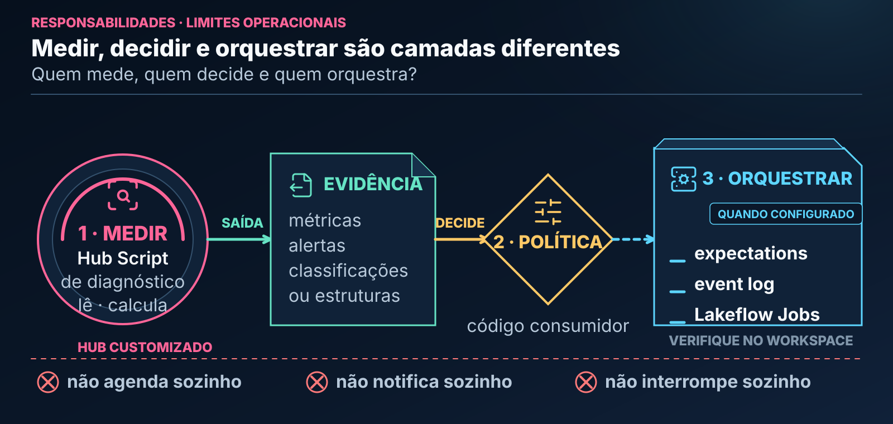

# Hub Scripts

Antes de modelar, você pode precisar verificar uma chave, conhecer uma distribuição ou transformar transações em atributos por cliente. Esses objetivos exigem ferramentas diferentes. Este guia ensina a escolher o utilitário, preparar sua entrada e interpretar o contrato específico de retorno.

> **Candidato para revisão, ainda não oficial.** Os exemplos são sintéticos. As saídas indicadas são expectativas verificáveis da fixture e da implementação; não são evidência de execução no seu workspace.

> **Conteúdo customizado pelo Hub.** A presença de `hub_scripts/` não executa nada. Uma pessoa, tarefa ou ferramenta autorizada da Genie Code pode importar e chamar as funções. A execução depende do ambiente, das dependências e das permissões; a decisão sobre o resultado continua separada.

---

## 🧭 Neste Guia

Um script do Hub é um utilitário de tarefa delimitada. Frequentemente recebe um nome de tabela ou caminho de arquivo, mas não existe retorno universal. `rfv_calculator` transforma eventos em atributos; `schema_to_yaml` serializa um schema; os demais inspecionam aspectos diferentes do recurso.

| Sua necessidade | Caminho |
|---|---|
| Escolher o utilitário | [Catálogo](#catalogo) |
| Executar os exemplos sem tabela corporativa | [Preparação](#preparacao) |
| Entender PASS, WARN e FAIL | [Interpretação de qualidade](#qualidade) |
| Definir reação operacional | [Passo a passo](#operacional) |
| Distinguir custo e efeitos | [Execução](#execucao) |
| Separar diagnóstico de controle | [Enforcement](#enforcement) |

<a id="preparacao"></a>
### Preparação comum dos exemplos

No notebook Python do workspace, confirme a instalação do Hub. `<username>` é a única parte do caminho a adaptar para uma instalação pessoal; uma instalação compartilhada precisa de seu caminho real confirmado. Esta célula não instala pacotes nem lê tabelas:

```python
from pathlib import Path
import sys

assistant_root = Path("/Workspace/Users/<username>/.assistant")
if not (assistant_root / "hub_scripts").is_dir():
    raise FileNotFoundError("Confirme a instalacao do Hub e seu caminho.")
if str(assistant_root) not in sys.path:
    sys.path.insert(0, str(assistant_root))
```

Para os exemplos de tabela, use compute com PySpark e execute a célula abaixo. Ela cria vinte linhas em uma view temporária da sessão, não uma tabela persistente. Se estudar apenas `doc_coverage`, a configuração do path é suficiente; aquela função não usa Spark.

```python
from datetime import date, timedelta
from pyspark.sql import SparkSession

spark = SparkSession.getActiveSession() or SparkSession.builder.getOrCreate()
linhas = [
    (f"e{i:02d}", f"c{i % 5:02d}", date(2026, 6, 1) + timedelta(days=i),
     None if i == 0 else "email", i % 2, float(i))
    for i in range(20)
]
schema = "event_id string, id_cliente string, dt_evento date, canal string, respondeu int, valor_gasto double"
eventos = spark.createDataFrame(linhas, schema)
eventos.createOrReplaceTempView("vw_campanha_eventos_sintetica")
eventos.printSchema()
assert eventos.count() == 20
```

O grão é um evento por linha. `event_id` é único; `id_cliente` se repete. Há um nulo em `canal`, isto é, `1/20 × 100 = 5%`. Os valores de `valor_gasto` vão de 0 a 19, com média 9,5. As datas são fixas para facilitar conferência; por isso freshness será tratado separadamente.

---

## 🔍 O que é um Script neste Ecossistema?

O script fornece uma resposta técnica delimitada, não uma aprovação geral para modelagem. Conferir integridade, transformar eventos em RFV e descrever schema são ações diferentes. Um retorno `pass` não demonstra representatividade, ausência de leakage ou adequação do target.

Não confunda essa convenção com um arquivo de terminal ou um job que se agenda sozinho. Os scripts são módulos Python importáveis. A maior parte lê dados ou metadados e devolve estruturas; quem deseja persistir, registrar ou interromper precisa codificar essa ação e obter autorização.

---

## 🏛️ Arquitetura e o Padrão "Pasta de Objeto"

A figura separa a interface pública da implementação e do exemplo.


`__init__.py` reexporta a API pública. O arquivo homônimo contém sua implementação, validações e retorno. `exemplo_*.py` é um notebook demonstrativo: abrir o arquivo não importa a função na sessão. Use o pacote do objeto, como `from hub_scripts.data_quality_check import data_quality_check`.

---

<a id="catalogo"></a>
## 📚 Catálogo Detalhado

Escolha pela pergunta. A primeira figura distingue as responsabilidades; a segunda mostra por que o código consumidor precisa respeitar cada retorno.


Qualidade e perfilamento observam a base. Drift compara populações. RFV cria atributos. Schema, nomes e documentação avaliam ou descrevem aspectos estruturais. Essas famílias se complementam, mas não são intercambiáveis.


Não aplique `resultado["status"]` indiscriminadamente. RFV retorna DataFrame, nomenclatura retorna lista e YAML retorna texto. Mesmo os dicionários têm chaves diferentes.

### 🩺 1. Qualidade e Perfilamento de Dados (Data Health)

Qualidade compara dados com regras configuradas. Perfilamento descreve o que foi observado. RFV utiliza transações para produzir atributos de comportamento: é transformação analítica, não veredito sanitário.

<a id="qualidade"></a>
#### `data_quality_check` — Inspeção Sanitária Pré-Modelagem

**Problema e conceito.** Uma chave candidata deveria identificar a linha; nulidade mede valores ausentes; freshness compara a data máxima observada com a data corrente. Os limiares são política do consumidor, não defaults institucionais do Databricks.

**Interface.** `data_quality_check(table_name, pk_columns, date_column=None, thresholds=None)`. `table_name` é uma string resolvida pela sessão Spark; `pk_columns` é uma lista não vazia. Não existem os parâmetros `primary_keys` ou `critical_columns`.

```python
from hub_scripts.data_quality_check import data_quality_check

qualidade = data_quality_check(
    table_name="vw_campanha_eventos_sintetica",
    pk_columns=["event_id"],
    date_column=None,
    thresholds={"null_warn": 5.0, "null_fail": 20.0},
)
assert qualidade["checks"]["row_count"] == 20
assert qualidade["checks"]["pk_uniqueness"]["duplicate_rows"] == 0
assert qualidade["checks"]["pk_uniqueness"]["null_key_rows"] == 0
assert qualidade["checks"]["nulls"]["canal"]["pct"] == 5.0
assert qualidade["status"] == "warn"
assert qualidade["score"] == 95
print(qualidade)
```

A API efetiva retorna `status`, `score`, `thresholds`, `checks` e `alerts`. Um recorte fiel do caso, omitindo outras colunas e parte de `checks`, é:

```python
{
    "status": "warn",
    "score": 95,
    "checks": {
        "row_count": 20,
        "nulls": {"canal": {"count": 1, "pct": 5.0, "status": "warn"}},
    },
    "alerts": [
        {"check": "null_rate", "column": "canal", "severity": "warn",
         "message": "Null rate 5.00% (1/20)."}
    ],
}
```

**Interpretação.** A comparação de nulidade é inclusiva: 5% atinge o aviso; 20% atinge a falha. Chave nula ou duplicada também pode gerar falha. Freshness, quando solicitado, falha se não há data válida ou se a idade excede o limite. Assim, seria incorreto dizer que só nulidade de 20% ou PK inválida podem produzir `fail`.

O score é uma agregação local: `max(0, 100 − 25 × falhas − 5 × avisos)`. Não é probabilidade, porcentagem de qualidade nem evidência de ausência de outros defeitos. O helper contabiliza violações configuradas; não mede todas as condições de adequação da base.

**Três casos controlados.** A transformação a seguir modifica apenas dados sintéticos e views temporárias. Ela não recomenda imputar nulos reais automaticamente.

```python
eventos.fillna({"canal": "email"}).createOrReplaceTempView("vw_campanha_pass")
eventos.unionByName(eventos.filter("event_id = 'e00'")).createOrReplaceTempView("vw_campanha_fail")

caso_pass = data_quality_check("vw_campanha_pass", ["event_id"], date_column=None)
caso_warn = data_quality_check("vw_campanha_eventos_sintetica", ["event_id"], date_column=None)
caso_fail = data_quality_check("vw_campanha_fail", ["event_id"], date_column=None)
assert caso_pass["status"] == "pass" and caso_pass["score"] == 100
assert caso_warn["status"] == "warn" and caso_warn["score"] == 95
assert caso_fail["status"] == "fail"
assert caso_fail["checks"]["row_count"] == 21
assert caso_fail["checks"]["pk_uniqueness"]["duplicate_rows"] == 1
```

No terceiro caso, a chave duplicou e o evento nulo foi repetido: a nulidade de `canal` é `2/21 × 100`, não mais 5%. Essa observação evita interpretar alterações da fixture como se apenas uma métrica pudesse mudar.

**Freshness em uma lição separada.** A função não possui um parâmetro de data de avaliação. Ela usa `date.today()`. O exemplo abaixo torna essa dependência visível, sem inventar uma API:

```python
from datetime import date

com_tempo = data_quality_check(
    "vw_campanha_eventos_sintetica", ["event_id"], date_column="dt_evento",
    thresholds={"null_warn": 5.0, "null_fail": 20.0, "freshness_days": 90.0},
)
idade_esperada = (date.today() - date(2026, 6, 20)).days
assert com_tempo["checks"]["freshness"]["days_old"] == idade_esperada
assert com_tempo["checks"]["freshness"]["status"] == ("fail" if idade_esperada > 90 else "pass")
print(com_tempo["checks"]["freshness"])
```

Uma idade de 90 dias ainda passa; 91 falha. Como a fixture é fixa, seu resultado muda com o calendário. Datas futuras, colunas textuais e política de fusos precisam de validação própria; o helper não é uma checagem completa de semântica temporal.

**Custo, adaptação e recuperação.** A função lê a tabela para agregações e unicidade; tabela grande pode exigir scan e shuffle. Escolha chaves e limiares de acordo com o contrato real. Lista de PK vazia, coluna ausente e limiares inválidos geram erro de configuração; isso é diferente de um diagnóstico válido com `status="fail"`. Consulte a [implementação](../../../ambiente_fonte/.assistant/hub_scripts/data_quality_check/data_quality_check.py) e o [exemplo completo do objeto](../../../ambiente_fonte/.assistant/hub_scripts/data_quality_check/exemplo_data_quality_check.py).

#### `quick_profile` — Raio-X de Schema e Distribuição

**Problema.** Você quer conhecer colunas, nulos, valores frequentes e faixas antes de escolher uma análise. Perfil não é a mesma checagem de PK/freshness de `data_quality_check`.

**Interface e preparação.** `quick_profile(table_name, sample_fraction=0.1, max_categories=20, *, seed=42)`. Use a view da preparação. Comece com amostra completa para conferir a conta:

```python
from hub_scripts.quick_profile import quick_profile

perfil = quick_profile("vw_campanha_eventos_sintetica", sample_fraction=1.0, max_categories=3, seed=42)
assert perfil["total_rows"] == 20
assert perfil["sample_rows"] == 20
assert perfil["numeric_summary_sample"]["valor_gasto"]["mean"] == 9.5
nulos_canal = next(item for item in perfil["null_summary_full_table"] if item["column"] == "canal")
assert nulos_canal["null_count"] == 1
assert nulos_canal["null_pct"] == 5.0
print(perfil["numeric_summary_sample"]["valor_gasto"])
```

O retorno inclui `total_rows`, `sample_rows`, `sample_fraction`, `sample_seed`, `dtypes`, `null_summary_full_table`, `cardinality_sample`, `top_values_sample`, `numeric_summary_sample` e `date_range_sample`. No exemplo, o mínimo, máximo e média de `valor_gasto` são 0, 19 e 9,5.

**Variação e interpretação.** Uma fração não determina exatamente a quantidade amostrada:

```python
parcial = quick_profile("vw_campanha_eventos_sintetica", sample_fraction=0.5, max_categories=3, seed=42)
assert parcial["total_rows"] == 20
print(parcial["sample_rows"], parcial["numeric_summary_sample"])
```

Não exija dez linhas nessa amostra. Contagens de linhas e nulos continuam calculadas na tabela inteira; os campos `*_sample` descrevem a amostra efetiva. Cardinalidade é aproximada. Há limites de colunas perfiladas na implementação: não interprete o resumo como cobertura de todas as estatísticas de uma tabela larga.

**Limites e recuperação.** Fração fora de `(0, 1]` e limite de categorias não positivo são inválidos. Amostrar algumas medidas não torna o scan total amostral. O cache pode não estar disponível no compute; o helper possui tratamento para continuar sem ele. Veja [código](../../../ambiente_fonte/.assistant/hub_scripts/quick_profile/quick_profile.py) e [exemplo](../../../ambiente_fonte/.assistant/hub_scripts/quick_profile/exemplo_quick_profile.py).

#### `rfv_calculator` — Recência, Frequência e Valor

**Problema e conceitos.** Para cada cliente, recência é o número de dias desde o último evento até o corte; frequência é contagem de eventos; valor é a soma configurada. A saída são atributos brutos, não quintis, personas ou autorização de oferta.

**Interface.** `rfv_calculator(table_name, col_cliente, col_data, col_valor, dt_referencia, periodos=(30, 60, 90))`. A referência é inclusiva. Uma janela de sete dias termina no corte e começa seis dias antes.

**Fixture própria, com os mesmos nomes de domínio.** Ela substitui os vinte eventos somente para esta demonstração de RFV e inclui uma transação futura de propósito:

```python
from datetime import date
from hub_scripts.rfv_calculator import rfv_calculator

compras = spark.createDataFrame(
    [("c1", date(2026, 3, 1), 100.0), ("c1", date(2026, 3, 10), 50.0),
     ("c1", date(2026, 3, 20), 999.0), ("c2", date(2026, 3, 14), 20.0)],
    "id_cliente string, dt_evento date, valor_gasto double",
)
compras.createOrReplaceTempView("vw_campanha_compras_rfv")
rfv = rfv_calculator(
    "vw_campanha_compras_rfv", col_cliente="id_cliente", col_data="dt_evento",
    col_valor="valor_gasto", dt_referencia="2026-03-15", periodos=(7, 30),
)
rfv.orderBy("id_cliente").show(truncate=False)
c1 = rfv.filter("id_cliente = 'c1'").first().asDict()
assert c1["recencia"] == 5
assert c1["frequencia_total"] == 2
assert c1["valor_total"] == 150.0
assert c1["frequencia_7d"] == 1 and c1["valor_7d"] == 50.0
assert c1["frequencia_30d"] == 2 and c1["valor_30d"] == 150.0
```

**Interpretação.** Para `c1`, a compra de 20/03 é excluída. A última válida é 10/03, cinco dias antes da referência. A janela de sete dias começa em 09/03 e inclui somente 50; a de trinta dias inclui 150. O grão do retorno mudou de evento para cliente.

**Limites, custo e adaptação.** Clientes sem eventos válidos até o corte não surgem automaticamente com zeros: seria necessário definir uma população externa. Datas inválidas são filtradas na conversão; valide a perda de registros. Janelas e somas exigem agregações e junções. Confirme valor monetário, estornos e duplicidades antes de aplicar a função. `periodos` deve conter inteiros positivos. Consulte [implementação](../../../ambiente_fonte/.assistant/hub_scripts/rfv_calculator/rfv_calculator.py) e [exemplo](../../../ambiente_fonte/.assistant/hub_scripts/rfv_calculator/exemplo_rfv_calculator.py).

### 📉 2. Estabilidade e Monitoramento de Distribuição

Mudança de distribuição é diferente de piora preditiva. Uma comparação precisa explicitar população de referência, população atual, variável e discretização. O script abaixo compara duas coortes da mesma tabela; para dois DataFrames já preparados, existe também o snippet de PSI.

#### `drift_detector` — Detecção de Desvios de Distribuição

**Interface.** `drift_detector(table_name, date_col, date_ref, date_comp, cols=None, method="psi", *, num_bins=10, relative_error=0.001, epsilon=1e-6, warning_threshold=None, critical_threshold=None)`. Apesar do nome `date_col`, a coluna identifica as coortes comparadas; aqui usaremos rótulos sintéticos. O único método implementado é `psi`.

```python
from math import isclose, log
from hub_scripts.drift_detector import drift_detector

coortes = spark.createDataFrame(
    [(grupo, x) for grupo, valores in (
        ("referencia", [0.0, 0.0, 1.0, 1.0]),
        ("igual", [0.0, 0.0, 1.0, 1.0]),
        ("alterada", [0.0, 1.0, 1.0, 1.0]),
    ) for x in valores],
    "coorte string, valor_gasto double",
)
coortes.createOrReplaceTempView("vw_campanha_coortes")
igual = drift_detector("vw_campanha_coortes", "coorte", "referencia", "igual", cols=["valor_gasto"], num_bins=2, relative_error=0.0)
alterada = drift_detector("vw_campanha_coortes", "coorte", "referencia", "alterada", cols=["valor_gasto"], num_bins=2, relative_error=0.0)
assert igual["valor_gasto"]["psi"] == 0.0
assert igual["valor_gasto"]["classification"] == "not_classified"
psi_manual = (0.25 - 0.50) * log(0.25 / 0.50) + (0.75 - 0.50) * log(0.75 / 0.50)
assert isclose(alterada["valor_gasto"]["psi"], psi_manual, abs_tol=1e-9)
print(alterada["valor_gasto"])
```

**Saída e interpretação.** O dicionário é indexado pela coluna analisada. Cada entrada contém `psi`, `classification`, `boundaries`, tamanhos das populações e `buckets`. Populações idênticas produzem zero; a comparação 50%/50% com 25%/75% produz aproximadamente 0,274653. Sem dois limiares fornecidos, a classificação é `not_classified`. Não apresente esse estado como `stable`.

Em `buckets`, os campos com sufixo `pct` armazenam proporções usadas no cálculo, em escala de razão, com suavização por `epsilon` quando necessário. Não multiplique ou interprete essas escalas sem ler o contrato. Bordas derivadas da referência são aplicadas às duas populações.

**Variação.** Após justificar uma política, forneça `warning_threshold` e `critical_threshold` com `0 ≤ warning < critical`. Nenhum número deste tutorial é uma política universal de retreino.

**Limites e recuperação.** As duas coortes devem ser não vazias. Verifique tipos, nulos, quantidade de bins e custos de quantis/agregações. A função não monitora continuamente, não envia mensagem e não retreina. Consulte [implementação](../../../ambiente_fonte/.assistant/hub_scripts/drift_detector/drift_detector.py) e [exemplo](../../../ambiente_fonte/.assistant/hub_scripts/drift_detector/exemplo_drift_detector.py).

### 📐 3. Governança, Contratos e Boas Práticas de Código

Esses utilitários descrevem estrutura ou apontam violações locais. Eles não substituem um contrato de negócio, a política de acesso ou revisão semântica de documentação.

#### `schema_to_yaml` — Contratos de Dados em YAML

**Problema.** Compartilhar nomes, tipos e nulabilidade sem confundir descrição de schema com aprovação dos dados. Serializar é converter uma estrutura para texto; persistir é outra ação.

**Interfaces.** `schema_to_dict(table_name, *, include_comments=True, include_stats=False)` retorna dicionário. `schema_to_yaml(table_name, include_comments=True, include_stats=False)` retorna string.

```python
from hub_scripts.schema_to_yaml import schema_to_dict, schema_to_yaml

contrato = schema_to_dict("vw_campanha_eventos_sintetica", include_comments=True, include_stats=False)
por_nome = {coluna["name"]: coluna for coluna in contrato["columns"]}
assert por_nome["event_id"]["type"] == "string"
assert por_nome["dt_evento"]["type"] == "date"
assert isinstance(por_nome["canal"]["nullable"], bool)
texto_schema = schema_to_yaml("vw_campanha_eventos_sintetica", include_comments=True, include_stats=False)
assert isinstance(texto_schema, str) and texto_schema.strip()
print(texto_schema)
```

Um item do retorno descreve `name`, `type` e `nullable`, acrescido de comentário quando existe. `nullable=True` significa que o schema admite nulos; não demonstra que há nulos observados.

**Variação com custo explícito.** `include_stats=True` acrescenta agregações sobre os dados:

```python
com_stats = schema_to_dict("vw_campanha_eventos_sintetica", include_stats=True)
assert com_stats["row_count"] == 20
assert next(c for c in com_stats["columns"] if c["name"] == "canal")["stats"]["null_count"] == 1
```

Com PyYAML instalado, a saída usa serialização YAML segura; sem ele, utiliza JSON válido como documento YAML 1.2. Não exija o mesmo layout textual nos dois ambientes. Nenhuma dessas chamadas grava arquivo. Consulte [código](../../../ambiente_fonte/.assistant/hub_scripts/schema_to_yaml/schema_to_yaml.py) e [exemplo](../../../ambiente_fonte/.assistant/hub_scripts/schema_to_yaml/exemplo_schema_to_yaml.py).

#### `naming_checker` — Guardião de Nomenclatura

**Problema e fronteira.** Nomes inconsistentes dificultam a manutenção. A convenção de minúsculas com underscores pertence ao projeto; Unity Catalog não exige prefixos dimensionais como `dim_` ou `fato_` para toda tabela.

**Interface.** `naming_checker(table_name, *, enforce_prefix=False, allowed_table_prefixes=(), max_col_length=255)`. O checker lê o schema, não o conteúdo das linhas. A regra de minúsculas do módulo não é um argumento chamado `snake_case`.

```python
from hub_scripts.naming_checker import naming_checker

spark.createDataFrame([("e1", "c1")], "event_id string, IdCliente string").createOrReplaceTempView("vw_campanha_nomes")
violacoes = naming_checker("vw_campanha_nomes", enforce_prefix=False)
assert any(v["object"] == "IdCliente" and v["policy"] == "project-custom" for v in violacoes)
for violacao in violacoes:
    print(violacao["object"], violacao["severity"], violacao["policy"], violacao["message"])
```

**Interpretação.** `event_id` segue a convenção; `IdCliente` não. A view de nome curto também produz um aviso de contexto sobre preferir nome qualificado de tabela. Esse aviso é esperado na fixture temporária; não crie uma tabela persistente só para eliminá-lo.

**Adaptar e recuperar.** Ative prefixos apenas quando a política existir, fornecendo `allowed_table_prefixes`. Ativar a checagem sem prefixos ou informar limite de comprimento não positivo gera `ValueError`. Uma lista de violações não renomeia colunas. Consulte [implementação](../../../ambiente_fonte/.assistant/hub_scripts/naming_checker/naming_checker.py) e [exemplo](../../../ambiente_fonte/.assistant/hub_scripts/naming_checker/exemplo_naming_checker.py).

#### `doc_coverage` — Auditoria Estrutural de Documentação

**Problema.** Localizar células de código sem Markdown adjacente. A medida é uma heurística estrutural, não avaliação da qualidade da explicação.

**Interface.** `doc_coverage(notebook_path)` recebe caminho de arquivo local/exportado em `.ipynb`, `.py`, `.sql`, `.scala` ou `.r`. Não busca uma URL de notebook e não usa Spark.

**Exemplo completo.** O preparo abaixo cria explicitamente um arquivo temporário e o remove ao sair do bloco. O conteúdo não é executado. A função apenas lê sua estrutura.

```python
import json
from pathlib import Path
from tempfile import TemporaryDirectory
from hub_scripts.doc_coverage import doc_coverage

notebook_fixture = {
    "nbformat": 4, "nbformat_minor": 5, "metadata": {},
    "cells": [
        {"cell_type": "markdown", "metadata": {}, "source": ["Definimos x para o exemplo."]},
        {"cell_type": "code", "metadata": {}, "source": ["x = 1"], "execution_count": None, "outputs": []},
        {"cell_type": "code", "metadata": {}, "source": ["print(x)"], "execution_count": None, "outputs": []},
    ],
}
with TemporaryDirectory(prefix="hub-doc-coverage-") as pasta:
    caminho = Path(pasta) / "exemplo.ipynb"
    caminho.write_text(json.dumps(notebook_fixture), encoding="utf-8")
    cobertura = doc_coverage(str(caminho))
    assert cobertura["total_code_cells"] == 2
    assert cobertura["total_markdown_cells"] == 1
    assert cobertura["coverage_pct"] == 50.0
    assert cobertura["uncovered_cell_indexes"] == [2]
    print(cobertura)
```

**Interpretação.** A primeira célula de código tem Markdown anterior; a segunda não tem Markdown imediatamente antes ou depois. Uma de duas está coberta: 50%. Os índices são baseados em zero. Inserir um texto irrelevante poderia elevar a métrica sem melhorar a explicação; revise conteúdo separadamente.

**Adaptar e recuperar.** Exporte o notebook real para um formato suportado e forneça seu caminho. Arquivo ausente gera `FileNotFoundError`; URL de workspace não é substituto do arquivo. Consulte [implementação](../../../ambiente_fonte/.assistant/hub_scripts/doc_coverage/doc_coverage.py) e [exemplo](../../../ambiente_fonte/.assistant/hub_scripts/doc_coverage/exemplo_doc_coverage.py).

---

<a id="operacional"></a>
## 🛠️ Passo a Passo Operacional: Como Usar um Script

A figura distingue o estado retornado pelo diagnóstico da reação de quem o consome.


Primeiro confirme o recurso e a sessão; depois torne o pacote visível e importe a API pública. Passe parâmetros do contrato real, examine retorno e alertas e só então aplique a política da tarefa. O carregamento de uma skill não dispensa essas condições do runtime.

### Exemplo Prático de Código

Os casos completos PASS/WARN/FAIL estão na [seção de qualidade](#qualidade), com a [preparação neste próprio guia](#preparacao). Para aplicar uma regra de interrupção, defina-a no consumidor:

```python
def exigir_qualidade(resultado):
    if resultado["status"] == "fail":
        raise ValueError("A politica desta tarefa interrompe quando o diagnostico falha.")
    return resultado

exigir_qualidade(caso_pass)
try:
    exigir_qualidade(caso_fail)
except ValueError as erro:
    print(erro)
```

O `try` existe para permitir que o tutorial continue. Em uma tarefa cuja política seja falhar, a exceção não tratada pode interromper a execução. Retornar um dicionário com `fail`, sozinho, não tem esse efeito.

### Como interpretar o retorno

Leia a regra violada, a população e a unidade antes do status agregado. Um nulo na PK e uma taxa de nulos em coluna opcional têm causas e tratamentos diferentes. Em outros scripts, leia o contrato próprio: um DataFrame RFV não contém o mesmo `status`.

### Leitura visual do veredito

`pass` significa que as verificações configuradas não encontraram violações; `warn` indica atenção; `fail` indica violação de regra de falha. A ação de prosseguir, investigar, registrar ou interromper é definida pelo consumidor. Não use a cor da figura como substituto da mensagem e da métrica.

---

<a id="execucao"></a>
## ⚙️ O que Acontece Durante a Execução?

| Utilitário | Operação | Efeito e custo a observar |
|---|---|---|
| Qualidade | Agregações e unicidade | Scan e possível shuffle; sem persistência da tabela |
| Perfil | Contagens completas e resumos amostrais | Amostra não elimina todas as leituras completas |
| Drift | Filtros, quantis e distribuições | Custo cresce com dados e variáveis; agrega antes de coletar |
| RFV | Filtros temporais, agregações e joins | Retorna plano/DataFrame; uma ação materializa o resultado |
| Schema | Metadados; estatísticas opcionais | `include_stats=True` acrescenta leitura dos dados |
| Nomenclatura | Inspeção do schema | Não renomeia objetos nem lê valores das linhas |
| Cobertura | Leitura e parse de arquivo | Sem Spark; não avalia significado da prosa |

Uma operação distribuída pode ser cara. Uma amostra não garante representatividade. O limite adequado depende do volume e do objetivo, não apenas do nome do helper.

---

<a id="enforcement"></a>
## 🧭 Diagnóstico não é Enforcement

A próxima figura separa medição, política e orquestração.



Enforcement é aplicar uma regra ao processo, e não apenas descrevê-la. Imprimir `fail` informa; lançar uma exceção aplica uma política à tarefa; configurar expectations ou um job pode aplicar regras no pipeline. O script não cria automaticamente esse arranjo.

As [expectations](https://learn.microsoft.com/en-us/azure/databricks/ldp/expectations), o [event log](https://learn.microsoft.com/en-us/azure/databricks/ldp/monitor-event-logs) e as [notificações de Lakeflow Jobs](https://learn.microsoft.com/en-us/azure/databricks/jobs/notifications) têm configuração e semântica próprias. Não transplante uma chamada ad hoc para código declarativo de pipeline sem revisar suas restrições e efeitos.

---

## ❓ Perguntas Frequentes (FAQ)

### 1. Se o script retornar `status="fail"`, meus dados serão apagados ou modificados?

Não pelo diagnóstico de qualidade. Ele lê e retorna evidências. Uma alteração ou interrupção depende do código consumidor e das ferramentas autorizadas. Revise essas ações separadamente.

### 2. Os scripts funcionam com tabelas do Unity Catalog?

Os utilitários de tabela usam a sessão Spark e as permissões aplicáveis. Prefira o nome real `catalog.schema.table` para tabelas persistentes. Views temporárias são locais à sessão; o tutorial não as transforma em tabelas do catálogo.

### 3. Preciso rodar esses scripts pelo terminal ou dentro de um notebook?

São módulos Python, consumidos por notebook ou tarefa com ambiente adequado. Este tutorial usa notebook. O agente também pode executar código com ferramentas autorizadas; isso não garante que a ferramenta compartilhe a mesma sessão da sua view.

### 4. Os scripts causam lentidão em tabelas volumosas?

Podem causar custo significativo. Distinct, agregações, quantis e joins precisam ser avaliados no plano e na escala reais. Retornar poucas linhas não prova que a operação leu poucos dados.

### 5. Posso usar os scripts em pipelines automatizados?

Pode integrar contratos adequados em código consumidor revisado, com política de falha, registro e testes. Não suponha compatibilidade automática com toda API declarativa. Agendamento, notificações e recuperação são responsabilidades do pipeline ou orquestrador.

### 6. A Genie Code executa estes scripts automaticamente?

Não há autorun pela simples presença da pasta. Entretanto, a Genie Code pode gerar e executar chamadas por ferramentas, conforme o modo e as aprovações. Para uma revisão sem execução, peça isso explicitamente e confira a configuração de aprovação; autoaprovação não é uma barreira de segurança.

---

## 🔗 Continue Explorando

Use [snippets](../sprint-03-snippets/README.md) para compor implementações, [skills](../sprint-05-skills/README.md) para orientar o método e [prompts](../sprint-06-prompts/README.md) para definir o trabalho. O [Catálogo de Helpers](../../../ambiente_fonte/.assistant/CATALOGO_HELPERS.md) centraliza caminhos públicos.

Fontes da plataforma conferidas em 11/09/2026: [modo agente](https://learn.microsoft.com/en-us/azure/databricks/genie-code/agent-mode), [skills](https://learn.microsoft.com/en-us/azure/databricks/genie-code/skills) e [views temporárias Spark](https://spark.apache.org/docs/latest/api/python/reference/pyspark.sql/api/pyspark.sql.DataFrame.createOrReplaceTempView.html). As implementações e exemplos linkados em cada ficha são a procedência dos contratos específicos do Hub.
