# Conteúdo textual das figuras

Este índice auxilia manutenção e leitura sem imagem. Os READMEs preservam as explicações e os exemplos copiáveis. Cabeçalhos são identidade decorativa, não instruções.

## raiz.01_mapa_ecossistema

**Pergunta:** Quais componentes existem e em qual plano atuam?

Agent Skills usam um mecanismo reconhecido pela plataforma; prompts e padrões podem ser fornecidos como contexto explícito, enquanto snippets e scripts são usados por importação ou execução no notebook.

- CONTEXTO E MÉTODO
- CÓDIGO E UTILITÁRIOS
- Ecossistema
- .assistant
- ORGANIZAÇÃO
- Agent Skills
- método + guardrails
- relevância ou @
- mecanismo suportado • conteúdo Hub
- Hub Prompts
- briefing + critérios de aceite
- contexto explícito
- CONTEÚDO HUB
- Hub Snippets
- funções + classes
- importação explícita
- CONTEÚDO HUB
- Hub Scripts
- utilitários + diagnósticos
- execução sob demanda
- CONTEÚDO HUB
- Hub Padrões
- consulta ou contexto explícito
- As ligações mostram organização; cada componente tem sua própria forma de uso.

## raiz.02_arquitetura_ecossistema

**Pergunta:** Como fonte, publicação, contexto e runtime se relacionam?

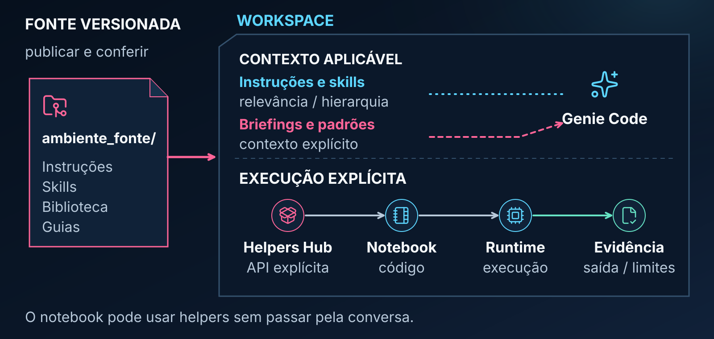

A fonte é publicada no workspace; contexto orienta a conversa e código reutilizável entra no runtime por ação explícita do notebook.

- FONTE VERSIONADA
- ambiente_databricks/
- Instruções
- Skills
- Biblioteca
- Guias
- publicar e conferir
- WORKSPACE
- CONTEXTO APLICÁVEL
- Instruções e skills
- relevância / hierarquia
- Briefings e padrões
- contexto explícito
- Genie Code
- EXECUÇÃO EXPLÍCITA
- Helpers Hub
- API explícita
- Notebook
- código
- Runtime
- execução
- Evidência
- saída / limites
- O notebook pode usar helpers sem passar pela conversa.

## raiz.03_ciclo_de_vida

**Pergunta:** Quais gates uma mudança percorre antes de ser promovida?

Cada falha retorna à fonte editável; promoção ao destino autorizado só acontece após verificação, testes e registro.

- POLÍTICA DO PROJETO · SETE GATES
- Fonte editável e evidências acompanham todo o percurso.
- 1
- Editar
- a fonte
- 2
- Validar
- contratos
- 3
- Renderizar
- o espelho
- 4
- Publicar
- e verificar
- 5
- Testar
- por impacto
- 6
- Registrar e
- versionar
- 7
- Promover
- ao destino
- Falha em qualquer gate: corrigir na fonte e repetir o percurso.
- Publicar inclui conferir o remoto. Promover não é uma ação automática.

## assistant.01_escolha_ponto_de_partida

**Pergunta:** Qual componente atende melhor à necessidade atual?

Método, briefing, função reutilizável, diagnóstico e criação de componente têm pontos de partida diferentes e podem se complementar.

- COMECE PELA SUA NECESSIDADE
- Os componentes podem se complementar na mesma tarefa.
- Preciso de método
- Agent Skill
- mecanismo nativo · conteúdo Hub
- Quero estruturar
- o pedido
- Hub Prompt
- Quero reutilizar código
- Hub Snippet
- Preciso de diagnóstico
- Hub Script
- Vou criar um
- componente
- Hub Padrão
- Qual resultado
- você precisa?

## assistant.02_arquitetura_de_uso

**Pergunta:** O que pertence ao contexto e o que pertence ao runtime?

Instruções, skills, briefing e recursos orientam a conversa; snippets e scripts entram no runtime somente por importação ou chamada explícita.

- CONTEXTO
- EXECUÇÃO
- Objetivo e recursos
- pedido, @ e Add Context
- Contexto aplicável
- instruções, skill e briefing
- Genie Code
- plano, código ou ações
- Revisão de proposta e escopo
- conforme política configurada
- Helpers Hub
- snippets + scripts
- Notebook
- importa e chama
- Runtime
- Python / Spark / SQL
- Evidência
- resultado
- + limites
- ação explícita
- Rota independente da conversa: o código consumidor importa e chama os helpers.

## assistant.03_contexto_e_execucao

**Pergunta:** Quais fontes de contexto podem orientar a Genie Code?

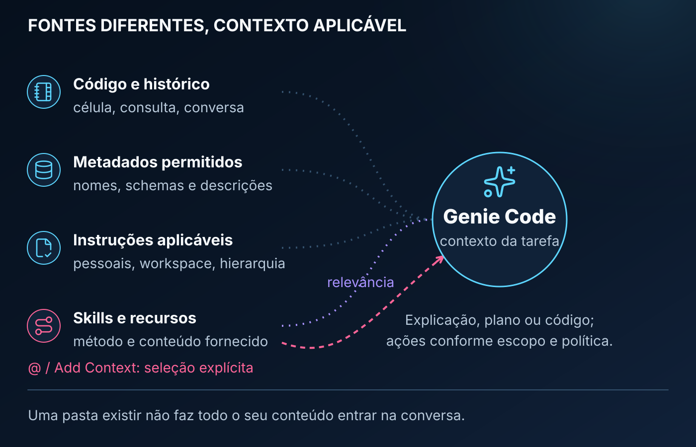

O contexto depende da superfície, das permissões, das instruções aplicáveis e dos recursos fornecidos com @ ou Add Context.

- FONTES DIFERENTES, CONTEXTO APLICÁVEL
- Código e histórico
- célula, consulta, conversa
- Metadados permitidos
- nomes, schemas e descrições
- Instruções aplicáveis
- pessoais, workspace, hierarquia
- Skills e recursos
- método e conteúdo fornecido
- relevância
- @ / Add Context: seleção explícita
- Genie Code
- contexto da tarefa
- Explicação, plano ou código;
- ações conforme escopo e política.
- Uma pasta existir não faz todo o seu conteúdo entrar na conversa.

## snippets.01_anatomia_pasta

**Pergunta:** Como um snippet é estruturado fisicamente?

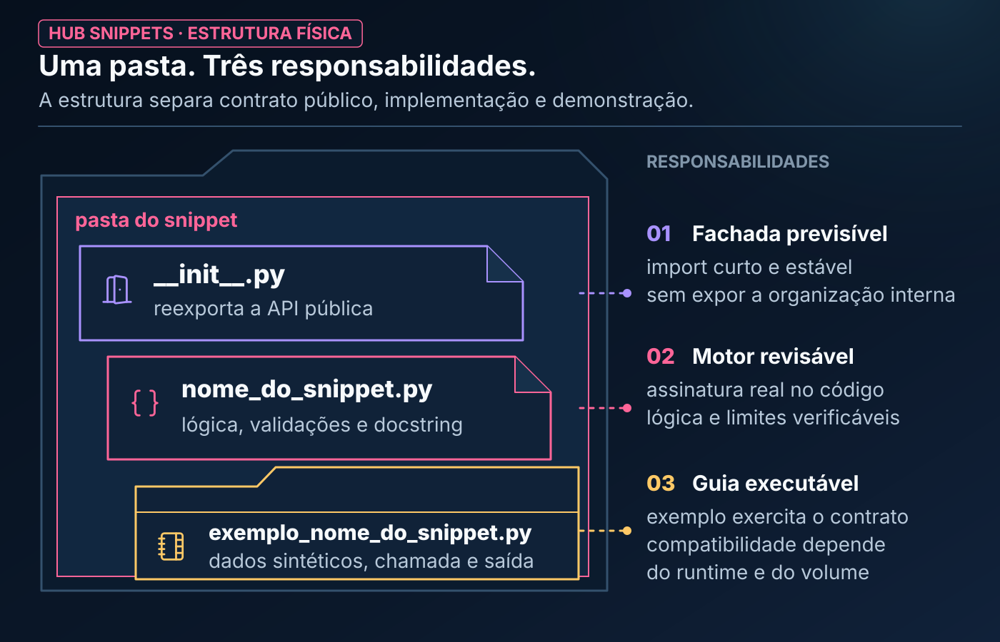

O notebook consome a API pública; a implementação permanece atrás da fachada.

- HUB SNIPPETS · ESTRUTURA FÍSICA
- Uma pasta. Três responsabilidades.
- A estrutura separa contrato público, implementação e demonstração.
- pasta do snippet
- __init__.py
- reexporta a API pública
- nome_do_snippet.py
- lógica, validações e docstring
- exemplo_nome_do_snippet.py
- dados sintéticos, chamada e saída
- RESPONSABILIDADES
- 01
- Fachada previsível
- import curto e estável
- sem expor a organização interna
- 02
- Motor revisável
- assinatura real no código
- lógica e limites verificáveis
- 03
- Guia executável
- exemplo exercita o contrato
- compatibilidade depende
- do runtime e do volume

## snippets.02_mapa_categorias

**Pergunta:** Como as seis categorias se organizam funcionalmente?

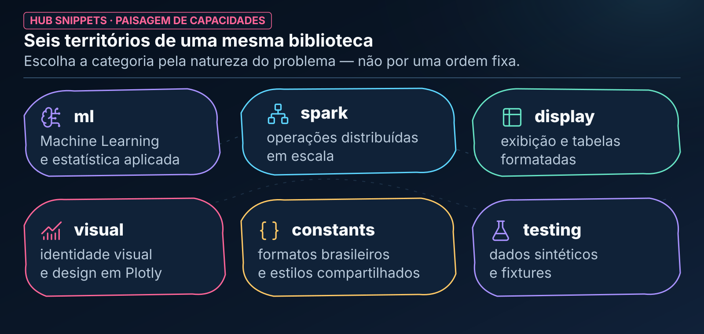

As categorias agrupam helpers por natureza de problema e não constituem uma sequência obrigatória.

- HUB SNIPPETS · PAISAGEM DE CAPACIDADES
- Seis territórios de uma mesma biblioteca
- Escolha a categoria pela natureza do problema — não por uma ordem fixa.
- ml
- Machine Learning
- e estatística aplicada
- spark
- operações distribuídas
- em escala
- display
- exibição e tabelas
- formatadas
- visual
- identidade visual
- e design em Plotly
- constants
- formatos brasileiros
- e estilos compartilhados
- testing
- dados sintéticos
- e fixtures

## snippets.03_fluxo_operacional

**Pergunta:** Como usar um snippet do exemplo à validação?

O snippet acelera a implementação, mas o notebook ainda configura dependências, executa a API e valida o retorno.

- HUB SNIPPETS · JORNADA NO NOTEBOOK
- Do exemplo à evidência reproduzível
- Quatro decisões explícitas mantêm o reuso sob controle.
- notebook de consumo
- 01
- Consultar
- abra exemplo_*.py
- premissas e saída
- 02
- Configurar
- torne a raiz visível
- confirme dependências
- 03
- Importar + executar
- execute a API pública
- com parâmetros reais
- 04
- Interpretar
- tipo, schema e unidade
- limites e população
- O código copiável permanece no README e no notebook modelo.

## snippets.04_contrato_de_reuso

**Pergunta:** O que sustenta um reuso confiável?

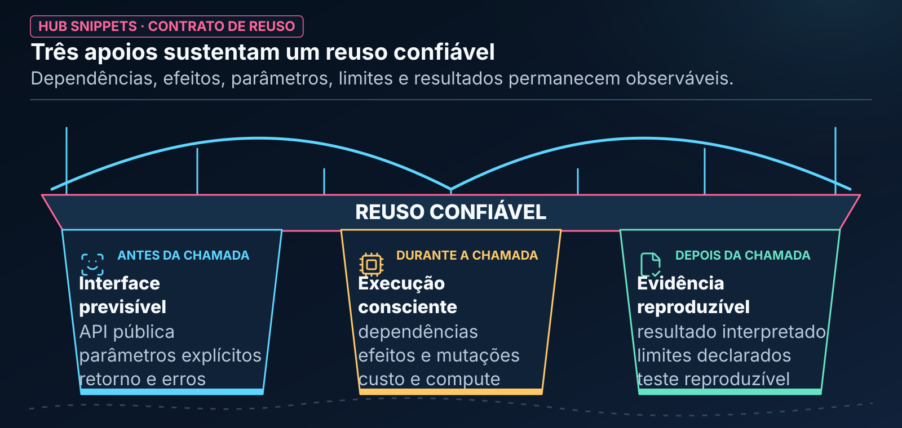

Dependências, efeitos, parâmetros, limites e resultados precisam permanecer observáveis.

- HUB SNIPPETS · CONTRATO DE REUSO
- Três apoios sustentam um reuso confiável
- Dependências, efeitos, parâmetros, limites e resultados permanecem observáveis.
- REUSO CONFIÁVEL
- ANTES DA CHAMADA
- Interface
- previsível
- API pública
- parâmetros explícitos
- retorno e erros
- DURANTE A CHAMADA
- Execução
- consciente
- dependências
- efeitos e mutações
- custo e compute
- DEPOIS DA CHAMADA
- Evidência
- reproduzível
- resultado interpretado
- limites declarados
- teste reproduzível

## scripts.01_anatomia_pasta

**Pergunta:** Como um Hub Script é organizado?

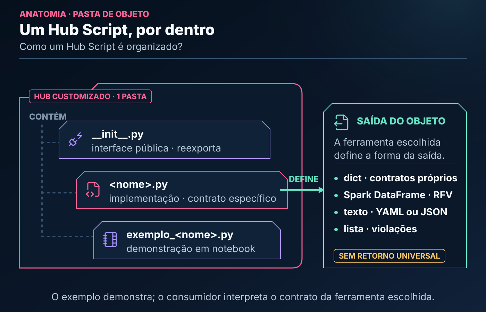

O exemplo demonstra o contrato específico da ferramenta, que pode retornar estruturas diferentes.

- ANATOMIA · PASTA DE OBJETO
- Um Hub Script, por dentro
- Como um Hub Script é organizado?
- HUB CUSTOMIZADO · 1 PASTA
- CONTÉM
- __init__.py
- interface pública · reexporta
- <nome>.py
- implementação · contrato específico
- exemplo_<nome>.py
- demonstração em notebook
- DEFINE
- SAÍDA DO OBJETO
- A ferramenta escolhida
- define a forma da saída.
- dict · contratos próprios
- Spark DataFrame · RFV
- texto · YAML ou JSON
- lista · violações
- SEM RETORNO UNIVERSAL
- O exemplo demonstra; o consumidor interpreta o contrato da ferramenta escolhida.

## scripts.02_catalogo_diagnosticos

**Pergunta:** Que tarefa cada família de script atende e qual retorno produz?

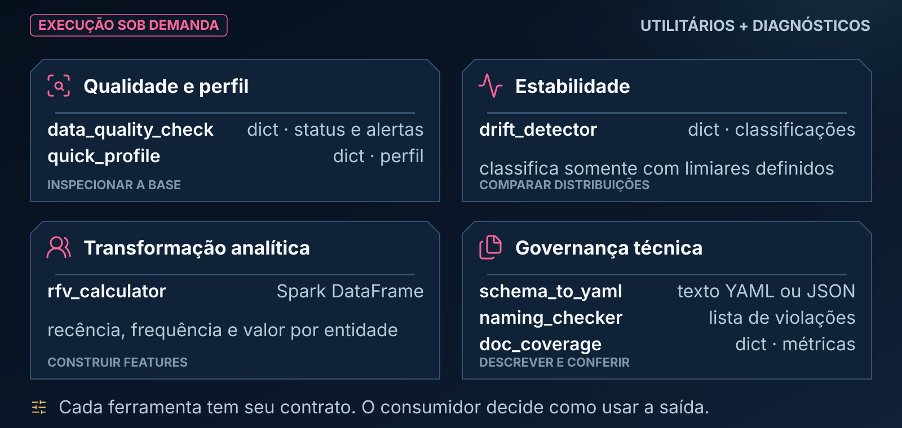

Cada instrumento responde a uma pergunta e devolve uma estrutura própria; a tabela do README permanece o catálogo canônico.

- EXECUÇÃO SOB DEMANDA
- UTILITÁRIOS + DIAGNÓSTICOS
- Qualidade e perfil
- data_quality_check
- dict · status e alertas
- quick_profile
- dict · perfil
- INSPECIONAR A BASE
- Estabilidade
- drift_detector
- dict · classificações
- classifica somente com limiares definidos
- COMPARAR DISTRIBUIÇÕES
- Transformação analítica
- rfv_calculator
- Spark DataFrame
- recência, frequência e valor por entidade
- CONSTRUIR FEATURES
- Governança técnica
- schema_to_yaml
- texto YAML ou JSON
- naming_checker
- lista de violações
- doc_coverage
- dict · métricas
- DESCREVER E CONFERIR
- Cada ferramenta tem seu contrato. O consumidor decide como usar a saída.

## scripts.03_panorama_retornos

**Pergunta:** Quais contratos de retorno existem nos Hub Scripts?

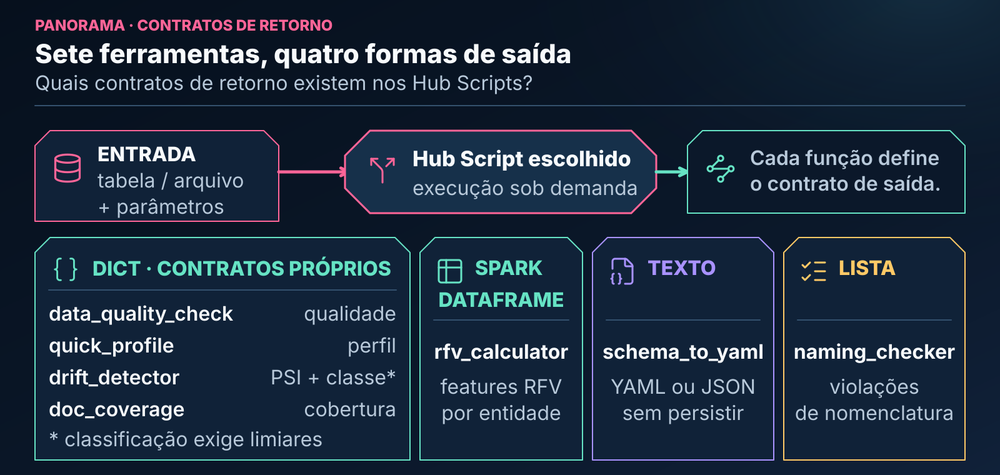

O consumidor interpreta o contrato específico do script e codifica separadamente qualquer reação operacional.

- PANORAMA · CONTRATOS DE RETORNO
- Sete ferramentas, quatro formas de saída
- Quais contratos de retorno existem nos Hub Scripts?
- ENTRADA
- tabela / arquivo
- + parâmetros
- Hub Script escolhido
- execução sob demanda
- Cada função define
- o contrato de saída.
- DICT · CONTRATOS PRÓPRIOS
- data_quality_check
- qualidade
- quick_profile
- perfil
- drift_detector
- PSI + classe*
- doc_coverage
- cobertura
- * classificação exige limiares
- SPARK
- DATAFRAME
- rfv_calculator
- features RFV
- por entidade
- TEXTO
- schema_to_yaml
- YAML ou JSON
- sem persistir
- LISTA
- naming_checker
- violações
- de nomenclatura

## scripts.04_diagnostico_vs_enforcement

**Pergunta:** Quem mede, quem decide e quem orquestra?

Um Hub Script não agenda, notifica nem interrompe outro processo por conta própria.

- RESPONSABILIDADES · LIMITES OPERACIONAIS
- Medir, decidir e orquestrar são camadas diferentes
- Quem mede, quem decide e quem orquestra?
- 1 · MEDIR
- Hub Script
- de diagnóstico
- lê · calcula
- HUB CUSTOMIZADO
- SAÍDA
- EVIDÊNCIA
- métricas
- alertas
- classificações
- ou estruturas
- DECIDE
- 2 · POLÍTICA
- código consumidor
- QUANDO CONFIGURADO
- 3 · ORQUESTRAR
- expectations
- event log
- Lakeflow Jobs
- VERIFIQUE NO WORKSPACE
- não agenda sozinho
- não notifica sozinho
- não interrompe sozinho

## scripts.05_veredito_data_quality

**Pergunta:** Como interpretar o retorno de data_quality_check?

PASS indica apenas que as verificações configuradas não encontraram violações; WARN e FAIL também exigem interpretação da política consumidora.

- DATA_QUALITY_CHECK · ESTADOS E POLÍTICA
- Três estados irmãos; um gate separado
- Como interpretar o retorno de data_quality_check?
- RETORNO ESPECÍFICO
- data_quality_check
- dict
- status
- score
- thresholds
- checks
- alerts
- ESTADOS · SÓ NESTE SCRIPT
- PASS
- regras executadas
- sem violação
- WARN
- há uma condição
- que exige atenção
- FAIL
- uma regra de falha
- foi violada
- POLÍTICA
- EXTERNA
- AÇÃO
- CODIFICADA
- prosseguir
- revisar alertas
- falhar a tarefa
- DECISÃO EXTERNA
- PASS NÃO HOMOLOGA
- FAIL NÃO INTERROMPE SOZINHO

## skills.01_descoberta_e_selecao

**Pergunta:** Como relevância e menção explícita conduzem à skill?

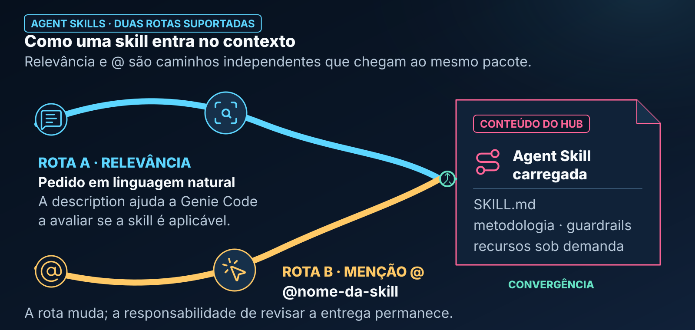

A description ajuda o roteamento; a menção com @ torna a escolha explícita.

- AGENT SKILLS · DUAS ROTAS SUPORTADAS
- Como uma skill entra no contexto
- Relevância e @ são caminhos independentes que chegam ao mesmo pacote.
- ROTA A · RELEVÂNCIA
- Pedido em linguagem natural
- A description ajuda a Genie Code
- a avaliar se a skill é aplicável.
- ROTA B · MENÇÃO @
- @nome-da-skill
- CONTEÚDO DO HUB
- Agent Skill
- carregada
- SKILL.md
- metodologia · guardrails
- recursos sob demanda
- CONVERGÊNCIA
- A rota muda; a responsabilidade de revisar a entrega permanece.

## skills.02_skill_helpers_runtime

**Pergunta:** Onde termina o método e começa a execução?

Orientação metodológica e código executável são responsabilidades diferentes.

- CORTE ARQUITETURAL
- Método acima; execução no runtime
- PLANO DE CONTEXTO
- Agent Skill
- metodologia + guardrails
- orienta
- pode recomendar
- quando adequado
- helpers
- não é importação
- FRONTEIRA · RECOMENDAÇÃO NÃO É IMPORTAÇÃO NEM EXECUÇÃO
- PLANO DE RUNTIME
- Notebook
- ação explícita
- importa
- Hub Snippets
- Hub Scripts
- código reutilizável
- chama
- Runtime
- executa
- produz evidência
- A skill orienta o trabalho; o notebook controla importação, chamada e execução.

## skills.03_anatomia_skill

**Pergunta:** O que fica dentro e fora de SKILL.md?

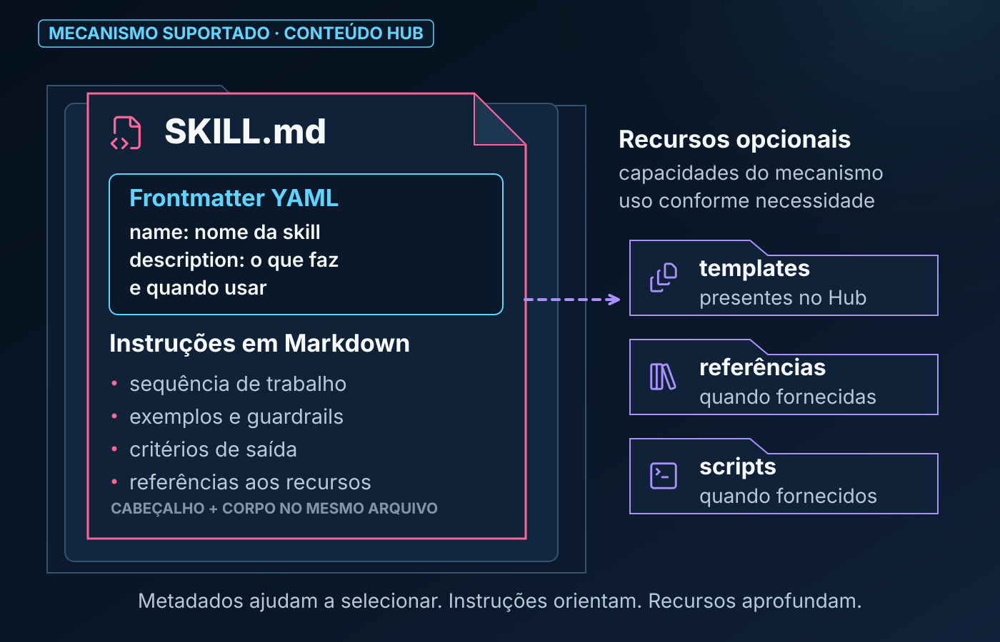

O mecanismo Agent Skills reconhece o pacote; o conteúdo metodológico e seus recursos são mantidos pelo Hub.

- MECANISMO SUPORTADO · CONTEÚDO HUB
- SKILL.md
- Frontmatter YAML
- name: nome da skill
- description: o que faz
- e quando usar
- Instruções em Markdown
- sequência de trabalho
- exemplos e guardrails
- critérios de saída
- referências aos recursos
- CABEÇALHO + CORPO NO MESMO ARQUIVO
- Recursos opcionais
- capacidades do mecanismo
- uso conforme necessidade
- templates
- presentes no Hub
- referências
- quando fornecidas
- scripts
- quando fornecidos
- Metadados ajudam a selecionar. Instruções orientam. Recursos aprofundam.

## prompts.01_mapa_familias

**Pergunta:** Qual família de briefing corresponde ao resultado esperado?

O catálogo textual continua canônico; a figura ensina como escolher a família.

- ROTEADOR DE BRIEFINGS
- Comece pelo resultado esperado
- O catálogo textual continua canônico; a figura orienta a primeira escolha.
- QUAL
- RESULTADO
- VOCÊ
- PRECISA?
- 01
- Entender uma base
- e seu perfil
- Exploração &
- Perfilamento
- 02
- Modelar, medir
- ou acompanhar
- Modelagem, Safras
- & Estatística
- 03
- Conferir dados,
- código ou bases
- Qualidade,
- Reconciliação
- & Auditoria
- 04
- Explicar, documentar
- ou iniciar
- Documentação,
- Tutoria &
- Onboarding
- DECISÃO
- FAMÍLIA
- Depois, use a matriz e o catálogo para escolher o briefing específico.

## prompts.02_fluxo_operacional

**Pergunta:** Como o briefing evolui até uma entrega verificável?

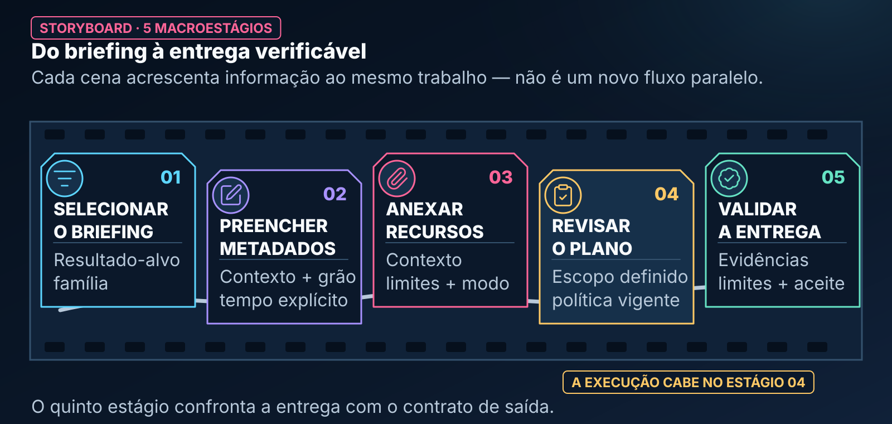

A execução ocorre dentro do escopo e da política definidos no estágio de revisão.

- STORYBOARD · 5 MACROESTÁGIOS
- Do briefing à entrega verificável
- Cada cena acrescenta informação ao mesmo trabalho — não é um novo fluxo paralelo.
- 01
- SELECIONAR
- O BRIEFING
- Resultado-alvo
- família
- 02
- PREENCHER
- METADADOS
- Contexto + grão
- tempo explícito
- 03
- ANEXAR
- RECURSOS
- Contexto
- limites + modo
- 04
- REVISAR
- O PLANO
- Escopo definido
- política vigente
- 05
- VALIDAR
- A ENTREGA
- Evidências
- limites + aceite
- A EXECUÇÃO CABE NO ESTÁGIO 04
- O quinto estágio confronta a entrega com o contrato de saída.

## prompts.03_anatomia_briefing

**Pergunta:** O que compõe um briefing técnico forte?

O template permanece o contrato copiável; a figura mostra como seus blocos reduzem ambiguidade e tornam o aceite verificável.

- BRIEFING TÉCNICO
- PREENCHER · CONTEXTUALIZAR · CONFERIR
- 01
- Objetivo e contexto
- problema, decisão e contexto
- campos variam por briefing
- 02
- Recursos
- tabela, notebook ou arquivo
- @ / Add Context
- 03
- Restrições
- custo, tempo e permissões
- ações proibidas
- 04
- Modo de trabalho
- explicar ou gerar código
- execução quando autorizada
- 05
- Contrato de saída
- artefatos e evidências
- limitações declaradas
- 06
- Validação final
- critérios de aceite
- fatos versus hipóteses
- NÃO INFORMADO
- ainda desconhecido
- NÃO APLICÁVEL
- avaliado: não se aplica
- O formulário organiza a conversa; o template em Markdown é a versão copiável.

