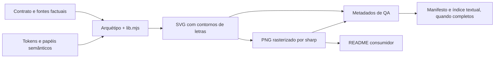

# MT parte vi

<!-- editorial:exclude:start -->
Edição documental de 07/10/2026. Leitura dividida com o conteúdo integral dos módulos.

[Índice](MT-indice.md#sumario-mt) · [Livro completo](../../MANUAL_TECNICO_V2.md#sumario-mt)
<!-- editorial:exclude:end -->

### MT23 — Contrato central e resolução do Sistema de Temas

**Pergunta do capítulo.** Como uma proposta de aparência se torna uma configuração verificável, sem que a validação seja confundida com aprovação ou aplicação? Este capítulo parte do problema de manter vários consumidores coerentes, abre o JSON campo a campo e acompanha o código até o `ResolvedTheme`. Para ler um exemplo visual concreto, consulte MT06; para saber onde o resultado é consumido, avance a MT24. A [referência integral das 98 entradas condicionadas, que representam 97 caminhos distintos](MT-mt23-field-map.md#mt-mod-mt23-field-map) acompanha a explicação.

#### MT23.1 — Identidade, tema, contexto, versão e aprovação

Um notebook usa azul nos títulos, um README usa azul no fundo dos diagramas e uma apresentação usa a mesma cor no papel errado. Mesmo que cada arquivo contenha um valor hexadecimal válido, o conjunto não comunica uma identidade consistente. O Sistema de Temas surgiu para nomear decisões visuais, delimitar onde cada decisão vale e permitir que os consumidores leiam uma configuração completa. O objeto `visual.tema` é o núcleo dessa leitura. Ele recebe dados, confere um contrato fechado e devolve um retrato para outros componentes. Ele próprio não desenha gráfico nem instala estilos.

Chamar esse retrato de tema exige três distinções. A **identidade** declara qual família visual a proposta pretende representar; `identity_id` tem o valor fixo `hub` no schema. O **tema** é uma configuração com `theme_id`, `theme_version`, nomes de exibição, contexto, modo, compatibilidade, conjunto de recursos e todos os tokens exigidos. Um token é uma escolha nomeada, como a cor principal ou a largura de um gráfico. A **aprovação** é uma decisão de governança externa ao JSON. Essa separação foi fixada pelo ADR-0013: um arquivo estruturalmente válido não pode escrever para si uma autoridade que o aprovou. Por isso, o schema não aceita campos improvisados como `approved_by` ou `role` no objeto de tema.

`theme.schema.json` especifica a versão `0.1.0` do formato de configuração. A API de resolução declara compatibilidade `1.0.0`; o contrato editorial de README, também chamado `1.0.0`, regula outra coisa: como documentar os objetos. Os números não formam uma única linha de evolução. O `theme_version` do documento identifica a revisão da proposta, enquanto `engine_compatibility` expressa que versão da API a consegue interpretar. A pessoa deve comparar cada versão com o contrato correspondente, não concluir que “1.0.0” do README validou um JSON. Essa distinção também orienta uma migração: mudar a documentação de um objeto não exige, por si, alterar o schema ou o formato de uma proposta já salva.

A configuração tem `mode` entre `light`, `dark` e `high_contrast`, e `context` entre `notebook`, `readme` e `presentation`. O contexto responde a que tipo de consumidor a escolha se destina. `app` e `aibi` aparecem como reservados na política do schema; não são valores aceitos em `context`. O Databricks App usa uma configuração `notebook` para ajudar na autoria. A ponte AI/BI parte de um `ResolvedTheme` `notebook` e projeta somente o que consegue mapear. Nenhuma dessas superfícies cria por si um quarto ou quinto contexto. Também não se pode deduzir que um modo válido no schema funciona em todos os adaptadores: alguns consumidores ainda aceitam só `light`.

Considere a fixture `legado_notebook.json`. Ela é um documento completo empacotado para preservar o aspecto de referência e testar compatibilidade; `load_reference_theme("notebook")` a carrega. O resultado pode exibir o nome, 48 tokens, hashes e avisos de que o contrato foi validado sem aprovação nem aplicação. Esses avisos não são ornamento: tornam visível a fronteira entre “os dados podem ser entendidos pelo núcleo” e “a aparência foi vista e autorizada no destino”. Trocar apenas o contexto para `app` seria um contraexemplo: o schema recusaria o valor antes que um consumidor visual pudesse inventar um fallback.

O campo `x-hub-policy` no próprio schema inclui `candidate: true`, restrições de CSS/paths/herança e contextos reservados. Ele registra a intenção de contrato daquele arquivo; não funciona como fonte de andamento de toda a iniciativa. Em 07/10/2026, o [índice vivo](https://github.com/Guimarais-R-Rodrigo/Ambiente_Databricks/blob/983c9936f139402a0130f290653ae713d65a3ac7/docs/sprints/sistema_temas/README.md) registra V00–V13 e V14 S0/S1 integradas; a [nota V14](https://github.com/Guimarais-R-Rodrigo/Ambiente_Databricks/blob/983c9936f139402a0130f290653ae713d65a3ac7/docs/sprints/sistema_temas/V14/README.md) mantém slots operacionais bloqueados e S2–S8 sem início comprovado. Integração de S1 não declara readiness ou go-live. Distinguir esses níveis permite explicar o código existente sem prometer que a configuração foi distribuída, que o navegador a renderizou ou que alguém aprovou a identidade. O leitor técnico ganha uma regra simples de manutenção: quando a pergunta for “quais campos são válidos?”, consulte o schema; quando for “quem decidiu?”, consulte a governança e a evidência de aprovação.

#### MT23.2 — O schema e os tokens, campo a campo

Um JSON é um conjunto estruturado de pares nome e valor. No tema, sua raiz é um objeto fechado: `additionalProperties: false` impede que um produtor acrescente chaves desconhecidas para contornar uma validação. Os onze campos obrigatórios são `schema_version`, `theme_id`, `theme_version`, `display_name`, `description`, `identity_id`, `mode`, `context`, `engine_compatibility`, `asset_set_id` e `tokens`. A [tabela integral](MT-mt23-field-map.md#mt-mod-mt23-field-map) apresenta cada entrada contextual, caminho, significado, tipo, limite, default declarativo, valor de exemplo e referências de consumidor. São 98 entradas porque `font.family` tem um registro por contexto; os caminhos distintos são 97. Ler a tabela com os caminhos é importante: o nome `brand.primary` é uma chave literal dentro de `tokens`; sua escrita correta é `$.tokens["brand.primary"]`. O caminho `$.tokens["palette.categorical"][*]` indica cada item do array, não uma propriedade do objeto raiz. Essa precisão é necessária para corrigir a proposta certa quando um validador informa que um item tem formato inadequado. Não existe um objeto intermediário `brand` aceito pelo schema.

Na primeira família de campos, `schema_version` deve ser literalmente `0.1.0`; `identity_id`, literalmente `hub`. `theme_id` é um identificador minúsculo com segmentos separados por hífen, de 3 a 64 caracteres. `theme_version` obedece três números de versão separados por pontos, com máximo de 32 caracteres. `display_name` e `description` são textos para gente ler, respectivamente até 80 e 320 caracteres, sem os controles ASCII U+0000–U+001F e U+007F nem os sinais de abertura/fechamento de tag. Esse recorte diminui ambiguidade de identificação e impede que texto livre se converta em marcação perigosa na apresentação. O campo `mode` escolhe variação visual; `context` determina a forma exigida para `tokens` e `asset_set_id`, não apenas um rótulo descritivo. Um nome de exibição pode mudar para ajudar a pessoa a reconhecer a proposta, mas uma alteração de `context` troca o contrato inteiro dos tokens. Por isso, não se deve corrigir um erro de contexto trocando apenas uma string no cabeçalho do JSON.

`engine_compatibility` é outro objeto fechado, com três campos obrigatórios: `api_major=1`, `minimum_version` em formato de versão de três componentes e `maximum_major_exclusive=2`. O schema verifica forma e constantes; o resolvedor ainda compara a versão mínima com seu motor `1.0.0`, impedindo usar uma proposta que exige capacidade futura. Isso exemplifica a diferença entre validação estrutural e regra semântica de execução. `asset_set_id` admite `sem-assets` ou `editorial-v2-congelado`. O primeiro é exigido quando `context="notebook"`; `readme` e `presentation` exigem o segundo. O manifesto de assets, discutido na próxima seção, vincula essa escolha a arquivos reais.

O bloco `tokens` muda de contrato conforme o contexto. Um notebook precisa de **48 tokens**, cada um presente e nenhum extra. Cores centrais incluem `brand.primary` e `brand.accent`; cores de texto e superfície incluem `text.primary`, `text.plot`, `text.secondary`, `surface.section`, `surface.card` e `table.header_text`. Divisórias têm variantes `divider.light` e `divider.medium`. Status se distribui entre fundo e texto para `ok`, `warn` e `fail`. Separar esses papéis evita supor que uma cor bonita isolada terá contraste adequado com qualquer fundo. O schema confere formato; a legibilidade no render final requer outra verificação. A mesma cor de alerta pode ter contraste suficiente sobre fundo claro e insuficiente sobre outro fundo; o papel semântico nomeia a intenção, mas a combinação concreta precisa ser avaliada no componente que a exibe.

Quatro nomes semânticos, `semantic.positive`, `semantic.negative`, `semantic.neutral` e `semantic.warning`, dão cores a mensagens analíticas. Quatro paletas são arrays de cores: `palette.categorical`, `palette.curves_legacy`, `palette.sequential` e `palette.diverging`. As duas primeiras aceitam 2–20 entradas, a sequencial 2–11, e a divergente 3–11; o código exige número ímpar na divergente para haver uma posição central. Cada elemento tem formato `#RRGGBB` em letras hexadecimais maiúsculas, sem alpha. Por exemplo, `#005CA9` é aceito; `#005ca9` não é corrigido silenciosamente na importação. `normalize_color` existe como ajuda explícita de autoria, que deve ser chamada antes de formar o documento final.

Os números do notebook especificam dimensões de gráfico, seção, cartão e badge. `chart.font_px`, `chart.title_px`, `chart.footer_px`, largura, altura e quatro margens controlam a composição do gráfico; `section.title_px`, `section.description_px`, raio, borda e dois paddings controlam o bloco de seção; `card.*` e `badge.*` fazem o equivalente para suas peças. Cada um é inteiro com faixa própria no schema. O sufixo `_px` indica pixels na configuração, mas não deve ser lido como promessa de dimensão percebida igual em todos os navegadores ou escalas. `font.family` aceita apenas famílias nomeadas `system_sans` e `system_arial`, evitando uma string CSS arbitrária no documento. A tabela anexa permite verificar, por exemplo, que `chart.height_px` vai de 240 a 1600, enquanto `section.border_px` vai de 0 a 12; não são limites intercambiáveis.

Para `readme` e `presentation`, `tokens` exige **32 campos editoriais** e um conjunto de assets congelado. A família `editorial.*` nomeia fundo, painel, linha, texto, tons discretos e papéis de Hub, nativo Databricks, decisão humana, resultado e alerta. `font.family` permite `editorial_inter` ou `system_arial`. `typography.*` oferece tamanhos para título de apresentação, heading de README, módulo, corpo e texto pequeno; `geometry.*` estabelece cantos, conectores, borda, margem segura e opacidade de brilho; `canvas.*` delimita largura/altura da peça. Nomes como `editorial.human_decision` são papéis de comunicação no desenho, não um campo de autorização humana. Esses nomes definem o contrato, mas não garantem efeito em todo renderer. A referência operacional explicita tokens editoriais encaminhados e ainda sem leitura, enquanto parâmetros próprios das composições podem prevalecer. O grupo não é uma paleta de cores intercambiáveis: `editorial.gradient_end` fecha o gradiente de fundo; `editorial.atlas_core` nomeia o centro de uma composição Atlas; `editorial.dossier_back`, `dossier_middle` e `dossier_fold` distinguem planos de uma ilustração de dossiê. `editorial.databricks_native` identifica graficamente uma superfície nativa, `editorial.hub_custom` uma peça do Hub, `editorial.result_evidence` um resultado e `editorial.supporting_method` um método de apoio. Essas cores sustentam a legenda junto de forma e texto definidos em `semantic_roles.yaml`; cor isolada não comunica autoridade. O código de produção copia cinco assinaturas aprovadas por hash: encontrar `atlas_core` em `signatures.mjs` não significa que a assinatura congelada será recolorida na regeneração atual. `geometry.glow_opacity` é um número entre 0 e 0,3; não é uma string percentual. `canvas.width_px` admite 720–3200 e `canvas.height_px`, 480–1800. Na geração candidata V06, esses dois campos são metadados do tema: cada figura continua usando a dimensão aprovada em seu contrato de renderização. O mesmo compositor exige `editorial_inter` para a fonte, apesar de o schema aceitar também `system_arial`; uma configuração válida no núcleo pode, portanto, ser recusada por um consumidor mais restrito. A separação de 48 e 32 campos impede aplicar dimensões de banner a uma figura Plotly ou inventar tokens faltantes com defaults implícitos. O schema contém `default` para os tokens como referência declarativa, e `TOKENS.md` os apresenta dessa forma. O resolvedor exige todas as chaves e não injeta esses valores quando a proposta omite alguma. Para criar uma proposta a partir de uma referência, copie explicitamente uma fixture ou preencha o documento inteiro; a validação nunca transforma um JSON parcial em tema completo.

O formato fechado tem um custo de autoria: a pessoa precisa fornecer todos os valores exigidos para o contexto. Esse custo é intencional. Se `brand.primary` estiver ausente em notebook, a resposta correta é um erro como `SCHEMA_REQUIRED`, com caminho conhecido e orientação segura, e não buscar uma cor “razoável” de outro tema. Se aparecer uma chave `approved_by`, o erro de propriedade adicional recorda que o JSON descreve aparência, não poder decisório. A combinação schema mais validações semânticas não garante beleza, contraste ou publicação; ela estabelece que cada consumidor receba uma configuração completa e interpretável. MT23.3 segue o trajeto pelo qual o núcleo converte esse documento em resultado resolvido.

#### MT23.3 — Carregamento, validação, resolução e recursos

O schema descreve o formato esperado, mas não abre arquivos nem verifica que um PNG citado existe. Esse trabalho pertence a `hub_snippets/visual/tema/tema.py`. Há duas portas públicas. `resolve_theme(value, expected_context=...)` recebe bytes UTF-8 ou um dicionário JSON completo em memória. `load_theme(root, relative_path, expected_sha256=..., expected_context=...)` lê um arquivo dentro de uma raiz escolhida pelo código confiável e chama a mesma resolução. O hash esperado é opcional, mas quando fornecido fixa os bytes exatos da proposta a ler. Não funciona como assinatura ou permissão de uso. Isso permite a um mantenedor pedir que uma revisão específica seja conferida: se alguém alterar apenas um espaço no arquivo, a leitura por hash esperado falha antes da resolução, embora o conteúdo semântico talvez fosse igual. A escolha é útil em handoffs de revisão porque evita que o leitor receba acidentalmente outra versão sob o mesmo nome.

No caminho de arquivo, `_safe_file` recusa path absoluto, `..`, barra invertida, URL, symlink e referência fora da raiz. `_read_bytes` exige arquivo regular, limita leitura, abre com guardas disponíveis e confere identidade/tamanho antes e depois. O comentário da própria implementação faz uma ressalva: essas medidas não são uma sandbox contra um processo hostil que substitui diretórios pais enquanto ocorre a leitura; permissões da raiz continuam necessárias. Esse limite técnico deve acompanhar qualquer orientação de instalação. A vantagem concreta do design é impedir que um JSON não confiável aponte para outro schema, outro manifesto ou recurso fora do pacote permitido.

Antes de consultar o schema, `_strict_json` decodifica UTF-8 sem marca BOM, recusa mais de 131.072 bytes, profundidade acima de 12 níveis, chaves duplicadas e valores `NaN`/infinito. `_copy_json` limita 8.192 nós, ciclos em objetos Python e tipos que não correspondem exatamente a JSON, além de rejeitar sequências Unicode isoladas. Se `resolve_theme` recebeu um dicionário, cria sua representação canônica para aplicar o mesmo limite de bytes. Essas guardas impedem que o parser transforme um documento ambíguo ou excessivo em valor aparentemente regular; não avaliam se a paleta será agradável. Uma chave repetida, por exemplo, pode fazer duas pessoas lerem valores distintos conforme o parser usado. Recusá-la evita escolher silenciosamente uma das versões.

O schema e `assets.json` vêm da pasta instalada do pacote, com SHA-256 esperados no módulo. `_schema_validator` verifica o dialeto JSON Schema Draft 2020-12, recusa referências remotas ou dinâmicas, `$id` aninhado e ciclos de referência; só resolve referências internas como `#/$defs/notebookTokens`. Bibliotecas `jsonschema` e `referencing` são importadas na chamada de validação, não no import simples do módulo. Uma dependência ausente produz erro explícito, sem instalação automática. `_validate_theme` deixa o schema checar campos, tipos, enums, padrões, `required` e propriedades adicionais. A mensagem de erro não repete conteúdo arbitrário da proposta; indica código e caminho conhecido para correção. Isso evita que dados não confiáveis vazem na mensagem usada para diagnóstico.

Depois das regras estruturais, o código confere compatibilidade real com API `1.0.0`: uma `minimum_version` futura não passa só porque sua sintaxe parece versão. Para notebook, uma paleta divergente deve ter quantidade ímpar, criando um centro interpretável que o limite 3–11 do schema, sozinho, não garante. `expected_context`, quando presente, precisa coincidir com `context` do documento. Não existe uma ordem de “prioridades” que mescle configurações: cada documento é completo, e `resolve_theme` não herda, não injeta defaults e não recorre a outro contexto quando falha. Essa é a proteção contra uma proposta parcial ser interpretada de maneiras diferentes por dois consumidores.

`_asset_manifest` então lê o conjunto indicado em `asset_set_id`, confere que ele existe e valida os hashes dos recursos referenciados. Para notebook, o contrato exige `sem-assets`; para conteúdo editorial, `editorial-v2-congelado`. Essa conferência liga nome e bytes de recursos do pacote, não aprova sua aparência. Se um asset difere do manifesto, a resolução falha em vez de trocar por uma imagem parecida. O hash do manifesto entra no retrato final para que uma mudança de recursos não fique invisível para quem compara duas resoluções. Cada entrada associa um caminho relativo controlado a um SHA-256 esperado. O limite de leitura de asset é maior que o do JSON de configuração, porque uma imagem pode exigir mais bytes; isso não autoriza o documento de tema a conter uma imagem em base64 ou um path arbitrário. A ligação permanece mediada pelo conjunto enumerado no manifesto.

A etapa final cria JSON canônico `hub-json-v1`: chaves ordenadas, listas na ordem original, UTF-8 sem escape obrigatório de acentos, separadores compactos, newline final e floats integralmente equivalentes convertidos em inteiros. `raw_sha256` cobre os bytes de entrada; `content_sha256`, o JSON canônico. Assim, duas indentações podem produzir raw hash diferente e content hash igual. `fingerprint` combina hash do conteúdo, SHA do schema, SHA do manifesto, versão da API e nome da serialização. Ele identifica a configuração efetiva sob esse contrato, sem autenticar autoria nem provar aprovação. A representação é congelada em `ResolvedTheme`: `dataclass(frozen=True)`, mapas protegidos e listas como tuplas. `to_dict()` devolve cópia editável; alterar a cópia não mexe no objeto. `origins` informa de que documento veio cada token, e `warnings` registram que validar não aplicou nem aprovou.

Por fim, `export_theme(theme)` revalida o resultado, compara fingerprint e content hash e devolve bytes canônicos em memória. Ele não grava arquivo, não instala template Plotly e não muda um notebook. Uma figura só muda quando um consumidor específico recebe o `ResolvedTheme` e executa sua rota temática, assunto de MT24. Essa separação deixa claro onde um erro deve ser investigado: sintaxe/arquivo na entrada, contrato na validação, recurso no manifesto, compatibilidade no motor ou aparência no consumidor. A presença de hash em cada etapa facilita comparar versões, mas não transforma toda falha de leitura em problema de segurança nem dispensa observar o render.

#### MT23.4 — Referências legadas, opt-in, erros e compatibilidade

Um sistema novo precisa preservar a leitura dos notebooks já existentes. Os quatro JSONs em `identidade_visual/exemplos/` são derivados das fixtures históricas V01: `legado_notebook.json`, `legado_editorial.json`, `executivo_claro_exemplo.json` e `apresentacao_exemplo.json`. A referência notebook mantém escolhas históricas para comparação; os exemplos editoriais ilustram o formato `readme` ou `presentation`. Eles não são marcas aprovadas apenas por residirem no pacote. `load_reference_theme()` aceita `notebook`, `readme` e `presentation` e seleciona as fixtures mapeadas pelo código; `executivo_claro_exemplo.json` serve como exemplo adicional, não como quarto valor de contexto.

`TOKENS.md` é gerado a partir do schema e da cobertura atual dos consumidores para consulta humana. A rota `operational_dictionary` de [temas_v01_contract.py](https://github.com/Guimarais-R-Rodrigo/Ambiente_Databricks/blob/983c9936f139402a0130f290653ae713d65a3ac7/tools/temas_v01_contract.py) separa essa projeção de uso do dicionário histórico; editar a referência não muda o motor. Ler essa referência ajuda a distinguir nome válido, leitura efetiva, prévia disponível e correspondência AI/BI. Por exemplo, `brand.accent`, `semantic.positive` e `semantic.neutral` são validados e preservados, mas não têm leitura visual direta nas APIs notebook atuais; as curvas usam `palette.curves_legacy`. Um controle sem componente de prévia fica desabilitado, sem descartar o valor. O dono da estrutura é `theme.schema.json`; os exemplos são derivações verificadas. Essa direção evita duas fontes de verdade: se uma nova versão adiciona token, o mantenedor precisa alterar o contrato, regenerar a referência e rever consumidores, em vez de corrigir só uma tabela. Os quatro exemplos podem ser usados para testes de leitura e comparação, mas uma aprovação de identidade precisa de registro próprio com autoridade e escopo; reutilizar a fixture como padrão operacional só porque ela passou no teste seria uma mudança de significado não documentada. `assets.json` também pertence ao pacote resolvido e liga conjuntos a recursos com hashes; criar um novo diretório de PNGs não faz o resolvedor adotá-lo automaticamente.

No primeiro uso, é instrutivo provocar um erro controlado: retire `brand.primary` de uma cópia de `legado_notebook.json` em memória e chame `resolve_theme`. O schema informa `SCHEMA_REQUIRED`, indicando o campo que falta sem exibir o documento inteiro. A resposta correta é restaurar um valor permitido e justificar sua escolha; não acrescentar uma regra de fallback em um consumidor. Alterar `context` para `readme` mantendo 48 tokens de notebook também não é uma conversão: esse contexto exige 32 tokens editoriais e o conjunto congelado de assets. O `ERROS.md` do padrão central relaciona códigos e ações para recuperar uma proposta sem relaxar guardas.

Há uma utilidade deliberadamente separada, `normalize_color("#005ca9")`, que devolve `#005CA9` quando chamada na etapa de autoria. Importar um JSON contendo a forma minúscula continua falhando, porque o loader não a invoca em segredo. O comportamento força a pessoa a ver a mudança de bytes antes de atribuir novo hash à proposta. Também se evita usar `export_theme` como sinônimo de salvar: ele apenas devolve bytes; `load_theme` apenas lê uma revisão determinada. Persistência de proposta e sessão é serviço do Visual Lab ou de outro fluxo explícito.

Para um consumidor legado, a presença do núcleo no repositório não ativa um tema. Funções existentes continuam com suas cores e estilos até a chamada de uma rota `_resolvido` com resultado validado. Essa escolha protege notebooks antigos de alterações silenciosas. A rota configurável, porém, não garante a mesma cobertura para todos os gráficos nem todos os modos: uma função pode aceitar somente `light`, e as exceções documentadas precisam permanecer explícitas. Por exemplo, validar `mode="dark"` no núcleo prova que seus tokens obedecem ao schema; não prova que o adaptador Plotly da versão observada gere uma prévia escura. O consumidor deve declarar sua restrição e recusar o modo, sem exibir uma versão clara disfarçada. A revisão deve conferir o nome da função, o contexto esperado e os tokens que ela efetivamente consome. Se o resultado em um navegador for ruim apesar de um JSON válido, o diagnóstico sai do schema e passa ao componente, à combinação de cores e ao ambiente de exibição.

Ao terminar este capítulo, a pessoa deve conseguir explicar por que “o JSON passou” é uma afirmação estreita: forma, limites, compatibilidade e recursos foram verificados pelo núcleo em uma versão concreta. A decisão de identidade, o contraste real, a autorização e a publicação requerem outras fontes e outras etapas. MT24 mostra os adaptadores que recebem esse retrato; MT25 e MT26 examinam os arquivos visuais editoriais que o manifesto ajuda a preservar.

<!-- editorial:exclude:start -->
**Fontes de contrato e implementação.** [Schema central](../../hub_padroes/identidade_visual/theme.schema.json), [núcleo tema.py](../../hub_snippets/visual/tema/tema.py), [manifesto assets.json](../../hub_padroes/identidade_visual/assets.json), [referência TOKENS](../../hub_padroes/identidade_visual/TOKENS.md), [guia de erros](../../hub_padroes/identidade_visual/ERROS.md), [ADR-0013](https://github.com/Guimarais-R-Rodrigo/Ambiente_Databricks/blob/983c9936f139402a0130f290653ae713d65a3ac7/docs/decisions/ADR-0013-sistema-de-temas.md). Estado de integração: [índice Sistema de Temas](https://github.com/Guimarais-R-Rodrigo/Ambiente_Databricks/blob/983c9936f139402a0130f290653ae713d65a3ac7/docs/sprints/sistema_temas/README.md) e [V14](https://github.com/Guimarais-R-Rodrigo/Ambiente_Databricks/blob/983c9936f139402a0130f290653ae713d65a3ac7/docs/sprints/sistema_temas/V14/README.md).
<!-- editorial:exclude:end -->

<!-- editorial:exclude:start -->
[Anterior: MT22](MT-parte-v.md#mt22) · [Próximo: MT24](#mt24) · [Sumário](MT-indice.md#sumario-mt) · [Guia por pergunta](MT-indice.md#perguntas-mt) · [Trilhas](MT-indice.md#trilhas-mt) · [MU14](MU-parte-v.md#mu14)
<!-- editorial:exclude:end -->

### MT24 — Consumidores visuais, Visual Lab, App e AI/BI

**Pergunta do capítulo.** Depois de validar um tema, que parte do Hub realmente o usa e que efeito cada superfície produz? O percurso começa nos adaptadores que desenham um gráfico ou um bloco HTML, segue pela autoria no Visual Lab e no App e termina na projeção conservadora para AI/BI. Quem precisa compreender a construção do JSON e de `ResolvedTheme` pode ler MT23; quem quer executar uma tarefa sem seguir o código pode começar por MU14 ou MU17.

#### MT24.1 — Plotly, HTML, tabelas e rotas `_resolvido`

Um tema validado ainda é um objeto de dados. Para aparecer numa figura, alguém precisa interpretar seus tokens e aplicar escolhas específicas. O caminho técnico é `JSON completo → ResolvedTheme → adaptador → figura, HTML ou tabela`. Há também uma entrada independente de dados analíticos para o gráfico ou a tabela. Essa segunda entrada importa: trocar uma cor não deve trocar a amostra, a métrica, o limiar nem a ordem das linhas. O sufixo `_resolvido` marca os pontos em que o consumidor recebe explicitamente o retrato verificado. A chamada legada sem sufixo conserva a aparência histórica.

`visual.tema` é o primeiro dos oito objetos da categoria visual, mas sua função é preparar o retrato, não desenhar. `visual.theme_plotly` oferece a camada Plotly. `get_tema_eda()` retorna o layout legado, com template `plotly_white`, cores e dimensões fixas; `aplicar_tema(fig, ...)` altera a figura recebida e pode acrescentar notas de fonte, subtítulo e N. `get_tema_plotly(theme)` monta um dicionário de layout a partir de tokens notebook `light` sem tocar estado global. `aplicar_tema_resolvido(fig, theme, ...)` revalida o resultado, aplica layout à mesma figura e devolve essa figura. Ela preserva os dados e cores explicitamente já definidas nos traces; `colorway` só afeta onde Plotly ainda usa a paleta do layout. A diferença é verificável: duas figuras com os mesmos pontos e temas diferentes devem manter as coordenadas, embora título, tipografia, dimensões e cores controladas mudem.

Há um efeito de sessão separado: `registrar_template_plotly()` grava o template legado `caixa` e muda o default global do Plotly no processo. A versão `registrar_template_plotly_resolvido(theme, *, nome, ativar=False, substituir=False)` exige `nome` como argumento keyword obrigatório, limita-o ao padrão `hub-...`, não ativa por padrão e exige opções explícitas para substituição/ativação. Um exemplo fornece `nome="hub-proposta"`; esse nome não é default da API. Substituir um template já ativo também exige `ativar=True`, inclusive quando seu nome participa de default composto. Registrar template e aplicar um layout a uma única figura são decisões distintas. Quem quer apenas uma figura tematizada usa a segunda rota; registrar um padrão na sessão pode afetar figuras criadas depois. O adaptador exige `ResolvedTheme` de contexto `notebook` e modo `light`; um JSON cru, `readme` ou `dark` produz erro, sem fallback para uma aparência arbitrária.

`visual.section_header` devolve HTML de cabeçalho. Se recebe uma etapa entre 0 e 8, procura em `SECOES_EDA` emoji, título e descrição padrão; os textos são escapados antes de entrar no HTML. `visual.divider` devolve fragmentos `
` com espessuras diferentes; `visual.badge` devolve `` para status, score e informação. O badge de score conserva seus cortes no código, razão pelo valor máximo: a partir de 0,8 usa `ok`, de 0,5 a menos de 0,8 usa `warn`, abaixo disso usa `fail`. A rota `_resolvido` troca CSS, não altera os cortes. Isso também mostra uma limitação: o tema não decide se um risco de negócio merece o rótulo `fail`; ele só fornece a aparência do rótulo que o consumidor escolheu.

`visual.kpi_card` produz cartões HTML com rótulo/valor escapados e uma alternativa textual Markdown; só a rota HTML tem variante `_resolvido`. `visual.index_generator` usa `SECOES_EDA` para produzir índice HTML ou Markdown. Mesmo se alguém chamar sua variante resolvida com `markdown=True`, a saída textual permanece Markdown sem CSS de tema. Esse limite evita sugerir que todo token visual deve aparecer em uma representação que não suporta aquele estilo. Todos esses objetos de HTML passam por `get_styles_resolvidos`, que revalida tema notebook e materializa um conjunto fechado de estilos: seção, badge, índice, cartão e tabela, sem aceitar CSS livre da proposta.

Os objetos de `display` ampliam a mesma estratégia: `display_styled_resolvido` mantém DataFrame pandas e formatadores, mas aplica cor de cabeçalho e destaque negativo do tema; `plot_distributions_resolvido` mantém seleção e amostragem Spark, enquanto escolhe cores do layout; `plot_correlation_resolvido` mantém cálculo Spark ML e lista de pares fortes, mas usa paleta divergente em vez da escala `Blues` legada. Outros consumidores V07, como curvas de ML, timeline, UMAP e safras, leem tokens via `get_tokens_plotly` para semânticas próprias. Há exceções declaradas no guia operacional, como SHAP/Matplotlib e Kaplan–Meier; o fato de um gráfico vizinho ser temático não estende suporte a eles.

Um exemplo ilustrativo fixa a distinção. Um DataFrame pandas contém `saldo=-5`; `display_styled_resolvido(tabela, tema, highlight_cols=["saldo"])` devolve HTML cujo destaque negativo vem de `semantic.negative`, mas o valor numérico continua `-5` na tabela original. Sem `highlight_cols`, a rota mantém a aparência de cabeçalho do tema, mas não marca automaticamente o saldo negativo. Já `badge_score_resolvido(80, tema, max=100)` produz badge `ok` pelo corte 0,8 que existe no código, e usa as cores de `status.ok_*` do tema. Alterar `status.fail_bg` não transforma 80 em falha. Para conferir um consumidor, o revisor precisa observar retorno, valores originais, contextos/modes aceitos e quais tokens são de fato lidos. Uma prévia isolada não prova que todos os objetos do Hub adotaram o novo tema.

#### MT24.2 — Visual Lab e Databricks App de autoria

Editar 48 tokens manualmente e imaginar como se combinam numa página é trabalhoso. `visual.theme_lab`, o sétimo objeto visual, cria uma superfície de autoria sobre o mesmo núcleo de MT23. Ele recebe um `ResolvedTheme` notebook, cria um `ThemeLabDraft` com `base` e `current`, e mantém histórico de até cem estados válidos. `apply_updates` prepara e valida a configuração inteira antes de substituir `current`: um lote com valor inválido não deixa metade das alterações aplicada. `set_token` é a conveniência para uma mudança; `undo()` recupera estado anterior e `restore()` retorna à base. A propriedade `dirty` compara hashes de conteúdo da base e da proposta; não diz que o rascunho foi salvo em disco. A revisão aumenta quando um estado válido novo é assumido ou quando uma operação de retorno muda o estado. Aplicar duas vezes os mesmos bytes não cria uma mudança substantiva apenas para inflar o histórico. A decisão de armazenar base e atual separadamente permite comparar sem perder o ponto de partida, enquanto o limite de cem estados impede crescimento indefinido da memória durante uma sessão longa.

`get_control_specs` deriva rótulos, tipo e faixa de cada controle do schema empacotado. Esse ponto de integração reduz o risco de um slider oferecer um número que o resolvedor recusará. Um token sem consumidor visível na galeria não é apresentado como se já produzisse efeito: o controle informa a limitação ou permanece desabilitado. O Lab oferece presets de demonstração por `get_demo_presets()` e permite catálogo explícito de outras referências notebook por `prepare_theme_lab_presets`. `create_theme_lab_from_preset` recusa chave inexistente em vez de escolher outra base silenciosamente. A interface completa é construída com ipywidgets somente quando `build_ipywidgets_lab` ou `build_theme_lab_launcher` é chamada; o import do módulo não carrega widgets nem altera template global Plotly. Há um fallback menor por dbutils widgets para sete campos primários, sem equivalência à experiência completa de catálogo e sessão. Essa separação também controla dependências: validar um JSON com `tema.py` requer as bibliotecas de schema na chamada; abrir a galeria requer pandas, Plotly e componentes de HTML; montar a interface requer ipywidgets/IPython disponíveis. A ausência de uma biblioteca de interface não deve ser “resolvida” fingindo que um rascunho foi visualizado. Cada etapa possui um retorno observável diferente: tema resolvido, prévia sintética, controle interativo ou sessão persistida.

`build_preview` compõe seis representações com dados sintéticos: header, KPI, barras, série temporal, heatmap e tabela. `compare_preview` põe lado a lado base e proposta sobre os mesmos valores, isolando a diferença de aparência. Na série há um valor ausente; na tabela, valores negativos e nulos; o heatmap usa uma matriz explicitamente sintética. Isso evita insinuar que uma prévia visual corresponde a resultados de clientes ou a uma análise real. A galeria exige `light`, pois o adaptador Plotly usado ali ainda recusa `dark` e `high_contrast`. Um tema desses modos pode ser válido no schema e mesmo assim inadequado para essa prévia. Esse contraexemplo mostra que contrato de dados e capacidade do consumidor são verificados em camadas separadas.

A saída em memória também tem dois níveis. `draft.export_bytes()` devolve JSON canônico; `draft.save_proposal(root, filename)` grava uma proposta avulsa numa pasta existente e devolve recibo de arquivo, bytes, hash e revisão. Para retomar um trabalho com base e histórico, `save_theme_lab_session` cria uma pasta exclusiva com `base.json`, `proposal.json`, zero ou mais `history_000.json` e `session.json` por último. Esse manifesto registra hashes, revisão e nomes de exibição. `reopen_theme_lab_session` relê e confere os hashes; `list_theme_lab_sessions` ignora pastas parciais sem manifesto válido, mas verifica apenas esse manifesto. Aparecer na lista não prova integridade atual de todos os payloads; a reabertura faz essa conferência completa. Uma interrupção de escrita pode deixar resíduo parcial, sem recibo de sucesso. O hash demonstra integridade dos bytes reabertos sob aquele registro, não autentica o autor nem aprova a paleta. A pasta raiz deve existir e ter permissões adequadas antes da chamada; o Lab recusa symlink e nome fora do padrão, mas não cria uma sandbox contra outro processo que compartilhe acesso ao mesmo diretório. Essa limitação explica por que o exemplo de autoria usa uma área preparada e por que o recibo não substitui controle de acesso do local onde a sessão foi guardada.

Considere uma proposta sintética: a pessoa escolhe o preset legado, troca `brand.primary` por `#112233`, aplica, compara duas prévias com mesmos números e salva sessão `teste-visual`. Ao reabrir, a base ainda é a referência e a proposta contém o ajuste; `undo` pode recuar pelo histórico salvo. Se a pessoa tentar salvar sobre o mesmo nome ou adulterar `proposal.json`, o fluxo recusa sobrescrita ou reabertura. Esse exemplo explica por que salvar é diferente de exportar bytes, e por que uma comparação local de seis componentes não certifica contraste, teclado, zoom ou renderização no navegador do destino. É um percurso ilustrativo baseado no código; não foi executado nesta redação.

A V10 coloca uma interface Databricks App sobre parte desse fluxo. `databricks_app/app.py` apresenta Streamlit; `app_service.py` concentra identidade, configuração, isolamento e persistência, reutilizando `theme_lab`. `app.yaml` associa o recurso `theme_storage` à variável `HUB_THEME_VOLUME` e fixa `HUB_THEME_APP_MODE=authoring_only`. Fora de um modo de desenvolvimento local declarado, `load_config` exige uma raiz no padrão `/Volumes/<catalog>/<schema>/<volume>` e a pasta disponível; `resolve_user` depende de `X-Forwarded-User` encaminhado pelo proxy. Sem identidade, o App para. O código transforma o identificador recebido em SHA-256 para construir namespace de sessão, em vez de colocá-lo bruto no path, e lista/reabre apenas sessões desse namespace. Isso organiza a navegação por identidade; o hash não cifra conteúdo, cria ACL nem impede acesso direto por quem já tenha permissão no Volume. Permissões reais e confiabilidade do proxy só se comprovam no ambiente implantado. Os arquivos `app.py`, `app_service.py`, `app.yaml` e `requirements.txt` têm funções separadas: tela, regra de serviço, configuração de recursos/comando e dependências. A interface chama o serviço para salvar, listar e reabrir, sem implementar novamente o formato de `session.json`. O modo local exige ativação explícita e identificador sintético; ele serve para testar a lógica, não para simular autenticação real do proxy. No destino, o recurso `theme_storage` precisa apontar para um Volume autorizado e oferecer as permissões efetivas ao principal do App.

O App oferece escolha de base, ajuste, comparação e salvamento/reabertura. Ele não acrescenta `context="app"` ao schema: continua editando configurações de `notebook`. `retention_policy` declara nenhuma exclusão automática nem botão de apagar histórico; `publication_policy` retorna falso para aprovar, promover e publicar. Não existe seletor de papel capaz de tornar a proposta aprovada. O bundle pode ser preparado localmente pela ferramenta V10, mas sua existência no Git não prova deploy, recurso de Volume ativo, headers reais ou experiência em browser. Para um operador, a sequência só é aplicável se o App já tiver sido implantado e autorizado no destino; para o mantenedor, os arquivos fornecem um contrato testável de uma superfície de autoria, sem transformar conveniência de interface em autoridade. A conferência futura deve observar uma sessão real de cada identidade autorizada e verificar que uma não enxerga o histórico da outra, além de provar recuperação após reiniciar o App.

#### MT24.3 — Ponte AI/BI, matriz de capacidades e binding revisado

Uma pessoa pode querer que o dashboard AI/BI se pareça com o notebook. Seria tentador exportar o JSON do Hub e enviá-lo diretamente ao botão `Import theme`. Essa operação falharia por uma razão de contrato: o JSON de `ResolvedTheme` descreve tokens do Hub, enquanto o arquivo nativo de tema do produto tem outro formato. A V11 constrói uma ponte explícita entre os dois mundos. O diretório `identidade_visual/aibi/` conserva `aibi_mapping.json`, a fachada `aibi_theme.py`, a implementação `_aibi_theme_impl.py`, um dashboard sintético de teste e guias. Ele não oferece um conversor universal capaz de adivinhar campos nativos não documentados.

A matriz `aibi_mapping.json` é a tabela de decisões técnicas da ponte. Ela declara versão, contexto de origem `notebook`, produto alvo, status do schema nativo, classes e estratégias permitidas, capacidades alvo, 48 linhas de mapeamento e fontes oficiais. Cada linha associa `hub_token` a `classification`, `target_capability`, `binding_strategy` e uma nota. A [referência dos campos da ponte](MT-mt24-bridge-field-map.md#mt-mod-mt24-bridge-field-map) detalha os caminhos aninhados de matriz, projeção e binding. O código fixa o SHA-256 da matriz e recusa alteração silenciosa: uma entrada com token duplicado, classe inválida, capacidade inexistente ou binding direto para algo que não é tradução interrompe a projeção.

Os 48 tokens do tema notebook se repartem em **3 `translated`**, **23 `approximated`** e **22 `unsupported`**. Os diretos são `surface.card → widget.background`, `palette.categorical → visualization.categorical_palette` e `card.radius_px → widget.corner_radius`. A equivalência é delimitada à capacidade que a matriz registrou; mesmo aqui, a importação real depende do arquivo nativo e do render final. Uma aproximação como `brand.primary` para cor de seleção pode parecer visualmente coerente, mas cor de marca e estado de seleção cumprem funções diferentes. Por isso sua estratégia é manual. Um token `unsupported` não recebe capacidade alvo nem estratégia de aplicação. A ponte deixa a lacuna visível em vez de ignorá-la ou escolher uma propriedade parecida ao acaso.

`project_theme(theme)` exige um `ResolvedTheme` íntegro `notebook`. Ele chama `export_theme` para revalidar conteúdo e recursos, compara o fingerprint e exige que os tokens da configuração coincidam exatamente com os da matriz. Cada linha ganha `source_value`, preservando o valor de origem ao lado da classificação. O resultado `AibiThemeProjection` registra ID e versão do tema, fingerprint, content hash, modo, SHA da matriz e avisos. `export_projection` serializa esse resultado no formato `hub-aibi-theme-projection`, versão 1, com objetos `source` e `target`, contagem por classe, mappings e warnings. O `target.native_import_ready` é falso, e `native_schema_status` não afirma validação. Trata-se de um inventário auditável de correspondências, não de um arquivo para `Import theme`. No JSON exportado, `source.theme_id`, `source.theme_version`, `source.fingerprint`, `source.content_sha256`, `source.context` e `source.mode` deixam explícita a base da projeção. `summary.translated`, `summary.approximated` e `summary.unsupported` permitem conferir cobertura; cada `mappings[*].source_value` conserva o valor usado na decisão. `mapping_sha256` amarra o resultado à matriz revisada. Esses caminhos são campos do formato do Hub. Nenhum deles deve ser copiado como se fosse campo nativo do Databricks.

Para preparar um candidato ao formato nativo sem inventar o schema, a pessoa autorizada exporta um tema real de um dashboard draft e preserva os bytes e o SHA-256 do arquivo. Um mantenedor examina os campos presentes e fornece um binding separado: `binding_version=1`, `template_sha256` igual ao export e `paths` com pares capacidade direta → JSON Pointer absoluto. Um JSON Pointer identifica um campo dentro do arquivo, por exemplo `/alguma/chave` quando essa chave realmente existe; o exemplo é apenas sintaxe, não uma promessa de que o Databricks usa esse caminho. A implementação de `bind_native_template` recusa pointer vazio, duplicado, inexistente, que atravessa escalar, troca tipo ou tenta substituir a raiz. Também recusa automatizar qualquer uma das 23 aproximações ou 22 lacunas. Nenhuma chamada à API Databricks ocorre nessa etapa. O binder aceita vincular um subconjunto das três capacidades diretas: as capacidades diretas não informadas aparecem em `omitted_capabilities`, e as aplicadas em `applied_capabilities`. Template e binding precisam ser objetos JSON válidos em UTF-8 sem BOM; o parser local limita 262.144 bytes, profundidade e números não finitos, recusando propriedades duplicadas. Essas guardas protegem o fluxo local contra entradas ambíguas, mas não validam o formato nativo inteiro, cuja autoridade continua com o export e o import do produto no ambiente autorizado.

Um exemplo ilustrativo, sem arquivo real do destino, explica o algoritmo. Imagine que um export autorizado contenha uma propriedade de cor de fundo de widget com tipo string e que a revisão humana registre seu pointer exato para `widget.background`. O binder compara o hash do export, localiza aquele campo, confere que o valor `surface.card` também é string e só então gera bytes candidatos com o valor substituído. Se o export novo trocar a estrutura, o hash ou o pointer deixa de coincidir e a operação para. O retorno `AibiNativeCandidate` guarda bytes, hash da origem, hash do candidato, capacidades aplicadas/omitidas e status `locally_bound_not_databricks_validated`. Ele não comprova que o botão nativo aceitará o arquivo. Um contraexemplo é apontar `brand.primary` como direto: a matriz o classifica como aproximação, então a automação é recusada mesmo que as duas cores sejam hexadecimal.

A distinção de escopo do AI/BI também importa. O tema de workspace é administrado nesse nível e funciona como ponto de partida para dashboards novos. Um dashboard existente recebe uma cópia, ou snapshot, quando o tema do workspace é aplicado; mudanças posteriores no tema de workspace não se propagam automaticamente para aquela cópia. Um dashboard pode manter customização local, incluindo `Color mappings` por valor. Aplicar tema e publicar dashboard são ações separadas. As [configurações oficiais de dashboard](https://docs.databricks.com/aws/en/dashboards/manage/settings), reconsultadas em 07/10/2026, documentam `Export theme`, `Import theme`, preview claro/escuro, snapshot e falha de importação que deixa o dashboard inalterado. O Hub registra essas capacidades como base de seu contrato local, sem afirmar que conhece o schema JSON nativo completo; um export real e revisão do ambiente ainda são necessários. `workspace_theme_policy()` e `dashboard_theme_policy()` são declarações locais: não consultam permissões nem configuração real. A guarda `authorize_local_operation()` aceita flags sintéticas de administrador e draft para testar a política; passar `workspace_admin=True` num teste não autentica a pessoa. Ela recusa publish e escrita de API, mesmo quando a flag local diz que o usuário é administrador. Esse desenho evita que uma função auxiliar de política seja confundida com cliente remoto.

`dashboard_sintetico.json` apoia testes de preservação semântica com KPI, série, barras, tabela, texto e filtros fictícios. Ele não é um arquivo Databricks importável. A verificação de uma proposta deve comparar dados, filtros, agregações, unidades, ordenação e mapeamento de categorias antes/depois; se algo analítico mudou, a operação deixou de ser puramente visual. O teste local consegue recusar adulterações e mappings indevidos, mas não prova que o dashboard renderiza bem em claro/escuro nem que a pessoa tenha permissão de importação. O procedimento do Manual do Usuário, MU17, parte dessas mesmas fronteiras e só apresenta o fluxo remoto como condicionado a ambiente autorizado.

#### MT24.4 — Compatibilidade, acessibilidade, ownership e estados

A arquitetura visual acumula versões com perguntas diferentes. V02 valida e resolve; V03 aplica Plotly; V04 materializa HTML; V05 organiza autoria; V06 gera variantes editoriais candidatas; V07 amplia consumidores; V08/V09 alinham orientação e transição; V10 acrescenta App de autoria; V11, a ponte AI/BI. Esses mecanismos chegaram ao Git em etapas registradas no índice do Sistema de Temas. Dizer “integrado” descreve código e documentação no repositório; não descreve automaticamente deploy, browser, usuários ou prontidão operacional. Os guias atuais organizam o percurso por tarefa e mantêm registros de candidatura nos owners históricos. Para estado da frente, use o índice vivo e a nota administrativa V14, sem promover resultados datados a novas provas de ambiente.

A V12 registrou um achado real: `A11-01` permaneceu **FAIL** por contraste insuficiente de `cellFormat` explícito num dashboard, acompanhado da issue #57. Esse fato não deve ser apagado porque outros testes passaram. As jornadas `V12-LAB-01`, `V12-APP-01` e `V12-AIBI-02` ficaram **BLOQUEADO_AUTORIZACAO** para mutações ou implantação reais. Bloqueio não é falha de código, mas tampouco é evidência de funcionamento remoto. O checkpoint distingue execução local, ambiente Databricks e leitura humana; essas classes têm oráculos distintos. O teste de um App em diretório temporário verifica lógica de namespace e persistência; não prova que o proxy real enviou o header esperado. Um dashboard sintético local verifica que a projeção não alterou consultas; não prova importação no navegador. Um avaliador humano pode encontrar dificuldade de leitura mesmo quando todas as assertivas de Python passaram. Registrar esses limites ao lado dos resultados evita transformar um PASS estreito numa promessa de produto. Um teste de serialização, por exemplo, pode verificar hash de proposta, mas não o contraste de um texto quando o navegador e o tema do dashboard combinam estilos adicionais.

V14 S0 e S1 estão integradas no Git. A [nota administrativa de 06/10/2026](https://github.com/Guimarais-R-Rodrigo/Ambiente_Databricks/blob/983c9936f139402a0130f290653ae713d65a3ac7/docs/sprints/sistema_temas/V14/README.md) registra S1 integrada pela PR #72 em `79f53ba1`; os rótulos candidatos abaixo da nota preservam o período pré-merge. Ela atribui owner técnico às seis superfícies `notebook_visual_core`, `visual_lab`, `transition_bundle`, `databricks_app`, `aibi_dashboard` e `workspace_theme`. Isso ajuda a saber qual contrato técnico investigar. Contudo, slots de owner operacional, backup, aprovador de mudança, responsável por incidente, autoridade de go-live e risco residual permanecem `BLOCKED` quando não há evidência concreta. O algoritmo de resolução do tema não preenche essas pessoas: nenhuma paleta, hash ou função Python concede um papel humano. Production readiness e decisão de go-live têm gates próprios não concluídos por essa integração. S2–S8 continuam sem início comprovado; A11-01 e os bloqueios V12 permanecem como registrados.

Acessibilidade pede olhar a combinação renderizada. `status.warn_text` pode ter formato hexadecimal válido e ainda não atingir contraste suficiente sobre `status.warn_bg` num widget real. Tamanho de fonte em pixels no JSON não equivale sozinho ao tamanho efetivo em zoom; um marcador colorido não substitui palavra e ícone. Para figuras, alt, legenda e texto equivalente precisam sobreviver à distribuição do Markdown e do PNG. Para interface interativa, teclado, foco, estado de widgets, mudança de modo e experiência de pessoa iniciante exigem observação própria. Esses critérios aparecem no contrato editorial visual e nos testes de homologação; não podem ser substituídos por `resolve_theme` ou por um screenshot isolado.

A documentação oficial atual também delimita a superfície do produto. As páginas de [ipywidgets em notebooks](https://docs.databricks.com/aws/en/notebooks/ipywidgets), [limitações de notebooks](https://docs.databricks.com/aws/en/notebooks/notebook-limitations) e [headers de Databricks Apps](https://docs.databricks.com/aws/en/dev-tools/databricks-apps/http-headers), reconsultadas em 07/10/2026, documentam capacidades e restrições gerais. Estados de ipywidgets não persistem automaticamente entre sessões; é preciso executar novamente as células. Essa limitação da interface não elimina uma sessão explicitamente salva pelo Hub. Os headers encaminhados existem no ambiente Databricks Apps, enquanto teste local precisa simulá-los e não comprova autenticação real. O comportamento específico do Hub vem de seus módulos, e compatibilidade depende da versão do runtime, browser e configuração do workspace efetivo. Quando uma nova versão da plataforma alterar um desses fatos, o documento precisa indicar a fonte e a data revisadas; não se deve inferir suporte atual apenas de uma execução antiga registrada no README.

O método de diagnóstico é seguir a fronteira que falhou. Se `resolve_theme` recusou um campo, leia o schema e o erro; se a figura não mudou, verifique se foi usada a rota `_resolvido` e se aquele token é consumido; se o Lab não salvou, verifique pasta/manifesto e dependências; se o App não abriu, confira modo, storage, identidade e deploy autorizado; se a projeção AI/BI não virou tema nativo, confira export real e binding, sem relaxar a matriz. Por fim, se tudo funcionou localmente mas a leitura visual é ruim, a ação é revisar contraste, legenda e render no destino. O conjunto de evidências precisa corresponder à pergunta que se pretende responder. Um resultado local de `compare_preview` responde se a base e a proposta foram comparadas com o mesmo fixture; um recibo de App responde se a sessão foi escrita e o manifesto foi relido; uma avaliação em navegador autorizado responde sobre apresentação naquele runtime. Só uma decisão formal de responsáveis competentes resolve a pergunta de aprovação ou produção. O manual deve manter a data e o escopo de cada uma dessas respostas.

<!-- editorial:exclude:start -->
**Fontes principais.** [Categoria visual](../../hub_snippets/visual/README.md), [theme_plotly](../../hub_snippets/visual/theme_plotly/theme_plotly.py), [theme_lab](../../hub_snippets/visual/theme_lab/theme_lab.py), [App service](../../hub_padroes/identidade_visual/databricks_app/app_service.py), [matriz AI/BI](../../hub_padroes/identidade_visual/aibi/aibi_mapping.json), [binder AI/BI](../../hub_padroes/identidade_visual/aibi/_aibi_theme_impl.py), [checkpoint V12](https://github.com/Guimarais-R-Rodrigo/Ambiente_Databricks/blob/983c9936f139402a0130f290653ae713d65a3ac7/docs/sprints/sistema_temas/V12/CHECKPOINT_V12.md), [V14](https://github.com/Guimarais-R-Rodrigo/Ambiente_Databricks/blob/983c9936f139402a0130f290653ae713d65a3ac7/docs/sprints/sistema_temas/V14/README.md). Fontes oficiais Databricks vinculadas junto aos fatos de plataforma no corpo do texto.
<!-- editorial:exclude:end -->

<!-- editorial:exclude:start -->
[Anterior: MT23](#mt23) · [Próximo: MT25](#mt25) · [Sumário](MT-indice.md#sumario-mt) · [Guia por pergunta](MT-indice.md#perguntas-mt) · [Trilhas](MT-indice.md#trilhas-mt) · [MU15](MU-parte-v.md#mu15)
<!-- editorial:exclude:end -->

### MT25 — Visual Assets: anatomia e razão de cada arquivo

O pacote visual do Hub vive em `ambiente_databricks/.assistant/hub_readmes_visual_assets/`. Ele reúne os diagramas que acompanham os READMEs e os cabeçalhos compartilhados com notebooks. É conteúdo customizado do projeto: a localização, o manifesto e as figuras não constituem uma funcionalidade nativa que a Genie Code descobriria sozinha. O [inventário individual](MT-mt25-asset-inventory.md#mt-mod-mt25-asset-inventory) parte dos 99 arquivos da rodada editorial original e registra sua reconciliação; no checkout atual, 62 arquivos permanecem no pacote visual, enquanto insumos de autoria e QA têm owners externos em `tools/readme_visuals/`. Ele serve como catálogo consultável deste capítulo; o texto abaixo explica por que esses arquivos formam um sistema e como se relacionam. Para não confundir o leitor, chamaremos de **fonte editável** o contrato ou código alterado durante autoria; **saída gerada** o arquivo produzido pelo compositor; e **congelado** o byte aprovado cujo hash deve continuar igual até nova revisão explícita.

#### MT25.1 — Manifesto, conteúdo textual e famílias

O [README do pacote visual](../../hub_readmes_visual_assets/README.md) apresenta uma divisão que evita dois erros de manutenção: editar o PNG publicado como se fosse a fonte de desenho e procurar, no notebook, um código de renderização que ele não precisa executar para ver a imagem. A árvore contém `readmes/`, `headers/`, `specs/`, `visual_system/` e `licenses/`. QA fica em `tools/readme_visuals/qa/`, e os insumos de cabeçalhos em `tools/readme_visuals/assets/headers/src/`, fora do payload instalado. Em cada uma das seis famílias de `readmes/` — `raiz`, `assistant`, `snippets`, `scripts`, `skills` e `prompts` — `sources/` guarda o SVG e `png/` guarda a imagem que o README referencia. SVG é uma imagem vetorial descrita por formas e curvas; PNG é uma imagem raster, uma grade de pixels. Rasterizar é converter as formas do SVG nessa grade: o primeiro formato permite verificar a geometria e o texto vetorial, enquanto o segundo é o artefato consumido. O código em `tools/readme_visuals/` e os contratos são as fontes de autoria dos diagramas paramétricos. Nos cinco casos aprovados como assinatura, o SVG já aprovado é a entrada congelada e o produtor verifica seu hash antes de voltar a rasterizá-lo.

O [manifesto ativo](../../hub_readmes_visual_assets/manifest.yaml) registra 21 diagramas e dois cabeçalhos. Cada entrada de diagrama associa um identificador estável, arquétipo, caminhos de SVG e PNG, hashes distintos, dimensões, largura mínima de apresentação, pergunta editorial, texto alternativo, legenda, README proprietário e âncora. O manifesto inclui também os hashes das entradas da produção; eles ajudam a explicar com quais ferramentas, contratos, fontes e ícones a rodada foi feita. Ele não é uma lista de todos os arquivos da pasta: a referência original de 99 inclui classes posteriormente extraídas para manutenção; a contagem física atual do pacote é 62. Tampouco “21 figuras” significa 21 arquivos; são 21 pares SVG/PNG, isto é, 42 arquivos, mais metadados e documentos. Os seis READMEs físicos têm, no contrato de validação, 23 ocorrências de diagramas, pois alguns dos 21 são usados em mais de um lugar. O mesmo contrato espera seis ocorrências do cabeçalho CRM. Contar ocorrências, figuras únicas e arquivos como se fossem a mesma medida criaria um diagnóstico enganoso.

O identificador `raiz.02_arquitetura_ecossistema` ilustra a ligação entre camadas. Sua entrada aponta `readmes/raiz/sources/02_arquitetura_ecossistema.svg` e `readmes/raiz/png/02_arquitetura_ecossistema.png`, identifica `README.md` como proprietário e pergunta como fonte, publicação, contexto e runtime se relacionam. A legenda afirma a separação entre publicação no workspace, contexto conversacional e uso de código no notebook. Isso orienta o desenho e dá ao revisor um teste semântico: a figura não pode sugerir que todo snippet passa necessariamente pela Genie Code. Se um PNG novo fosse bonito, mas invertesse essa relação, o hash atualizado por si só não o tornaria correto. O [contrato visual](../../hub_readmes_visual_assets/specs/visual_contracts.yaml) existe para permitir esse confronto de significado.

O [índice `CONTEUDO_FIGURAS.md`](../../hub_readmes_visual_assets/CONTEUDO_FIGURAS.md) acompanha as imagens com pergunta, alt, legenda e textos presentes no desenho. `production.mjs` o produz a partir dos metadados das 21 figuras, o que evita um segundo resumo manual facilmente divergente. Ele auxilia leitura sem imagem e auditoria editorial, mas não substitui os parágrafos e exemplos copiáveis dos READMEs. Uma pessoa que depende de texto não deve precisar extrair regras de pixels. A figura mostra relações ou etapas; o documento proprietário continua a explicar as ações e seus limites. Os cabeçalhos seguem lógica diferente: identificam o material, mas seu motivo visual é decorativo, de modo que título e instrução devem aparecer como texto comum fora da imagem.

As famílias refletem assuntos, não seis motores independentes. `raiz` aborda o ecossistema e o ciclo de vida; `assistant`, a escolha de componentes e a fronteira entre contexto e execução; `snippets`, a anatomia, as categorias e o reuso de funções; `scripts`, diagnósticos, retornos e política; `skills`, seleção, helpers e estrutura de `SKILL.md`; `prompts`, famílias e estágios de briefing. Cada pergunta no manifesto é específica. `scripts.04_diagnostico_vs_enforcement`, por exemplo, existe para distinguir observar um risco de impor uma decisão de política; `skills.01_descoberta_e_selecao` existe para mostrar duas rotas de seleção sem inventar limiares numéricos. No [inventário individual](MT-mt25-asset-inventory.md#mt-mod-mt25-asset-inventory), cada SVG, PNG e metadado de QA tem seu próprio consumidor e razão de existência. Essa consulta por arquivo complementa esta explicação causal, sem converter a seção numa relação de nomes.

O caminho `readmes/<família>/png/<nome>.png` é importante para a publicação: um README carrega uma imagem por referência relativa, desde que a árvore correspondente acompanhe o documento no destino. O identificador do manifesto permite encontrar a fonte SVG, a entrada do contrato e o relatório `tools/readme_visuals/qa/figures/` sem adivinhar nomes. A imagem não executa uma função Python nem injeta instruções na Genie Code. Se alguém mover somente o README, a referência relativa pode deixar de apontar para o PNG; se copiar somente o PNG, perde a fonte, o alt canônico e o vínculo de manutenção. É por isso que os assets de consumo acompanham o produto como árvore editorial; metadados de QA e insumos de autoria permanecem rastreáveis no repositório, sem precisar viajar na instalação.

#### MT25.2 — Contratos, sistema visual e código de composição

O desenho começa antes da escolha de cor. Em `specs/visual_contracts.yaml`, cada figura possui uma pergunta que deve responder, mensagem, escopo semântico, usos proibidos em `non_goals`, fontes factuais, alt, legenda, README de destino, âncora e alvos de renderização. Esses campos delimitam conteúdo e integração. A pergunta evita uma composição que parece sofisticada mas nada esclarece; os não objetivos impedem uma inferência operacional falsa. Um fluxo de publicação, por exemplo, deve apresentar retornos de correção e gates humanos, não um circuito fechado que sugira promoção automática. O campo `owner_readme` e a âncora permitem validar que uma imagem está no texto que a explica. `specs/prototype_copy.yaml` conserva microcopy da direção editorial; `specs/editorial_corrections.json` rastreia correções factuais de trechos dos READMEs em relação a um baseline; ambos são entradas versionadas, e não imagens prontas.

Os cinco diagramas marcados como assinatura têm outra restrição. `specs/approved_signatures.json` fixa a variante aprovada de `raiz.01_mapa_ecossistema`, `assistant.02_arquitetura_de_uso`, `scripts.02_catalogo_diagnosticos`, `skills.03_anatomia_skill` e `prompts.03_anatomia_briefing`, com hashes de SVG e PNG, dimensões e metadados de texto e ícone. `production.mjs` lê o SVG desses casos, confere seu SHA-256, gera o PNG e confere também o hash de saída; um resultado diferente falha. Neles, mexer casualmente em uma cor ou legenda dentro do SVG é uma mudança de assinatura, não uma simples regeneração. Os outros 16 diagramas são renderizados pelos módulos `archetypes/` conforme o contrato e podem mudar por uma alteração controlada de código, tokens ou conteúdo. Essa distinção permite evoluir o conjunto sem reabrir silenciosamente as cinco aprovações.

`visual_system/tokens.yaml` centraliza a gramática de desenho: canvas para README largo, README padrão e apresentação, paleta, tipografia, margens, espessuras e limites de acessibilidade. Um preset `readme_wide` tem 1600 × 760 pixels e largura mínima de apresentação de 720; o `readme_standard` usa 1400 × 900. O campo tipográfico declara Inter com alternativas, mas o compositor usa os arquivos locais de `@fontsource/inter` para construir a imagem e transforma a tipografia do SVG em paths, isto é, nos contornos desenhados de cada letra. Assim, a aparência da figura não depende de o leitor possuir a mesma fonte instalada. Os tokens exigem equivalente textual para informação essencial, contraste mínimo definido e associação de palavras ou ícones ao status, pois verde/vermelho isolado não comunica um contrato de forma confiável.

`visual_system/semantic_roles.yaml` explica **o que** uma forma quer dizer. Uma borda contínua com rótulo “NATIVO DATABRICKS” distingue procedência nativa de um componente customizado do Hub, representado com outra borda e rótulo. Uma seta contínua indica ação ou dado explícito; linha pontilhada sem seta indica referência contextual; traço interrompido com rótulo indica ação opcional. PASS, WARN e FAIL combinam cor, ícone e palavra. A legenda é gerada somente para encodings realmente usados na figura. O objetivo técnico é evitar que cores decorativas sejam lidas como garantia de integração ou enforcement. `visual_system/archetypes.yaml` define quando usar atlas do sistema, corte arquitetural, trilha de promoção, bússola de decisão, anatomia explodida, panorama de retornos e outros arranjos. Também declara o que evitar: um `diagnostic_workbench` não deve parecer monitoramento ao vivo, e uma `state_machine_with_policy_gate` não deve transformar um diagnóstico FAIL em bloqueio automático. `visual_system/guia_visual.md` fornece a explicação de leitura e manutenção desses critérios.

Os arquivos em `tools/readme_visuals/archetypes/` materializam as formas; `lib.mjs` reúne operações compartilhadas de desenho, medição, fonte e ícone. `production.mjs` percorre os 21 contratos e escolhe o renderer pela família. Para um diagrama paramétrico cria o SVG, rasteriza PNG com `sharp`, grava `tools/readme_visuals/qa/figures/<id>.json` com texto, ícones e hashes e produz uma imagem reduzida de verificação fora do pacote ativo. QA significa verificação de qualidade do resultado; esses registros ajudam a conferir a produção. Ao completar todas as famílias, escreve `manifest.yaml` e `CONTEUDO_FIGURAS.md`. Para assinatura, copia a fonte aprovada e compara bytes antes de prosseguir. `validate_production.mjs` compara estrutura, imagem, metadados e referências dos READMEs. Isso distribui responsabilidades: o contrato governa significado, o compositor governa desenho, os arquivos `sources/` e `png/` são saídas, e a validação examina o resultado. Corrigir uma informação de fato começa pelo documento e contrato pertinentes; alterar apenas o PNG quebraria a rastreabilidade.

As licenças e dependências fazem parte dessa engenharia. Inter é fonte de texto e Lucide fornece ícones; ambas têm versões no lockfile e avisos integrais em `licenses/`. O ícone precisa carregar o mesmo papel semântico da legenda e não deve assumir que todo leitor interpretará a silhueta. `specs/theme_generation.yaml` descreve uma rota V06 separada: um `theme_id` canônico é resolvido no núcleo de temas, tokens validados são passados ao compositor e a variante vai para `.artifacts/visual-v2/theme-variants/`. Essa saída é candidata, não altera os PNGs ativos. Um asset congelado preserva bytes; uma composição paramétrica que mudar de bytes recebe revisão antes de promoção. A presença desse contrato não prova que a variante tenha sido aprovada, publicada ou vista em um browser. Ele existe para permitir manutenção por tema sem criar uma segunda fonte independente de configuração visual.

Um exemplo de manutenção torna a separação concreta. Suponha que a legenda de uma figura de scripts passe a afirmar que um diagnóstico bloqueia automaticamente uma ação. A pergunta e os `non_goals` do contrato indicam que a relação é falsa: diagnóstico produz evidência; a política decide o próximo passo. O revisor deve corrigir o texto do README e da legenda no contrato, ajustar a composição se a seta também sugerir automação, gerar de novo as saídas paramétricas e conferir alt, texto equivalente e relatório. Trocar apenas a palavra no SVG gerado seria insuficiente, pois `production.mjs` poderia reintroduzir a antiga versão e o `CONTEUDO_FIGURAS.md` continuaria divergente. Se fosse uma das cinco assinaturas, a mudança precisaria ainda de uma nova revisão da assinatura e da linha correspondente em `approved_signatures.json`, antes de qualquer atualização dos hashes canônicos.

Outra distinção é entre consistência mecânica e fidelidade pedagógica. `validate_production.mjs` consegue contar ocorrências, comparar hashes, checar dimensões e medir texto e contraste conforme suas regras. Pode detectar um PNG ausente ou um alt diferente do manifesto. Ele não transforma uma metáfora visual equivocada em boa explicação apenas porque todos os arquivos combinam. Os campos `fact_sources`, `message` e `non_goals` existem para revisão humana dessa semântica. Alguns `fact_sources` conservam os nomes históricos das regras de fonte de verdade e de referência oficial da Genie Code, cujos arquivos não estão na árvore atual. A orientação vigente está em [fontes e derivados](https://github.com/Guimarais-R-Rodrigo/Ambiente_Databricks/blob/983c9936f139402a0130f290653ae713d65a3ac7/docs/ai/rules/fontes-e-derivados.md) e na [referência Genie Code](https://github.com/Guimarais-R-Rodrigo/Ambiente_Databricks/blob/983c9936f139402a0130f290653ae713d65a3ac7/docs/ai/references/databricks-genie-code.md). Preserve o contrato e o registro visual antigo; use essa correspondência para interpretar sua proveniência. Por isso `visual_system/semantic_roles.yaml` usa rótulo, forma e direção em conjunto: um leitor deve poder distinguir referência contextual, ação explícita e decisão humana sem inferir comportamento da cor. A diferença importa especialmente num Hub que contém partes nativas, instruções customizadas e funções executadas separadamente no notebook.

Há também uma camada de composição editorial que não se confunde com o tema dos notebooks. O arquivo `visual_system/tokens.yaml` define cores como `hub_custom`, `databricks_native` e `human_decision` para explicar procedência e responsabilidade nas figuras dos READMEs. Já um `ResolvedTheme` da identidade visual configura consumidores de interface sob contratos próprios. A ponte V06 recebe esse tema validado para gerar uma candidata, mas não reinterpreta retroativamente o significado de um ícone ou de uma assinatura aprovada. Sem essa fronteira, uma troca estética poderia alterar a leitura operacional de uma seta ou de um estado sem que ninguém tivesse decidido mudar o conteúdo.

#### MT25.3 — Cabeçalhos: fundo raster, texto exato e composição

Os cabeçalhos têm um pipeline próprio porque resolvem uma necessidade diferente dos 21 diagramas. Um diagrama ensina uma relação ou decisão; o cabeçalho identifica o documento e mantém uma identidade editorial entre README e notebook. O [guia de cabeçalhos](../../hub_readmes_visual_assets/headers/README.md) define dois PNGs canônicos de 1920 × 480 pixels. `cabecalho_crm.png` traz “CRM” e “Missão Modelos Analíticos CRM” para documentos gerais; `cabecalho_squad.png` traz “Squad Modelos Analíticos e Preditivos” para notebooks específicos. Não se empilham os dois no mesmo documento, pois a segunda identificação substitui a primeira quando apropriada. O CRM aparece nos READMEs que compõem o Hub; ambos podem ser usados em Markdown de notebook por caminho para o arquivo compartilhado. Uma referência a imagem não importa Python, não inicia compute e não aplica tema a gráficos ou tabelas.

A primeira entrada está em `tools/readme_visuals/assets/headers/src/fundo_tecnologico_original.png`. O arquivo [PROMPT_FUNDO.md](https://github.com/Guimarais-R-Rodrigo/Ambiente_Databricks/blob/983c9936f139402a0130f290653ae713d65a3ac7/tools/readme_visuals/assets/headers/src/PROMPT_FUNDO.md) registra a geração nativa da arte em 2026-09-10. A intenção foi um fundo sem letras, com área escura tranquila para texto à esquerda e motivo tecnológico à direita, sem logotipo nem setas que possam parecer fluxo operacional. A saída real foi um PNG de 1983 × 793 pixels, embora o pedido descrevesse 1920 × 480. Esse descompasso é documentado: o original foi preservado, e o compositor o ajusta proporcionalmente pela altura no lado direito do canvas final, sem corte ou deformação. Uma borda gradual o mistura com o fundo escuro da área textual. Repetir o mesmo prompt hoje não garante obter os mesmos pixels; por isso o arquivo original está congelado como entrada. Ele é raster, não existe um SVG editável da ilustração completa.

O conteúdo verbal segue outro caminho. `tools/readme_visuals/assets/headers/src/copy.json` especifica canvas, largura mínima, alt e linhas de cada cabeçalho: texto literal, posição horizontal, baseline, tamanho, peso, cor e largura máxima. No CRM há a palavra “CRM” e a frase de missão; na Squad a expressão se distribui em três linhas para manter leitura. O arquivo é editável sob revisão, mas seu estado aprovado e os hashes dos outputs impõem controle: mudar uma frase sem atualizar o projeto e revisar a peça produziria uma identidade concorrente. O código `tools/readme_visuals/headers.mjs` lê esse JSON e a arte original. Constrói uma camada de texto com Inter, grava `tools/readme_visuals/assets/headers/src/cabecalho_crm_tipografia.svg` e `cabecalho_squad_tipografia.svg` e a compõe sobre o fundo para criar os dois PNGs em `headers/png/`. Esses SVGs contêm apenas os paths da tipografia. Não são uma versão vetorial substituta do banner inteiro; abrir um deles isoladamente mostrará texto sem o fundo raster.

O compositor separa também verificação de publicação. `tools/readme_visuals/qa/headers/cabecalho_crm_720.png`, `_960.png` e os equivalentes Squad são amostras reduzidas para inspeção nas larguras de 720 e 960 pixels. Não devem ser promovidas como cabeçalho canônico; ajudam a perguntar se a cópia continua legível no tamanho de uso. O código calcula a área segura dos blocos de texto, sobreposição entre blocos, tamanho mínimo efetivo em 720 pixels e contraste da cor de cada texto contra os pixels do fundo sob sua caixa. `tools/readme_visuals/qa/headers/validation.json` registra o resultado desses checks e explicita que medição técnica não substitui inspeção visual no Markdown consumidor. `headers/manifest.json` guarda dimensões, bytes, hashes, textos posicionados e hashes dos recortes de QA, além do hash do original e das entradas. `specs/approved_headers.json` fixa os hashes dos dois PNGs aprovados. Assim, um teste pode distinguir “o compositor produziu um arquivo” de “o arquivo coincide com o banner que foi aprovado”.

Do ponto de vista do leitor, o par de arquivos finais resolve manutenção e acessibilidade. Um README geral usa um caminho relativo para `headers/png/cabecalho_crm.png`; um notebook da Squad escolhe o outro. Em outro diretório, o caminho deve ser calculado a partir do documento consumidor e a árvore de assets deve acompanhá-lo. Criar cópias locais do banner em cada notebook pareceria conveniente, mas abriria versões distintas da mesma identidade e enfraqueceria a checagem por hash. Alt descritivo identifica a imagem; quando o texto de identificação já está imediatamente repetido no corpo, o autor pode tratá-la como decorativa com alt vazio. Em ambos os casos, título, finalidade e instrução permanecem em Markdown normal. O motivo luminoso do fundo não demonstra conexão, serviço ativo ou permissão; nenhuma decisão operacional depende dele.

Há uma fronteira de licença importante. `licenses/Inter-OFL.txt` acompanha a fonte usada para a tipografia; `licenses/Lucide-ISC.txt` acompanha os ícones dos diagramas. `visual_system/licencas.md` explica a proveniência, mas não declara que essas licenças cobrem a arte raster gerada. A arte tem seu próprio registro de prompt e hash; os ícones e a fonte têm seus avisos integrais. Esse conjunto permite a quem reutiliza o pacote saber qual elemento veio de biblioteca e qual é criação visual do projeto. Também evita transformar o banner numa alegada marca institucional ou num logotipo, termos que o material não reivindica.

O `copy.json` permite explicar um risco comum de desenho de cabeçalho. Se uma frase longa for inserida apenas no corpo do README, ela continua acessível, mas o banner não muda; se for inserida apenas como pixels no PNG, perde a fonte textual que a validação conhece. O produtor compara a concatenação das linhas de texto com o alt aprovado, mede se cada bloco permanece na zona segura e se os blocos não colidem. Essa regra conecta copy, imagem e acessibilidade. O tamanho nominal grande da letra no canvas de 1920 pixels é recalculado para a largura mínima de 720: uma letra de 48 pixels, por exemplo, aparece com 18 pixels efetivos nessa largura. O limite impede que uma composição atraente na tela grande se torne ilegível quando reduzida. A medição não decide se a frase escolhida é a melhor para aquele público; isso continua sendo revisão editorial.

O fundo ilustra por que “reproduzível” precisa ser dito com precisão. O compositor pode posicionar os mesmos bytes do original, aplicar a mesma mesclagem, usar a mesma fonte e gerar de novo os outputs sujeitos ao mesmo ambiente. Já a geração inicial da arte não é uma transformação determinística do prompt. O repositório guarda o PNG recebido, seu hash e o texto da solicitação para preservar a cadeia de origem; não promete recuperar aquela imagem ao chamar uma ferramenta de imagem outra vez. `headers/manifest.json` registra o original com suas dimensões reais e separa hashes de entrada dos hashes de saída. Se o original for trocado, isso é uma nova proposta de arte; se somente a cópia mudar, uma nova composição pode ser produzida e submetida a revisão. Esses dois tipos de mudança não deveriam ser descritos como a mesma operação.

O contraste também tem uma implementação concreta. O `headers.mjs` calcula a luminância da cor de cada texto e dos pixels de fundo sob a respectiva caixa, retendo a menor razão encontrada. O check exige pelo menos 4,5 nessa medição e registra a razão no manifesto do cabeçalho. Além disso, as amostras de 720 e 960 pixels ajudam a conferir se a composição real manteve separação entre as linhas e a ilustração. O fato de haver amostras não significa que um browser específico tenha renderizado o Markdown nem que um usuário tenha concluído UAT. O arquivo `tools/readme_visuals/qa/headers/validation.json` fala do conjunto de verificações executadas pelo compositor, enquanto a inspeção da peça em seu documento consumidor continua uma etapa própria.

#### MT25.4 — Saídas, QA, licenças e integridade verificável

O restante da árvore mostra por que publicação e autoria não são a mesma pasta. Os 21 SVGs em `readmes/*/sources/` são saídas vetoriais com tipografia convertida em paths; os 21 PNGs em `readmes/*/png/` são os arquivos referenciados pelos seis READMEs. Os 21 JSONs em `tools/readme_visuals/qa/figures/` preservam, por identificador, caminhos, hashes, dimensões, pergunta, alt, legenda, texto e ícones registrados na produção. Eles permitem localizar uma divergência de figura sem reconhecer um PNG pelo olho. Em `tools/readme_visuals/qa/`, cinco relatórios `sprint_<família>.json` registram checks parciais, e `validation.json` registra a validação do conjunto; são evidências locais com escopo e limites, não arquivos de runtime do notebook. A tabela de [arquivos e suas localizações](MT-mt25-asset-inventory.md#mt-mod-mt25-asset-inventory) discrimina cada par e cada relatório, inclusive os casos de assinatura, para que o leitor identifique exatamente por que um arquivo existe antes de editá-lo ou removê-lo.

O registro corrente `tools/readme_visuals/qa/validation.json` informa `passed`, 7.829 checks, `historical_freeze=false` e nenhuma falha. A rodada anterior, preservada no snapshot editorial, registrava 8.154 checks; essas contagens pertencem a escopos distintos, não são uma meta fixa; o de cabeçalhos informa 22 checks com status `pass`. Esses são resultados armazenados da rodada do pacote, não testes executados para a redação deste capítulo. O validador verifica, entre outras condições, hashes de assinaturas, dimensões, contraste, texto, presença dos 21 diagramas nos READMEs e referências locais. Ele também declara que geometria automatizada não cobre todas as curvas e silhuetas e que não se trata de homologação de runtime ou teste conversacional da Genie Code. Uma afirmação sobre a qualidade visual efetiva numa superfície específica exigiria inspeção dessa renderização; a presença de `passed` no JSON não a substitui. O mesmo vale para deploy no workspace e para browser: nenhum desses estados decorre automaticamente da existência do PNG ou do relatório.

Nesta conferência, os **42 arquivos dos 21 pares SVG/PNG** coincidem byte a byte com os hashes do `manifest.yaml`, assim como os **dois cabeçalhos PNG** ativos. Isso verifica que o pacote publicado na árvore continua igual ao registrado. A procedência completa do pipeline tem outra condição: o mesmo manifesto contém 87 entradas de dependência. Na conferência somente de bytes em 07/10/2026, 20 hashes conferem neste checkout, inclusive `tools/readme_visuals/package.json`; 67 arquivos de `node_modules` (fontes e ícones) não estão presentes. A divergência de `package.json` observada na redação anterior não se reproduz no manifesto corrente. Essa diferença de estado é real e deve aparecer em qualquer relato de reprodução. O manifesto é evidência da produção anterior, enquanto a conferência atual mostra apenas o que pode ser verificado agora. A ausência de dependências não desmente o hash dos 44 outputs; a igualdade dos outputs, por sua vez, não demonstra que o compositor inteiro poderia rodar identicamente no estado presente.

Uma futura reprodução precisaria preparar as dependências fixadas. O `package.json` atual declara gerenciador `pnpm@10.34.5` e há `pnpm-lock.yaml`; a preparação esperada seria, por exemplo, `pnpm install --frozen-lockfile` no projeto de `tools/readme_visuals`, seguida de nova conferência dos 87 inputs contra o manifesto corrente. Instalar dependências exige escopo próprio; a ausência delas não autoriza relaxar o gate. Só então faria sentido executar `headers.mjs`, `production.mjs --family all`, `validate_production.mjs`, a validação do assistente e o renderer do espelho, examinando mudanças antes de qualquer promoção. Esses comandos descrevem o fluxo de manutenção documentado; não foram executados para produzir este texto. A V06 pode gerar variantes em `.artifacts/visual-v2/theme-variants/`, mantendo o pacote ativo intacto e marcando diferenças para revisão. Nenhuma variante candidata ou saída local deve ser confundida com aprovação, publicação ou homologação Databricks.

Por fim, os arquivos de licença fecham a cadeia de responsabilidade. Inter e Lucide são dependências identificáveis e seus textos de licença ficam dentro do pacote; o código, o lockfile e os hashes de entrada permitem investigar versões usadas. O fundo raster possui proveniência própria; o `PROMPT_FUNDO.md` explica intenção e tratamento da exportação, enquanto o hash fixa o original recebido. Ao documentar individualmente contrato, produtor, output, evidência e consumidor, o Hub permite reparar um desvio na camada correta. Se o problema é factual, revise o texto e o contrato; se é geométrico, o compositor e seus tokens; se é um byte congelado, submeta nova assinatura; se é só um caminho quebrado no README, conserte a referência. Cada escolha preserva a ligação entre o que a figura ensina e o que o leitor realmente encontra.

Um SHA-256 neste capítulo é uma identificação dos bytes de um arquivo específico, não um selo de verdade do seu conteúdo. É útil para detectar que um PNG aprovado foi modificado, comparar o SVG de origem com a entrada registrada e explicar se uma execução produziu exatamente a mesma saída. Para decidir se a informação retratada continua correta, é preciso ler as fontes factuais do contrato e o texto do README. Para decidir se a imagem é compreensível no local de uso, é preciso ver a renderização naquele contexto. Essas perguntas complementam o hash e o relatório de QA, cada uma com seu alcance próprio.

<!-- editorial:exclude:start -->
[Anterior: MT24](#mt24) · [Próximo: MT26](#mt26) · [Sumário](MT-indice.md#sumario-mt) · [Guia por pergunta](MT-indice.md#perguntas-mt) · [Trilhas](MT-indice.md#trilhas-mt) · [MU16](MU-parte-v.md#mu16)
<!-- editorial:exclude:end -->

### MT26 — Composição, geração e validação dos assets editoriais

O MT25 explicou por que o pacote de Visual Assets contém cada classe de arquivo. Este capítulo acompanha o trabalho do compositor: de contratos e fontes de desenho até SVG, PNG, relatórios e uma possível variante de tema. Trata-se de um pipeline de **autoria local**. Descrever seus comandos não equivale a executá-los, publicar arquivos ou comprovar aparência em um browser. O [README das ferramentas](https://github.com/Guimarais-R-Rodrigo/Ambiente_Databricks/blob/983c9936f139402a0130f290653ae713d65a3ac7/tools/readme_visuals/README.md) é a porta de entrada operacional; os arquivos citados abaixo mostram exatamente o que cada etapa faz. Uma pessoa sem experiência em gráficos pode ler “renderizar” como produzir uma imagem a partir de instruções de desenho, e “QA” como verificação de qualidade dessa saída.

#### MT26.1 — Node, pnpm, lockfile e bibliotecas

O compositor usa JavaScript executado por Node, não código inserido no notebook. O [package.json](https://github.com/Guimarais-R-Rodrigo/Ambiente_Databricks/blob/983c9936f139402a0130f290653ae713d65a3ac7/tools/readme_visuals/package.json) declara Node 20 ou superior, `pnpm@10.34.5` como gerenciador de pacotes e versões das bibliotecas de desenho. O gerenciador obtém dependências; o [pnpm-lock.yaml](https://github.com/Guimarais-R-Rodrigo/Ambiente_Databricks/blob/983c9936f139402a0130f290653ae713d65a3ac7/tools/readme_visuals/pnpm-lock.yaml) fixa a resolução dessas dependências para que duas instalações usem o mesmo conjunto previsto. O preparo indicado é `pnpm --dir tools/readme_visuals install --frozen-lockfile`: `--dir` aponta o projeto da ferramenta e `--frozen-lockfile` impede resolver livremente uma árvore diferente da registrada. Esse preparo consome tempo e espaço para instalar pacotes; não muda por si só PNGs do produto. Ele não foi executado nesta redação. Chamar a etapa de `npm ci` seria impreciso aqui, pois o projeto efetivo usa pnpm e não possui `package-lock.json`.

As bibliotecas têm responsabilidades diferentes. `@svgdotjs/svg.js` e `svgdom` constroem uma cena SVG, isto é, uma imagem vetorial descrita por formas, curvas, posições e atributos. `fontkit` lê os arquivos da fonte Inter e calcula onde cada glifo deve ficar; **glifo** é a forma desenhada de um caractere. `@fontsource/inter` fornece os arquivos locais dessa fonte em pesos 400, 600, 700 e 800. `lucide-static` fornece os SVGs de ícones usados pelos desenhos. `sharp` transforma o SVG em PNG, uma grade de pixels pronta para ser inserida no README, e também cria versões reduzidas para conferência. `yaml` lê os contratos e grava o manifesto. Se uma dependência mudar, largura de texto, geometria ou bytes do PNG podem mudar mesmo que a mensagem editorial pareça igual; por isso o lockfile e os hashes de entrada acompanham a produção.

O [lib.mjs](https://github.com/Guimarais-R-Rodrigo/Ambiente_Databricks/blob/983c9936f139402a0130f290653ae713d65a3ac7/tools/readme_visuals/lib.mjs) carrega Inter durante sua inicialização. Ele lê os quatro pesos em `node_modules`, mede o avanço de cada letra com `fontkit`, recusa glifo ausente, confere se um texto excede a largura disponível e desenha cada glifo como um contorno SVG, chamado `path`. Assim, o SVG final não depende de o computador do leitor ter Inter instalado. A função `icon` abre um ícone Lucide local, incorpora seus traços no desenho e registra seu nome nos metadados. `newCanvas` cria a superfície, o fundo e o rótulo acessível; outras funções desenham painéis, linhas, setas, textos e notas. Esse conjunto central evita que cada arquétipo implemente sua própria regra de fonte ou cor. Ele também explica um custo operacional: se os arquivos de fonte não estão instalados, a ferramenta nem chega a montar a cena.

Há um estado presente que precisa ser separado da história do pacote. Os 21 pares SVG/PNG e dois cabeçalhos ativos coincidem byte a byte com o manifesto. Já das 87 entradas de dependência registradas naquele manifesto, 20 estão presentes e conferem neste checkout em 07/10/2026, inclusive `package.json`; 67 arquivos sob `node_modules` estão ausentes. A divergência de `package.json` pertence à fotografia editorial anterior e não foi observada no manifesto corrente. O pacote publicado na árvore conserva sua identidade; isso não demonstra que uma nova execução produziria hoje os mesmos bytes. Antes de tentar reproduzir a rodada seria preciso preparar dependências autorizadas conforme o lockfile e conferir novamente cada input do manifesto. A informação “o relatório guardado passou” não substitui esse preparo nem é uma execução atual.

O código de composição e os contratos também não são a mesma coisa que as imagens finais. `visual_system/tokens.yaml` determina paleta, tamanhos, margens e presets de canvas; `semantic_roles.yaml` explica o significado de bordas, cores e conectores; `specs/visual_contracts.yaml` define pergunta, mensagem, fontes factuais e não objetivos de cada figura. São arquivos versionados sob revisão. Na composição, o código lê `tokens.yaml`, `specs/prototype_copy.yaml` e `visual_contracts.yaml`; os papéis de `semantic_roles.yaml` e os arquétipos são orientação materializada nos módulos JavaScript, não configuração interpretada automaticamente. Editar só `semantic_roles.yaml` não muda o desenho gerado. O produtor escreve `sources/*.svg` e `png/*.png`; nos cinco diagramas de assinatura, os SVGs aprovados são entradas protegidas por hash. Um autor que queira mudar uma pergunta de figura deve primeiro avaliar texto e contrato, não pintar um novo PNG isoladamente. Essa ordem preserva a ligação entre decisão editorial, execução gráfica e verificação.

#### MT26.2 — Da intenção semântica ao SVG e ao PNG

Um **arquétipo** é um arranjo visual adequado a um tipo de explicação, como corte arquitetural para separar fonte, workspace e runtime ou trilha de promoção para mostrar gates ordenados. `visual_system/archetypes.yaml` declara usos e riscos de interpretação; os módulos [top.mjs](https://github.com/Guimarais-R-Rodrigo/Ambiente_Databricks/blob/983c9936f139402a0130f290653ae713d65a3ac7/tools/readme_visuals/archetypes/top.mjs), `snippets.mjs`, `scripts.mjs` e `methods.mjs` materializam as figuras. O [production.mjs](https://github.com/Guimarais-R-Rodrigo/Ambiente_Databricks/blob/983c9936f139402a0130f290653ae713d65a3ac7/tools/readme_visuals/production.mjs) lê os 21 contratos e importa apenas os renderers necessários à família solicitada. `top` cobre `raiz` e `assistant`; as demais opções são `snippets`, `scripts`, `skills` e `prompts`; `all` reúne todas. A escolha por família permite trabalhar em partes, mas um pacote completo exige os 21 metadados e a validação global. Gerar apenas `scripts` não transforma aquela parte num manifesto final de todo o Hub.

Para uma figura paramétrica, `production.mjs` escolhe o preset de canvas indicado pelo contrato, abre um canvas em `lib.mjs` com rótulo acessível e passa o contrato ao renderer do arquétipo. A função `txt` mede a sequência de glifos antes de desenhar: se ultrapassa `maxWidth`, falha em vez de reduzir a fonte silenciosamente. Ela guarda no metadata texto, posição, caixa, tamanho, cor e se o trecho é essencial. `icon` incorpora o SVG Lucide local e registra o nome. Painéis e conectores são desenhados conforme os tokens e papéis semânticos. O resultado é uma sequência de formas, curvas e contornos de letras no SVG; o arquivo não contém um elemento `<text>` que dependa de substituição de fonte na máquina leitora. Há custo de manutenção nessa precisão: uma palavra mais comprida pode exigir revisão de layout ou redação, e não apenas uma troca de string.

O SVG é então **rasterizado** por `sharp`: suas formas são convertidas em pixels de PNG, com dimensões do preset e compressão especificada pelo produtor. Ambos são gravados no pacote ativo, em `readmes/<família>/sources/` e `readmes/<família>/png/`. O produtor grava ainda `tools/readme_visuals/qa/figures/<id>.json` com hash de cada formato, dimensões, textos, ícones, pergunta, alt, legenda, proprietário e âncora. Uma amostra reduzida a 720 pixels vai para `.artifacts/visual-v2/scales/`, fora da árvore ativa, para revisão de escala. O README consome o PNG por referência relativa; o SVG e o JSON existem para autoria e rastreio. Converter SVG para PNG não altera os dados ou permissões de um notebook: é uma operação local sobre imagem.

As cinco assinaturas aprovadas seguem um ramo especial dentro da mesma produção. Para `raiz.01_mapa_ecossistema` e as outras quatro registradas em `specs/approved_signatures.json`, o produtor não chama um renderer para reinventar o design. Lê o SVG aprovado, confere seu SHA-256, rasteriza e confere também o SHA-256 do PNG resultante. **Hash** é uma impressão digital dos bytes; igualdade indica que o arquivo verificado conserva os bytes registrados, não que a mensagem esteja sempre correta. Uma alteração pretendida na assinatura requer nova revisão editorial e atualização deliberada do registro aprovado. Isso evita uma “regeneração” que muda por acidente um desenho previamente escolhido pelo usuário.

Os cabeçalhos usam o [headers.mjs](https://github.com/Guimarais-R-Rodrigo/Ambiente_Databricks/blob/983c9936f139402a0130f290653ae713d65a3ac7/tools/readme_visuals/headers.mjs). Ele lê a imagem raster original sem texto e `tools/readme_visuals/assets/headers/src/copy.json`, encaixa o original proporcionalmente no lado direito do canvas, prepara uma zona escura à esquerda e desenha as linhas exatas de CRM e Squad em Inter. O SVG de `tools/readme_visuals/assets/headers/src/*_tipografia.svg` contém só os contornos das letras; não há um SVG completo da arte raster. `sharp` combina essa camada com o fundo para gerar os PNGs finais de 1920 × 480 pixels. O produtor também cria amostras a 720 e 960 pixels, mede área segura, tamanho efetivo, contraste por pixel sob as caixas de texto e colisões entre linhas; grava `headers/manifest.json` e `tools/readme_visuals/qa/headers/validation.json`. Repetir o prompt que originou o fundo não reproduziria necessariamente seus pixels; a entrada congelada e o código de composição são o caminho de repetição controlada.

Quando todas as 21 figuras têm metadados, `production.mjs` monta o `manifest.yaml` a partir de caminhos, dimensões, hashes e entradas de ferramenta, fonte, ícones e contratos. Em seguida produz `CONTEUDO_FIGURAS.md`, um equivalente textual das perguntas, legendas e textos das figuras. A condição “todos os metadados existem” é importante: uma execução parcial pode deixar saídas atualizadas de uma família e outras ainda da rodada anterior; o manifesto global só deve aparecer quando o conjunto está representado. Um exemplo simples ajuda a interpretar. Se uma legenda de `scripts.04_diagnostico_vs_enforcement` disser que diagnóstico impõe bloqueio, o contrato e seu `non_goals` indicam o erro; revisar apenas o PNG preservaria uma imagem bonita com mensagem falsa. Corrige-se a fonte textual, o contrato e, se necessário, a geometria do arquétipo; depois se produz e confere o par SVG/PNG, o metadata e o README consumidor.

Os comandos de produção têm efeitos locais diferentes. `node tools/readme_visuals/headers.mjs` reescreve PNGs e manifesto de cabeçalhos no produto, camadas tipográficas em `tools/readme_visuals/assets/headers/src/` e amostras/relatórios em `tools/readme_visuals/qa/headers/`; `node tools/readme_visuals/production.mjs --family all` reescreve os diagramas e metadados dos cinco grupos de produção, correspondentes às seis famílias (`top` reúne `raiz` e `assistant`), além do manifesto e índice quando completos. Rodar um deles para “olhar rapidamente” não é uma operação somente de leitura. O modo `--family scripts`, por exemplo, diminui o trabalho de composição à família scripts e pode ajudar uma revisão pontual, mas não comprova o pacote inteiro. A opção `--retire-legacy` tem alcance diferente e sensível: é uma migração para retirar pares antigos após comparação com baseline e checagem de referências, não parte da rotina de regeneração. Em qualquer caso, o autor deve examinar o diff antes de promover os arquivos para que uma mudança inesperada de hash, texto ou dimensão não seja mascarada por uma saída visualmente parecida.

O diagrama resume dependências, não uma promoção automática. `production.mjs --family all` escreve na fonte ativa local, ao passo que a variante V06 usa outro diretório e outra política. A etapa seguinte para a fonte ativa é conferir o que foi gerado e rodar validadores, não inferir qualidade ou publicar porque o arquivo existe.

#### MT26.3 — Qualidade, escala, significado e hashes

O [validate_production.mjs](https://github.com/Guimarais-R-Rodrigo/Ambiente_Databricks/blob/983c9936f139402a0130f290653ae713d65a3ac7/tools/readme_visuals/validate_production.mjs) é um validador do pacote visual, não um renderizador de imagens. Ele lê contratos, metadados e arquivos produzidos e registra checks com resultado explícito. Primeiro exige 21 contratos com identificadores únicos; depois compara hashes do SVG e do PNG com `tools/readme_visuals/qa/figures/<id>.json`, confere dimensões do PNG por `sharp`, procura eventual `<text>` no SVG e recusa dependências remotas incorporadas ao vetor. Ausência de `<text>` confirma que o compositor converteu as letras em paths, de modo que outra máquina não precise substituir fontes para mostrar a figura. Um SHA-256, por sua vez, responde “são os mesmos bytes?”; não responde “o desenho ensina a coisa certa?”. Os dois tipos de pergunta precisam permanecer separados.

O validador mede texto essencial como objeto geométrico. Para cada caixa verifica se está dentro do canvas, estima contraste da cor textual contra superfícies definidas nos tokens e calcula o tamanho efetivo quando uma figura é mostrada com 720 pixels de largura. Ele também detecta interseções relevantes entre caixas de texto. Essas contas reduzem erros previsíveis: uma palavra cortada, dois rótulos sobrepostos ou contraste abaixo do limite são encontrados antes do uso no README. Não medem todas as curvas e silhuetas da imagem, nem substituem a leitura da figura completa por uma pessoa. O relatório guardado `tools/readme_visuals/qa/validation.json` declara esse limite. A amostra em `.artifacts/visual-v2/scales/` e as amostras de cabeçalho a 720/960 pixels ajudam a inspecionar escala; são evidências auxiliares, não arquivos finais de publicação.

O tamanho efetivo tem uma conta simples. Se um rótulo essencial foi desenhado com 32 pixels numa figura de 1600 pixels de largura, mostrá-la a 720 reduz esse texto para cerca de 14,4 pixels. O validador exige pelo menos 14 nesse cálculo; o contrato visual declara uma meta de corpo efetivo, mas a inspeção precisa ver se o texto realmente funciona no conjunto. Para contraste, o código compara a cor declarada da letra com superfícies da paleta, exigindo 4,5 para texto essencial e 3 para outros trechos. Isso é uma aproximação controlada: uma forma complexa atrás das letras ou uma tela que reescale de maneira inesperada pode exigir avaliação adicional. Ler os valores `min_effective_px` e `min_contrast` do JSON ajuda a entender a menor folga medida, não a declarar acessibilidade universal.

A validação global, sem seleção de família, amplia o alcance. Ela confere `manifest.yaml` com 21 diagramas e dois cabeçalhos, cada hash de input que o manifesto fixou, e a correspondência dos cabeçalhos com `approved_headers.json`. Percorre seis READMEs físicos, verifica que os 21 diagramas distintos estão referenciados em 23 ocorrências, que o cabeçalho CRM aparece seis vezes e que alt, caminhos e âncoras estão corretos. Com `--historical-freeze`, acrescenta a comparação de tópicos e blocos de exemplo com o baseline `f5461d8`, respeitando correções factuais registradas, e a preservação dos bytes de runtime, skills e prompts daquela campanha. O modo padrão valida o contrato visual corrente; mudanças autorizadas posteriores podem reprovar o freeze antigo sem invalidar automaticamente a release atual. Esse desenho protege o produto contra uma revisão gráfica que quebraria documentação ou código não relacionado. O relatório parcial `tools/readme_visuals/qa/sprint_<family>.json` cobre uma família, mas não substitui esses checks globais.

O pipeline documentado após gerar os arquivos é `node tools/readme_visuals/validate_production.mjs`, depois `python tools/validate_assistant.py` e `python tools/render_simulado.py --write`. O primeiro escreve relatórios em `tools/readme_visuals/qa/`; o segundo valida contratos do produto; o terceiro atualiza o espelho derivado, que não deve ser editado manualmente. Cada comando tem custo de leitura e verificação dos arquivos locais, e o renderer remove e recria `.artifacts/simulado/` somente após inventário, preservação de extras e autorização; `--check` confere paths, bytes e tipos depois da geração. Nenhum dos três publica no workspace. O arquivo `tools/readme_visuals/qa/validation.json` corrente registra `passed`, 7.829 checks, `historical_freeze=false` e nenhuma falha na rodada nele registrada; os 8.154 checks do snapshot editorial anterior continuam evidência histórica de outro escopo; `tools/readme_visuals/qa/headers/validation.json` registra 22 checks. A data e o escopo da evidência importam: neste checkout, 67 dependências que o manifesto cita em `node_modules` não estão instaladas; os 20 inputs presentes, inclusive `package.json`, conferem com o manifesto corrente. O validador global lê esses inputs; logo seria errado dizer que uma nova execução integral passou agora. Este capítulo apenas leu código, contratos, metadados e hashes presentes.

Um contraexemplo mostra o limite do QA. Uma figura poderia ter hashes corretos, contraste suficiente e alt presente, mas desenhar uma seta sólida entre “diagnóstico” e “bloqueio” que sugere enforcement automático inexistente. O validador pode aceitar sua geometria; o `non_goals` do contrato e o texto do README revelam o erro conceitual. A correção exige reavaliar contrato, microcopy e seta antes de regenerar. O inverso também ocorre: uma legenda tecnicamente correta pode ficar ilegível ao reduzir a imagem; a medição e a amostra pequena revelam um problema de apresentação. Por isso o pacote mantém código, contratos, imagens, equivalente textual e QA em arquivos separados, todos vinculados pelo identificador da figura.

Para interpretar um relatório de QA sem se enganar, comece por `scope`, `status`, número de checks e `failures`; depois localize a entrada de `measurements` pelo identificador da figura. `scope=top` cobre apenas as famílias raiz/assistant, enquanto `scope=all` só é escrito pela validação global. Um arquivo parcial `passed` não prova que os links de todos os seis READMEs ou todos os 87 inputs estejam corretos, porque esses testes pertencem à rota global. A presença de relatórios antigos em disco também não demonstra que o código e as dependências atuais foram reexecutados. Essa leitura orientada por escopo é tão importante quanto a contagem bruta de checks: 7.829 verificações armazenadas no relatório corrente são evidência de um ensaio definido, não uma nota automática de qualidade para qualquer revisão futura.

`contact_sheet.mjs` e `scale_samples.mjs` aparecem no [README de ferramentas](https://github.com/Guimarais-R-Rodrigo/Ambiente_Databricks/blob/983c9936f139402a0130f290653ae713d65a3ac7/tools/readme_visuals/README.md), mas na seção da **Sprint 0 histórica**. A contact sheet é uma prancha que coloca várias imagens lado a lado para revisão, e as amostras de escala mostram redução; naquela rodada ajudavam a comparar uma galeria anterior. Não são os comandos canônicos da produção v2 ativa, que usa `production.mjs`, seus samples e `validate_production.mjs`. O próprio README avisa que `render.mjs` e o validador antigo foram desenhados para o baseline histórico e não devem ser usados para regenerar o pacote atual. Separar as duas rotas evita sobrescrever o trabalho v2 com uma ferramenta construída para outra premissa.

#### MT26.4 — Variante V06, revisão e publicação restrita

A V06 adiciona uma experiência controlada de variação por tema. O [theme_bridge.py](https://github.com/Guimarais-R-Rodrigo/Ambiente_Databricks/blob/983c9936f139402a0130f290653ae713d65a3ac7/tools/readme_visuals/theme_bridge.py) não aceita um arquivo JSON arbitrário como entrada pública: recebe um `theme_id` canônico, encontra exatamente um exemplo no diretório previsto e usa `load_theme` do núcleo visual para validar o documento no contexto esperado. Emite uma projeção com identidade, versão, contexto, modo, conjunto de assets, hashes, fingerprint, tokens e avisos. **Fingerprint** é uma marca calculada sobre o tema resolvido e sua procedência; ela permite relacionar uma variante ao tema que a originou. O compositor não precisa reinterpretar o schema original: recebe um conjunto limitado de valores já validados. Nesse limite está o motivo técnico da ponte: não criar uma segunda fonte de verdade para cores e medidas.

O [theme_assets.mjs](https://github.com/Guimarais-R-Rodrigo/Ambiente_Databricks/blob/983c9936f139402a0130f290653ae713d65a3ac7/tools/readme_visuals/theme_assets.mjs) chama a ponte no contexto `readme` e exige `SOURCE_DATE_EPOCH`, um instante inteiro fixado pelo autor para tornar a data do manifesto reproduzível. O código aceita somente `font.family=editorial_inter`, as chaves de cor, tipografia e geometria que conhece, e confere bytes dos assets congelados listados em `assets.json`. Impede que a saída seja gravada no pacote ativo; escreve em `.artifacts/visual-v2/theme-variants/<theme_id>/<fingerprint-prefix>/`. Cada figura recebe SVG, PNG e classificação; o manifesto da candidata inclui `status=candidate_not_approved` e um `manifest.sha256`. `--verify` relê essa candidata, compara fingerprint, hashes e dimensões, e confere se as classificações registradas pertencem ao vocabulário permitido, sem promover o resultado. Os campos `active_package_mutated:false` e `approval_or_publication_performed:false` no manifesto tornam explícito o alcance da operação.

O contexto `readme` também delimita que tokens podem atravessar a ponte. Uma configuração válida para notebook não vira automaticamente um tema editorial; `load_theme` precisa aceitá-la no contexto esperado, e o compositor só conhece o subconjunto que usa. `canvas.width_px` e `canvas.height_px` do tema são metadados do contexto, mas o preset de cada figura continua a definir suas dimensões: a V06 não muda silenciosamente uma assinatura de 1600 × 760 para outra proporção. Essa escolha permite comparar candidata e ativo sob o mesmo enquadramento. Se a fonte declarada não for `editorial_inter` ou faltar um token obrigatório, a geração falha em vez de escolher uma fonte ou cor substituta sem aviso.

| Classificação | Condição observada pelo compositor | Ação prevista |
|---|---|---|
| `frozen_approved_signature` | Assinatura protegida mantém os bytes aprovados | Preservar exatamente |
| `parametric_equivalent` | PNG paramétrico candidato é idêntico ao ativo | Manter os bytes ativos |
| `variant_review_required` | PNG paramétrico candidato difere do ativo | Criar revisão antes de promoção |

Considere um exemplo hipotético: um tema resolvido muda `editorial.panel` de `#102238` para outra cor válida. A ponte confere o tema; o compositor usa o novo token num diagrama paramétrico. Se o PNG muda, o SHA-256 candidato será diferente do ativo e a linha receberá `variant_review_required`. Isso significa “houve saída nova que precisa de revisão”, não “a cor foi aprovada”. Para uma das cinco assinaturas congeladas, a mesma mudança não autoriza recolori-la; o código copia a assinatura e falha se seus hashes divergem. Se o novo token não afetar uma figura, seu PNG pode continuar idêntico e ela será `parametric_equivalent`. A classificação decorre da comparação de bytes e do tipo do asset, não de julgamento estético automático. O exemplo explica o mecanismo, não relata uma execução feita para este manual.

O procedimento V06 descrito no README prepara um `SOURCE_DATE_EPOCH`, executa a ponte com `--theme-id` e `--context readme`, gera a variante com `theme_assets.mjs --family all` e roda `--verify`. A ponte impressa ajuda a conferir a identidade antes da geração; o gerador escreve somente em `.artifacts`, podendo substituir o diretório daquela candidata local ao regenerar. Há custo de renderização e disco, mas não de deploy Databricks nessa rota. O contrato `specs/theme_generation.yaml` enumera o que fica fora: aprovar o tema, alterar pacote ativo, publicar, validar browser ou executar UAT. Depois de uma revisão humana, uma eventual promoção ainda teria seu próprio processo e autoridade; ela não é inferida por `verified:true` da candidata.

A camada visual ativa possui ainda `publish_production.py`, distinto do gerador V06. Em modo padrão ele produz plano local; execução remota exige `--execute`, perfil e host esperados, inventário e backup, recusa divergências, escreve assets antes dos READMEs e exporta para comparar bytes brutos. Seu escopo fechado é a pasta visual e cinco READMEs do workspace; o README da raiz Git não se transforma numa sexta cópia remota. `--retire-legacy` autoriza apenas um conjunto fechado de 12 arquivos históricos após condições específicas, nunca uma remoção recursiva livre. O publicador integral `tools/publicar_free.py` permanece para o produto completo. O capítulo descreve essas interfaces e efeitos para que o leitor saiba onde termina a autoria; nenhuma publicação, aprovação, browser ou homologação foi realizada nesta redação.

<!-- editorial:exclude:start -->
[Anterior: MT25](#mt25) · [Próximo: MT27](MT-parte-vii.md#mt27) · [Sumário](MT-indice.md#sumario-mt) · [Guia por pergunta](MT-indice.md#perguntas-mt) · [Trilhas](MT-indice.md#trilhas-mt) · [MU17](MU-parte-v.md#mu17)
<!-- editorial:exclude:end -->
