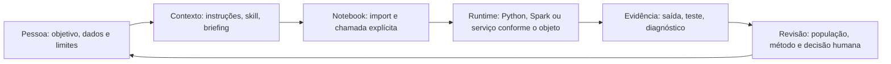

<a id="parte-mt-i"></a>
# MT parte i

<!-- editorial:exclude:start -->
Edição documental de 07/10/2026. Leitura dividida com o conteúdo integral dos módulos.

[Índice](MT-indice.md#sumario-mt) · [Livro completo](../../MANUAL_TECNICO_V2.md#sumario-mt)
<!-- editorial:exclude:end -->

<a id="mt-mod-mt01"></a>
<a id="mt01"></a>
### MT01 — Por que o Hub existe e como ler sua arquitetura

**Pergunta deste capítulo:** qual problema recorrente justifica o Hub e suas camadas? Para acompanhar a explicação, basta saber que um notebook contém código e resultados e que uma pessoa pode pedir ajuda a um assistente para trabalhar com dados. A rota passa pelo problema, pela diferença entre orientação, execução e evidência, pelas peças do Hub e por um percurso completo. Os capítulos seguintes mostram onde cada peça fica e como seus contratos foram implementados.

<!-- editorial:exclude:start -->
[Sumário técnico](MT-indice.md#sumario-mt) · [Árvore e donos](#mt02) · [Manual do Usuário](MU-indice.md#sumario-mu)
<!-- editorial:exclude:end -->

<a id="mt01-1"></a>
#### 1. A situação de trabalho que motivou contratos compartilhados

Imagine que uma equipe receba uma tabela de contatos comerciais e queira estimar quais pessoas responderão a uma campanha. A pergunta parece única, mas esconde decisões diferentes. Uma linha representa uma pessoa, um contato ou um evento? A resposta será observada até quantos dias depois do contato? Quais informações estavam disponíveis no instante da decisão? Uma taxa de resposta usa todos os contatos ou somente os elegíveis no denominador? Se cada notebook escolher essas respostas silenciosamente, dois relatórios com o mesmo título podem medir fenômenos distintos.

O [README do repositório](https://github.com/Guimarais-R-Rodrigo/Ambiente_Databricks/blob/983c9936f139402a0130f290653ae713d65a3ac7/README.md) situa esse problema em projetos de aprendizado de máquina com muitos dados: grão, tempo, amostragem, vazamento de informação futura, métricas, visualização e monitoramento aparecem repetidamente. O [guia do produto](../../README.md) acrescenta dificuldades práticas: usar recursos do **runtime**, o ambiente onde o código executa, com custo adequado e evitar inventar regra de negócio ao preencher uma lacuna. Esses documentos explicam a **motivação** do Hub. Eles não medem uma redução universal de erros nem garantem que toda análise criada com o Hub esteja correta.

O projeto respondeu reunindo métodos, formulários, código reutilizável e moldes editoriais sob `.assistant`. Um contrato compartilhado é uma descrição verificável do que uma peça espera e devolve: por exemplo, qual coluna é data de decisão, qual unidade um argumento usa, se uma função devolve tabela ou texto, e quando a execução deve parar para pedir esclarecimento. “Compartilhado” importa porque uma segunda pessoa pode seguir a mesma definição e perceber quando o caso concreto exige outra. O contrato também limita o assistente: uma resposta convincente não autoriza criar uma coluna, uma janela temporal ou um limiar de qualidade que ninguém informou.

No exemplo da campanha, a equipe poderia começar declarando que cada linha é um contato da entidade `E001` ou `E002`, com instante de decisão em 15/01/2026 e resposta medida numa janela posterior explicitamente fixada. Essa declaração é **ilustrativa** e ainda não calcula nem valida nada. Ela cria a referência para perguntar se uma característica do cliente existia antes da decisão e se as duas bases têm chaves compatíveis. Uma duplicata da chave, uma data ausente ou um resultado ainda imaturo passam a ser problemas visíveis, em vez de detalhes escondidos pelo código. A primeira contribuição técnica do Hub é tornar essas perguntas repetíveis e ligadas aos recursos que podem ajudar a respondê-las.

<a id="mt01-2"></a>
#### 2. Contexto, execução e evidência pertencem a momentos diferentes

Para compreender a arquitetura, acompanhe três momentos. No primeiro, uma pessoa descreve objetivo, dados, restrições e resultado desejado. Instruções e uma Agent Skill aplicável podem orientar a Genie Code sobre o método: pedir grão, checar tempo, explicitar riscos e organizar a saída. Um briefing de `hub_prompts/` pode tornar o pedido mais preciso. Esses materiais **orientam a conversa**; ainda não leram a tabela nem computaram uma métrica. O [README do produto](../../README.md) mostra esse fluxo e distingue o mecanismo nativo de Agent Skills do conteúdo criado pelo projeto.

No segundo momento, o notebook ou outro consumidor executa código. Uma função de `hub_snippets/` precisa ficar importável para Python e ser chamada com argumentos concretos; um utilitário de `hub_scripts/` também exige chamada explícita. A skill pode recomendar `null_summary` para contar nulos, mas uma recomendação em texto não executa `df.count()` nem produz o **DataFrame** de saída, uma tabela manipulada pelo programa. Essa distinção é técnica: o assistente trabalha com contexto e gera ou revisa instruções; o interpretador Python e, quando aplicável, o Spark processam dados. Chamamos de **runtime** esse ambiente de execução, com suas bibliotecas, permissões e custo. Colocar `.assistant` no workspace não insere automaticamente sua pasta na busca de módulos Python, nem disponibiliza todas as dependências opcionais.

No terceiro momento, alguém confere o que ocorreu. A saída de uma célula, um relatório de teste, um log de publicação e uma aprovação de negócio respondem perguntas diferentes. Uma função pode ter sido importada localmente, mas não executada no workspace de destino; uma execução pode produzir uma tabela, mas não demonstrar que o denominador corresponde à população pretendida. Por isso os [guias do Hub](../../README.md) terminam com revisão humana de código, dados, custo e resultado. A separação entre publicar, executar, revisar e promover também aparece no [README raiz](https://github.com/Guimarais-R-Rodrigo/Ambiente_Databricks/blob/983c9936f139402a0130f290653ae713d65a3ac7/README.md): cada passagem precisa de sua própria evidência.

Essa separação impede dois atalhos frequentes. Um **teste de sintaxe** verifica se o arquivo pode ser analisado como código Python; não executa o import, não verifica dependências e não calcula a métrica. Um teste de import é outro passo: mostra que o módulo pôde ser carregado naquele ambiente, ainda sem provar que o resultado analítico usa população e tempo corretos. O segundo atalho é tratar uma recomendação da IA como efeito consumado: ela pode mencionar um helper sem que a célula correspondente exista ou tenha sido executada. Para reconstruir uma entrega, registre versão do recurso, parâmetros materiais, ambiente, saída observada e decisão de revisão. Cada registro tem um responsável e um alcance; juntos tornam o caminho auditável.

O mapa abaixo representa **responsabilidades**, não uma sequência automática. A pessoa decide qual peça fornecer e quando executar; a revisão interpreta a evidência antes de encadear uma nova ação.



Leia a seta de volta como uma oportunidade de corrigir a pergunta. Se o diagnóstico de nulos mostrar 0%, mas a fonte usar `"N/A"` para ausência, a pessoa precisa declarar outra regra de dados; repetir a mesma função não amplia seu contrato. Se uma característica aparece apenas depois de 15/01/2026, a solução pode exigir histórico temporal verdadeiro. Nenhum formato bonito de notebook demonstra por si só que esse histórico existia. A arquitetura cria pontos explícitos para perceber essas lacunas e registrar a próxima ação.

A [decisão arquitetural ADR-0001](https://github.com/Guimarais-R-Rodrigo/Ambiente_Databricks/blob/983c9936f139402a0130f290653ae713d65a3ac7/docs/decisions/ADR-0001-arquitetura-multi-ia.md) acrescenta outro sentido de separação: o projeto tem uma fonte versionada, uma representação derivada e cópias operacionais no Databricks. Essa dimensão será detalhada em MT02. Ela evita que uma mudança local num workspace seja confundida com alteração da definição do Hub. A mesma disciplina de “qual camada responde a qual pergunta” organiza tanto os arquivos do projeto quanto o percurso analítico do notebook.

<a id="mt01-3"></a>
#### 3. Cinco componentes funcionais e a infraestrutura que os apresenta

O Hub agrupa cinco componentes funcionais no [README do produto](../../README.md). Cada grupo tem uma forma própria de uso e, por consequência, um tipo diferente de contrato. A distinção permite escolher uma ferramenta pelo trabalho a realizar, em vez de supor que todo item sob `.assistant` será consumido do mesmo modo pelo assistente.

**Agent Skills, em `skills/`,** descrevem métodos para tarefas que envolvem decisões encadeadas. O arquivo `SKILL.md` apresenta a habilidade e seus recursos; o conteúdo `hub-ml-*` é autoria do projeto dentro do mecanismo de Agent Skills. No caso da campanha, uma skill de exploração ou baseline pode pedir definição de alvo, corte temporal, população, validação e entrega antes de sugerir código. Ela orienta o fluxo e pode encaminhar a helpers declarados. A qualidade de sua orientação e a execução do código recomendado têm evidências distintas. O capítulo MT13 examinará anatomia e contratos; MT14 percorrerá cada skill existente.

**Hub Prompts, em `hub_prompts/`,** são briefings preenchidos pela pessoa. Um formulário pode pedir objetivo, fontes, grão, chaves, período, restrições e critérios de aceite. O valor técnico do briefing é tornar o desconhecido explícito: “não informado” pede pergunta ou inspeção, enquanto um campo preenchido com um valor inventado dá falsa precisão ao passo seguinte. O arquivo Markdown não vira contexto só porque está armazenado no produto; ele precisa ser fornecido à conversa conforme a tarefa. MT12 explica a construção e os exemplos desses formulários.

**Hub Snippets, em `hub_snippets/`,** são funções e classes Python reutilizáveis. Um formatador de números, uma junção temporal e um resumo de nulos não têm o mesmo custo nem o mesmo tipo de entrada, mas seguem a ideia de oferecer uma **API pública**, isto é, nomes e chamadas que outros arquivos podem usar, e uma explicação de uso. Para o analista, um snippet evita refazer uma rotina cujo contrato já foi documentado; para o mantenedor, ele cria um ponto onde validar argumentos, declarar dependências e testar casos de borda. A importação não substitui a escolha metodológica: `null_summary` conta `NULL`, sem decidir se uma coluna deveria ser obrigatória. MT05–MT10 tratam de forma, APIs e famílias de snippets.

**Hub Scripts, em `hub_scripts/`,** reúnem utilitários importáveis para inspeção, transformação e governança técnica. Podem receber nome de tabela, DataFrame, **schema** — descrição de colunas e tipos de uma tabela — ou parâmetros de diagnóstico; os retornos variam conforme o objeto. Um script de qualidade examina mais dimensões de uma tabela do que um snippet de apresentação; um script que produz **YAML**, formato textual estruturado para descrever dados, tem finalidade diferente de uma rotina que calcula indicadores. A existência da categoria não significa que todos os scripts sejam executáveis de forma idêntica nem que um status de alerta aprove uma etapa posterior. MT11 detalha os oito contratos reais.

**Hub Padrões, em `hub_padroes/`,** fornece moldes para construir e documentar recursos novos com a mesma linguagem de entrada, saída, efeitos, exemplo e limites. Ele atua quando alguém mantém o Hub. Consultar um molde pode orientar a criação de uma pasta de objeto, mas o molde não cria automaticamente a implementação nem prova sua correção. MT05 apresenta critérios de construção e MT27 trata dos gates que examinam estrutura, links e testes.

Há ainda a infraestrutura editorial em `hub_readmes_visual_assets/`: cabeçalhos e diagramas que ajudam a navegar e explicar a documentação. O [README do produto](../../README.md) declara que ela não é um sexto componente funcional nem injeta contexto na Genie Code. A distinção evita atribuir comportamento analítico a uma imagem. O Sistema de Temas organiza uma identidade visual compartilhada e consumidores com rotas explícitas; sua engenharia aparece em MT23–MT26. Um diagrama ou uma paleta pode melhorar leitura e consistência sem mudar denominador, modelo ou qualidade de dado.

O [Hub Micromodelos](../../hub_micromodelos/README.md) acrescenta uma área de domínio com contratos, execução e exemplos sintéticos. Reutiliza essas famílias, exigindo importação e chamada explícitas.

O conjunto funciona como uma pequena arquitetura de responsabilidades. Skills e briefings ajudam a formular e conduzir; snippets e scripts executam operações delimitadas; padrões mantêm coerência quando novas peças são criadas; READMEs e assets ajudam pessoas a encontrá-las e compreendê-las. O código concreto e a evidência do destino continuam necessários a cada uso. Essa combinação é a razão técnica para manter pastas e documentos separados, com links entre elas, em vez de um arquivo único que misture pedido, algoritmo, regra de negócio e resultado.

<a id="mt01-4"></a>
#### 4. Um percurso integrado e os limites do desenho

Retome a campanha fictícia. A pessoa informa que `E001` e `E002` são entidades, que cada contato possui um instante de decisão, que a resposta virá depois, e que a fonte de características possui versões históricas. Escolhe um briefing para registrar esses dados e uma skill adequada se precisar de orientação metodológica. O fluxo pede confirmação de chaves, grão, janela de resposta e disponibilidade dos atributos. Em seguida, o notebook importa apenas os helpers necessários: talvez um diagnóstico de junção e um helper temporal. Cada chamada devolve seu tipo de resultado, que a pessoa confere com poucos registros conhecidos, inclusive uma versão posterior à decisão e uma entidade sem histórico.

Nesse percurso, a informação “há histórico” precisa ser comprovada na fonte. Se a tabela foi sobrescrita e só guarda o valor de hoje, nenhuma skill ou função pode recuperar a versão que faltou. Um resumo de cobertura pode revelar quantas decisões ficaram sem característica elegível, mas não certifica sozinho que todas as demais colunas são apropriadas para modelagem. Uma taxa apresentada com vírgula e símbolo de percentual pode estar visualmente correta e usar o denominador errado. O Hub ajuda a decompor essas verificações; o entendimento do domínio, a validação temporal, os testes no destino e a decisão de uso continuam situados fora de uma chamada isolada.

Também há limites de implementação e distribuição. A policy de `hub-ml-micromodelos` permanece `L1/audit`: possuir código executor não promove automaticamente o enforcement nem homologa o domínio no trabalho. O repositório pode conter uma API e testes locais aprovados, enquanto o workspace de uso ainda não recebeu a versão correspondente. Um notebook pode ter permissão de leitura do pacote, mas não acesso à tabela pretendida. Um padrão editorial pode estar integrado no Git sem homologação visual no browser ou autorização de publicação. Ao ler qualquer estado, pergunte: **qual arquivo define o comportamento, qual ambiente foi observado e qual decisão a evidência permite tomar?** Essa pergunta evita transformar “existe”, “executou” e “foi aprovado” em sinônimos.

Você pode conferir se entendeu a arquitetura apontando, para cada passo da campanha, o componente que o sustenta e a evidência que ainda faltaria: briefing para tornar a pergunta explícita, skill para orientar método, código importado para calcular, resultado do notebook para observar, revisão para interpretar e gate de publicação se a entrega for compartilhada. Não há um executor universal que atravesse essas fronteiras automaticamente. O próximo capítulo coloca cada peça na árvore real e mostra qual documento é dono de uma afirmação, de um contrato ou de um registro histórico.

<!-- editorial:exclude:start -->
<a id="mt-mod-mt01-h-fontes-do-capítulo"></a>
##### Fontes do capítulo

- [README do repositório](https://github.com/Guimarais-R-Rodrigo/Ambiente_Databricks/blob/983c9936f139402a0130f290653ae713d65a3ac7/README.md), [README do produto `.assistant`](../../README.md), [ADR-0001](https://github.com/Guimarais-R-Rodrigo/Ambiente_Databricks/blob/983c9936f139402a0130f290653ae713d65a3ac7/docs/decisions/ADR-0001-arquitetura-multi-ia.md).
- O percurso com `E001` e `E002` é **ILUSTRATIVO**. Não é execução de skill, notebook ou plataforma.
<!-- editorial:exclude:end -->


<!-- editorial:exclude:start -->
[Próximo: MT02](#mt02) · [Sumário](MT-indice.md#sumario-mt) · [Guia por pergunta](MT-indice.md#perguntas-mt) · [Trilhas](MT-indice.md#trilhas-mt) · [MU01](MU-parte-i.md#mu01)
<!-- editorial:exclude:end -->

<a id="mt-mod-mt02"></a>
<a id="mt02"></a>
### MT02 — Camadas, árvore de arquivos e donos da informação

**Pergunta deste capítulo:** qual arquivo devo ler ou alterar para cada tipo de informação? Você já viu em MT01 que contexto, código e evidência têm funções diferentes. Agora vai localizar essas responsabilidades na árvore do projeto. “Dono” significa o arquivo ou a camada que define uma afirmação; outros guias podem explicá-la e apontar para ele. Essa distinção permite corrigir uma informação uma vez e saber o que precisa ser conferido depois.

<!-- editorial:exclude:start -->
[Sumário técnico](MT-indice.md#sumario-mt) · [Arquitetura inicial](#mt01) · [Imports e runtime](#mt03)
<!-- editorial:exclude:end -->

<a id="mt02-1"></a>
#### 1. Fonte editável, derivado e cópias de uso

Comece pela pergunta “onde devo alterar um helper?”. A resposta é [ambiente_fonte/](https://github.com/Guimarais-R-Rodrigo/Ambiente_Databricks/blob/983c9936f139402a0130f290653ae713d65a3ac7/ambiente_fonte/README.md), porque essa é a camada editável do produto `.assistant`. Dentro dela ficam as instruções destinadas ao assistente no produto e as pastas de skills, briefings, snippets, scripts, padrões e documentação que serão distribuídos conforme a operação. O repositório Git guarda a história dessas alterações. Seu [AGENTS.md](https://github.com/Guimarais-R-Rodrigo/Ambiente_Databricks/blob/983c9936f139402a0130f290653ae713d65a3ac7/AGENTS.md) define a fonte única e o ciclo: editar, validar, renderizar e então tratar publicação como etapa própria.

O desenho tem outras duas camadas que parecem cópias, mas respondem a perguntas distintas. `.artifacts/simulado/` é produzido por `tools/render_simulado.py` para representar a árvore de destino; por ser **derivado**, uma edição manual ali desapareceria na geração seguinte. O workspace Databricks Free ou de trabalho é uma cópia **operacional**, usada por pessoas e jobs no ambiente real. Uma alteração feita diretamente no workspace precisa voltar à fonte versionada por um processo controlado; ela não muda automaticamente o Git. O [ADR-0001](https://github.com/Guimarais-R-Rodrigo/Ambiente_Databricks/blob/983c9936f139402a0130f290653ae713d65a3ac7/docs/decisions/ADR-0001-arquitetura-multi-ia.md) estabeleceu essa separação para permitir evolução por várias IAs sem criar cópias concorrentes que pareçam igualmente canônicas.

Veja a sequência como uma relação de procedência. A fonte diz **o que o produto deveria conter**; o renderer constrói uma representação para conferir caminhos e conteúdo; a publicação move um pacote a um destino explícito; a verificação remota observa **o que de fato chegou lá**. Cada estágio possui falhas possíveis: fonte sintaticamente inválida, simulado divergente, publicação parcial ou permissão insuficiente no destino. Passar num estágio não prova os seguintes. Um teste local de Python pode demonstrar uma função no checkout sem demonstrar que o mesmo arquivo está importável num notebook publicado.

“Fonte” também tem dois alcances que vale nomear. O repositório inteiro é a fonte versionada do **projeto**: inclui produto, ferramentas, decisões e evidências. `ambiente_fonte/` é a fonte editável do **pacote de produto** dentro desse repositório. Isso explica por que um parecer em `docs/auditoria/` pode ser canônico como registro de revisão sem ser enviado a quem apenas usará o Hub. O destino operacional recebe o conjunto apropriado à implantação e mantém suas próprias permissões e resultados. Ao relatar uma falha, diga em qual desses alcances a encontrou; “o arquivo está na fonte” sozinho pode ser ambíguo.

O [ADR-0009](https://github.com/Guimarais-R-Rodrigo/Ambiente_Databricks/blob/983c9936f139402a0130f290653ae713d65a3ac7/docs/decisions/ADR-0009-identidade-e-pacote-de-implantacao.md) ainda delimita transporte: o produto usa identidades neutras e a implantação padrão se apoia em pacote mínimo com manifesto de hashes, não em enviar o repositório inteiro. O conteúdo de `Ambiente_Antigo/` fica em quarentena local conforme o [ADR-0003](https://github.com/Guimarais-R-Rodrigo/Ambiente_Databricks/blob/983c9936f139402a0130f290653ae713d65a3ac7/docs/decisions/ADR-0003-quarentena-ambiente-antigo.md). Para compreender essa regra basta ler a decisão; os arquivos da quarentena não são fonte necessária para este manual. Assim, “está no meu computador”, “está no Git” e “está no workspace da equipe” precisam ser respostas separadas.

<a id="mt02-2"></a>
#### 2. Documentos de entrada e hierarquia editorial

Se sua dúvida é “por onde começar?”, o [README raiz](https://github.com/Guimarais-R-Rodrigo/Ambiente_Databricks/blob/983c9936f139402a0130f290653ae713d65a3ac7/README.md) apresenta finalidade, componentes, arquitetura e ciclo de vida do repositório. Uma pessoa que vai **usar** o Hub começa pelo [README de `.assistant`](../../README.md), que explica recursos e preparo no Databricks. Uma pessoa que vai **manter ou aprovar** mudanças entra por [docs/README.md](https://github.com/Guimarais-R-Rodrigo/Ambiente_Databricks/blob/983c9936f139402a0130f290653ae713d65a3ac7/docs/README.md): ali há rotas para decisões, auditorias, testes, playbooks, sprints e handoffs. A [regra de documentação](https://github.com/Guimarais-R-Rodrigo/Ambiente_Databricks/blob/983c9936f139402a0130f290653ae713d65a3ac7/docs/ai/rules/documentacao.md) registra essa hierarquia de forma normativa. Quando um documento superior resume um fato mutável, ele deve encaminhar ao dono detalhado em vez de manter uma segunda explicação longa que possa envelhecer em silêncio.

Para agentes que trabalham no repositório, [AGENTS.md](https://github.com/Guimarais-R-Rodrigo/Ambiente_Databricks/blob/983c9936f139402a0130f290653ae713d65a3ac7/AGENTS.md) é o núcleo editorial comum, conforme o [ADR-0025](https://github.com/Guimarais-R-Rodrigo/Ambiente_Databricks/blob/983c9936f139402a0130f290653ae713d65a3ac7/docs/decisions/ADR-0025-arquitetura-instrucoes-ia.md). [CLAUDE.md](https://github.com/Guimarais-R-Rodrigo/Ambiente_Databricks/blob/983c9936f139402a0130f290653ae713d65a3ac7/CLAUDE.md) e [GEMINI.md](https://github.com/Guimarais-R-Rodrigo/Ambiente_Databricks/blob/983c9936f139402a0130f290653ae713d65a3ac7/GEMINI.md) mantêm pontes mínimas para esse núcleo; seu carregamento depende do cliente real. O índice [docs/ai/README.md](https://github.com/Guimarais-R-Rodrigo/Ambiente_Databricks/blob/983c9936f139402a0130f290653ae713d65a3ac7/docs/ai/README.md) encaminha regras, contextos e templates, enquanto `.agents/skills/` contém os cinco procedimentos canônicos do mantenedor. Esses arquivos orientam colaboração e manutenção **aqui**, sem prometer carregamento universal. Já `ambiente_fonte/.assistant_instructions.md` e as skills do produto pertencem ao contexto preparado para a Genie Code no destino. Caminho e consumidor distinguem os dois alcances; ler uma regra no Git não carrega uma skill no workspace nem executa código.

Dentro do produto, o README de cada **coleção** organiza os objetos disponíveis e leva à pasta certa. O README de cada **objeto** responde quando escolher, quais requisitos preparar, que retorno interpretar e quais limites considerar. Por exemplo, o guia geral de `hub_snippets` aponta para a categoria `spark`; o índice Spark aponta para `null_summary`; o README local explica que ele conta `NULL` num DataFrame Spark. A implementação na mesma pasta define a assinatura exata. A regra editorial evita que uma tabela de índice vire uma cópia mal atualizada do código. Ela também permite a quem está aprendendo ler uma explicação antes de abrir a função.

O [ADR-0012](https://github.com/Guimarais-R-Rodrigo/Ambiente_Databricks/blob/983c9936f139402a0130f290653ae713d65a3ac7/docs/decisions/ADR-0012-readmes-de-objeto.md) fixou o README didático por pasta de snippet, script e prompt. Seu corpo começa como proposta histórica; a ratificação de setembro e o registro de conclusão no fim do arquivo documentam o estado aceito e a migração R00–R13. O contrato 1.0.0 usa quinze seções para READMEs de objeto, com conceito, adequação, entrada, saída, efeitos, limites e próximos passos. Um índice ou uma skill não precisa imitar mecanicamente essas quinze seções. O validador confere forma e links; a clareza didática e a correção do raciocínio pedem leitura e revisão adicionais.

Há um caso de propriedade documental que merece destaque. O [ADR-0010](https://github.com/Guimarais-R-Rodrigo/Ambiente_Databricks/blob/983c9936f139402a0130f290653ae713d65a3ac7/docs/decisions/ADR-0010-manual-tecnico-unificado.md) tornou `ambiente_fonte/.assistant/MANUAL_TECNICO.md` a autoria do manual técnico vigente. Nele, `#catalogo-helpers` concentra o inventário de helpers e `#indice-termos` integra as definições. O [MANUAL_TECNICO.md da raiz](../../MANUAL_TECNICO.md) é uma cópia de leitura com bytes iguais, conferida por teste. Os dois livros de consulta desta edição ficam na raiz `.assistant`, em `MANUAL_TECNICO_V2.md` e `MANUAL_DO_USUARIO.md`. Seus catálogos e referências retratam a base datada desta edição; a disponibilização dos volumes não substitui automaticamente a autoridade do manual vigente decidida no ADR. Para corrigir uma assinatura naquele manual, observe seu dono e a sincronização das cópias. A presença dos novos livros no Git também não comprova instalação ou leitura em um workspace.

Use a hierarquia como uma pergunta prática. “Qual é o objetivo do projeto?” leva ao README raiz. “Como eu começo no Databricks?” leva ao README do produto. “Qual snippet atende minha pergunta?” leva à coleção, depois ao objeto. “Por que a forma do README é obrigatória?” leva à regra editorial e ao ADR. “Qual API realmente aceita este argumento?” leva ao código. Essa rota reduz a chance de apoiar uma decisão técnica num resumo que tinha apenas função de navegação.

O mesmo princípio vale para definições. Um termo técnico pode receber uma explicação breve em vários pontos para que a leitura flua, mas a definição aprofundada e o inventário de helpers têm um endereço dono no manual vigente. Ao escrever um índice, inclua o link e uma frase que ajude a escolher a rota; ao escrever o capítulo técnico, desenvolva o raciocínio com exemplo e limite. Essa distribuição torna a documentação longa legível sem obrigar o leitor a reconstruir, em cada página, uma definição diferente de “snippet” ou “skill”.

<a id="mt02-3"></a>
#### 3. Implementações, exemplos, padrões e registros de controle

Uma pasta de objeto ajuda a ver a diferença entre explicar e executar. Tome `hub_snippets/constants/format_br/`: o [README local](../../hub_snippets/constants/format_br/README.md) ensina quando apresentar um percentual e alerta para a escala da entrada; `format_br.py` contém a regra que recebe o número e devolve texto; `__init__.py` expõe nomes importáveis; `exemplo_format_br.py` demonstra chamadas e interpreta saídas sintéticas. A pessoa pode começar pelo README, mas uma divergência sobre parâmetro, default ou erro se resolve olhando implementação e fachada. Um exemplo documenta o caso exercitado; ele não transforma toda entrada ou runtime em caso testado.

A mesma lógica vale para outros tipos, com formatos diferentes. O briefing em `hub_prompts/` é um documento a preencher e fornecer ao assistente; seu notebook de exemplo mostra um pedido e uma possível sequência, mas não vira parser automático do campo. Uma skill possui `SKILL.md` e recursos que orientam o agente; suas instruções não são chamadas Python. Um script importa e executa uma função específica, às vezes com leitura de tabela ou produção de um artefato. Por isso o [Hub Padrões](../../hub_padroes/README.md) oferece moldes para seis **tipos de artefato** — README, snippet, script, prompt, skill e notebook —, enquanto MT01 contou cinco **componentes funcionais** do ecossistema. A primeira classificação orienta autoria de arquivos; a segunda orienta escolha de recursos no trabalho.

Os moldes declaram requisitos de objetivo, entrada, saída, efeitos, exemplo e limite. Eles evitam inventar um formato a cada contribuição, mas não provam que a fórmula está correta. Um README de objeto pode passar numa verificação de quinze seções e ainda explicar mal um denominador. Um notebook pode ter saída colada e ainda não ter sido reexecutado no runtime do leitor. Esse é o motivo de separar regra, implementação, exemplo e evidência de teste. A [regra editorial](https://github.com/Guimarais-R-Rodrigo/Ambiente_Databricks/blob/983c9936f139402a0130f290653ae713d65a3ac7/docs/ai/rules/documentacao.md) chama atenção para isso: o gate comprova estrutura e invariantes no alcance implementado; não certifica correção estatística, qualidade didática ou homologação Databricks.

Para decidir o que modificar, siga o caminho da afirmação. Se o README diz que a função devolve um número e o código devolve texto, primeiro verifique a implementação e sua assinatura pública; depois corrija a explicação, o exemplo e o teste que dependem daquele contrato. Se a mudança pretendida é fazer a função devolver outro tipo, isso é alteração de comportamento e pede revisão de consumidores, não apenas edição do README. A localização dos arquivos torna esse impacto rastreável. A fachada `__init__.py` é importante porque o nome ali exposto pode ser o caminho que outros notebooks já importam.

Fora do produto, `tools/` contém os programas que verificam e transformam. `tools/validate_assistant.py` examina contratos do pacote; `tools/render_simulado.py` gera o derivado; `tools/publicar_free.py` planeja, publica ou verifica conforme a operação; `tools/bundle_implantacao.py` prepara o pacote mínimo. Essas ferramentas têm entradas, efeitos e escopos próprios, que serão detalhados em MT27 e MT28. Aqui interessa a relação: alterar um arquivo da fonte pede validação proporcional, e uma cópia derivada correta não deve ser editada à mão para “consertar” o resultado. Se o produto está errado, corrija sua fonte; se o renderer produz algo errado, investigue o renderer e seus testes.

O [ADR-0007](https://github.com/Guimarais-R-Rodrigo/Ambiente_Databricks/blob/983c9936f139402a0130f290653ae713d65a3ac7/docs/decisions/ADR-0007-catalogo-e-pasta-de-objeto.md) decidiu por pastas de objeto e declaração explícita dos helpers nas skills. A errata e a atualização de status no mesmo documento corrigem fatos e encaminham o catálogo ao Manual pelo ADR-0010. Essa sequência é um exemplo útil: a decisão sobre **por que** haver pasta e declaração permanece; o lugar atual do inventário mudou por outra decisão. Não copie a contagem de helpers do corpo histórico do ADR para descrever o produto de hoje. Consulte o inventário vivo, o código e o gate quando uma quantidade for material.

Uma árvore pequena resume as relações sem substituir os guias específicos:

```text
repositório/
├── AGENTS.md e adaptadores    # núcleo editorial comum e pontes
├── .agents/skills/            # cinco procedimentos do mantenedor
├── docs/ai/                   # regras, contexto, templates e referências
├── ambiente_fonte/            # autoria do produto
│   ├── .assistant_instructions.md
│   └── .assistant/            # uso e implementações do Hub
│       ├── README.md          # entrada do usuário
│       ├── MANUAL_TECNICO.md  # manual vigente e catálogo integrado
│       ├── MANUAL_TECNICO_V2.md # livro técnico desta edição
│       ├── MANUAL_DO_USUARIO.md # livro de uso desta edição
│       ├── skills/            # métodos do assistente
│       └── hub_*/             # briefings, código, padrões e assets
├── .artifacts/simulado/       # saída do renderer
├── tools/                     # validação, render e publicação
└── docs/                      # decisões e evidências de manutenção
```

Se você procurar `hub_snippets` em `docs/`, encontrará explicação ou evidência; o módulo executável está no produto. Se encontrar um PNG em `hub_readmes_visual_assets/`, ele serve à apresentação, não à inferência analítica. A árvore é um mapa de papéis, e a consulta ao arquivo concreto decide o comportamento.

O quadro reúne autoria e consumo para evitar que a palavra “cópia” esconda responsabilidades distintas. **Fonte ou gerado** descreve como a peça entra no fluxo; uma peça gerada ainda precisa ser conferida antes de uso.

| Camada ou arquivo | Quem escreve o conteúdo | Quem consome | Fonte ou gerado? |
|---|---|---|---|
| `ambiente_fonte/.assistant/` | mantenedores do produto no Git | renderer; depois pessoas, notebooks e agentes no destino | fonte editável do produto |
| `exemplo_*.py` no produto | autor do objeto, com revisão | pessoa que aprende o contrato; notebook quando executado | fonte autoral; a cópia publicada pode assumir formato SOURCE |
| `.artifacts/simulado/` | `tools/render_simulado.py` a partir da fonte | validação e preparo de publicação | derivado, sem autoria manual |
| Workspace Databricks | operação de publicação autorizada | usuários e jobs com acesso | cópia operacional; seu estado exige verificação remota |
| `docs/decisions/` e `docs/testes/` | decisor ou autor do registro, com data | mantenedor, auditor e leitor técnico | registros versionados do projeto; não parte do pacote mínimo de uso |
| `tools/` | mantenedores das ferramentas | gates, renderer, publicação e auditoria | fonte de automação do projeto; suas saídas são separadas |

<a id="mt02-4"></a>
#### 4. Decisões, evidências, sprints e estado vivo

Considere uma frase como “o tema visual está aprovado”. Ela pode significar que um schema passou num teste local, que uma versão foi integrada no Git, que alguém viu uma tela no navegador, que um workspace recebeu arquivos ou que houve autorização de uso. Cada sentido pede uma fonte diferente. [docs/README.md](https://github.com/Guimarais-R-Rodrigo/Ambiente_Databricks/blob/983c9936f139402a0130f290653ae713d65a3ac7/docs/README.md) distingue **decisões** em ADRs, **evidências** em testes e auditorias, **operações** em playbooks e **história de execução** em sprints e handoffs. Os relatórios antigos registram data, ambiente e alcance da época. Um estado vivo de frente ou seu README atual deve ser consultado quando a pergunta é “o que está vigente agora?”.

O corpo aceito de um ADR conserva a decisão tomada e suas alternativas; uma atualização vem por novo ADR, errata ou nota datada conforme a regra do projeto. Um teste guarda o que foi observado na sua base, não um certificado para qualquer runtime futuro. Um checkpoint de sprint pode dizer “não iniciado” porque naquele dia a próxima etapa ainda não começara. Essa frase pode permanecer historicamente verdadeira mesmo depois que a etapa avança. Reescrevê-la apagaria a trilha causal. Para decidir hoje, combine a fonte de comportamento (código ou schema), a decisão aplicável e o registro de estado atual, sem substituir uma categoria pela outra.

Uma transição editorial precisa manter conteúdo e autoridade identificáveis. Os novos volumes de consulta estão na raiz `.assistant`; o [índice docs](https://github.com/Guimarais-R-Rodrigo/Ambiente_Databricks/blob/983c9936f139402a0130f290653ae713d65a3ac7/docs/README.md) organiza decisões e evidências de manutenção. O [ADR-0010](https://github.com/Guimarais-R-Rodrigo/Ambiente_Databricks/blob/983c9936f139402a0130f290653ae713d65a3ac7/docs/decisions/ADR-0010-manual-tecnico-unificado.md) continua definindo o manual vigente no produto. Disponibilizar esta edição amplia a leitura, sem reescrever decisões aceitas ou declarar uma substituição que não foi deliberada. Do mesmo modo, um resumo histórico pode citar estágio inicial do Sistema de Temas enquanto os [owners vivos](https://github.com/Guimarais-R-Rodrigo/Ambiente_Databricks/blob/983c9936f139402a0130f290653ae713d65a3ac7/docs/ai/context/projeto.md#owners-vivos) encaminham ao estado corrente e o [README da frente V14](https://github.com/Guimarais-R-Rodrigo/Ambiente_Databricks/blob/983c9936f139402a0130f290653ae713d65a3ac7/docs/sprints/sistema_temas/V14/README.md) conserva o alcance daquela frente. A solução é identificar que tipo de pergunta cada arquivo responde, sua data e o dono do estado, não escolher uma frase isolada porque está mais próxima da tela.

Quando localizar uma afirmação, registre quatro elementos: **o que** ela diz, **onde** está seu dono, **quando e em que ambiente** foi verificada, e **qual decisão** permite agora. Para a API de `fmt_pct`, o dono é o código; para a obrigação de manter um README de objeto, é o ADR ratificado e o contrato editorial; para um resultado de Spark, é o teste datado com base e runtime; para uma publicação, é a verificação do destino. Essa pequena disciplina impede que um print de notebook substitua uma regra de negócio ou que uma decisão antiga seja lida como inventário atualizado.

Você pode conferir a leitura da árvore escolhendo uma mudança concreta. Se um parâmetro de um snippet estiver errado, abra implementação, fachada, README e exemplo, depois rode o gate pertinente na fonte. Se um link do manual atual precisar de correção, atualize a autoria no produto e a cópia de leitura conforme seu contrato. Se a dúvida for “por que há um README local?”, comece pelo ADR-0012. Se for “a sprint está pronta para publicar?”, procure o estado vivo e a evidência específica. MT03 seguirá o caminho de uma função desde seu arquivo até o import no notebook, detalhando os erros que esta árvore ajuda a localizar.

<!-- editorial:exclude:start -->
<a id="mt-mod-mt02-h-fontes-e-interpretação"></a>
##### Fontes e interpretação

- [AGENTS.md](https://github.com/Guimarais-R-Rodrigo/Ambiente_Databricks/blob/983c9936f139402a0130f290653ae713d65a3ac7/AGENTS.md), [índice de manutenção](https://github.com/Guimarais-R-Rodrigo/Ambiente_Databricks/blob/983c9936f139402a0130f290653ae713d65a3ac7/docs/ai/README.md), [regra editorial](https://github.com/Guimarais-R-Rodrigo/Ambiente_Databricks/blob/983c9936f139402a0130f290653ae713d65a3ac7/docs/ai/rules/documentacao.md), [fontes e derivados](https://github.com/Guimarais-R-Rodrigo/Ambiente_Databricks/blob/983c9936f139402a0130f290653ae713d65a3ac7/docs/ai/rules/fontes-e-derivados.md), [ADR-0025](https://github.com/Guimarais-R-Rodrigo/Ambiente_Databricks/blob/983c9936f139402a0130f290653ae713d65a3ac7/docs/decisions/ADR-0025-arquitetura-instrucoes-ia.md) e [ADR-0026](https://github.com/Guimarais-R-Rodrigo/Ambiente_Databricks/blob/983c9936f139402a0130f290653ae713d65a3ac7/docs/decisions/ADR-0026-arquitetura-projeto-e-historia.md).
- [Guia de `ambiente_fonte`](https://github.com/Guimarais-R-Rodrigo/Ambiente_Databricks/blob/983c9936f139402a0130f290653ae713d65a3ac7/ambiente_fonte/README.md), [guia do produto](../../README.md), [índice docs](https://github.com/Guimarais-R-Rodrigo/Ambiente_Databricks/blob/983c9936f139402a0130f290653ae713d65a3ac7/docs/README.md).
- [ADR-0001](https://github.com/Guimarais-R-Rodrigo/Ambiente_Databricks/blob/983c9936f139402a0130f290653ae713d65a3ac7/docs/decisions/ADR-0001-arquitetura-multi-ia.md), [ADR-0003](https://github.com/Guimarais-R-Rodrigo/Ambiente_Databricks/blob/983c9936f139402a0130f290653ae713d65a3ac7/docs/decisions/ADR-0003-quarentena-ambiente-antigo.md), [ADR-0007](https://github.com/Guimarais-R-Rodrigo/Ambiente_Databricks/blob/983c9936f139402a0130f290653ae713d65a3ac7/docs/decisions/ADR-0007-catalogo-e-pasta-de-objeto.md), [ADR-0009](https://github.com/Guimarais-R-Rodrigo/Ambiente_Databricks/blob/983c9936f139402a0130f290653ae713d65a3ac7/docs/decisions/ADR-0009-identidade-e-pacote-de-implantacao.md), [ADR-0010](https://github.com/Guimarais-R-Rodrigo/Ambiente_Databricks/blob/983c9936f139402a0130f290653ae713d65a3ac7/docs/decisions/ADR-0010-manual-tecnico-unificado.md), [ADR-0012](https://github.com/Guimarais-R-Rodrigo/Ambiente_Databricks/blob/983c9936f139402a0130f290653ae713d65a3ac7/docs/decisions/ADR-0012-readmes-de-objeto.md).
- A árvore reduzida é um **mapa explicativo**, não uma transcrição exaustiva do pacote. Não se acessou conteúdo da quarentena.
<!-- editorial:exclude:end -->


<!-- editorial:exclude:start -->
[Anterior: MT01](#mt01) · [Próximo: MT03](#mt03) · [Sumário](MT-indice.md#sumario-mt) · [Guia por pergunta](MT-indice.md#perguntas-mt) · [Trilhas](MT-indice.md#trilhas-mt) · [MU01](MU-parte-i.md#mu01)
<!-- editorial:exclude:end -->

<a id="mt-mod-mt03"></a>
<a id="mt03"></a>
### MT03 — Python, imports, dependências e runtime de notebook

**Pergunta deste capítulo:** como um arquivo do Hub se torna uma função utilizável pelo notebook? Você vai acompanhar `fmt_pct`, um formatador simples, desde o módulo até a chamada, e depois entender por que outra função pode falhar ao importar ou somente ao executar. O exemplo usa código local do Hub e números sintéticos. Para reproduzi-lo num Databricks, localize primeiro a cópia autorizada de `.assistant` e confira o ambiente; este capítulo não presume que ela já tenha sido publicada.

<!-- editorial:exclude:start -->
[Sumário técnico](MT-indice.md#sumario-mt) · [Camadas e arquivos](#mt02) · [Critérios de objeto](MT-parte-ii.md#mt05) · [Uso direto pelo leitor](MU-parte-ii.md#mu06)
<!-- editorial:exclude:end -->

<a id="mt03-1"></a>
#### 1. De uma definição no arquivo a um valor que retorna

Quando um notebook precisa mostrar uma taxa de resposta, pode calcular a taxa como número e depois chamar uma **função** para transformá-la em texto. Uma função é um bloco de código com nome, entradas e resultado; `fmt_pct(0.12)` é uma chamada, e `0.12` é o argumento fornecido. A [implementação de `format_br`](../../hub_snippets/constants/format_br/format_br.py) define `fmt_pct(v, casas=1, input_scale="ratio") -> str`. A seta na assinatura anuncia um texto de retorno, representado por `str` em Python. Ela orienta a leitura; o corpo da função é que multiplica por cem quando a escala é razão, formata as casas e acrescenta `%`.

O arquivo `format_br.py` é um **módulo**, uma unidade de código Python importável. Sua pasta `format_br/` é um **pacote** do Hub, com `__init__.py` como entrada pública. A categoria `constants/` agrupa objetos de apresentação; `hub_snippets/` agrupa a biblioteca reutilizável. Não há uma categoria especial “snippet” dentro do interpretador Python: o nome descreve a organização e a responsabilidade que o projeto escolheu. Já uma **classe** reúne dados e comportamentos em objetos; alguns helpers de modelagem são classes, mas `fmt_pct` é uma função comum. O [manual técnico vigente](../../MANUAL_TECNICO.md#importacao) desenvolve essas distinções e o capítulo MT05 discute por que a pasta ganhou esta forma.

O retorno importa tanto quanto a entrada. `fmt_pct(0.12)` produz o texto `"12,0%"`; essa string serve para um relatório, não para continuar uma média. A taxa numérica original continua `0.12`. Se a taxa de origem já está na escala percentual, com `12` representando 12%, `fmt_pct(12, input_scale="percent")` produz o mesmo texto. **Pontos percentuais** medem a diferença entre duas taxas, não são outra maneira de nomear uma taxa isolada. Passar 12 com o padrão `"ratio"` produz `"1200,0%"` sem erro: o código não conhece a unidade de negócio. Assim, uma assinatura existente demonstra **o que pode ser chamado**, mas o sentido da entrada depende do caso e precisa de verificação antes de aceitar o resultado.

Um DataFrame é uma tabela manipulada por uma biblioteca como pandas ou Spark. Nem toda função do Hub recebe DataFrame; este formatador aceita escalares. A diferença ajuda a escolher o lugar da chamada: apresentar um indicador agregado no driver Python é diferente de transformar cada linha de uma tabela distribuída. O [README local de `format_br`](../../hub_snippets/constants/format_br/README.md) explica adequação, limites numéricos e efeito; o código continua sendo a fonte para nomes e regras exatas.

Para localizar uma API, portanto, pergunte em ordem: qual arquivo implementa, qual pasta expõe o nome, que tipo de dado entra e que tipo sai? Essa sequência evita confundir o nome do arquivo com o nome da função e evita usar um notebook demonstrativo como se fosse a biblioteca. Ela também prepara o diagnóstico: se a importação falha, ainda não chegamos à lógica da função; se a chamada retorna um texto plausível porém errado, o caminho do import já foi resolvido e a investigação passa à escala e aos argumentos.

<a id="mt03-2"></a>
#### 2. Como `sys.path`, fachadas e `__all__` ligam as peças

O Python procura módulos em uma lista de diretórios chamada `sys.path`. Para executar `from hub_snippets.constants.format_br import fmt_pct`, a lista precisa incluir um diretório que **contenha** `hub_snippets/`. No produto distribuído, esse diretório é `.assistant`; inserir apenas `.assistant/hub_snippets` faz o interpretador procurar um segundo `hub_snippets` dentro dela. `sys.path.insert(0, caminho)` põe uma cópia na frente de outras com o mesmo nome, o que resolve ambiguidade quando a escolha é deliberada, mas pode **sombrear** um pacote ou módulo que já estava no ambiente. `sys.path` não instala biblioteca, não lê tabela e não concede permissão.

O código abaixo é uma chamada **ilustrativa** para notebook com arquivos do Hub acessíveis em endereço do workspace. `<username>` é marcador a substituir pela localização autorizada; em um Git folder a raiz pode ser outra. `Path(...)` representa um endereço sem criar pastas. A checagem falha cedo se `hub_snippets` não está onde você esperava, e a condição evita repetir a entrada do caminho ao reexecutar a célula.

```python
from pathlib import Path
import sys

assistant_root = Path("/Workspace/Users/<username>/.assistant")
if not (assistant_root / "hub_snippets").is_dir():
    raise FileNotFoundError(f"Hub não encontrado em {assistant_root}")
if str(assistant_root) not in sys.path:
    sys.path.insert(0, str(assistant_root))

from hub_snippets.constants.format_br import fmt_pct

taxa_fracao = 12 / 100
texto = fmt_pct(taxa_fracao)
print(texto)  # resultado esperado: 12,0%
```

A linha de import passa pelas pastas `hub_snippets`, `constants` e `format_br`. A [fachada de `format_br`](../../hub_snippets/constants/format_br/__init__.py) executa `from .format_br import ...`: o ponto inicial refere-se ao módulo vizinho, e o arquivo lista todos os nomes públicos que o objeto expõe, inclusive `fmt_pct`. Sem a fachada, o consumidor precisaria alcançar a implementação por um caminho mais longo, e mudanças internas da pasta seriam mais difíceis de isolar. As fachadas da [raiz de snippets](../../hub_snippets/__init__.py) e da categoria [ML](../../hub_snippets/ml/__init__.py) são leves; elas não importam todos os filhos, evitando carregar dependências opcionais de uma família inteira quando o leitor só quer um objeto.

Esse trajeto tem uma consequência que costuma surpreender: importar o nome de uma função **executa o código de inicialização dos pacotes e do módulo necessário**. Em `format_br`, isso define funções e importa componentes da biblioteca padrão; não chama `fmt_pct` até a linha posterior. Em outro objeto, um import de topo pode abrir uma dependência opcional e falhar antes de chegar à função pretendida. Por isso uma fachada curta ajuda a manter previsível o que é carregado. Uma categoria que reexportasse todos os filhos poderia transformar um pedido por uma constante leve em uma tentativa de carregar MLflow, bibliotecas de treino e componentes visuais. A ausência dessa reexportação ampla é observável nos `__init__.py` da raiz e de `ml/`.

Na fachada de objeto, `__all__` enumera nomes públicos para o uso de `from pacote import *`. Não é uma barreira de segurança e não comprova que cada função funciona no compute atual. O [gerador `tools/api_publica.py`](https://github.com/Guimarais-R-Rodrigo/Ambiente_Databricks/blob/983c9936f139402a0130f290653ae713d65a3ac7/tools/api_publica.py) lê a **árvore sintática abstrata** do módulo — uma representação de suas definições — sem executá-lo. Ele coleta funções, classes e atribuições do nível superior cujos nomes não começam por `_`, exclui nomes apenas importados e produz o texto de `__init__.py` com reexportações e `__all__` exaustivos. A regra evita selecionar manualmente só os nomes “interessantes” e quebrar outro consumidor de uma constante pública. É uma ferramenta de manutenção do Git; executar o gerador não publica nem instala o módulo.

Há um cuidado adicional: o mesmo projeto guarda `.py` de biblioteca e `.py` de notebook de exemplo. O [detector de marcador](https://github.com/Guimarais-R-Rodrigo/Ambiente_Databricks/blob/983c9936f139402a0130f290653ae713d65a3ac7/tools/notebook_marker.py) reconhece `# Databricks notebook source` no início do arquivo, tolerando alguns preâmbulos; a extensão `.py` sozinha não decide. O [publicador do Free](https://github.com/Guimarais-R-Rodrigo/Ambiente_Databricks/blob/983c9936f139402a0130f290653ae713d65a3ac7/tools/publicar_free.py) confere arquivo de biblioteca como **FILE** e exemplo como **NOTEBOOK**, importando notebook em formato SOURCE quando necessário. Gerar uma fachada a partir do notebook faria variáveis de demonstração parecerem API e poderia executar a demonstração durante o import. A documentação oficial de [workspace files](https://learn.microsoft.com/en-us/azure/databricks/files/workspace), reconferida em 07/10/2026, também distingue arquivos Python de módulo e notebooks fonte, e informa que no Runtime 16.0+ notebook não pode ser importado como módulo.

Para conferir a origem depois do import, `inspect.getfile(fmt_pct)` aponta o arquivo carregado, enquanto `inspect.signature(fmt_pct)` mostra a assinatura. Esses comandos ajudam a detectar uma cópia antiga escolhida por precedência; não julgam a correção da taxa. O passo útil seguinte é chamar a função com um caso pequeno cujo resultado você consegue calcular manualmente. Uma importação bem-sucedida só mostra que a fase de localização e carregamento passou naquele interpretador.

O mesmo nome pode ser importado de duas formas com efeitos de leitura diferentes. `from hub_snippets.constants.format_br import fmt_pct` pede a interface pública da pasta; `from hub_snippets.constants.format_br.format_br import fmt_pct` alcança o módulo interno. Ambos podem funcionar no estado atual, mas o primeiro segue o contrato de fachada que o projeto mantém. Ao revisar uma quebra de import depois de uma refatoração, examine se o nome ainda está definido no módulo, exportado na fachada e presente no arquivo efetivamente publicado. A presença em `__all__` é um indício da interface planejada; o teste de import real é a prova local de que a cadeia carregou.

<a id="mt03-3"></a>
#### 3. Dependências opcionais: importou, chamou, executou

Uma **dependência** é software que o código usa além da própria implementação. `fmt_pct` usa a biblioteca padrão de Python e funciona sem Spark; um snippet de junção precisa de PySpark; um wrapper de modelo pode precisar de bibliotecas que não vêm em todo ambiente. O arquivo [requirements-optional.txt](../../hub_snippets/requirements-optional.txt) inventaria várias dependências e registra experiências num runtime de 17/08/2026. Ele não é lockfile nem garantia de que instalar todas juntas dará certo hoje. Seu relato de conflitos de NumPy e bibliotecas compiladas ensina a importância de testar uma combinação no compute escolhido, sem transformar versões daquela sessão em instrução universal.

Existem pelo menos três momentos em que a ausência aparece. Um módulo pode importar a dependência no topo: se ela faltar, o próprio `import` falha. Em [prophet_wrapper.py](../../hub_snippets/ml/prophet_wrapper/prophet_wrapper.py), pandas, NumPy e MLflow entram no topo, enquanto `from prophet import Prophet` só aparece **dentro** de `train_prophet`. A importação do wrapper pode passar sem Prophet e a chamada falhar quando tentar treiná-lo; por outro lado, faltar MLflow ainda pode impedir carregar esse mesmo wrapper antes da chamada. Dizer apenas “Prophet é lazy” esconderia as dependências que não são.

Uma segunda forma é tentar uma biblioteca e capturar a ausência. [mlflow_run.py](../../hub_snippets/ml/mlflow_run/mlflow_run.py) envolve `import mlflow` em `try/except ImportError`, permitindo que o módulo carregue com `mlflow = None`. Isso não significa que seja possível registrar sem MLflow: ao entrar no contexto `with run_governado(...)`, o código levanta `ImportError` se a biblioteca falta, antes de abrir uma run. Uma terceira forma é a dependência aparecer indiretamente numa operação de outra biblioteca. [dataframe_styled.py](../../hub_snippets/display/dataframe_styled/dataframe_styled.py) usa `df_pandas.style` e `to_html()`; o mecanismo de estilo de pandas pode precisar de Jinja2 na chamada, embora não haja `import jinja2` no topo do módulo. Logo, varrer imports de topo não descobre todo requisito operacional.

Para investigar uma falha, identifique **qual nome faltou e em qual momento**. `ModuleNotFoundError: hub_snippets` aponta primeiro à raiz do pacote e à cópia acessível; `ModuleNotFoundError: prophet` após chamar `train_prophet` aponta à dependência especializada. Uma exceção levantada depois de iniciar uma operação pode revelar dados, versão, permissões ou serviço, e não falta de instalação. Um teste de sintaxe prova apenas que o arquivo pode ser analisado; um teste de import prova que o módulo carrega naquele ambiente; uma chamada mínima testa o caminho efetivamente necessário. A ordem reduz instalações desnecessárias e evita confundir erro de negócio com erro de biblioteca.

No caso de um helper de estilo, a chamada mínima precisa passar por `.style` e pela geração HTML; importar `display_styled` isoladamente não exercita Jinja2. No wrapper Prophet, teste a chamada com dados sintéticos pequenos e as opções que realmente pretende usar; o próprio módulo oferece `log_mlflow`, cujo efeito é diferente de somente produzir previsão. Em `mlflow_run`, o teste de import pode passar sem MLflow, mas entrar em `with run_governado(...)` nesse estado deve falhar com `ImportError`; registrar uma run ainda exige conferir o serviço e o efeito observado. Escolher o teste pela operação material evita tanto a falsa segurança de um smoke só de import quanto o custo de executar toda a biblioteca para investigar uma função.

No notebook serverless **padrão** do Azure Databricks, a [documentação atual de ambiente](https://learn.microsoft.com/en-us/azure/databricks/compute/serverless/dependencies), reconferida em 07/10/2026, orienta dependências customizadas pelo painel Environment. A experiência **Git Folder Serverless** usa `pyproject.toml` na raiz do Git folder. A mesma página adverte para não instalar PySpark como dependência de um notebook serverless. Esses são modos diferentes de configurar software e não dizem quais pacotes já estão no workspace de quem lê. Uma instalação local no PowerShell também não muda o Python remoto. Confira o ambiente do notebook ou job, a política do workspace e o README do objeto antes de adicionar algo.

Um exemplo válido para verificar o contrato leve é `fmt_pct(0.12) == "12,0%"`, com o código fonte acessível. Um contraexemplo controlado é tentar importar `hub_snippets` depois de inserir em `sys.path` a pasta **interna** `.../.assistant/hub_snippets` em vez da pasta que a contém: em ambiente sem outra cópia instalada, o Python não encontra o pacote. Corrigir a raiz e repetir o import testa a hipótese. Se outra cópia existir, o import pode até passar; `inspect.getfile` é a conferência necessária para saber qual código respondeu. Nenhum desses testes atesta que um helper Spark funciona no destino.

<a id="mt03-4"></a>
#### 4. Sessão, compute e diagnóstico sem conclusões apressadas

O notebook mostra células e saídas, mas o processo Python guarda um **estado** próprio: variáveis, módulos importados e objetos em memória. Uma saída salva pode ter sido produzida ontem; uma célula que usa `base` pode depender de outra que ainda não rodou nesta sessão. Quando você altera um arquivo `.py`, uma função já importada pode continuar apontando para a definição anterior por causa do cache `sys.modules`. Reiniciar o processo e reexecutar as células de preparo costuma ser a conferência mais clara de uma sessão limpa; também elimina variáveis que precisarão ser criadas de novo. O [manual vigente](../../MANUAL_TECNICO.md#estado) explica `importlib.reload` e por que referências antigas podem sobreviver a uma recarga parcial.

A documentação oficial de [módulos em arquivos do workspace](https://learn.microsoft.com/en-us/azure/databricks/files/workspace-modules), atualizada em 30/09/2026 e reconferida em 07/10/2026, especifica condições que importam aqui. No Runtime 11.3 LTS ou superior, o diretório de trabalho do notebook entra no Python path; em Git folders, a raiz do repositório entra. Isso não torna uma `.assistant` situada em outro lugar automaticamente importável. No Runtime 13.3 LTS ou superior, diretórios adicionados ao `sys.path` e pacotes estruturados são distribuídos aos executores; versões anteriores tinham outra exigência. O recurso `autoreload` é do processo driver e não recarrega código em executores Spark. Essas diferenças pedem verificação da versão e do modo antes de generalizar uma execução local.

Em serverless, a [referência oficial de limitações](https://learn.microsoft.com/en-us/azure/databricks/compute/serverless/limitations), consultada na mesma data, diz que o diretório de trabalho não é garantido e que caminhos relativos podem falhar; recomenda endereços absolutos para arquivos. Também informa que esse compute usa APIs Spark Connect. Uma função Python escalar como `fmt_pct` é um primeiro teste pequeno de import e retorno; ela não comprova que uma operação Spark mais complexa é compatível com a sessão. Para um helper Spark, prepare um DataFrame pequeno, confira schema e saída e depois avalie custo e permissões na base real. Evite interpretar um `import` como homologação do cluster.

Quando algo não funciona, siga a trilha de menor escopo. Confirme que a pasta esperada existe e contém `hub_snippets`; confira com `inspect.getfile` o arquivo importado; verifique a dependência que a exceção nomeia; recomece a sessão se houve alteração de arquivo ou ambiente; por fim, execute um caso sintético com resultado conhecido. Se o erro surgir apenas ao ler a tabela, investigue permissão, nome e compute dessa fonte de dados. Se surgir ao formatar um número, olhe escala e tipo de entrada. Se surgir ao executar Spark, registre runtime, modo de compute, plano e trecho mínimo que falhou. Esse registro separa defeito do código do Hub de condição do destino e facilita a revisão por outra pessoa.

A conferência final é explicar três fatos com suas próprias palavras: de onde o import carregou a função, qual chamada produziu o resultado observado e em qual ambiente isso ocorreu. Em uma sessão local, esse ambiente é o Python local; no Databricks, há ainda compute e permissões. MT05 aprofundará as regras que tornam a pasta de objeto e sua API pública previsíveis; MU06 mostra a versão passo a passo para quem só deseja usar um snippet isolado.

<!-- editorial:exclude:start -->
<a id="mt-mod-mt03-h-fontes-e-estado-dos-exemplos"></a>
##### Fontes e estado dos exemplos

- [Manual técnico vigente](../../MANUAL_TECNICO.md), [gerador de API](https://github.com/Guimarais-R-Rodrigo/Ambiente_Databricks/blob/983c9936f139402a0130f290653ae713d65a3ac7/tools/api_publica.py), [detector de notebook](https://github.com/Guimarais-R-Rodrigo/Ambiente_Databricks/blob/983c9936f139402a0130f290653ae713d65a3ac7/tools/notebook_marker.py), [publicador Free](https://github.com/Guimarais-R-Rodrigo/Ambiente_Databricks/blob/983c9936f139402a0130f290653ae713d65a3ac7/tools/publicar_free.py), [requirements opcionais](../../hub_snippets/requirements-optional.txt), fachadas e módulos locais citados em cada seção.
- Fontes oficiais reconferidas em 07/10/2026: [workspace files](https://learn.microsoft.com/en-us/azure/databricks/files/workspace), [módulos Python/R em workspace files](https://learn.microsoft.com/en-us/azure/databricks/files/workspace-modules), [dependências serverless](https://learn.microsoft.com/en-us/azure/databricks/compute/serverless/dependencies), [limitações serverless](https://learn.microsoft.com/en-us/azure/databricks/compute/serverless/limitations).
- Blocos de notebook e erro de caminho são **ILUSTRATIVOS**. Qualquer verificação Python local histórica de `fmt_pct` pertence ao relatório da parte original; nesta reconciliação, o bloco foi apenas analisado sintaticamente, sem executar o Hub ou Databricks.
<!-- editorial:exclude:end -->


<!-- editorial:exclude:start -->
[Anterior: MT02](#mt02) · [Próximo: MT04](#mt04) · [Sumário](MT-indice.md#sumario-mt) · [Guia por pergunta](MT-indice.md#perguntas-mt) · [Trilhas](MT-indice.md#trilhas-mt) · [MU02](MU-parte-i.md#mu02)
<!-- editorial:exclude:end -->

<a id="mt-mod-mt04"></a>
<a id="mt04"></a>
### MT04 — Contexto da IA, instruções e fluxo de interação

**Pergunta deste capítulo:** como instruções persistentes, pedido, briefing e skill chegam a uma conversa sem se confundir com código executado? A resposta exige acompanhar uma tarefa desde sua formulação até a revisão da entrega. Os exemplos de tabela e conversa são ilustrativos; nenhum carregamento de skill ou execução remota foi observado para este capítulo.

<!-- editorial:exclude:start -->
[Sumário técnico](MT-indice.md#sumario-mt) · [Camadas e autoridade](#mt02) · [Python e runtime](#mt03) · [Engenharia da skill](MT-parte-iii.md#mt13) · [Primeiro uso](MU-parte-i.md#mu02)
<!-- editorial:exclude:end -->

<a id="mt04-1"></a>
#### 1. O pedido da pessoa encontra instruções de alcances diferentes

Uma pessoa escreve: “Quero entender a tabela `catalogo.analytics.contatos`; primeiro explique um plano, sem consultar nem alterar dados”. Há **objetivo**, **recurso** e **modo de trabalho** no mesmo pedido. Ele delimita o que a resposta deve fazer agora. Por trás da conversa podem existir instruções persistentes, isto é, regras e preferências que a plataforma aplica quando a superfície as suporta. Elas oferecem contexto duradouro; não substituem a decisão do usuário sobre a tarefa concreta. O [arquivo de instruções do produto](https://github.com/Guimarais-R-Rodrigo/Ambiente_Databricks/blob/983c9936f139402a0130f290653ae713d65a3ac7/ambiente_fonte/.assistant_instructions.md) pede português do Brasil, cuidado com autorização, leitura seletiva de recursos e distinção entre explicar, planejar, gerar código e executar. Estar no Git, porém, não prova que esse arquivo foi instalado nem lido pela sessão do workspace.

A [documentação oficial de instruções da Genie Code](https://learn.microsoft.com/en-us/azure/databricks/genie-code/instructions), reconferida em 07/10/2026, diferencia instruções do usuário em `/Users/<username>/.assistant_instructions.md` e instruções do workspace administradas em `Workspace/.assistant_workspace_instructions.md`. Também descreve a descoberta hierárquica de `AGENTS.md` e `CLAUDE.md` ao abrir um arquivo. Em geral, instruções de workspace têm prioridade sobre as pessoais; permissões continuam fora do poder de uma frase escrita no chat. O limite documentado é 20.000 caracteres por arquivo de instruções. Quick Fix e Autocomplete são exceções documentadas à sua aplicação. Esse desenho da plataforma não garante que o workspace do leitor tenha os arquivos deste Hub na localização esperada; é preciso conferir a instalação autorizada.

O produto distribui `.assistant_instructions.md` **ao lado** de `.assistant/`. Já `README.md`, `MANUAL_TECNICO.md`, briefings e módulos dentro de `.assistant/` são documentos e recursos com modos próprios de acesso. Uma instrução pode orientar “consulte o README do objeto antes de recomendar”; ela não faz o assistente ler todos os READMEs de antemão. A presença de um nome de módulo numa regra também não executa Python. A separação mantém o contexto pequeno e torna verificável qual arquivo foi realmente aberto para responder à pergunta.

No exemplo, “apenas planejar” continua sendo uma restrição mesmo que uma skill relevante tenha um fluxo capaz de consultar a tabela. O método pode ordenar perguntas sobre unidade de cada linha, período e objetivo, mas o assistente deve entregar um plano, não alegar que mediu nulos. A [documentação oficial do modo agente](https://learn.microsoft.com/en-us/azure/databricks/genie-code/agent-mode) recomenda dizer explicitamente quando se quer só explicação sem execução e descreve aprovações configuráveis para ações de ferramenta. O pedido, a configuração e as permissões atuam juntos; selecionar uma metodologia não altera, por si, o alcance autorizado.

<a id="mt04-2"></a>
#### 2. Descoberta, seleção e leitura não são a mesma etapa

Uma **skill** é um pacote de método para o assistente, com `SKILL.md` e recursos relativos. A [documentação oficial de Agent Skills](https://learn.microsoft.com/en-us/azure/databricks/genie-code/skills) descreve as pastas padrão `Workspace/.assistant/skills/` e `/Users/<username>/.assistant/skills/`, seleção por relevância entre pedido e `description` e escolha explícita por `@nome`. Pastas adicionais devem conter as subpastas das skills, não diretamente um `SKILL.md`; registrá-las não transporta automaticamente o Git. Não há fórmula pública que permita prometer que uma combinação de palavras sempre escolherá a mesma skill. `@` reduz a ambiguidade de seleção, mas é preciso conferir qual recurso foi de fato carregado e o que o assistente fez depois.

**Descoberta** é saber que a pasta da skill existe no alcance consultado. **Seleção** é considerá-la pertinente ao pedido. **Leitura** é trazer seu corpo ou um recurso adicional para o contexto da tarefa. **Cumprimento** é seguir as etapas aplicáveis, e **avaliação** é julgar o resultado. A distinção é importante para interpretar a [policy de Skill Enforcement](../../hub_padroes/skill_enforcement/README.md): um teste de seleção não demonstra chamada de helper, e uma chamada concluída não prova que a interpretação é boa. Um `SKILL.md` pode apontar para templates, referências e scripts; a documentação oficial permite esses recursos relativos, mas não significa que todos tenham sido lidos ou executados em toda conversa.

O [Concierge Hub](../../skills/hub-ml-concierge/SKILL.md) oferece um caso concreto. Ele se aplica quando a pessoa pergunta que recursos do Hub existem, por onde começar ou como compor ferramentas. Primeiro identifica a raiz realmente acessível, depois consulta os índices pertinentes das cinco famílias e de Micromodelos quando esse domínio é relevante, reduz candidatos e examina apenas os finalistas. Sua conclusão é recomendação ou repasse; não executa a análise especializada durante a busca. Se a pessoa já pediu explicitamente `@hub-ml-eda-profissional` para trabalhar com a base, passar pelo Concierge como etapa obrigatória acrescentaria trabalho sem resolver uma dúvida de descoberta. Se só há anexos parciais, ele deve registrar o alcance da busca, não afirmar que o Hub inteiro carece da função.

O Concierge distingue rotas como `HELPER_ROUTE`, quando uma API pontual basta, e `COMPOSITE_ROUTE`, quando duas peças têm funções complementares. Essas etiquetas são convenções do **projeto**, não comandos nativos da Genie Code. A [referência de descoberta](../../skills/hub-ml-concierge/references/descoberta.md) exige separar existência de um caminho, adequação ao pedido, presença na instalação examinada e execução observada. Um nome em catálogo prova no máximo que há documentação apontando para ele naquele snapshot. O módulo e a fachada pública mostram assinatura e símbolos; a permissão e o runtime do destino precisam de verificação própria. Abrir um README sem ler o código pode ser suficiente para uma explicação conceitual, mas é insuficiente para prometer uma chamada específica quando os dois divergem.

Um **prompt do Hub** é outro canal de contexto: texto de briefing que a pessoa preenche e fornece manualmente. Ele pode declarar tabela, período, **grão** (o que uma linha representa), objetivo e saída desejada; a pasta `hub_prompts/` não entra automaticamente no chat. Da mesma forma, `hub_snippets/` e `hub_scripts/` são bibliotecas para importação e chamada no **runtime Python**, o ambiente em que o código roda, não conteúdo carregado por seleção de skill. O [README do produto](../../README.md#arquitetura-completa-do-ecossistema) mostra as rotas complementares: instruções e recursos orientam a conversa; código importável processa dados no notebook. Um contraexemplo é concluir que a frase “use `hub_snippets.spark.null_summary`” no plano equivale a ter calculado o percentual de nulos. Ainda faltam acesso, import, chamada, dados e leitura do retorno.

O limite também vale na direção contrária: importar uma função no notebook não injeta sua docstring ou README em toda conversa da IA. Para obter orientação sobre a escolha, forneça o arquivo pertinente ou use uma skill que o referencie, e confira o contexto realmente disponível. Em uma sessão com várias versões da pasta, o mesmo nome `hub_snippets` pode apontar para código diferente; o Concierge manda identificar a raiz acessível antes de recomendar. Esse cuidado evita que um catálogo de um checkout seja tratado como prova de disponibilidade no workspace do trabalho.

<a id="mt04-3"></a>
#### 3. Do briefing ao repasse, cada peça conserva seu papel

Considere uma solicitação ilustrativa: “Conheça uma tabela de contatos de campanha, proponha como conferir qualidade e explique o que falta para recomendar um segmento; nesta rodada, apenas planeje”. O pedido já especifica o modo. Um briefing apropriado pode preencher `{{TABELA}}` e período, mas deve marcar chave ou significado de resposta como **não informado** se ninguém os confirmou. Uma skill de EDA, análise exploratória de dados, se escolhida e disponível, organiza perguntas sobre unidade da linha, nulos, distribuição e comparação entre grupos. Um script de qualidade pode ser recomendado para a etapa seguinte, com contrato real a conferir. Até aqui existem orientação e plano; não houve consulta, nem DataFrame (estrutura tabular manipulada por código), nem veredito sobre a base.

Esse exemplo é **válido como pedido de planejamento** porque separa uma informação confirmada de uma lacuna. Seria um contraexemplo preencher `coluna_resposta="respondeu"` e `chave="id_cliente"` apenas porque esses nomes aparecem num exemplar do Hub: a tabela real pode ter outra coluna ou representar vários contatos por cliente. O plano deve dizer qual inspeção ou pergunta resolverá cada lacuna. Se a pessoa autorizar uma etapa posterior, registre a decisão recebida antes de montar a chamada; não faça o código assumir silenciosamente a resposta mais conveniente. Essa é a utilidade técnica do briefing: transportar as condições de entrada até quem vai escrever e revisar o notebook.

O percurso técnico pode ser escrito sem colapsar os estados:

| Momento | Peça consultada ou produzida | Evidência adequada |
|---|---|---|
| Pedido | objetivo, dados conhecidos e modo autorizado | texto da solicitação |
| Recursos | instruções aplicáveis, skill/prompt/candidatos lidos | arquivos ou seleção realmente observados |
| Plano | perguntas, etapas, limites e custo previsto | plano revisável, ainda sem resultado de dados |
| Código | notebook ou chamada proposta; import explícito se necessário | código escrito, separado de execução |
| Revisão | retorno observado e interpretação, se houve execução | saída, contexto e limitações vinculados |

Essa tabela descreve relações, não um pipeline automático. Se a pessoa aprovar outra etapa de trabalho, a execução poderá usar um helper; o notebook terá de torná-lo importável e chamá-lo, conforme MT03. Antes disso, a [referência de composição do Concierge](../../skills/hub-ml-concierge/references/composicao.md) pede conferir o que uma peça entrega e a próxima recebe: tipo de dado, grão, tempo, escala de métrica, dependência e efeito. Um DataFrame Spark não vira pandas por estar citado no mesmo briefing. Quando falta essa ligação, a saída honesta é um plano conceitual com adaptação pendente, não código anunciado como pronto para rodar.

**Handoff**, ou repasse, é uma síntese para a próxima etapa ou assistente. O [template do Concierge](../../skills/hub-ml-concierge/templates/handoff.md) preserva objetivo, decisão esperada, modo autorizado, proibições, fonte e versão consultadas, recursos escolhidos, entradas disponíveis e faltantes, ordem, lacunas e critério de aceite. Seu campo de estado diz que a recomendação foi produzida e a execução seguinte não é presumida. O repasse evita repetir uma busca resolvida, mas também evita transformar uma referência em prova: escrever `@outra-skill` no texto de uma resposta não aciona automaticamente uma ferramenta nem mostra que a outra skill participou daquela tarefa. A continuação precisa usar o mecanismo disponível e respeitar as restrições originais.

Uma forma de conferir o repasse é pedir que o próximo executor consiga responder, sem adivinhar: “qual é a decisão esperada, qual recurso foi lido, qual contrato foi verificado e o que ainda não tenho autorização para fazer?”. Se o texto omite o modo “somente planejar”, a próxima etapa pode executar um script que o pedido original proibiu. Se omite que a instalação consultada era apenas o checkout, pode prometer uma função inexistente no workspace. Se inclui uma tabela e sua versão, mas não a definição de cada linha, pode calcular uma taxa com denominador impróprio. O template funciona como ponte de contexto, não como autorização nova.

Um segundo caso ajuda a escolher a menor composição. Se o pedido é “a taxa já está calculada, mostre `12,0%` num cartão”, uma função de formatação pode bastar. Acrescentar Concierge, skill de EDA, prompt de campanha e script de qualidade por hábito tornaria a tarefa mais lenta e criaria etapas sem necessidade. Se o pedido é “decida onde concentrar a próxima campanha”, a mesma formatação é apenas apresentação: primeiro é preciso definir população, período, resposta, tamanho dos grupos e limite do que o resultado histórico sustenta. A [skill do Concierge](../../skills/hub-ml-concierge/SKILL.md) compara a opção simples com a especializada, em vez de escolher pela quantidade de componentes que cabem na resposta.

<a id="mt04-4"></a>
#### 4. Revisar o uso real, o contexto e a versão vista pela sessão

Uma resposta pode citar corretamente um arquivo e ainda representar mal o que aconteceu. Verifique separadamente: o arquivo estava acessível na instalação consultada? A skill apareceu como selecionada? O recurso relativo foi lido? O código foi só escrito ou também executado? A função concluiu sobre dados apropriados? O resultado foi interpretado dentro de suas premissas? Essa sequência, compatível com os limites da [policy atual](../../hub_padroes/skill_enforcement/README.md), evita que “mencionado”, “importado” e “concluído” virem sinônimos. Um teste local de formato da skill ou um `mode: audit` no contrato não é evidência de que toda interação futura seguirá o método.

O contexto de uma conversa tem alcance finito. Não presuma que a IA leu uma pasta inteira porque você citou o caminho da raiz; indique o arquivo pertinente com `@` ou **Add Context** quando a interface oferecer isso, e confira o que entrou no pedido. O [arquivo de instruções local](https://github.com/Guimarais-R-Rodrigo/Ambiente_Databricks/blob/983c9936f139402a0130f290653ae713d65a3ac7/ambiente_fonte/.assistant_instructions.md) recomenda reutilizar contexto já verificado, mas reconferir após mudança de versão, ambiente ou evidência contrária. A [plataforma documenta memória entre sessões](https://learn.microsoft.com/en-us/azure/databricks/genie-code/memory), recuperada conforme a relevância e separada das instruções; a operação deste Hub não depende de recordar automaticamente um README ou uma execução passada. Uma lembrança, se existir, não substitui a fonte atual nem a prova de uma chamada.

Há ainda um efeito de **cache**, isto é, a sessão ou interface pode conservar uma versão já carregada. A [documentação oficial de skills](https://learn.microsoft.com/en-us/azure/databricks/genie-code/skills) orienta começar um chat novo após editar uma skill publicada; se a descrição antiga persistir, fazer atualização completa da página (hard refresh). Isso permite testar a versão nova com mais clareza, mas não publica a edição do Git por si só. O identificador do arquivo consultado, seu commit ou hash quando disponíveis, a instalação do workspace e o horário do teste devem ser mantidos distintos. Uma conversa antiga não se torna evidência da skill atual apenas porque o nome continua igual.

Por fim, revisão de resultado não é revisão de permissão. O modo agente pode executar ações de ferramenta segundo aprovações configuradas, e a [documentação oficial](https://learn.microsoft.com/en-us/azure/databricks/genie-code/agent-mode) alerta que autoaprovação pode errar, inclusive permitindo exclusões explicitamente solicitadas. O fornecedor recomenda desativá-la em produção e contextos sensíveis; ela não substitui controles de segurança. Nenhum prompt amplia permissões de acesso (ACLs), autoriza publicar ou remove a necessidade de conferir uma escrita. Para uma entrega durável, registre o que foi proposto, executado e validado, com limites; para uma resposta curta, diga simplesmente em qual etapa parou. Essa disciplina permite que a próxima pessoa continue o trabalho sem tomar um plano bem redigido como análise já realizada.

<!-- editorial:exclude:start -->
**Fontes de produto:** [instruções atuais](https://github.com/Guimarais-R-Rodrigo/Ambiente_Databricks/blob/983c9936f139402a0130f290653ae713d65a3ac7/ambiente_fonte/.assistant_instructions.md), [README do ecossistema](../../README.md), [Concierge](../../skills/hub-ml-concierge/SKILL.md), [descoberta](../../skills/hub-ml-concierge/references/descoberta.md), [composição](../../skills/hub-ml-concierge/references/composicao.md), [handoff](../../skills/hub-ml-concierge/templates/handoff.md) e [policy vigente](../../hub_padroes/skill_enforcement/README.md). **Plataforma:** [Agent Skills](https://learn.microsoft.com/en-us/azure/databricks/genie-code/skills), [instruções](https://learn.microsoft.com/en-us/azure/databricks/genie-code/instructions) [memória](https://learn.microsoft.com/en-us/azure/databricks/genie-code/memory) e [modo agente](https://learn.microsoft.com/en-us/azure/databricks/genie-code/agent-mode), reconferidos em 07/10/2026.
<!-- editorial:exclude:end -->


<!-- editorial:exclude:start -->
[Anterior: MT03](#mt03) · [Próximo: MT05](MT-parte-ii.md#mt05) · [Sumário](MT-indice.md#sumario-mt) · [Guia por pergunta](MT-indice.md#perguntas-mt) · [Trilhas](MT-indice.md#trilhas-mt) · [MU02](MU-parte-i.md#mu02) · [MU04](MU-parte-ii.md#mu04)
<!-- editorial:exclude:end -->
