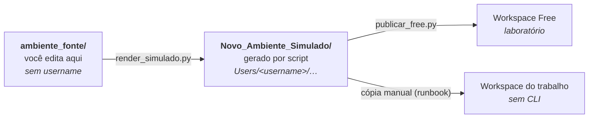

# ambiente_fonte — o produto (fonte editável)

Este diretório é a **única cópia editável** do ecossistema `.assistant` do Genie
Code (regra `.claude/rules/fonte-de-verdade.md`). Origem: cópia da entrega
auditada do Codex (`Ajustes_Codex/assistant_optimized_2026-08-13/`, congelada);
toda evolução acontece aqui, com trilha no `CHANGELOG.md` da raiz.

## Por que existem duas pastas com o mesmo conteúdo

É a dúvida mais frequente de quem abre o repositório pela primeira vez. O mesmo
conteúdo aparece aqui e em `Novo_Ambiente_Simulado/` porque as duas pastas têm
papéis opostos:



A pasta que você edita é **neutra**: não contém username nenhum. O simulado
acrescenta a camada `Users/<username>/`, que é o formato que o workspace espera —
e essa camada muda conforme o destino. Manter as duas separadas é o que permite
que a cópia para o trabalho seja mecânica: você copia uma subárvore pronta, sem
decidir nada no meio do caminho, em um computador que não tem as ferramentas
deste repositório.

Editar o simulado à mão não funciona: o próximo render apaga a pasta inteira e a
recria a partir daqui.

## Uma alteração, do começo ao fim

```powershell
# 1. edite qualquer arquivo desta pasta
# 2. valide — reprova link quebrado, frontmatter inválido, identificador pessoal
python tools/validate_assistant.py

# 3. regenere o espelho
python tools/render_simulado.py --write

# 4. publique no laboratório e confira o que ficou lá
python tools/publicar_free.py --execute
python tools/publicar_free.py --verify

# 5. registre no CHANGELOG.md e faça o commit
```

Pular o passo 4 é o erro mais comum: a publicação diz o que enviou, a conferência
diz o que existe — inclusive arquivo que saiu da fonte e continua vivo no
workspace, já que publicar sobrescreve mas nunca apaga.

## Conteúdo

```text
ambiente_fonte/
├── .assistant_instructions.md    # NATIVO: instruções pessoais (≤ 20.000 chars)
└── .assistant/
    ├── README.md                 # guia completo do ecossistema (instalação, uso, testes)
    ├── skills/                   # NATIVO: 12 Agent Skills rodrigo-*
    └── hub_prompts | x_projects | hub_snippets | hub_scripts | x_docs | x_config
                                  # CUSTOM: extensões manuais (@/import/execução)
```

O guia detalhado de instalação, invocação das skills e solução de problemas está
em [.assistant/README.md](.assistant/README.md).

## Regras de edição

1. Valide antes de commitar: `python tools/validate_assistant.py`.
2. Regenere o simulado após aprovar: `python tools/render_simulado.py --write`.
3. Nunca insira identificadores corporativos, paths reais ou PII (placeholders).
4. Skills novas seguem `.assistant/.assistant/hub_padroes/skill/template.md` e o padrão
   Agent Skills (frontmatter `name` + `description`).
