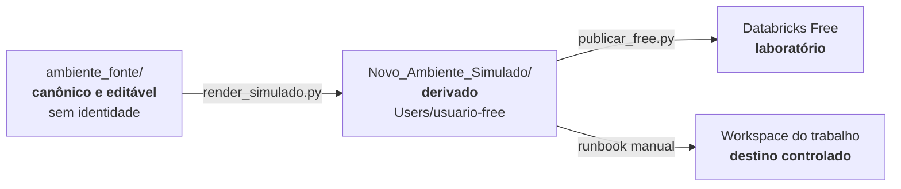

# `ambiente_fonte/` — produto editável

Esta é a única cópia editável do conteúdo que será implantado no Databricks.
Use este README para **manter o pacote**. Para usar o ambiente já publicado,
abra o [guia do `.assistant`](.assistant/README.md).

> **Regra de ouro:** edite aqui; gere o simulado; publique; confira o remoto.
> Uma correção feita diretamente no workspace será substituída na próxima
> publicação.

## Em 30 segundos



| Camada | Finalidade | Pode editar? |
|---|---|---:|
| `ambiente_fonte/` | produto neutro e versionado | **sim** |
| `Novo_Ambiente_Simulado/` | espelho da árvore de workspace | **não** |
| workspace Free | teste operacional | não; recebe publicação |
| workspace do trabalho | consumo governado | não; recebe pacote aprovado |

Separar essas camadas evita identidade pessoal no Git e impede que duas cópias
concorrentes pareçam canônicas.

## O que existe aqui

```text
ambiente_fonte/
├── .assistant_instructions.md    # NATIVO: instruções pessoais
└── .assistant/
    ├── README.md                 # guia de uso no Databricks
    ├── MANUAL_TECNICO.md  # fundamentos, inventário de helpers e índice de termos
    ├── skills/                   # NATIVO: mecanismo de Agent Skills
    ├── hub_prompts/              # HUB: formulários de pedido, uso manual
    ├── hub_snippets/             # HUB: biblioteca Python, import manual
    ├── hub_scripts/              # HUB: diagnósticos, execução manual
    └── hub_padroes/              # HUB: templates e exemplos
```

`NATIVO` identifica estruturas reconhecidas pelo Genie Code. `HUB` identifica
conteúdo criado neste projeto. As skills `hub-ml-*` combinam os dois conceitos:
o conteúdo é nosso, mas usa o mecanismo nativo de Agent Skills.

## Alterar do começo ao fim

Rode na raiz do repositório:

```powershell
# 1. Depois da edição, valide fonte, links, contratos e higiene
python tools/validate_assistant.py

# 2. Regenere o derivado; sem --write o comando apenas mostra o plano
python tools/render_simulado.py --write

# 3. Publique e confira o laboratório com destino explícito
python tools/publicar_free.py --execute --profile <free> --expected-host <url-free>
python tools/publicar_free.py --verify  --profile <free> --expected-host <url-free>
```

Depois:

1. execute o smoke test quando a mudança tocar Python, Spark ou ML;
2. execute forward tests quando mudar `name`, `description` ou escopo de skill;
3. registre a alteração no `CHANGELOG.md`;
4. faça o commit somente com a evidência pertinente.

O procedimento completo e os critérios de parada estão no
[playbook de ciclo de vida](../docs/playbooks/ciclo-de-vida.md).

## Limites

- Não inclua PII, host, e-mail, token, caminho corporativo ou dado real.
- Não edite `Novo_Ambiente_Simulado/` à mão: o próximo render o recria.
- Não trate `hub_` como interface nativa; prompts e padrões precisam ser
  anexados, e bibliotecas precisam ser importadas.
- Não generalize um resultado do Free para o trabalho. Runtime, permissões e
  Unity Catalog precisam ser verificados novamente.
- Skill nova segue o [template de skill](.assistant/hub_padroes/skill/template.md)
  e precisa de testes representativos de roteamento.

## Onde continuar

| Objetivo | Próximo documento |
|---|---|
| usar skills, prompts e helpers | [Guia do ecossistema](.assistant/README.md) |
| encontrar um helper | [Manual Técnico — helpers](.assistant/MANUAL_TECNICO.md#catalogo-helpers) |
| criar um objeto do Hub | [Padrões](.assistant/hub_padroes/README.md) |
| publicar ou replicar | [Playbooks](../docs/playbooks/README.md) |
| entender uma decisão | [ADRs](../docs/decisions/README.md) |

## Documentação por objeto

Os 75 objetos operacionais atuais possuem README local. Novos snippets, scripts e prompts usam o [molde 1.0.0](.assistant/hub_padroes/readme/template_objeto.md) e o checklist editorial. Ele complementa os exemplos e o Manual;
o README local é obrigatório para novos snippets, scripts e prompts; ele não homologa runtime nem publica o workspace.
