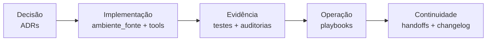

# Documentação de governança e evidência

Esta pasta explica **por que o ambiente é assim**, **o que já foi comprovado** e
**como executar uma operação com segurança**. Ela não é publicada no Databricks:
quem usa o produto começa em
[`ambiente_fonte/.assistant/README.md`](../ambiente_fonte/.assistant/README.md);
quem mantém ou aprova mudanças começa aqui.

## Escolha sua rota

| Sua pergunta | Documento dono |
|---|---|
| “Qual decisão arquitetural está valendo?” | [ADRs](decisions/README.md) |
| “Que riscos outra IA encontrou?” | [Auditorias](auditoria/README.md) |
| “O que foi realmente testado?” | [Testes](testes/README.md) |
| “Como publico ou replico?” | [Playbooks](playbooks/README.md) |
| “O que cada sprint entregou?” | [Sprints](sprints/README.md) |
| “Qual é o estado final dos READMEs de objeto?” | [Iniciativa R00–R13](sprints/readmes_objetos/README.md) |
| “O que ficou pendente entre sessões?” | [Handoffs](handoffs/README.md) |
| “Por que este arquivo saiu do produto?” | [Histórico](historico/README.md) |

## Regra de leitura

Os documentos têm naturezas diferentes:

| Natureza | Pode ser reescrita? | Como evolui |
|---|---:|---|
| Guia operacional | sim | edição normal + `CHANGELOG.md` |
| ADR aceito | não, salvo errata factual anexada | novo ADR supersede o anterior |
| Auditoria ou resultado de teste | não | nova rodada, com nova data |
| Handoff | não depois de entregue | novo handoff ou changelog fecha o assunto |
| Relatório de sprint | não | correções ficam no changelog e na evidência posterior |

Por isso um resultado antigo pode contradizer o estado atual sem estar “errado”:
ele registra o runtime e a data em que foi observado. Para decidir hoje, use o
resumo vigente em [testes](testes/README.md) e abra o JSON ou a rodada citada.

## Estado documental/local atual

A iniciativa R00–R13 de READMEs por objeto foi encerrada em 14/09/2026 com 75/75 objetos operacionais, 3/3 exemplares, zero pendências e auditoria final local `A0_light`. Esse fechamento não publica nem homologa Databricks/Genie Code.

## Última evidência Databricks real registrada

Em 29/08/2026, validação local, publicação no Free e smoke no Spark 4.2.0 estavam
aprovados. Os testes conversacionais do Genie Code continuavam parcialmente
pendentes por cota. Consulte a
[execução das etapas 1 a 5](testes/2026-08-29_execucao-etapas-1-a-5.md) para o
checkpoint técnico e a
[etapa 6](testes/2026-08-29_etapa-6-redesenho-documental.md) para o redesenho
publicado depois dele.

Volte ao [README raiz](../README.md) para o ciclo de contribuição.

## Sistema de Temas — estado vigente no Git

[V00–V04 estão aceitas e integradas no Git](sprints/sistema_temas/README.md). A D05 reconcilia somente documentação viva e não é a sprint funcional V05. Continuam separados: publicação no Databricks, homologação visual/runtime, auditoria independente e avaliação com usuário iniciante.
