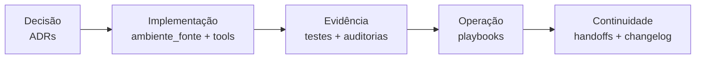

# Documentação de governança e evidência

Esta pasta explica **por que o ambiente é assim**, **o que já foi comprovado** e
**como executar uma operação com segurança**. Ela não é publicada no Databricks:
quem usa o produto começa em
[`ambiente_fonte/.assistant/README.md`](../ambiente_fonte/.assistant/README.md);
quem mantém ou aprova mudanças começa aqui.

## Escolha sua rota

| Sua pergunta | Documento dono |
|---|---|
| “Como mantenho o projeto?” | [Rotas IA](ai/README.md) e [ferramentas](../tools/README.md) |
| “Como preparo uma entrega?” | [Replicação](../.agents/skills/replicar-trabalho/SKILL.md) e [runbook](playbooks/replicacao-trabalho.md) |
| “Qual regressão já foi encontrada?” | [Classes de defeito e guardas](auditoria/README.md#classes-de-defeito-que-viraram-guardas) |
| “O que mudou de modo relevante?” | [Marcos](../CHANGELOG.md); [cronologia integral arquivada](historico/changelog/README.md) |
| “Qual decisão arquitetural está valendo?” | [ADRs](decisions/README.md) |
| “Que riscos outra IA encontrou?” | [Auditorias](auditoria/README.md) |
| “O que foi realmente testado?” | [Testes](testes/README.md) |
| “Como publico ou replico?” | [Playbooks](playbooks/README.md) |
| “O que cada sprint entregou?” | [Sprints](sprints/README.md) |
| “Qual é o estado final dos READMEs de objeto?” | [Iniciativa R00–R13](sprints/readmes_objetos/README.md) |
| “O que ficou pendente entre sessões?” | [Handoffs](handoffs/README.md) |
| “Por que este arquivo saiu do produto?” | [Histórico](historico/README.md) |

## Regra de leitura

Os documentos têm naturezas diferentes:

| Natureza | Pode ser reescrita? | Como evolui |
|---|---:|---|
| Guia operacional | sim | edição + evidência; marco relevante no `CHANGELOG.md` |
| ADR aceito | não, salvo errata factual anexada | novo ADR supersede o anterior |
| Auditoria ou resultado de teste | não | nova rodada, com nova data |
| Handoff | não depois de entregue | novo handoff/evidência fecha o assunto |
| Relatório de sprint | não | correções ficam na evidência posterior, com marco se relevante |

Por isso um resultado antigo pode contradizer o estado atual sem estar “errado”:
ele registra o runtime e a data em que foi observado. Para decidir hoje, use o
resumo vigente em [testes](testes/README.md) e abra o JSON ou a rodada citada.

## Estado documental/local atual

A iniciativa R00–R13 de READMEs por objeto foi encerrada em 14/09/2026 com 75/75 objetos operacionais, 3/3 exemplares, zero pendências e auditoria final local `A0_light`. Esse fechamento não publica nem homologa Databricks/Genie Code.

## Estado e evidências por frente

- [Micromodelos](sprints/micromodelos/README.md): módulo integrado pela PR #119 (`63601e09`, 30/09/2026); o [plano de integração](sprints/micromodelos/PLANO_INTEGRACAO_HUB_MICROMODELOS.md) registra readback 691/691 daquela release. Não é homologação corporativa.
- [SER/B1](sprints/skill_enforcement_rollout/README.md): escopo técnico A aceito e integrado pela PR #122 (`43dac176`, 01/10/2026); orquestração Genie parcial e promoção de policy separadas.
- [Temas](sprints/sistema_temas/README.md): V00–V13 e V14 S0/S1 integradas; FAIL e slots BLOCKED permanecem. Os PASS ambientais cobrem somente os casos nomeados.
- [Testes por canal](testes/README.md): distingue contrato, runtime, transporte, comportamento, UAT e autorização. Não há uma homologação global obtida pela soma de campanhas.

A [execução de 29/08](testes/2026-08-29_execucao-etapas-1-a-5.md) e o [redesenho posterior](testes/2026-08-29_etapa-6-redesenho-documental.md) continuam evidências históricas, não a última execução de todas as frentes.

Volte ao [README raiz](../README.md#ciclo-de-contribuição) para o ciclo de contribuição.

## Instruções de manutenção por IA

O contrato canônico está em [AGENTS.md](../AGENTS.md). O [guia de manutenção](ai/README.md)
reúne fontes neutras, cinco skills do mantenedor, integrações e limites de compatibilidade.
