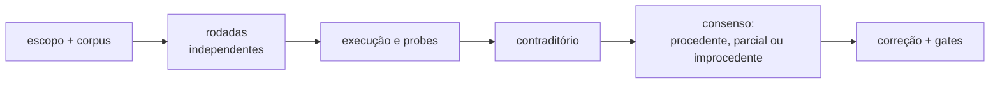

# Auditorias multi-LLM

## Evidência independente por frente

Abra o índice da frente e a rodada citada para verificar autoria independente, SHA e alcance: [Micromodelos](../sprints/micromodelos/README.md), [SEF](../sprints/skill_enforcement/README.md), [SER/B1](../sprints/skill_enforcement_rollout/README.md) e [Temas](../sprints/sistema_temas/README.md). As rodadas listadas abaixo são congeladas e não são substituídas por uma auditoria posterior.

Auditoria multi-LLM usa rodadas independentes antes do contraditório. O valor
não é somar votos: é revelar pontos cegos diferentes, executar probes e resolver
claims de plataforma contra documentação oficial.

## Quando usar cada nível

| Nível | Rodadas independentes | Uso |
|---|---:|---|
| `A0_light` | 1 | revisão de rotina e mudança contida |
| `A1_standard` | 2 | antes de compartilhar com equipe |
| `A2_strict` | 3 | mudança estrutural ou ida ao trabalho |
| `A3_incident` | 3+ | incidente com causa ainda incerta |

Não reduza o nível em publicação externa, dado sensível ou decisão que afete
outras pessoas. Divergência sobre comportamento do Genie Code não se resolve por
maioria; a fonte oficial é a autoridade.

## Fluxo

Uma pasta por auditoria: `YYYY-MM-DD_<tema>/`, usando
`docs/ai/templates/auditoria.md`. Preserve prompts, rodadas, evidência e consenso.

## Classes de defeito que viraram guardas

As rotas abaixo ajudam a investigar; não substituem código, ADR ou prova datada.
A existência de um teste não afirma que ele foi executado no SHA corrente.

| Classe | Sinal e prevenção | Owner/teste e prova histórica |
|---|---|---|
| R01 — PASS fora do escopo | leitura, transporte ou seleção são tratados como execução/aceite; separar SHA, ambiente e propriedade | [test_ser_certify](../../tools/tests/test_ser_certify.py), [SER/B1](../sprints/skill_enforcement_rollout/README.md), [testes por canal](../testes/README.md) |
| R02 — guarda sem instrumento | proxy, contagem ou suíte vazia passa; exigir positivo e mutante discriminante | [test_tool_guards](../../tools/tests/test_tool_guards.py), [test_ser_parallel_b0](../../tools/tests/test_ser_parallel_b0.py) |
| R03 — hash correto, semântica errada | conferir IDs/sets de steps, bindings e invariantes, além do hash | [test_ser_certify](../../tools/tests/test_ser_certify.py), [prova B0](../sprints/skill_enforcement_rollout/PARALELO/B0/README.md) |
| R04 — cleanup falsamente verde | ausência de reprodução não resolve a causa; medir resíduo e ownership no boundary | [test_certify_storage_cleanup](../../tools/tests/test_certify_storage_cleanup.py), [test_se08_cleanup_diagnostics](../../tools/tests/test_se08_cleanup_diagnostics.py) |
| R05 — bytes versus console | distinguir normalização LF/CRLF/Unicode no transporte de conteúdo canônico | [test_ser01_object_validation](../../tools/tests/test_ser01_object_validation.py), [test_ser_parallel_b0](../../tools/tests/test_ser_parallel_b0.py) |
| R06 — higiene incompleta | não relaxar guarda por falso positivo; testar homes escapados, segredos e SHA legítimo | [project_policy](../../tools/project_policy.py), [test_ser_parallel_b0](../../tools/tests/test_ser_parallel_b0.py) |
| R07 — plataforma sem fonte atual | não universalizar um runtime; fonte oficial mais contexto/versão e reteste autorizado | [observações datadas](../ai/context/observacoes-2026.md), [referência vigente](../ai/references/databricks-genie-code.md) |
| R08 — conserto no lugar errado | mudar o canônico e regenerar; catálogo/exemplo não substitui implementação | [test_render_simulado](../../tools/tests/test_render_simulado.py), [ADR-0010](../decisions/ADR-0010-manual-tecnico-unificado.md) |
| R09 — plausibilidade sem prova | fixar população, tempo, unidade e cobertura; sintético não prova resultado institucional | [test_micromodelo_mm04_flow](../../tools/tests/test_micromodelo_mm04_flow.py), [estado Micromodelos](../sprints/micromodelos/README.md) |
| R10 — estado transitório como invariante | snapshot/checkpoint não é estado atual; successors e guards devem ser explícitos | [test_ser_promotion_certify](../../tools/tests/test_ser_promotion_certify.py), [ADR-0022](../decisions/ADR-0022-certificacao-prospectiva-ser.md) |
| R11 — limpeza apaga prova | conferir conteúdo, licenças e outputs antes de mover; conservar recuperação/hash | [recuperação R09](../sprints/readmes_objetos/RECUPERACAO_R09.md), [test_ai_history](../../tools/tests/test_ai_history.py), [snapshot](../historico/changelog/README.md) |
| R12 — texto não prova identidade física | resolver paths/symlinks/ancestral existente; respeitar TOCTOU | [test_skill_enforcement_se07](../../tools/tests/test_skill_enforcement_se07.py), [test_temas_v02](../../tools/tests/test_temas_v02.py) |
| R13 — erro aberto em fronteira | API/core, parse, UTF-8 e CLI devem falhar de forma estruturada coerente | [test_skill_enforcement_se07](../../tools/tests/test_skill_enforcement_se07.py), [ADR-0021](../decisions/ADR-0021-execucao-verificavel-de-skills.md) |

Nova ocorrência pode acrescentar prova à classe pertinente; não exige outra
classe nem outro diário. Quando faltar teste/prova discriminante, declare a
lacuna. Gates BLOCKED e FAIL continuam no owner da frente, sem semáforo global.

## Rodadas temáticas

| Data | Tema | Nível | Resultado |
|---|---|---|---|
| 2026-08-14 | [`pit_join` e `join_diagnostics`](2026-08-14_biblioteca-pit-join/) | A1 | 15 achados; 13 procedentes |
| 2026-08-14 | [documentação](2026-08-14_documentacao/) | A1 | 22 procedentes |
| 2026-08-15 | [documentação, rodada 2](2026-08-15_documentacao-rodada2/) | A1 | 25 procedentes |
| 2026-08-16 | [plano do Hub](2026-08-16_plano-hub/) | A1 | 25 procedentes; plano reescrito |
| 2026-08-18 | [consistência e didática](2026-08-18_consistencia-e-didatica/) | A1 | 18 procedentes |
| 2026-08-19 | [leitura em contexto longo](2026-08-19_leitura-contexto-longo/) | A1, segunda origem | 1 procedente, 1 parcial, 1 improcedente + achado de idioma |
| 2026-08-20 | [execução e contraditório](2026-08-20_segunda-origem-codex/) | A2 | 24 achados; correções com probes e mutantes |
| 2026-08-29 | [READMEs após o redesenho](2026-08-29_readmes-grok/) | A1, Grok 4.6 + contraditório | 2 P1, 3 P2 e melhorias P3 aceitas; sem P0 |
| 2026-09-09 | [implantação do plano consolidado](2026-09-09_implantacao-plano/02_codex.md) | segunda origem, rodada Codex | gates locais aprovados; achados residuais e plano corretivo; contraditório pendente |

As auditorias das sprints ficam junto dos respectivos relatórios e estão
indexadas no plano integral congelado, recuperável pela [história consolidada](../../CHANGELOG.md). Esta tabela cobre apenas
rodadas temáticas.

## Como interpretar “auditado”

- nível alto não significa aprovação automática;
- achado só fecha depois de classificação, correção e gate pertinente;
- auditoria por leitura pode informar um gate, mas não abrir gate de runtime;
- evidência datada continua válida para aquela execução, não para todo runtime
  futuro;
- estado operacional vigente está em [testes](../testes/README.md).

[Voltar ao índice de documentação](../README.md)
