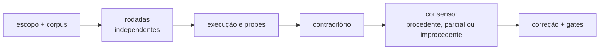

# Auditorias multi-LLM

## Evidência independente por frente

Abra o índice da frente e a rodada citada para verificar autoria independente, SHA e alcance: [Micromodelos](../sprints/micromodelos/README.md), [SEF](../sprints/skill_enforcement/README.md), [SER/B1](../sprints/skill_enforcement_rollout/README.md) e [Temas](../sprints/sistema_temas/README.md). As rodadas listadas abaixo são congeladas e não são substituídas por uma auditoria posterior.

Auditoria multi-LLM usa rodadas independentes antes do contraditório. O valor
não é somar votos: é revelar pontos cegos diferentes, executar probes e resolver
claims de plataforma contra documentação oficial.

## Quando usar cada nível

| Nível | Rodadas independentes | Uso |
|---|---:|---|
| `A0_light` | 1 | revisão de rotina e mudança contida |
| `A1_standard` | 2 | antes de compartilhar com equipe |
| `A2_strict` | 3 | mudança estrutural ou ida ao trabalho |
| `A3_incident` | 3+ | incidente com causa ainda incerta |

Não reduza o nível em publicação externa, dado sensível ou decisão que afete
outras pessoas. Divergência sobre comportamento do Genie Code não se resolve por
maioria; a fonte oficial é a autoridade.

## Fluxo

Uma pasta por auditoria: `YYYY-MM-DD_<tema>/`, usando
`docs/ai/templates/auditoria.md`. Preserve prompts, rodadas, evidência e consenso.

## Classes de defeito que viraram guardas

| Classe | Sinal | Prevenção |
|---|---|---|
| norma sem instrumento | a prosa promete algo que nenhum gate mede | construir caso violador e exigir reprovação |
| gate de propriedade substituída | mede proxy fácil e o chama de propriedade real | mutante preserva o proxy, viola a propriedade e deve reprovar |
| claim de plataforma sem fonte | comportamento local vira regra geral | fonte oficial + ambiente/data da observação |
| leitura tratada como execução | revisão estática “aprova” runtime | smoke real com saída preservada |

Contar skills não prova que os nomes são os esperados; capturar qualquer exceção
não prova que a falha correta ocorreu; constantes iguais não provam comportamento
equivalente.

## Rodadas temáticas

| Data | Tema | Nível | Resultado |
|---|---|---|---|
| 2026-08-14 | [`pit_join` e `join_diagnostics`](2026-08-14_biblioteca-pit-join/) | A1 | 15 achados; 13 procedentes |
| 2026-08-14 | [documentação](2026-08-14_documentacao/) | A1 | 22 procedentes |
| 2026-08-15 | [documentação, rodada 2](2026-08-15_documentacao-rodada2/) | A1 | 25 procedentes |
| 2026-08-16 | [plano do Hub](2026-08-16_plano-hub/) | A1 | 25 procedentes; plano reescrito |
| 2026-08-18 | [consistência e didática](2026-08-18_consistencia-e-didatica/) | A1 | 18 procedentes |
| 2026-08-19 | [leitura em contexto longo](2026-08-19_leitura-contexto-longo/) | A1, segunda origem | 1 procedente, 1 parcial, 1 improcedente + achado de idioma |
| 2026-08-20 | [execução e contraditório](2026-08-20_segunda-origem-codex/) | A2 | 24 achados; correções com probes e mutantes |
| 2026-08-29 | [READMEs após o redesenho](2026-08-29_readmes-grok/) | A1, Grok 4.6 + contraditório | 2 P1, 3 P2 e melhorias P3 aceitas; sem P0 |
| 2026-09-09 | [implantação do plano consolidado](2026-09-09_implantacao-plano/02_codex.md) | segunda origem, rodada Codex | gates locais aprovados; achados residuais e plano corretivo; contraditório pendente |

As auditorias das sprints ficam junto dos respectivos relatórios e estão
indexadas em [`PLANO_HUB.md`](../../PLANO_HUB.md). Esta tabela cobre apenas
rodadas temáticas.

## Como interpretar “auditado”

- nível alto não significa aprovação automática;
- achado só fecha depois de classificação, correção e gate pertinente;
- auditoria por leitura pode informar um gate, mas não abrir gate de runtime;
- evidência datada continua válida para aquela execução, não para todo runtime
  futuro;
- estado operacional vigente está em [testes](../testes/README.md).

[Voltar ao índice de documentação](../README.md)
