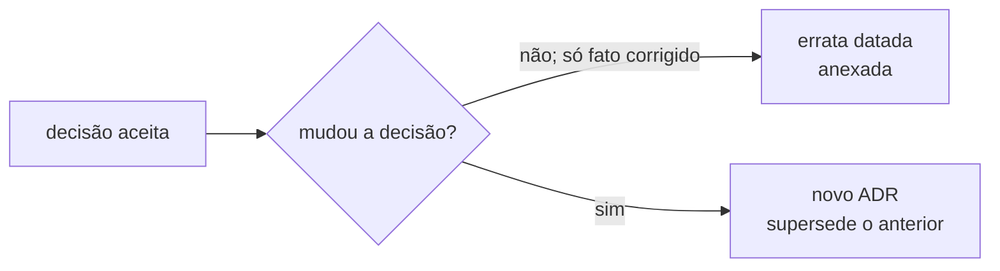

# Decisões arquiteturais (ADRs)

ADRs respondem “por que escolhemos esta arquitetura?”. Consulte esta coleção
antes de alterar fonte de verdade, identidade, publicação, catálogo ou pacote de
implantação.

## Regra de evolução

O corpo decisório aceito é imutável. Ajuste de estilo ou implementação local
pede changelog, não ADR. Use o template `.claude/templates/adr.md` quando a
escolha for difícil de reverter ou afetar mais de um componente.

## Índice vigente

| ADR | Decisão | Status |
|---|---|---|
| [0001](ADR-0001-arquitetura-multi-ia.md) | repositório canônico e camadas derivadas | aceito |
| [0002](ADR-0002-engine-databricks-genie-hub.md) | reutilizar engine `databricks-genie` | supersedido por 0005 |
| [0003](ADR-0003-quarentena-ambiente-antigo.md) | `Ambiente_Antigo/` local-only | aceito |
| [0004](ADR-0004-declaracao-explicita-de-helpers.md) | helpers declarados nas skills | forma/localização supersedidas por 0007; descoberta solicitada delimitada por 0011 |
| [0005](ADR-0005-publicacao-propria-no-free.md) | publicador próprio no Free | aceito; conferência supersedida por 0008 |
| [0006](ADR-0006-identidade-hub.md) | identidade `hub_`/`hub-` | aceito |
| [0007](ADR-0007-catalogo-e-pasta-de-objeto.md) | catálogo e pasta por objeto | localização/forma do catálogo supersedidas por 0010 |
| [0008](ADR-0008-criterios-de-conferencia-da-publicacao.md) | critérios de verify em código | aceito |
| [0009](ADR-0009-identidade-e-pacote-de-implantacao.md) | identidade neutra e ZIP sanitizado | aceito |
| [0010](ADR-0010-manual-tecnico-unificado.md) | Manual Técnico unifica catálogo e glossário | aceito |
| [0011](ADR-0011-concierge-hub.md) | Concierge opcional para descoberta e composição | aceito para integração; homologação no destino pendente |
| [0012](ADR-0012-readmes-de-objeto.md) | README didático por objeto; transição controlada | aceito e implementado; R00–R13 encerrada em 2026-09-14 |
| [0013](ADR-0013-sistema-de-temas.md) | contrato central de temas e aplicação explícita por contexto | aceito; V00–V08 integradas no Git; sem publicação/homologação operacional |
| [0014](ADR-0014-micromodelo-artefato-de-dominio.md) | micromodelo é artefato de domínio, não tipo do Hub | aceito em 2026-09-14; integração da MM00 pendente |
| [0015](ADR-0015-micromodelo-yaml-canonico.md) | `micromodelo.yaml` é especificação estruturada canônica | aceito em 2026-09-14; integração da MM00 pendente |
| [0016](ADR-0016-mlflow-runs-micromodelos.md) | MLflow registra runs; YAML registra definição | aceito em 2026-09-14; integração da MM00 pendente |
| [0017](ADR-0017-governanca-externa-publicacao.md) | governança externa permanece autoridade da publicação | aceito em 2026-09-14; integração da MM00 pendente |
| [0018](ADR-0018-piloto-novo-antes-legados.md) | provar esteira com caso novo antes de migrar legados | aceito em 2026-09-14; integração da MM00 pendente |
| [0019](ADR-0019-micromodelos-consomem-temas.md) | micromodelos consomem Sistema de Temas e não criam tema paralelo | aceito em 2026-09-14; integração da MM00 pendente |
| [0020](ADR-0020-fontes-catalogo-configurado.md) | fontes ficam no catálogo corporativo configurado via binding externo | aceito em 2026-09-14; integração da MM00 pendente |
| [0021](ADR-0021-execucao-verificavel-de-skills.md) | `execution_contract` estruturado + capability experiment antes de preflight/runner | aceito em 2026-09-16 após gate humano da SE01; probe temporário aposentado do produto |
| [0022](ADR-0022-certificacao-prospectiva-ser.md) | certificação SER prospectiva, condições aditivas e prova por superfície | aceito em 2026-09-22 na SER00; implementação prospectiva pendente |
| [0023](ADR-0023-execucao-paralela-governada-ser.md) | execução paralela governada da SER por DAG, autoria central e certificação isolada | aceito em 2026-09-24; B0 candidata implementada, qualificação local pendente |

Ao adicionar um ADR, atualize esta tabela e o `CHANGELOG.md`.

[Voltar ao índice de documentação](../README.md)

A proposta dos READMEs foi renumerada administrativamente para ADR-0012 na
composição R02-I. A referência histórica ADR-0011 nas sprints R01/R02 refere-se
a essa proposta, não à decisão do Concierge. O conteúdo e o status das duas
decisões não foram equiparados.