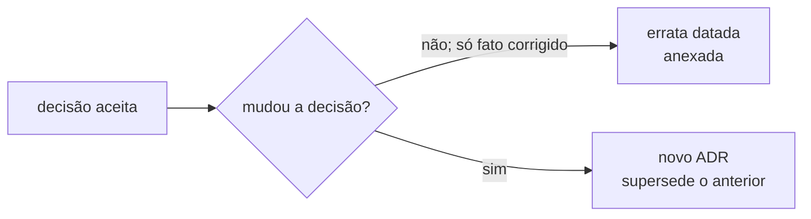

# Decisões arquiteturais (ADRs)

ADRs respondem “por que escolhemos esta arquitetura?”. Consulte esta coleção
antes de alterar fonte de verdade, identidade, publicação, catálogo ou pacote de
implantação.

## Regra de evolução

O corpo decisório aceito é imutável. Ajuste de estilo ou implementação local
pede changelog, não ADR. Use o template `.claude/templates/adr.md` quando a
escolha for difícil de reverter ou afetar mais de um componente.

## Índice vigente

| ADR | Decisão | Status |
|---|---|---|
| [0001](ADR-0001-arquitetura-multi-ia.md) | repositório canônico e camadas derivadas | aceito |
| [0002](ADR-0002-engine-databricks-genie-hub.md) | reutilizar engine `databricks-genie` | supersedido por 0005 |
| [0003](ADR-0003-quarentena-ambiente-antigo.md) | `Ambiente_Antigo/` local-only | aceito |
| [0004](ADR-0004-declaracao-explicita-de-helpers.md) | helpers declarados nas skills | forma/localização supersedidas por 0007; descoberta solicitada delimitada por 0011 |
| [0005](ADR-0005-publicacao-propria-no-free.md) | publicador próprio no Free | aceito; conferência supersedida por 0008 |
| [0006](ADR-0006-identidade-hub.md) | identidade `hub_`/`hub-` | aceito |
| [0007](ADR-0007-catalogo-e-pasta-de-objeto.md) | catálogo e pasta por objeto | localização/forma do catálogo supersedidas por 0010 |
| [0008](ADR-0008-criterios-de-conferencia-da-publicacao.md) | critérios de verify em código | aceito |
| [0009](ADR-0009-identidade-e-pacote-de-implantacao.md) | identidade neutra e ZIP sanitizado | aceito |
| [0010](ADR-0010-manual-tecnico-unificado.md) | Manual Técnico unifica catálogo e glossário | aceito |

| [0011](ADR-0011-concierge-hub.md) | Concierge opcional para descoberta e composição | aceito para integração; homologação no destino pendente |

Ao adicionar um ADR, atualize esta tabela e o `CHANGELOG.md`.

[Voltar ao índice de documentação](../README.md)
