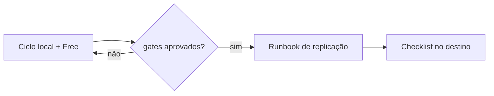

# Playbooks — operações repetíveis

Playbook é o procedimento vigente para uma operação. Diferente de auditoria ou
resultado de teste, ele pode e deve ser atualizado quando a operação muda.

## Qual usar

| Objetivo | Playbook |
|---|---|
| Alterar, validar, renderizar e publicar | [Ciclo de vida](ciclo-de-vida.md) |
| Levar o pacote aprovado ao workspace do trabalho | [Replicação no trabalho](replicacao-trabalho.md) |
| Conferir cada pré-condição da replicação | [Checklist de replicação](checklist-replicacao.md) |

## Ordem segura

O workspace do trabalho não é continuação automática do Free. Permissões,
runtime, Unity Catalog e políticas podem divergir; o runbook exige nova
verificação no destino.

## Manutenção

- Descreva comandos copiáveis, pré-condições e critério de sucesso.
- Não inclua usuário, host, token ou caminho corporativo real; use placeholders.
- Mudança de decisão arquitetural pede ADR. Mudança no modo de executar pede
  atualização do playbook e entrada no `CHANGELOG.md`.

Volte ao [índice de documentação](../README.md).
