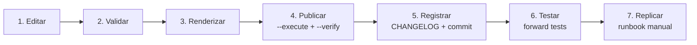

# Playbook — Ciclo de vida de uma mudança no ecossistema

Procedimento completo para alterar qualquer coisa em `ambiente_fonte/` e levá-la
até os workspaces. A mesma sequência aparece, em diagrama, no `README.md` da raiz
e, em forma de comandos, no `ambiente_fonte/README.md` — os três descrevem a
mesma ordem, e divergir de qualquer um deles é defeito nos três.



## 1. Editar

- Edite apenas `ambiente_fonte/` (regra `fonte-de-verdade.md`).
- Skills: mantenha frontmatter `name`+`description`, imperativo, progressive
  disclosure (detalhe grande vai para `templates/` da própria skill).
- Instruções: vigie o limite de 20.000 caracteres.

## 2. Validar

```powershell
python tools/validate_assistant.py
```

Só siga adiante com exit 0. `WARN` de tamanho: avalie progressive disclosure.

## 3. Renderizar

```powershell
python tools/render_simulado.py --write
```

## 4. Publicar no Free

```powershell
python tools/publicar_free.py            # plano (dry-run)
python tools/publicar_free.py --execute --profile <free> --expected-host <url-free>
python tools/publicar_free.py --verify --profile <free> --expected-host <url-free>
```

Dry-run por padrão; `--execute` é gate consciente. O `verify` é obrigatório: a
publicação relata o que enviou, ele confere o que existe — inclusive arquivos
obsoletos, que `import-dir --overwrite` nunca remove (ADR-0005).

## 5. Registrar

- Entrada no `CHANGELOG.md` (template `.claude/templates/changelog-entry.md`).
- Decisão estrutural → ADR; sessão interrompida → handoff.

**Depois de publicar, não antes.** A entrada cita contagens, e quem as produz é a
linha `remotos` do `--verify`. Registrar primeiro é escrever de memória o número
que o comando ia dar — a classe de defeito que este repositório mais corrigiu.

## 6. Testar no Free

Para cada skill alterada, em **chat novo** do Genie Code:

1. caso positivo (pedido que deveria acionar a skill por relevância);
2. caso negativo (pedido parecido que NÃO deveria acionar);
3. `@menção` explícita.

Falha de auto-seleção → melhorar `description` e repetir. Registrar resultados.

## 7. Replicar no trabalho (fase 4 — runbook)

Geração do ZIP mínimo por `tools/bundle_implantacao.py` e cópia manual para o
workspace do trabalho, com mapeamento do placeholder para o destino. Procedimento completo no
[runbook de replicação](replicacao-trabalho.md), com o
[checklist](checklist-replicacao.md) para marcar durante a execução. Os
pré-requisitos e guardrails estão em `.claude/skills/replicar-trabalho/`.

## Fontes

- Diagrama equivalente: [`README.md`](../../README.md) da raiz, seção "Ciclo de
  vida de uma mudança"
- Comandos na forma copiável: [`ambiente_fonte/README.md`](../../ambiente_fonte/README.md)
- Camadas e o que é editável: `.claude/rules/fonte-de-verdade.md`
- Por que a conferência é obrigatória: [ADR-0005](../decisions/ADR-0005-publicacao-propria-no-free.md)
  e [ADR-0008](../decisions/ADR-0008-criterios-de-conferencia-da-publicacao.md)
- Passo 7 em detalhe: [runbook de replicação](replicacao-trabalho.md)
