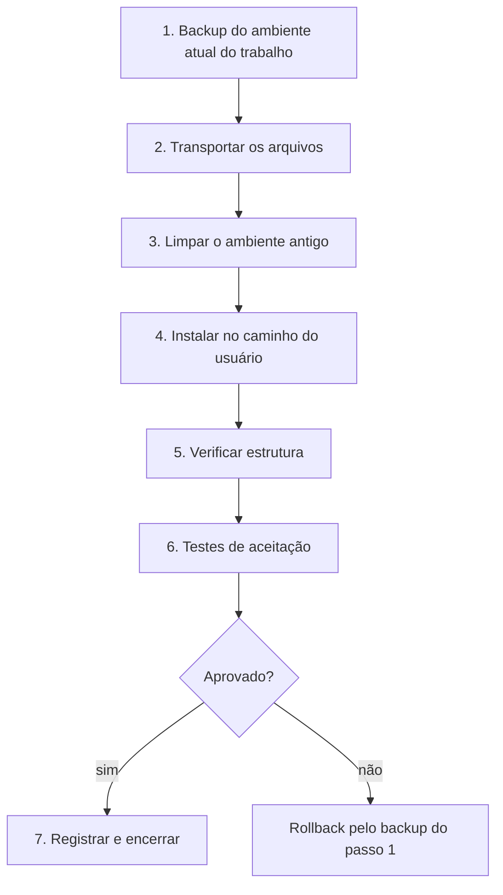

# Runbook — replicar o ecossistema no workspace do trabalho

> **Os números deste documento saem de comando, não de memória.** Onde antes
> havia uma contagem fixa, hoje há a linha que a produz — porque toda contagem
> escrita à mão neste projeto envelheceu, sem exceção. Rode antes de replicar:
>
> ```powershell
> python tools/validate_assistant.py     # skills, objetos, contratos
> python tools/publicar_free.py --verify # arquivos, skills, extensões, obsoletos
> ```

Procedimento para levar o ecossistema `.assistant` certificado no laboratório
para o workspace corporativo (Azure Databricks). Escrito para ser executado em
outro computador, **sem Databricks CLI**, com acesso apenas pela interface do
workspace.

> Para acompanhar a execução marcando cada passo, use o
> [checklist](checklist-replicacao.md) — mesma sequência, formato de
> conferência.

## Antes de começar

| Restrição do destino | Consequência no procedimento |
|---|---|
| Sem CLI | Toda operação é pela UI do workspace; não há `import-dir` nem `export-dir` |
| Outro computador | O repositório precisa chegar lá por Git folder ou download |
| Username corporativo | Nunca aparece em arquivo versionado; o mapeamento é feito no destino (ADR-0003) |
| Dados reais e governados | Nenhum teste de aceitação usa dado real de produção |
| Políticas corporativas | Compute, bibliotecas e acesso a Git podem ser restritos; confirmar no primeiro acesso |

Estado exigido na origem: `python tools/validate_assistant.py` aprovado e
`Novo_Ambiente_Simulado/` regenerado a partir do commit que será replicado.

## Visão do procedimento



## 1. Backup do ambiente atual (obrigatório)

O workspace do trabalho já contém uma versão anterior do ecossistema. **Nada é
apagado antes do backup**, e o backup é o único caminho de rollback disponível
sem CLI.

1. No workspace, abrir `/Users/<username-trabalho>/`.
2. Exportar a pasta `.assistant` pelo menu de contexto (**Export → DBC Archive**
   ou o formato disponível na versão do workspace) e guardar o arquivo fora do
   Databricks.
3. Exportar também o arquivo de instruções existente. No ambiente anterior ele
   costuma estar como `assistant_instructions.md`, **sem o ponto inicial** — nesse
   formato o Genie Code nunca o leu; ainda assim, preservar para consulta.
4. Anotar data, origem e conteúdo do backup.

> Se o menu de exportação não estiver disponível para pastas na versão do
> workspace, exportar as subpastas individualmente antes de prosseguir. Não
> avançar sem backup.

## 2. Transportar os arquivos

O objeto a transportar é o ZIP mínimo e sanitizado, não o repositório inteiro.
Gere-o na máquina do laboratório:

```powershell
python tools/render_simulado.py --write
python tools/bundle_implantacao.py
```

O ZIP contém somente `.assistant_instructions.md`, `.assistant/` e
`MANIFEST.json`; não leva Git, documentos internos, referências congeladas ou
paths da máquina do autor.

| Rota | Quando usar | Confirmar antes |
|---|---|---|
| **A — ZIP mínimo** (recomendada) | Upload de arquivo é permitido | Hash/commit no `MANIFEST.json` e suporte da UI ao formato |
| **B — Git folder** | Somente após política permitir GitHub **e** a história Git ser sanitizada/auditada | Aprovação formal e scan do histórico; ainda copiar somente os paths do manifesto |
| **C — Criação manual pasta a pasta** | Demais rotas bloqueadas | Reproduzir somente os paths do `MANIFEST.json` |

> **Bloqueio atual da rota B:** commits anteriores contêm o antigo path pessoal
> do simulado. A árvore atual e o ZIP estão neutros, mas clonar transporta a
> história. Não use Git no ambiente corporativo até uma reescrita coordenada do
> histórico ou aprovação explícita para esse conteúdo.

Git folder é conveniência de transporte, **não** local de execução das skills.
O caminho de descoberta continua sendo `/Users/<username>/.assistant/skills/`.

## 3. Limpar o ambiente antigo

Skills antigas com o mesmo nome convivem com as novas e produzem seleção
ambígua. Após o backup do passo 1:

1. Inventariar as pastas atuais de `.assistant/skills/` e comparar com a lista
   `EXPECTED_SKILL_NAMES`/`LEGACY_MANAGED_SKILL_NAMES` em
   `tools/project_policy.py`.
2. Remover **somente** skills pertencentes ao Hub que serão substituídas. Nunca
   remover `skills/` inteira: skills pessoais ou organizacionais alheias coexistem.
3. Preservar `.assistant/.mcp_servers.json`. Ele é estado criado pelo painel de
   MCP do Genie Code; não é entrada do pacote e não deve ser apagado.
4. Remover `assistant_instructions.md` (sem ponto), depois de preservá-lo no
   backup, porque esse nome legado não é descoberto.
5. Para atualização, remover e substituir somente os quatro diretórios
   Hub-owned (`hub_padroes`, `hub_prompts`, `hub_scripts`, `hub_snippets`). Isso
   elimina helpers obsoletos sem tocar em conteúdo alheio.

## 4. Instalar no caminho do usuário

Destino exato, com o username do workspace do trabalho:

```text
/Users/<username-trabalho>/
├── .assistant_instructions.md        ← nativo: instruções pessoais
└── .assistant/
    ├── skills/hub-ml-*/             ← nativo: descoberta automática
    ├── CATALOGO_HELPERS.md
    ├── GLOSSARIO.md                   # vocabulário oficial, técnico e local
    └── hub_padroes | hub_prompts | hub_snippets | hub_scripts
```

O nome da pasta de usuário na origem é irrelevante: copia-se o **conteúdo** da
subárvore renderizada para dentro de `/Users/<username-trabalho>/`. Não é
necessário — nem permitido — regerar o simulado com o username corporativo; o
script recusa esse parâmetro por decisão registrada em ADR-0003.

Pontos de atenção verificados no laboratório:

- Arquivos `.py` devem ficar como **arquivo**, não como notebook. Importação por
  UI pode converter `.py` em notebook dependendo da opção escolhida; se isso
  ocorrer, os imports de `hub_snippets` falham.
- O arquivo de instruções precisa do ponto inicial e do nome exato
  `.assistant_instructions.md`, na raiz do diretório do usuário.

## 5. Verificar estrutura

| Verificação | Resultado esperado |
|---|---|
| `/Users/<username-trabalho>/.assistant/skills/` | uma pasta `hub-ml-*` por skill, cada uma com `SKILL.md` — o número vem do `--verify` |
| Raiz do `.assistant` | 4 diretórios `hub_` mais `README.md` |
| `.assistant_instructions.md` | presente na raiz do usuário, com ponto inicial |
| Um `.py` qualquer de `hub_snippets` | abre como arquivo de código, não como notebook |
| `CATALOGO_HELPERS.md` | presente (referenciado por todas as skills) |

## 6. Testes de aceitação no workspace do trabalho

O roteamento foi certificado no laboratório em **36/36** — mas nas **12 skills originais**. A `hub-ml-criar-objeto`, da Sprint 11, **ainda não foi testada**, e é a de `description` mais ampla do conjunto: inclua-a nos testes de aceitação. O que **só o trabalho valida** é
runtime real, permissões e integração — e é isso que estes testes cobrem.

### 6.1 Descoberta

Em um **chat novo** do Genie Code, pedir algo típico de duas skills distintas e
confirmar que a skill correta é carregada. Repetir com `@nome-da-skill` para
confirmar seleção determinística. Se nada for carregado, revisar caminho e
frontmatter; havendo cache de metadata, recarregar a página.

### 6.2 Instruções pessoais

Confirmar que respostas seguem PT-BR e as preferências declaradas. Lembrar da
exceção oficial: instruções **não** se aplicam a Quick Fix e Autocomplete.

### 6.3 Runtime da biblioteca

Executar `tools/spark_smoke_test.py` como notebook no workspace do trabalho com:

- `target_environment=work`;
- `mlflow_experiment_path` apontando para um experimento temporário autorizado;
- `assistant_root` vazio, salvo instalação em outro caminho.

O caso do trabalho registra parâmetros, métrica, modelo e assinatura e tenta
excluir o run temporário no `finally`. O caso do Free é outro: valida por classe
e assinatura o bloqueio conhecido de `start_run`. Não execute o oráculo de
“bloqueio esperado” no trabalho.

Use como referência a saída corrente registrada em `docs/testes/spark/README.md`,
sem copiar contagens para este runbook. Diferenças esperadas no trabalho:

| Diferença possível | Interpretação |
|---|---|
| Módulos ML deixam de acusar dependência ausente | Ambiente corporativo tem as bibliotecas; validar versões fixadas |
| Falhas relacionadas a `cache()` desaparecem | Compute clássico suporta persistência; o comportamento degradado só vale em serverless |
| Falha de permissão em leitura/escrita | Restrição de Unity Catalog, não defeito da biblioteca |

Registrar o resultado em `docs/testes/spark/resultados/` no repositório, com o
ambiente identificado apenas como "workspace do trabalho".

## 7. Registrar e encerrar

1. Anotar no `CHANGELOG.md` a replicação, o commit de origem e o resultado dos
   testes de aceitação — sem identificadores corporativos.
2. Qualquer divergência de comportamento entre laboratório e trabalho entra na
   matriz de `.claude/rules/free-vs-trabalho.md`.
3. Ajuste necessário no produto volta ao `ambiente_fonte/` no repositório; nunca
   editar direto no workspace, sob risco de a correção se perder na próxima
   replicação.

## Rollback

Restaurar o backup do passo 1 no mesmo caminho e abrir um chat novo. Conferir no
experimento temporário que o run do smoke foi excluído; falha de limpeza é efeito
residual e precisa ser tratada antes de encerrar. Registrar o motivo antes de
nova tentativa.

## Atualizações posteriores

Gerar novo ZIP/manifesto e repetir os passos 2 a 6. Remover e substituir somente
os quatro diretórios Hub-owned e as skills geridas pelo manifesto; sobrescrever
arquivos isolados não remove obsoletos. Em qualquer caso, **abrir chat novo**
após alterar skills publicadas.

## Escala para squad e missão

A instalação descrita é pessoal. O compartilhamento com a squad usa
`Workspace/.assistant/skills/`, exige perfil administrativo e revisão, e deve
ser precedido de auditoria `A1+` conforme `.claude/rules/multi-llm.md`.
Instruções de workspace (`Workspace/.assistant_workspace_instructions.md`) são
administradas separadamente e não fazem parte deste runbook.

## Fontes

- [Agent Skills no Genie Code](https://learn.microsoft.com/en-us/azure/databricks/genie-code/skills)
- [Instruções customizadas](https://learn.microsoft.com/en-us/azure/databricks/genie-code/instructions)
- [Git folders no Databricks](https://learn.microsoft.com/en-us/azure/databricks/repos/)
