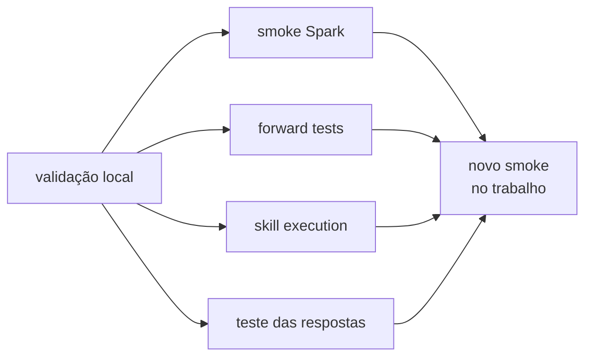

# Testes — o que só execução e conversa respondem

## Evidência por canal — leitura atual

| Canal | Fonte e versão/escopo | O que não comprova |
|---|---|---|
| Estrutura local | [gates executáveis](../../tools/README.md); registrar SHA da rodada | runtime, publicação ou comportamento |
| Runtime sintético | [B1 A, 01/10/2026](../sprints/skill_enforcement_rollout/B1_GATES_POS_MERGE_2026-10-01.md), integrado em `43dac176` | orquestração Genie completa ou policy promovida |
| Transporte por conteúdo | [Micromodelos PR119, 30/09/2026](../sprints/micromodelos/PLANO_INTEGRACAO_HUB_MICROMODELOS.md), `63601e09`, readback 691/691 da release | homologação corporativa ou algoritmo correto |
| Genie | [resultados B1](../sprints/skill_enforcement_rollout/GENIE_SKILLS_RESULTADOS_2026-09-28.md) e [retestes focais](../sprints/skill_enforcement_rollout/README.md) | runner/Receipt quando não observados |
| Interface e UAT | [jornadas V12](../sprints/sistema_temas/V12/README.md), `a6309a4d`, e [handoff V13](../sprints/sistema_temas/V13/README.md), `62e94048` | readiness global; `A11-01=FAIL` e bloqueios persistem |
| Autoridade | [policy atual](../../ambiente_fonte/.assistant/hub_padroes/skill_enforcement/policy.json) e [ownership V14](../sprints/sistema_temas/V14/README.md) | autorização de um novo efeito remoto |

Resultados de campanhas diferentes não são somados como certificação única. As seções datadas abaixo preservam o alcance original.

Validação local prova forma. Esta pasta preserva os gates que dependem do
Databricks real.

## Mapa dos gates

| Gate | Pergunta | Execução | Evidência |
|---|---|---|---|
| [Spark](spark/README.md) | o helper executa no runtime observado? | job/notebook | JSON em `spark/resultados/` |
| [Forward](forward/README.md) | a skill correta é carregada? | chat novo no Genie Code | Markdown em `forward/resultados/` |
| [Skill execution](skill_execution/README.md) | depois de selecionada, a skill realmente usa os recursos declarados? | chat novo + inspeção do artefato | protocolo, matriz e evidências SE00 |
| prompts | o contrato produz resposta útil e segura? | chat + notebook de exemplo | resposta real colada no notebook |

## Skill Enforcement Framework — SE00

O diretório [skill_execution](skill_execution/README.md) mede uma dimensão que os testes forward não cobrem: **execução depois do roteamento**. A baseline SE00 diferencia recurso declarado, localizado, lido, importado, chamado e concluído; também registra template consumido, reimplementação silenciosa, false completion e computação redundante.

Os casos iniciais usam `samples.nyctaxi.trips` e permanecem observacionais. Eles não alteram os contratos atuais das skills e não implementam enforcement.

## Estado local/documental pós-R13 — 14/09/2026

A iniciativa de READMEs R00–R13 foi encerrada localmente com 75/75 objetos operacionais, 3/3 exemplares e zero pendências. Esse fechamento não altera retroativamente as rodadas Databricks abaixo: publicação, smoke e testes conversacionais continuam valendo apenas para o ambiente e a data em que foram observados.

## Transição ao trabalho — preparação em 11/09/2026

O [guia vigente](../playbooks/replicacao-trabalho.md) separa integridade, runtime sintético e aceite humano. O kit gera um notebook próprio; ele não considera testes pulados como aprovação e não presume que a rodada de 09/09 homologue as novas instruções de 11/09 ou o workspace corporativo. A execução no trabalho permanece pendente.

## Concierge integrado — 12/09/2026

A [integração Git](2026-09-12_concierge-integracao.md) acrescenta uma skill, sem alterar os resultados históricos abaixo.
Os casos do Concierge e as regressões de roteamento das vizinhas no Genie Code
ainda precisam ser executados; consulte [Forward](forward/README.md).

## Estado registrado — 09/09/2026

| Gate | Resultado | Falta |
|---|---|---|
| validação local | aprovado | — |
| publicação/verify Free | **316 esperados, 317 remotos, 0 ausentes/obsoletos; 316/316 conteúdos iguais** | [fechamento Codex](2026-09-09_fechamento-codex.md) |
| execução funcional | **146 verificações: 137 PASS, 0 FAIL** | 8 opcionais requerem bibliotecas; 1 bloqueio MLflow é esperado |
| roteamento das 13 skills | **39/39 PASS** | — |
| 16 famílias de prompts | contrato estático 16/16 | falta rodada conversacional com fixtures e rubrica por família |

Síntese operacional:
[`2026-08-29_execucao-etapas-1-a-5.md`](2026-08-29_execucao-etapas-1-a-5.md).
Smoke vigente:
[`2026-09-09_smoke_codex_final.json`](spark/resultados/2026-09-09_smoke_codex_final.json).

## Como ler os vereditos

| Veredito | Significado | Ação |
|---|---|---|
| `PASS` | comportamento observado coincidiu com o esperado | preservar a evidência |
| `FAIL` | defeito ou incompatibilidade não prevista | corrigir e reexecutar |
| `OPTIONAL_MISSING` | biblioteca opcional não estava instalada | instalar quando o workflow exigir |
| `BLOQUEADO_ESPERADO` | limitação documentada ocorreu | reprovar se o bloqueio sumir sem revisão |

`BLOQUEADO_ESPERADO` evita um PASS silencioso quando a plataforma muda. O caso
precisa ser reclassificado e documentado, não apenas celebrado.

## Por que os gates não se substituem

| Falha real | Validação local | Smoke | Forward | Skill execution |
|---|---:|---:|---:|---:|
| frontmatter inválido | pega | — | efeito indireto | efeito indireto |
| biblioteca opcional ausente | não | pega | não | pode aparecer na execução |
| API bloqueada em serverless | não | pega | não | pode aparecer na execução |
| skill vizinha rouba o pedido | não | não | pega | mede lateralmente |
| helper declarado mas não chamado | não | não | não | pega |
| template declarado mas ignorado | não | não | não | pega |
| resposta numericamente errada | às vezes, por known-answer local | se coberta | não | não necessariamente |
| ACL/política do trabalho | não | só no destino | não | só no destino |

## Validade temporal

Em runtime gerenciado, “foi testado” exige data e ambiente. Entre 14 e
17/08/2026, Prophet passou de incompatível a funcional, enquanto abertura de run
do MLflow passou de funcional a bloqueada no serverless observado. Os registros
antigos não são reescritos; uma nova rodada registra o novo estado.

Antes de replicar no trabalho:

1. reexecute o smoke com o runtime de destino;
2. confirme bibliotecas, Spark Connect, Unity Catalog e permissões;
3. repita os testes conversacionais afetados por mudanças de skill;
4. preserve resultado bruto e síntese.

## Onde continuar

- [Método e histórico do smoke](spark/README.md)
- [Método e rodadas de roteamento](forward/README.md)
- [Baseline de execução de skills](skill_execution/README.md)
- [Runbook de replicação](../playbooks/replicacao-trabalho.md)
- [Índice de documentação](../README.md)

## Sistema de Temas — V01

O [relatório da composição V01](sistema_temas/V01/RELATORIO_EXECUCAO.md) registra
testes locais, CI adicional e limites. Não substitui a homologação no Databricks.
A [especificação e o checkpoint](../sprints/sistema_temas/V01/README.md) explicam
como revisar a proposta sem operar o produto.
