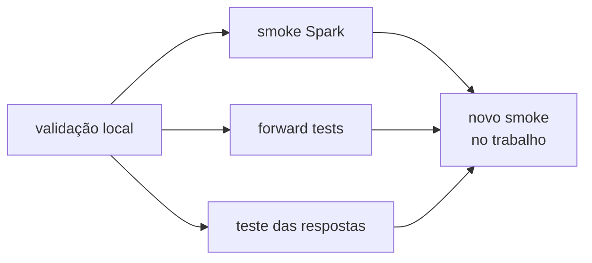

# Testes — o que só execução e conversa respondem

Validação local prova forma. Esta pasta preserva os gates que dependem do
Databricks real.

## Mapa dos gates

| Gate | Pergunta | Execução | Evidência |
|---|---|---|---|
| [Spark](spark/README.md) | o helper executa no runtime observado? | job/notebook | JSON em `spark/resultados/` |
| [Forward](forward/README.md) | a skill correta é carregada? | chat novo no Genie Code | Markdown em `forward/resultados/` |
| prompts | o contrato produz resposta útil e segura? | chat + notebook de exemplo | resposta real colada no notebook |

## Estado vigente — 29/08/2026

| Gate | Resultado | Falta |
|---|---|---|
| validação local | aprovado | — |
| publicação/verify Free | aprovado antes do redesenho documental | republicar a documentação atual |
| execução funcional | **145 verificações: 136 PASS, 0 FAIL** | 8 opcionais requerem bibliotecas; 1 bloqueio MLflow é esperado |
| roteamento das 12 skills originais | **36/36 PASS** | — |
| `hub-ml-criar-objeto` | 0/3 | positivo, negativo e `@menção` |
| 16 famílias de prompts | contrato estático 16/16 | respostas reais; cota bloqueou até 01/09 |

Síntese operacional:
[`2026-08-29_execucao-etapas-1-a-5.md`](2026-08-29_execucao-etapas-1-a-5.md).
Smoke integral:
[`2026-08-29_smoke_a2.json`](spark/resultados/2026-08-29_smoke_a2.json).

## Como ler os vereditos

| Veredito | Significado | Ação |
|---|---|---|
| `PASS` | comportamento observado coincidiu com o esperado | preservar a evidência |
| `FAIL` | defeito ou incompatibilidade não prevista | corrigir e reexecutar |
| `OPTIONAL_MISSING` | biblioteca opcional não estava instalada | instalar quando o workflow exigir |
| `BLOQUEADO_ESPERADO` | limitação documentada ocorreu | reprovar se o bloqueio sumir sem revisão |

`BLOQUEADO_ESPERADO` evita um PASS silencioso quando a plataforma muda. O caso
precisa ser reclassificado e documentado, não apenas celebrado.

## Por que os gates não se substituem

| Falha real | Validação local | Smoke | Forward |
|---|---:|---:|---:|
| frontmatter inválido | pega | — | efeito indireto |
| biblioteca opcional ausente | não | pega | não |
| API bloqueada em serverless | não | pega | não |
| skill vizinha rouba o pedido | não | não | pega |
| resposta numericamente errada | às vezes, por known-answer local | se coberta | não |
| ACL/política do trabalho | não | só no destino | não |

## Validade temporal

Em runtime gerenciado, “foi testado” exige data e ambiente. Entre 14 e
17/08/2026, Prophet passou de incompatível a funcional, enquanto abertura de run
do MLflow passou de funcional a bloqueada no serverless observado. Os registros
antigos não são reescritos; uma nova rodada registra o novo estado.

Antes de replicar no trabalho:

1. reexecute o smoke com o runtime de destino;
2. confirme bibliotecas, Spark Connect, Unity Catalog e permissões;
3. repita os testes conversacionais afetados por mudanças de skill;
4. preserve resultado bruto e síntese.

## Onde continuar

- [Método e histórico do smoke](spark/README.md)
- [Método e rodadas de roteamento](forward/README.md)
- [Runbook de replicação](../playbooks/replicacao-trabalho.md)
- [Índice de documentação](../README.md)
