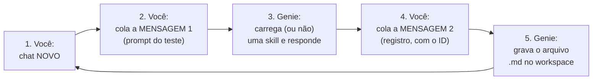

# Roteiro de forward tests — guia completo passo a passo

## 1. O que é este teste e por que ele existe

As 12 skills `rodrigo-*` já estão publicadas no seu workspace Databricks Free.
Quando você conversa com o Genie Code, ele decide **sozinho** qual skill carregar,
lendo apenas o campo `description` de cada `SKILL.md`. Se duas descriptions se
parecem demais, ele carrega a skill errada — e você recebe um relatório de
monitoramento quando pediu um teste estatístico, por exemplo.

Este teste verifica exatamente isso: **o roteamento**. Para cada skill fazemos
3 perguntas:

| Caso | O que verifica | Passa quando |
|---|---|---|
| **P** (positivo) | um pedido típico da skill a aciona? | a skill alvo é carregada |
| **N** (negativo) | um pedido *parecido, mas de outra skill* NÃO a aciona? | a skill alvo **não** é carregada |
| **M** (menção) | `@nome-da-skill` força a seleção? | a skill alvo é carregada |

São 12 skills × 3 casos = **36 testes**. Os casos negativos foram desenhados
sobre as zonas de colisão reais entre as descriptions (drift aparece em 3 skills,
"explicar notebook" em 2, "materializar features" em 2...) — são os testes que
mais ensinam.

Duas coisas que este teste **não** avalia: a qualidade da resposta do Genie
(irrelevante aqui) e a execução de código (as tabelas citadas nos prompts são
fictícias de propósito — nada será executado de verdade).

## 2. Quem faz o quê

| Ator | Responsabilidade |
|---|---|
| **Você** | abrir um chat novo por teste, colar 2 mensagens prontas (deste roteiro), e nada mais |
| **Genie Code** | escolher a skill (mensagem 1) e gravar o resultado em um arquivo no workspace (mensagem 2) |
| **Claude** | criou este roteiro; depois coleta os arquivos via CLI, preenche a tabela de resultados, diagnostica as colisões, corrige as descriptions e republica para a rodada 2 |

## 3. Antes de começar (já está tudo pronto)

- ✅ A réplica atual do ambiente está publicada no workspace (com as correções do smoke test).
- ✅ A pasta de resultados `/Users/guimarais.r.rodrigo@gmail.com/x_lab/forward_tests/` já existe.
- Deixe este roteiro aberto de um lado e o Databricks do outro.

## 4. O ciclo de um teste (você repete isto 36 vezes)



**Passo 1 — chat novo.** No painel do Genie Code, clique em novo chat. Isso é
obrigatório a cada teste: skills não recarregam em chat usado, e um chat
reaproveitado contamina o teste seguinte.

**Passo 2 — mensagem 1.** Copie o prompt do teste (seção 7 abaixo) e envie.
Nada mais junto: sem anexos, sem `@`, sem comentários seus.

**Passo 3 — Genie responde.** Você não precisa ler a resposta com atenção. Se
quiser, observe o indicador de skill na interface (é a verdade definitiva em
caso de dúvida).

**Passo 4 — mensagem 2.** No **mesmo chat**, copie o texto abaixo, troque
`<ID>` pelo código do teste (ele está no título de cada bloco, ex.: `01P`) e
envie:

```text
Registre o resultado: crie o arquivo /Workspace/Users/guimarais.r.rodrigo@gmail.com/x_lab/forward_tests/<ID>.md com uma única linha, no formato "<ID>: <nome-da-skill-que-voce-carregou-nesta-conversa, ou 'nenhuma'>". Se não conseguir criar arquivos, apenas responda essa única linha no chat.
```

Por que em duas mensagens? Porque o roteamento acontece na mensagem 1 — se o
pedido de registro estivesse nela, as palavras "skill" e "criar arquivo"
puxariam `rodrigo-auditoria-skills` e `rodrigo-pipeline-builder`, contaminando
o teste. Na mensagem 2 a escolha já aconteceu; o pedido é inofensivo.

**Passo 5 — Genie grava o arquivo.** Pronto, próximo teste. Se o Genie disser
que não consegue criar arquivos, sem problema: ele responderá a linha no chat —
copie-a para um bloco de notas e, no final, cole todas de uma vez para o Claude.

> **Dica no 1º teste:** depois da mensagem 2 do teste `01P`, avise o Claude
> ("criou?"). Ele confere pela CLI em segundos se o arquivo apareceu — assim
> você já sabe se o plano A (arquivos) funciona ou se segue no plano B (colar
> linhas no final).

## 5. Exemplo completo (teste 01P, do início ao fim)

1. Você abre um chat novo.
2. Você cola e envia:
   *"Faça uma EDA completa da tabela catalogo.crm.clientes_pf: granularidade, chaves, qualidade de dados, distribuições e um relatório executivo ao final."*
3. O Genie responde (esperado: carregando `rodrigo-eda-profissional`).
4. Você cola a mensagem de registro trocando `<ID>` por `01P` e envia.
5. O Genie cria `/…/x_lab/forward_tests/01P.md` com a linha
   `01P: rodrigo-eda-profissional`.
6. Você abre um chat novo e passa ao `01N`.

## 6. Depois dos 36 testes — o que acontece

1. **Você** avisa o Claude: "terminei" (ou cola as linhas, se foi o plano B).
2. **Claude** coleta os 36 arquivos via CLI, preenche
   `resultados/<data>_rodada1.md`, e classifica cada teste em PASS/FAIL.
3. **Claude** ajusta a `description` de cada skill que colidiu (no
   `ambiente_fonte/`), valida, re-renderiza o simulado e republica no workspace.
4. **Você** repete **apenas os testes que falharam** (chats novos) — rodada 2.
5. Meta: 36/36 PASS → gate fechado → próximo passo é o runbook de replicação
   para o trabalho.

---

## 7. Os 36 testes

Cada bloco tem o ID (para a mensagem 2) e o prompt (mensagem 1) pronto para
copiar. Nos negativos, indicamos qual skill *idealmente* seria carregada no
lugar — anote se for outra: essa informação calibra as descriptions.

### Skill 1 — rodrigo-eda-profissional

**`01P` — positivo (esperado: carregar `rodrigo-eda-profissional`):**
```text
Faça uma EDA completa da tabela catalogo.crm.clientes_pf: granularidade, chaves, qualidade de dados, distribuições e um relatório executivo ao final.
```
**`01N` — negativo (esperado: NÃO carregar; ideal: `rodrigo-cross-eda-ml`):**
```text
Já tenho os EDAs prontos de clientes, transações e produtos. Consolide os três, avalie se os joins são viáveis e diga se estou pronto para modelar.
```
**`01M` — menção (esperado: carregar):**
```text
@rodrigo-eda-profissional faça o perfil inicial da tabela catalogo.crm.contas.
```

### Skill 2 — rodrigo-cross-eda-ml

**`02P` — positivo (esperado: carregar `rodrigo-cross-eda-ml`):**
```text
Cruze os resultados dos EDAs das tabelas clientes e cartões, avalie a viabilidade do join por CPF, o alinhamento temporal e a prontidão para ML.
```
**`02N` — negativo (esperado: NÃO carregar; ideal: `rodrigo-eda-profissional`):**
```text
Explore a tabela catalogo.crm.cartoes e me diga como está a qualidade e a distribuição das variáveis.
```
**`02M` — menção (esperado: carregar):**
```text
@rodrigo-cross-eda-ml avalie a complementaridade de sinal entre as fontes A e B.
```

### Skill 3 — rodrigo-feature-engineering

**`03P` — positivo (esperado: carregar `rodrigo-feature-engineering`):**
```text
Monte o plano de features para prever churn de previdência, com joins point-in-time, prevenção de leakage e materialização em feature table no Unity Catalog.
```
**`03N` — negativo (esperado: NÃO carregar; ideal: `rodrigo-baseline-ml`):**
```text
Treine um primeiro modelo LightGBM para churn com split temporal e registre tudo no MLflow.
```
**`03M` — menção (esperado: carregar):**
```text
@rodrigo-feature-engineering especifique features de recência e frequência para o target churn_90d.
```

### Skill 4 — rodrigo-validacao-estatistica

**`04P` — positivo (esperado: carregar `rodrigo-validacao-estatistica`):**
```text
Antes da regressão, verifique normalidade dos resíduos, homocedasticidade e VIF, com amostragem reprodutível e effect size.
```
**`04N` — negativo, colisão "drift" (esperado: NÃO carregar; ideal: `rodrigo-monitoramento-modelo`):**
```text
O PSI das features do modelo em produção subiu nos últimos dois meses. Configure alertas e me diga se é hora de retreinar.
```
**`04M` — menção (esperado: carregar):**
```text
@rodrigo-validacao-estatistica compare as duas amostras e diga se a diferença é significativa.
```

### Skill 5 — rodrigo-baseline-ml

**`05P` — positivo (esperado: carregar `rodrigo-baseline-ml`):**
```text
Treine baselines de classificação comparando LightGBM e XGBoost com split temporal anti-leakage, MLflow e scorecard final.
```
**`05N` — negativo (esperado: NÃO carregar; ideal: `rodrigo-explainability`):**
```text
Quais features mais pesam no score do meu modelo de propensão? Quero a visão global e dois exemplos locais para o comitê.
```
**`05M` — menção (esperado: carregar):**
```text
@rodrigo-baseline-ml rode a suite de baseline para o target inadimplencia_90d.
```

### Skill 6 — rodrigo-explainability

**`06P` — positivo (esperado: carregar `rodrigo-explainability`):**
```text
Gere a análise SHAP global e local do modelo de propensão a consórcio e um model card com limitações para público executivo.
```
**`06N` — negativo (esperado: NÃO carregar; ideal: `rodrigo-monitoramento-modelo`):**
```text
Implemente o acompanhamento mensal de performance do modelo com alertas de degradação e painel.
```
**`06M` — menção (esperado: carregar):**
```text
@rodrigo-explainability explique os drivers do score do cliente 12345 (dados sintéticos).
```

### Skill 7 — rodrigo-monitoramento-modelo

**`07P` — positivo (esperado: carregar `rodrigo-monitoramento-modelo`):**
```text
Implemente monitoramento do modelo de churn: qualidade de dados, drift com PSI, performance mensal, calibração e regra de decisão de retreino.
```
**`07N` — negativo, colisão "KS/drift" (esperado: NÃO carregar; ideal: `rodrigo-validacao-estatistica`):**
```text
Num estudo pontual, rode um teste KS para comparar a distribuição de renda entre dois grupos de clientes e me dê intervalo de confiança.
```
**`07M` — menção (esperado: carregar):**
```text
@rodrigo-monitoramento-modelo desenhe os thresholds de alerta para o modelo em produção.
```

### Skill 8 — rodrigo-pipeline-builder

**`08P` — positivo (esperado: carregar `rodrigo-pipeline-builder`):**
```text
Desenhe um pipeline bronze/silver/gold com Lakeflow Spark Declarative Pipelines, expectations de qualidade e um bundle com targets dev e prod.
```
**`08N` — negativo, colisão "materialização" (esperado: NÃO carregar; ideal: `rodrigo-feature-engineering`):**
```text
Materialize as features do modelo de churn numa feature table do Unity Catalog garantindo reuso idêntico entre treino e inferência.
```
**`08M` — menção (esperado: carregar):**
```text
@rodrigo-pipeline-builder estruture a orquestração dos notebooks de scoring com Lakeflow Jobs.
```

### Skill 9 — rodrigo-analise-safra

**`09P` — positivo (esperado: carregar `rodrigo-analise-safra`):**
```text
Monte a análise de safras de originação de crédito com MOB, curvas de maturação, triângulo safra-calendário e alertas de deterioração.
```
**`09N` — negativo, colisão "deterioração" (esperado: NÃO carregar; ideal: `rodrigo-monitoramento-modelo`):**
```text
A inadimplência do portfólio subiu neste trimestre. O modelo de crédito degradou? Monte o acompanhamento contínuo com alertas.
```
**`09M` — menção (esperado: carregar):**
```text
@rodrigo-analise-safra compare as safras de 2024 e 2025 em MOB equivalente.
```

### Skill 10 — rodrigo-comentar-notebook

**`10P` — positivo (esperado: carregar `rodrigo-comentar-notebook`):**
```text
Adicione células %md antes e depois de cada bloco deste notebook de EDA, explicando objetivo, entradas, resultado e próximo passo, sem poluir o fluxo.
```
**`10N` — negativo, colisão "explicar" (esperado: NÃO carregar; ideal: `rodrigo-tutor-databricks`):**
```text
Me explique linha a linha o que este notebook PySpark faz, como se fosse uma aula para quem está aprendendo Spark.
```
**`10M` — menção (esperado: carregar):**
```text
@rodrigo-comentar-notebook documente este notebook para revisão do time.
```

### Skill 11 — rodrigo-tutor-databricks

**`11P` — positivo (esperado: carregar `rodrigo-tutor-databricks`):**
```text
Me dê uma aula sobre este stack trace do Spark: o que causou o erro, como corrigir e uma analogia para eu nunca mais esquecer.
```
**`11N` — negativo (esperado: NÃO carregar; ideal: `rodrigo-comentar-notebook`):**
```text
Adicione markdown profissional de documentação neste notebook para o time entender cada etapa.
```
**`11M` — menção (esperado: carregar):**
```text
@rodrigo-tutor-databricks explique a diferença entre cache() e persist() com exemplos.
```

### Skill 12 — rodrigo-auditoria-skills

**`12P` — positivo (esperado: carregar `rodrigo-auditoria-skills`):**
```text
Audite este relatório de EDA contra o contrato da skill rodrigo-eda-profissional: completude, reprodutibilidade e score final com prioridades.
```
**`12N` — negativo (esperado: NÃO carregar; ideal: `rodrigo-eda-profissional`):**
```text
Faça a análise exploratória da tabela catalogo.crm.propostas com foco em qualidade.
```
**`12M` — menção (esperado: carregar):**
```text
@rodrigo-auditoria-skills avalie se a pasta da skill rodrigo-analise-safra segue o padrão Agent Skills.
```

---

## 8. Referências

- Método e critérios de veredito: `.claude/skills/forward-test-skills/SKILL.md`
- Tabela de resultados (preenchida pelo Claude): `template_resultados.md` →
  `resultados/<data>_rodada<N>.md`
- Se uma skill parecer "defasada" (descrição antiga), faça hard refresh no
  navegador — o metadata das skills fica em cache.
