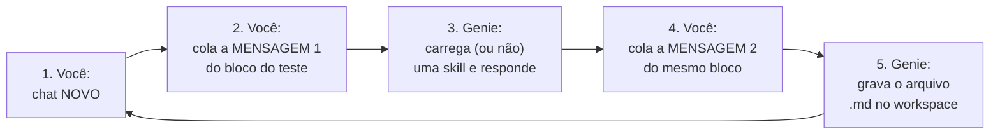

# Roteiro de forward tests — guia completo passo a passo

> **Nomenclatura da época.** Os nomes `x_*` e `hub-ml-*` neste registro são
> os que existiam na data. A tradução para os nomes atuais está na tabela de
> correspondência do [ADR-0006](../../decisions/ADR-0006-identidade-hub.md);
> este documento não é reescrito porque descreve o que foi observado, não o
> estado atual.

> **Antes de reusar este roteiro.** Os prompts abaixo trazem o caminho do
> workspace do laboratório, com o username de quem escreveu o roteiro — são 44
> ocorrências. Eles ficam literais de propósito, para continuarem coláveis sem
> edição por quem os escreveu. **Se você não é essa pessoa**, substitua o trecho
> `/Workspace/Users/<...>/hub_lab/` pelo seu antes de colar: sem isso, os testes
> tentam escrever na pasta de outra pessoa. É a mesma regra que o produto ensina
> em `hub_snippets/README.md` — nunca copie um e-mail de um exemplo.

## 1. O que é este teste e por que ele existe

As 13 skills `hub-ml-*` já estão publicadas no seu workspace Databricks Free.
Quando você conversa com o Genie Code, ele decide **sozinho** qual skill carregar,
lendo apenas o campo `description` de cada `SKILL.md`. Se duas descriptions se
parecem demais, ele carrega a skill errada — e você recebe um relatório de
monitoramento quando pediu um teste estatístico, por exemplo.

Este teste verifica exatamente isso: **o roteamento**. Para cada skill fazemos
3 perguntas:

| Caso | O que verifica | Passa quando |
|---|---|---|
| **P** (positivo) | um pedido típico da skill a aciona? | a skill alvo é carregada |
| **N** (negativo) | um pedido *parecido, mas de outra skill* NÃO a aciona? | a skill alvo **não** é carregada |
| **M** (menção) | `@nome-da-skill` força a seleção? | a skill alvo é carregada |

São 13 skills × 3 casos = **39 testes**, dos quais 36 já estão concluídos. Os casos negativos foram desenhados
sobre as zonas de colisão reais entre as descriptions (drift aparece em 3 skills,
"explicar notebook" em 2, "materializar features" em 2...) — são os testes que
mais ensinam.

Duas coisas que este teste **não** avalia: a qualidade da resposta do Genie
(irrelevante aqui) e a execução de código. As tabelas citadas nos prompts
(`catalogo.crm.*`) são **fictícias de propósito**: o roteamento acontece antes
de qualquer tabela ser tocada, nada é executado, nenhum compute é consumido.
Se o Genie disser "não encontrei a tabela", tudo bem — anote a skill carregada
e siga.

## 2. Quem faz o quê

| Ator | Responsabilidade |
|---|---|
| **Você** | abrir um chat novo por teste e colar as 2 mensagens prontas do bloco do teste |
| **Genie Code** | escolher a skill (Mensagem 1) e gravar o resultado em um arquivo no workspace (Mensagem 2) |
| **Claude** | criou este roteiro; depois coleta os arquivos via CLI, preenche a tabela de resultados, diagnostica as colisões, corrige as descriptions e republica para a rodada 2 |

## 3. Antes de começar (já está tudo pronto)

- ✅ A réplica atual do ambiente está publicada no workspace (com as correções do smoke test).
- A pasta `/Users/<username>/hub_lab/forward_tests/` é criada na primeira gravação; não é preciso criá-la antes.
- Deixe este roteiro aberto de um lado e o Databricks do outro.

## 4. O ciclo de um teste (repita para cada caso pendente)



**Passo 1 — chat novo.** No painel do Genie Code, clique em novo chat. Isso é
obrigatório a cada teste: skills não recarregam em chat usado, e um chat
reaproveitado contamina o teste seguinte.

**Passo 2 — Mensagem 1.** Copie a "Mensagem 1" do bloco do teste (seção 6) e
envie. Nada mais junto: sem anexos, sem comentários seus.

**Passo 3 — Genie responde.** Você não precisa ler a resposta com atenção. Se
quiser, observe o indicador de skill na interface (é a verdade definitiva em
caso de dúvida).

**Passo 4 — Mensagem 2.** No **mesmo chat**, copie a "Mensagem 2" do mesmo
bloco e envie. O ID do teste já está preenchido nela — é só copiar e colar.

Por que em duas mensagens? Porque o roteamento acontece na Mensagem 1 — se o
pedido de registro estivesse nela, as palavras "skill" e "criar arquivo"
puxariam `hub-ml-auditoria-skills` e `hub-ml-pipeline-builder`, contaminando
o teste. Na Mensagem 2 a escolha já aconteceu; o pedido é inofensivo.

**Passo 5 — Genie grava o arquivo.** Pronto, próximo teste. Se o Genie disser
que não consegue criar arquivos, sem problema: ele responderá a linha no chat —
copie-a para um bloco de notas e, no final, cole todas de uma vez para o Claude.

> **Dica no 1º teste:** depois da Mensagem 2 do teste `01P`, avise o Claude
> ("criou?"). Ele confere pela CLI em segundos se o arquivo apareceu — assim
> você já sabe se o plano A (arquivos) funciona ou se segue no plano B (colar
> linhas no final).

## 5. Depois dos testes — o que acontece

1. **Você** avisa o Claude: "terminei" (ou cola as linhas, se foi o plano B).
2. **Claude** coleta os arquivos via CLI, preenche
   `resultados/<data>_rodada1.md`, e classifica cada teste em PASS/FAIL.
3. **Claude** ajusta a `description` de cada skill que colidiu (no
   `ambiente_fonte/`), valida, re-renderiza o simulado e republica no workspace.
4. **Você** repete **apenas os testes que falharem** (chats novos) — rodada 2.
5. Meta: **39/39** PASS → gate fechado → próximo passo é o runbook de replicação.
   Os 36 primeiros já fecharam em 14/08; faltam os três da Skill 13.
   para o trabalho.

---

## 6. Os testes — copie a Mensagem 1, depois a Mensagem 2

> **39 no total**: 36 das doze skills originais, já concluídos com
> 36/36 PASS, mais os **três da Skill 13**, que são os únicos pendentes.
> Se você está aqui só para testar a skill nova, vá direto à Skill 13.

Nos negativos, indicamos qual skill *idealmente* seria carregada no lugar.

> **Esta seção já foi executada** (rodada 1, 2026-08-14: 33 PASS / 2 FAIL /
> 1 pendente — ver [resultados](resultados/2026-08-14_rodada1.md)). Mantida
> como histórico; **não precisa refazer**. O que falta executar está na
> **seção 7 (RODADA 2)**, com apenas 5 testes.

### Skill 1 — hub-ml-eda-profissional

#### `01P` — positivo (esperado: carregar `hub-ml-eda-profissional`)

Mensagem 1:
```text
Faça uma EDA completa da tabela catalogo.crm.clientes_pf: granularidade, chaves, qualidade de dados, distribuições e um relatório executivo ao final.
```
Mensagem 2:
```text
Registre o resultado: crie o arquivo /Workspace/Users/<username-free>/hub_lab/forward_tests/01P.md com uma única linha, no formato "01P: <nome-da-skill-que-voce-carregou-nesta-conversa, ou 'nenhuma'>". Se não conseguir criar arquivos, apenas responda essa única linha no chat.
```

#### `01N` — negativo (esperado: NÃO carregar; ideal: `hub-ml-cross-eda-ml`)

Mensagem 1:
```text
Já tenho os EDAs prontos de clientes, transações e produtos. Consolide os três, avalie se os joins são viáveis e diga se estou pronto para modelar.
```
Mensagem 2:
```text
Registre o resultado: crie o arquivo /Workspace/Users/<username-free>/hub_lab/forward_tests/01N.md com uma única linha, no formato "01N: <nome-da-skill-que-voce-carregou-nesta-conversa, ou 'nenhuma'>". Se não conseguir criar arquivos, apenas responda essa única linha no chat.
```

#### `01M` — menção (esperado: carregar)

Mensagem 1:
```text
@hub-ml-eda-profissional faça o perfil inicial da tabela catalogo.crm.contas.
```
Mensagem 2:
```text
Registre o resultado: crie o arquivo /Workspace/Users/<username-free>/hub_lab/forward_tests/01M.md com uma única linha, no formato "01M: <nome-da-skill-que-voce-carregou-nesta-conversa, ou 'nenhuma'>". Se não conseguir criar arquivos, apenas responda essa única linha no chat.
```

### Skill 2 — hub-ml-cross-eda-ml

#### `02P` — positivo (esperado: carregar `hub-ml-cross-eda-ml`)

Mensagem 1:
```text
Cruze os resultados dos EDAs das tabelas clientes e cartões, avalie a viabilidade do join por CPF, o alinhamento temporal e a prontidão para ML.
```
Mensagem 2:
```text
Registre o resultado: crie o arquivo /Workspace/Users/<username-free>/hub_lab/forward_tests/02P.md com uma única linha, no formato "02P: <nome-da-skill-que-voce-carregou-nesta-conversa, ou 'nenhuma'>". Se não conseguir criar arquivos, apenas responda essa única linha no chat.
```

#### `02N` — negativo (esperado: NÃO carregar; ideal: `hub-ml-eda-profissional`)

Mensagem 1:
```text
Explore a tabela catalogo.crm.cartoes e me diga como está a qualidade e a distribuição das variáveis.
```
Mensagem 2:
```text
Registre o resultado: crie o arquivo /Workspace/Users/<username-free>/hub_lab/forward_tests/02N.md com uma única linha, no formato "02N: <nome-da-skill-que-voce-carregou-nesta-conversa, ou 'nenhuma'>". Se não conseguir criar arquivos, apenas responda essa única linha no chat.
```

#### `02M` — menção (esperado: carregar)

Mensagem 1:
```text
@hub-ml-cross-eda-ml avalie a complementaridade de sinal entre as fontes A e B.
```
Mensagem 2:
```text
Registre o resultado: crie o arquivo /Workspace/Users/<username-free>/hub_lab/forward_tests/02M.md com uma única linha, no formato "02M: <nome-da-skill-que-voce-carregou-nesta-conversa, ou 'nenhuma'>". Se não conseguir criar arquivos, apenas responda essa única linha no chat.
```

### Skill 3 — hub-ml-feature-engineering

#### `03P` — positivo (esperado: carregar `hub-ml-feature-engineering`)

Mensagem 1:
```text
Monte o plano de features para prever churn de previdência, com joins point-in-time, prevenção de leakage e materialização em feature table no Unity Catalog.
```
Mensagem 2:
```text
Registre o resultado: crie o arquivo /Workspace/Users/<username-free>/hub_lab/forward_tests/03P.md com uma única linha, no formato "03P: <nome-da-skill-que-voce-carregou-nesta-conversa, ou 'nenhuma'>". Se não conseguir criar arquivos, apenas responda essa única linha no chat.
```

#### `03N` — negativo (esperado: NÃO carregar; ideal: `hub-ml-baseline-ml`)

Mensagem 1:
```text
Treine um primeiro modelo LightGBM para churn com split temporal e registre tudo no MLflow.
```
Mensagem 2:
```text
Registre o resultado: crie o arquivo /Workspace/Users/<username-free>/hub_lab/forward_tests/03N.md com uma única linha, no formato "03N: <nome-da-skill-que-voce-carregou-nesta-conversa, ou 'nenhuma'>". Se não conseguir criar arquivos, apenas responda essa única linha no chat.
```

#### `03M` — menção (esperado: carregar)

Mensagem 1:
```text
@hub-ml-feature-engineering especifique features de recência e frequência para o target churn_90d.
```
Mensagem 2:
```text
Registre o resultado: crie o arquivo /Workspace/Users/<username-free>/hub_lab/forward_tests/03M.md com uma única linha, no formato "03M: <nome-da-skill-que-voce-carregou-nesta-conversa, ou 'nenhuma'>". Se não conseguir criar arquivos, apenas responda essa única linha no chat.
```

### Skill 4 — hub-ml-validacao-estatistica

#### `04P` — positivo (esperado: carregar `hub-ml-validacao-estatistica`)

Mensagem 1:
```text
Antes da regressão, verifique normalidade dos resíduos, homocedasticidade e VIF, com amostragem reprodutível e effect size.
```
Mensagem 2:
```text
Registre o resultado: crie o arquivo /Workspace/Users/<username-free>/hub_lab/forward_tests/04P.md com uma única linha, no formato "04P: <nome-da-skill-que-voce-carregou-nesta-conversa, ou 'nenhuma'>". Se não conseguir criar arquivos, apenas responda essa única linha no chat.
```

#### `04N` — negativo, colisão "drift" (esperado: NÃO carregar; ideal: `hub-ml-monitoramento-modelo`)

Mensagem 1:
```text
O PSI das features do modelo em produção subiu nos últimos dois meses. Configure alertas e me diga se é hora de retreinar.
```
Mensagem 2:
```text
Registre o resultado: crie o arquivo /Workspace/Users/<username-free>/hub_lab/forward_tests/04N.md com uma única linha, no formato "04N: <nome-da-skill-que-voce-carregou-nesta-conversa, ou 'nenhuma'>". Se não conseguir criar arquivos, apenas responda essa única linha no chat.
```

#### `04M` — menção (esperado: carregar)

Mensagem 1:
```text
@hub-ml-validacao-estatistica compare as duas amostras e diga se a diferença é significativa.
```
Mensagem 2:
```text
Registre o resultado: crie o arquivo /Workspace/Users/<username-free>/hub_lab/forward_tests/04M.md com uma única linha, no formato "04M: <nome-da-skill-que-voce-carregou-nesta-conversa, ou 'nenhuma'>". Se não conseguir criar arquivos, apenas responda essa única linha no chat.
```

### Skill 5 — hub-ml-baseline-ml

#### `05P` — positivo (esperado: carregar `hub-ml-baseline-ml`)

Mensagem 1:
```text
Treine baselines de classificação comparando LightGBM e XGBoost com split temporal anti-leakage, MLflow e scorecard final.
```
Mensagem 2:
```text
Registre o resultado: crie o arquivo /Workspace/Users/<username-free>/hub_lab/forward_tests/05P.md com uma única linha, no formato "05P: <nome-da-skill-que-voce-carregou-nesta-conversa, ou 'nenhuma'>". Se não conseguir criar arquivos, apenas responda essa única linha no chat.
```

#### `05N` — negativo (esperado: NÃO carregar; ideal: `hub-ml-explainability`)

Mensagem 1:
```text
Quais features mais pesam no score do meu modelo de propensão? Quero a visão global e dois exemplos locais para o comitê.
```
Mensagem 2:
```text
Registre o resultado: crie o arquivo /Workspace/Users/<username-free>/hub_lab/forward_tests/05N.md com uma única linha, no formato "05N: <nome-da-skill-que-voce-carregou-nesta-conversa, ou 'nenhuma'>". Se não conseguir criar arquivos, apenas responda essa única linha no chat.
```

#### `05M` — menção (esperado: carregar)

Mensagem 1:
```text
@hub-ml-baseline-ml rode a suite de baseline para o target inadimplencia_90d.
```
Mensagem 2:
```text
Registre o resultado: crie o arquivo /Workspace/Users/<username-free>/hub_lab/forward_tests/05M.md com uma única linha, no formato "05M: <nome-da-skill-que-voce-carregou-nesta-conversa, ou 'nenhuma'>". Se não conseguir criar arquivos, apenas responda essa única linha no chat.
```

### Skill 6 — hub-ml-explainability

#### `06P` — positivo (esperado: carregar `hub-ml-explainability`)

Mensagem 1:
```text
Gere a análise SHAP global e local do modelo de propensão a consórcio e um model card com limitações para público executivo.
```
Mensagem 2:
```text
Registre o resultado: crie o arquivo /Workspace/Users/<username-free>/hub_lab/forward_tests/06P.md com uma única linha, no formato "06P: <nome-da-skill-que-voce-carregou-nesta-conversa, ou 'nenhuma'>". Se não conseguir criar arquivos, apenas responda essa única linha no chat.
```

#### `06N` — negativo (esperado: NÃO carregar; ideal: `hub-ml-monitoramento-modelo`)

Mensagem 1:
```text
Implemente o acompanhamento mensal de performance do modelo com alertas de degradação e painel.
```
Mensagem 2:
```text
Registre o resultado: crie o arquivo /Workspace/Users/<username-free>/hub_lab/forward_tests/06N.md com uma única linha, no formato "06N: <nome-da-skill-que-voce-carregou-nesta-conversa, ou 'nenhuma'>". Se não conseguir criar arquivos, apenas responda essa única linha no chat.
```

#### `06M` — menção (esperado: carregar)

Mensagem 1:
```text
@hub-ml-explainability explique os drivers do score do cliente 12345 (dados sintéticos).
```
Mensagem 2:
```text
Registre o resultado: crie o arquivo /Workspace/Users/<username-free>/hub_lab/forward_tests/06M.md com uma única linha, no formato "06M: <nome-da-skill-que-voce-carregou-nesta-conversa, ou 'nenhuma'>". Se não conseguir criar arquivos, apenas responda essa única linha no chat.
```

### Skill 7 — hub-ml-monitoramento-modelo

#### `07P` — positivo (esperado: carregar `hub-ml-monitoramento-modelo`)

Mensagem 1:
```text
Implemente monitoramento do modelo de churn: qualidade de dados, drift com PSI, performance mensal, calibração e regra de decisão de retreino.
```
Mensagem 2:
```text
Registre o resultado: crie o arquivo /Workspace/Users/<username-free>/hub_lab/forward_tests/07P.md com uma única linha, no formato "07P: <nome-da-skill-que-voce-carregou-nesta-conversa, ou 'nenhuma'>". Se não conseguir criar arquivos, apenas responda essa única linha no chat.
```

#### `07N` — negativo, colisão "KS/drift" (esperado: NÃO carregar; ideal: `hub-ml-validacao-estatistica`)

Mensagem 1:
```text
Num estudo pontual, rode um teste KS para comparar a distribuição de renda entre dois grupos de clientes e me dê intervalo de confiança.
```
Mensagem 2:
```text
Registre o resultado: crie o arquivo /Workspace/Users/<username-free>/hub_lab/forward_tests/07N.md com uma única linha, no formato "07N: <nome-da-skill-que-voce-carregou-nesta-conversa, ou 'nenhuma'>". Se não conseguir criar arquivos, apenas responda essa única linha no chat.
```

#### `07M` — menção (esperado: carregar)

Mensagem 1:
```text
@hub-ml-monitoramento-modelo desenhe os thresholds de alerta para o modelo em produção.
```
Mensagem 2:
```text
Registre o resultado: crie o arquivo /Workspace/Users/<username-free>/hub_lab/forward_tests/07M.md com uma única linha, no formato "07M: <nome-da-skill-que-voce-carregou-nesta-conversa, ou 'nenhuma'>". Se não conseguir criar arquivos, apenas responda essa única linha no chat.
```

### Skill 8 — hub-ml-pipeline-builder

#### `08P` — positivo (esperado: carregar `hub-ml-pipeline-builder`)

Mensagem 1:
```text
Desenhe um pipeline bronze/silver/gold com Lakeflow Spark Declarative Pipelines, expectations de qualidade e um bundle com targets dev e prod.
```
Mensagem 2:
```text
Registre o resultado: crie o arquivo /Workspace/Users/<username-free>/hub_lab/forward_tests/08P.md com uma única linha, no formato "08P: <nome-da-skill-que-voce-carregou-nesta-conversa, ou 'nenhuma'>". Se não conseguir criar arquivos, apenas responda essa única linha no chat.
```

#### `08N` — negativo, colisão "materialização" (esperado: NÃO carregar; ideal: `hub-ml-feature-engineering`)

Mensagem 1:
```text
Materialize as features do modelo de churn numa feature table do Unity Catalog garantindo reuso idêntico entre treino e inferência.
```
Mensagem 2:
```text
Registre o resultado: crie o arquivo /Workspace/Users/<username-free>/hub_lab/forward_tests/08N.md com uma única linha, no formato "08N: <nome-da-skill-que-voce-carregou-nesta-conversa, ou 'nenhuma'>". Se não conseguir criar arquivos, apenas responda essa única linha no chat.
```

#### `08M` — menção (esperado: carregar)

Mensagem 1:
```text
@hub-ml-pipeline-builder estruture a orquestração dos notebooks de scoring com Lakeflow Jobs.
```
Mensagem 2:
```text
Registre o resultado: crie o arquivo /Workspace/Users/<username-free>/hub_lab/forward_tests/08M.md com uma única linha, no formato "08M: <nome-da-skill-que-voce-carregou-nesta-conversa, ou 'nenhuma'>". Se não conseguir criar arquivos, apenas responda essa única linha no chat.
```

### Skill 9 — hub-ml-analise-safra

#### `09P` — positivo (esperado: carregar `hub-ml-analise-safra`)

Mensagem 1:
```text
Monte a análise de safras de originação de crédito com MOB, curvas de maturação, triângulo safra-calendário e alertas de deterioração.
```
Mensagem 2:
```text
Registre o resultado: crie o arquivo /Workspace/Users/<username-free>/hub_lab/forward_tests/09P.md com uma única linha, no formato "09P: <nome-da-skill-que-voce-carregou-nesta-conversa, ou 'nenhuma'>". Se não conseguir criar arquivos, apenas responda essa única linha no chat.
```

#### `09N` — negativo, colisão "deterioração" (esperado: NÃO carregar; ideal: `hub-ml-monitoramento-modelo`)

Mensagem 1:
```text
A inadimplência do portfólio subiu neste trimestre. O modelo de crédito degradou? Monte o acompanhamento contínuo com alertas.
```
Mensagem 2:
```text
Registre o resultado: crie o arquivo /Workspace/Users/<username-free>/hub_lab/forward_tests/09N.md com uma única linha, no formato "09N: <nome-da-skill-que-voce-carregou-nesta-conversa, ou 'nenhuma'>". Se não conseguir criar arquivos, apenas responda essa única linha no chat.
```

#### `09M` — menção (esperado: carregar)

Mensagem 1:
```text
@hub-ml-analise-safra compare as safras de 2024 e 2025 em MOB equivalente.
```
Mensagem 2:
```text
Registre o resultado: crie o arquivo /Workspace/Users/<username-free>/hub_lab/forward_tests/09M.md com uma única linha, no formato "09M: <nome-da-skill-que-voce-carregou-nesta-conversa, ou 'nenhuma'>". Se não conseguir criar arquivos, apenas responda essa única linha no chat.
```

### Skill 10 — hub-ml-comentar-notebook

#### `10P` — positivo (esperado: carregar `hub-ml-comentar-notebook`)

Mensagem 1:
```text
Adicione células %md antes e depois de cada bloco deste notebook de EDA, explicando objetivo, entradas, resultado e próximo passo, sem poluir o fluxo.
```
Mensagem 2:
```text
Registre o resultado: crie o arquivo /Workspace/Users/<username-free>/hub_lab/forward_tests/10P.md com uma única linha, no formato "10P: <nome-da-skill-que-voce-carregou-nesta-conversa, ou 'nenhuma'>". Se não conseguir criar arquivos, apenas responda essa única linha no chat.
```

#### `10N` — negativo, colisão "explicar" (esperado: NÃO carregar; ideal: `hub-ml-tutor-databricks`)

Mensagem 1:
```text
Me explique linha a linha o que este notebook PySpark faz, como se fosse uma aula para quem está aprendendo Spark.
```
Mensagem 2:
```text
Registre o resultado: crie o arquivo /Workspace/Users/<username-free>/hub_lab/forward_tests/10N.md com uma única linha, no formato "10N: <nome-da-skill-que-voce-carregou-nesta-conversa, ou 'nenhuma'>". Se não conseguir criar arquivos, apenas responda essa única linha no chat.
```

#### `10M` — menção (esperado: carregar)

Mensagem 1:
```text
@hub-ml-comentar-notebook documente este notebook para revisão do time.
```
Mensagem 2:
```text
Registre o resultado: crie o arquivo /Workspace/Users/<username-free>/hub_lab/forward_tests/10M.md com uma única linha, no formato "10M: <nome-da-skill-que-voce-carregou-nesta-conversa, ou 'nenhuma'>". Se não conseguir criar arquivos, apenas responda essa única linha no chat.
```

### Skill 11 — hub-ml-tutor-databricks

#### `11P` — positivo (esperado: carregar `hub-ml-tutor-databricks`)

Mensagem 1:
```text
Me dê uma aula sobre este stack trace do Spark: o que causou o erro, como corrigir e uma analogia para eu nunca mais esquecer.
```
Mensagem 2:
```text
Registre o resultado: crie o arquivo /Workspace/Users/<username-free>/hub_lab/forward_tests/11P.md com uma única linha, no formato "11P: <nome-da-skill-que-voce-carregou-nesta-conversa, ou 'nenhuma'>". Se não conseguir criar arquivos, apenas responda essa única linha no chat.
```

#### `11N` — negativo (esperado: NÃO carregar; ideal: `hub-ml-comentar-notebook`)

Mensagem 1:
```text
Adicione markdown profissional de documentação neste notebook para o time entender cada etapa.
```
Mensagem 2:
```text
Registre o resultado: crie o arquivo /Workspace/Users/<username-free>/hub_lab/forward_tests/11N.md com uma única linha, no formato "11N: <nome-da-skill-que-voce-carregou-nesta-conversa, ou 'nenhuma'>". Se não conseguir criar arquivos, apenas responda essa única linha no chat.
```

#### `11M` — menção (esperado: carregar)

Mensagem 1:
```text
@hub-ml-tutor-databricks explique a diferença entre cache() e persist() com exemplos.
```
Mensagem 2:
```text
Registre o resultado: crie o arquivo /Workspace/Users/<username-free>/hub_lab/forward_tests/11M.md com uma única linha, no formato "11M: <nome-da-skill-que-voce-carregou-nesta-conversa, ou 'nenhuma'>". Se não conseguir criar arquivos, apenas responda essa única linha no chat.
```

### Skill 12 — hub-ml-auditoria-skills

#### `12P` — positivo (esperado: carregar `hub-ml-auditoria-skills`)

Mensagem 1:
```text
Audite este relatório de EDA contra o contrato da skill hub-ml-eda-profissional: completude, reprodutibilidade e score final com prioridades.
```
Mensagem 2:
```text
Registre o resultado: crie o arquivo /Workspace/Users/<username-free>/hub_lab/forward_tests/12P.md com uma única linha, no formato "12P: <nome-da-skill-que-voce-carregou-nesta-conversa, ou 'nenhuma'>". Se não conseguir criar arquivos, apenas responda essa única linha no chat.
```

#### `12N` — negativo (esperado: NÃO carregar; ideal: `hub-ml-eda-profissional`)

Mensagem 1:
```text
Faça a análise exploratória da tabela catalogo.crm.propostas com foco em qualidade.
```
Mensagem 2:
```text
Registre o resultado: crie o arquivo /Workspace/Users/<username-free>/hub_lab/forward_tests/12N.md com uma única linha, no formato "12N: <nome-da-skill-que-voce-carregou-nesta-conversa, ou 'nenhuma'>". Se não conseguir criar arquivos, apenas responda essa única linha no chat.
```

#### `12M` — menção (esperado: carregar)

Mensagem 1:
```text
@hub-ml-auditoria-skills avalie se a pasta da skill hub-ml-analise-safra segue o padrão Agent Skills.
```
Mensagem 2:
```text
Registre o resultado: crie o arquivo /Workspace/Users/<username-free>/hub_lab/forward_tests/12M.md com uma única linha, no formato "12M: <nome-da-skill-que-voce-carregou-nesta-conversa, ou 'nenhuma'>". Se não conseguir criar arquivos, apenas responda essa única linha no chat.
```

### Skill 13 — hub-ml-criar-objeto

> **Acrescentada na Sprint 11 (2026-08-17), ainda não testada.** É a única skill
> cujo vocabulário — criar, adicionar, padronizar — roça o de todas as vizinhas.
> **O caso `13N` é o mais importante do roteiro inteiro**: se ela roubar a vez de
> quem faz análise, o pedido de estatística vira conversa sobre formato de pasta.

#### `13P` — positivo (esperado: carregar `hub-ml-criar-objeto`)

Mensagem 1:
```text
Quero criar um snippet novo no Hub para calcular taxa de resposta de campanha. Qual é o formato e o que preciso entregar junto?
```
Mensagem 2:
```text
Registre o resultado: crie o arquivo /Workspace/Users/<username-free>/hub_lab/forward_tests/13P.md com uma única linha, no formato "13P: <nome-da-skill-que-voce-carregou-nesta-conversa, ou 'nenhuma'>". Se não conseguir criar arquivos, apenas responda essa única linha no chat.
```

#### `13N` — negativo (esperado: NÃO carregar; ideal: `hub-ml-monitoramento-modelo`)

> O ideal aqui foi corrigido depois de uma auditoria. A `description` de
> `hub-ml-monitoramento-modelo` contém **PSI** e **alerta** literalmente, e o
> caso `04N` deste mesmo roteiro, com enunciado quase idêntico, já declara esse
> ideal. `hub-ml-analise-safra` é resultado **aceitável** — ela dispara em
> "mencionar safra", que é o único gatilho incondicional das treze.
>
> **A colisão real a observar é `monitoramento-modelo` × `analise-safra`**, e ela
> é anterior a esta sprint: o `13N` a expõe, não a cria.

Mensagem 1:
```text
Como calculo o PSI entre a safra de janeiro e a de junho, e a partir de que valor devo me preocupar?
```
Mensagem 2:
```text
Registre o resultado: crie o arquivo /Workspace/Users/<username-free>/hub_lab/forward_tests/13N.md com uma única linha, no formato "13N: <nome-da-skill-que-voce-carregou-nesta-conversa, ou 'nenhuma'>". Se não conseguir criar arquivos, apenas responda essa única linha no chat.
```

#### `13M` — menção (esperado: carregar)

Mensagem 1:
```text
@hub-ml-criar-objeto qual template eu uso para um utilitário que recebe o nome de uma tabela e devolve um diagnóstico de qualidade?
```
Mensagem 2:
```text
Registre o resultado: crie o arquivo /Workspace/Users/<username-free>/hub_lab/forward_tests/13M.md com uma única linha, no formato "13M: <nome-da-skill-que-voce-carregou-nesta-conversa, ou 'nenhuma'>". Se não conseguir criar arquivos, apenas responda essa única linha no chat.
```

---

## 7. RODADA 2 — refaça apenas estes 5 testes

> **✅ CONCLUÍDA — 5/5 PASS.** Com ela, o gate de roteamento fechou em
> **36/36** (ver [resultados da rodada 2](resultados/2026-08-14_rodada2.md)).
> Este roteiro fica preservado como histórico e como base para a próxima
> rodada, que só será necessária se alguma `description` for alterada.

Mesmo procedimento de sempre: **chat novo → Mensagem 1 → Mensagem 2**. Os IDs
aqui terminam em `-r2`, então as evidências da rodada 1 não são sobrescritas.

O que mudou nos testes 10 e 11: na rodada 1 os prompts citavam "este notebook"
e "este stack trace" sem que existissem no chat, e o Genie não carregou skill
nenhuma. Agora o artefato vem **embutido no próprio prompt**.

### `07M-r2` — menção a `hub-ml-monitoramento-modelo`

*(na rodada 1 o teste foi feito, mas o arquivo de registro não foi gravado)*

Mensagem 1:
```text
@hub-ml-monitoramento-modelo desenhe os thresholds de alerta para o modelo em produção.
```
Mensagem 2:
```text
Registre o resultado: crie o arquivo /Workspace/Users/<username-free>/hub_lab/forward_tests/07M-r2.md com uma única linha, no formato "07M-r2: <nome-da-skill-que-voce-carregou-nesta-conversa, ou 'nenhuma'>". Se não conseguir criar arquivos, apenas responda essa única linha no chat.
```

### `10P-r2` — positivo (esperado: carregar `hub-ml-comentar-notebook`)

Mensagem 1:
```text
Este é um bloco do meu notebook de EDA:

df = spark.table("catalogo.crm.clientes_pf")
resumo = df.groupBy("uf").agg(F.count("*").alias("qtd"), F.avg("renda").alias("renda_media"))
display(resumo.orderBy(F.desc("qtd")).limit(20))

Adicione células %md antes e depois desse bloco, explicando objetivo, entradas, resultado e próximo passo, sem poluir o fluxo.
```
Mensagem 2:
```text
Registre o resultado: crie o arquivo /Workspace/Users/<username-free>/hub_lab/forward_tests/10P-r2.md com uma única linha, no formato "10P-r2: <nome-da-skill-que-voce-carregou-nesta-conversa, ou 'nenhuma'>". Se não conseguir criar arquivos, apenas responda essa única linha no chat.
```

### `10N-r2` — negativo, colisão "explicar" (esperado: NÃO carregar; ideal: `hub-ml-tutor-databricks`)

Mensagem 1:
```text
Estou aprendendo Spark e encontrei este código:

df = spark.table("catalogo.crm.clientes_pf")
resumo = df.groupBy("uf").agg(F.count("*").alias("qtd"), F.avg("renda").alias("renda_media"))
display(resumo.orderBy(F.desc("qtd")).limit(20))

Me explique linha a linha o que ele faz, como se fosse uma aula para quem está começando.
```
Mensagem 2:
```text
Registre o resultado: crie o arquivo /Workspace/Users/<username-free>/hub_lab/forward_tests/10N-r2.md com uma única linha, no formato "10N-r2: <nome-da-skill-que-voce-carregou-nesta-conversa, ou 'nenhuma'>". Se não conseguir criar arquivos, apenas responda essa única linha no chat.
```

### `11P-r2` — positivo (esperado: carregar `hub-ml-tutor-databricks`)

Mensagem 1:
```text
Meu job falhou com este erro:

org.apache.spark.SparkException: Job aborted due to stage failure: Task 14 in stage 8.0 failed 4 times, most recent failure: Lost task 14.3 in stage 8.0: ExecutorLostFailure (executor 6 exited caused by one of the running tasks) Reason: Container killed by YARN for exceeding memory limits. 12.4 GB of 12 GB physical memory used.
Caused by: java.lang.OutOfMemoryError: Java heap space

Me dê uma aula sobre isso: o que causou o erro, como corrigir e uma analogia para eu nunca mais esquecer.
```
Mensagem 2:
```text
Registre o resultado: crie o arquivo /Workspace/Users/<username-free>/hub_lab/forward_tests/11P-r2.md com uma única linha, no formato "11P-r2: <nome-da-skill-que-voce-carregou-nesta-conversa, ou 'nenhuma'>". Se não conseguir criar arquivos, apenas responda essa única linha no chat.
```

### `11N-r2` — negativo (esperado: NÃO carregar; ideal: `hub-ml-comentar-notebook`)

Mensagem 1:
```text
Este é o trecho final do meu notebook de scoring:

scores = modelo.transform(features)
scores.write.mode("overwrite").saveAsTable("catalogo.crm.scores_propensao")

Adicione markdown profissional de documentação em volta dele para o time entender cada etapa.
```
Mensagem 2:
```text
Registre o resultado: crie o arquivo /Workspace/Users/<username-free>/hub_lab/forward_tests/11N-r2.md com uma única linha, no formato "11N-r2: <nome-da-skill-que-voce-carregou-nesta-conversa, ou 'nenhuma'>". Se não conseguir criar arquivos, apenas responda essa única linha no chat.
```

Ao terminar os 5, avise o Claude: ele coleta os arquivos `-r2`, fecha a tabela
da rodada 2 e conclui o gate de roteamento.

---

## 8. Referências

- Método e critérios de veredito: `.claude/skills/forward-test-skills/SKILL.md`
- Tabela de resultados (preenchida pelo Claude): `template_resultados.md` →
  `resultados/<data>_rodada<N>.md`
- Se uma skill parecer "defasada" (descrição antiga), faça hard refresh no
  navegador — o metadata das skills fica em cache.
