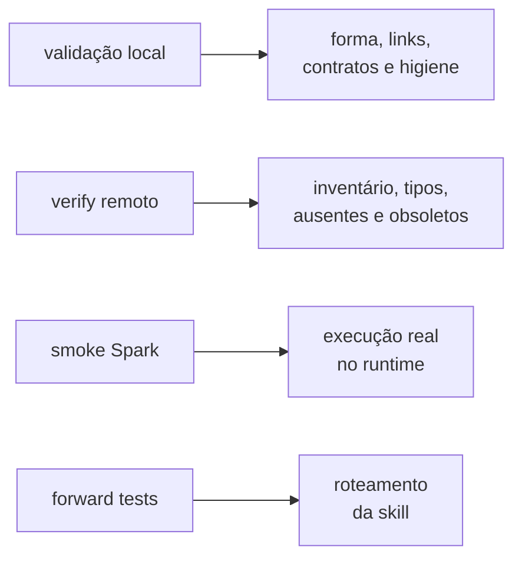

# `tools/` — gates e automação do repositório

> **MANUTENÇÃO · NÃO PUBLICADO.** Estes arquivos rodam na máquina que mantém o
> Git. O usuário do `.assistant` no Databricks não recebe esta pasta.

As ferramentas convertem regras editoriais e arquiteturais em verificações que
podem reprovar uma mudança.

## Comandos por objetivo

| Objetivo | Comando |
|---|---|
| validar fonte e repositório | `python tools/validate_assistant.py` |
| conferir somente saídas locais do README | `python tools/validate_assistant.py --conferir-readme` |
| regenerar o derivado | `python tools/render_simulado.py --write` |
| regenerar SVGs e PNGs dos READMEs | `node tools/render_readme_visuals.mjs` |
| publicar no Free | `python tools/publicar_free.py --execute --profile <free> --expected-host <url-free>` |
| conferir o remoto (inventário e tipos) | `python tools/publicar_free.py --verify --profile <free> --expected-host <url-free>` |
| conferir o remoto **por conteúdo** | `python tools/publicar_free.py --verify --conteudo --profile <free> --expected-host <url-free>` |
| executar smoke no Databricks | importar/submeter `tools/spark_smoke_test.py` |
| criar pacote de auditoria | `python tools/bundle_para_auditoria.py --mode canonical` |
| criar ZIP de implantação | `python tools/bundle_implantacao.py` |

## Ciclo mínimo

```powershell
python tools/validate_assistant.py
python tools/render_simulado.py --write
python tools/publicar_free.py --execute --profile <free> --expected-host <url-free>
python tools/publicar_free.py --verify  --profile <free> --expected-host <url-free>
```

`--execute` altera o workspace e recusa espelho desatualizado antes de escrever.
`--verify` é leitura. Sem `--conteudo` ele compara inventário e tipos: um módulo
com o mesmo nome e o mesmo tipo, porém conteúdo diferente, passaria. Com
`--conteudo` cada objeto é exportado e comparado byte a byte na representação
canônica — só então é possível afirmar equivalência entre local e remoto. A
saída declara o alcance da comparação em toda rodada. Publicar sem verificar não
fecha o gate.

A normalização da comparação é mínima e declarada: fim de linha, e fim de arquivo
apenas em notebook. Comentário, espaço e linha em branco **não** são removidos —
fazê-lo mascararia diferença real. Por isso a saída registra dois hashes: o bruto,
que identifica os bytes do pacote, e o normalizado, que é o único comparável com
o remoto.

## Inventário

| Arquivo | Responsabilidade |
|---|---|
| `readme_objeto_contract.py` | estrutura, links e dispensa monotônica dos READMEs de objeto |
| `validate_assistant.py` | estrutura, YAML, links, Python, contratos, identidade e consistência |
| `render_simulado.py` | recriar o espelho de workspace a partir da fonte |
| `render_readme_visuals.mjs` | gerar fontes SVG e PNGs editoriais dos READMEs |
| `publicar_free.py` | plano, publicação protegida e conferência remota |
| `spark_smoke_test.py` | chamadas funcionais no runtime Databricks |
| `api_publica.py` | extrair API pública por AST e gerar `__init__.py` |
| `notebook_marker.py` | distinguir módulo Python de notebook Databricks |
| `project_policy.py` | centralizar identidade neutra, skills e diretórios gerenciados |
| `tests/test_concierge_integracao.py` | conferir integração do Concierge, referências e igualdade fonte/espelho |
| `bundle_para_auditoria.py` | pacote canônico, de segurança ou completo para revisão |
| `bundle_implantacao.py` | ZIP mínimo sanitizado com manifesto SHA-256 |

Os três módulos de apoio evitam que render, publicação e validação inventem
definições diferentes para o mesmo objeto.

## O que cada gate prova



Nenhum gate substitui o outro:

| Gate | Não prova |
|---|---|
| validação local | execução em Spark ou comportamento conversacional |
| verify remoto | correção do código |
| smoke | ACLs, políticas e runtime do trabalho |
| forward test | qualidade da resposta ou resultado numérico |

## Pacotes de auditoria e implantação

`bundle_para_auditoria.py`:

- `canonical`: fonte e governança vigentes;
- `security`: acrescenta manifesto de todos os caminhos versionados;
- `full`: inclui material congelado permitido pela política.

`bundle_implantacao.py` leva apenas o produto sanitizado e o manifesto. Por
padrão, ambos recusam worktree sujo para não atribuir conteúdo novo ao commit
anterior.

`.artifacts/` é saída local e não fonte de verdade. Um ZIP citado em relatório
datado representa aquele commit; não existe alias “latest”. Para implantar,
gere o bundle novamente em HEAD limpo e confira `source_commit` e os hashes do
`MANIFEST.json`.

## Acrescentar uma verificação

1. Registre no docstring qual defeito real a guarda previne.
2. Construa um mutante que viole a propriedade.
3. Prove que o mutante reprova e que o caso válido passa.
4. Exponha contagem ou evidência que revele varredura vazia.
5. Atualize teste, documentação e `CHANGELOG.md`.

Uma contagem não substitui identidade exata, e “alguma exceção” não substitui a
assinatura esperada do erro.

## Onde continuar

- [Ciclo de vida](../docs/playbooks/ciclo-de-vida.md)
- [Testes e evidências](../docs/testes/README.md)
- [Decisões arquiteturais](../docs/decisions/README.md)
- [Skills operacionais](../.claude/skills/README.md)

## Escopos e evidência após a revisão

`repo_inventory.py` usa caminhos do índice Git para contagens reproduzíveis e
examina extras separadamente. Sem Git, a certificação reprova; um ZIP exportado
não deve ser apresentado como checkout validado. O validador lê o conteúdo atual
na worktree, portanto não certifica sozinho que ela está limpa.

`--conferir-readme` é local. `--conferir-readme-remoto` é opt-in, exige acesso ao
Databricks e confere somente o bloco remoto. Nenhum substitui o verify por conteúdo.

`publicar_free.py --verify --conteudo --relatorio .artifacts/verify.json` grava
origem, hashes completos por arquivo e resultado da comparação. O bundle e o
publicador recusam espelho antigo e extras/caches no pacote. Os hashes agregados
da comparação não são hashes do ZIP. A integração real ainda exige teste Free.

## READMEs de objeto — R01

`python tools/ci_local.py --etapa readmes` executa regressões próprias da nova
guarda e as regressões de convivência com o Concierge. A etapa descobre os
arquivos `tests/test_readme*.py`; o gate completo preserva as quatro etapas
comuns e as três do Concierge, além desta etapa de READMEs. O contrato vem do template do produto; não há lista concorrente de
títulos dentro da ferramenta.

[CONTROLE_MIGRACAO.json](../docs/sprints/readmes_objetos/CONTROLE_MIGRACAO.json)
identifica legados pendentes. Um README entregue precisa sair da dispensa no
mesmo commit. Novos objetos sem README reprovam. A versão anterior diferente do
controle, na história first-parent, delimita o conjunto máximo de dispensas;
na introdução inicial, só objetos existentes na base anterior são elegíveis.
Histórico raso reprova com orientação para usar `fetch-depth: 0`.

Essas verificações não importam helpers nem executam código Markdown. Não provam
clareza, estatística, veracidade de links externos ou compatibilidade de runtime.
Use o [checklist editorial](../ambiente_fonte/.assistant/hub_padroes/readme/checklist_objeto.md)
e registre quem fez a revisão. Código que executa não é sinônimo de análise correta.

## Composição READMEs + Concierge — R02-I

`python tools/ci_local.py` executa oito etapas: `validacao`, `biblioteca`,
`ferramentas`, `transicao`, `readmes`, `concierge-pacote`,
`concierge-regressoes` e `concierge-integracao`. `--etapa` continua aceitando
um nome para diagnóstico isolado; isso não equivale à aprovação do conjunto.

`tests/test_readme_integracao.py` protege contra perda das etapas, colisão de
números ADR e inconsistência das rotas/documentos ao combinar as iniciativas.
Inclui testes negativos; não executa helpers ou conversas. Os testes originais
da R01 e do Concierge foram preservados. As evidências datadas da composição
ficam em [INTEGRACAO_R02.md](../docs/sprints/readmes_objetos/INTEGRACAO_R02.md).
